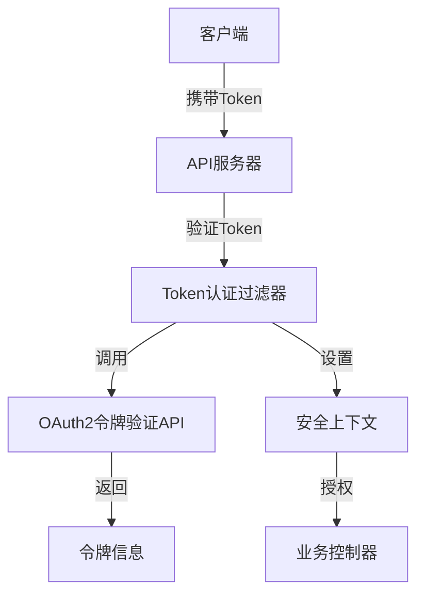
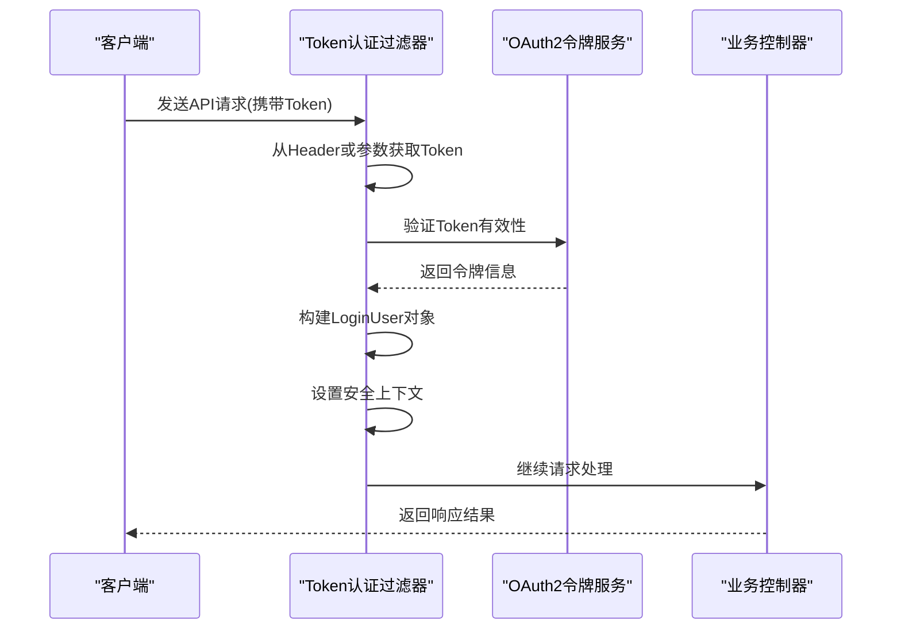

# CSRF防护

<cite>
**本文档引用的文件**   
- [YudaoWebSecurityConfigurerAdapter.java](file://yudao-framework/yudao-spring-boot-starter-security/src/main/java/cn/iocoder/yudao/framework/security/config/YudaoWebSecurityConfigurerAdapter.java)
- [SecurityProperties.java](file://yudao-framework/yudao-spring-boot-starter-security/src/main/java/cn/iocoder/yudao/framework/security/config/SecurityProperties.java)
- [SecurityConfiguration.java](file://yudao-module-infra/yudao-module-infra-biz/src/main/java/cn/iocoder/yudao/module/infra/framework/security/config/SecurityConfiguration.java)
- [TokenAuthenticationFilter.java](file://yudao-framework/yudao-spring-boot-starter-security/src/main/java/cn/iocoder/yudao/framework/security/core/filter/TokenAuthenticationFilter.java)
- [SecurityFrameworkUtils.java](file://yudao-framework/yudao-spring-boot-starter-security/src/main/java/cn/iocoder/yudao/framework/security/core/util/SecurityFrameworkUtils.java)
- [application-integration-test.yaml](file://yudao-module-system/yudao-module-system-biz/src/test-integration/resources/application-integration-test.yaml)
</cite>

## 目录
1. [引言](#引言)
2. [CSRF防护机制概述](#csrf防护机制概述)
3. [Spring Security默认CSRF防护配置](#spring-security默认csrf防护配置)
4. [RESTful API中的CSRF防护实现](#restful-api中的csrf防护实现)
5. [CSRF防护例外配置](#csrf防护例外配置)
6. [CSRF防护测试策略](#csrf防护测试策略)
7. [常见误报处理方案](#常见误报处理方案)
8. [结论](#结论)

## 引言
本文档详细描述了系统对跨站请求伪造（CSRF）攻击的防御机制。系统采用基于Token的无状态认证机制，通过禁用CSRF防护来适应RESTful API架构。文档重点介绍了系统的安全配置方式、认证流程以及相关的安全策略。

## CSRF防护机制概述

系统采用了现代化的无状态安全架构，与传统的基于Session的Web应用不同，本系统主要通过JWT Token进行身份验证，因此不需要启用CSRF防护。

系统的核心安全机制包括：
- 基于Token的身份验证
- 无状态会话管理
- 统一的认证过滤器
- 安全的Token传递机制



**图示来源**
- [TokenAuthenticationFilter.java](file://yudao-framework/yudao-spring-boot-starter-security/src/main/java/cn/iocoder/yudao/framework/security/core/filter/TokenAuthenticationFilter.java)
- [SecurityFrameworkUtils.java](file://yudao-framework/yudao-spring-boot-starter-security/src/main/java/cn/iocoder/yudao/framework/security/core/util/SecurityFrameworkUtils.java)

**本节来源**
- [YudaoWebSecurityConfigurerAdapter.java](file://yudao-framework/yudao-spring-boot-starter-security/src/main/java/cn/iocoder/yudao/framework/security/config/YudaoWebSecurityConfigurerAdapter.java)

## Spring Security默认CSRF防护配置

在本系统中，Spring Security的CSRF防护已被显式禁用，这是由于系统采用了基于Token的无状态认证机制，而非传统的基于Session的认证方式。

CSRF防护禁用的配置位于`YudaoWebSecurityConfigurerAdapter`类中：

```java
httpSecurity
    // 开启跨域
    .cors().and()
    // CSRF 禁用，因为不使用 Session
    .csrf().disable()
    // 基于 token 机制，所以不需要 Session
    .sessionManagement().sessionCreationPolicy(SessionCreationPolicy.STATELESS).and()
```

这种配置方式的合理性在于：
1. **无状态架构**：系统不依赖HTTP Session进行用户状态管理
2. **Token认证**：每个请求都必须携带有效的JWT Token
3. **API优先**：主要服务于RESTful API，而非传统的表单提交

系统通过其他安全机制来弥补CSRF防护的缺失：
- 严格的Token验证
- HTTPS强制使用
- 请求来源验证
- 安全的Token存储建议

**本节来源**
- [YudaoWebSecurityConfigurerAdapter.java](file://yudao-framework/yudao-spring-boot-starter-security/src/main/java/cn/iocoder/yudao/framework/security/config/YudaoWebSecurityConfigurerAdapter.java#L104-L106)

## RESTful API中的CSRF防护实现

对于RESTful API，系统采用了基于Token的认证机制，这是一种更适合API架构的安全方案。

### 认证流程



**图示来源**
- [TokenAuthenticationFilter.java](file://yudao-framework/yudao-spring-boot-starter-security/src/main/java/cn/iocoder/yudao/framework/security/core/filter/TokenAuthenticationFilter.java)
- [SecurityFrameworkUtils.java](file://yudao-framework/yudao-spring-boot-starter-security/src/main/java/cn/iocoder/yudao/framework/security/core/util/SecurityFrameworkUtils.java)

### Token传递机制

系统支持两种Token传递方式：
1. **Header方式**：通过`Authorization`头传递
2. **参数方式**：通过`token`请求参数传递

这种双重机制的设计考虑了不同场景的需求：
- 标准API调用使用Header方式
- WebSocket连接使用参数方式（因为WebSocket无法设置自定义Header）

Token的格式遵循标准的Bearer Token规范：
```
Authorization: Bearer <token_value>
```

**本节来源**
- [TokenAuthenticationFilter.java](file://yudao-framework/yudao-spring-boot-starter-security/src/main/java/cn/iocoder/yudao/framework/security/core/filter/TokenAuthenticationFilter.java#L44-L45)
- [SecurityFrameworkUtils.java](file://yudao-framework/yudao-spring-boot-starter-security/src/main/java/cn/iocoder/yudao/framework/security/core/util/SecurityFrameworkUtils.java#L39-L52)

## CSRF防护例外配置

虽然系统整体上禁用了CSRF防护，但通过精细的URL权限控制实现了类似的功能，确保了系统的安全性。

### 免登录URL配置

系统通过`SecurityProperties`类中的`permitAllUrls`属性配置免登录的URL列表：

```java
/**
 * 免登录的 URL 列表
 */
private List<String> permitAllUrls = Collections.emptyList();
```

这些URL可以通过配置文件进行设置，例如在`application-integration-test.yaml`中：

```yaml
yudao:
  security:
    permit-all-urls:
      - /captcha/get
      - /captcha/check
```

### 特殊路径权限配置

在`SecurityConfiguration`类中，定义了特定路径的访问权限：

```java
// Swagger 接口文档
registry.antMatchers("/v3/api-docs/**").permitAll()
        .antMatchers("/swagger-ui.html").permitAll()
        .antMatchers("/swagger-ui/**").permitAll()
        .antMatchers("/swagger-resources/**").anonymous()
        .antMatchers("/webjars/**").anonymous()
// Spring Boot Actuator 的安全配置
registry.antMatchers("/actuator").anonymous()
        .antMatchers("/actuator/**").anonymous();
// Druid 监控
registry.antMatchers("/druid/**").anonymous();
```

这种配置方式允许特定的监控和文档路径无需认证即可访问，同时保持了核心API的安全性。

**本节来源**
- [SecurityProperties.java](file://yudao-framework/yudao-spring-boot-starter-security/src/main/java/cn/iocoder/yudao/framework/security/config/SecurityProperties.java#L42-L45)
- [SecurityConfiguration.java](file://yudao-module-infra/yudao-module-infra-biz/src/main/java/cn/iocoder/yudao/module/infra/framework/security/config/SecurityConfiguration.java#L25-L35)

## CSRF防护测试策略

尽管系统禁用了传统的CSRF防护，但仍需要进行全面的安全测试来确保系统的整体安全性。

### 测试方法

1. **Token验证测试**
   - 验证缺失Token的请求是否被拒绝
   - 验证无效Token的请求是否被拒绝
   - 验证过期Token的处理机制

2. **权限控制测试**
   - 验证免登录URL的可访问性
   - 验证受保护URL的访问控制
   - 测试不同用户角色的权限差异

3. **安全头测试**
   - 验证CORS配置的正确性
   - 检查响应头中的安全相关字段
   - 测试跨域请求的处理

### 测试工具

推荐使用以下工具进行安全测试：
- Postman：用于API功能和安全测试
- OWASP ZAP：用于自动化安全扫描
- Burp Suite：用于深入的安全分析
- JMeter：用于性能和安全压力测试

### 测试用例示例

```java
@Test
public void testApiWithoutToken() {
    // 当：发送不带Token的请求
    // 则：应该返回401未授权
    mockMvc.perform(get("/api/protected"))
            .andExpect(status().isUnauthorized());
}

@Test
public void testApiWithInvalidToken() {
    // 当：发送带有无效Token的请求
    // 则：应该返回401未授权
    mockMvc.perform(get("/api/protected")
            .header("Authorization", "Bearer invalid_token"))
            .andExpect(status().isUnauthorized());
}
```

**本节来源**
- [TokenAuthenticationFilter.java](file://yudao-framework/yudao-spring-boot-starter-security/src/main/java/cn/iocoder/yudao/framework/security/core/filter/TokenAuthenticationFilter.java)
- [YudaoWebSecurityConfigurerAdapter.java](file://yudao-framework/yudao-spring-boot-starter-security/src/main/java/cn/iocoder/yudao/framework/security/config/YudaoWebSecurityConfigurerAdapter.java)

## 常见误报处理方案

在实际使用中，可能会遇到一些看似安全问题但实际上属于正常行为的情况，以下是常见误报的处理方案。

### Token缺失误报

**现象**：API返回401错误，被误认为是安全漏洞。

**原因**：这是正常的访问控制行为，系统要求所有受保护的API必须携带有效的认证Token。

**解决方案**：
1. 确保客户端在请求时正确添加Token
2. 检查Token的生成和存储是否正确
3. 验证Token的格式是否符合Bearer规范

### 跨域请求误报

**现象**：浏览器控制台显示跨域错误。

**原因**：虽然系统启用了CORS，但某些特定的跨域请求可能仍受限制。

**解决方案**：
1. 检查请求的Origin头是否在允许的范围内
2. 确认预检请求（OPTIONS）是否正确处理
3. 验证CORS配置是否包含必要的头信息

### WebSocket连接问题

**现象**：WebSocket连接失败，被误认为是CSRF问题。

**原因**：WebSocket连接使用Token参数而非Header，配置不当可能导致认证失败。

**解决方案**：
1. 确保WebSocket连接URL包含正确的token参数
2. 检查Token的有效期
3. 验证用户类型是否匹配

**本节来源**
- [TokenAuthenticationFilter.java](file://yudao-framework/yudao-spring-boot-starter-security/src/main/java/cn/iocoder/yudao/framework/security/core/filter/TokenAuthenticationFilter.java)
- [LoginUserHandshakeInterceptor.java](file://yudao-framework/yudao-spring-boot-starter-websocket/src/main/java/cn/iocoder/yudao/framework/websocket/core/security/LoginUserHandshakeInterceptor.java)

## 结论

本系统采用了基于Token的无状态安全架构，通过禁用传统的CSRF防护并采用更适应API架构的安全机制来保障系统安全。这种设计选择是合理的，因为：

1. **架构一致性**：与RESTful API的无状态特性保持一致
2. **安全性**：通过严格的Token验证提供了足够的安全保障
3. **灵活性**：支持多种客户端类型和跨域访问
4. **可扩展性**：易于集成OAuth2等现代认证协议

开发者在使用本系统时，应重点关注Token的正确使用和管理，而不是传统的CSRF防护机制。系统的安全模型更适合现代的前后端分离架构和微服务环境。