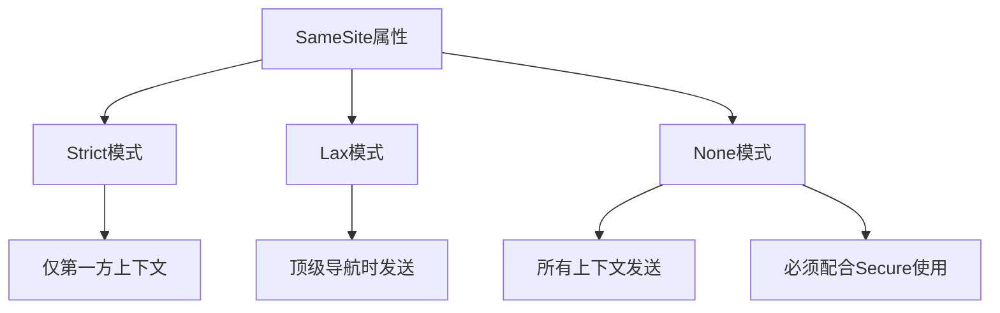
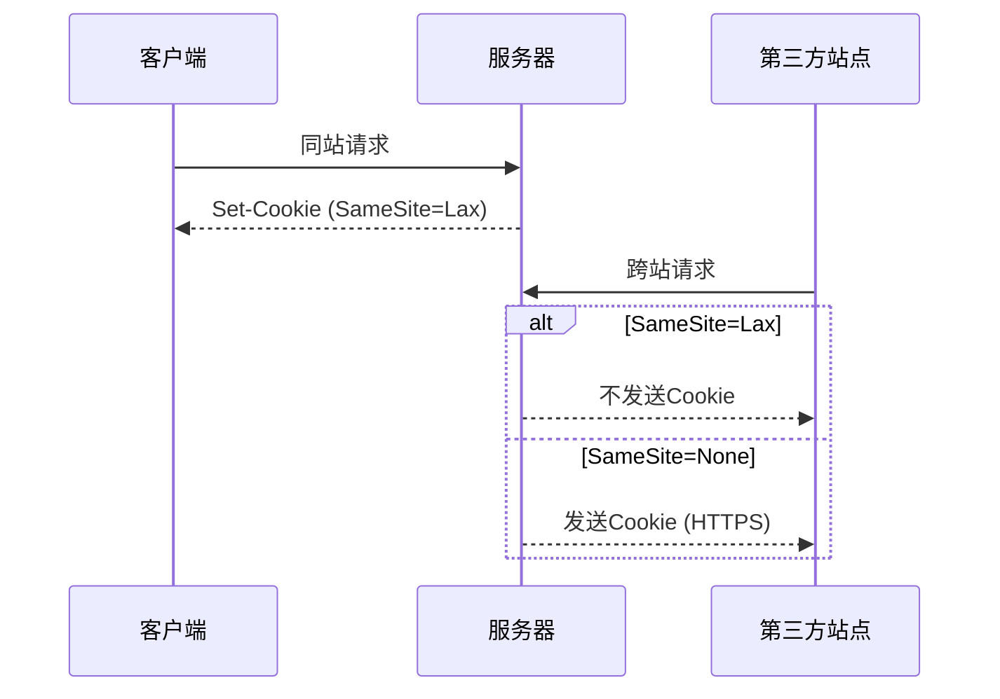

# Cookie SameSite配置

<cite>
**本文档引用的文件**
- [YudaoWebSecurityConfigurerAdapter.java](file://yudao-framework/yudao-spring-boot-starter-security/src/main/java/cn/iocoder/yudao/framework/security/config/YudaoWebSecurityConfigurerAdapter.java)
- [SecurityProperties.java](file://yudao-framework/yudao-spring-boot-starter-security/src/main/java/cn/iocoder/yudao/framework/security/config/SecurityProperties.java)
- [SecurityConfiguration.java](file://yudao-module-infra/yudao-module-infra-biz/src/main/java/cn/iocoder/yudao/module/infra/framework/security/config/SecurityConfiguration.java)
</cite>

## 目录
1. [引言](#引言)
2. [SameSite属性配置方法](#samesite属性配置方法)
3. [SameSite三种模式的区别及适用场景](#samesite三种模式的区别及适用场景)
4. [Spring Boot应用中配置SameSite属性](#spring-boot应用中配置samesite属性)
5. [跨站请求时的Cookie发送问题处理](#跨站请求时的cookie发送问题处理)
6. [浏览器兼容性及降级方案](#浏览器兼容性及降级方案)
7. [测试SameSite配置有效性](#测试samesite配置有效性)
8. [结论](#结论)

## 引言
SameSite Cookie属性是现代Web安全的重要组成部分，用于防止跨站请求伪造（CSRF）攻击。该属性通过控制Cookie在跨站请求中的发送行为，增强了Web应用的安全性。本文将详细介绍SameSite属性的配置方法、不同模式的区别、在Spring Boot应用中的实现方式，以及浏览器兼容性和测试方法。

## SameSite属性配置方法
SameSite属性可以通过在HTTP响应头中设置Set-Cookie来配置。该属性有三个可选值：Strict、Lax和None。配置时需要在Cookie值后添加SameSite属性，例如：

```
Set-Cookie: sessionId=abc123; SameSite=Strict
```

在Spring Boot应用中，可以通过配置HttpServletResponse来设置SameSite属性。项目中的安全配置主要在YudaoWebSecurityConfigurerAdapter类中实现，该类通过Spring Security的HttpSecurity配置了应用的安全策略。

**Section sources**
- [YudaoWebSecurityConfigurerAdapter.java](file://yudao-framework/yudao-spring-boot-starter-security/src/main/java/cn/iocoder/yudao/framework/security/config/YudaoWebSecurityConfigurerAdapter.java#L100-L145)

## SameSite三种模式的区别及适用场景
SameSite属性有三种模式：Strict、Lax和None，每种模式有不同的安全级别和适用场景。

### Strict模式
Strict模式是最严格的模式，Cookie仅在第一方上下文中发送，完全禁止跨站请求携带Cookie。这意味着即使是从外部站点链接到本站点的导航请求，也不会携带Cookie。

**适用场景**：
- 高安全要求的应用，如银行、支付系统
- 需要防止任何形式的跨站请求伪造攻击

### Lax模式
Lax模式是平衡安全性和用户体验的折中方案。Cookie在跨站子请求（如AJAX请求）中不发送，但在顶级导航（如链接跳转）时会发送。

**适用场景**：
- 大多数Web应用的默认选择
- 需要在安全性和用户体验之间取得平衡的应用

### None模式
None模式允许Cookie在所有上下文中发送，包括跨站请求。但使用None模式时必须同时设置Secure属性，即Cookie只能通过HTTPS传输。

**适用场景**：
- 需要在iframe中嵌入的应用
- 第三方登录系统
- 跨站API调用



**Diagram sources**
- [YudaoWebSecurityConfigurerAdapter.java](file://yudao-framework/yudao-spring-boot-starter-security/src/main/java/cn/iocoder/yudao/framework/security/config/YudaoWebSecurityConfigurerAdapter.java#L100-L145)

## Spring Boot应用中配置SameSite属性
在Spring Boot应用中配置SameSite属性，可以通过自定义过滤器或修改安全配置来实现。项目中使用了Spring Security进行安全控制，相关配置在YudaoWebSecurityConfigurerAdapter类中。

### 配置步骤
1. 创建自定义的HttpServletResponse包装器
2. 重写addCookie方法，在添加Cookie时设置SameSite属性
3. 在过滤器链中添加自定义过滤器

### 代码示例
```java
public class SameSiteCookieFilter implements Filter {
    @Override
    public void doFilter(ServletRequest request, ServletResponse response, FilterChain chain)
            throws IOException, ServletException {
        SameSiteResponseWrapper wrappedResponse = new SameSiteResponseWrapper(
                (HttpServletResponse) response);
        chain.doFilter(request, wrappedResponse);
    }
    
    private static class SameSiteResponseWrapper extends HttpServletResponseWrapper {
        public SameSiteResponseWrapper(HttpServletResponse response) {
            super(response);
        }
        
        @Override
        public void addCookie(Cookie cookie) {
            cookie.setAttribute("SameSite", "Lax");
            super.addCookie(cookie);
        }
    }
}
```

**Section sources**
- [YudaoWebSecurityConfigurerAdapter.java](file://yudao-framework/yudao-spring-boot-starter-security/src/main/java/cn/iocoder/yudao/framework/security/config/YudaoWebSecurityConfigurerAdapter.java#L100-L145)
- [SecurityProperties.java](file://yudao-framework/yudao-spring-boot-starter-security/src/main/java/cn/iocoder/yudao/framework/security/config/SecurityProperties.java#L15-L52)

## 跨站请求时的Cookie发送问题处理
跨站请求时的Cookie发送问题需要根据具体场景进行处理。项目中通过安全配置和过滤器机制来管理跨站请求。

### 问题分析
当SameSite属性设置为Strict或Lax时，跨站请求不会携带Cookie，这可能导致：
- 用户需要重新登录
- 会话状态丢失
- API调用失败

### 解决方案
1. **使用None模式**：对于需要跨站共享Cookie的场景，使用SameSite=None并配合Secure属性
2. **Token机制**：使用JWT等无状态认证机制替代Cookie
3. **CORS配置**：正确配置跨域资源共享策略
4. **反向代理**：通过反向代理使跨站请求变为同站请求



**Diagram sources**
- [YudaoWebSecurityConfigurerAdapter.java](file://yudao-framework/yudao-spring-boot-starter-security/src/main/java/cn/iocoder/yudao/framework/security/config/YudaoWebSecurityConfigurerAdapter.java#L100-L145)

## 浏览器兼容性及降级方案
不同浏览器对SameSite属性的支持情况不同，需要考虑兼容性和降级方案。

### 浏览器支持情况
| 浏览器 | 支持版本 | 备注 |
|--------|---------|------|
| Chrome | 51+ | 早期版本有兼容性问题 |
| Firefox | 60+ | 需要启用相关特性 |
| Safari | 12+ | 部分版本有bug |
| Edge | 79+ | 基于Chromium |

### 降级方案
1. **渐进式部署**：先在非关键功能上测试SameSite配置
2. **用户代理检测**：根据浏览器类型动态调整SameSite策略
3. **双重Cookie策略**：同时设置传统Cookie和SameSite Cookie
4. **监控和告警**：建立监控系统，及时发现兼容性问题

**Section sources**
- [SecurityConfiguration.java](file://yudao-module-infra/yudao-module-infra-biz/src/main/java/cn/iocoder/yudao/module/infra/framework/security/config/SecurityConfiguration.java#L14-L49)

## 测试SameSite配置有效性
测试SameSite配置的有效性是确保安全策略正确实施的关键步骤。

### 测试方法
1. **浏览器开发者工具**：检查Network面板中的Cookie头
2. **自动化测试**：使用Selenium等工具模拟跨站请求
3. **安全扫描**：使用专业安全工具进行漏洞扫描
4. **日志分析**：检查服务器日志中的请求模式

### 测试用例
- 验证同站请求是否正常携带Cookie
- 验证跨站子请求是否不携带Cookie
- 验证顶级导航是否按Lax模式发送Cookie
- 验证HTTPS环境下None模式是否正常工作

**Section sources**
- [YudaoWebSecurityConfigurerAdapter.java](file://yudao-framework/yudao-spring-boot-starter-security/src/main/java/cn/iocoder/yudao/framework/security/config/YudaoWebSecurityConfigurerAdapter.java#L100-L145)

## 结论
SameSite Cookie属性是现代Web应用安全的重要组成部分。通过合理配置Strict、Lax和None三种模式，可以在安全性和用户体验之间取得平衡。在Spring Boot应用中，可以通过自定义过滤器和安全配置来实现SameSite属性的设置。同时，需要考虑浏览器兼容性和降级方案，并通过全面的测试确保配置的有效性。