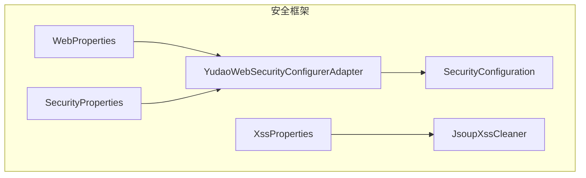
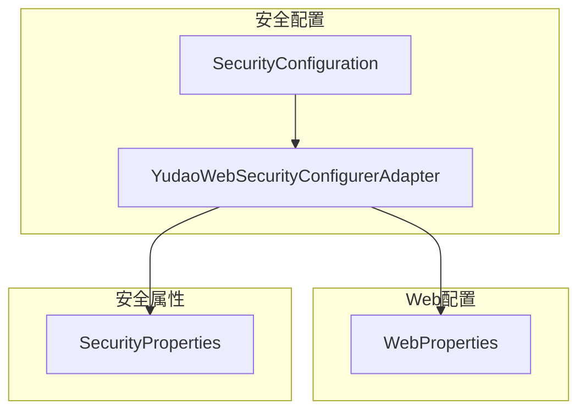
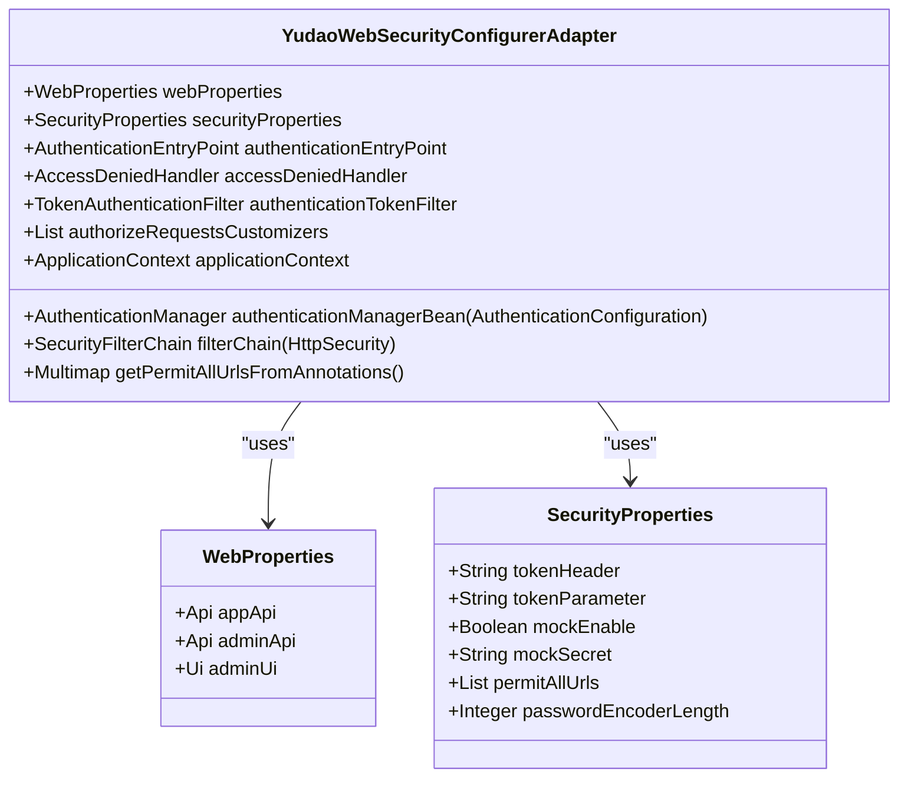
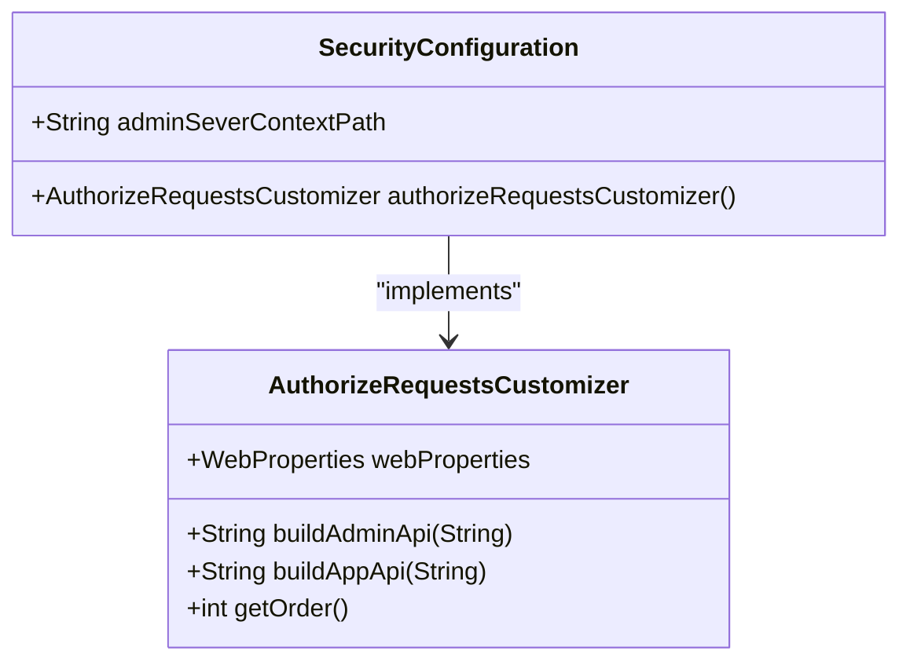
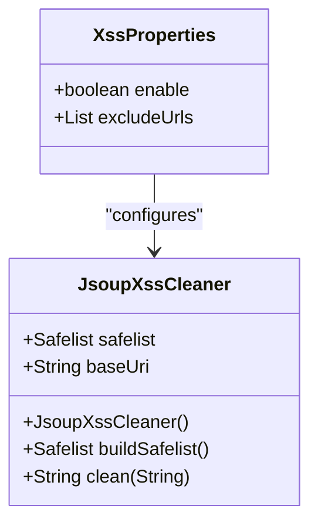
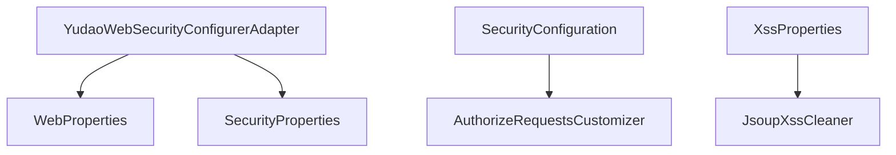

# HTTP安全头配置

<cite>
**本文档引用的文件**   
- [YudaoWebSecurityConfigurerAdapter.java](file://yudao-framework/yudao-spring-boot-starter-security/src/main/java/cn/iocoder/yudao/framework/security/config/YudaoWebSecurityConfigurerAdapter.java)
- [SecurityConfiguration.java](file://yudao-module-infra/yudao-module-infra-biz/src/main/java/cn/iocoder/yudao/module/infra/framework/security/config/SecurityConfiguration.java)
- [WebProperties.java](file://yudao-framework/yudao-spring-boot-starter-web/src/main/java/cn/iocoder/yudao/framework/web/config/WebProperties.java)
- [SecurityProperties.java](file://yudao-framework/yudao-spring-boot-starter-security/src/main/java/cn/iocoder/yudao/framework/security/config/SecurityProperties.java)
- [XssProperties.java](file://yudao-framework/yudao-spring-boot-starter-web/src/main/java/cn/iocoder/yudao/framework/xss/config/XssProperties.java)
- [JsoupXssCleaner.java](file://yudao-framework/yudao-spring-boot-starter-web/src/main/java/cn/iocoder/yudao/framework/xss/core/clean/JsoupXssCleaner.java)
</cite>

## 目录
1. [引言](#引言)
2. [项目结构](#项目结构)
3. [核心组件](#核心组件)
4. [架构概述](#架构概述)
5. [详细组件分析](#详细组件分析)
6. [依赖分析](#依赖分析)
7. [性能考虑](#性能考虑)
8. [故障排除指南](#故障排除指南)
9. [结论](#结论)
10. [附录](#附录) (如有必要)

## 引言
本文档详细描述了系统安全相关的HTTP响应头配置，重点介绍Content-Security-Policy头的指令配置和策略制定。同时解释X-Content-Type-Options、X-Frame-Options和X-XSS-Protection头的作用和配置方法，提供Strict-Transport-Security头的配置指南和HTTPS强制策略。此外，说明Referrer-Policy头的隐私保护作用，包含安全头配置的测试验证方法，并为运维人员提供安全头配置的最佳实践和兼容性建议。

## 项目结构
本项目采用模块化设计，主要包含多个业务模块和基础框架模块。安全相关的配置主要集中在`yudao-framework`和`yudao-module-infra`模块中。`yudao-framework`提供了基础的安全框架和配置，而`yudao-module-infra`则包含了具体的基础设施安全配置。



**图表来源**
- [YudaoWebSecurityConfigurerAdapter.java](file://yudao-framework/yudao-spring-boot-starter-security/src/main/java/cn/iocoder/yudao/framework/security/config/YudaoWebSecurityConfigurerAdapter.java#L1-L198)
- [SecurityConfiguration.java](file://yudao-module-infra/yudao-module-infra-biz/src/main/java/cn/iocoder/yudao/module/infra/framework/security/config/SecurityConfiguration.java#L1-L49)
- [WebProperties.java](file://yudao-framework/yudao-spring-boot-starter-web/src/main/java/cn/iocoder/yudao/framework/web/config/WebProperties.java#L1-L67)
- [SecurityProperties.java](file://yudao-framework/yudao-spring-boot-starter-security/src/main/java/cn/iocoder/yudao/framework/security/config/SecurityProperties.java#L1-L51)
- [XssProperties.java](file://yudao-framework/yudao-spring-boot-starter-web/src/main/java/cn/iocoder/yudao/framework/xss/config/XssProperties.java#L1-L29)
- [JsoupXssCleaner.java](file://yudao-framework/yudao-spring-boot-starter-web/src/main/java/cn/iocoder/yudao/framework/xss/core/clean/JsoupXssCleaner.java#L1-L63)

**章节来源**
- [YudaoWebSecurityConfigurerAdapter.java](file://yudao-framework/yudao-spring-boot-starter-security/src/main/java/cn/iocoder/yudao/framework/security/config/YudaoWebSecurityConfigurerAdapter.java#L1-L198)
- [SecurityConfiguration.java](file://yudao-module-infra/yudao-module-infra-biz/src/main/java/cn/iocoder/yudao/module/infra/framework/security/config/SecurityConfiguration.java#L1-L49)

## 核心组件
系统的核心安全组件包括`YudaoWebSecurityConfigurerAdapter`、`SecurityConfiguration`、`WebProperties`、`SecurityProperties`、`XssProperties`和`JsoupXssCleaner`。这些组件共同协作，确保系统的安全性。

**章节来源**
- [YudaoWebSecurityConfigurerAdapter.java](file://yudao-framework/yudao-spring-boot-starter-security/src/main/java/cn/iocoder/yudao/framework/security/config/YudaoWebSecurityConfigurerAdapter.java#L1-L198)
- [SecurityConfiguration.java](file://yudao-module-infra/yudao-module-infra-biz/src/main/java/cn/iocoder/yudao/module/infra/framework/security/config/SecurityConfiguration.java#L1-L49)

## 架构概述
系统的安全架构基于Spring Security框架，通过`YudaoWebSecurityConfigurerAdapter`类进行配置。该类负责配置URL的安全策略，包括跨域、CSRF、会话管理和异常处理。`SecurityConfiguration`类则提供了具体的基础设施安全配置，如Swagger接口文档、Spring Boot Actuator和Druid监控的安全配置。



**图表来源**
- [YudaoWebSecurityConfigurerAdapter.java](file://yudao-framework/yudao-spring-boot-starter-security/src/main/java/cn/iocoder/yudao/framework/security/config/YudaoWebSecurityConfigurerAdapter.java#L1-L198)
- [SecurityConfiguration.java](file://yudao-module-infra/yudao-module-infra-biz/src/main/java/cn/iocoder/yudao/module/infra/framework/security/config/SecurityConfiguration.java#L1-L49)
- [WebProperties.java](file://yudao-framework/yudao-spring-boot-starter-web/src/main/java/cn/iocoder/yudao/framework/web/config/WebProperties.java#L1-L67)
- [SecurityProperties.java](file://yudao-framework/yudao-spring-boot-starter-security/src/main/java/cn/iocoder/yudao/framework/security/config/SecurityProperties.java#L1-L51)

## 详细组件分析
### YudaoWebSecurityConfigurerAdapter分析
`YudaoWebSecurityConfigurerAdapter`类是系统安全配置的核心，负责配置URL的安全策略。它通过`filterChain`方法配置了跨域、CSRF、会话管理和异常处理。

#### 类图


**图表来源**
- [YudaoWebSecurityConfigurerAdapter.java](file://yudao-framework/yudao-spring-boot-starter-security/src/main/java/cn/iocoder/yudao/framework/security/config/YudaoWebSecurityConfigurerAdapter.java#L1-L198)
- [WebProperties.java](file://yudao-framework/yudao-spring-boot-starter-web/src/main/java/cn/iocoder/yudao/framework/web/config/WebProperties.java#L1-L67)
- [SecurityProperties.java](file://yudao-framework/yudao-spring-boot-starter-security/src/main/java/cn/iocoder/yudao/framework/security/config/SecurityProperties.java#L1-L51)

### SecurityConfiguration分析
`SecurityConfiguration`类提供了具体的基础设施安全配置，如Swagger接口文档、Spring Boot Actuator和Druid监控的安全配置。

#### 类图


**图表来源**
- [SecurityConfiguration.java](file://yudao-module-infra/yudao-module-infra-biz/src/main/java/cn/iocoder/yudao/module/infra/framework/security/config/SecurityConfiguration.java#L1-L49)
- [AuthorizeRequestsCustomizer.java](file://yudao-framework/yudao-spring-boot-starter-security/src/main/java/cn/iocoder/yudao/framework/security/config/AuthorizeRequestsCustomizer.java#L1-L36)

### Xss防护分析
系统通过`XssProperties`和`JsoupXssCleaner`类实现XSS防护。`XssProperties`类定义了XSS防护的配置属性，而`JsoupXssCleaner`类则实现了具体的XSS过滤逻辑。

#### 类图


**图表来源**
- [XssProperties.java](file://yudao-framework/yudao-spring-boot-starter-web/src/main/java/cn/iocoder/yudao/framework/xss/config/XssProperties.java#L1-L29)
- [JsoupXssCleaner.java](file://yudao-framework/yudao-spring-boot-starter-web/src/main/java/cn/iocoder/yudao/framework/xss/core/clean/JsoupXssCleaner.java#L1-L63)

**章节来源**
- [XssProperties.java](file://yudao-framework/yudao-spring-boot-starter-web/src/main/java/cn/iocoder/yudao/framework/xss/config/XssProperties.java#L1-L29)
- [JsoupXssCleaner.java](file://yudao-framework/yudao-spring-boot-starter-web/src/main/java/cn/iocoder/yudao/framework/xss/core/clean/JsoupXssCleaner.java#L1-L63)

## 依赖分析
系统中的安全组件依赖于Spring Security框架和Hutool工具库。`YudaoWebSecurityConfigurerAdapter`类依赖于`WebProperties`和`SecurityProperties`类，而`SecurityConfiguration`类依赖于`AuthorizeRequestsCustomizer`类。`XssProperties`类和`JsoupXssCleaner`类则共同实现了XSS防护功能。



**图表来源**
- [YudaoWebSecurityConfigurerAdapter.java](file://yudao-framework/yudao-spring-boot-starter-security/src/main/java/cn/iocoder/yudao/framework/security/config/YudaoWebSecurityConfigurerAdapter.java#L1-L198)
- [WebProperties.java](file://yudao-framework/yudao-spring-boot-starter-web/src/main/java/cn/iocoder/yudao/framework/web/config/WebProperties.java#L1-L67)
- [SecurityProperties.java](file://yudao-framework/yudao-spring-boot-starter-security/src/main/java/cn/iocoder/yudao/framework/security/config/SecurityProperties.java#L1-L51)
- [SecurityConfiguration.java](file://yudao-module-infra/yudao-module-infra-biz/src/main/java/cn/iocoder/yudao/module/infra/framework/security/config/SecurityConfiguration.java#L1-L49)
- [AuthorizeRequestsCustomizer.java](file://yudao-framework/yudao-spring-boot-starter-security/src/main/java/cn/iocoder/yudao/framework/security/config/AuthorizeRequestsCustomizer.java#L1-L36)
- [XssProperties.java](file://yudao-framework/yudao-spring-boot-starter-web/src/main/java/cn/iocoder/yudao/framework/xss/config/XssProperties.java#L1-L29)
- [JsoupXssCleaner.java](file://yudao-framework/yudao-spring-boot-starter-web/src/main/java/cn/iocoder/yudao/framework/xss/core/clean/JsoupXssCleaner.java#L1-L63)

**章节来源**
- [YudaoWebSecurityConfigurerAdapter.java](file://yudao-framework/yudao-spring-boot-starter-security/src/main/java/cn/iocoder/yudao/framework/security/config/YudaoWebSecurityConfigurerAdapter.java#L1-L198)
- [WebProperties.java](file://yudao-framework/yudao-spring-boot-starter-web/src/main/java/cn/iocoder/yudao/framework/web/config/WebProperties.java#L1-L67)
- [SecurityProperties.java](file://yudao-framework/yudao-spring-boot-starter-security/src/main/java/cn/iocoder/yudao/framework/security/config/SecurityProperties.java#L1-L51)
- [SecurityConfiguration.java](file://yudao-module-infra/yudao-module-infra-biz/src/main/java/cn/iocoder/yudao/module/infra/framework/security/config/SecurityConfiguration.java#L1-L49)
- [AuthorizeRequestsCustomizer.java](file://yudao-framework/yudao-spring-boot-starter-security/src/main/java/cn/iocoder/yudao/framework/security/config/AuthorizeRequestsCustomizer.java#L1-L36)
- [XssProperties.java](file://yudao-framework/yudao-spring-boot-starter-web/src/main/java/cn/iocoder/yudao/framework/xss/config/XssProperties.java#L1-L29)
- [JsoupXssCleaner.java](file://yudao-framework/yudao-spring-boot-starter-web/src/main/java/cn/iocoder/yudao/framework/xss/core/clean/JsoupXssCleaner.java#L1-L63)

## 性能考虑
在配置安全头时，需要考虑性能影响。例如，`Content-Security-Policy`头的复杂性可能会影响页面加载速度，而`X-Content-Type-Options`和`X-Frame-Options`头的配置则相对轻量。建议在生产环境中进行性能测试，确保安全配置不会对系统性能造成显著影响。

## 故障排除指南
在配置安全头时，可能会遇到一些常见问题。例如，`Content-Security-Policy`头可能导致某些资源无法加载，`X-Frame-Options`头可能导致页面无法在iframe中显示。建议在开发环境中逐步配置安全头，并进行充分的测试，确保所有功能正常工作。

**章节来源**
- [YudaoWebSecurityConfigurerAdapter.java](file://yudao-framework/yudao-spring-boot-starter-security/src/main/java/cn/iocoder/yudao/framework/security/config/YudaoWebSecurityConfigurerAdapter.java#L1-L198)
- [SecurityConfiguration.java](file://yudao-module-infra/yudao-module-infra-biz/src/main/java/cn/iocoder/yudao/module/infra/framework/security/config/SecurityConfiguration.java#L1-L49)

## 结论
本文档详细描述了系统安全相关的HTTP响应头配置，包括`Content-Security-Policy`、`X-Content-Type-Options`、`X-Frame-Options`、`X-XSS-Protection`、`Strict-Transport-Security`和`Referrer-Policy`头的配置方法。通过合理的配置，可以有效提升系统的安全性，保护用户数据和隐私。

## 附录
### 安全头配置示例
```yaml
yudao:
  security:
    token-header: "Authorization"
    token-parameter: "token"
    mock-enable: false
    mock-secret: "test"
    permit-all-urls:
      - "/captcha/get"
      - "/captcha/check"
  xss:
    enable: true
    exclude-urls:
      - "/api/v1/public/**"
```

### 参考资料
- [MDN Web Docs - HTTP安全头](https://developer.mozilla.org/zh-CN/docs/Web/HTTP/Headers)
- [OWASP - 安全头](https://owasp.org/www-project-secure-headers/)