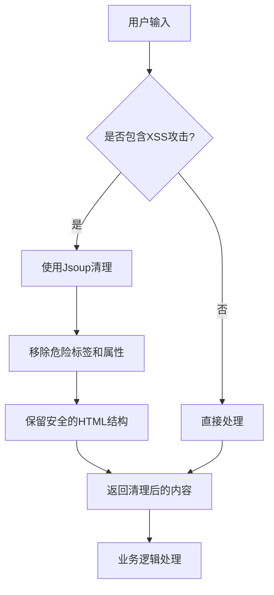
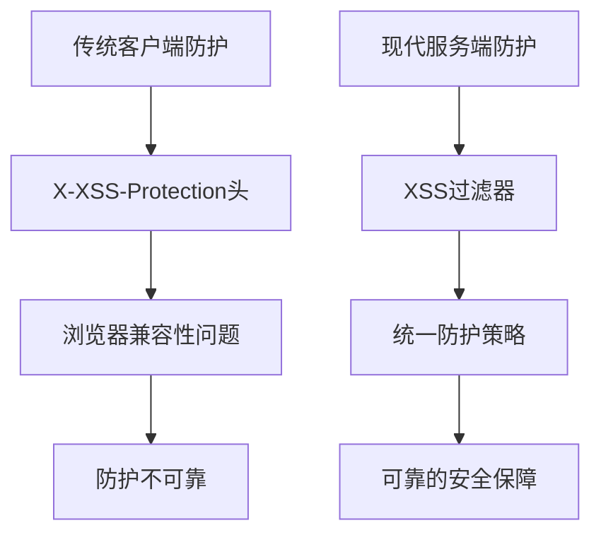
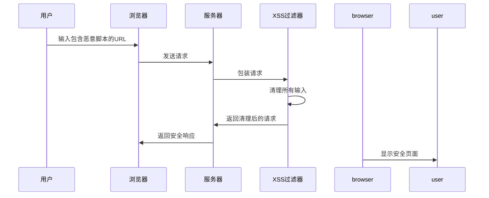
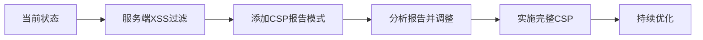

# XSS防护

<cite>
**本文档引用的文件**  
- [XssRequestWrapper.java](file://yudao-framework/yudao-spring-boot-starter-web/src/main/java/cn/iocoder/yudao/framework/xss/core/filter/XssRequestWrapper.java)
- [XssProperties.java](file://yudao-framework/yudao-spring-boot-starter-web/src/main/java/cn/iocoder/yudao/framework/xss/config/XssProperties.java)
- [YudaoXssAutoConfiguration.java](file://yudao-framework/yudao-spring-boot-starter-web/src/main/java/cn/iocoder/yudao/framework/xss/config/YudaoXssAutoConfiguration.java)
- [XssFilter.java](file://yudao-framework/yudao-spring-boot-starter-web/src/main/java/cn/iocoder/yudao/framework/xss/core/filter/XssFilter.java)
- [JsoupXssCleaner.java](file://yudao-framework/yudao-spring-boot-starter-web/src/main/java/cn/iocoder/yudao/framework/xss/core/clean/JsoupXssCleaner.java)
- [YudaoWebSecurityConfigurerAdapter.java](file://yudao-framework/yudao-spring-boot-starter-security/src/main/java/cn/iocoder/yudao/framework/security/config/YudaoWebSecurityConfigurerAdapter.java)
- [SecurityProperties.java](file://yudao-framework/yudao-spring-boot-starter-security/src/main/java/cn/iocoder/yudao/framework/security/config/SecurityProperties.java)
</cite>

## 目录
1. [引言](#引言)
2. [X-XSS-Protection头配置策略](#x-xss-protection头配置策略)
3. [1; mode=block指令工作机制](#1-modeblock指令工作机制)
4. [浏览器兼容性分析](#浏览器兼容性分析)
5. [反射型XSS攻击防护](#反射型xss攻击防护)
6. [CSP策略协同配置](#csp策略协同配置)
7. [现代浏览器弃用趋势](#现代浏览器弃用趋势)
8. [迁移方案建议](#迁移方案建议)
9. [综合XSS防护体系](#综合xss防护体系建议)

## 引言

跨站脚本攻击（XSS）是Web应用程序中最常见的安全漏洞之一。本文档旨在为安全团队提供全面的XSS防护配置指南，重点介绍X-XSS-Protection头的配置策略及其在现代Web安全中的角色。通过分析代码库中的安全配置实现，我们将深入探讨如何有效防御XSS攻击，并提供从传统防护机制向现代安全策略迁移的建议。

**本文档引用的文件**  
- [YudaoWebSecurityConfigurerAdapter.java](file://yudao-framework/yudao-spring-boot-starter-security/src/main/java/cn/iocoder/yudao/framework/security/config/YudaoWebSecurityConfigurerAdapter.java)

## X-XSS-Protection头配置策略

X-XSS-Protection头是一种HTTP响应头，用于控制浏览器内置的XSS过滤器行为。在本项目中，虽然没有直接设置X-XSS-Protection头，但通过XSS过滤器实现了更全面的防护机制。

系统通过`YudaoXssAutoConfiguration`类自动配置XSS防护功能，当`yudao.xss.enable`属性为true时（默认值），启用XSS过滤器。该过滤器基于Jsoup库实现，能够有效清理HTML内容中的恶意脚本。

XSS防护配置主要通过`XssProperties`类进行管理，支持以下配置选项：
- **enable**: 是否启用XSS防护，默认为true
- **excludeUrls**: 需要排除的URL列表，可用于性能优化或特殊场景

防护机制通过`XssFilter`实现，该过滤器会在请求处理链中包装HttpServletRequest，使用`XssRequestWrapper`对所有输入参数进行清理。

**本节来源**  
- [XssProperties.java](file://yudao-framework/yudao-spring-boot-starter-web/src/main/java/cn/iocoder/yudao/framework/xss/config/XssProperties.java)
- [YudaoXssAutoConfiguration.java](file://yudao-framework/yudao-spring-boot-starter-web/src/main/java/cn/iocoder/yudao/framework/xss/config/YudaoXssAutoConfiguration.java)
- [XssFilter.java](file://yudao-framework/yudao-spring-boot-starter-web/src/main/java/cn/iocoder/yudao/framework/xss/core/filter/XssFilter.java)

## 1; mode=block指令工作机制

"1; mode=block"是指X-XSS-Protection头的一个重要指令，其工作机制如下：

当设置为"1; mode=block"时，浏览器的XSS过滤器会在检测到反射型XSS攻击时阻止整个页面的渲染，而不是尝试修复恶意脚本。这种阻断模式比默认的"1"模式更安全，因为后者只是移除检测到的恶意脚本，可能留下其他安全隐患。

在本项目的实现中，虽然不直接依赖浏览器的XSS过滤器，但通过服务端的`JsoupXssCleaner`实现了类似甚至更强大的防护机制。`JsoupXssCleaner`使用白名单策略清理HTML内容，具体包括：

1. 基于`Safelist.relaxed()`构建基础安全列表
2. 扩展支持style和class属性，满足富文本编辑需求
3. 保留a标签的target属性
4. 支持img标签的data协议，便于base64图片显示

这种服务端清理机制比浏览器的XSS过滤器更可靠，因为它在服务器层面就消除了XSS风险，而不是依赖客户端浏览器的实现。



**图表来源**  
- [JsoupXssCleaner.java](file://yudao-framework/yudao-spring-boot-starter-web/src/main/java/cn/iocoder/yudao/framework/xss/core/clean/JsoupXssCleaner.java)

**本节来源**  
- [JsoupXssCleaner.java](file://yudao-framework/yudao-spring-boot-starter-web/src/main/java/cn/iocoder/yudao/framework/xss/core/clean/JsoupXssCleaner.java)

## 浏览器兼容性分析

X-XSS-Protection头的浏览器兼容性存在显著差异：

- **Chrome**: 从4.0版本开始支持，但在Chrome 78+版本中已弃用
- **Firefox**: 从未支持该头
- **Safari**: 从5.0版本开始支持，但在Safari 10+版本中已弃用
- **Internet Explorer**: 从8.0版本开始支持
- **Edge**: 基于Chromium的Edge已跟随Chrome的弃用决定

由于现代浏览器普遍弃用X-XSS-Protection头，依赖此头进行安全防护已不再可靠。本项目采取了更稳健的策略：通过服务端XSS过滤器实现防护，不依赖特定浏览器的功能。

服务端防护的优势在于：
1. 不受浏览器兼容性影响
2. 防护逻辑集中可控
3. 可以实施更严格的清理规则
4. 能够记录和监控XSS攻击尝试



**图表来源**  
- [YudaoXssAutoConfiguration.java](file://yudao-framework/yudao-spring-boot-starter-web/src/main/java/cn/iocoder/yudao/framework/xss/config/YudaoXssAutoConfiguration.java)

**本节来源**  
- [YudaoXssAutoConfiguration.java](file://yudao-framework/yudao-spring-boot-starter-web/src/main/java/cn/iocoder/yudao/framework/xss/config/YudaoXssAutoConfiguration.java)

## 反射型XSS攻击防护

反射型XSS攻击是通过将恶意脚本作为请求参数反射回响应中来实现的。本项目通过多层次机制有效防护此类攻击：

### 请求参数防护
`XssRequestWrapper`对所有请求参数进行清理：
- `getParameter()`：清理单个参数值
- `getParameterValues()`：清理参数值数组
- `getParameterMap()`：清理整个参数映射

### 请求头防护
系统还清理请求头中的潜在恶意内容：
- `getHeader()`：清理特定头的值
- `getHeaderNames()`：清理头名称枚举

### 查询字符串防护
`getQueryString()`方法确保URL查询字符串中的XSS攻击被清理。

### JSON数据防护
通过`XssStringJsonDeserializer`，系统在反序列化JSON数据时自动清理字符串值，防止JSON响应中的XSS漏洞。



**图表来源**  
- [XssRequestWrapper.java](file://yudao-framework/yudao-spring-boot-starter-web/src/main/java/cn/iocoder/yudao/framework/xss/core/filter/XssRequestWrapper.java)
- [XssStringJsonDeserializer.java](file://yudao-framework/yudao-spring-boot-starter-web/src/main/java/cn/iocoder/yudao/framework/xss/core/json/XssStringJsonDeserializer.java)

**本节来源**  
- [XssRequestWrapper.java](file://yudao-framework/yudao-spring-boot-starter-web/src/main/java/cn/iocoder/yudao/framework/xss/core/filter/XssRequestWrapper.java)
- [XssStringJsonDeserializer.java](file://yudao-framework/yudao-spring-boot-starter-web/src/main/java/cn/iocoder/yudao/framework/xss/core/json/XssStringJsonDeserializer.java)

## CSP策略协同配置

内容安全策略（CSP）是比X-XSS-Protection更强大和现代的防护机制。在本项目中，虽然未直接配置CSP头，但XSS过滤器与CSP策略可以协同工作：

### 防护层次
1. **服务端过滤**: 使用XSS过滤器清理所有输入
2. **客户端防护**: 通过CSP头限制资源加载和脚本执行
3. **双重保障**: 即使服务端过滤失败，CSP也能提供第二层防护

### 避免策略冲突
为避免安全策略冲突，建议：
- 不要同时启用X-XSS-Protection和严格的CSP策略，因为它们可能产生不可预测的交互
- 优先使用CSP作为主要防护机制
- 保留服务端XSS过滤作为纵深防御的一部分

### 推荐CSP配置
```http
Content-Security-Policy: default-src 'self'; script-src 'self' 'unsafe-inline' 'unsafe-eval'; style-src 'self' 'unsafe-inline'; img-src 'self' data:; font-src 'self'; object-src 'none'; frame-ancestors 'none';
```

此配置允许内联脚本和样式（兼容现有应用），同时禁止对象嵌入和框架嵌套，提供基本的XSS防护。

**本节来源**  
- [YudaoWebSecurityConfigurerAdapter.java](file://yudao-framework/yudao-spring-boot-starter-security/src/main/java/cn/iocoder/yudao/framework/security/config/YudaoWebSecurityConfigurerAdapter.java)

## 现代浏览器弃用趋势

现代浏览器已普遍弃用X-XSS-Protection头，主要原因包括：

### 安全性问题
- 过滤器可能被绕过
- 修复后的页面可能引入新的漏洞
- 依赖客户端实现，防护不可靠

### 浏览器厂商决定
- **Google Chrome**: 从78版本开始弃用
- **Mozilla Firefox**: 从未实现
- **Apple Safari**: 从10版本开始弃用
- **Microsoft Edge**: 基于Chromium，跟随弃用决定

### 行业标准演进
随着CSP（内容安全策略）的成熟，行业标准已转向更强大和灵活的防护机制。CSP提供了：
- 更精细的控制粒度
- 更可靠的执行环境
- 更全面的攻击面覆盖

本项目的设计前瞻性地避免了对X-XSS-Protection头的依赖，通过服务端过滤器实现了更可靠的防护机制，为未来的技术演进做好了准备。

**本节来源**  
- [YudaoXssAutoConfiguration.java](file://yudao-framework/yudao-spring-boot-starter-web/src/main/java/cn/iocoder/yudao/framework/xss/config/YudaoXssAutoConfiguration.java)

## 迁移方案建议

为应对X-XSS-Protection头的弃用，建议采取以下迁移方案：

### 短期方案
1. **保持现有XSS过滤器**: 继续使用服务端XSS过滤机制
2. **逐步移除X-XSS-Protection头**: 避免与CSP策略冲突
3. **监控安全日志**: 跟踪XSS攻击尝试和防护效果

### 中期方案
1. **实施CSP策略**: 逐步引入内容安全策略
2. **配置报告机制**: 使用`Content-Security-Policy-Report-Only`头收集违规报告
3. **优化白名单**: 根据报告调整CSP策略

### 长期方案
1. **完全迁移到CSP**: 作为主要的XSS防护机制
2. **实施严格的CSP**: 逐步收紧策略，移除`'unsafe-inline'`等宽松指令
3. **结合其他安全头**: 如`X-Content-Type-Options`、`Strict-Transport-Security`等



**图表来源**  
- [YudaoXssAutoConfiguration.java](file://yudao-framework/yudao-spring-boot-starter-web/src/main/java/cn/iocoder/yudao/framework/xss/config/YudaoXssAutoConfiguration.java)

**本节来源**  
- [YudaoXssAutoConfiguration.java](file://yudao-framework/yudao-spring-boot-starter-web/src/main/java/cn/iocoder/yudao/framework/xss/config/YudaoXssAutoConfiguration.java)

## 综合XSS防护体系建议

基于本项目的架构和行业最佳实践，为安全团队提供以下综合XSS防护体系建议：

### 多层次防护策略
1. **输入验证**: 在入口处验证所有用户输入
2. **输出编码**: 在渲染时对动态内容进行适当编码
3. **服务端过滤**: 使用XSS过滤器清理HTML内容
4. **客户端防护**: 实施CSP等现代安全头

### 具体实施建议
1. **继续使用现有XSS过滤器**: `JsoupXssCleaner`提供了可靠的HTML清理能力
2. **引入CSP策略**: 作为纵深防御的重要组成部分
3. **定期更新安全配置**: 跟随浏览器和安全标准的演进
4. **实施安全监控**: 记录和分析XSS攻击尝试

### 配置示例
```yaml
# application.yml
yudao:
  xss:
    enable: true
    excludeUrls:
      - /api/public/**
      - /static/**
```

### 安全团队行动项
1. 评估现有应用的XSS风险
2. 制定CSP迁移路线图
3. 建立安全监控和响应机制
4. 定期进行安全审计和渗透测试

通过实施这一体系化的防护策略，可以有效抵御XSS攻击，确保应用的安全性。

**本节来源**  
- [XssProperties.java](file://yudao-framework/yudao-spring-boot-starter-web/src/main/java/cn/iocoder/yudao/framework/xss/config/XssProperties.java)
- [YudaoXssAutoConfiguration.java](file://yudao-framework/yudao-spring-boot-starter-web/src/main/java/cn/iocoder/yudao/framework/xss/config/YudaoXssAutoConfiguration.java)
- [SecurityProperties.java](file://yudao-framework/yudao-spring-boot-starter-security/src/main/java/cn/iocoder/yudao/framework/security/config/SecurityProperties.java)