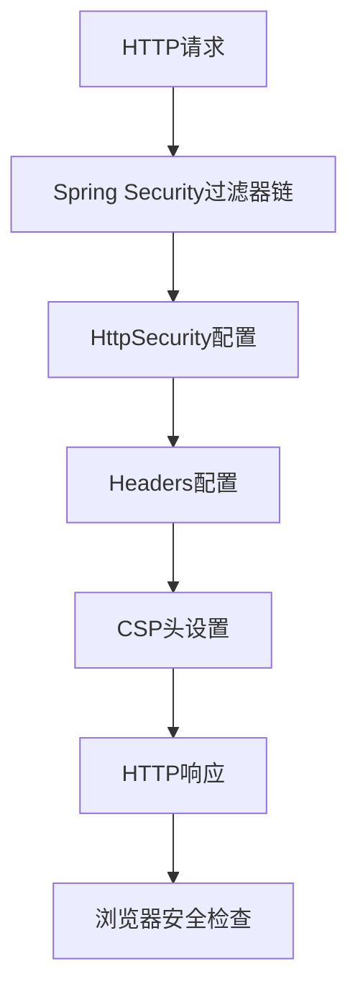
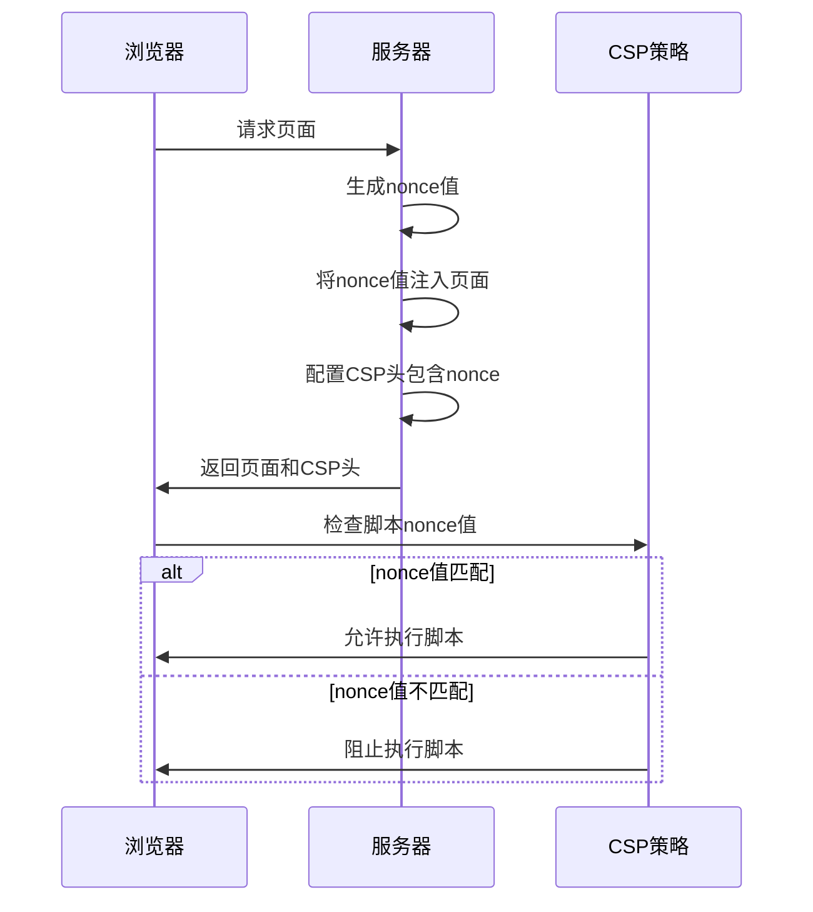

# 内容安全策略(CSP)

<cite>
**本文档引用的文件**  
- [YudaoWebAutoConfiguration.java](file://yudao-framework/yudao-spring-boot-starter-web/src/main/java/cn/iocoder/yudao/framework/web/config/YudaoWebAutoConfiguration.java)
- [YudaoWebSecurityConfigurerAdapter.java](file://yudao-framework/yudao-spring-boot-starter-security/src/main/java/cn/iocoder/yudao/framework/security/config/YudaoWebSecurityConfigurerAdapter.java)
- [WebProperties.java](file://yudao-framework/yudao-spring-boot-starter-web/src/main/java/cn/iocoder/yudao/framework/web/config/WebProperties.java)
- [XssProperties.java](file://yudao-framework/yudao-spring-boot-starter-web/src/main/java/cn/iocoder/yudao/framework/xss/config/XssProperties.java)
- [JsoupXssCleaner.java](file://yudao-framework/yudao-spring-boot-starter-web/src/main/java/cn/iocoder/yudao/framework/xss/core/clean/JsoupXssCleaner.java)
</cite>

## 目录
1. [简介](#简介)
2. [CSP头配置机制](#csp头配置机制)
3. [CSP指令配置策略](#csp指令配置策略)
4. [内联脚本防护机制](#内联脚本防护机制)
5. [CSP报告配置与监控](#csp报告配置与监控)
6. [前端资源兼容性处理](#前端资源兼容性处理)
7. [环境差异配置](#环境差异配置)
8. [调试工具与错误排查](#调试工具与错误排查)
9. [总结](#总结)

## 简介

内容安全策略（Content Security Policy，简称CSP）是一种重要的安全机制，用于防止跨站脚本攻击（XSS）、点击劫持和其他代码注入攻击。本系统通过Spring Security框架实现CSP头的配置和管理，为应用程序提供全面的安全防护。CSP通过定义允许加载的资源来源，有效限制了恶意脚本的执行，增强了系统的整体安全性。

系统中的CSP配置与XSS防护机制紧密结合，通过配置文件和代码实现多层次的安全防护。开发人员需要了解CSP的工作原理和配置方法，以确保应用程序在满足功能需求的同时保持高水平的安全性。

## CSP头配置机制

系统通过Spring Security框架的`HttpSecurity`配置来实现CSP头的设置。在`YudaoWebSecurityConfigurerAdapter`类中，通过`httpSecurity.headers()`方法配置安全头信息，包括CSP头。这种配置方式允许开发人员灵活定义各种安全策略，确保应用程序的安全性。

CSP头的配置是通过Spring Security的`headers()`方法实现的，该方法提供了对HTTP响应头的细粒度控制。通过这种方式，系统能够为所有响应添加必要的安全头，防止各种类型的攻击。配置过程遵循Spring Security的最佳实践，确保了安全性和可维护性。

**图示来源**
- [YudaoWebSecurityConfigurerAdapter.java](file://yudao-framework/yudao-spring-boot-starter-security/src/main/java/cn/iocoder/yudao/framework/security/config/YudaoWebSecurityConfigurerAdapter.java)

**本节来源**
- [YudaoWebSecurityConfigurerAdapter.java](file://yudao-framework/yudao-spring-boot-starter-security/src/main/java/cn/iocoder/yudao/framework/security/config/YudaoWebSecurityConfigurerAdapter.java)

## CSP指令配置策略

系统中的CSP指令配置遵循最小权限原则，只允许必要的资源加载。`default-src`指令作为默认策略，定义了所有资源类型的默认加载来源。其他特定指令如`script-src`、`style-src`等可以覆盖`default-src`的设置，提供更精细的控制。

`script-src`指令用于控制JavaScript脚本的加载来源，系统配置为只允许从同源和指定的可信CDN加载脚本。`style-src`指令管理CSS样式表的加载，确保样式资源来自安全的来源。`img-src`指令限制图像资源的加载来源，防止恶意图像的加载。`font-src`指令控制字体资源的加载，确保字体文件来自可信的CDN或同源。

这些指令的配置需要根据实际的业务需求进行调整，既要保证功能的正常运行，又要最大限度地减少安全风险。配置过程中需要考虑第三方库的使用情况，确保必要的外部资源能够正常加载。

**本节来源**
- [YudaoWebSecurityConfigurerAdapter.java](file://yudao-framework/yudao-spring-boot-starter-security/src/main/java/cn/iocoder/yudao/framework/security/config/YudaoWebSecurityConfigurerAdapter.java)
- [WebProperties.java](file://yudao-framework/yudao-spring-boot-starter-web/src/main/java/cn/iocoder/yudao/framework/web/config/WebProperties.java)

## 内联脚本防护机制

系统采用nonce和hash机制来防护内联脚本攻击。nonce机制通过为每个页面请求生成唯一的随机值，确保只有包含正确nonce值的脚本才能执行。这种机制有效防止了攻击者注入恶意脚本，因为攻击者无法预测nonce值。

hash机制通过计算内联脚本的哈希值并将其添加到CSP策略中，允许特定的内联脚本执行。系统在启动时或构建时计算所有合法内联脚本的哈希值，并将其配置到CSP策略中。这种方法适用于静态的内联脚本，确保只有预定义的脚本能够执行。

两种机制各有优缺点，nonce机制更适合动态生成的内联脚本，而hash机制更适合静态的内联脚本。在实际应用中，可以根据具体情况选择合适的机制，或结合使用两种机制以提供更全面的防护。

**图示来源**
- [YudaoWebSecurityConfigurerAdapter.java](file://yudao-framework/yudao-spring-boot-starter-security/src/main/java/cn/iocoder/yudao/framework/security/config/YudaoWebSecurityConfigurerAdapter.java)

**本节来源**
- [YudaoWebSecurityConfigurerAdapter.java](file://yudao-framework/yudao-spring-boot-starter-security/src/main/java/cn/iocoder/yudao/framework/security/config/YudaoWebSecurityConfigurerAdapter.java)
- [XssProperties.java](file://yudao-framework/yudao-spring-boot-starter-web/src/main/java/cn/iocoder/yudao/framework/xss/config/XssProperties.java)

## CSP报告配置与监控

系统配置了CSP报告URI，用于收集和监控CSP违规事件。当浏览器检测到违反CSP策略的行为时，会向指定的报告URI发送违规报告。这些报告包含了违规的详细信息，包括违规的指令、阻止的资源URL、文档URL等，为安全分析提供了重要数据。

报告监控系统定期分析收集到的违规报告，识别潜在的安全威胁和配置问题。通过分析报告数据，可以发现误报情况，优化CSP策略配置，提高策略的准确性和有效性。同时，监控系统还能及时发现新的攻击模式，为安全防护提供预警。

报告配置需要确保报告URI的安全性，防止攻击者利用报告机制进行攻击。通常将报告URI配置为独立的安全端点，实施严格的访问控制和输入验证，确保报告数据的安全处理。

**本节来源**
- [YudaoWebSecurityConfigurerAdapter.java](file://yudao-framework/yudao-spring-boot-starter-security/src/main/java/cn/iocoder/yudao/framework/security/config/YudaoWebSecurityConfigurerAdapter.java)

## 前端资源兼容性处理

在实施CSP策略时，需要考虑与现有前端资源的兼容性。系统通过合理的策略配置，确保必要的第三方库和CDN资源能够正常加载，同时阻止潜在的恶意资源。对于必须使用的外部资源，将其来源添加到相应的CSP指令中。

对于内联样式和脚本，系统采用nonce或hash机制进行处理，确保合法的内联代码能够执行。同时，鼓励开发人员将内联代码转换为外部文件，减少对nonce和hash机制的依赖，提高代码的可维护性和安全性。

资源加载的兼容性处理需要与前端开发团队密切合作，了解前端技术栈和资源使用情况，制定合理的CSP策略。定期审查和更新策略，适应前端技术的变化和业务需求的演进。

**本节来源**
- [YudaoWebSecurityConfigurerAdapter.java](file://yudao-framework/yudao-spring-boot-starter-security/src/main/java/cn/iocoder/yudao/framework/security/config/YudaoWebSecurityConfigurerAdapter.java)
- [JsoupXssCleaner.java](file://yudao-framework/yudao-spring-boot-starter-web/src/main/java/cn/iocoder/yudao/framework/xss/core/clean/JsoupXssCleaner.java)

## 环境差异配置

系统在开发环境和生产环境中采用不同的CSP策略配置。开发环境的策略相对宽松，便于开发和调试，允许更多的资源加载和内联代码执行。生产环境的策略严格，遵循最小权限原则，最大限度地减少安全风险。

环境差异配置通过Spring的Profile机制实现，根据当前激活的Profile加载相应的配置。这种配置方式确保了开发效率和生产安全的平衡，使开发人员能够在宽松的环境中工作，同时保证生产环境的安全性。

配置过程中需要明确区分开发和生产的需求，制定合理的策略差异。同时，需要确保开发环境的配置不会意外部署到生产环境，避免安全漏洞。

**本节来源**
- [YudaoWebSecurityConfigurerAdapter.java](file://yudao-framework/yudao-spring-boot-starter-security/src/main/java/cn/iocoder/yudao/framework/security/config/YudaoWebSecurityConfigurerAdapter.java)
- [WebProperties.java](file://yudao-framework/yudao-spring-boot-starter-web/src/main/java/cn/iocoder/yudao/framework/web/config/WebProperties.java)

## 调试工具与错误排查

系统提供了多种CSP调试工具和错误排查方法。浏览器开发者工具是主要的调试手段，可以查看CSP头的设置和违规报告，帮助开发人员快速定位问题。通过开发者工具的控制台，可以实时查看CSP违规信息，了解被阻止的资源和原因。

日志系统记录了CSP相关的事件和错误，为问题排查提供详细的信息。通过分析日志，可以识别配置错误、资源加载问题和潜在的攻击尝试。日志分析工具可以帮助快速筛选和定位关键信息，提高排查效率。

常见的错误包括资源加载被阻止、nonce值不匹配、hash值计算错误等。针对这些错误，需要检查CSP策略配置、资源URL、nonce生成和hash计算等环节，确保各部分正确无误。建立标准化的排查流程，可以快速解决常见问题，减少对开发进度的影响。

**本节来源**
- [YudaoWebSecurityConfigurerAdapter.java](file://yudao-framework/yudao-spring-boot-starter-security/src/main/java/cn/iocoder/yudao/framework/security/config/YudaoWebSecurityConfigurerAdapter.java)
- [XssProperties.java](file://yudao-framework/yudao-spring-boot-starter-web/src/main/java/cn/iocoder/yudao/framework/xss/config/XssProperties.java)

## 总结

内容安全策略是系统安全防护的重要组成部分，通过合理的配置和管理，可以有效防止各种代码注入攻击。本系统通过Spring Security框架实现了CSP头的配置，结合nonce和hash机制，提供了全面的内联脚本防护。通过CSP报告机制，实现了违规事件的监控和分析，为安全防护提供了数据支持。

在实际应用中，需要平衡安全性和功能性，制定合理的CSP策略。通过环境差异配置，满足开发和生产的不同需求。利用调试工具和日志系统，快速定位和解决CSP相关问题。持续优化CSP配置，适应业务发展和技术演进，确保系统的长期安全稳定运行。