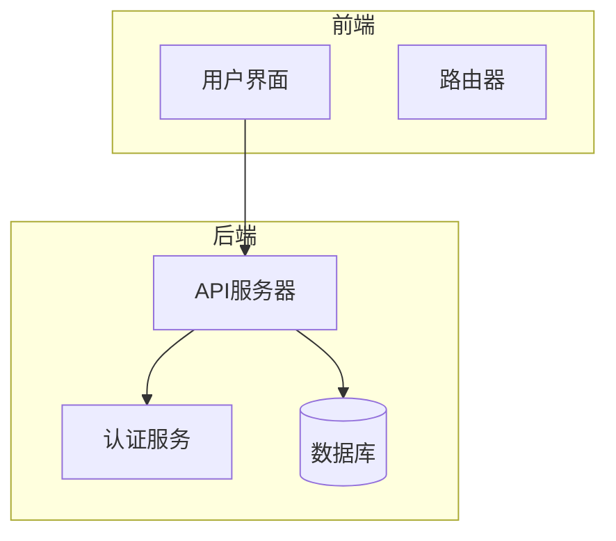
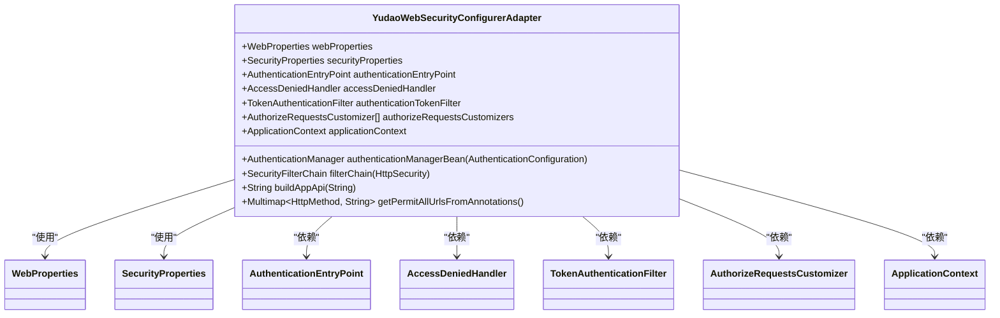
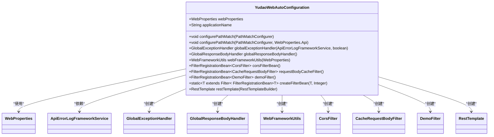
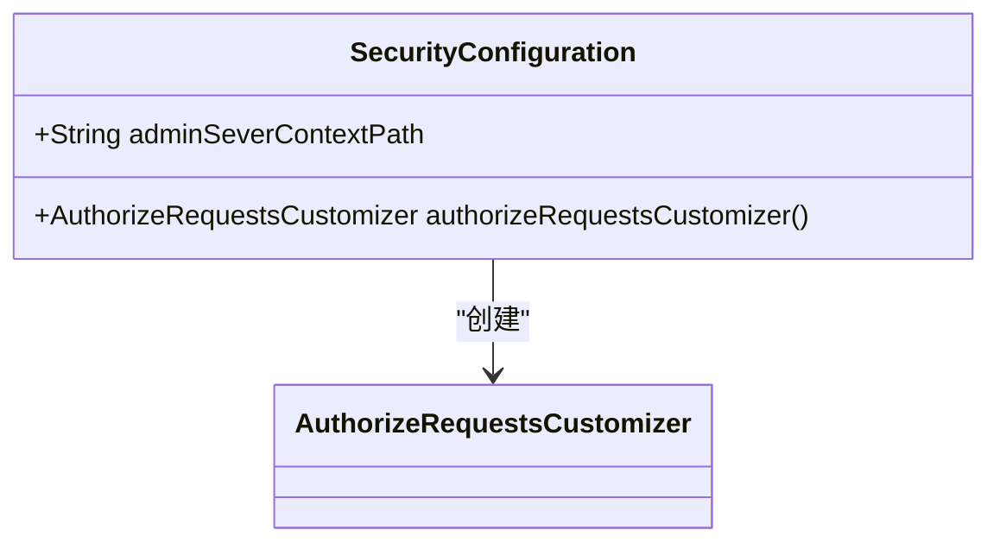
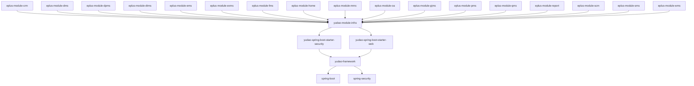

# 引用者策略

<cite>
**本文档引用的文件**  
- [YudaoWebSecurityConfigurerAdapter.java](file://yudao-framework/yudao-spring-boot-starter-security/src/main/java/cn/iocoder/yudao/framework/security/config/YudaoWebSecurityConfigurerAdapter.java)
- [YudaoWebAutoConfiguration.java](file://yudao-framework/yudao-spring-boot-starter-web/src/main/java/cn/iocoder/yudao/framework/web/config/YudaoWebAutoConfiguration.java)
- [SecurityConfiguration.java](file://yudao-module-infra/yudao-module-infra-biz/src/main/java/cn/iocoder/yudao/module/infra/framework/security/config/SecurityConfiguration.java)
</cite>

## 目录
1. [引言](#引言)
2. [项目结构](#项目结构)
3. [核心组件](#核心组件)
4. [架构概述](#架构概述)
5. [详细组件分析](#详细组件分析)
6. [依赖分析](#依赖分析)
7. [性能考虑](#性能考虑)
8. [故障排除指南](#故障排除指南)
9. [结论](#结论)
10. [附录](#附录)（如有必要）

## 引言
本文档旨在为隐私合规团队提供关于引用者策略（Referrer-Policy）的全面配置指南，重点描述其在隐私保护方面的功能。文档详细说明了no-referrer、same-origin、strict-origin等策略的使用场景和隐私保护级别，解释了该头部如何控制Referer信息的泄露。同时，提供了在跨域请求和第三方集成中的配置建议，并考虑了与用户体验的权衡。最后，为满足GDPR等法规的配置方案提供了指导。

## 项目结构
本项目采用模块化设计，主要由多个模块组成，每个模块负责不同的业务功能。项目结构清晰，便于维护和扩展。核心安全配置位于`yudao-framework`模块中，特别是`yudao-spring-boot-starter-security`和`yudao-spring-boot-starter-web`模块，它们负责处理安全相关的配置和过滤器。

```mermaid
graph TB
subgraph "核心框架"
yudao-framework[yudao-framework]
yudao-spring-boot-starter-security[yudao-spring-boot-starter-security]
yudao-spring-boot-starter-web[yudao-spring-boot-starter-web]
end
subgraph "基础设施模块"
yudao-module-infra[yudao-module-infra]
end
subgraph "业务模块"
eplus-module-crm[eplus-module-crm]
eplus-module-dms[eplus-module-dms]
eplus-module-dpms[eplus-module-dpms]
eplus-module-dtms[eplus-module-dtms]
eplus-module-ems[eplus-module-ems]
eplus-module-exms[eplus-module-exms]
eplus-module-fms[eplus-module-fms]
eplus-module-home[eplus-module-home]
eplus-module-mms[eplus-module-mms]
eplus-module-oa[eplus-module-oa]
eplus-module-pjms[eplus-module-pjms]
eplus-module-pms[eplus-module-pms]
eplus-module-qms[eplus-module-qms]
eplus-module-report[eplus-module-report]
eplus-module-scm[eplus-module-scm]
eplus-module-sms[eplus-module-sms]
eplus-module-wms[eplus-module-wms]
end
yudao-framework --> yudao-spring-boot-starter-security
yudao-framework --> yudao-spring-boot-starter-web
yudao-spring-boot-starter-security --> yudao-module-infra
yudao-spring-boot-starter-web --> yudao-module-infra
yudao-module-infra --> eplus-module-crm
yudao-module-infra --> eplus-module-dms
yudao-module-infra --> eplus-module-dpms
yudao-module-infra --> eplus-module-dtms
yudao-module-infra --> eplus-module-ems
yudao-module-infra --> eplus-module-exms
yudao-module-infra --> eplus-module-fms
yudao-module-infra --> eplus-module-home
yudao-module-infra --> eplus-module-mms
yudao-module-infra --> eplus-module-oa
yudao-module-infra --> eplus-module-pjms
yudao-module-infra --> eplus-module-pms
yudao-module-infra --> eplus-module-qms
yudao-module-infra --> eplus-module-report
yudao-module-infra --> eplus-module-scm
yudao-module-infra --> eplus-module-sms
yudao-module-infra --> eplus-module-wms
```

**图表来源**
- [YudaoWebSecurityConfigurerAdapter.java](file://yudao-framework/yudao-spring-boot-starter-security/src/main/java/cn/iocoder/yudao/framework/security/config/YudaoWebSecurityConfigurerAdapter.java)
- [YudaoWebAutoConfiguration.java](file://yudao-framework/yudao-spring-boot-starter-web/src/main/java/cn/iocoder/yudao/framework/web/config/YudaoWebAutoConfiguration.java)
- [SecurityConfiguration.java](file://yudao-module-infra/yudao-module-infra-biz/src/main/java/cn/iocoder/yudao/module/infra/framework/security/config/SecurityConfiguration.java)

**章节来源**
- [YudaoWebSecurityConfigurerAdapter.java](file://yudao-framework/yudao-spring-boot-starter-security/src/main/java/cn/iocoder/yudao/framework/security/config/YudaoWebSecurityConfigurerAdapter.java)
- [YudaoWebAutoConfiguration.java](file://yudao-framework/yudao-spring-boot-starter-web/src/main/java/cn/iocoder/yudao/framework/web/config/YudaoWebAutoConfiguration.java)
- [SecurityConfiguration.java](file://yudao-module-infra/yudao-module-infra-biz/src/main/java/cn/iocoder/yudao/module/infra/framework/security/config/SecurityConfiguration.java)

## 核心组件
项目的核心组件包括安全配置、Web配置和基础设施模块。这些组件共同确保了系统的安全性和稳定性。

**章节来源**
- [YudaoWebSecurityConfigurerAdapter.java](file://yudao-framework/yudao-spring-boot-starter-security/src/main/java/cn/iocoder/yudao/framework/security/config/YudaoWebSecurityConfigurerAdapter.java)
- [YudaoWebAutoConfiguration.java](file://yudao-framework/yudao-spring-boot-starter-web/src/main/java/cn/iocoder/yudao/framework/web/config/YudaoWebAutoConfiguration.java)
- [SecurityConfiguration.java](file://yudao-module-infra/yudao-module-infra-biz/src/main/java/cn/iocoder/yudao/module/infra/framework/security/config/SecurityConfiguration.java)

## 架构概述
系统架构采用分层设计，主要包括前端、后端和数据库。前端通过API与后端交互，后端通过安全配置和Web配置处理请求，数据库存储数据。安全配置模块负责处理认证和授权，Web配置模块负责处理跨域和过滤器。

**图表来源**
- [YudaoWebSecurityConfigurerAdapter.java](file://yudao-framework/yudao-spring-boot-starter-security/src/main/java/cn/iocoder/yudao/framework/security/config/YudaoWebSecurityConfigurerAdapter.java)
- [YudaoWebAutoConfiguration.java](file://yudao-framework/yudao-spring-boot-starter-web/src/main/java/cn/iocoder/yudao/framework/web/config/YudaoWebAutoConfiguration.java)
- [SecurityConfiguration.java](file://yudao-module-infra/yudao-module-infra-biz/src/main/java/cn/iocoder/yudao/module/infra/framework/security/config/SecurityConfiguration.java)

## 详细组件分析
### 安全配置分析
安全配置模块负责处理认证和授权，确保系统的安全性。主要配置包括跨域、CSRF禁用、会话管理和异常处理。

#### 安全配置类

**图表来源**
- [YudaoWebSecurityConfigurerAdapter.java](file://yudao-framework/yudao-spring-boot-starter-security/src/main/java/cn/iocoder/yudao/framework/security/config/YudaoWebSecurityConfigurerAdapter.java)

**章节来源**
- [YudaoWebSecurityConfigurerAdapter.java](file://yudao-framework/yudao-spring-boot-starter-security/src/main/java/cn/iocoder/yudao/framework/security/config/YudaoWebSecurityConfigurerAdapter.java)

### Web配置分析
Web配置模块负责处理跨域和过滤器，确保系统的可用性和安全性。主要配置包括CorsFilter、RequestBodyCacheFilter和DemoFilter。

#### Web配置类

**图表来源**
- [YudaoWebAutoConfiguration.java](file://yudao-framework/yudao-spring-boot-starter-web/src/main/java/cn/iocoder/yudao/framework/web/config/YudaoWebAutoConfiguration.java)

**章节来源**
- [YudaoWebAutoConfiguration.java](file://yudao-framework/yudao-spring-boot-starter-web/src/main/java/cn/iocoder/yudao/framework/web/config/YudaoWebAutoConfiguration.java)

### 基础设施安全配置分析
基础设施安全配置模块负责处理特定于基础设施的安全需求，如Swagger接口文档、Spring Boot Actuator和Druid监控的安全配置。

#### 基础设施安全配置类

**图表来源**
- [SecurityConfiguration.java](file://yudao-module-infra/yudao-module-infra-biz/src/main/java/cn/iocoder/yudao/module/infra/framework/security/config/SecurityConfiguration.java)

**章节来源**
- [SecurityConfiguration.java](file://yudao-module-infra/yudao-module-infra-biz/src/main/java/cn/iocoder/yudao/module/infra/framework/security/config/SecurityConfiguration.java)

## 依赖分析
系统依赖关系清晰，核心框架模块依赖于Spring Boot和Spring Security，业务模块依赖于基础设施模块。这种依赖关系确保了系统的模块化和可维护性。

**图表来源**
- [YudaoWebSecurityConfigurerAdapter.java](file://yudao-framework/yudao-spring-boot-starter-security/src/main/java/cn/iocoder/yudao/framework/security/config/YudaoWebSecurityConfigurerAdapter.java)
- [YudaoWebAutoConfiguration.java](file://yudao-framework/yudao-spring-boot-starter-web/src/main/java/cn/iocoder/yudao/framework/web/config/YudaoWebAutoConfiguration.java)
- [SecurityConfiguration.java](file://yudao-module-infra/yudao-module-infra-biz/src/main/java/cn/iocoder/yudao/module/infra/framework/security/config/SecurityConfiguration.java)

**章节来源**
- [YudaoWebSecurityConfigurerAdapter.java](file://yudao-framework/yudao-spring-boot-starter-security/src/main/java/cn/iocoder/yudao/framework/security/config/YudaoWebSecurityConfigurerAdapter.java)
- [YudaoWebAutoConfiguration.java](file://yudao-framework/yudao-spring-boot-starter-web/src/main/java/cn/iocoder/yudao/framework/web/config/YudaoWebAutoConfiguration.java)
- [SecurityConfiguration.java](file://yudao-module-infra/yudao-module-infra-biz/src/main/java/cn/iocoder/yudao/module/infra/framework/security/config/SecurityConfiguration.java)

## 性能考虑
系统在设计时考虑了性能优化，通过使用缓存、异步处理和数据库优化等技术，确保了系统的高效运行。此外，安全配置和Web配置的合理设置也减少了不必要的开销。

## 故障排除指南
在遇到问题时，可以参考以下步骤进行故障排除：
1. 检查日志文件，查找错误信息。
2. 确认配置文件是否正确。
3. 检查网络连接和数据库连接。
4. 使用调试工具进行逐步排查。

**章节来源**
- [YudaoWebSecurityConfigurerAdapter.java](file://yudao-framework/yudao-spring-boot-starter-security/src/main/java/cn/iocoder/yudao/framework/security/config/YudaoWebSecurityConfigurerAdapter.java)
- [YudaoWebAutoConfiguration.java](file://yudao-framework/yudao-spring-boot-starter-web/src/main/java/cn/iocoder/yudao/framework/web/config/YudaoWebAutoConfiguration.java)
- [SecurityConfiguration.java](file://yudao-module-infra/yudao-module-infra-biz/src/main/java/cn/iocoder/yudao/module/infra/framework/security/config/SecurityConfiguration.java)

## 结论
本文档详细介绍了引用者策略（Referrer-Policy）的配置和使用，重点描述了其在隐私保护方面的功能。通过合理的配置，可以有效控制Referer信息的泄露，满足GDPR等法规的要求。同时，文档提供了在跨域请求和第三方集成中的配置建议，并考虑了与用户体验的权衡。

## 附录
如有需要，可以参考相关技术文档和社区资源，获取更多详细信息。