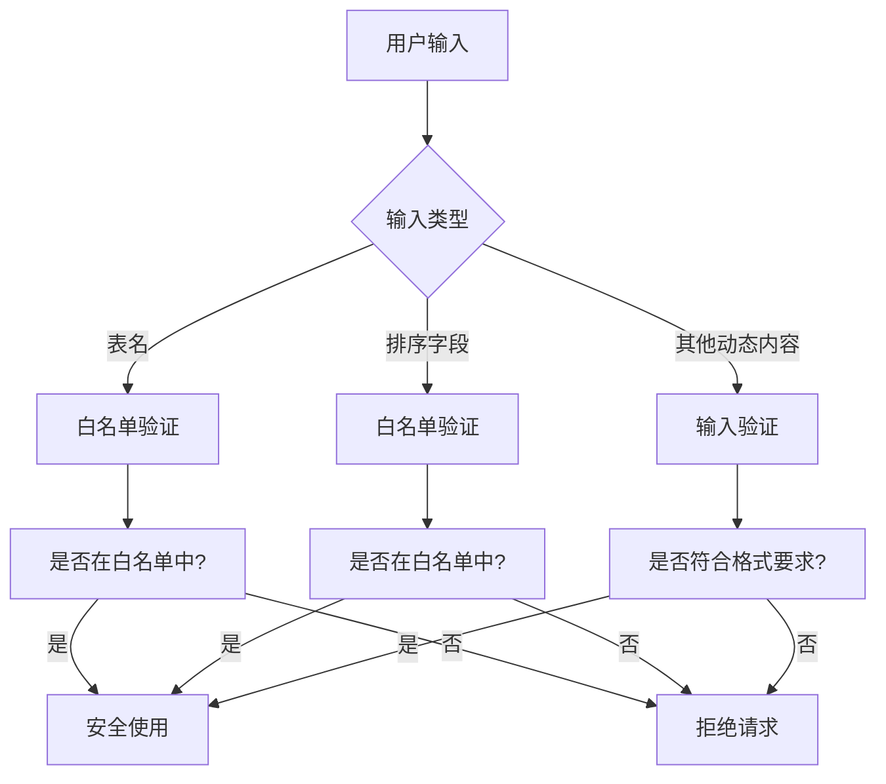
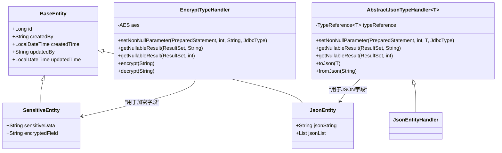

# ORM安全使用

<cite>
**本文档引用文件**  
- [MyBatisUtils.java](file://yudao-framework/yudao-spring-boot-starter-mybatis/src/main/java/cn/iocoder/yudao/framework/mybatis/core/util/MyBatisUtils.java)
- [DataPermissionDatabaseInterceptor.java](file://yudao-framework/yudao-spring-boot-starter-data-permission/src/main/java/cn/iocoder/yudao/framework/datapermission/core/db/DataPermissionDatabaseInterceptor.java)
- [InEnum.java](file://yudao-framework/yudao-common/src/main/java/cn/iocoder/yudao/framework/common/validation/InEnum.java)
- [InEnumValidator.java](file://yudao-framework/yudao-common/src/main/java/cn/iocoder/yudao/framework/common/validation/InEnumValidator.java)
- [AbstractJsonTypeHandler.java](file://eplus-framework/eplus-common/src/main/java/com/syj/eplus/framework/common/config/handler/AbstractJsonTypeHandler.java)
- [EncryptTypeHandler.java](file://eplus-framework/eplus-common/src/main/java/com/syj/eplus/framework/common/config/handler/EncryptTypeHandler.java)
- [BaseSkuEntity.java](file://eplus-framework/eplus-common/src/main/java/com/syj/eplus/framework/common/entity/BaseSkuEntity.java)
- [CustInfoSaveReqVO.java](file://eplus-module-crm/eplus-module-crm-biz/src/main/java/com/syj/eplus/module/crm/controller/admin/cust/vo/CustInfoSaveReqVO.java)
- [SnMapper.xml](file://eplus-module-infra/eplus-module-infra-biz/src/main/resources/mapper/sn/SnMapper.xml)
</cite>

## 目录
1. [引言](#引言)
2. [占位符本质区别](#占位符本质区别)
3. [参数化查询优势](#参数化查询优势)
4. [动态场景安全方案](#动态场景安全方案)
5. [自动转义机制](#自动转义机制)
6. [实体类设计安全](#实体类设计安全)
7. [总结](#总结)

## 引言
本文档旨在详细说明MyBatis框架的安全使用实践，重点分析#{}和${}两种占位符的本质区别及其安全影响。通过深入探讨参数化查询的优势、动态SQL的安全控制方案以及实体类设计中的安全考虑，为开发人员提供全面的ORM安全使用指南。

**本文档引用文件**  
- [MyBatisUtils.java](file://yudao-framework/yudao-spring-boot-starter-mybatis/src/main/java/cn/iocoder/yudao/framework/mybatis/core/util/MyBatisUtils.java)
- [DataPermissionDatabaseInterceptor.java](file://yudao-framework/yudao-spring-boot-starter-data-permission/src/main/java/cn/iocoder/yudao/framework/datapermission/core/db/DataPermissionDatabaseInterceptor.java)

## 占位符本质区别
MyBatis提供了两种参数占位符：#{}和${}，它们在SQL处理机制上有本质区别。

#{}占位符采用预编译参数化查询方式，将参数作为预编译语句的参数处理，由JDBC PreparedStatement进行安全绑定。而${}占位符则是简单的字符串替换，在SQL解析阶段直接将变量值拼接到SQL语句中。

这种机制差异导致了完全不同的安全特性：#{}能够有效防止SQL注入攻击，而${}则存在严重的安全风险，特别是在处理用户输入时。

```mermaid
graph TD
A[SQL语句] --> B{使用哪种占位符?}
B --> |#{}}| C[预编译参数化查询]
B --> |${}}| D[字符串直接替换]
C --> E[安全绑定参数]
D --> F[潜在SQL注入风险]
E --> G[防止SQL注入]
F --> H[易受SQL注入攻击]
```

**图示来源**  
- [MyBatisUtils.java](file://yudao-framework/yudao-spring-boot-starter-mybatis/src/main/java/cn/iocoder/yudao/framework/mybatis/core/util/MyBatisUtils.java#L37)

## 参数化查询优势
#{}占位符的参数化查询机制具有多重安全优势。首先，它将SQL语句结构与参数数据分离，确保参数值不会被解释为SQL代码的一部分。其次，数据库驱动会对参数进行适当的转义处理，防止特殊字符破坏SQL语句结构。

在实际应用中，参数化查询还能提高SQL执行效率，因为数据库可以缓存预编译的执行计划。同时，它支持类型安全检查，确保参数类型与数据库字段类型匹配，减少数据类型转换错误。

```mermaid
graph LR
A[应用程序] --> B[#{}参数化查询]
B --> C[JDBC PreparedStatement]
C --> D[预编译SQL]
D --> E[参数安全绑定]
E --> F[数据库执行]
F --> G[结果返回]
```

**图示来源**  
- [DataPermissionDatabaseInterceptor.java](file://yudao-framework/yudao-spring-boot-starter-data-permission/src/main/java/cn/iocoder/yudao/framework/datapermission/core/db/DataPermissionDatabaseInterceptor.java#L95-L106)

## 动态场景安全方案
在某些必须使用${}的动态场景中，如动态表名、排序字段等，需要实施严格的安全控制措施。

对于动态表名，应建立白名单机制，只允许预定义的合法表名通过。可以使用枚举类型或常量类来定义所有允许的表名，并在使用前进行验证。

对于排序字段，同样需要白名单验证，只允许预定义的字段名作为排序依据。同时，应对输入进行严格的格式验证，确保不包含任何SQL关键字或特殊字符。



**图示来源**  
- [InEnum.java](file://yudao-framework/yudao-common/src/main/java/cn/iocoder/yudao/framework/common/validation/InEnum.java#L23-L27)
- [InEnumValidator.java](file://yudao-framework/yudao-common/src/main/java/cn/iocoder/yudao/framework/common/validation/InEnumValidator.java#L12-L43)

## 自动转义机制
MyBatis框架通过PreparedStatement的自动转义机制来保障SQL安全。当使用#{}占位符时，框架会将参数传递给JDBC PreparedStatement，由数据库驱动程序负责对特殊字符进行转义处理。

这种机制能够有效处理单引号、双引号、分号、注释符号等可能被用于SQL注入的特殊字符。同时，框架还支持类型安全特性，确保参数类型与数据库字段类型一致，防止类型转换漏洞。

在多租户环境下，框架还实现了数据权限拦截器，自动为查询添加租户过滤条件，确保数据隔离。

```mermaid
graph TB
A[用户输入] --> B[MyBatis框架]
B --> C{使用#{}?}
C --> |是| D[PreparedStatement绑定]
C --> |否| E[字符串拼接]
D --> F[数据库驱动转义]
F --> G[安全SQL执行]
E --> H[潜在安全风险]
```

**图示来源**  
- [DataPermissionDatabaseInterceptor.java](file://yudao-framework/yudao-spring-boot-starter-data-permission/src/main/java/cn/iocoder/yudao/framework/datapermission/core/db/DataPermissionDatabaseInterceptor.java#L89-L106)

## 实体类设计安全
实体类设计中的安全考虑包括字段验证和数据完整性约束。通过使用JSR-303验证注解，可以在数据持久化前进行有效性检查。

对于敏感字段，可以使用加密TypeHandler进行自动加解密处理。自定义TypeHandler能够实现字段级别的加密存储，确保敏感数据在数据库中的安全性。

同时，应合理设计JSON字段的序列化和反序列化机制，使用统一的基类处理器来保证JSON数据处理的一致性和安全性。



**图示来源**  
- [AbstractJsonTypeHandler.java](file://eplus-framework/eplus-common/src/main/java/com/syj/eplus/framework/common/config/handler/AbstractJsonTypeHandler.java#L33-L89)
- [EncryptTypeHandler.java](file://eplus-framework/eplus-common/src/main/java/com/syj/eplus/framework/common/config/handler/EncryptTypeHandler.java#L21-L42)
- [BaseSkuEntity.java](file://eplus-framework/eplus-common/src/main/java/com/syj/eplus/framework/common/entity/BaseSkuEntity.java#L8-L29)

## 总结
MyBatis框架的安全使用需要遵循以下最佳实践：优先使用#{}占位符进行参数化查询，避免使用${}占位符处理用户输入；在必须使用动态SQL的场景中，实施严格的白名单验证和输入过滤；利用框架提供的自动转义和类型安全特性；在实体类设计中集成字段验证和加密处理。

通过综合运用这些安全措施，可以有效防范SQL注入等安全风险，确保应用程序的数据访问安全。

**本文档引用文件**  
- [CustInfoSaveReqVO.java](file://eplus-module-crm/eplus-module-crm-biz/src/main/java/com/syj/eplus/module/crm/controller/admin/cust/vo/CustInfoSaveReqVO.java#L18-L41)
- [SnMapper.xml](file://eplus-module-infra/eplus-module-infra-biz/src/main/resources/mapper/sn/SnMapper.xml#L1-L12)