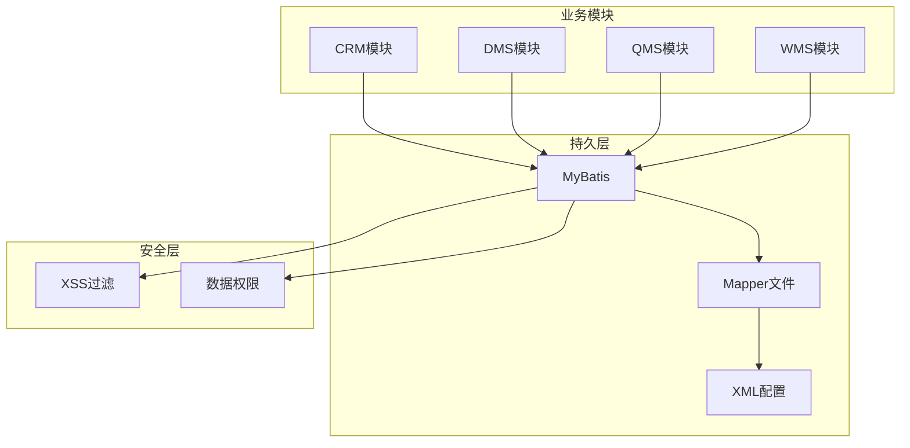
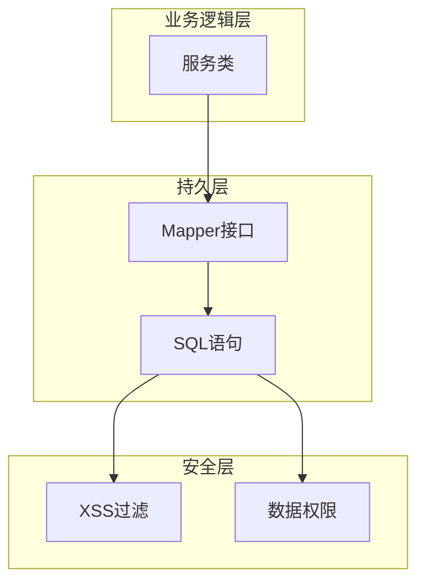
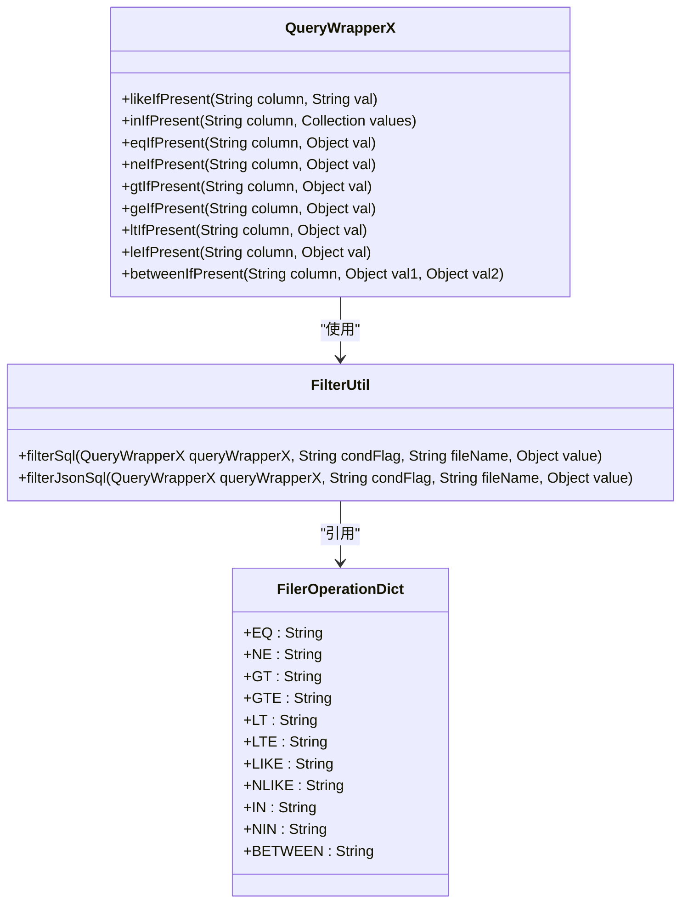
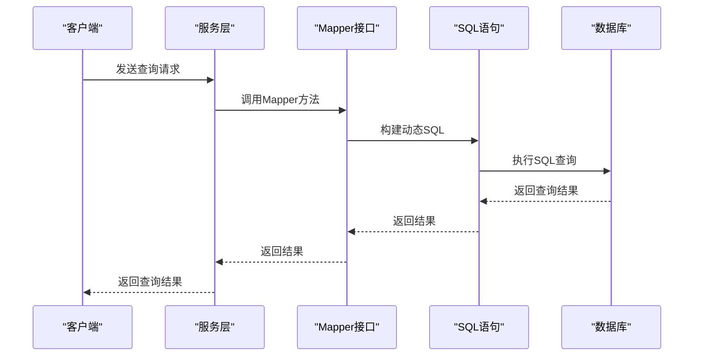
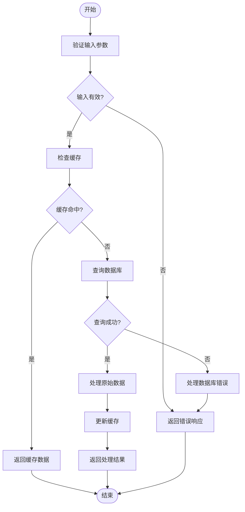
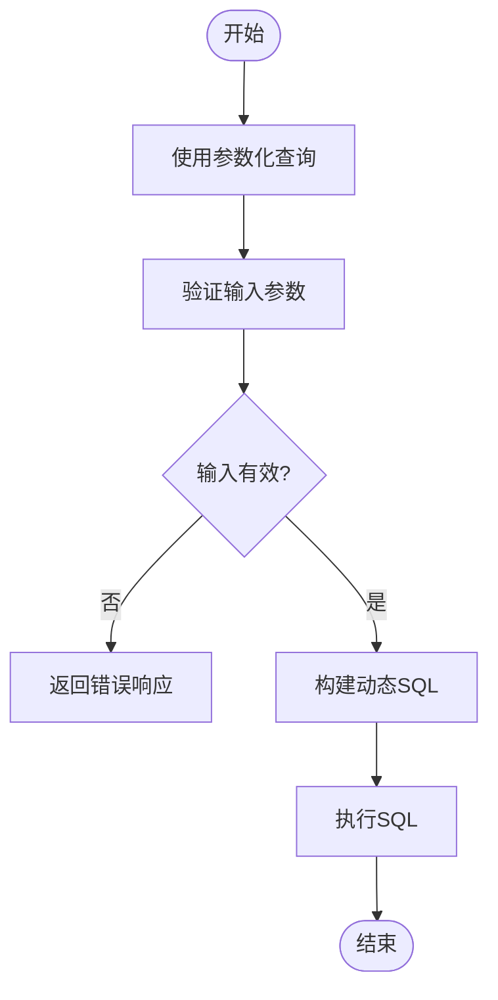

# 动态SQL安全

<cite>
**本文档引用的文件**   
- [CustMapper.java](file://eplus-module-crm/eplus-module-crm-biz/src/main/java/com/syj/eplus/module/crm/dal/mysql/cust/CustMapper.java)
- [ShipmentMapper.java](file://eplus-module-dms/eplus-module-dms-biz/src/main/java/com/syj/eplus/module/dms/dal/mysql/shipment/ShipmentMapper.java)
- [CustMapper.xml](file://eplus-module-crm/eplus-module-crm-biz/src/main/resources/mapper/CustMapper.xml)
- [ShipmentItemMapper.xml](file://eplus-module-dms/eplus-module-dms-biz/src/main/resources/mapper/ShipmentItemMapper.xml)
- [QueryWrapperX.java](file://yudao-framework/yudao-spring-boot-starter-mybatis/src/main/java/cn/iocoder/yudao/framework/mybatis/core/query/QueryWrapperX.java)
- [FilterUtil.java](file://yudao-framework/yudao-spring-boot-starter-mybatis/src/main/java/cn/iocoder/yudao/framework/mybatis/core/util/FilterUtil.java)
- [FilerOperationDict.java](file://yudao-framework/yudao-spring-boot-starter-mybatis/src/main/java/cn/iocoder/yudao/framework/mybatis/core/enums/FilerOperationDict.java)
- [DataPermissionDatabaseInterceptor.java](file://yudao-framework/yudao-spring-boot-starter-data-permission/src/main/java/cn/iocoder/yudao/framework/datapermission/core/db/DataPermissionDatabaseInterceptor.java)
- [XssFilter.java](file://yudao-framework/yudao-spring-boot-starter-web/src/main/java/cn/iocoder/yudao/framework/xss/core/filter/XssFilter.java)
- [JsoupXssCleaner.java](file://yudao-framework/yudao-spring-boot-starter-web/src/main/java/cn/iocoder/yudao/framework/xss/core/clean/JsoupXssCleaner.java)
</cite>

## 目录
1. [引言](#引言)
2. [项目结构](#项目结构)
3. [核心组件](#核心组件)
4. [架构概述](#架构概述)
5. [详细组件分析](#详细组件分析)
6. [依赖分析](#依赖分析)
7. [性能考虑](#性能考虑)
8. [故障排除指南](#故障排除指南)
9. [结论](#结论)
10. [附录](#附录)（如有必要）

## 引言
本文档旨在为开发者提供动态SQL构建的安全实践指南，重点解决复杂查询场景下的SQL注入风险。文档详细介绍了使用MyBatis的script标签和动态SQL元素（如if、choose、where）的安全指南，以及如何安全地构建动态查询条件、排序和分页参数。通过白名单验证、输入过滤和模式匹配等方法，保护动态SQL免受攻击。同时，文档提供了动态SQL代码的审计清单，帮助开发者避免直接拼接用户输入、使用参数化查询等关键检查点。

## 项目结构
本项目采用模块化设计，包含多个业务模块，如CRM、DMS、QMS等，每个模块都有独立的API和业务逻辑层。项目使用MyBatis作为持久层框架，通过XML和注解方式定义SQL语句。动态SQL的实现主要集中在各个模块的Mapper文件中，通过条件判断和循环等动态元素构建复杂的查询语句。

**图表来源**
- [CustMapper.java](file://eplus-module-crm/eplus-module-crm-biz/src/main/java/com/syj/eplus/module/crm/dal/mysql/cust/CustMapper.java)
- [ShipmentMapper.java](file://eplus-module-dms/eplus-module-dms-biz/src/main/java/com/syj/eplus/module/dms/dal/mysql/shipment/ShipmentMapper.java)
- [XssFilter.java](file://yudao-framework/yudao-spring-boot-starter-web/src/main/java/cn/iocoder/yudao/framework/xss/core/filter/XssFilter.java)
- [DataPermissionDatabaseInterceptor.java](file://yudao-framework/yudao-spring-boot-starter-data-permission/src/main/java/cn/iocoder/yudao/framework/datapermission/core/db/DataPermissionDatabaseInterceptor.java)

**章节来源**
- [CustMapper.java](file://eplus-module-crm/eplus-module-crm-biz/src/main/java/com/syj/eplus/module/crm/dal/mysql/cust/CustMapper.java)
- [ShipmentMapper.java](file://eplus-module-dms/eplus-module-dms-biz/src/main/java/com/syj/eplus/module/dms/dal/mysql/shipment/ShipmentMapper.java)
- [CustMapper.xml](file://eplus-module-crm/eplus-module-crm-biz/src/main/resources/mapper/CustMapper.xml)
- [ShipmentItemMapper.xml](file://eplus-module-dms/eplus-module-dms-biz/src/main/resources/mapper/ShipmentItemMapper.xml)

## 核心组件
本项目的核心组件包括MyBatis的Mapper接口和XML配置文件，以及相关的安全过滤器和数据权限拦截器。Mapper接口通过注解和XML文件定义SQL语句，支持动态SQL的构建。安全过滤器和数据权限拦截器则确保SQL语句的安全性和数据的访问控制。

**章节来源**
- [QueryWrapperX.java](file://yudao-framework/yudao-spring-boot-starter-mybatis/src/main/java/cn/iocoder/yudao/framework/mybatis/core/query/QueryWrapperX.java)
- [FilterUtil.java](file://yudao-framework/yudao-spring-boot-starter-mybatis/src/main/java/cn/iocoder/yudao/framework/mybatis/core/util/FilterUtil.java)
- [FilerOperationDict.java](file://yudao-framework/yudao-spring-boot-starter-mybatis/src/main/java/cn/iocoder/yudao/framework/mybatis/core/enums/FilerOperationDict.java)

## 架构概述
系统架构采用分层设计，包括业务逻辑层、持久层和安全层。业务逻辑层通过调用持久层的Mapper接口执行数据库操作，持久层使用MyBatis框架构建动态SQL语句，安全层通过XSS过滤器和数据权限拦截器确保SQL语句的安全性和数据的访问控制。

**图表来源**
- [CustMapper.java](file://eplus-module-crm/eplus-module-crm-biz/src/main/java/com/syj/eplus/module/crm/dal/mysql/cust/CustMapper.java)
- [ShipmentMapper.java](file://eplus-module-dms/eplus-module-dms-biz/src/main/java/com/syj/eplus/module/dms/dal/mysql/shipment/ShipmentMapper.java)
- [XssFilter.java](file://yudao-framework/yudao-spring-boot-starter-web/src/main/java/cn/iocoder/yudao/framework/xss/core/filter/XssFilter.java)
- [DataPermissionDatabaseInterceptor.java](file://yudao-framework/yudao-spring-boot-starter-data-permission/src/main/java/cn/iocoder/yudao/framework/datapermission/core/db/DataPermissionDatabaseInterceptor.java)

## 详细组件分析

### 动态SQL构建分析
动态SQL的构建主要通过MyBatis的`<if>`、`<choose>`、`<where>`等标签实现。这些标签允许根据条件动态地添加SQL片段，从而构建复杂的查询语句。例如，在`CustMapper.xml`中，通过`<if>`标签判断用户输入的查询条件，动态地添加到SQL语句中。

#### 对象导向组件分析：

**图表来源**
- [QueryWrapperX.java](file://yudao-framework/yudao-spring-boot-starter-mybatis/src/main/java/cn/iocoder/yudao/framework/mybatis/core/query/QueryWrapperX.java)
- [FilterUtil.java](file://yudao-framework/yudao-spring-boot-starter-mybatis/src/main/java/cn/iocoder/yudao/framework/mybatis/core/util/FilterUtil.java)
- [FilerOperationDict.java](file://yudao-framework/yudao-spring-boot-starter-mybatis/src/main/java/cn/iocoder/yudao/framework/mybatis/core/enums/FilerOperationDict.java)

#### API/服务组件分析：

**图表来源**
- [CustMapper.java](file://eplus-module-crm/eplus-module-crm-biz/src/main/java/com/syj/eplus/module/crm/dal/mysql/cust/CustMapper.java)
- [ShipmentMapper.java](file://eplus-module-dms/eplus-module-dms-biz/src/main/java/com/syj/eplus/module/dms/dal/mysql/shipment/ShipmentMapper.java)

#### 复杂逻辑组件分析：

**图表来源**
- [CustMapper.java](file://eplus-module-crm/eplus-module-crm-biz/src/main/java/com/syj/eplus/module/crm/dal/mysql/cust/CustMapper.java)
- [ShipmentMapper.java](file://eplus-module-dms/eplus-module-dms-biz/src/main/java/com/syj/eplus/module/dms/dal/mysql/shipment/ShipmentMapper.java)

**章节来源**
- [CustMapper.java](file://eplus-module-crm/eplus-module-crm-biz/src/main/java/com/syj/eplus/module/crm/dal/mysql/cust/CustMapper.java)
- [ShipmentMapper.java](file://eplus-module-dms/eplus-module-dms-biz/src/main/java/com/syj/eplus/module/dms/dal/mysql/shipment/ShipmentMapper.java)
- [CustMapper.xml](file://eplus-module-crm/eplus-module-crm-biz/src/main/resources/mapper/CustMapper.xml)
- [ShipmentItemMapper.xml](file://eplus-module-dms/eplus-module-dms-biz/src/main/resources/mapper/ShipmentItemMapper.xml)

### 概念概述
动态SQL的构建需要考虑安全性，避免SQL注入攻击。通过使用参数化查询、白名单验证和输入过滤等方法，可以有效防止SQL注入。此外，MyBatis的动态SQL元素（如`<if>`、`<choose>`、`<where>`）提供了灵活的条件判断和循环功能，使得构建复杂的查询语句变得更加简单。

[无来源，因为此图表显示的是概念性工作流，而不是实际的代码结构]

[无来源，因为此章节不分析特定的源文件]

## 依赖分析
项目中的各个模块通过MyBatis框架与数据库进行交互，Mapper接口和XML配置文件定义了SQL语句。安全层通过XSS过滤器和数据权限拦截器确保SQL语句的安全性和数据的访问控制。依赖关系清晰，各模块之间的耦合度较低。

**图表来源**
- [CustMapper.java](file://eplus-module-crm/eplus-module-crm-biz/src/main/java/com/syj/eplus/module/crm/dal/mysql/cust/CustMapper.java)
- [ShipmentMapper.java](file://eplus-module-dms/eplus-module-dms-biz/src/main/java/com/syj/eplus/module/dms/dal/mysql/shipment/ShipmentMapper.java)
- [XssFilter.java](file://yudao-framework/yudao-spring-boot-starter-web/src/main/java/cn/iocoder/yudao/framework/xss/core/filter/XssFilter.java)
- [DataPermissionDatabaseInterceptor.java](file://yudao-framework/yudao-spring-boot-starter-data-permission/src/main/java/cn/iocoder/yudao/framework/datapermission/core/db/DataPermissionDatabaseInterceptor.java)

**章节来源**
- [CustMapper.java](file://eplus-module-crm/eplus-module-crm-biz/src/main/java/com/syj/eplus/module/crm/dal/mysql/cust/CustMapper.java)
- [ShipmentMapper.java](file://eplus-module-dms/eplus-module-dms-biz/src/main/java/com/syj/eplus/module/dms/dal/mysql/shipment/ShipmentMapper.java)
- [XssFilter.java](file://yudao-framework/yudao-spring-boot-starter-web/src/main/java/cn/iocoder/yudao/framework/xss/core/filter/XssFilter.java)
- [DataPermissionDatabaseInterceptor.java](file://yudao-framework/yudao-spring-boot-starter-data-permission/src/main/java/cn/iocoder/yudao/framework/datapermission/core/db/DataPermissionDatabaseInterceptor.java)

## 性能考虑
在构建动态SQL时，应尽量减少不必要的查询条件，避免全表扫描。使用索引优化查询性能，合理使用缓存减少数据库访问次数。此外，通过分页查询和批量操作，可以有效提高查询效率。

[无来源，因为此章节提供一般性指导]

## 故障排除指南
当遇到SQL注入问题时，应首先检查输入参数是否经过适当的验证和过滤。确保所有用户输入都通过参数化查询传递，避免直接拼接SQL语句。使用MyBatis的动态SQL元素时，应仔细检查条件判断逻辑，确保不会引入安全漏洞。

**章节来源**
- [XssFilter.java](file://yudao-framework/yudao-spring-boot-starter-web/src/main/java/cn/iocoder/yudao/framework/xss/core/filter/XssFilter.java)
- [JsoupXssCleaner.java](file://yudao-framework/yudao-spring-boot-starter-web/src/main/java/cn/iocoder/yudao/framework/xss/core/clean/JsoupXssCleaner.java)

## 结论
本文档详细介绍了动态SQL构建的安全实践，重点解决了复杂查询场景下的SQL注入风险。通过使用MyBatis的script标签和动态SQL元素，结合白名单验证、输入过滤和模式匹配等方法，可以有效保护动态SQL免受攻击。开发者应遵循文档中的审计清单，确保代码的安全性和可靠性。

[无来源，因为此章节总结而不分析特定的源文件]