# 输出编码

<cite>
**本文档引用的文件**   
- [JsoupXssCleaner.java](file://yudao-framework/yudao-spring-boot-starter-web/src/main/java/cn/iocoder/yudao/framework/xss/core/clean/JsoupXssCleaner.java)
- [XssRequestWrapper.java](file://yudao-framework/yudao-spring-boot-starter-web/src/main/java/cn/iocoder/yudao/framework/xss/core/filter/XssRequestWrapper.java)
- [XssStringJsonDeserializer.java](file://yudao-framework/yudao-spring-boot-starter-web/src/main/java/cn/iocoder/yudao/framework/xss/core/json/XssStringJsonDeserializer.java)
- [JsonUtils.java](file://yudao-framework/yudao-common/src/main/java/cn/iocoder/yudao/framework/common/util/json/JsonUtils.java)
- [CodegenEngine.java](file://yudao-module-infra/yudao-module-infra-biz/src/main/java/cn/iocoder/yudao/module/infra/service/codegen/inner/CodegenEngine.java)
- [CodegenFrontTypeEnum.java](file://yudao-module-infra/yudao-module-infra-biz/src/main/java/cn/iocoder/yudao/module/infra/enums/codegen/CodegenFrontTypeEnum.java)
- [DatabaseDocController.java](file://yudao-module-infra/yudao-module-infra-biz/src/main/java/cn/iocoder/yudao/module/infra/controller/admin/db/DatabaseDocController.java)
- [CustomCellWriteHandler.java](file://yudao-framework/yudao-spring-boot-starter-excel/src/main/java/cn/iocoder/yudao/framework/excel/core/util/CustomCellWriteHandler.java)
- [ExcelUtils.java](file://yudao-framework/yudao-spring-boot-starter-excel/src/main/java/cn/iocoder/yudao/framework/excel/core/util/ExcelUtils.java)
- [ServletUtils.java](file://yudao-framework/yudao-common/src/main/java/cn/iocoder/yudao/framework/common/util/servlet/ServletUtils.java)
</cite>

## 目录
1. [引言](#引言)
2. [系统架构概述](#系统架构概述)
3. [核心组件分析](#核心组件分析)
4. [XSS防护机制详解](#xss防护机制详解)
5. [模板引擎中的输出编码](#模板引擎中的输出编码)
6. [富文本内容安全输出](#富文本内容安全输出)
7. [编码工具类与使用方法](#编码工具类与使用方法)
8. [安全数据渲染示例](#安全数据渲染示例)
9. [常见编码错误解决方案](#常见编码错误解决方案)
10. [结论](#结论)

## 引言

本系统采用多层次的输出编码策略来防止跨站脚本（XSS）攻击，确保动态生成的HTML内容安全。系统通过在数据输入、处理和输出的各个环节实施严格的编码和过滤机制，有效防止恶意脚本执行。本文档详细描述了系统的XSS防护机制，包括HTML编码、JavaScript编码和URL编码的应用场景和实现方式，以及在不同模板引擎中实施输出编码的最佳实践。

## 系统架构概述

系统采用分层架构设计，将XSS防护机制集成在多个层次中。核心的XSS防护功能位于`yudao-framework`模块中，通过`yudao-spring-boot-starter-web`组件提供统一的安全处理。系统利用过滤器、JSON反序列化器和模板引擎等多种技术手段，确保从请求参数到响应输出的全过程都受到保护。

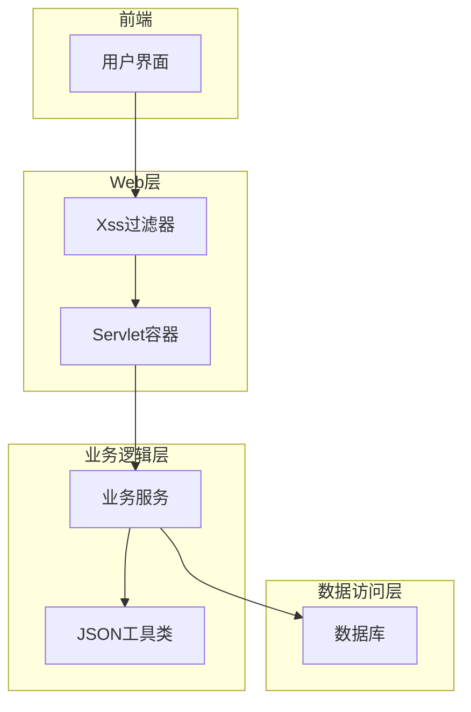

**图示来源**
- [XssRequestWrapper.java](file://yudao-framework/yudao-spring-boot-starter-web/src/main/java/cn/iocoder/yudao/framework/xss/core/filter/XssRequestWrapper.java)
- [JsonUtils.java](file://yudao-framework/yudao-common/src/main/java/cn/iocoder/yudao/framework/common/util/json/JsonUtils.java)

## 核心组件分析

系统的核心安全组件主要集中在`yudao-framework`模块中，特别是`yudao-spring-boot-starter-web`组件。这些组件协同工作，构建了一个完整的XSS防护体系。

### XSS清理器组件

系统使用`JsoupXssCleaner`作为核心的XSS清理器，基于Jsoup库实现HTML内容的安全过滤。该组件定义了严格的安全白名单规则，只允许特定的HTML标签和属性通过。

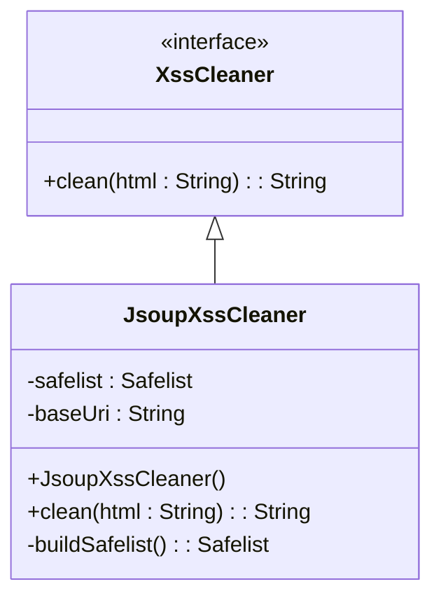

**图示来源**
- [JsoupXssCleaner.java](file://yudao-framework/yudao-spring-boot-starter-web/src/main/java/cn/iocoder/yudao/framework/xss/core/clean/JsoupXssCleaner.java)
- [XssCleaner.java](file://yudao-framework/yudao-spring-boot-starter-web/src/main/java/cn/iocoder/yudao/framework/xss/core/clean/XssCleaner.java)

### 请求包装器组件

`XssRequestWrapper`是系统的关键组件之一，它继承自`HttpServletRequestWrapper`，用于包装原始的HTTP请求，对所有输入数据进行XSS清理。

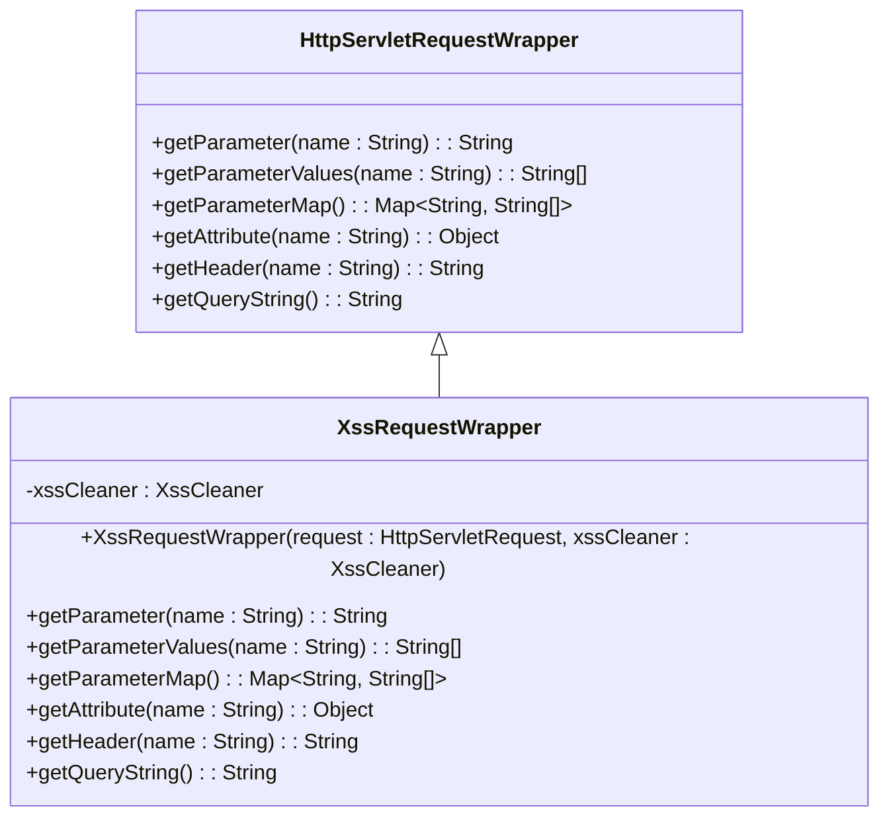

**图示来源**
- [XssRequestWrapper.java](file://yudao-framework/yudao-spring-boot-starter-web/src/main/java/cn/iocoder/yudao/framework/xss/core/filter/XssRequestWrapper.java)

## XSS防护机制详解

### HTML编码机制

系统的HTML编码机制基于`JsoupXssCleaner`实现，采用白名单策略来过滤潜在的XSS攻击。该机制在`buildSafelist`方法中定义了允许的HTML标签和属性。

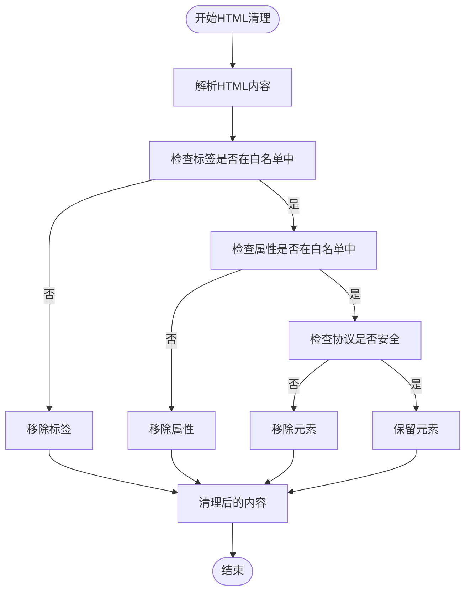

**图示来源**
- [JsoupXssCleaner.java](file://yudao-framework/yudao-spring-boot-starter-web/src/main/java/cn/iocoder/yudao/framework/xss/core/clean/JsoupXssCleaner.java)

### JavaScript编码机制

系统通过`XssStringJsonDeserializer`实现JavaScript编码，该组件在JSON反序列化过程中自动对字符串进行XSS清理。当系统接收到JSON格式的请求数据时，会自动应用此机制。

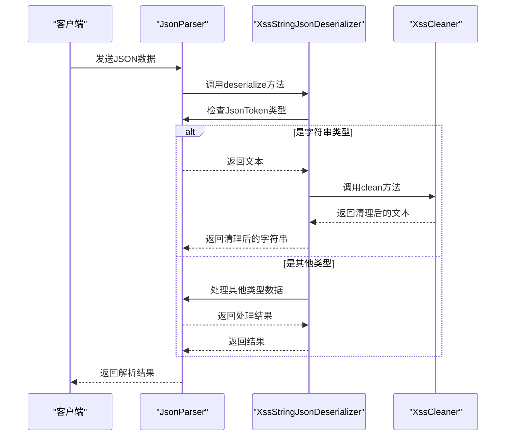

**图示来源**
- [XssStringJsonDeserializer.java](file://yudao-framework/yudao-spring-boot-starter-web/src/main/java/cn/iocoder/yudao/framework/xss/core/json/XssStringJsonDeserializer.java)

### URL编码机制

系统的URL编码机制主要通过`XssRequestWrapper`的`getQueryString`方法实现。当获取URL查询字符串时，系统会自动对其进行XSS清理。

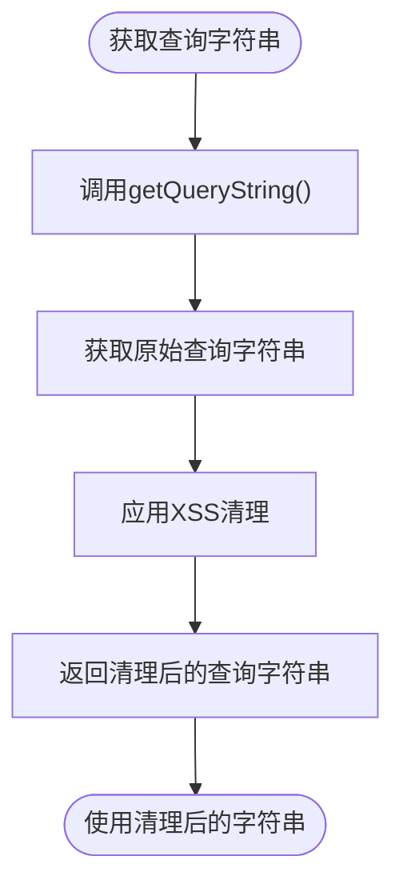

**图示来源**
- [XssRequestWrapper.java](file://yudao-framework/yudao-spring-boot-starter-web/src/main/java/cn/iocoder/yudao/framework/xss/core/filter/XssRequestWrapper.java)

## 模板引擎中的输出编码

### Velocity模板引擎集成

系统使用Velocity模板引擎生成代码和文档，通过`CodegenEngine`类实现模板处理。该引擎在生成前端代码时，会自动应用适当的编码策略。

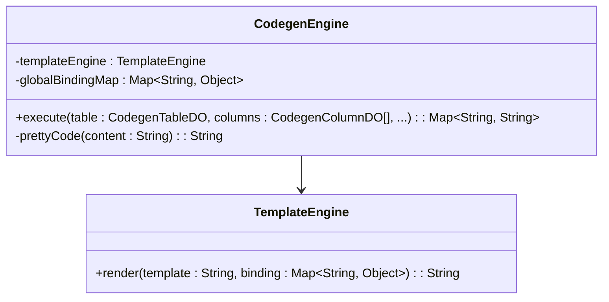

**图示来源**
- [CodegenEngine.java](file://yudao-module-infra/yudao-module-infra-biz/src/main/java/cn/iocoder/yudao/module/infra/service/codegen/inner/CodegenEngine.java)

### 前端模板类型支持

系统支持多种前端模板类型，包括Vue2、Vue3等，每种类型都有相应的编码策略。

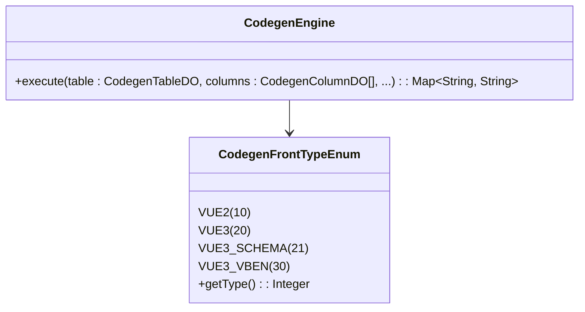

**图示来源**
- [CodegenFrontTypeEnum.java](file://yudao-module-infra/yudao-module-infra-biz/src/main/java/cn/iocoder/yudao/module/infra/enums/codegen/CodegenFrontTypeEnum.java)
- [CodegenEngine.java](file://yudao-module-infra/yudao-module-infra-biz/src/main/java/cn/iocoder/yudao/module/infra/service/codegen/inner/CodegenEngine.java)

## 富文本内容安全输出

### 数据库文档生成中的富文本处理

系统在生成数据库文档时，会处理富文本内容，确保输出安全。

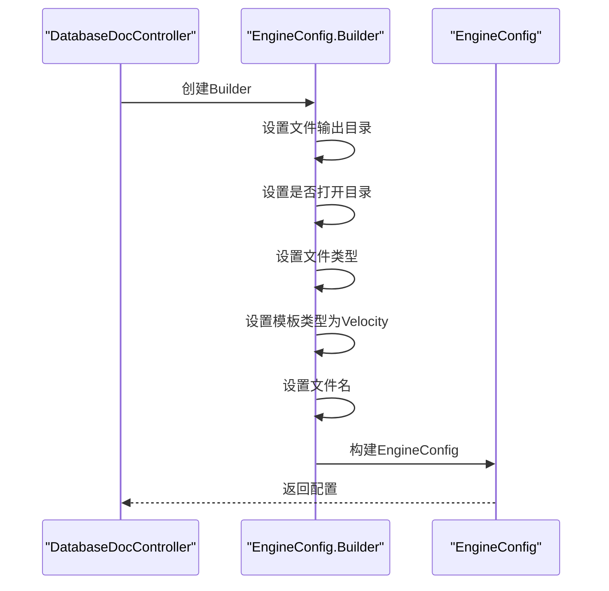

**图示来源**
- [DatabaseDocController.java](file://yudao-module-infra/yudao-module-infra-biz/src/main/java/cn/iocoder/yudao/module/infra/controller/admin/db/DatabaseDocController.java)

### Excel模板中的富文本处理

系统在处理Excel模板时，会对单元格中的富文本内容进行安全处理。

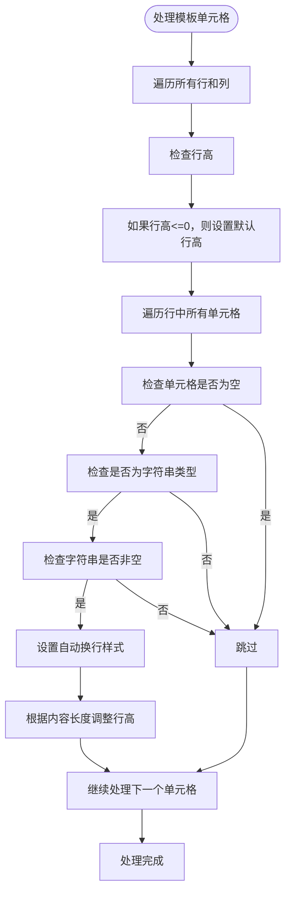

**图示来源**
- [CustomCellWriteHandler.java](file://yudao-framework/yudao-spring-boot-starter-excel/src/main/java/cn/iocoder/yudao/framework/excel/core/util/CustomCellWriteHandler.java)

## 编码工具类与使用方法

### JSON工具类

系统提供`JsonUtils`工具类，用于JSON数据的序列化和反序列化，内置XSS防护机制。

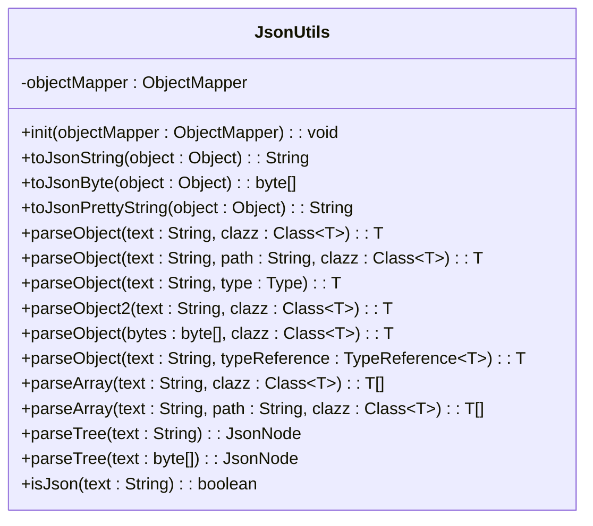

**图示来源**
- [JsonUtils.java](file://yudao-framework/yudao-common/src/main/java/cn/iocoder/yudao/framework/common/util/json/JsonUtils.java)

### Servlet工具类

`ServletUtils`工具类提供了向客户端输出JSON数据的安全方法。

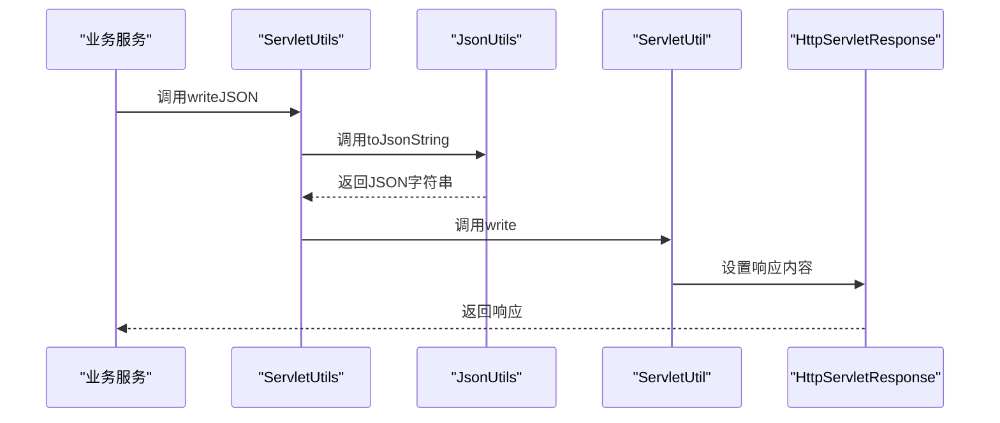

**图示来源**
- [ServletUtils.java](file://yudao-framework/yudao-common/src/main/java/cn/iocoder/yudao/framework/common/util/servlet/ServletUtils.java)
- [JsonUtils.java](file://yudao-framework/yudao-common/src/main/java/cn/iocoder/yudao/framework/common/util/json/JsonUtils.java)

## 安全数据渲染示例

### 安全的JSON响应

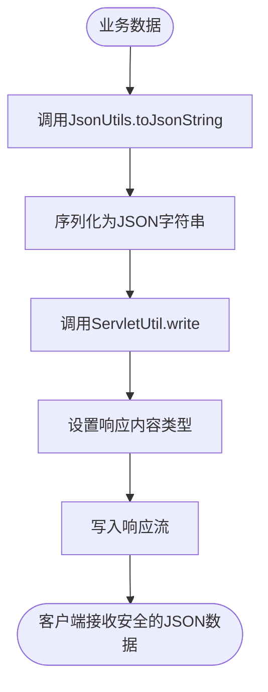

**图示来源**
- [ServletUtils.java](file://yudao-framework/yudao-common/src/main/java/cn/iocoder/yudao/framework/common/util/servlet/ServletUtils.java)

### 安全的Excel导出

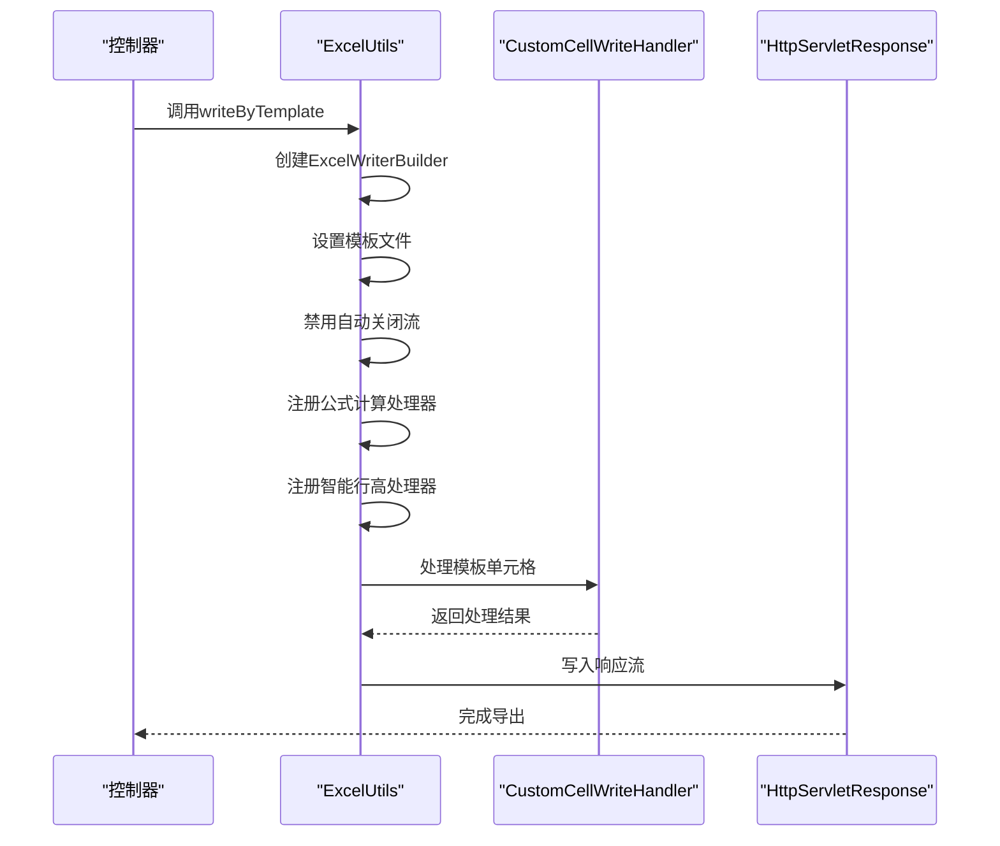

**图示来源**
- [ExcelUtils.java](file://yudao-framework/yudao-spring-boot-starter-excel/src/main/java/cn/iocoder/yudao/framework/excel/core/util/ExcelUtils.java)
- [CustomCellWriteHandler.java](file://yudao-framework/yudao-spring-boot-starter-excel/src/main/java/cn/iocoder/yudao/framework/excel/core/util/CustomCellWriteHandler.java)

## 常见编码错误解决方案

### 错误1：未正确配置XSS过滤器

**问题描述**：XSS过滤器未正确配置，导致某些请求参数未被清理。

**解决方案**：
1. 确保`XssRequestWrapper`被正确应用到所有请求
2. 检查过滤器的URL模式配置
3. 验证`XssCleaner`实例是否正确注入

### 错误2：JSON反序列化绕过XSS防护

**问题描述**：使用自定义的ObjectMapper实例，绕过了系统的XSS防护。

**解决方案**：
1. 使用系统提供的`JsonUtils`工具类
2. 如果必须使用自定义ObjectMapper，确保注册`XssStringJsonDeserializer`
3. 在应用启动时调用`JsonUtils.init()`方法

### 错误3：模板引擎输出未编码

**问题描述**：在模板引擎中直接输出未编码的用户输入。

**解决方案**：
1. 确保所有用户输入在进入模板引擎前已进行编码
2. 使用系统提供的安全模板函数
3. 在模板中避免使用不安全的输出指令

## 结论

本系统通过多层次的输出编码机制，有效防止了XSS攻击。核心的`JsoupXssCleaner`组件提供了强大的HTML内容过滤能力，而`XssRequestWrapper`和`XssStringJsonDeserializer`则确保了所有输入数据的安全性。系统还集成了多种模板引擎的安全输出策略，包括Velocity、Excel模板等。开发者应遵循最佳实践，使用系统提供的工具类和方法，避免常见的编码错误，确保应用程序的安全性。