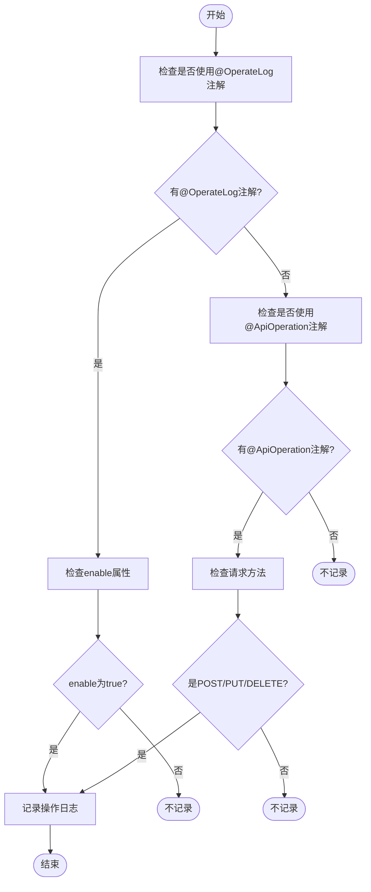
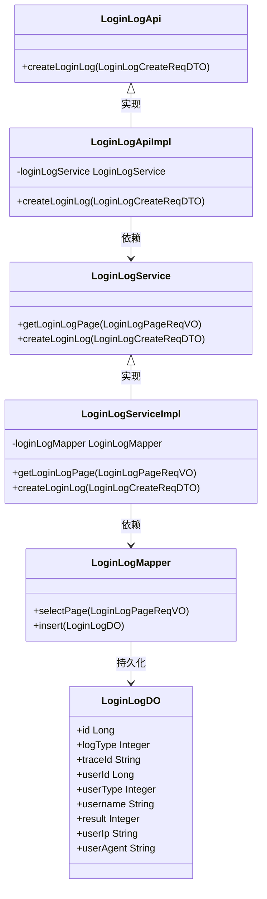
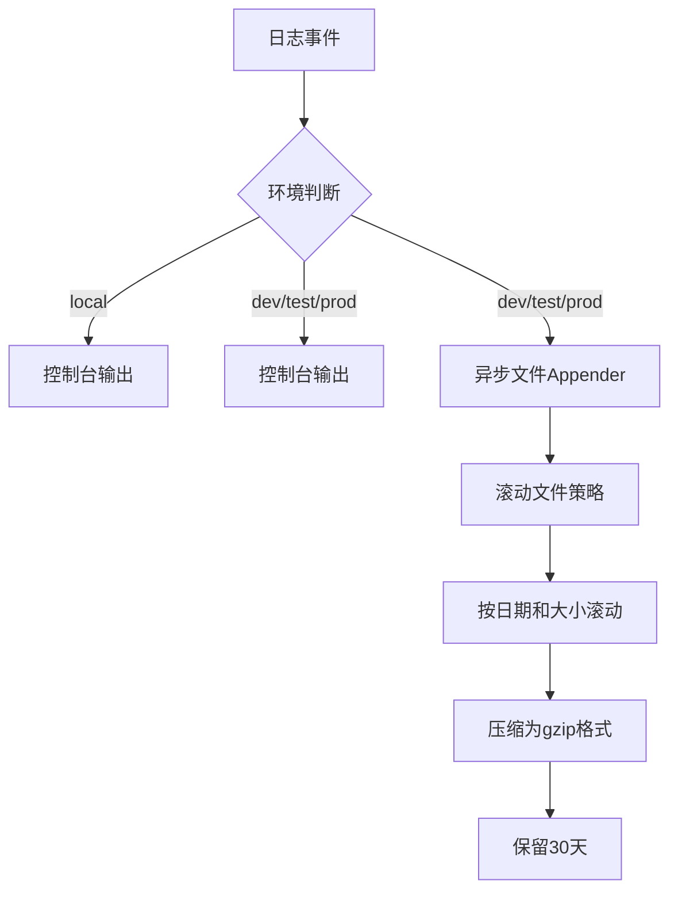
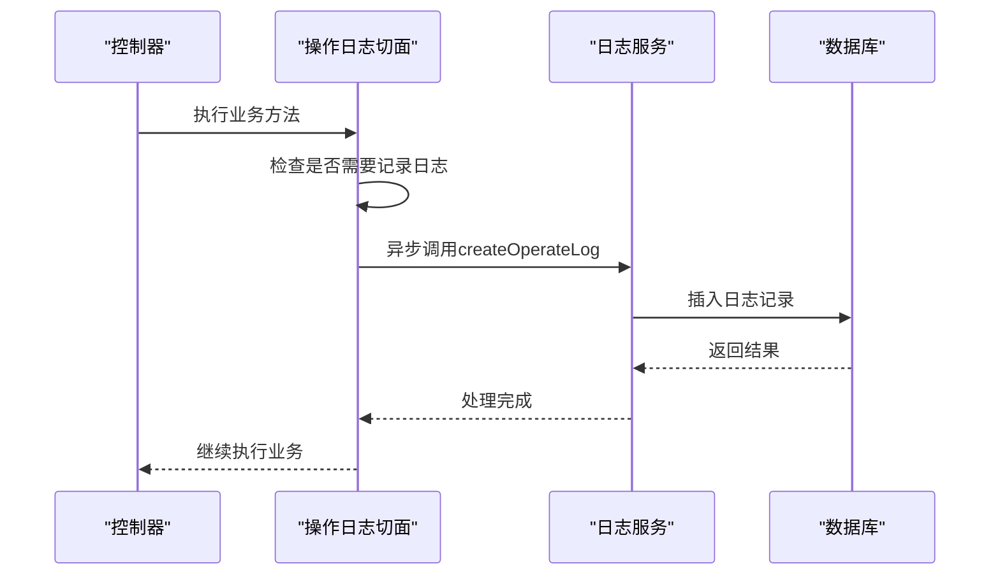

# 日志记录

<cite>
**本文档引用的文件**  
- [OperateLogAspect.java](file://yudao-framework/yudao-spring-boot-starter-operatelog/src/main/java/cn/iocoder/yudao/framework/operatelog/core/aop/OperateLogAspect.java)
- [OperateLog.java](file://yudao-framework/yudao-spring-boot-starter-operatelog/src/main/java/cn/iocoder/yudao/framework/operatelog/core/annotations/OperateLog.java)
- [LoginLogDO.java](file://yudao-module-system/yudao-module-system-biz/src/main/java/cn/iocoder/yudao/module/system/dal/dataobject/logger/LoginLogDO.java)
- [OperateLogDO.java](file://yudao-module-system/yudao-module-system-biz/src/main/java/cn/iocoder/yudao/module/system/dal/dataobject/logger/OperateLogDO.java)
- [LoginLogCreateReqDTO.java](file://yudao-module-system/yudao-module-system-api/src/main/java/cn/iocoder/yudao/module/system/api/logger/dto/LoginLogCreateReqDTO.java)
- [OperateLogCreateReqDTO.java](file://yudao-module-system/yudao-module-system-api/src/main/java/cn/iocoder/yudao/module/system/api/logger/dto/OperateLogCreateReqDTO.java)
- [LoginLogService.java](file://yudao-module-system/yudao-module-system-biz/src/main/java/cn/iocoder/yudao/module/system/service/logger/LoginLogService.java)
- [OperateLogService.java](file://yudao-module-system/yudao-module-system-biz/src/main/java/cn/iocoder/yudao/module/system/service/logger/OperateLogService.java)
- [LoginLogServiceImpl.java](file://yudao-module-system/yudao-module-system-biz/src/main/java/cn/iocoder/yudao/module/system/service/logger/LoginLogServiceImpl.java)
- [OperateLogFrameworkService.java](file://yudao-framework/yudao-spring-boot-starter-operatelog/src/main/java/cn/iocoder/yudao/framework/operatelog/core/service/OperateLogFrameworkService.java)
- [logback-spring.xml](file://yudao-server/src/main/resources/logback-spring.xml)
- [application-local.yaml](file://yudao-server/src/main/resources/application-local.yaml)
</cite>

## 目录
1. [简介](#简介)
2. [日志类型与触发机制](#日志类型与触发机制)
3. [日志内容字段说明](#日志内容字段说明)
4. [日志存储方式](#日志存储方式)
5. [日志级别配置](#日志级别配置)
6. [日志轮转策略](#日志轮转策略)
7. [日志格式设计](#日志格式设计)
8. [性能优化措施](#性能优化措施)
9. [代码示例与配置方法](#代码示例与配置方法)

## 简介
本系统实现了完善的日志记录机制，主要包括登录日志和操作日志两大类。登录日志用于记录用户的登录和登出行为，操作日志则用于记录用户在系统中的各种操作行为，以实现操作审计和追溯功能。系统采用AOP（面向切面编程）技术自动记录操作日志，并通过异步写入和批量处理等技术优化日志记录性能。

## 日志类型与触发机制

### 登录日志触发机制
登录日志由系统在用户进行登录或登出操作时自动触发记录。根据代码分析，系统定义了多种登录类型，包括：
- 账号密码登录（LOGIN_USERNAME）
- 社交登录（LOGIN_SOCIAL）
- 手机登录（LOGIN_MOBILE）
- 短信登录（LOGIN_SMS）

同时，登出操作也分为：
- 用户主动登出（LOGOUT_SELF）
- 系统强制退出（LOGOUT_DELETE）

### 操作日志触发机制
操作日志的触发机制基于AOP切面编程实现，主要通过`@OperateLog`注解来控制。根据`OperateLogAspect`类的实现，满足以下任一条件时会记录操作日志：
1. 使用`@ApiOperation`注解且非`@GetMapping`请求
2. 显式使用`@OperateLog`注解

但是，如果在`@OperateLog`注解中将`enable`属性设置为`false`，则强制不记录日志。



**图示来源**
- [OperateLogAspect.java](file://yudao-framework/yudao-spring-boot-starter-operatelog/src/main/java/cn/iocoder/yudao/framework/operatelog/core/aop/OperateLogAspect.java#L263-L282)

**本节来源**
- [OperateLogAspect.java](file://yudao-framework/yudao-spring-boot-starter-operatelog/src/main/java/cn/iocoder/yudao/framework/operatelog/core/aop/OperateLogAspect.java#L44-L51)
- [OperateLog.java](file://yudao-framework/yudao-spring-boot-starter-operatelog/src/main/java/cn/iocoder/yudao/framework/operatelog/core/annotations/OperateLog.java#L17-L57)

## 日志内容字段说明

### 登录日志字段
登录日志（LoginLogDO）包含以下关键字段：

| 字段名称 | 字段类型 | 说明 |
|---------|--------|------|
| id | Long | 日志主键 |
| logType | Integer | 日志类型，参见LoginLogTypeEnum枚举 |
| traceId | String | 链路追踪编号 |
| userId | Long | 用户编号 |
| userType | Integer | 用户类型 |
| username | String | 用户账号（冗余字段，因为账号可变更） |
| result | Integer | 登录结果，参见LoginResultEnum枚举 |
| userIp | String | 用户IP地址 |
| userAgent | String | 浏览器UA信息 |
| createTime | LocalDateTime | 创建时间（继承自BaseDO） |

### 操作日志字段
操作日志（OperateLogDO）包含以下关键字段：

| 字段名称 | 字段类型 | 说明 |
|---------|--------|------|
| id | Long | 日志主键 |
| traceId | String | 链路追踪编号 |
| userId | Long | 操作用户编号 |
| userType | Integer | 用户类型 |
| username | String | 操作用户账号 |
| duration | Integer | 操作耗时（毫秒） |
| result | Integer | 操作结果（0-成功，非0-失败） |
| resultCode | String | 结果编码 |
| resultMsg | String | 结果信息 |
| exts | Map<String, Object> | 拓展字段 |
| module | String | 操作模块 |
| name | String | 操作名 |
| type | Integer | 操作分类 |
| content | String | 操作内容 |
| requestMethod | String | 请求方法（GET/POST等） |
| requestParams | String | 请求参数（JSON格式） |
| userIp | String | 用户IP地址 |
| userAgent | String | 浏览器UA信息 |
| javaMethod | String | Java方法名 |
| startTime | LocalDateTime | 开始时间 |
| endTime | LocalDateTime | 结束时间 |

**本节来源**
- [LoginLogDO.java](file://yudao-module-system/yudao-module-system-biz/src/main/java/cn/iocoder/yudao/module/system/dal/dataobject/logger/LoginLogDO.java#L27-L72)
- [OperateLogDO.java](file://yudao-module-system/yudao-module-system-biz/src/main/java/cn/iocoder/yudao/module/system/dal/dataobject/logger/OperateLogDO.java)

## 日志存储方式

### 数据库存储
系统将登录日志和操作日志持久化存储到数据库中，分别对应`system_login_log`和`system_operate_log`两张表。

#### 登录日志表结构
- 表名：`system_login_log`
- 主键：`id`（自增）
- 索引：按`id`降序排列，便于分页查询
- 存储引擎：支持Oracle、PostgreSQL、Kingbase、DB2、H2等数据库的主键自增

#### 操作日志表结构
- 表名：`system_operate_log`
- 主键：`id`（自增）
- 索引：按`id`降序排列
- 存储引擎：支持多种数据库的主键自增

### 服务层实现
日志服务层采用典型的三层架构：



**图示来源**
- [LoginLogApi.java](file://yudao-module-system/yudao-module-system-api/src/main/java/cn/iocoder/yudao/module/system/api/logger/LoginLogApi.java)
- [LoginLogApiImpl.java](file://yudao-module-system/yudao-module-system-biz/src/main/java/cn/iocoder/yudao/module/system/api/logger/LoginLogApiImpl.java)
- [LoginLogService.java](file://yudao-module-system/yudao-module-system-biz/src/main/java/cn/iocoder/yudao/module/system/service/logger/LoginLogService.java)
- [LoginLogServiceImpl.java](file://yudao-module-system/yudao-module-system-biz/src/main/java/cn/iocoder/yudao/module/system/service/logger/LoginLogServiceImpl.java)
- [LoginLogMapper.java](file://yudao-module-system/yudao-module-system-biz/src/main/java/cn/iocoder/yudao/module/system/dal/mysql/logger/LoginLogMapper.java)
- [LoginLogDO.java](file://yudao-module-system/yudao-module-system-biz/src/main/java/cn/iocoder/yudao/module/system/dal/dataobject/logger/LoginLogDO.java)

**本节来源**
- [LoginLogDO.java](file://yudao-module-system/yudao-module-system-biz/src/main/java/cn/iocoder/yudao/module/system/dal/dataobject/logger/LoginLogDO.java)
- [LoginLogMapper.java](file://yudao-module-system/yudao-module-system-biz/src/main/java/cn/iocoder/yudao/module/system/dal/mysql/logger/LoginLogMapper.java)
- [LoginLogServiceImpl.java](file://yudao-module-system/yudao-module-system-biz/src/main/java/cn/iocoder/yudao/module/system/service/logger/LoginLogServiceImpl.java)

## 日志级别配置

### 日志级别设置
系统通过Spring Boot的`application.yaml`配置文件来设置日志级别。根据`application-local.yaml`文件的配置，系统设置了多个包的日志级别：

```yaml
logging:
  level:
    cn.iocoder.yudao.module.bpm.dal.mysql: debug
    cn.iocoder.yudao.module.infra.dal.mysql: debug
    cn.iocoder.yudao.module.pay.dal.mysql: debug
    cn.iocoder.yudao.module.system.dal.mysql: debug
    cn.iocoder.yudao.module.tool.dal.mysql: debug
    cn.iocoder.yudao.module.member.dal.mysql: debug
    cn.iocoder.yudao.module.trade.dal.mysql: debug
    cn.iocoder.yudao.module.promotion.dal.mysql: debug
    cn.iocoder.yudao.module.statistics.dal.mysql: debug
    com.syj.eplus: debug
```

### 环境特定配置
系统为不同环境提供了特定的日志配置：
- `application-local.yaml`：本地开发环境
- `application-dev.yaml`：开发环境
- `application-test.yaml`：测试环境
- `application-prod.yaml`：生产环境

所有环境的配置基本一致，都设置了相关模块的`debug`级别日志，便于开发和调试。

**本节来源**
- [application-local.yaml](file://yudao-server/src/main/resources/application-local.yaml#L141-L164)
- [application-dev.yaml](file://yudao-server/src/main/resources/application-dev.yaml#L141-L164)
- [application-prod.yaml](file://yudao-server/src/main/resources/application-prod.yaml#L160-L183)

## 日志轮转策略

### 日志轮转配置
系统使用Logback作为日志框架，通过`logback-spring.xml`文件配置日志轮转策略。主要配置如下：

```xml
<rollingPolicy class="ch.qos.logback.core.rolling.SizeAndTimeBasedRollingPolicy">
    <fileNamePattern>${LOGBACK_ROLLINGPOLICY_FILE_NAME_PATTERN:-${LOG_FILE}.%d{yyyy-MM-dd}.%i.gz}</fileNamePattern>
    <cleanHistoryOnStart>${LOGBACK_ROLLINGPOLICY_CLEAN_HISTORY_ON_START:-false}</cleanHistoryOnStart>
    <maxFileSize>${LOGBACK_ROLLINGPOLICY_MAX_FILE_SIZE:-10MB}</maxFileSize>
    <totalSizeCap>${LOGBACK_ROLLINGPOLICY_TOTAL_SIZE_CAP:-0}</totalSizeCap>
    <maxHistory>${LOGBACK_ROLLINGPOLICY_MAX_HISTORY:-30}</maxHistory>
</rollingPolicy>
```

### 轮转策略说明
- **文件名模式**：`${LOG_FILE}.%d{yyyy-MM-dd}.%i.gz`，按日期和序号命名，压缩为gzip格式
- **清理历史日志**：`cleanHistoryOnStart`设置为`false`，启动时不清理历史日志
- **单个文件大小限制**：`maxFileSize`设置为`10MB`，达到此大小后滚动
- **总大小限制**：`totalSizeCap`设置为`0`，表示不限制总大小
- **保留天数**：`maxHistory`设置为`30`，保留最近30天的日志文件

### 环境差异
不同环境的日志输出方式有所不同：
- **本地环境**：仅输出到控制台
- **其他环境**（dev、test、prod）：输出到控制台和异步文件Appender



**图示来源**
- [logback-spring.xml](file://yudao-server/src/main/resources/logback-spring.xml#L18-L40)

**本节来源**
- [logback-spring.xml](file://yudao-server/src/main/resources/logback-spring.xml#L18-L40)
- [application-local.yaml](file://yudao-server/src/main/resources/application-local.yaml#L142-L144)

## 日志格式设计

### 日志输出格式
系统定义了统一的日志输出格式，通过`PATTERN_DEFAULT`变量配置：

```
%d{yyyy-MM-dd HH:mm:ss.SSS} | %highlight(%5p ${PID:- }) | %boldYellow(%thread [%tid]) %boldGreen(%-40.40logger{39}) | %m%n%wEx
```

### 格式说明
该格式包含以下组成部分：
- **日期时间**：`%d{yyyy-MM-dd HH:mm:ss.SSS}` - 精确到毫秒的日期时间
- **日志级别**：`%highlight(%5p)` - 高亮显示的日志级别（TRACE、DEBUG、INFO、WARN、ERROR）
- **进程ID**：`${PID:- }` - 当前进程ID
- **线程信息**：`%boldYellow(%thread [%tid])` - 线程名和SkyWalking链路追踪ID
- **日志器名称**：`%boldGreen(%-40.40logger{39})` - 日志器名称，限制40个字符
- **消息内容**：`%m` - 日志消息
- **换行符**：`%n` - 换行
- **异常信息**：`%wEx` - 异常堆栈信息

### 结构化日志
对于数据库存储的日志，系统采用结构化的JSON格式存储请求参数和拓展字段：
- `requestParams`：存储请求参数的JSON字符串
- `exts`：存储拓展字段的Map结构，可序列化为JSON

这种设计既保证了日志的可读性，又便于后续的日志分析和查询。

**本节来源**
- [logback-spring.xml](file://yudao-server/src/main/resources/logback-spring.xml#L7)

## 性能优化措施

### 异步写入
系统采用异步方式写入日志文件，通过`AsyncAppender`实现：

```xml
<appender name="ASYNC" class="ch.qos.logback.classic.AsyncAppender">
    <discardingThreshold>0</discardingThreshold>
    <queueSize>256</queueSize>
    <appender-ref ref="FILE"/>
</appender>
```

- **队列大小**：`queueSize`设置为256，平衡内存使用和性能
- **丢弃策略**：`discardingThreshold`设置为0，不丢弃任何日志
- **性能优势**：避免日志写入阻塞业务线程，提高系统响应速度

### 批量处理
操作日志服务提供了批量插入功能，通过`batchCreateOperateLog`方法实现：

```java
void batchCreateOperateLog(List<OperateLogCreateReqDTO> createReqDTOList);
```

批量处理的优势：
- 减少数据库连接次数
- 降低网络开销
- 提高插入效率

### AOP优化
操作日志的AOP实现中包含了多项优化：
- **用户类型检查**：只对管理员用户记录操作日志，减少不必要的日志记录
- **异常处理**：在日志记录过程中捕获异常，避免影响主业务流程
- **ThreadLocal清理**：及时清理ThreadLocal变量，防止内存泄漏



**图示来源**
- [OperateLogAspect.java](file://yudao-framework/yudao-spring-boot-starter-operatelog/src/main/java/cn/iocoder/yudao/framework/operatelog/core/aop/OperateLogAspect.java)
- [OperateLogService.java](file://yudao-module-system/yudao-module-system-biz/src/main/java/cn/iocoder/yudao/module/system/service/logger/OperateLogService.java)

**本节来源**
- [logback-spring.xml](file://yudao-server/src/main/resources/logback-spring.xml#L41-L48)
- [OperateLogService.java](file://yudao-module-system/yudao-module-system-biz/src/main/java/cn/iocoder/yudao/module/system/service/logger/OperateLogService.java#L42-L48)
- [OperateLogAspect.java](file://yudao-framework/yudao-spring-boot-starter-operatelog/src/main/java/cn/iocoder/yudao/framework/operatelog/core/aop/OperateLogAspect.java#L92-L96)

## 代码示例与配置方法

### 操作日志注解使用
在需要记录操作日志的方法上添加`@OperateLog`注解：

```java
@OperateLog(
    module = "用户管理",
    name = "创建用户",
    type = OperateTypeEnum.CREATE,
    logArgs = true,
    logResultData = true
)
@PostMapping("/create")
public Result<UserVO> createUser(@RequestBody UserCreateReqDTO reqDTO) {
    // 业务逻辑
}
```

### 登录日志记录
通过`LoginLogApi`接口记录登录日志：

```java
@Autowired
private LoginLogApi loginLogApi;

public void login(String username, String ip, Integer result) {
    LoginLogCreateReqDTO reqDTO = new LoginLogCreateReqDTO();
    reqDTO.setLogType(LoginLogTypeEnum.LOGIN_USERNAME.getType());
    reqDTO.setUsername(username);
    reqDTO.setUserIp(ip);
    reqDTO.setResult(result);
    reqDTO.setUserAgent(request.getHeader("User-Agent"));
    
    loginLogApi.createLoginLog(reqDTO);
}
```

### 配置文件设置
1. **日志文件位置**：在`application.yaml`中设置`logging.file.name`
2. **日志级别**：根据需要调整各包的日志级别
3. **轮转策略**：通过环境变量或配置文件调整轮转参数

### 自定义日志内容
可以通过ThreadLocal在方法执行过程中设置自定义日志内容：

```java
// 在方法中设置操作内容
OperateLogUtils.setContent("修改用户状态为启用");

// 设置拓展字段
Map<String, Object> exts = new HashMap<>();
exts.put("oldStatus", "DISABLED");
exts.put("newStatus", "ENABLED");
OperateLogUtils.setExts(exts);
```

**本节来源**
- [OperateLog.java](file://yudao-framework/yudao-spring-boot-starter-operatelog/src/main/java/cn/iocoder/yudao/framework/operatelog/core/annotations/OperateLog.java)
- [LoginLogCreateReqDTO.java](file://yudao-module-system/yudao-module-system-api/src/main/java/cn/iocoder/yudao/module/system/api/logger/dto/LoginLogCreateReqDTO.java)
- [OperateLogAspect.java](file://yudao-framework/yudao-spring-boot-starter-operatelog/src/main/java/cn/iocoder/yudao/framework/operatelog/core/aop/OperateLogAspect.java)