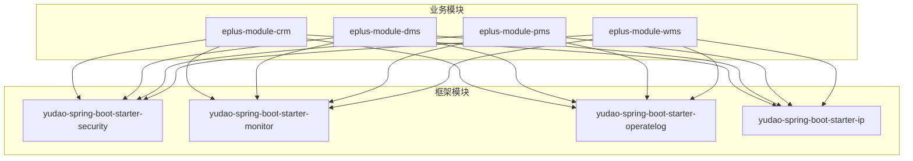
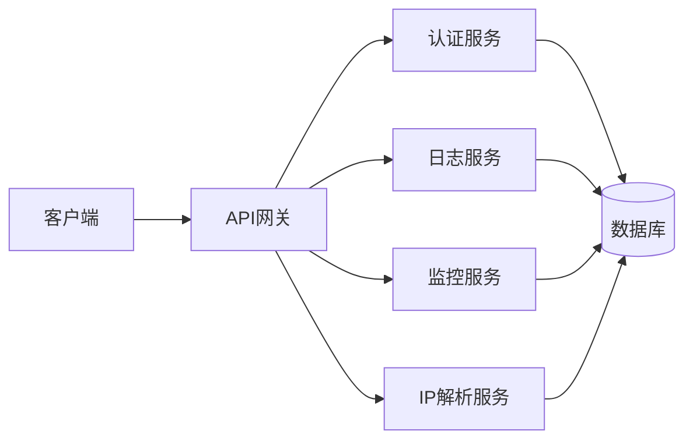
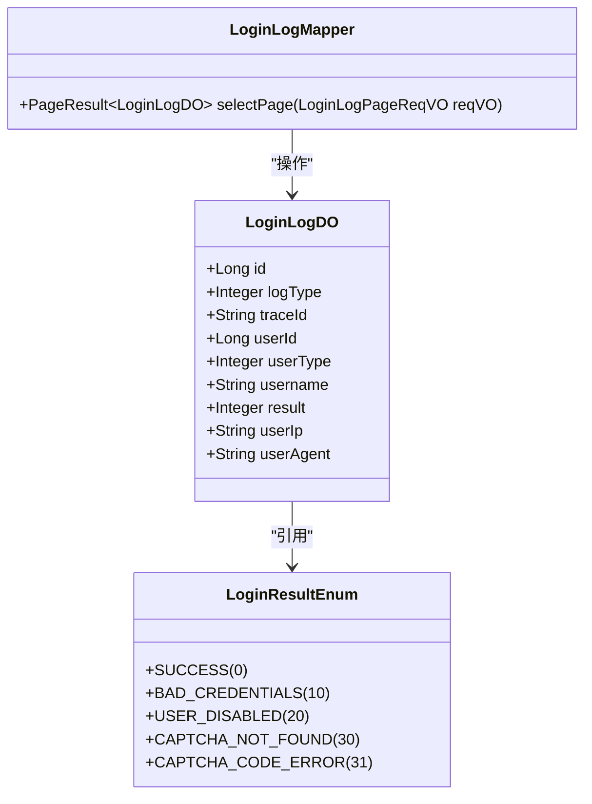
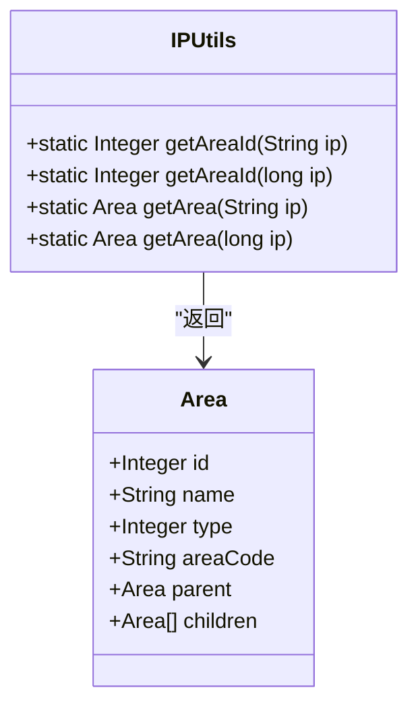
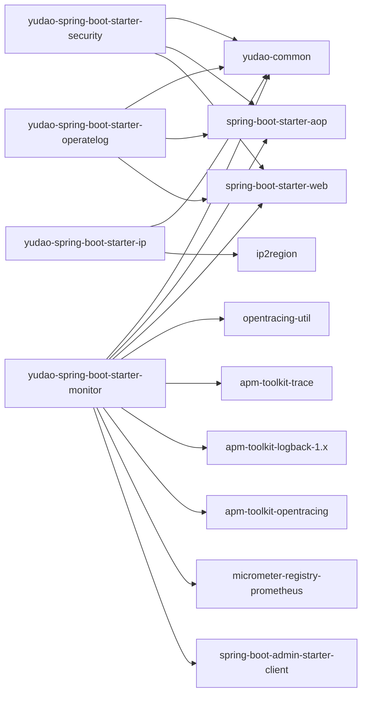

# 监控告警

<cite>
**本文档引用的文件**  
- [LoginLogDO.java](file://yudao-module-system/yudao-module-system-biz/src/main/java/cn/iocoder/yudao/module/system/dal/dataobject/logger/LoginLogDO.java#L1-L72)
- [LoginLogMapper.java](file://yudao-module-system/yudao-module-system-biz/src/main/java/cn/iocoder/yudao/module/system/dal/mysql/logger/LoginLogMapper.java#L1-L28)
- [LoginResultEnum.java](file://yudao-module-system/yudao-module-system-api/src/main/java/cn/iocoder/yudao/module/system/enums/logger/LoginResultEnum.java#L1-L26)
- [system_login_log.sql](file://eplus-flyway/src/main/resources/db/migration/common/V1_0_0_001__框架初始化.sql#L213-L228)
- [IPUtils.java](file://yudao-framework/yudao-spring-boot-starter-ip/src/main/java/cn/iocoder/yudao/framework/ip/core/utils/IPUtils.java#L1-L88)
- [Area.java](file://yudao-framework/yudao-spring-boot-starter-ip/src/main/java/cn/iocoder/yudao/framework/ip/core/Area.java#L1-L60)
- [yudao-spring-boot-starter-monitor/pom.xml](file://yudao-framework/yudao-spring-boot-starter-monitor/pom.xml#L1-L74)
- [yudao-spring-boot-starter-operatelog/pom.xml](file://yudao-framework/yudao-spring-boot-starter-operatelog/pom.xml#L1-L54)
- [yudao-spring-boot-starter-ip/pom.xml](file://yudao-framework/yudao-spring-boot-starter-ip/pom.xml#L1-L55)
- [GlobalExceptionHandler.java](file://yudao-framework/yudao-spring-boot-starter-web/src/main/java/cn/iocoder/yudao/framework/web/core/handler/GlobalExceptionHandler.java#L285-L307)
</cite>

## 目录
1. [引言](#引言)
2. [项目结构](#项目结构)
3. [核心组件](#核心组件)
4. [架构概述](#架构概述)
5. [详细组件分析](#详细组件分析)
6. [依赖分析](#依赖分析)
7. [性能考虑](#性能考虑)
8. [故障排除指南](#故障排除指南)
9. [结论](#结论)

## 引言
本文档旨在提供关于安全事件监控和告警机制的详细说明，重点描述异常登录监控、操作异常监控、告警规则定义、告警阈值设置策略、告警通知渠道配置、告警级别划分、告警抑制机制、监控系统性能影响及优化建议。通过实际的告警配置示例和测试方法，帮助开发人员和运维团队有效实施监控告警策略。

## 项目结构
本项目采用模块化设计，主要分为多个业务模块和框架模块。每个模块负责特定的功能，如CRM、DMS、PMS等。框架模块提供了通用的服务，如安全、监控、日志等。这种设计有助于提高代码的可维护性和可扩展性。

**图表来源**
- [yudao-spring-boot-starter-security](file://yudao-framework/yudao-spring-boot-starter-security)
- [yudao-spring-boot-starter-monitor](file://yudao-framework/yudao-spring-boot-starter-monitor)
- [yudao-spring-boot-starter-operatelog](file://yudao-framework/yudao-spring-boot-starter-operatelog)
- [yudao-spring-boot-starter-ip](file://yudao-framework/yudao-spring-boot-starter-ip)

**章节来源**
- [yudao-spring-boot-starter-security](file://yudao-framework/yudao-spring-boot-starter-security)
- [yudao-spring-boot-starter-monitor](file://yudao-framework/yudao-spring-boot-starter-monitor)
- [yudao-spring-boot-starter-operatelog](file://yudao-framework/yudao-spring-boot-starter-operatelog)
- [yudao-spring-boot-starter-ip](file://yudao-framework/yudao-spring-boot-starter-ip)

## 核心组件
### 登录日志组件
登录日志组件负责记录用户的登录行为，包括成功和失败的登录尝试。这些日志对于检测异常登录行为至关重要。

**章节来源**
- [LoginLogDO.java](file://yudao-module-system/yudao-module-system-biz/src/main/java/cn/iocoder/yudao/module/system/dal/dataobject/logger/LoginLogDO.java#L1-L72)
- [LoginLogMapper.java](file://yudao-module-system/yudao-module-system-biz/src/main/java/cn/iocoder/yudao/module/system/dal/mysql/logger/LoginLogMapper.java#L1-L28)
- [LoginResultEnum.java](file://yudao-module-system/yudao-module-system-api/src/main/java/cn/iocoder/yudao/module/system/enums/logger/LoginResultEnum.java#L1-L26)

### IP地址解析组件
IP地址解析组件用于查询IP地址对应的城市信息，这对于检测异地登录等异常行为非常有用。

**章节来源**
- [IPUtils.java](file://yudao-framework/yudao-spring-boot-starter-ip/src/main/java/cn/iocoder/yudao/framework/ip/core/utils/IPUtils.java#L1-L88)
- [Area.java](file://yudao-framework/yudao-spring-boot-starter-ip/src/main/java/cn/iocoder/yudao/framework/ip/core/Area.java#L1-L60)

## 架构概述
系统架构采用了微服务设计模式，各个模块通过API进行通信。安全模块负责身份验证和授权，监控模块负责收集和分析日志数据，操作日志模块记录用户的操作行为，IP地址解析模块提供地理位置信息。

**图表来源**
- [yudao-spring-boot-starter-security](file://yudao-framework/yudao-spring-boot-starter-security)
- [yudao-spring-boot-starter-monitor](file://yudao-framework/yudao-spring-boot-starter-monitor)
- [yudao-spring-boot-starter-operatelog](file://yudao-framework/yudao-spring-boot-starter-operatelog)
- [yudao-spring-boot-starter-ip](file://yudao-framework/yudao-spring-boot-starter-ip)

## 详细组件分析
### 登录日志分析
登录日志组件通过`LoginLogDO`类定义了日志数据结构，包括用户ID、用户名、登录结果、用户IP等字段。`LoginLogMapper`接口提供了对日志数据的增删改查操作。`LoginResultEnum`枚举类定义了登录结果的可能值，如成功、密码错误、用户被禁用等。

#### 类图

**图表来源**
- [LoginLogDO.java](file://yudao-module-system/yudao-module-system-biz/src/main/java/cn/iocoder/yudao/module/system/dal/dataobject/logger/LoginLogDO.java#L1-L72)
- [LoginLogMapper.java](file://yudao-module-system/yudao-module-system-biz/src/main/java/cn/iocoder/yudao/module/system/dal/mysql/logger/LoginLogMapper.java#L1-L28)
- [LoginResultEnum.java](file://yudao-module-system/yudao-module-system-api/src/main/java/cn/iocoder/yudao/module/system/enums/logger/LoginResultEnum.java#L1-L26)

### IP地址解析分析
IP地址解析组件通过`IPUtils`类提供了查询IP地址对应地区编号和地区的功能。`Area`类定义了区域节点的数据结构，包括编号、名称、类型、区号、父节点和子节点。

#### 类图

**图表来源**
- [IPUtils.java](file://yudao-framework/yudao-spring-boot-starter-ip/src/main/java/cn/iocoder/yudao/framework/ip/core/utils/IPUtils.java#L1-L88)
- [Area.java](file://yudao-framework/yudao-spring-boot-starter-ip/src/main/java/cn/iocoder/yudao/framework/ip/core/Area.java#L1-L60)

## 依赖分析
### 框架依赖
项目依赖于多个框架模块，这些模块提供了通用的服务，如安全、监控、日志等。这些依赖关系确保了系统的稳定性和可维护性。

**图表来源**
- [yudao-spring-boot-starter-security/pom.xml](file://yudao-framework/yudao-spring-boot-starter-security/pom.xml)
- [yudao-spring-boot-starter-monitor/pom.xml](file://yudao-framework/yudao-spring-boot-starter-monitor/pom.xml)
- [yudao-spring-boot-starter-operatelog/pom.xml](file://yudao-framework/yudao-spring-boot-starter-operatelog/pom.xml)
- [yudao-spring-boot-starter-ip/pom.xml](file://yudao-framework/yudao-spring-boot-starter-ip/pom.xml)

**章节来源**
- [yudao-spring-boot-starter-security/pom.xml](file://yudao-framework/yudao-spring-boot-starter-security/pom.xml)
- [yudao-spring-boot-starter-monitor/pom.xml](file://yudao-framework/yudao-spring-boot-starter-monitor/pom.xml)
- [yudao-spring-boot-starter-operatelog/pom.xml](file://yudao-framework/yudao-spring-boot-starter-operatelog/pom.xml)
- [yudao-spring-boot-starter-ip/pom.xml](file://yudao-framework/yudao-spring-boot-starter-ip/pom.xml)

## 性能考虑
### 日志记录性能
日志记录是系统性能的一个重要方面。频繁的日志记录可能会导致性能下降。为了优化性能，可以采取以下措施：
- 使用异步日志记录，减少对主线程的影响。
- 对日志级别进行合理设置，避免记录过多不必要的日志。
- 定期清理过期的日志数据，减少存储压力。

### 监控系统性能
监控系统本身也会消耗资源。为了确保监控系统的性能，可以采取以下措施：
- 选择高效的监控工具，如Prometheus和Grafana。
- 合理配置监控指标，避免过度监控。
- 定期审查监控数据，及时发现和解决问题。

## 故障排除指南
### 常见问题
- **日志记录失败**：检查日志配置文件，确保日志路径正确且有写权限。
- **IP地址解析失败**：检查IP地址数据库文件是否完整，确保`ip2region.xdb`文件存在且未损坏。
- **监控数据缺失**：检查监控服务是否正常运行，确保监控代理已正确安装和配置。

### 调试工具
- **日志查看工具**：使用ELK（Elasticsearch, Logstash, Kibana）或Graylog等工具查看和分析日志数据。
- **性能分析工具**：使用JProfiler、VisualVM等工具分析系统性能瓶颈。
- **网络调试工具**：使用Wireshark、tcpdump等工具捕获和分析网络流量。

**章节来源**
- [GlobalExceptionHandler.java](file://yudao-framework/yudao-spring-boot-starter-web/src/main/java/cn/iocoder/yudao/framework/web/core/handler/GlobalExceptionHandler.java#L285-L307)

## 结论
本文档详细介绍了安全事件监控和告警机制的设计和实现。通过合理的日志记录、IP地址解析、监控系统配置和性能优化，可以有效提升系统的安全性和稳定性。希望本文档能为开发人员和运维团队提供有价值的参考。