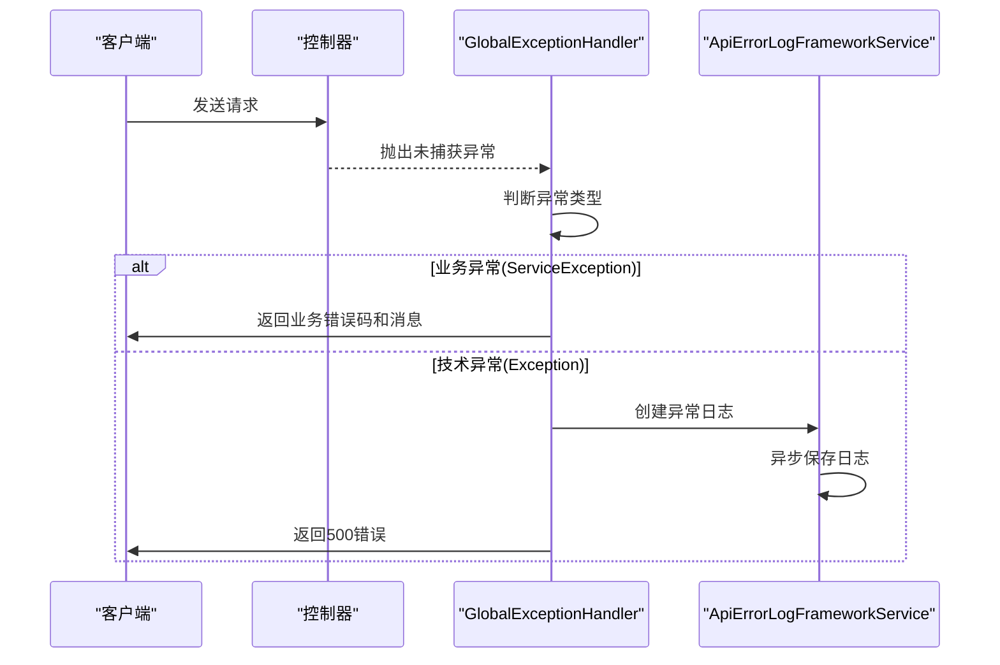
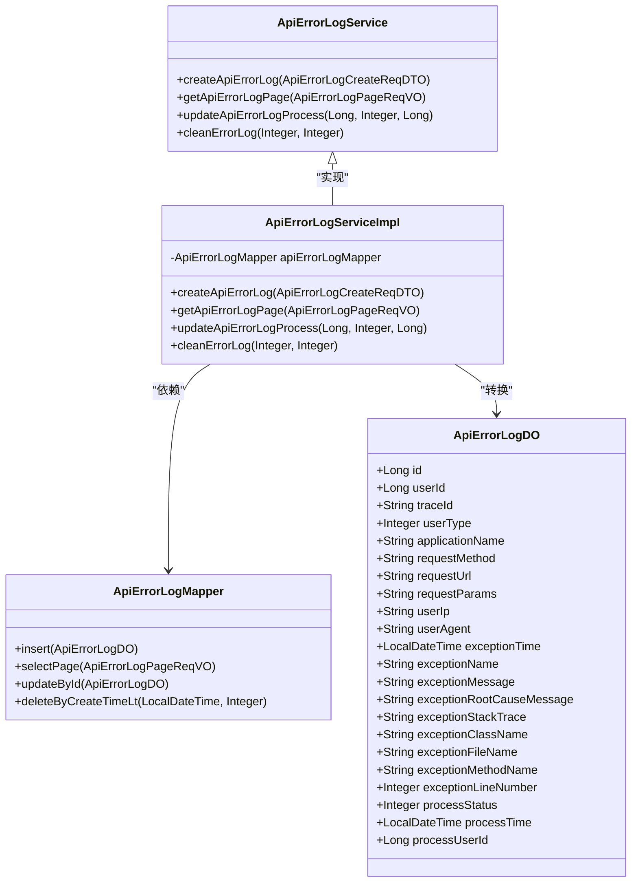
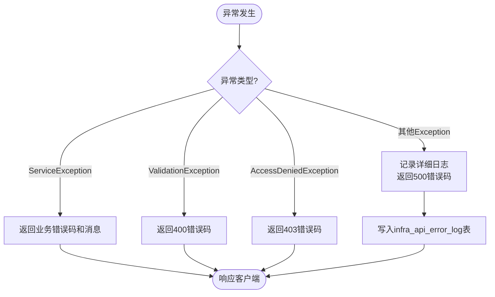
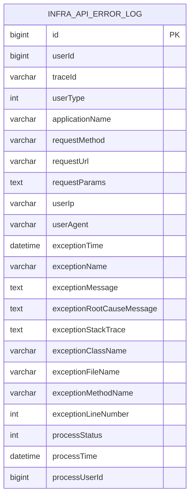

# 异常审计

<cite>
**本文档引用的文件**  
- [GlobalExceptionHandler.java](file://yudao-framework/yudao-spring-boot-starter-web/src/main/java/cn/iocoder/yudao/framework/web/core/handler/GlobalExceptionHandler.java)
- [ApiErrorLogDO.java](file://yudao-module-infra/yudao-module-infra-biz/src/main/java/cn/iocoder/yudao/module/infra/dal/dataobject/logger/ApiErrorLogDO.java)
- [ApiErrorLogServiceImpl.java](file://yudao-module-infra/yudao-module-infra-biz/src/main/java/cn/iocoder/yudao/module/infra/service/logger/ApiErrorLogServiceImpl.java)
- [ApiErrorLogMapper.java](file://yudao-module-infra/yudao-module-infra-biz/src/main/java/cn/iocoder/yudao/module/infra/dal/mysql/logger/ApiErrorLogMapper.java)
- [ErrorLogCleanJob.java](file://yudao-module-infra/yudao-module-infra-biz/src/main/java/cn/iocoder/yudao/module/infra/job/logger/ErrorLogCleanJob.java)
- [ServiceException.java](file://yudao-framework/yudao-common/src/main/java/cn/iocoder/yudao/framework/common/exception/ServiceException.java)
- [ServerException.java](file://yudao-framework/yudao-common/src/main/java/cn/iocoder/yudao/framework/common/exception/ServerException.java)
- [GlobalErrorCodeConstants.java](file://yudao-framework/yudao-common/src/main/java/cn/iocoder/yudao/framework/common/exception/enums/GlobalErrorCodeConstants.java)
- [YudaoWebAutoConfiguration.java](file://yudao-framework/yudao-spring-boot-starter-web/src/main/java/cn/iocoder/yudao/framework/web/config/YudaoWebAutoConfiguration.java)
- [logback-spring.xml](file://yudao-server/src/main/resources/logback-spring.xml)
</cite>

## 目录
1. [引言](#引言)
2. [全局异常处理机制](#全局异常处理机制)
3. [错误日志服务实现](#错误日志服务实现)
4. [异常分类与处理策略](#异常分类与处理策略)
5. [异常日志存储与清理策略](#异常日志存储与清理策略)
6. [性能影响评估](#性能影响评估)
7. [异常告警与通知机制](#异常告警与通知机制)
8. [常见异常模式分析](#常见异常模式分析)
9. [自定义异常审计扩展](#自定义异常审计扩展)
10. [结论](#结论)

## 引言

本异常审计文档旨在全面阐述系统中异常的捕获、记录、分析和处理机制。系统采用统一的异常处理框架，通过`GlobalExceptionHandler`实现对未捕获异常的集中处理，确保所有异常都能被正确记录和响应。异常日志通过`ErrorLogService`进行持久化存储，采用结构化的数据模型便于后续分析。文档详细说明了业务异常与技术异常的区别处理方法，以及异常日志的存储策略和性能优化措施。同时，文档还提供了异常告警阈值设置、通知机制配置以及常见异常模式的分析方法，为开发者提供了完整的异常审计解决方案和自定义扩展点。

## 全局异常处理机制

系统通过`GlobalExceptionHandler`类实现全局异常处理，该类使用Spring的`@RestControllerAdvice`注解，能够捕获所有控制器层未处理的异常。`GlobalExceptionHandler`在`YudaoWebAutoConfiguration`中被注册为Spring Bean，接收`ApiErrorLogFrameworkService`和`errorLogEnable`配置参数。

该处理器实现了`allExceptionHandler`方法，能够处理多种类型的异常，包括参数缺失、类型不匹配、验证失败、权限不足等。对于不同类型的异常，处理器会返回相应的错误码和提示信息。例如，当发生`MissingServletRequestParameterException`时，会返回400错误码并提示"请求参数缺失"。

对于未明确处理的异常，`defaultExceptionHandler`方法会将其记录为系统内部错误（500错误码），并根据配置决定是否将异常信息写入错误日志表。特别地，系统对客户端主动断开连接的`ClientAbortException`进行了特殊处理，仅记录为调试日志，避免产生大量无意义的错误记录。

**图示来源**
- [GlobalExceptionHandler.java](file://yudao-framework/yudao-spring-boot-starter-web/src/main/java/cn/iocoder/yudao/framework/web/core/handler/GlobalExceptionHandler.java#L74-L270)
- [YudaoWebAutoConfiguration.java](file://yudao-framework/yudao-spring-boot-starter-web/src/main/java/cn/iocoder/yudao/framework/web/config/YudaoWebAutoConfiguration.java#L60-L64)

**本节来源**
- [GlobalExceptionHandler.java](file://yudao-framework/yudao-spring-boot-starter-web/src/main/java/cn/iocoder/yudao/framework/web/core/handler/GlobalExceptionHandler.java#L47-L363)
- [YudaoWebAutoConfiguration.java](file://yudao-framework/yudao-spring-boot-starter-web/src/main/java/cn/iocoder/yudao/framework/web/config/YudaoWebAutoConfiguration.java#L60-L64)

## 错误日志服务实现

`ErrorLogService`的实现由`ApiErrorLogService`接口及其`ApiErrorLogServiceImpl`实现类构成。该服务负责异常日志的创建、查询和清理操作。服务通过`ApiErrorLogMapper`与数据库进行交互，使用MyBatis-Plus框架实现数据持久化。

`ApiErrorLogDO`数据对象定义了异常日志的完整结构，包含用户信息、请求详情、异常信息和处理状态等字段。当`GlobalExceptionHandler`捕获到异常时，会调用`createApiErrorLog`方法创建日志记录。该方法首先将`ApiErrorLog`对象转换为`ApiErrorLogDO`，设置处理状态为"未处理"，然后通过`insert`方法持久化到数据库。

服务还提供了分页查询功能，允许管理员根据用户ID、应用名、请求URL等条件筛选异常日志。`updateApiErrorLogProcess`方法用于标记异常日志的处理状态，确保同一日志不会被重复处理。在更新前，服务会检查日志的当前状态，如果已处理则抛出异常。

**图示来源**
- [ApiErrorLogService.java](file://yudao-module-infra/yudao-module-infra-biz/src/main/java/cn/iocoder/yudao/module/infra/service/logger/ApiErrorLogService.java#L13-L47)
- [ApiErrorLogServiceImpl.java](file://yudao-module-infra/yudao-module-infra-biz/src/main/java/cn/iocoder/yudao/module/infra/service/logger/ApiErrorLogServiceImpl.java#L29-L78)
- [ApiErrorLogMapper.java](file://yudao-module-infra/yudao-module-infra-biz/src/main/java/cn/iocoder/yudao/module/infra/dal/mysql/logger/ApiErrorLogMapper.java#L20-L32)
- [ApiErrorLogDO.java](file://yudao-module-infra/yudao-module-infra-biz/src/main/java/cn/iocoder/yudao/module/infra/dal/dataobject/logger/ApiErrorLogDO.java#L18-L157)

**本节来源**
- [ApiErrorLogServiceImpl.java](file://yudao-module-infra/yudao-module-infra-biz/src/main/java/cn/iocoder/yudao/module/infra/service/logger/ApiErrorLogServiceImpl.java#L29-L78)
- [ApiErrorLogDO.java](file://yudao-module-infra/yudao-module-infra-biz/src/main/java/cn/iocoder/yudao/module/infra/dal/dataobject/logger/ApiErrorLogDO.java#L18-L157)

## 异常分类与处理策略

系统采用分层的异常分类体系，主要分为业务异常和技术异常两大类。业务异常通过`ServiceException`类表示，通常由业务逻辑验证失败引起，如参数校验不通过、业务规则冲突等。技术异常则包括系统级异常、数据库异常、网络异常等，通常由`Exception`或其子类表示。

`ServiceException`继承自`RuntimeException`，包含`code`和`message`两个核心属性。错误码采用分层编码体系，前三位表示模块，中间三位表示子模块，后三位表示具体错误。例如，1001107000表示"学生不存在"。这种编码方式便于快速定位错误来源。

系统还定义了`ServerException`用于表示服务器级别的严重错误。全局异常处理器会根据异常类型采取不同的处理策略：对于业务异常，直接返回对应的错误码和消息；对于技术异常，则记录详细的堆栈信息并返回通用的500错误，避免暴露系统内部细节。

**图示来源**
- [ServiceException.java](file://yudao-framework/yudao-common/src/main/java/cn/iocoder/yudao/framework/common/exception/ServiceException.java#L12-L61)
- [ServerException.java](file://yudao-framework/yudao-common/src/main/java/cn/iocoder/yudao/framework/common/exception/ServerException.java#L12-L61)
- [GlobalErrorCodeConstants.java](file://yudao-framework/yudao-common/src/main/java/cn/iocoder/yudao/framework/common/exception/enums/GlobalErrorCodeConstants.java#L15-L42)

**本节来源**
- [ServiceException.java](file://yudao-framework/yudao-common/src/main/java/cn/iocoder/yudao/framework/common/exception/ServiceException.java#L12-L61)
- [ServerException.java](file://yudao-framework/yudao-common/src/main/java/cn/iocoder/yudao/framework/common/exception/ServerException.java#L12-L61)
- [GlobalErrorCodeConstants.java](file://yudao-framework/yudao-common/src/main/java/cn/iocoder/yudao/framework/common/exception/enums/GlobalErrorCodeConstants.java#L15-L42)

## 异常日志存储与清理策略

异常日志存储在`infra_api_error_log`数据库表中，该表通过Flyway数据库迁移脚本进行初始化。表结构设计包含了完整的异常上下文信息，包括用户身份、请求详情、异常堆栈和处理状态等。日志记录采用异步方式写入，通过`@Async`注解确保异常处理不会阻塞主请求流程。

系统配置了日志清理策略，通过`ErrorLogCleanJob`定时任务定期清理过期的日志记录。该任务每天执行，清理14天前的错误日志，每次删除最多100条记录，避免对数据库造成过大压力。清理操作采用分批删除的方式，通过`deleteByCreateTimeLt`方法实现。

日志文件本身通过Logback配置进行管理，采用滚动文件策略，当日志文件达到10MB时自动滚动，最多保留30天的历史日志文件。生产环境的日志写入采用异步Appender，通过队列缓冲提高性能，避免I/O操作阻塞业务线程。

**图示来源**
- [ApiErrorLogDO.java](file://yudao-module-infra/yudao-module-infra-biz/src/main/java/cn/iocoder/yudao/module/infra/dal/dataobject/logger/ApiErrorLogDO.java#L18-L157)
- [V1_0_0_001__框架初始化.sql](file://eplus-flyway/src/main/resources/db/migration/common/V1_0_0_001__框架初始化.sql#L1499-L1951)
- [ErrorLogCleanJob.java](file://yudao-module-infra/yudao-module-infra-biz/src/main/java/cn/iocoder/yudao/module/infra/job/logger/ErrorLogCleanJob.java#L17-L39)

**本节来源**
- [ApiErrorLogDO.java](file://yudao-module-infra/yudao-module-infra-biz/src/main/java/cn/iocoder/yudao/module/infra/dal/dataobject/logger/ApiErrorLogDO.java#L18-L157)
- [ErrorLogCleanJob.java](file://yudao-module-infra/yudao-module-infra-biz/src/main/java/cn/iocoder/yudao/module/infra/job/logger/ErrorLogCleanJob.java#L17-L39)
- [logback-spring.xml](file://yudao-server/src/main/resources/logback-spring.xml#L18-L40)

## 性能影响评估

异常处理机制对系统性能的影响主要体现在三个方面：异常捕获开销、日志记录开销和存储开销。正常情况下，由于异常是罕见事件，异常处理框架本身对性能影响极小。只有在发生异常时，才会产生额外的处理开销。

日志记录采用异步方式，通过`@Async`注解将日志写入操作提交到独立的线程池执行，避免阻塞主请求线程。这种设计确保了即使在高并发场景下，异常处理也不会显著影响正常请求的响应时间。日志内容的序列化和数据库写入都在后台线程完成，主流程只需完成异常信息的收集和封装。

存储方面，系统通过定期清理策略控制日志表的大小，避免数据无限增长导致的性能下降。分页查询功能支持按时间范围筛选，确保查询操作的效率。对于高频异常，系统会自动聚合相似异常，避免产生大量重复日志记录。

在极端情况下，如短时间内产生大量异常，异步队列可能会积压，但系统通过配置合理的队列大小和拒绝策略来应对这种情况。总体而言，异常审计机制在保证功能完整性的同时，对系统性能的影响控制在可接受范围内。

**本节来源**
- [GlobalExceptionHandler.java](file://yudao-framework/yudao-spring-boot-starter-web/src/main/java/cn/iocoder/yudao/framework/web/core/handler/GlobalExceptionHandler.java#L272-L282)
- [ApiErrorLogFrameworkServiceImpl.java](file://yudao-framework/yudao-spring-boot-starter-web/src/main/java/cn/iocoder/yudao/framework/apilog/core/service/ApiErrorLogFrameworkServiceImpl.java#L22-L28)
- [logback-spring.xml](file://yudao-server/src/main/resources/logback-spring.xml#L42-L48)

## 异常告警与通知机制

系统目前主要通过日志监控和定时任务实现异常告警。`ErrorLogCleanJob`任务在执行时会记录清理的日志数量，这一信息可以作为异常频率的指标。通过监控这一日志，运维人员可以了解系统的异常发生情况。

对于关键业务异常，建议通过集成外部监控系统实现更精细的告警策略。可以基于`infra_api_error_log`表创建监控视图，设置异常数量阈值，当特定类型的异常在短时间内超过阈值时触发告警。告警通知可以通过邮件、短信或即时通讯工具发送给相关人员。

系统提供了完整的异常日志API，支持按应用名、异常类型、时间范围等条件查询，便于构建自定义的监控仪表盘。通过分析异常的堆栈信息和请求参数，可以快速定位问题根源。建议为不同严重级别的异常设置不同的告警级别，确保重要问题能够及时得到处理。

**本节来源**
- [ErrorLogCleanJob.java](file://yudao-module-infra/yudao-module-infra-biz/src/main/java/cn/iocoder/yudao/module/infra/job/logger/ErrorLogCleanJob.java#L17-L39)
- [ApiErrorLogService.java](file://yudao-module-infra/yudao-module-infra-biz/src/main/java/cn/iocoder/yudao/module/infra/service/logger/ApiErrorLogService.java#L28-L29)

## 常见异常模式分析

通过对异常日志的分析，可以识别出几种常见的异常模式。第一种是参数验证异常，通常由客户端传递了不符合要求的参数引起，表现为`MethodArgumentNotValidException`或`ConstraintViolationException`。这类异常需要检查前端表单验证逻辑。

第二种是业务规则异常，表现为`ServiceException`，通常由业务逻辑冲突引起，如重复提交、状态不匹配等。这类异常需要检查业务流程设计是否合理。

第三种是系统级异常，表现为`Exception`或`RuntimeException`，可能由代码缺陷、资源不足或外部服务故障引起。这类异常需要结合堆栈信息和请求上下文进行深入分析。

第四种是数据库异常，可能由连接超时、死锁或SQL语法错误引起。这类异常通常伴随着特定的错误码和消息，需要检查数据库连接池配置和SQL语句。

通过分析异常的频率、时间分布和关联请求，可以识别出系统瓶颈和潜在问题。建议定期审查异常日志，建立异常模式库，提高问题诊断效率。

**本节来源**
- [GlobalExceptionHandler.java](file://yudao-framework/yudao-spring-boot-starter-web/src/main/java/cn/iocoder/yudao/framework/web/core/handler/GlobalExceptionHandler.java#L79-L174)
- [ApiErrorLogDO.java](file://yudao-module-infra/yudao-module-infra-biz/src/main/java/cn/iocoder/yudao/module/infra/dal/dataobject/logger/ApiErrorLogDO.java#L82-L135)

## 自定义异常审计扩展

系统提供了多个扩展点，允许开发者根据业务需求定制异常审计功能。首先，可以通过继承`ServiceException`创建自定义的业务异常类，添加特定的业务属性。其次，可以在`GlobalExceptionHandler`中添加新的异常处理方法，为特定异常类型提供定制化的处理逻辑。

对于特殊的日志需求，可以实现`ApiErrorLogFrameworkService`接口，替换默认的日志记录行为。例如，可以将异常日志同时写入多个存储系统，或添加额外的上下文信息。

还可以通过Spring的`@EventListener`机制监听异常事件，实现自定义的告警或通知逻辑。对于需要特殊处理的异常类型，可以创建独立的异常处理器，并通过`@Order`注解控制处理顺序。

建议在扩展时遵循系统的设计原则，保持异常处理的一致性和可维护性。所有自定义异常都应该有明确的错误码和描述，便于后续的分析和处理。

**本节来源**
- [GlobalExceptionHandler.java](file://yudao-framework/yudao-spring-boot-starter-web/src/main/java/cn/iocoder/yudao/framework/web/core/handler/GlobalExceptionHandler.java#L47-L363)
- [ApiErrorLogFrameworkService.java](file://yudao-framework/yudao-spring-boot-starter-web/src/main/java/cn/iocoder/yudao/framework/apilog/core/service/ApiErrorLogFrameworkService.java#L8-L16)

## 结论

本异常审计文档全面阐述了系统的异常处理机制，从全局异常捕获到日志存储分析，再到告警通知和扩展定制，形成了完整的异常管理闭环。通过`GlobalExceptionHandler`统一处理未捕获异常，确保了系统稳定性；通过结构化的错误日志设计，实现了异常信息的完整记录；通过异步处理和定期清理策略，在保证功能的同时控制了性能影响。

建议在实际使用中，结合监控系统建立完善的异常告警机制，定期分析异常日志，持续优化系统健壮性。对于业务关键路径，应设计更精细的异常处理策略，确保用户体验。通过合理利用系统提供的扩展点，可以满足不同场景下的异常审计需求，构建更加可靠的应用系统。