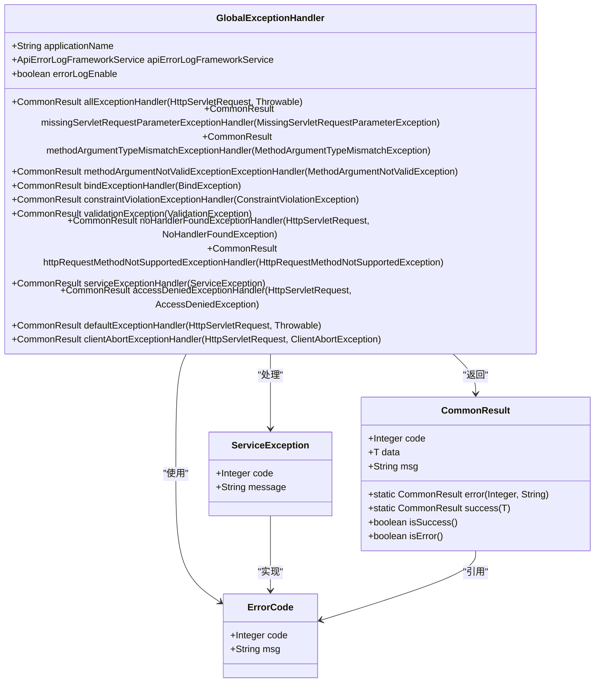
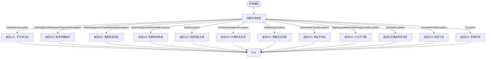
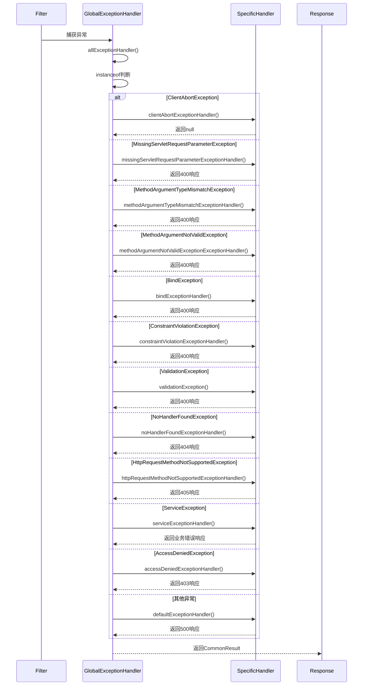
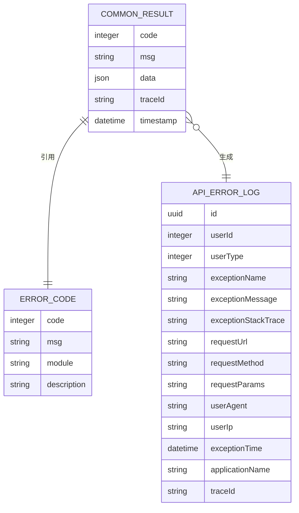

# 异常捕获机制

<cite>
**本文档引用的文件**
- [GlobalExceptionHandler.java](file://yudao-framework/yudao-spring-boot-starter-web/src/main/java/cn/iocoder/yudao/framework/web/core/handler/GlobalExceptionHandler.java)
- [ServiceException.java](file://yudao-framework/yudao-common/src/main/java/cn/iocoder/yudao/framework/common/exception/ServiceException.java)
- [ErrorCode.java](file://yudao-framework/yudao-common/src/main/java/cn/iocoder/yudao/framework/common/exception/ErrorCode.java)
- [CommonResult.java](file://yudao-framework/yudao-common/src/main/java/cn/iocoder/yudao/framework/common/pojo/CommonResult.java)
- [GlobalErrorCodeConstants.java](file://yudao-framework/yudao-common/src/main/java/cn/iocoder/yudao/framework/common/exception/enums/GlobalErrorCodeConstants.java)
</cite>

## 目录
1. [全局异常处理器概述](#全局异常处理器概述)
2. [核心实现机制](#核心实现机制)
3. [异常处理策略](#异常处理策略)
4. [异常拦截优先级与处理流程](#异常拦截优先级与处理流程)
5. [标准化API响应转换](#标准化api响应转换)
6. [自定义异常扩展方法](#自定义异常扩展方法)
7. [异常堆栈信息裁剪与敏感信息过滤](#异常堆栈信息裁剪与敏感信息过滤)

## 全局异常处理器概述

全局异常处理器`GlobalExceptionHandler`是系统中统一处理所有未捕获异常的核心组件。通过`@RestControllerAdvice`注解，该处理器能够捕获整个应用中所有控制器抛出的异常，并将其转换为标准化的API响应格式。这种设计实现了异常处理的集中化管理，确保了API返回结果的一致性和可预测性。

**Section sources**
- [GlobalExceptionHandler.java](file://yudao-framework/yudao-spring-boot-starter-web/src/main/java/cn/iocoder/yudao/framework/web/core/handler/GlobalExceptionHandler.java#L47-L49)

## 核心实现机制

`GlobalExceptionHandler`利用Spring框架的`@RestControllerAdvice`注解实现全局异常捕获。该注解结合`@ExceptionHandler`方法，为不同类型的异常提供了专门的处理逻辑。处理器通过一系列`if-instanceof`判断和注解驱动的方法调用，实现了对各类异常的精准识别和差异化处理。

处理器的构造函数注入了应用名称、错误日志服务和错误日志开关等依赖，使其具备了记录错误日志和生成上下文相关响应的能力。这种设计遵循了依赖注入原则，提高了代码的可测试性和可维护性。



**Diagram sources**
- [GlobalExceptionHandler.java](file://yudao-framework/yudao-spring-boot-starter-web/src/main/java/cn/iocoder/yudao/framework/web/core/handler/GlobalExceptionHandler.java#L47-L362)
- [ServiceException.java](file://yudao-framework/yudao-common/src/main/java/cn/iocoder/yudao/framework/common/exception/ServiceException.java#L12-L60)
- [ErrorCode.java](file://yudao-framework/yudao-common/src/main/java/cn/iocoder/yudao/framework/common/exception/ErrorCode.java#L16-L32)
- [CommonResult.java](file://yudao-framework/yudao-common/src/main/java/cn/iocoder/yudao/framework/common/pojo/CommonResult.java#L19-L112)

**Section sources**
- [GlobalExceptionHandler.java](file://yudao-framework/yudao-spring-boot-starter-web/src/main/java/cn/iocoder/yudao/framework/web/core/handler/GlobalExceptionHandler.java#L47-L362)

## 异常处理策略

系统实现了针对不同异常类型的差异化处理策略：

### ValidationException处理
对于`ValidationException`，系统采用简洁的处理方式，返回400错误码。由于Dubbo Consumer抛出的此类异常信息通常不可读，系统不尝试解析具体错误细节，而是直接返回通用的"请求参数不正确"提示。

### ServiceException处理
`ServiceException`作为业务逻辑异常的载体，其处理策略保留了异常的完整信息。处理器直接使用异常对象中的错误码和消息，通过`CommonResult.error(ex.getCode(), ex.getMessage())`方法生成响应，确保业务层面的错误信息能够准确传达给客户端。

### 其他异常类型
系统还处理多种框架级异常，包括：
- `MissingServletRequestParameterException`：请求参数缺失
- `MethodArgumentTypeMismatchException`：参数类型不匹配
- `MethodArgumentNotValidException`：参数校验失败
- `NoHandlerFoundException`：请求地址不存在
- `HttpRequestMethodNotSupportedException`：请求方法不正确
- `AccessDeniedException`：权限不足

每种异常都有对应的处理方法，能够提取关键信息并生成语义明确的错误响应。



**Diagram sources**
- [GlobalExceptionHandler.java](file://yudao-framework/yudao-spring-boot-starter-web/src/main/java/cn/iocoder/yudao/framework/web/core/handler/GlobalExceptionHandler.java#L74-L269)

**Section sources**
- [GlobalExceptionHandler.java](file://yudao-framework/yudao-spring-boot-starter-web/src/main/java/cn/iocoder/yudao/framework/web/core/handler/GlobalExceptionHandler.java#L117-L269)

## 异常拦截优先级与处理流程

异常拦截遵循明确的优先级顺序，通过`allExceptionHandler`方法中的`if-instanceof`链式判断实现。处理流程从特定到一般，确保更具体的异常类型优先得到处理。

处理流程始于对`ClientAbortException`的特殊处理，这类异常表示客户端主动断开连接，无需记录错误日志。随后是各类Spring MVC框架异常的处理，包括参数缺失、类型不匹配、校验失败等。业务异常`ServiceException`和安全异常`AccessDeniedException`有专门的处理路径。最后，所有未被前述处理的异常都由`defaultExceptionHandler`兜底处理。

这种分层处理机制确保了异常处理的精确性和效率，避免了异常处理的遗漏或误判。



**Diagram sources**
- [GlobalExceptionHandler.java](file://yudao-framework/yudao-spring-boot-starter-web/src/main/java/cn/iocoder/yudao/framework/web/core/handler/GlobalExceptionHandler.java#L74-L269)

**Section sources**
- [GlobalExceptionHandler.java](file://yudao-framework/yudao-spring-boot-starter-web/src/main/java/cn/iocoder/yudao/framework/web/core/handler/GlobalExceptionHandler.java#L74-L269)

## 标准化API响应转换

异常处理器将所有异常转换为`CommonResult`格式的标准化API响应。`CommonResult`类包含三个核心字段：`code`（错误码）、`data`（数据）和`msg`（消息）。这种统一的响应结构使客户端能够以一致的方式处理成功和失败响应。

对于成功响应，系统使用`CommonResult.success(T data)`方法，返回0作为成功码。对于失败响应，使用`CommonResult.error(Integer code, String message)`方法，将异常信息封装为标准化的错误响应。错误码遵循特定的范围划分：0-999为系统异常码，1,000,000,000以上为业务异常码。



**Diagram sources**
- [CommonResult.java](file://yudao-framework/yudao-common/src/main/java/cn/iocoder/yudao/framework/common/pojo/CommonResult.java#L19-L112)
- [ErrorCode.java](file://yudao-framework/yudao-common/src/main/java/cn/iocoder/yudao/framework/common/exception/ErrorCode.java#L16-L32)
- [GlobalExceptionHandler.java](file://yudao-framework/yudao-spring-boot-starter-web/src/main/java/cn/iocoder/yudao/framework/web/core/handler/GlobalExceptionHandler.java#L272-L283)

**Section sources**
- [CommonResult.java](file://yudao-framework/yudao-common/src/main/java/cn/iocoder/yudao/framework/common/pojo/CommonResult.java#L51-L68)
- [GlobalExceptionHandler.java](file://yudao-framework/yudao-spring-boot-starter-web/src/main/java/cn/iocoder/yudao/framework/web/core/handler/GlobalExceptionHandler.java#L120-L269)

## 自定义异常扩展方法

开发者可以通过以下方式扩展异常处理逻辑：

1. **添加新的异常处理方法**：在`GlobalExceptionHandler`类中添加新的`@ExceptionHandler`注解方法，指定要处理的异常类型。

2. **创建自定义业务异常**：继承`ServiceException`或直接使用`ErrorCode`创建具有特定错误码和消息的业务异常。

3. **模块化错误码定义**：在各业务模块中定义`ErrorCodeConstants`接口，集中管理本模块的错误码。

4. **实现新的异常处理器**：创建新的`@RestControllerAdvice`类，处理特定领域或模块的异常。

例如，要添加对`CustomBusinessException`的处理，只需在`GlobalExceptionHandler`中添加如下方法：
```java
@ExceptionHandler(value = CustomBusinessException.class)
public CommonResult<?> customBusinessExceptionHandler(CustomBusinessException ex) {
    log.warn("[customBusinessExceptionHandler]", ex);
    return CommonResult.error(ex.getCode(), ex.getMessage());
}
```

**Section sources**
- [GlobalExceptionHandler.java](file://yudao-framework/yudao-spring-boot-starter-web/src/main/java/cn/iocoder/yudao/framework/web/core/handler/GlobalExceptionHandler.java#L117-L269)
- [ServiceException.java](file://yudao-framework/yudao-common/src/main/java/cn/iocoder/yudao/framework/common/exception/ServiceException.java#L12-L60)

## 异常堆栈信息裁剪与敏感信息过滤

系统在处理异常时实施了堆栈信息裁剪和敏感信息过滤机制：

1. **日志级别控制**：不同类型的异常使用不同的日志级别。业务异常使用`info`级别，而系统异常使用`error`级别，避免日志污染。

2. **客户端断开连接处理**：`ClientAbortException`被特殊处理，仅记录`debug`级别日志，不视为错误。

3. **错误日志记录**：当`errorLogEnable`开关开启时，系统会创建详细的错误日志记录，包含异常名称、消息、堆栈跟踪、请求参数等信息。

4. **敏感信息保护**：在记录请求参数时，系统可能对敏感字段（如密码、令牌）进行脱敏处理，防止敏感信息泄露。

5. **异常信息简化**：对于某些框架异常（如`ValidationException`），系统不记录详细的堆栈信息，而是提供简洁的错误提示。

这些机制确保了错误日志的实用性和安全性，既提供了足够的调试信息，又保护了系统和用户的安全。

**Section sources**
- [GlobalExceptionHandler.java](file://yudao-framework/yudao-spring-boot-starter-web/src/main/java/cn/iocoder/yudao/framework/web/core/handler/GlobalExceptionHandler.java#L272-L315)
- [GlobalExceptionHandler.java](file://yudao-framework/yudao-spring-boot-starter-web/src/main/java/cn/iocoder/yudao/framework/web/core/handler/GlobalExceptionHandler.java#L239-L243)
- [GlobalExceptionHandler.java](file://yudao-framework/yudao-spring-boot-starter-web/src/main/java/cn/iocoder/yudao/framework/web/core/handler/GlobalExceptionHandler.java#L263-L267)