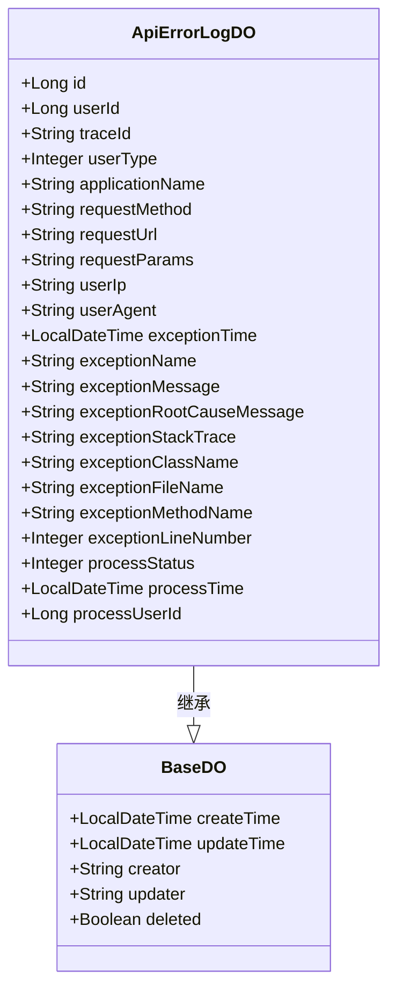
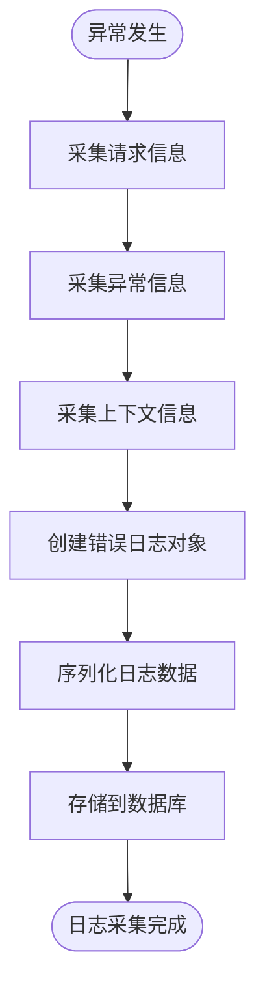
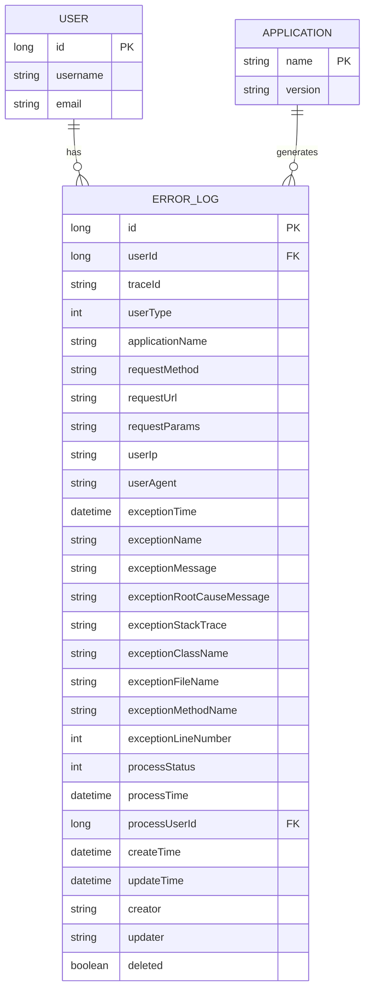
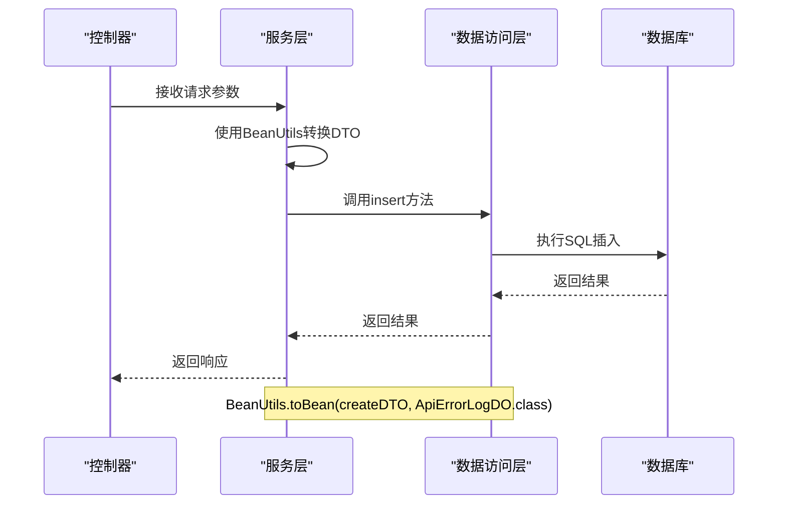
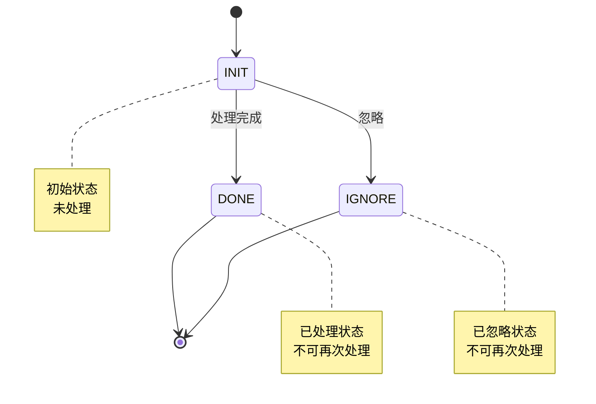
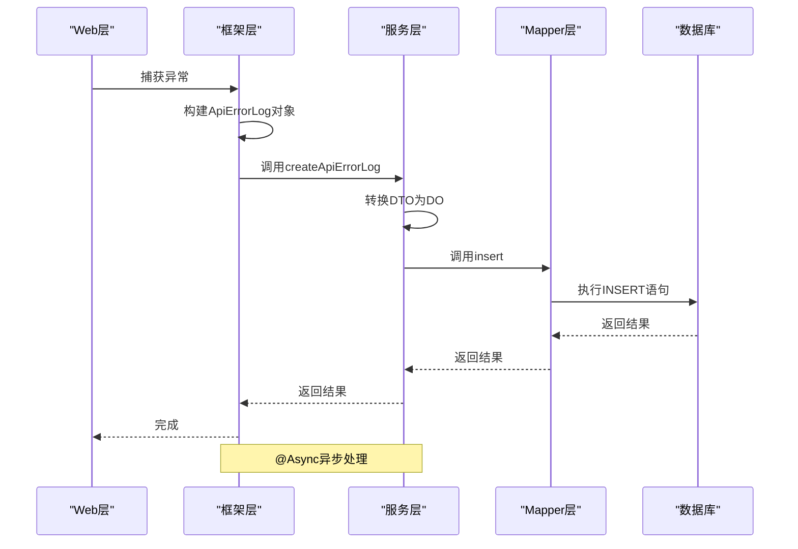

# 错误日志数据结构

<cite>
**本文档引用的文件**   
- [ApiErrorLogDO.java](file://yudao-module-infra/yudao-module-infra-biz/src/main/java/cn/iocoder/yudao/module/infra/dal/dataobject/logger/ApiErrorLogDO.java)
- [ApiErrorLogProcessStatusEnum.java](file://yudao-module-infra/yudao-module-infra-biz/src/main/java/cn/iocoder/yudao/module/infra/enums/logger/ApiErrorLogProcessStatusEnum.java)
- [UserTypeEnum.java](file://yudao-framework/yudao-common/src/main/java/cn/iocoder/yudao/framework/common/enums/UserTypeEnum.java)
- [BaseDO.java](file://yudao-framework/yudao-spring-boot-starter-mybatis/src/main/java/cn/iocoder/yudao/framework/mybatis/core/dataobject/BaseDO.java)
- [ruoyi-vue-pro.sql](file://sql/mysql/ruoyi-vue-pro.sql)
- [ApiErrorLogServiceImpl.java](file://yudao-module-infra/yudao-module-infra-biz/src/main/java/cn/iocoder/yudao/module/infra/service/logger/ApiErrorLogServiceImpl.java)
- [ApiErrorLogFrameworkServiceImpl.java](file://yudao-framework/yudao-spring-boot-starter-web/src/main/java/cn/iocoder/yudao/framework/apilog/core/service/ApiErrorLogFrameworkServiceImpl.java)
</cite>

## 目录
1. [引言](#引言)
2. [核心数据模型](#核心数据模型)
3. [字段定义与业务含义](#字段定义与业务含义)
4. [数据采集范围](#数据采集范围)
5. [数据类型与约束条件](#数据类型与约束条件)
6. [字段关联关系](#字段关联关系)
7. [序列化与反序列化机制](#序列化与反序列化机制)
8. [数据完整性保障措施](#数据完整性保障措施)
9. [错误日志处理流程](#错误日志处理流程)
10. [总结](#总结)

## 引言
本文档全面解析系统中错误日志的数据模型，重点分析`ApiErrorLogDO`实体类的结构与实现。文档详细说明了错误日志中各字段的业务含义、数据采集范围、类型约束以及处理机制，为开发人员和运维人员提供完整的错误日志体系理解。

## 核心数据模型
错误日志的核心数据模型由`ApiErrorLogDO`类定义，该类继承自`BaseDO`基类，实现了完整的数据持久化结构。数据模型分为四个主要部分：基础信息、请求相关、异常相关和处理相关字段。



**图表来源**
- [ApiErrorLogDO.java](file://yudao-module-infra/yudao-module-infra-biz/src/main/java/cn/iocoder/yudao/module/infra/dal/dataobject/logger/ApiErrorLogDO.java#L26-L156)
- [BaseDO.java](file://yudao-framework/yudao-spring-boot-starter-mybatis/src/main/java/cn/iocoder/yudao/framework/mybatis/core/dataobject/BaseDO.java#L18-L56)

**本节来源**
- [ApiErrorLogDO.java](file://yudao-module-infra/yudao-module-infra-biz/src/main/java/cn/iocoder/yudao/module/infra/dal/dataobject/logger/ApiErrorLogDO.java#L18-L156)

## 字段定义与业务含义
错误日志数据模型包含多个字段，每个字段都有明确的业务含义和用途。

### 基础信息字段
基础信息字段记录了错误日志的基本标识和上下文信息。

| 字段名 | 类型 | 业务含义 |
|--------|------|----------|
| id | Long | 错误日志的唯一编号，作为主键使用 |
| userId | Long | 操作用户的编号，标识触发异常的用户 |
| traceId | String | 链路追踪编号，用于关联分布式系统中的相关日志 |
| userType | Integer | 用户类型，区分不同类型的用户（如管理员、会员） |
| applicationName | String | 应用名称，标识产生错误的应用系统 |

### 请求相关字段
请求相关字段记录了触发异常的HTTP请求的详细信息。

| 字段名 | 类型 | 业务含义 |
|--------|------|----------|
| requestMethod | String | HTTP请求方法（如GET、POST） |
| requestUrl | String | 请求的完整URL地址 |
| requestParams | String | 请求参数，包括Query String和Request Body |
| userIp | String | 用户的IP地址，用于定位用户位置 |
| userAgent | String | 浏览器UA信息，用于识别客户端类型 |

### 异常相关字段
异常相关字段详细记录了异常的各个方面，为问题排查提供完整信息。

| 字段名 | 类型 | 业务含义 |
|--------|------|----------|
| exceptionTime | LocalDateTime | 异常发生的具体时间 |
| exceptionName | String | 异常类的全名，标识异常类型 |
| exceptionMessage | String | 异常的直接消息描述 |
| exceptionRootCauseMessage | String | 异常的根本原因消息 |
| exceptionStackTrace | String | 异常的完整堆栈跟踪信息 |
| exceptionClassName | String | 异常发生所在的类名 |
| exceptionFileName | String | 异常发生所在的文件名 |
| exceptionMethodName | String | 异常发生所在的方法名 |
| exceptionLineNumber | Integer | 异常发生所在的代码行号 |

### 处理相关字段
处理相关字段记录了错误日志的处理状态和相关信息。

| 字段名 | 类型 | 业务含义 |
|--------|------|----------|
| processStatus | Integer | 处理状态，标识日志是否已处理 |
| processTime | LocalDateTime | 处理完成的时间 |
| processUserId | Long | 处理该日志的用户编号 |

**本节来源**
- [ApiErrorLogDO.java](file://yudao-module-infra/yudao-module-infra-biz/src/main/java/cn/iocoder/yudao/module/infra/dal/dataobject/logger/ApiErrorLogDO.java#L28-L155)

## 数据采集范围
错误日志系统采集了全面的运行时信息，确保能够完整还原异常场景。

### 请求信息采集
系统采集了完整的HTTP请求信息，包括：
- 请求方法（GET、POST等）
- 完整的请求URL
- 请求参数（查询参数和请求体）
- 用户IP地址
- 浏览器User-Agent信息

### 异常信息采集
异常信息采集涵盖了异常的各个方面：
- 异常发生时间
- 异常类型和消息
- 完整的堆栈跟踪
- 异常发生的具体位置（类、文件、方法、行号）

### 上下文信息采集
系统还采集了重要的上下文信息：
- 链路追踪ID（traceId）
- 用户标识（userId、userType）
- 应用名称
- 租户信息



**图表来源**
- [ApiErrorLogFrameworkServiceImpl.java](file://yudao-framework/yudao-spring-boot-starter-web/src/main/java/cn/iocoder/yudao/framework/apilog/core/service/ApiErrorLogFrameworkServiceImpl.java#L23-L26)
- [ApiErrorLogServiceImpl.java](file://yudao-module-infra/yudao-module-infra-biz/src/main/java/cn/iocoder/yudao/module/infra/service/logger/ApiErrorLogServiceImpl.java#L35-L38)

**本节来源**
- [ApiErrorLogDO.java](file://yudao-module-infra/yudao-module-infra-biz/src/main/java/cn/iocoder/yudao/module/infra/dal/dataobject/logger/ApiErrorLogDO.java#L56-L136)

## 数据类型与约束条件
错误日志数据模型定义了严格的数据类型和约束条件，确保数据的完整性和一致性。

### 字段类型定义
各字段的数据类型经过精心设计，以满足业务需求和性能要求。

| 字段类别 | 字段名 | 数据类型 | 长度限制 | 是否可为空 |
|----------|--------|----------|----------|------------|
| 基础信息 | id | Long | - | 否 |
| | userId | Long | - | 否 |
| | traceId | String | 64 | 否 |
| | userType | Integer | - | 否 |
| | applicationName | String | 50 | 否 |
| 请求信息 | requestMethod | String | 16 | 否 |
| | requestUrl | String | 255 | 否 |
| | requestParams | String | 8000 | 否 |
| | userIp | String | 50 | 否 |
| | userAgent | String | 512 | 否 |
| 异常信息 | exceptionTime | LocalDateTime | - | 否 |
| | exceptionName | String | 128 | 否 |
| | exceptionMessage | Text | - | 否 |
| | exceptionRootCauseMessage | Text | - | 否 |
| | exceptionStackTrace | Text | - | 否 |
| | exceptionClassName | String | 512 | 否 |
| | exceptionFileName | String | 512 | 否 |
| | exceptionMethodName | String | 512 | 否 |
| | exceptionLineNumber | Integer | - | 否 |
| 处理信息 | processStatus | Integer | - | 否 |
| | processTime | LocalDateTime | - | 是 |
| | processUserId | Long | - | 是 |

### 数据库约束
数据库层面定义了必要的约束条件：

```sql
CREATE TABLE `infra_api_error_log` (
  `id` int NOT NULL AUTO_INCREMENT COMMENT '编号',
  `trace_id` varchar(64) NOT NULL COMMENT '链路追踪编号',
  `user_id` int NOT NULL DEFAULT 0 COMMENT '用户编号',
  `user_type` tinyint NOT NULL DEFAULT 0 COMMENT '用户类型',
  `application_name` varchar(50) NOT NULL COMMENT '应用名',
  `request_method` varchar(16) NOT NULL COMMENT '请求方法名',
  `request_url` varchar(255) NOT NULL COMMENT '请求地址',
  `request_params` varchar(8000) NOT NULL COMMENT '请求参数',
  `user_ip` varchar(50) NOT NULL COMMENT '用户 IP',
  `user_agent` varchar(512) NOT NULL COMMENT '浏览器 UA',
  `exception_time` datetime NOT NULL COMMENT '异常发生时间',
  `exception_name` varchar(128) NOT NULL DEFAULT '' COMMENT '异常名',
  `exception_message` text NOT NULL COMMENT '异常导致的消息',
  `exception_root_cause_message` text NOT NULL COMMENT '异常导致的根消息',
  `exception_stack_trace` text NOT NULL COMMENT '异常的栈轨迹',
  `exception_class_name` varchar(512) NOT NULL COMMENT '异常发生的类全名',
  `exception_file_name` varchar(512) NOT NULL COMMENT '异常发生的类文件',
  `exception_method_name` varchar(512) NOT NULL COMMENT '异常发生的方法名',
  `exception_line_number` int NOT NULL COMMENT '异常发生的方法所在行',
  `process_status` tinyint NOT NULL COMMENT '处理状态',
  `process_time` datetime NULL DEFAULT NULL COMMENT '处理时间',
  `process_user_id` int NULL DEFAULT 0 COMMENT '处理用户编号',
  `creator` varchar(64) NULL DEFAULT '' COMMENT '创建者',
  `create_time` datetime NOT NULL DEFAULT CURRENT_TIMESTAMP COMMENT '创建时间',
  `updater` varchar(64) NULL DEFAULT '' COMMENT '更新者',
  `update_time` datetime NOT NULL DEFAULT CURRENT_TIMESTAMP ON UPDATE CURRENT_TIMESTAMP COMMENT '更新时间',
  `deleted` bit(1) NOT NULL DEFAULT b'0' COMMENT '是否删除',
  `tenant_id` bigint NOT NULL DEFAULT 0 COMMENT '租户编号',
  PRIMARY KEY (`id`) USING BTREE
) ENGINE = InnoDB AUTO_INCREMENT = 2018 CHARACTER SET = utf8mb4 COLLATE = utf8mb4_unicode_ci COMMENT = '系统异常日志';
```

**图表来源**
- [ruoyi-vue-pro.sql](file://sql/mysql/ruoyi-vue-pro.sql#L357-L388)

**本节来源**
- [ruoyi-vue-pro.sql](file://sql/mysql/ruoyi-vue-pro.sql#L357-L388)
- [ApiErrorLogDO.java](file://yudao-module-infra/yudao-module-infra-biz/src/main/java/cn/iocoder/yudao/module/infra/dal/dataobject/logger/ApiErrorLogDO.java#L31-L154)

## 字段关联关系
错误日志数据模型中的字段之间存在明确的逻辑关联关系。

### 用户信息关联
用户相关字段共同标识了操作的上下文：
- `userId`与`userType`共同确定了操作用户的身份
- `userType`通过`UserTypeEnum`枚举进行约束
- `userIp`和`userAgent`提供了用户访问的设备信息

### 异常信息关联
异常相关字段形成了完整的异常诊断链：
- `exceptionName`和`exceptionMessage`提供异常的直接信息
- `exceptionRootCauseMessage`揭示异常的根本原因
- `exceptionStackTrace`提供完整的调用堆栈
- `exceptionClassName`、`exceptionFileName`、`exceptionMethodName`和`exceptionLineNumber`精确定位异常位置

### 处理状态关联
处理相关字段形成了日志处理的状态机：
- `processStatus`定义了日志的处理状态
- `processTime`记录处理时间
- `processUserId`标识处理人



**图表来源**
- [ApiErrorLogDO.java](file://yudao-module-infra/yudao-module-infra-biz/src/main/java/cn/iocoder/yudao/module/infra/dal/dataobject/logger/ApiErrorLogDO.java#L36-L154)
- [UserTypeEnum.java](file://yudao-framework/yudao-common/src/main/java/cn/iocoder/yudao/framework/common/enums/UserTypeEnum.java#L17-L18)

**本节来源**
- [ApiErrorLogDO.java](file://yudao-module-infra/yudao-module-infra-biz/src/main/java/cn/iocoder/yudao/module/infra/dal/dataobject/logger/ApiErrorLogDO.java#L36-L154)

## 序列化与反序列化机制
错误日志系统实现了完整的序列化与反序列化机制，确保数据在不同层之间的正确传输。

### 对象映射机制
系统使用BeanUtils工具进行对象间的属性映射：



**图表来源**
- [ApiErrorLogServiceImpl.java](file://yudao-module-infra/yudao-module-infra-biz/src/main/java/cn/iocoder/yudao/module/infra/service/logger/ApiErrorLogServiceImpl.java#L36-L38)
- [ApiErrorLogFrameworkServiceImpl.java](file://yudao-framework/yudao-spring-boot-starter-web/src/main/java/cn/iocoder/yudao/framework/apilog/core/service/ApiErrorLogFrameworkServiceImpl.java#L24-L25)

**本节来源**
- [ApiErrorLogServiceImpl.java](file://yudao-module-infra/yudao-module-infra-biz/src/main/java/cn/iocoder/yudao/module/infra/service/logger/ApiErrorLogServiceImpl.java#L35-L38)

## 数据完整性保障措施
系统实施了多层次的数据完整性保障措施，确保错误日志的可靠性和一致性。

### 数据验证
在数据处理过程中实施了严格的验证：
- 必填字段验证
- 枚举值约束
- 长度限制
- 类型检查

### 状态机控制
处理状态采用状态机模式，防止非法状态转换：



**图表来源**
- [ApiErrorLogProcessStatusEnum.java](file://yudao-module-infra/yudao-module-infra-biz/src/main/java/cn/iocoder/yudao/module/infra/enums/logger/ApiErrorLogProcessStatusEnum.java#L15-L17)
- [ApiErrorLogServiceImpl.java](file://yudao-module-infra/yudao-module-infra-biz/src/main/java/cn/iocoder/yudao/module/infra/service/logger/ApiErrorLogServiceImpl.java#L52-L53)

**本节来源**
- [ApiErrorLogProcessStatusEnum.java](file://yudao-module-infra/yudao-module-infra-biz/src/main/java/cn/iocoder/yudao/module/infra/enums/logger/ApiErrorLogProcessStatusEnum.java#L15-L17)
- [ApiErrorLogServiceImpl.java](file://yudao-module-infra/yudao-module-infra-biz/src/main/java/cn/iocoder/yudao/module/infra/service/logger/ApiErrorLogServiceImpl.java#L47-L58)

## 错误日志处理流程
错误日志的处理流程涉及多个组件的协同工作。

### 日志采集流程
错误日志从发生到存储的完整流程：



**图表来源**
- [ApiErrorLogFrameworkServiceImpl.java](file://yudao-framework/yudao-spring-boot-starter-web/src/main/java/cn/iocoder/yudao/framework/apilog/core/service/ApiErrorLogFrameworkServiceImpl.java#L23-L26)
- [ApiErrorLogServiceImpl.java](file://yudao-module-infra/yudao-module-infra-biz/src/main/java/cn/iocoder/yudao/module/infra/service/logger/ApiErrorLogServiceImpl.java#L35-L38)

**本节来源**
- [ApiErrorLogFrameworkServiceImpl.java](file://yudao-framework/yudao-spring-boot-starter-web/src/main/java/cn/iocoder/yudao/framework/apilog/core/service/ApiErrorLogFrameworkServiceImpl.java#L23-L26)
- [ApiErrorLogServiceImpl.java](file://yudao-module-infra/yudao-module-infra-biz/src/main/java/cn/iocoder/yudao/module/infra/service/logger/ApiErrorLogServiceImpl.java#L35-L38)

## 总结
本文档全面解析了错误日志的数据模型，包括`ApiErrorLogDO`实体类的所有字段定义及其业务含义。文档详细说明了每个字段的用途，如`traceId`用于链路追踪，`userId`标识操作用户，`userType`区分用户类型等。描述了日志数据的采集范围，包括请求URL、参数、异常信息、浏览器信息等。解释了数据类型和约束条件，以及字段之间的关联关系。提供了日志数据的序列化和反序列化处理机制，以及数据完整性保障措施。通过本文档，开发人员可以全面理解错误日志系统的设计和实现，为系统的维护和优化提供有力支持。