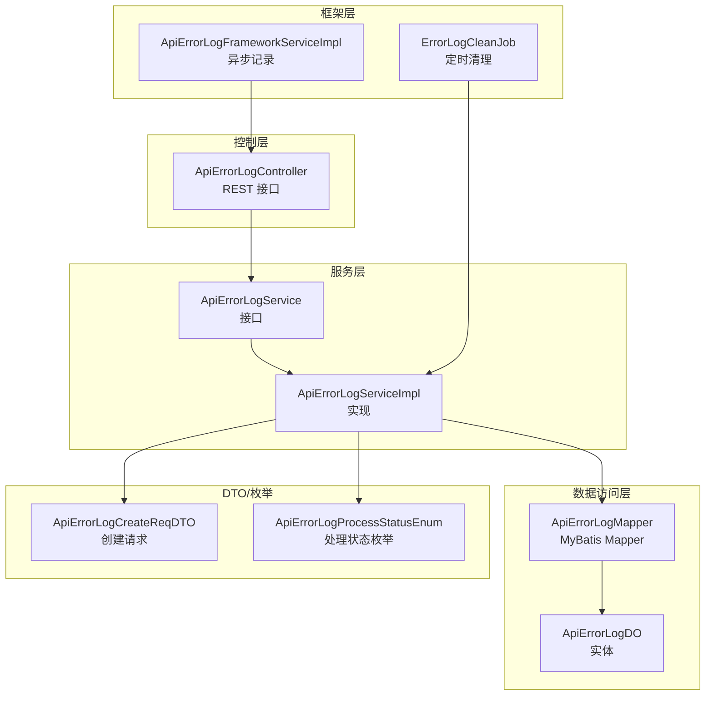
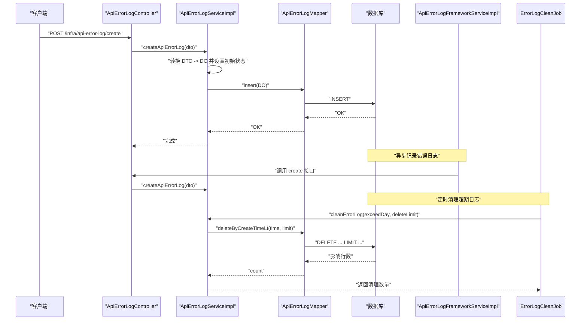
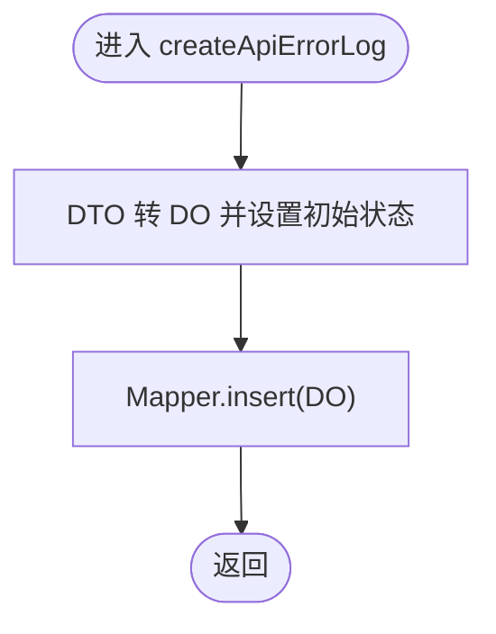
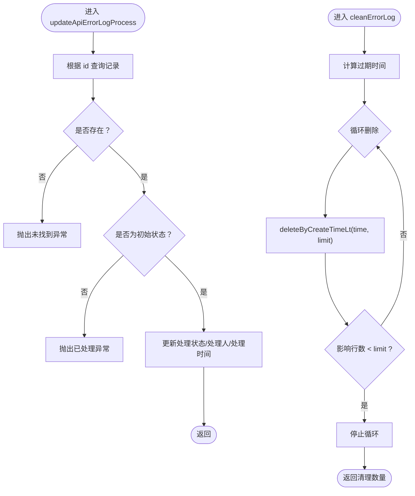
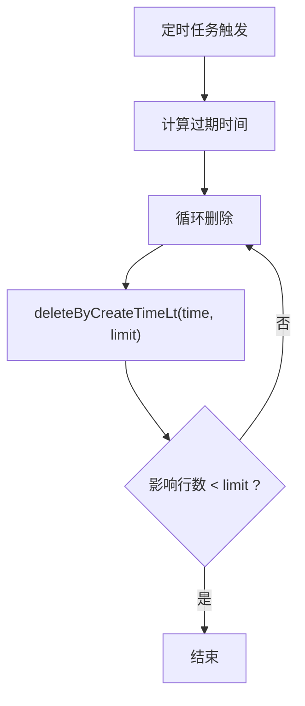
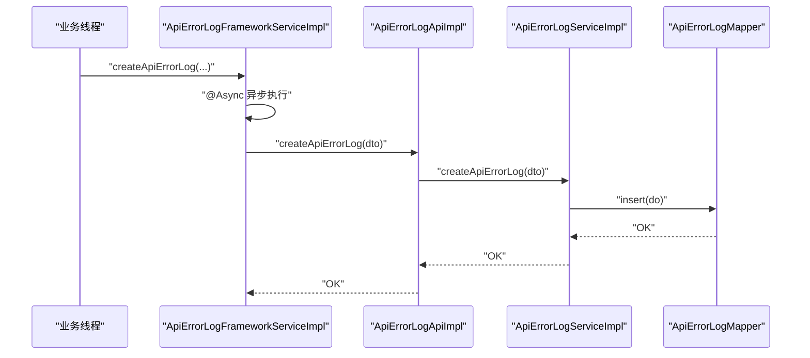
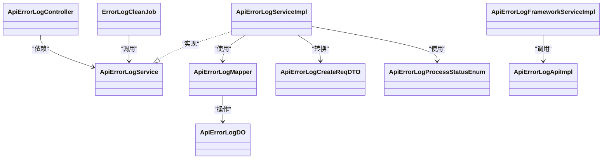

# 错误日志服务

<cite>
**本文引用的文件**
- [ApiErrorLogServiceImpl.java](file://yudao-module-infra/yudao-module-infra-biz/src/main/java/cn/iocoder/yudao/module/infra/service/logger/ApiErrorLogServiceImpl.java)
- [ApiErrorLogService.java](file://yudao-module-infra/yudao-module-infra-biz/src/main/java/cn/iocoder/yudao/module/infra/service/logger/ApiErrorLogService.java)
- [ApiErrorLogApiImpl.java](file://yudao-module-infra/yudao-module-infra-biz/src/main/java/cn/iocoder/yudao/module/infra/api/logger/ApiErrorLogApiImpl.java)
- [ApiErrorLogApi.java](file://yudao-module-infra/yudao-module-infra-api/src/main/java/cn/iocoder/yudao/module/infra/api/logger/ApiErrorLogApi.java)
- [ApiErrorLogController.java](file://yudao-module-infra/yudao-module-infra-biz/src/main/java/cn/iocoder/yudao/module/infra/controller/admin/logger/ApiErrorLogController.java)
- [ApiErrorLogMapper.java](file://yudao-module-infra/yudao-module-infra-biz/src/main/java/cn/iocoder/yudao/module/infra/dal/mysql/logger/ApiErrorLogMapper.java)
- [ApiErrorLogDO.java](file://yudao-module-infra/yudao-module-infra-biz/src/main/java/cn/iocoder/yudao/module/infra/dal/dataobject/logger/ApiErrorLogDO.java)
- [ApiErrorLogCreateReqDTO.java](file://yudao-module-infra/yudao-module-infra-api/src/main/java/cn/iocoder/yudao/module/infra/api/logger/dto/ApiErrorLogCreateReqDTO.java)
- [ApiErrorLogProcessStatusEnum.java](file://yudao-module-infra/yudao-module-infra-biz/src/main/java/cn/iocoder/yudao/module/infra/enums/logger/ApiErrorLogProcessStatusEnum.java)
- [ErrorLogCleanJob.java](file://yudao-module-infra/yudao-module-infra-biz/src/main/java/cn/iocoder/yudao/module/infra/job/logger/ErrorLogCleanJob.java)
- [ApiErrorLogFrameworkServiceImpl.java](file://yudao-framework/yudao-spring-boot-starter-web/src/main/java/cn/iocoder/yudao/framework/apilog/core/service/ApiErrorLogFrameworkServiceImpl.java)
- [BaseDO.java](file://yudao-framework/yudao-spring-boot-starter-mybatis/src/main/java/cn/iocoder/yudao/framework/mybatis/core/dataobject/BaseDO.java)
- [BaseMapperX.java](file://yudao-framework/yudao-spring-boot-starter-mybatis/src/main/java/cn/iocoder/yudao/framework/mybatis/core/mapper/BaseMapperX.java)
- [ApiErrorLogServiceImplTest.java](file://yudao-module-infra/yudao-module-infra-biz/src/test/java/cn/iocoder/yudao/module/infra/service/logger/ApiErrorLogServiceImplTest.java)
</cite>

## 目录
1. [简介](#简介)
2. [项目结构](#项目结构)
3. [核心组件](#核心组件)
4. [架构总览](#架构总览)
5. [详细组件分析](#详细组件分析)
6. [依赖关系分析](#依赖关系分析)
7. [性能考量](#性能考量)
8. [故障排查指南](#故障排查指南)
9. [结论](#结论)
10. [附录](#附录)

## 简介
本文件围绕“错误日志服务”展开，重点解析错误日志核心处理服务的职责与实现细节，覆盖从接收错误日志创建请求到持久化存储的完整链路；阐述服务层的事务管理与异常处理策略；说明日志清理策略与数据归档方案；并给出性能优化建议（异步写入、批量处理等），以及扩展日志分析功能的实践路径（新增字段、集成外部监控系统）。

## 项目结构
错误日志模块位于基础设施模块中，采用典型的分层架构：
- 控制层：对外暴露 REST 接口，负责参数校验与权限控制
- 服务层：封装业务逻辑，协调数据访问与状态变更
- 数据访问层：基于 MyBatis-Plus 封装通用 Mapper，提供分页与条件删除
- DTO/DO：传输对象与持久化对象，承载日志字段与处理状态
- 框架层：提供异步记录错误日志的能力，避免阻塞业务线程

图表来源
- [ApiErrorLogController.java](file://yudao-module-infra/yudao-module-infra-biz/src/main/java/cn/iocoder/yudao/module/infra/controller/admin/logger/ApiErrorLogController.java#L1-L75)
- [ApiErrorLogService.java](file://yudao-module-infra/yudao-module-infra-biz/src/main/java/cn/iocoder/yudao/module/infra/service/logger/ApiErrorLogService.java#L1-L47)
- [ApiErrorLogServiceImpl.java](file://yudao-module-infra/yudao-module-infra-biz/src/main/java/cn/iocoder/yudao/module/infra/service/logger/ApiErrorLogServiceImpl.java#L1-L78)
- [ApiErrorLogMapper.java](file://yudao-module-infra/yudao-module-infra-biz/src/main/java/cn/iocoder/yudao/module/infra/dal/mysql/logger/ApiErrorLogMapper.java#L1-L45)
- [ApiErrorLogDO.java](file://yudao-module-infra/yudao-module-infra-biz/src/main/java/cn/iocoder/yudao/module/infra/dal/dataobject/logger/ApiErrorLogDO.java#L1-L157)
- [ApiErrorLogCreateReqDTO.java](file://yudao-module-infra/yudao-module-infra-api/src/main/java/cn/iocoder/yudao/module/infra/api/logger/dto/ApiErrorLogCreateReqDTO.java#L1-L108)
- [ApiErrorLogProcessStatusEnum.java](file://yudao-module-infra/yudao-module-infra-biz/src/main/java/cn/iocoder/yudao/module/infra/enums/logger/ApiErrorLogProcessStatusEnum.java#L1-L29)
- [ApiErrorLogFrameworkServiceImpl.java](file://yudao-framework/yudao-spring-boot-starter-web/src/main/java/cn/iocoder/yudao/framework/apilog/core/service/ApiErrorLogFrameworkServiceImpl.java#L1-L29)
- [ErrorLogCleanJob.java](file://yudao-module-infra/yudao-module-infra-biz/src/main/java/cn/iocoder/yudao/module/infra/job/logger/ErrorLogCleanJob.java#L1-L39)

章节来源
- [ApiErrorLogController.java](file://yudao-module-infra/yudao-module-infra-biz/src/main/java/cn/iocoder/yudao/module/infra/controller/admin/logger/ApiErrorLogController.java#L1-L75)
- [ApiErrorLogService.java](file://yudao-module-infra/yudao-module-infra-biz/src/main/java/cn/iocoder/yudao/module/infra/service/logger/ApiErrorLogService.java#L1-L47)
- [ApiErrorLogServiceImpl.java](file://yudao-module-infra/yudao-module-infra-biz/src/main/java/cn/iocoder/yudao/module/infra/service/logger/ApiErrorLogServiceImpl.java#L1-L78)
- [ApiErrorLogMapper.java](file://yudao-module-infra/yudao-module-infra-biz/src/main/java/cn/iocoder/yudao/module/infra/dal/mysql/logger/ApiErrorLogMapper.java#L1-L45)
- [ApiErrorLogDO.java](file://yudao-module-infra/yudao-module-infra-biz/src/main/java/cn/iocoder/yudao/module/infra/dal/dataobject/logger/ApiErrorLogDO.java#L1-L157)
- [ApiErrorLogCreateReqDTO.java](file://yudao-module-infra/yudao-module-infra-api/src/main/java/cn/iocoder/yudao/module/infra/api/logger/dto/ApiErrorLogCreateReqDTO.java#L1-L108)
- [ApiErrorLogProcessStatusEnum.java](file://yudao-module-infra/yudao-module-infra-biz/src/main/java/cn/iocoder/yudao/module/infra/enums/logger/ApiErrorLogProcessStatusEnum.java#L1-L29)
- [ApiErrorLogFrameworkServiceImpl.java](file://yudao-framework/yudao-spring-boot-starter-web/src/main/java/cn/iocoder/yudao/framework/apilog/core/service/ApiErrorLogFrameworkServiceImpl.java#L1-L29)
- [ErrorLogCleanJob.java](file://yudao-module-infra/yudao-module-infra-biz/src/main/java/cn/iocoder/yudao/module/infra/job/logger/ErrorLogCleanJob.java#L1-L39)

## 核心组件
- 控制器：提供错误日志状态更新、分页查询、导出 Excel 等接口
- 服务接口与实现：封装创建、分页、状态更新、清理等业务逻辑
- 数据访问层：提供分页查询与按创建时间删除的 SQL
- 实体与 DTO：承载日志字段与处理状态
- 框架服务：提供异步记录错误日志的能力
- 定时任务：周期性清理超期日志

章节来源
- [ApiErrorLogController.java](file://yudao-module-infra/yudao-module-infra-biz/src/main/java/cn/iocoder/yudao/module/infra/controller/admin/logger/ApiErrorLogController.java#L1-L75)
- [ApiErrorLogService.java](file://yudao-module-infra/yudao-module-infra-biz/src/main/java/cn/iocoder/yudao/module/infra/service/logger/ApiErrorLogService.java#L1-L47)
- [ApiErrorLogServiceImpl.java](file://yudao-module-infra/yudao-module-infra-biz/src/main/java/cn/iocoder/yudao/module/infra/service/logger/ApiErrorLogServiceImpl.java#L1-L78)
- [ApiErrorLogMapper.java](file://yudao-module-infra/yudao-module-infra-biz/src/main/java/cn/iocoder/yudao/module/infra/dal/mysql/logger/ApiErrorLogMapper.java#L1-L45)
- [ApiErrorLogDO.java](file://yudao-module-infra/yudao-module-infra-biz/src/main/java/cn/iocoder/yudao/module/infra/dal/dataobject/logger/ApiErrorLogDO.java#L1-L157)
- [ApiErrorLogCreateReqDTO.java](file://yudao-module-infra/yudao-module-infra-api/src/main/java/cn/iocoder/yudao/module/infra/api/logger/dto/ApiErrorLogCreateReqDTO.java#L1-L108)
- [ApiErrorLogProcessStatusEnum.java](file://yudao-module-infra/yudao-module-infra-biz/src/main/java/cn/iocoder/yudao/module/infra/enums/logger/ApiErrorLogProcessStatusEnum.java#L1-L29)
- [ApiErrorLogFrameworkServiceImpl.java](file://yudao-framework/yudao-spring-boot-starter-web/src/main/java/cn/iocoder/yudao/framework/apilog/core/service/ApiErrorLogFrameworkServiceImpl.java#L1-L29)
- [ErrorLogCleanJob.java](file://yudao-module-infra/yudao-module-infra-biz/src/main/java/cn/iocoder/yudao/module/infra/job/logger/ErrorLogCleanJob.java#L1-L39)

## 架构总览
错误日志服务采用“控制器-服务-数据访问-实体”的分层设计，配合框架层的异步记录与定时任务清理，形成完整的错误日志生命周期闭环。

图表来源
- [ApiErrorLogController.java](file://yudao-module-infra/yudao-module-infra-biz/src/main/java/cn/iocoder/yudao/module/infra/controller/admin/logger/ApiErrorLogController.java#L1-L75)
- [ApiErrorLogServiceImpl.java](file://yudao-module-infra/yudao-module-infra-biz/src/main/java/cn/iocoder/yudao/module/infra/service/logger/ApiErrorLogServiceImpl.java#L1-L78)
- [ApiErrorLogMapper.java](file://yudao-module-infra/yudao-module-infra-biz/src/main/java/cn/iocoder/yudao/module/infra/dal/mysql/logger/ApiErrorLogMapper.java#L1-L45)
- [ApiErrorLogFrameworkServiceImpl.java](file://yudao-framework/yudao-spring-boot-starter-web/src/main/java/cn/iocoder/yudao/framework/apilog/core/service/ApiErrorLogFrameworkServiceImpl.java#L1-L29)
- [ErrorLogCleanJob.java](file://yudao-module-infra/yudao-module-infra-biz/src/main/java/cn/iocoder/yudao/module/infra/job/logger/ErrorLogCleanJob.java#L1-L39)

## 详细组件分析

### 组件一：错误日志创建流程（createErrorLog）
- 输入：ApiErrorLogCreateReqDTO（包含链路追踪、用户信息、请求信息、异常信息等）
- 处理：
  - 服务层将 DTO 转换为 DO，并设置处理状态为“未处理”
  - 通过 Mapper 插入数据库
- 输出：成功插入一条错误日志记录

图表来源
- [ApiErrorLogServiceImpl.java](file://yudao-module-infra/yudao-module-infra-biz/src/main/java/cn/iocoder/yudao/module/infra/service/logger/ApiErrorLogServiceImpl.java#L34-L39)
- [ApiErrorLogMapper.java](file://yudao-module-infra/yudao-module-infra-biz/src/main/java/cn/iocoder/yudao/module/infra/dal/mysql/logger/ApiErrorLogMapper.java#L1-L45)
- [ApiErrorLogCreateReqDTO.java](file://yudao-module-infra/yudao-module-infra-api/src/main/java/cn/iocoder/yudao/module/infra/api/logger/dto/ApiErrorLogCreateReqDTO.java#L1-L108)
- [ApiErrorLogDO.java](file://yudao-module-infra/yudao-module-infra-biz/src/main/java/cn/iocoder/yudao/module/infra/dal/dataobject/logger/ApiErrorLogDO.java#L1-L157)

章节来源
- [ApiErrorLogServiceImpl.java](file://yudao-module-infra/yudao-module-infra-biz/src/main/java/cn/iocoder/yudao/module/infra/service/logger/ApiErrorLogServiceImpl.java#L34-L39)
- [ApiErrorLogMapper.java](file://yudao-module-infra/yudao-module-infra-biz/src/main/java/cn/iocoder/yudao/module/infra/dal/mysql/logger/ApiErrorLogMapper.java#L1-L45)
- [ApiErrorLogCreateReqDTO.java](file://yudao-module-infra/yudao-module-infra-api/src/main/java/cn/iocoder/yudao/module/infra/api/logger/dto/ApiErrorLogCreateReqDTO.java#L1-L108)
- [ApiErrorLogDO.java](file://yudao-module-infra/yudao-module-infra-biz/src/main/java/cn/iocoder/yudao/module/infra/dal/dataobject/logger/ApiErrorLogDO.java#L1-L157)

### 组件二：服务层事务管理与异常处理策略
- 事务管理：服务层未显式声明事务注解，采用默认传播行为；若需跨多个写操作保证一致性，可在服务层增加事务注解
- 异常处理：
  - 更新处理状态时，若记录不存在抛出“未找到”异常
  - 若记录已处理，抛出“已处理”异常
  - 清理日志时采用循环删除，避免一次性删除过多造成压力

图表来源
- [ApiErrorLogServiceImpl.java](file://yudao-module-infra/yudao-module-infra-biz/src/main/java/cn/iocoder/yudao/module/infra/service/logger/ApiErrorLogServiceImpl.java#L46-L75)
- [ApiErrorLogMapper.java](file://yudao-module-infra/yudao-module-infra-biz/src/main/java/cn/iocoder/yudao/module/infra/dal/mysql/logger/ApiErrorLogMapper.java#L34-L42)
- [ApiErrorLogProcessStatusEnum.java](file://yudao-module-infra/yudao-module-infra-biz/src/main/java/cn/iocoder/yudao/module/infra/enums/logger/ApiErrorLogProcessStatusEnum.java#L1-L29)

章节来源
- [ApiErrorLogServiceImpl.java](file://yudao-module-infra/yudao-module-infra-biz/src/main/java/cn/iocoder/yudao/module/infra/service/logger/ApiErrorLogServiceImpl.java#L46-L75)
- [ApiErrorLogMapper.java](file://yudao-module-infra/yudao-module-infra-biz/src/main/java/cn/iocoder/yudao/module/infra/dal/mysql/logger/ApiErrorLogMapper.java#L34-L42)
- [ApiErrorLogProcessStatusEnum.java](file://yudao-module-infra/yudao-module-infra-biz/src/main/java/cn/iocoder/yudao/module/infra/enums/logger/ApiErrorLogProcessStatusEnum.java#L1-L29)

### 组件三：日志清理策略与数据归档方案
- 清理策略：
  - 定时任务每轮删除超过保留天数的日志，每次删除限制条数，避免对数据库造成过大压力
  - 通过循环判断影响行数是否达到限制，决定是否继续下一轮
- 归档方案：
  - 当前实现为物理删除；如需归档，可在清理前将记录迁移到归档表或对象存储，再执行删除

图表来源
- [ErrorLogCleanJob.java](file://yudao-module-infra/yudao-module-infra-biz/src/main/java/cn/iocoder/yudao/module/infra/job/logger/ErrorLogCleanJob.java#L1-L39)
- [ApiErrorLogServiceImpl.java](file://yudao-module-infra/yudao-module-infra-biz/src/main/java/cn/iocoder/yudao/module/infra/service/logger/ApiErrorLogServiceImpl.java#L60-L75)
- [ApiErrorLogMapper.java](file://yudao-module-infra/yudao-module-infra-biz/src/main/java/cn/iocoder/yudao/module/infra/dal/mysql/logger/ApiErrorLogMapper.java#L34-L42)

章节来源
- [ErrorLogCleanJob.java](file://yudao-module-infra/yudao-module-infra-biz/src/main/java/cn/iocoder/yudao/module/infra/job/logger/ErrorLogCleanJob.java#L1-L39)
- [ApiErrorLogServiceImpl.java](file://yudao-module-infra/yudao-module-infra-biz/src/main/java/cn/iocoder/yudao/module/infra/service/logger/ApiErrorLogServiceImpl.java#L60-L75)
- [ApiErrorLogMapper.java](file://yudao-module-infra/yudao-module-infra-biz/src/main/java/cn/iocoder/yudao/module/infra/dal/mysql/logger/ApiErrorLogMapper.java#L34-L42)

### 组件四：异步写入与批量处理
- 异步写入：框架层提供异步记录错误日志的服务，避免阻塞业务线程
- 批量处理：Mapper 层支持按条件删除并限制条数，服务层在清理时采用循环+限制的方式，减少单次压力

图表来源
- [ApiErrorLogFrameworkServiceImpl.java](file://yudao-framework/yudao-spring-boot-starter-web/src/main/java/cn/iocoder/yudao/framework/apilog/core/service/ApiErrorLogFrameworkServiceImpl.java#L1-L29)
- [ApiErrorLogApiImpl.java](file://yudao-module-infra/yudao-module-infra-biz/src/main/java/cn/iocoder/yudao/module/infra/api/logger/ApiErrorLogApiImpl.java#L1-L27)
- [ApiErrorLogServiceImpl.java](file://yudao-module-infra/yudao-module-infra-biz/src/main/java/cn/iocoder/yudao/module/infra/service/logger/ApiErrorLogServiceImpl.java#L34-L39)
- [ApiErrorLogMapper.java](file://yudao-module-infra/yudao-module-infra-biz/src/main/java/cn/iocoder/yudao/module/infra/dal/mysql/logger/ApiErrorLogMapper.java#L1-L45)

章节来源
- [ApiErrorLogFrameworkServiceImpl.java](file://yudao-framework/yudao-spring-boot-starter-web/src/main/java/cn/iocoder/yudao/framework/apilog/core/service/ApiErrorLogFrameworkServiceImpl.java#L1-L29)
- [ApiErrorLogApiImpl.java](file://yudao-module-infra/yudao-module-infra-biz/src/main/java/cn/iocoder/yudao/module/infra/api/logger/ApiErrorLogApiImpl.java#L1-L27)
- [ApiErrorLogServiceImpl.java](file://yudao-module-infra/yudao-module-infra-biz/src/main/java/cn/iocoder/yudao/module/infra/service/logger/ApiErrorLogServiceImpl.java#L34-L39)
- [ApiErrorLogMapper.java](file://yudao-module-infra/yudao-module-infra-biz/src/main/java/cn/iocoder/yudao/module/infra/dal/mysql/logger/ApiErrorLogMapper.java#L1-L45)

### 组件五：扩展日志分析功能
- 新增字段：在 DO 中添加新字段，同时在 Mapper 中补充对应 SQL 或条件构造器；如需导出，同步更新 VO 映射
- 集成外部监控：通过框架层异步记录，将关键指标（异常类型、耗时、用户行为）纳入日志，便于对接外部监控系统

章节来源
- [ApiErrorLogDO.java](file://yudao-module-infra/yudao-module-infra-biz/src/main/java/cn/iocoder/yudao/module/infra/dal/dataobject/logger/ApiErrorLogDO.java#L1-L157)
- [ApiErrorLogMapper.java](file://yudao-module-infra/yudao-module-infra-biz/src/main/java/cn/iocoder/yudao/module/infra/dal/mysql/logger/ApiErrorLogMapper.java#L1-L45)
- [ApiErrorLogFrameworkServiceImpl.java](file://yudao-framework/yudao-spring-boot-starter-web/src/main/java/cn/iocoder/yudao/framework/apilog/core/service/ApiErrorLogFrameworkServiceImpl.java#L1-L29)

## 依赖关系分析
- 控制器依赖服务接口
- 服务实现依赖 Mapper 与枚举
- Mapper 继承通用基类，提供分页与条件删除能力
- 框架服务依赖 API 接口，实现异步记录
- 定时任务依赖服务接口，执行清理

图表来源
- [ApiErrorLogController.java](file://yudao-module-infra/yudao-module-infra-biz/src/main/java/cn/iocoder/yudao/module/infra/controller/admin/logger/ApiErrorLogController.java#L1-L75)
- [ApiErrorLogService.java](file://yudao-module-infra/yudao-module-infra-biz/src/main/java/cn/iocoder/yudao/module/infra/service/logger/ApiErrorLogService.java#L1-L47)
- [ApiErrorLogServiceImpl.java](file://yudao-module-infra/yudao-module-infra-biz/src/main/java/cn/iocoder/yudao/module/infra/service/logger/ApiErrorLogServiceImpl.java#L1-L78)
- [ApiErrorLogMapper.java](file://yudao-module-infra/yudao-module-infra-biz/src/main/java/cn/iocoder/yudao/module/infra/dal/mysql/logger/ApiErrorLogMapper.java#L1-L45)
- [ApiErrorLogDO.java](file://yudao-module-infra/yudao-module-infra-biz/src/main/java/cn/iocoder/yudao/module/infra/dal/dataobject/logger/ApiErrorLogDO.java#L1-L157)
- [ApiErrorLogCreateReqDTO.java](file://yudao-module-infra/yudao-module-infra-api/src/main/java/cn/iocoder/yudao/module/infra/api/logger/dto/ApiErrorLogCreateReqDTO.java#L1-L108)
- [ApiErrorLogProcessStatusEnum.java](file://yudao-module-infra/yudao-module-infra-biz/src/main/java/cn/iocoder/yudao/module/infra/enums/logger/ApiErrorLogProcessStatusEnum.java#L1-L29)
- [ApiErrorLogFrameworkServiceImpl.java](file://yudao-framework/yudao-spring-boot-starter-web/src/main/java/cn/iocoder/yudao/framework/apilog/core/service/ApiErrorLogFrameworkServiceImpl.java#L1-L29)
- [ErrorLogCleanJob.java](file://yudao-module-infra/yudao-module-infra-biz/src/main/java/cn/iocoder/yudao/module/infra/job/logger/ErrorLogCleanJob.java#L1-L39)

章节来源
- [ApiErrorLogController.java](file://yudao-module-infra/yudao-module-infra-biz/src/main/java/cn/iocoder/yudao/module/infra/controller/admin/logger/ApiErrorLogController.java#L1-L75)
- [ApiErrorLogService.java](file://yudao-module-infra/yudao-module-infra-biz/src/main/java/cn/iocoder/yudao/module/infra/service/logger/ApiErrorLogService.java#L1-L47)
- [ApiErrorLogServiceImpl.java](file://yudao-module-infra/yudao-module-infra-biz/src/main/java/cn/iocoder/yudao/module/infra/service/logger/ApiErrorLogServiceImpl.java#L1-L78)
- [ApiErrorLogMapper.java](file://yudao-module-infra/yudao-module-infra-biz/src/main/java/cn/iocoder/yudao/module/infra/dal/mysql/logger/ApiErrorLogMapper.java#L1-L45)
- [ApiErrorLogDO.java](file://yudao-module-infra/yudao-module-infra-biz/src/main/java/cn/iocoder/yudao/module/infra/dal/dataobject/logger/ApiErrorLogDO.java#L1-L157)
- [ApiErrorLogCreateReqDTO.java](file://yudao-module-infra/yudao-module-infra-api/src/main/java/cn/iocoder/yudao/module/infra/api/logger/dto/ApiErrorLogCreateReqDTO.java#L1-L108)
- [ApiErrorLogProcessStatusEnum.java](file://yudao-module-infra/yudao-module-infra-biz/src/main/java/cn/iocoder/yudao/module/infra/enums/logger/ApiErrorLogProcessStatusEnum.java#L1-L29)
- [ApiErrorLogFrameworkServiceImpl.java](file://yudao-framework/yudao-spring-boot-starter-web/src/main/java/cn/iocoder/yudao/framework/apilog/core/service/ApiErrorLogFrameworkServiceImpl.java#L1-L29)
- [ErrorLogCleanJob.java](file://yudao-module-infra/yudao-module-infra-biz/src/main/java/cn/iocoder/yudao/module/infra/job/logger/ErrorLogCleanJob.java#L1-L39)

## 性能考量
- 异步写入：通过框架层异步记录，降低业务线程阻塞风险
- 批量删除：清理时限制每次删除条数，避免数据库压力峰值
- 分页查询：Mapper 提供分页能力，结合条件过滤，提高查询效率
- 基类能力：继承通用 Mapper，复用分页与条件构造能力

章节来源
- [ApiErrorLogFrameworkServiceImpl.java](file://yudao-framework/yudao-spring-boot-starter-web/src/main/java/cn/iocoder/yudao/framework/apilog/core/service/ApiErrorLogFrameworkServiceImpl.java#L1-L29)
- [ApiErrorLogServiceImpl.java](file://yudao-module-infra/yudao-module-infra-biz/src/main/java/cn/iocoder/yudao/module/infra/service/logger/ApiErrorLogServiceImpl.java#L60-L75)
- [ApiErrorLogMapper.java](file://yudao-module-infra/yudao-module-infra-biz/src/main/java/cn/iocoder/yudao/module/infra/dal/mysql/logger/ApiErrorLogMapper.java#L22-L32)
- [BaseMapperX.java](file://yudao-framework/yudao-spring-boot-starter-mybatis/src/main/java/cn/iocoder/yudao/framework/mybatis/core/mapper/BaseMapperX.java#L1-L28)

## 故障排查指南
- 更新处理状态失败：
  - 若提示“未找到”，检查 ID 是否正确
  - 若提示“已处理”，确认记录是否已被其他流程处理
- 清理日志无效：
  - 检查保留天数与删除条数配置
  - 确认定时任务是否正常运行
- 导出异常：
  - 检查分页参数与权限配置

章节来源
- [ApiErrorLogServiceImpl.java](file://yudao-module-infra/yudao-module-infra-biz/src/main/java/cn/iocoder/yudao/module/infra/service/logger/ApiErrorLogServiceImpl.java#L46-L75)
- [ApiErrorLogServiceImplTest.java](file://yudao-module-infra/yudao-module-infra-biz/src/test/java/cn/iocoder/yudao/module/infra/service/logger/ApiErrorLogServiceImplTest.java#L113-L141)
- [ErrorLogCleanJob.java](file://yudao-module-infra/yudao-module-infra-biz/src/main/java/cn/iocoder/yudao/module/infra/job/logger/ErrorLogCleanJob.java#L1-L39)

## 结论
错误日志服务通过清晰的分层设计与通用 Mapper 能力，实现了从创建、分页、状态更新到定时清理的完整闭环。服务层未显式声明事务，建议在需要强一致性的场景增加事务注解；清理策略采用循环+限制的方式，具备良好的可扩展性。通过框架层异步记录与测试用例验证，整体具备较好的稳定性与可维护性。

## 附录
- 基础实体与通用 Mapper：提供创建/更新时间、逻辑删除等通用能力
- 控制器接口：提供状态更新、分页查询、导出 Excel 等能力

章节来源
- [BaseDO.java](file://yudao-framework/yudao-spring-boot-starter-mybatis/src/main/java/cn/iocoder/yudao/framework/mybatis/core/dataobject/BaseDO.java#L1-L56)
- [BaseMapperX.java](file://yudao-framework/yudao-spring-boot-starter-mybatis/src/main/java/cn/iocoder/yudao/framework/mybatis/core/mapper/BaseMapperX.java#L1-L28)
- [ApiErrorLogController.java](file://yudao-module-infra/yudao-module-infra-biz/src/main/java/cn/iocoder/yudao/module/infra/controller/admin/logger/ApiErrorLogController.java#L1-L75)