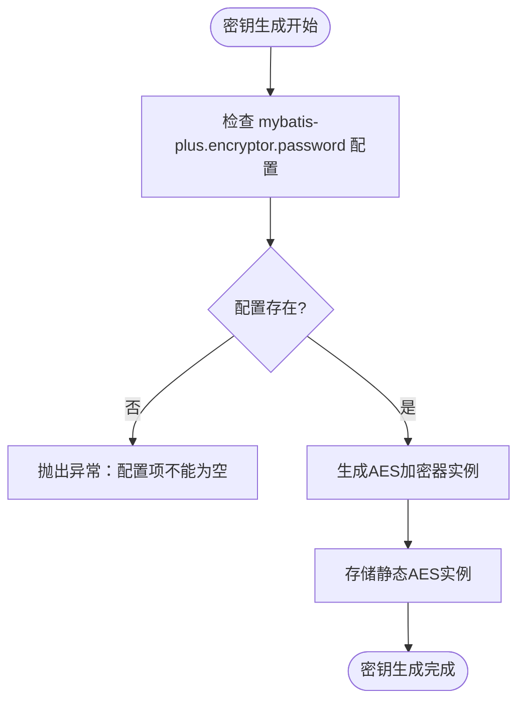
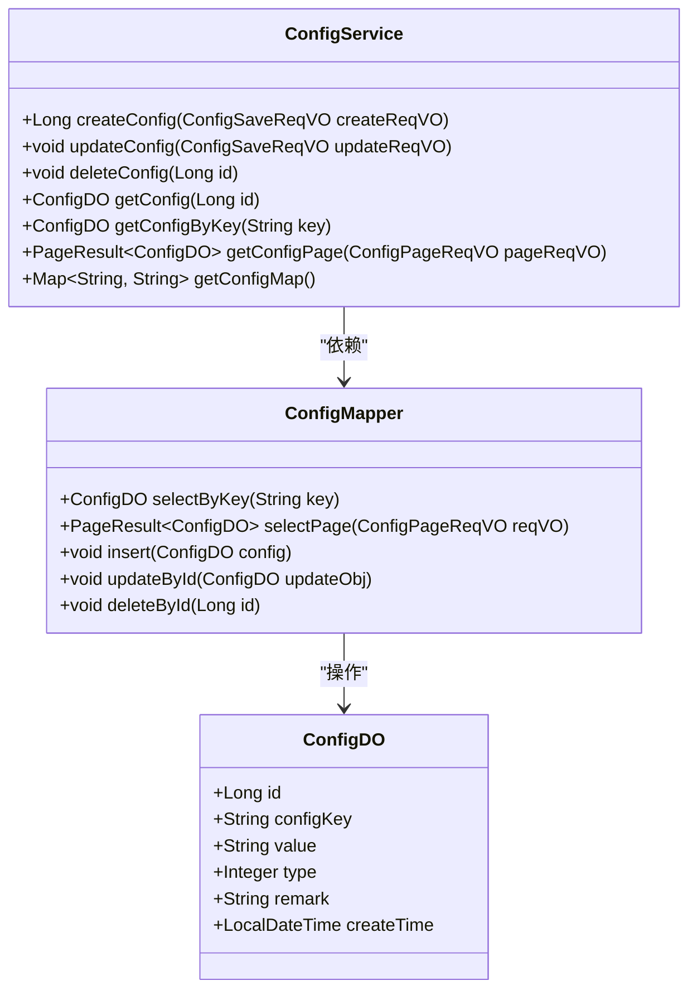
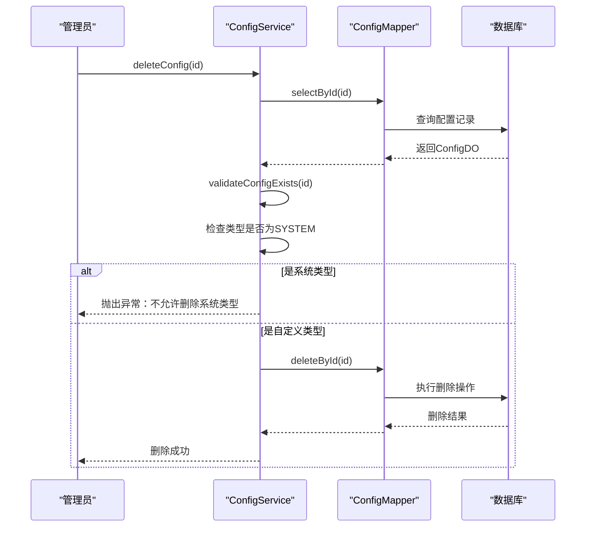
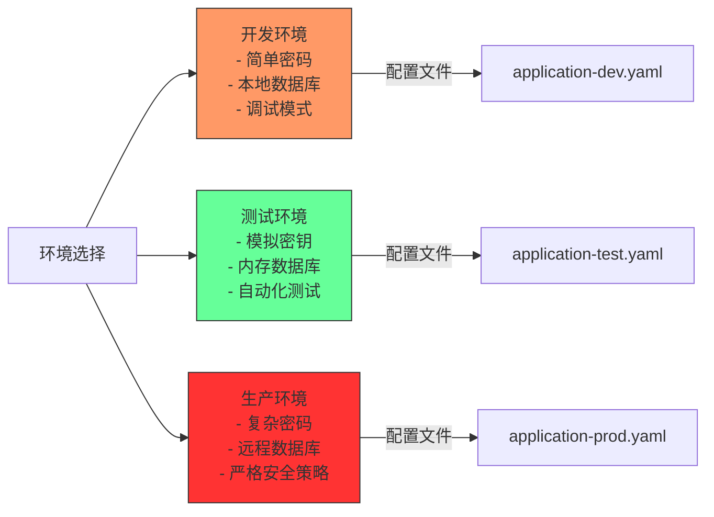
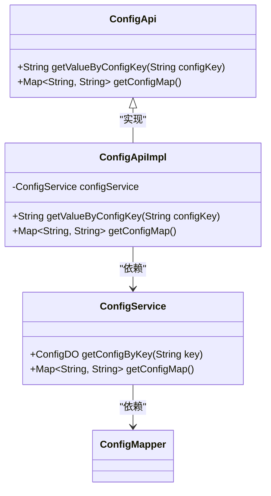

# 密钥管理

<cite>
**本文档引用的文件**  
- [EncryptTypeHandler.java](file://eplus-framework/eplus-common/src/main/java/com/syj/eplus/framework/common/config/handler/EncryptTypeHandler.java)
- [SecurityProperties.java](file://yudao-framework/yudao-spring-boot-starter-security/src/main/java/cn/iocoder/yudao/framework/security/config/SecurityProperties.java)
- [ConfigServiceImpl.java](file://yudao-module-infra/yudao-module-infra-biz/src/main/java/cn/iocoder/yudao/module/infra/service/config/ConfigServiceImpl.java)
- [ConfigApiImpl.java](file://yudao-module-infra/yudao-module-infra-biz/src/main/java/cn/iocoder/yudao/module/infra/api/config/ConfigApiImpl.java)
- [docker-compose.yml](file://docker-compose.yml)
- [application-unit-test.yaml](file://yudao-module-system/yudao-module-system-biz/src/test/resources/application-unit-test.yaml)
</cite>

## 目录
1. [引言](#引言)
2. [密钥生成策略](#密钥生成策略)
3. [密钥存储机制](#密钥存储机制)
4. [密钥轮换与销毁](#密钥轮换与销毁)
5. [对称与非对称密钥管理](#对称与非对称密钥管理)
6. [多环境密钥配置](#多环境密钥配置)
7. [配置中心集成](#配置中心集成)
8. [密钥安全最佳实践](#密钥安全最佳实践)
9. [密钥泄露应急响应](#密钥泄露应急响应)
10. [结论](#结论)

## 引言
本文档系统阐述了企业级应用中的密钥管理策略，涵盖加密密钥的生成、存储、轮换和销毁等全生命周期管理。文档详细说明了对称加密密钥和非对称加密密钥对的管理方法，描述了密钥在开发、测试和生产环境中的差异化配置方案，解释了密钥与配置中心的集成方式，并提供了密钥安全存储的最佳实践建议。

## 密钥生成策略
系统采用基于Hutool加密库的AES对称加密算法进行密钥生成。密钥通过配置项`mybatis-plus.encryptor.password`进行设置，该配置项在运行时从Spring环境属性中读取。系统使用BCryptPasswordEncoder作为密码编码器，其加密复杂度可通过`yudao.security.passwordEncoderLength`配置项进行调整，默认值为4。



**图示来源**
- [EncryptTypeHandler.java](file://eplus-framework/eplus-common/src/main/java/com/syj/eplus/framework/common/config/handler/EncryptTypeHandler.java#L64-L73)

**本节来源**
- [EncryptTypeHandler.java](file://eplus-framework/eplus-common/src/main/java/com/syj/eplus/framework/common/config/handler/EncryptTypeHandler.java#L23-L73)
- [SecurityProperties.java](file://yudao-framework/yudao-spring-boot-starter-security/src/main/java/cn/iocoder/yudao/framework/security/config/SecurityProperties.java#L48-L50)

## 密钥存储机制
系统采用分层密钥存储机制，将密钥存储在不同的安全层级中。核心密钥通过配置中心进行管理，存储在数据库的配置表中。系统使用`ConfigDO`数据对象和`ConfigMapper`持久层接口来管理配置项，包括密钥在内的敏感信息。

对于数据库连接密码等敏感信息，系统在测试环境中使用明文配置，但在生产环境中建议使用加密方式存储。Docker Compose配置中，MySQL的root密码通过环境变量`MYSQL_ROOT_PASSWORD`进行设置，实现了容器化环境下的密钥隔离。



**图示来源**
- [ConfigDO.java](file://yudao-module-infra/yudao-module-infra-biz/src/main/java/cn/iocoder/yudao/module/infra/dal/dataobject/config/ConfigDO.java)
- [ConfigMapper.java](file://yudao-module-infra/yudao-module-infra-biz/src/main/java/cn/iocoder/yudao/module/infra/dal/mysql/config/ConfigMapper.java)
- [ConfigServiceImpl.java](file://yudao-module-infra/yudao-module-infra-biz/src/main/java/cn/iocoder/yudao/module/infra/service/config/ConfigServiceImpl.java)

**本节来源**
- [ConfigServiceImpl.java](file://yudao-module-infra/yudao-module-infra-biz/src/main/java/cn/iocoder/yudao/module/infra/service/config/ConfigServiceImpl.java)
- [docker-compose.yml](file://docker-compose.yml#L9)

## 密钥轮换与销毁
系统实现了密钥的动态轮换机制，通过配置中心的更新功能实现密钥的无缝切换。当需要轮换密钥时，系统会创建新的配置记录，更新密钥值，并确保旧密钥在一定时间内仍可解密历史数据，实现平滑过渡。

密钥销毁遵循严格的安全策略，只有自定义类型的配置密钥可以被删除，系统级配置密钥受到保护，防止误删。删除操作通过`deleteConfig`方法执行，该方法会先验证密钥存在性，然后检查密钥类型，确保不会删除系统关键密钥。



**图示来源**
- [ConfigServiceImpl.java](file://yudao-module-infra/yudao-module-infra-biz/src/main/java/cn/iocoder/yudao/module/infra/service/config/ConfigServiceImpl.java#L65-L74)
- [ConfigTypeEnum.java](file://yudao-module-infra/yudao-module-infra-biz/src/main/java/cn/iocoder/yudao/module/infra/enums/config/ConfigTypeEnum.java)

**本节来源**
- [ConfigServiceImpl.java](file://yudao-module-infra/yudao-module-infra-biz/src/main/java/cn/iocoder/yudao/module/infra/service/config/ConfigServiceImpl.java#L64-L74)
- [ConfigTypeEnum.java](file://yudao-module-infra/yudao-module-infra-biz/src/main/java/cn/iocoder/yudao/module/infra/enums/config/ConfigTypeEnum.java)

## 对称与非对称密钥管理
系统主要采用对称加密算法进行数据保护，使用AES算法对敏感字段进行加密存储。`EncryptTypeHandler`类实现了MyBatis的TypeHandler接口，自动处理数据库字段的加密和解密过程。

对于非对称加密需求，系统通过配置中心管理公钥和私钥对。mock模式下的密钥管理展示了非对称加密的应用场景，`mockSecret`配置项用于模拟环境的安全认证，确保测试环境与生产环境的安全策略一致性。

```mermaid
graph TB
subgraph "对称加密"
AES[AES加密算法]
EncryptHandler[EncryptTypeHandler]
DB[数据库]
end
subgraph "非对称加密"
PublicKey[公钥]
PrivateKey[私钥]
MockSecret[mockSecret配置]
end
EncryptHandler --> AES : "使用"
EncryptHandler --> DB : "加密存储"
MockSecret --> PublicKey : "生成"
MockSecret --> PrivateKey : "生成"
style AES fill:#f9f,stroke:#333
style MockSecret fill:#bbf,stroke:#333
```

**图示来源**
- [EncryptTypeHandler.java](file://eplus-framework/eplus-common/src/main/java/com/syj/eplus/framework/common/config/handler/EncryptTypeHandler.java)
- [SecurityProperties.java](file://yudao-framework/yudao-spring-boot-starter-security/src/main/java/cn/iocoder/yudao/framework/security/config/SecurityProperties.java#L39-L40)

**本节来源**
- [EncryptTypeHandler.java](file://eplus-framework/eplus-common/src/main/java/com/syj/eplus/framework/common/config/handler/EncryptTypeHandler.java)
- [SecurityProperties.java](file://yudao-framework/yudao-spring-boot-starter-security/src/main/java/cn/iocoder/yudao/framework/security/config/SecurityProperties.java)

## 多环境密钥配置
系统通过Spring Profile机制实现不同环境的密钥差异化配置。在开发和测试环境中，使用简化的安全配置以提高开发效率；在生产环境中，采用严格的密钥管理策略确保系统安全。

配置文件通过YAML文档分隔符`---`区分不同环境的配置。数据库连接信息、Redis配置等敏感信息在不同环境中使用不同的密码策略。例如，在`application-unit-test.yaml`中，数据库密码为空或使用简单密码，而在生产环境中则要求复杂密码。



**图示来源**
- [application-unit-test.yaml](file://yudao-module-system/yudao-module-system-biz/src/test/resources/application-unit-test.yaml)
- [docker-compose.yml](file://docker-compose.yml)

**本节来源**
- [application-unit-test.yaml](file://yudao-module-system/yudao-module-system-biz/src/test/resources/application-unit-test.yaml)
- [docker-compose.yml](file://docker-compose.yml)

## 配置中心集成
系统通过`ConfigApi`接口与配置中心进行集成，实现了密钥的集中管理和动态更新。`ConfigApiImpl`类作为API实现，通过`ConfigService`服务层访问配置数据，提供了按配置键获取值和获取配置映射的功能。

配置中心支持两种配置类型：系统配置（SYSTEM）和自定义配置（CUSTOM）。系统配置用于存储框架级的密钥和参数，受到保护不能删除；自定义配置用于存储业务相关的密钥，可以根据需要进行创建、更新和删除。



**图示来源**
- [ConfigApi.java](file://yudao-module-infra/yudao-module-infra-api/src/main/java/cn/iocoder/yudao/module/infra/api/config/ConfigApi.java)
- [ConfigApiImpl.java](file://yudao-module-infra/yudao-module-infra-biz/src/main/java/cn/iocoder/yudao/module/infra/api/config/ConfigApiImpl.java)
- [ConfigServiceImpl.java](file://yudao-module-infra/yudao-module-infra-biz/src/main/java/cn/iocoder/yudao/module/infra/service/config/ConfigServiceImpl.java)

**本节来源**
- [ConfigApi.java](file://yudao-module-infra/yudao-module-infra-api/src/main/java/cn/iocoder/yudao/module/infra/api/config/ConfigApi.java)
- [ConfigApiImpl.java](file://yudao-module-infra/yudao-module-infra-biz/src/main/java/cn/iocoder/yudao/module/infra/api/config/ConfigApiImpl.java)

## 密钥安全最佳实践
系统遵循密钥安全管理的最佳实践，采用多层次的安全防护措施：

1. **环境变量存储**：在容器化部署中，使用环境变量存储密钥，如Docker Compose中的`MYSQL_ROOT_PASSWORD`
2. **配置文件加密**：敏感配置项不以明文形式存储，而是通过加密处理器进行保护
3. **密钥分离**：不同服务使用独立的密钥，避免密钥泄露导致的连锁反应
4. **最小权限原则**：密钥访问遵循最小权限原则，只有必要的组件才能访问密钥

与传统方案相比，本系统的优势在于：
- 使用成熟的加密库（Hutool）确保加密算法的安全性
- 通过配置中心实现密钥的集中管理和审计
- 支持密钥的动态更新而无需重启服务
- 提供完善的密钥生命周期管理功能

## 密钥泄露应急响应
当发生密钥泄露事件时，应立即启动应急响应流程：

1. **隔离**：立即隔离受影响的系统组件，防止泄露范围扩大
2. **轮换**：通过配置中心快速轮换所有受影响的密钥
3. **审计**：检查系统日志，确定泄露的时间范围和影响程度
4. **通知**：根据安全策略通知相关方
5. **修复**：分析泄露原因，修复安全漏洞
6. **验证**：验证新密钥的有效性和系统的安全性

系统提供了`validateConfigExists`和`validateConfigKeyUnique`等验证方法，确保密钥更新过程中的数据完整性和唯一性，为应急响应提供了技术支持。

**本节来源**
- [ConfigServiceImpl.java](file://yudao-module-infra/yudao-module-infra-biz/src/main/java/cn/iocoder/yudao/module/infra/service/config/ConfigServiceImpl.java#L144-L171)

## 结论
本文档全面阐述了系统的密钥管理策略，从生成、存储、轮换到销毁的全生命周期管理。系统通过集成配置中心，实现了密钥的集中化、动态化管理，提高了安全性和运维效率。建议在生产环境中严格执行密钥管理策略，定期进行安全审计，确保系统长期稳定运行。