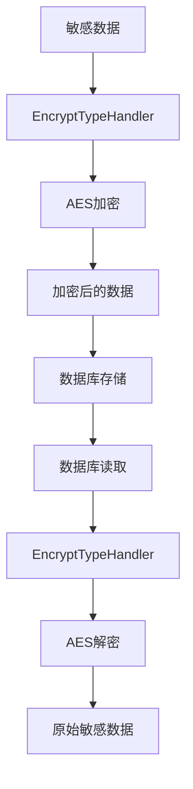
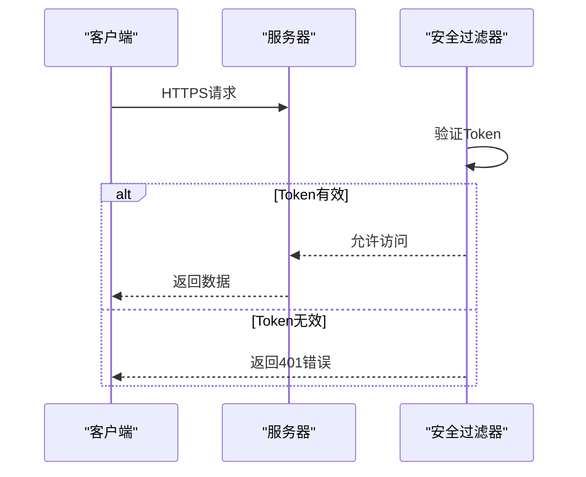
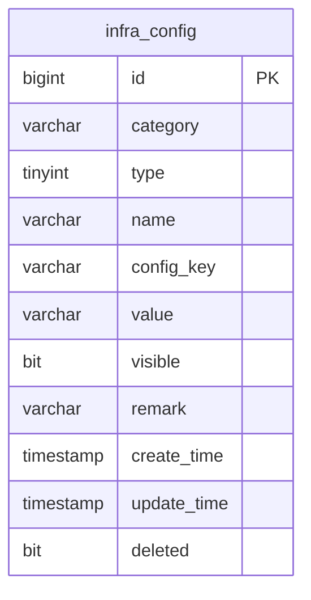
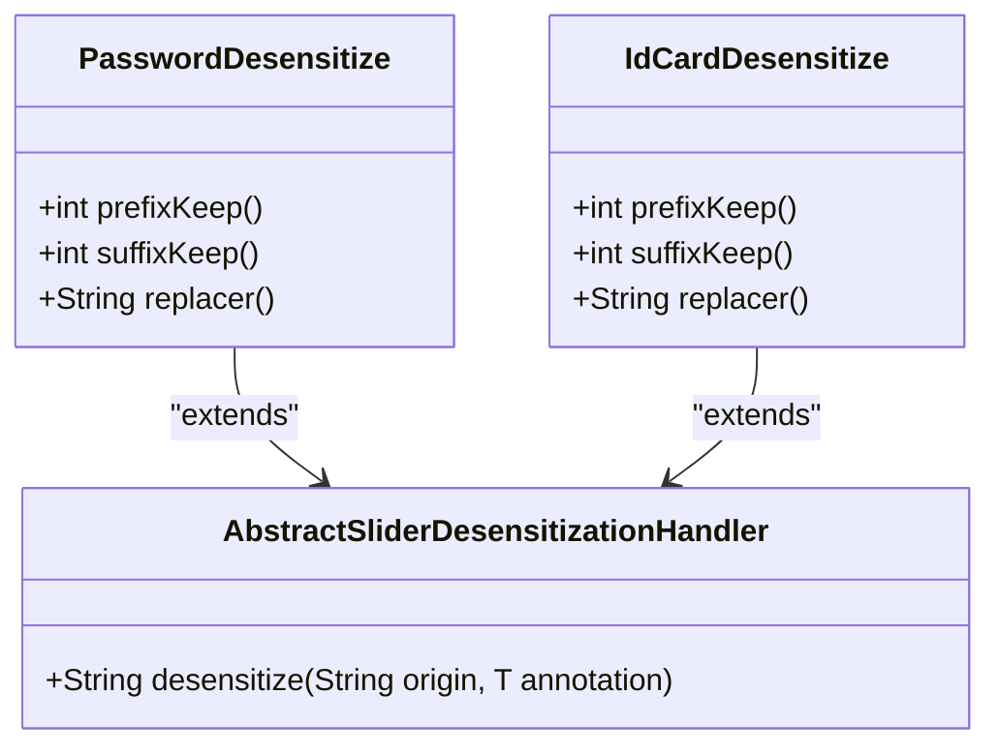
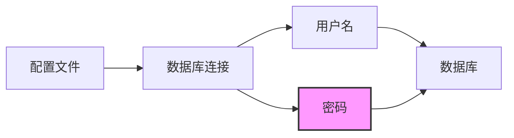
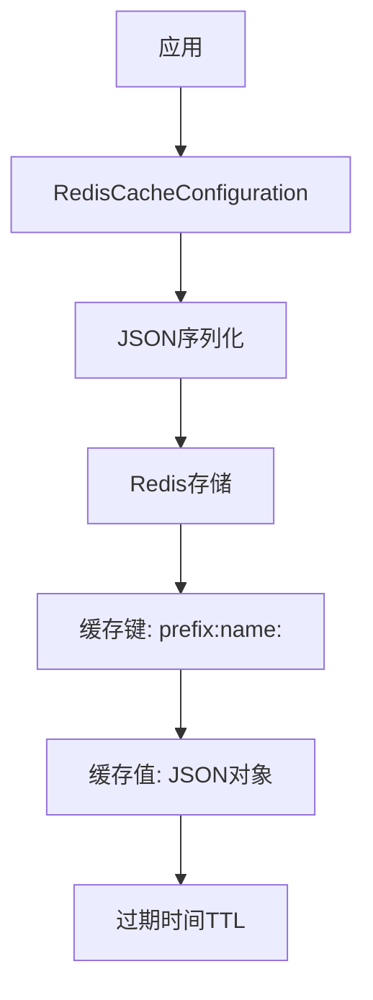

# 数据安全

<cite>
**本文档引用的文件**   
- [PasswordDesensitize.java](file://yudao-framework/yudao-spring-boot-starter-desensitize/src/main/java/cn/iocoder/yudao/framework/desensitize/core/slider/annotation/PasswordDesensitize.java)
- [IdCardDesensitize.java](file://yudao-framework/yudao-spring-boot-starter-desensitize/src/main/java/cn/iocoder/yudao/framework/desensitize/core/slider/annotation/IdCardDesensitize.java)
- [EncryptTypeHandler.java](file://eplus-framework/eplus-common/src/main/java/com/syj/eplus/framework/common/config/handler/EncryptTypeHandler.java)
- [SecurityProperties.java](file://yudao-framework/yudao-spring-boot-starter-security/src/main/java/cn/iocoder/yudao/framework/security/config/SecurityProperties.java)
- [YudaoWebSecurityConfigurerAdapter.java](file://yudao-framework/yudao-spring-boot-starter-security/src/main/java/cn/iocoder/yudao/framework/security/config/YudaoWebSecurityConfigurerAdapter.java)
- [ConfigMapVO.java](file://yudao-module-infra/yudao-module-infra-biz/src/main/java/cn/iocoder/yudao/module/infra/controller/admin/config/vo/ConfigMapVO.java)
- [ConfigController.java](file://yudao-module-infra/yudao-module-infra-biz/src/main/java/cn/iocoder/yudao/module/infra/controller/admin/config/ConfigController.java)
- [DataSourceConfigSaveReqVO.java](file://yudao-module-infra/yudao-module-infra-biz/src/main/java/cn/iocoder/yudao/module/infra/controller/admin/db/vo/DataSourceConfigSaveReqVO.java)
- [application-prod.yaml](file://yudao-server/src/main/resources/application-prod.yaml)
- [R__其他通用脚本.sql](file://eplus-flyway/src/main/resources/db/migration/dev/R__其他通用脚本.sql)
</cite>

## 目录
1. [引言](#引言)
2. [敏感数据加密存储](#敏感数据加密存储)
3. [数据传输安全](#数据传输安全)
4. [配置中心敏感配置项加密存储](#配置中心敏感配置项加密存储)
5. [数据脱敏处理](#数据脱敏处理)
6. [数据库连接凭证安全管理](#数据库连接凭证安全管理)
7. [安全的数据缓存策略](#安全的数据缓存策略)
8. [结论](#结论)

## 引言

本数据安全文档全面阐述了系统中所有数据保护机制，涵盖了敏感数据加密存储、数据传输安全、配置中心敏感配置项加密、数据脱敏处理、数据库连接凭证安全管理以及安全的数据缓存策略。文档旨在为开发者提供清晰的安全实践指导，确保系统数据的机密性、完整性和可用性。

## 敏感数据加密存储

系统采用AES（高级加密标准）算法对敏感数据进行加密存储，确保数据在数据库中的机密性。加密密钥通过配置项 `mybatis-plus.encryptor.password` 进行管理，该密钥在应用启动时从Spring配置中获取，并用于初始化AES加密器。

**图示来源**
- [EncryptTypeHandler.java](file://eplus-framework/eplus-common/src/main/java/com/syj/eplus/framework/common/config/handler/EncryptTypeHandler.java)

**本节来源**
- [EncryptTypeHandler.java](file://eplus-framework/eplus-common/src/main/java/com/syj/eplus/framework/common/config/handler/EncryptTypeHandler.java)

## 数据传输安全

系统通过HTTPS协议确保数据在传输过程中的安全性，防止数据被窃听或篡改。此外，系统使用基于Token的认证机制，通过 `Authorization` 请求头传递访问令牌，实现对API接口的安全访问控制。

**图示来源**
- [YudaoWebSecurityConfigurerAdapter.java](file://yudao-framework/yudao-spring-boot-starter-security/src/main/java/cn/iocoder/yudao/framework/security/config/YudaoWebSecurityConfigurerAdapter.java)
- [SecurityProperties.java](file://yudao-framework/yudao-spring-boot-starter-security/src/main/java/cn/iocoder/yudao/framework/security/config/SecurityProperties.java)

**本节来源**
- [YudaoWebSecurityConfigurerAdapter.java](file://yudao-framework/yudao-spring-boot-starter-security/src/main/java/cn/iocoder/yudao/framework/security/config/YudaoWebSecurityConfigurerAdapter.java)
- [SecurityProperties.java](file://yudao-framework/yudao-spring-boot-starter-security/src/main/java/cn/iocoder/yudao/framework/security/config/SecurityProperties.java)

## 配置中心敏感配置项加密存储

配置中心通过数据库表 `infra_config` 存储所有配置项，其中敏感配置项（如密码、密钥）的可见性由 `visible` 字段控制。只有当 `visible` 为 `true` 时，配置项的值才能通过API接口获取，否则将抛出异常，防止敏感信息泄露。

**图示来源**
- [infra_config表结构](file://yudao-module-infra/yudao-module-infra-biz/src/test/resources/sql/create_tables.sql#L2-L17)
- [ConfigController.java](file://yudao-module-infra/yudao-module-infra-biz/src/main/java/cn/iocoder/yudao/module/infra/controller/admin/config/ConfigController.java)

**本节来源**
- [infra_config表结构](file://yudao-module-infra/yudao-module-infra-biz/src/test/resources/sql/create_tables.sql#L2-L17)
- [ConfigController.java](file://yudao-module-infra/yudao-module-infra-biz/src/main/java/cn/iocoder/yudao/module/infra/controller/admin/config/ConfigController.java)
- [ConfigMapVO.java](file://yudao-module-infra/yudao-module-infra-biz/src/main/java/cn/iocoder/yudao/module/infra/controller/admin/config/vo/ConfigMapVO.java)

## 数据脱敏处理

系统通过自定义注解实现数据脱敏，确保敏感信息在返回给前端时被适当遮蔽。主要脱敏注解包括：

- `@PasswordDesensitize`：用于密码字段，可配置前后缀保留长度和替换字符。
- `@IdCardDesensitize`：用于身份证号字段，默认保留前6位和后2位，中间用`*`替换。

**图示来源**
- [PasswordDesensitize.java](file://yudao-framework/yudao-spring-boot-starter-desensitize/src/main/java/cn/iocoder/yudao/framework/desensitize/core/slider/annotation/PasswordDesensitize.java)
- [IdCardDesensitize.java](file://yudao-framework/yudao-spring-boot-starter-desensitize/src/main/java/cn/iocoder/yudao/framework/desensitize/core/slider/annotation/IdCardDesensitize.java)
- [AbstractSliderDesensitizationHandler.java](file://yudao-framework/yudao-spring-boot-starter-desensitize/src/main/java/cn/iocoder/yudao/framework/desensitize/core/slider/handler/AbstractSliderDesensitizationHandler.java)

**本节来源**
- [PasswordDesensitize.java](file://yudao-framework/yudao-spring-boot-starter-desensitize/src/main/java/cn/iocoder/yudao/framework/desensitize/core/slider/annotation/PasswordDesensitize.java)
- [IdCardDesensitize.java](file://yudao-framework/yudao-spring-boot-starter-desensitize/src/main/java/cn/iocoder/yudao/framework/desensitize/core/slider/annotation/IdCardDesensitize.java)
- [AbstractSliderDesensitizationHandler.java](file://yudao-framework/yudao-spring-boot-starter-desensitize/src/main/java/cn/iocoder/yudao/framework/desensitize/core/slider/handler/AbstractSliderDesensitizationHandler.java)

## 数据库连接凭证安全管理

数据库连接凭证（如用户名和密码）在配置文件中以明文形式存在，存在一定的安全风险。建议通过环境变量或密钥管理服务（如Vault）来管理这些敏感信息，避免将密码直接写入配置文件。

**图示来源**
- [application-prod.yaml](file://yudao-server/src/main/resources/application-prod.yaml#L62-L63)

**本节来源**
- [application-prod.yaml](file://yudao-server/src/main/resources/application-prod.yaml#L62-L63)
- [DataSourceConfigSaveReqVO.java](file://yudao-module-infra/yudao-module-infra-biz/src/main/java/cn/iocoder/yudao/module/infra/controller/admin/db/vo/DataSourceConfigSaveReqVO.java)

## 安全的数据缓存策略

系统使用Redis作为缓存存储，通过JSON序列化方式存储缓存数据。缓存键使用单冒号 `:` 分隔，避免Redis Desktop Manager中的多余空格问题。缓存过期时间可通过自定义配置实现，确保缓存数据的及时更新和安全性。

**图示来源**
- [YudaoCacheAutoConfiguration.java](file://yudao-framework/yudao-spring-boot-starter-redis/src/main/java/cn/iocoder/yudao/framework/redis/config/YudaoCacheAutoConfiguration.java)
- [TimeoutRedisCacheManager.java](file://yudao-framework/yudao-spring-boot-starter-redis/src/main/java/cn/iocoder/yudao/framework/redis/core/TimeoutRedisCacheManager.java)

**本节来源**
- [YudaoCacheAutoConfiguration.java](file://yudao-framework/yudao-spring-boot-starter-redis/src/main/java/cn/iocoder/yudao/framework/redis/config/YudaoCacheAutoConfiguration.java)
- [TimeoutRedisCacheManager.java](file://yudao-framework/yudao-spring-boot-starter-redis/src/main/java/cn/iocoder/yudao/framework/redis/core/TimeoutRedisCacheManager.java)

## 结论

本文档详细阐述了系统中的各项数据安全机制，包括敏感数据加密存储、数据传输安全、配置中心敏感配置项加密、数据脱敏处理、数据库连接凭证安全管理以及安全的数据缓存策略。开发者应遵循这些安全实践，确保系统数据的安全性和合规性。未来建议进一步加强数据库连接凭证的安全管理，采用环境变量或密钥管理服务来替代配置文件中的明文密码。