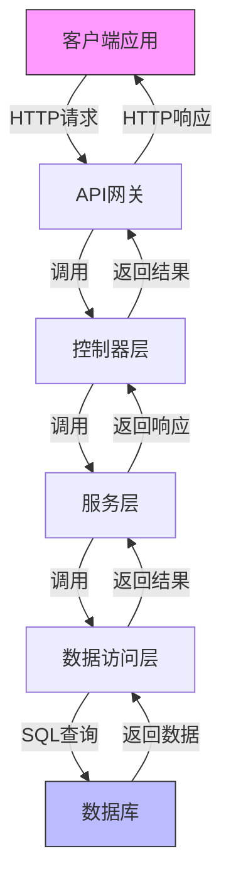
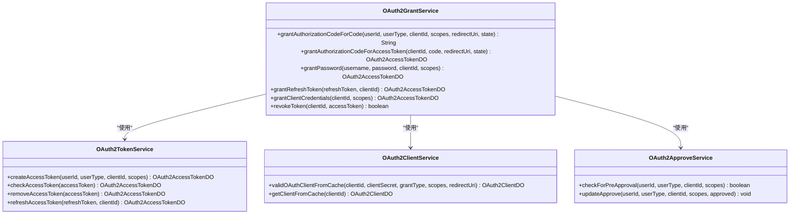
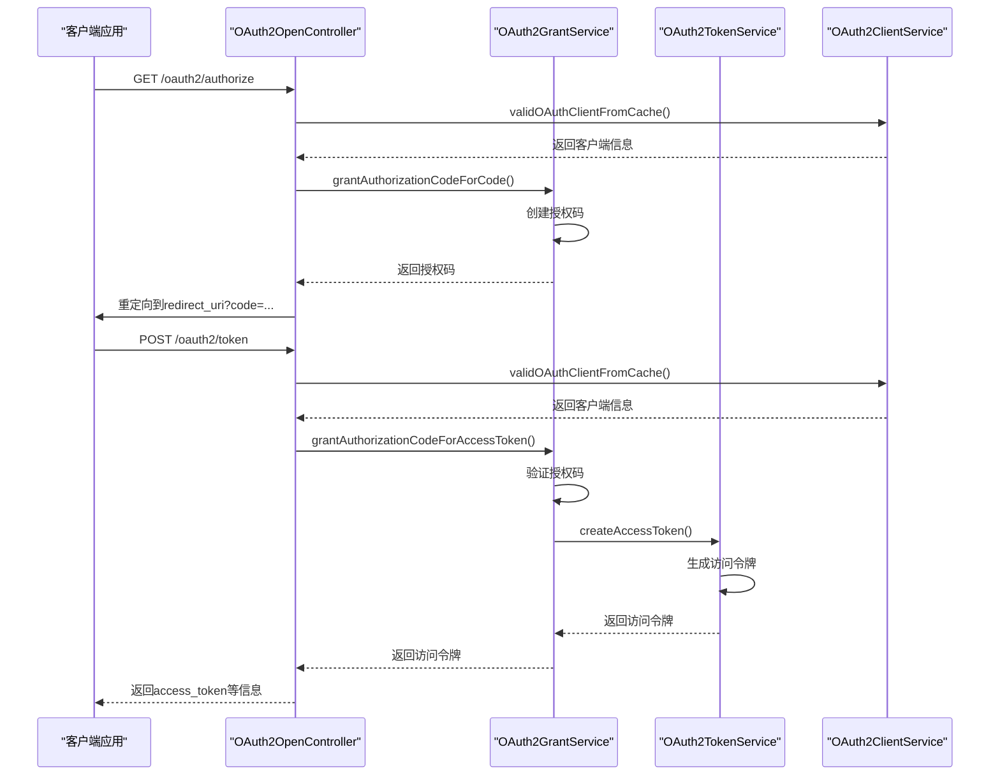
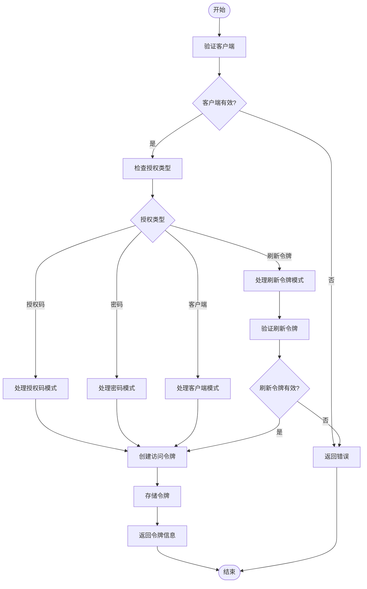
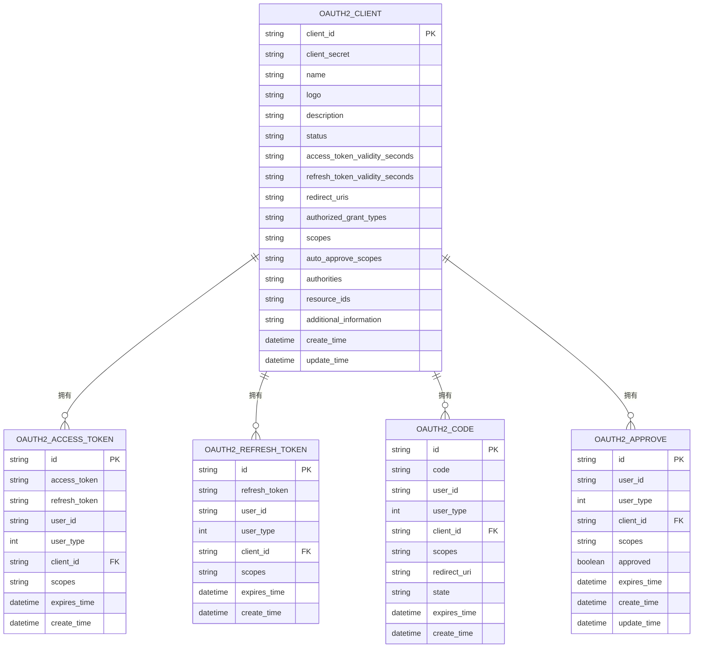
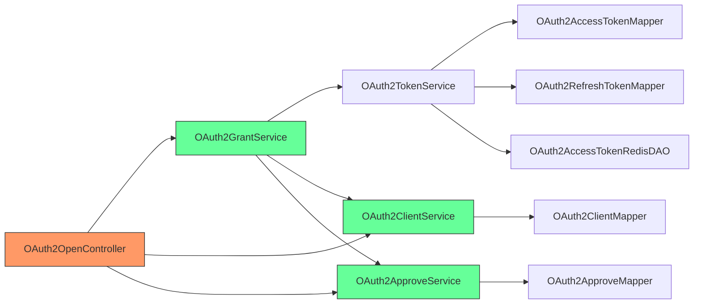

# OAuth2.0集成

<cite>
**本文档引用的文件**  
- [OAuth2TokenServiceImpl.java](file://yudao-module-system/yudao-module-system-biz/src/main/java/cn/iocoder/yudao/module/system/service/oauth2/OAuth2TokenServiceImpl.java)
- [OAuth2GrantService.java](file://yudao-module-system/yudao-module-system-biz/src/main/java/cn/iocoder/yudao/module/system/service/oauth2/OAuth2GrantService.java)
- [OAuth2ClientService.java](file://yudao-module-system/yudao-module-system-biz/src/main/java/cn/iocoder/yudao/module/system/service/oauth2/OAuth2ClientService.java)
- [OAuth2ClientDO.java](file://yudao-module-system/yudao-module-system-biz/src/main/java/cn/iocoder/yudao/module/system/dal/dataobject/oauth2/OAuth2ClientDO.java)
- [OAuth2AccessTokenDO.java](file://yudao-module-system/yudao-module-system-biz/src/main/java/cn/iocoder/yudao/module/system/dal/dataobject/oauth2/OAuth2AccessTokenDO.java)
- [OAuth2TokenApi.java](file://yudao-module-system/yudao-module-system-api/src/main/java/cn/iocoder/yudao/module/system/api/oauth2/OAuth2TokenApi.java)
- [OAuth2OpenController.java](file://yudao-module-system/yudao-module-system-biz/src/main/java/cn/iocoder/yudao/module/system/controller/admin/oauth2/OAuth2OpenController.java)
- [OAuth2ApproveServiceImpl.java](file://yudao-module-system/yudao-module-system-biz/src/main/java/cn/iocoder/yudao/module/system/service/oauth2/OAuth2ApproveServiceImpl.java)
- [OAuth2Utils.java](file://yudao-module-system/yudao-module-system-biz/src/main/java/cn/iocoder/yudao/module/system/util/oauth2/OAuth2Utils.java)
</cite>

## 目录
1. [简介](#简介)
2. [项目结构](#项目结构)
3. [核心组件](#核心组件)
4. [架构概述](#架构概述)
5. [详细组件分析](#详细组件分析)
6. [依赖分析](#依赖分析)
7. [性能考虑](#性能考虑)
8. [故障排除指南](#故障排除指南)
9. [结论](#结论)

## 简介
本文档详细描述了OAuth2.0授权框架的实现，重点介绍授权码模式、客户端模式、密码模式等授权流程。文档解释了OAuth2TokenService在令牌管理中的核心功能，包括令牌发放、刷新、撤销和过期处理。同时提供了OAuth2.0客户端注册、作用域管理、重定向URI配置的方法，并包含安全最佳实践，如PKCE验证、令牌绑定、速率限制等。为开发者提供自定义授权服务器和资源服务器的扩展指南。

## 项目结构
项目采用模块化设计，OAuth2.0相关功能主要集中在yudao-module-system模块中。该模块包含API接口、业务逻辑实现、数据访问对象和控制器等组件，形成了完整的OAuth2.0授权体系。

```mermaid
graph TD
subgraph "yudao-module-system"
subgraph "API层"
OAuth2TokenApi["OAuth2TokenApi"]
OAuth2ClientApi["OAuth2ClientApi"]
end
subgraph "服务层"
OAuth2TokenService["OAuth2TokenService"]
OAuth2GrantService["OAuth2GrantService"]
OAuth2ClientService["OAuth2ClientService"]
OAuth2ApproveService["OAuth2ApproveService"]
end
subgraph "数据层"
OAuth2AccessTokenDO["OAuth2AccessTokenDO"]
OAuth2RefreshTokenDO["OAuth2RefreshTokenDO"]
OAuth2ClientDO["OAuth2ClientDO"]
OAuth2CodeDO["OAuth2CodeDO"]
end
subgraph "控制器层"
OAuth2OpenController["OAuth2OpenController"]
OAuth2ClientController["OAuth2ClientController"]
end
API层 --> 服务层
服务层 --> 数据层
服务层 --> 控制器层
```

**图示来源**
- [OAuth2TokenApi.java](file://yudao-module-system/yudao-module-system-api/src/main/java/cn/iocoder/yudao/module/system/api/oauth2/OAuth2TokenApi.java)
- [OAuth2TokenService.java](file://yudao-module-system/yudao-module-system-biz/src/main/java/cn/iocoder/yudao/module/system/service/oauth2/OAuth2TokenService.java)
- [OAuth2AccessTokenDO.java](file://yudao-module-system/yudao-module-system-biz/src/main/java/cn/iocoder/yudao/module/system/dal/dataobject/oauth2/OAuth2AccessTokenDO.java)
- [OAuth2OpenController.java](file://yudao-module-system/yudao-module-system-biz/src/main/java/cn/iocoder/yudao/module/system/controller/admin/oauth2/OAuth2OpenController.java)

**章节来源**
- [yudao-module-system](file://yudao-module-system)

## 核心组件
OAuth2.0实现包含多个核心组件：OAuth2TokenService负责令牌的创建、校验和撤销；OAuth2GrantService处理各种授权模式的令牌发放；OAuth2ClientService管理客户端注册和验证；OAuth2ApproveService处理用户授权批准逻辑。这些组件协同工作，实现了完整的OAuth2.0授权流程。

**章节来源**
- [OAuth2TokenServiceImpl.java](file://yudao-module-system/yudao-module-system-biz/src/main/java/cn/iocoder/yudao/module/system/service/oauth2/OAuth2TokenServiceImpl.java)
- [OAuth2GrantService.java](file://yudao-module-system/yudao-module-system-biz/src/main/java/cn/iocoder/yudao/module/system/service/oauth2/OAuth2GrantService.java)
- [OAuth2ClientService.java](file://yudao-module-system/yudao-module-system-biz/src/main/java/cn/iocoder/yudao/module/system/service/oauth2/OAuth2ClientService.java)
- [OAuth2ApproveServiceImpl.java](file://yudao-module-system/yudao-module-system-biz/src/main/java/cn/iocoder/yudao/module/system/service/oauth2/OAuth2ApproveServiceImpl.java)

## 架构概述
系统采用分层架构设计，从上到下分为API层、服务层、数据层和持久层。API层定义了OAuth2.0相关的接口契约，服务层实现了具体的业务逻辑，数据层定义了数据模型，持久层负责数据存储和访问。这种分层设计确保了系统的可维护性和可扩展性。



**图示来源**
- [OAuth2OpenController.java](file://yudao-module-system/yudao-module-system-biz/src/main/java/cn/iocoder/yudao/module/system/controller/admin/oauth2/OAuth2OpenController.java)
- [OAuth2TokenServiceImpl.java](file://yudao-module-system/yudao-module-system-biz/src/main/java/cn/iocoder/yudao/module/system/service/oauth2/OAuth2TokenServiceImpl.java)
- [OAuth2AccessTokenDO.java](file://yudao-module-system/yudao-module-system-biz/src/main/java/cn/iocoder/yudao/module/system/dal/dataobject/oauth2/OAuth2AccessTokenDO.java)

## 详细组件分析

### OAuth2.0授权流程分析
系统实现了OAuth2.0标准的多种授权模式，包括授权码模式、密码模式、客户端模式和刷新令牌模式。每种模式都有相应的处理逻辑，确保符合OAuth2.0规范。

#### 授权模式类图


**图示来源**
- [OAuth2GrantService.java](file://yudao-module-system/yudao-module-system-biz/src/main/java/cn/iocoder/yudao/module/system/service/oauth2/OAuth2GrantService.java)
- [OAuth2TokenService.java](file://yudao-module-system/yudao-module-system-biz/src/main/java/cn/iocoder/yudao/module/system/service/oauth2/OAuth2TokenService.java)
- [OAuth2ClientService.java](file://yudao-module-system/yudao-module-system-biz/src/main/java/cn/iocoder/yudao/module/system/service/oauth2/OAuth2ClientService.java)
- [OAuth2ApproveServiceImpl.java](file://yudao-module-system/yudao-module-system-biz/src/main/java/cn/iocoder/yudao/module/system/service/oauth2/OAuth2ApproveServiceImpl.java)

#### 授权码模式序列图


**图示来源**
- [OAuth2OpenController.java](file://yudao-module-system/yudao-module-system-biz/src/main/java/cn/iocoder/yudao/module/system/controller/admin/oauth2/OAuth2OpenController.java)
- [OAuth2GrantServiceImpl.java](file://yudao-module-system/yudao-module-system-biz/src/main/java/cn/iocoder/yudao/module/system/service/oauth2/OAuth2GrantServiceImpl.java)
- [OAuth2TokenServiceImpl.java](file://yudao-module-system/yudao-module-system-biz/src/main/java/cn/iocoder/yudao/module/system/service/oauth2/OAuth2TokenServiceImpl.java)

#### 令牌管理流程图


**图示来源**
- [OAuth2TokenServiceImpl.java](file://yudao-module-system/yudao-module-system-biz/src/main/java/cn/iocoder/yudao/module/system/service/oauth2/OAuth2TokenServiceImpl.java)
- [OAuth2GrantServiceImpl.java](file://yudao-module-system/yudao-module-system-biz/src/main/java/cn/iocoder/yudao/module/system/service/oauth2/OAuth2GrantServiceImpl.java)

**章节来源**
- [OAuth2TokenServiceImpl.java](file://yudao-module-system/yudao-module-system-biz/src/main/java/cn/iocoder/yudao/module/system/service/oauth2/OAuth2TokenServiceImpl.java)
- [OAuth2GrantServiceImpl.java](file://yudao-module-system/yudao-module-system-biz/src/main/java/cn/iocoder/yudao/module/system/service/oauth2/OAuth2GrantServiceImpl.java)
- [OAuth2ClientServiceImpl.java](file://yudao-module-system/yudao-module-system-biz/src/main/java/cn/iocoder/yudao/module/system/service/oauth2/OAuth2ClientServiceImpl.java)

### 客户端管理分析
OAuth2.0客户端管理是系统安全的重要组成部分，负责客户端的注册、验证和配置管理。

#### 客户端数据模型


**图示来源**
- [OAuth2ClientDO.java](file://yudao-module-system/yudao-module-system-biz/src/main/java/cn/iocoder/yudao/module/system/dal/dataobject/oauth2/OAuth2ClientDO.java)
- [OAuth2AccessTokenDO.java](file://yudao-module-system/yudao-module-system-biz/src/main/java/cn/iocoder/yudao/module/system/dal/dataobject/oauth2/OAuth2AccessTokenDO.java)
- [OAuth2RefreshTokenDO.java](file://yudao-module-system/yudao-module-system-biz/src/main/java/cn/iocoder/yudao/module/system/dal/dataobject/oauth2/OAuth2RefreshTokenDO.java)

**章节来源**
- [OAuth2ClientDO.java](file://yudao-module-system/yudao-module-system-biz/src/main/java/cn/iocoder/yudao/module/system/dal/dataobject/oauth2/OAuth2ClientDO.java)
- [OAuth2AccessTokenDO.java](file://yudao-module-system/yudao-module-system-biz/src/main/java/cn/iocoder/yudao/module/system/dal/dataobject/oauth2/OAuth2AccessTokenDO.java)

## 依赖分析
系统依赖于多个核心组件和服务，形成了复杂的依赖关系网络。这些依赖关系确保了OAuth2.0功能的完整实现和安全运行。



**图示来源**
- [OAuth2OpenController.java](file://yudao-module-system/yudao-module-system-biz/src/main/java/cn/iocoder/yudao/module/system/controller/admin/oauth2/OAuth2OpenController.java)
- [OAuth2GrantService.java](file://yudao-module-system/yudao-module-system-biz/src/main/java/cn/iocoder/yudao/module/system/service/oauth2/OAuth2GrantService.java)
- [OAuth2TokenService.java](file://yudao-module-system/yudao-module-system-biz/src/main/java/cn/iocoder/yudao/module/system/service/oauth2/OAuth2TokenService.java)
- [OAuth2ClientService.java](file://yudao-module-system/yudao-module-system-biz/src/main/java/cn/iocoder/yudao/module/system/service/oauth2/OAuth2ClientService.java)

**章节来源**
- [OAuth2OpenController.java](file://yudao-module-system/yudao-module-system-biz/src/main/java/cn/iocoder/yudao/module/system/controller/admin/oauth2/OAuth2OpenController.java)
- [OAuth2GrantService.java](file://yudao-module-system/yudao-module-system-biz/src/main/java/cn/iocoder/yudao/module/system/service/oauth2/OAuth2GrantService.java)
- [OAuth2TokenService.java](file://yudao-module-system/yudao-module-system-biz/src/main/java/cn/iocoder/yudao/module/system/service/oauth2/OAuth2TokenService.java)

## 性能考虑
系统在设计时考虑了性能优化，采用Redis缓存机制存储访问令牌，减少数据库查询压力。同时，客户端信息也缓存在内存中，提高验证效率。令牌的生成使用高效的UUID算法，确保唯一性和性能平衡。

## 故障排除指南
当遇到OAuth2.0相关问题时，可以检查以下方面：客户端配置是否正确、重定向URI是否匹配、授权范围是否有效、令牌是否过期、客户端密钥是否正确。系统提供了详细的错误码和日志记录，便于定位和解决问题。

**章节来源**
- [OAuth2TokenServiceImpl.java](file://yudao-module-system/yudao-module-system-biz/src/main/java/cn/iocoder/yudao/module/system/service/oauth2/OAuth2TokenServiceImpl.java)
- [OAuth2GrantServiceImpl.java](file://yudao-module-system/yudao-module-system-biz/src/main/java/cn/iocoder/yudao/module/system/service/oauth2/OAuth2GrantServiceImpl.java)
- [OAuth2ClientServiceImpl.java](file://yudao-module-system/yudao-module-system-biz/src/main/java/cn/iocoder/yudao/module/system/service/oauth2/OAuth2ClientServiceImpl.java)

## 结论
本文档详细介绍了OAuth2.0集成的各个方面，包括授权流程、令牌管理、客户端配置和安全最佳实践。系统实现了完整的OAuth2.0授权框架，支持多种授权模式，提供了灵活的扩展能力。通过合理的架构设计和性能优化，确保了系统的安全性和高效性。