# 令牌管理

<cite>
**本文档引用的文件**   
- [OAuth2TokenService.java](file://yudao-module-system/yudao-module-system-biz/src/main/java/cn/iocoder/yudao/module/system/service/oauth2/OAuth2TokenService.java)
- [OAuth2TokenServiceImpl.java](file://yudao-module-system/yudao-module-system-biz/src/main/java/cn/iocoder/yudao/module/system/service/oauth2/OAuth2TokenServiceImpl.java)
- [OAuth2AccessTokenRedisDAO.java](file://yudao-module-system/yudao-module-system-biz/src/main/java/cn/iocoder/yudao/module/system/dal/redis/oauth2/OAuth2AccessTokenRedisDAO.java)
- [OAuth2AccessTokenDO.java](file://yudao-module-system/yudao-module-system-biz/src/main/java/cn/iocoder/yudao/module/system/dal/dataobject/oauth2/OAuth2AccessTokenDO.java)
- [OAuth2RefreshTokenDO.java](file://yudao-module-system/yudao-module-system-biz/src/main/java/cn/iocoder/yudao/module/system/dal/dataobject/oauth2/OAuth2RefreshTokenDO.java)
- [OAuth2AccessTokenMapper.java](file://yudao-module-system/yudao-module-system-biz/src/main/java/cn/iocoder/yudao/module/system/dal/mysql/oauth2/OAuth2AccessTokenMapper.java)
- [OAuth2RefreshTokenMapper.java](file://yudao-module-system/yudao-module-system-biz/src/main/java/cn/iocoder/yudao/module/system/dal/mysql/oauth2/OAuth2RefreshTokenMapper.java)
- [OAuth2TokenApiImpl.java](file://yudao-module-system/yudao-module-system-biz/src/main/java/cn/iocoder/yudao/module/system/api/oauth2/OAuth2TokenApiImpl.java)
- [OAuth2OpenController.java](file://yudao-module-system/yudao-module-system-biz/src/main/java/cn/iocoder/yudao/module/system/controller/admin/oauth2/OAuth2OpenController.java)
- [RedisKeyConstants.java](file://yudao-module-system/yudao-module-system-biz/src/main/java/cn/iocoder/yudao/module/system/dal/redis/RedisKeyConstants.java)
</cite>

## 目录
1. [引言](#引言)
2. [核心组件分析](#核心组件分析)
3. [令牌生成机制](#令牌生成机制)
4. [令牌存储与加密策略](#令牌存储与加密策略)
5. [令牌验证与撤销机制](#令牌验证与撤销机制)
6. [Redis分布式管理](#redis分布式管理)
7. [令牌刷新流程](#令牌刷新流程)
8. [JWT用户身份承载](#jwt用户身份承载)
9. [架构流程图](#架构流程图)
10. [结论](#结论)

## 引言
OAuth2TokenService 是系统中负责管理 OAuth2.0 访问令牌和刷新令牌的核心服务组件。该服务实现了完整的令牌生命周期管理，包括令牌的生成、存储、验证、刷新和撤销等关键功能。通过结合数据库持久化和 Redis 缓存机制，实现了高性能的分布式令牌管理。本文档将深入解析该服务的实现机制和核心设计。

## 核心组件分析

OAuth2TokenService 作为系统安全认证的核心组件，主要负责 OAuth2.0 协议中令牌的全生命周期管理。该服务通过接口 `OAuth2TokenService` 定义了标准的令牌操作契约，其具体实现 `OAuth2TokenServiceImpl` 类提供了完整的业务逻辑。

服务的主要功能包括：
- 访问令牌和刷新令牌的创建
- 令牌的验证与校验
- 令牌的刷新机制
- 令牌的撤销与清理
- 令牌分页查询功能

该服务与 OAuth2ClientService 紧密协作，确保客户端认证的安全性，同时通过 Redis 缓存优化令牌的读取性能。

**核心组件来源**
- [OAuth2TokenService.java](file://yudao-module-system/yudao-module-system-biz/src/main/java/cn/iocoder/yudao/module/system/service/oauth2/OAuth2TokenService.java#L1-L81)
- [OAuth2TokenServiceImpl.java](file://yudao-module-system/yudao-module-system-biz/src/main/java/cn/iocoder/yudao/module/system/service/oauth2/OAuth2TokenServiceImpl.java#L1-L164)

## 令牌生成机制

### 访问令牌生成
当用户通过认证后，系统调用 `createAccessToken` 方法生成访问令牌。该方法首先验证客户端信息，然后创建刷新令牌，最后生成访问令牌。

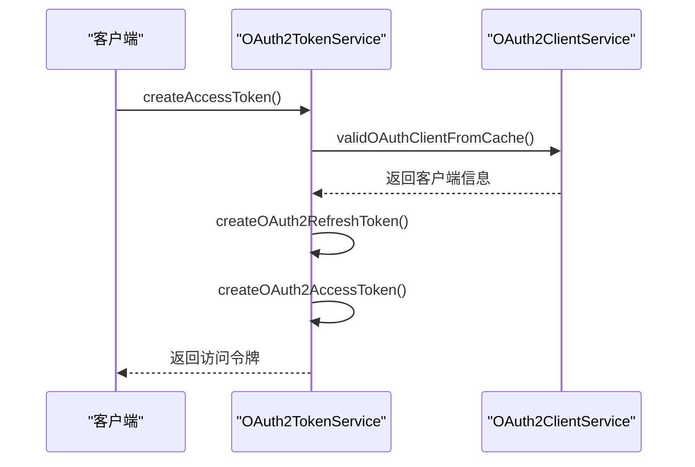

**流程来源**
- [OAuth2TokenServiceImpl.java](file://yudao-module-system/yudao-module-system-biz/src/main/java/cn/iocoder/yudao/module/system/service/oauth2/OAuth2TokenServiceImpl.java#L53-L61)

### 刷新令牌生成
刷新令牌的生成与访问令牌紧密关联。系统使用 `IdUtil.fastSimpleUUID()` 生成唯一的令牌字符串，并设置基于客户端配置的过期时间。

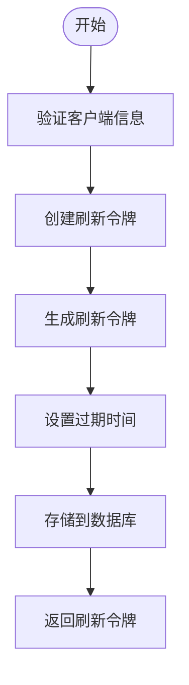

**生成逻辑来源**
- [OAuth2TokenServiceImpl.java](file://yudao-module-system/yudao-module-system-biz/src/main/java/cn/iocoder/yudao/module/system/service/oauth2/OAuth2TokenServiceImpl.java#L154-L160)

## 令牌存储与加密策略

### 双重存储机制
系统采用数据库持久化与 Redis 缓存相结合的双重存储策略，确保令牌数据的可靠性和高性能访问。

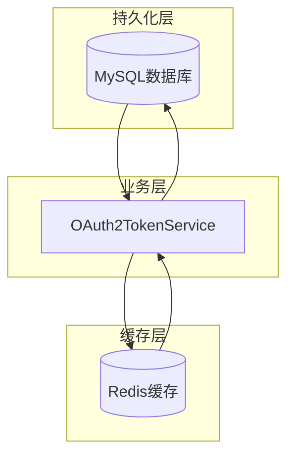

**存储架构来源**
- [OAuth2AccessTokenRedisDAO.java](file://yudao-module-system/yudao-module-system-biz/src/main/java/cn/iocoder/yudao/module/system/dal/redis/oauth2/OAuth2AccessTokenRedisDAO.java#L1-L60)
- [OAuth2AccessTokenMapper.java](file://yudao-module-system/yudao-module-system-biz/src/main/java/cn/iocoder/yudao/module/system/dal/mysql/oauth2/OAuth2AccessTokenMapper.java#L1-L34)

### 数据结构设计
访问令牌和刷新令牌分别由独立的数据对象管理，确保数据结构的清晰和可维护性。

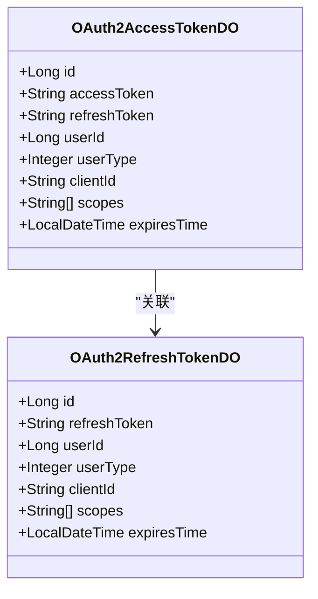

**数据结构来源**
- [OAuth2AccessTokenDO.java](file://yudao-module-system/yudao-module-system-biz/src/main/java/cn/iocoder/yudao/module/system/dal/dataobject/oauth2/OAuth2AccessTokenDO.java#L1-L71)
- [OAuth2RefreshTokenDO.java](file://yudao-module-system/yudao-module-system-biz/src/main/java/cn/iocoder/yudao/module/system/dal/dataobject/oauth2/OAuth2RefreshTokenDO.java#L1-L64)

## 令牌验证与撤销机制

### 令牌验证流程
系统采用优先从 Redis 缓存读取的策略，提高验证性能。如果缓存中不存在，则从数据库查询并更新缓存。

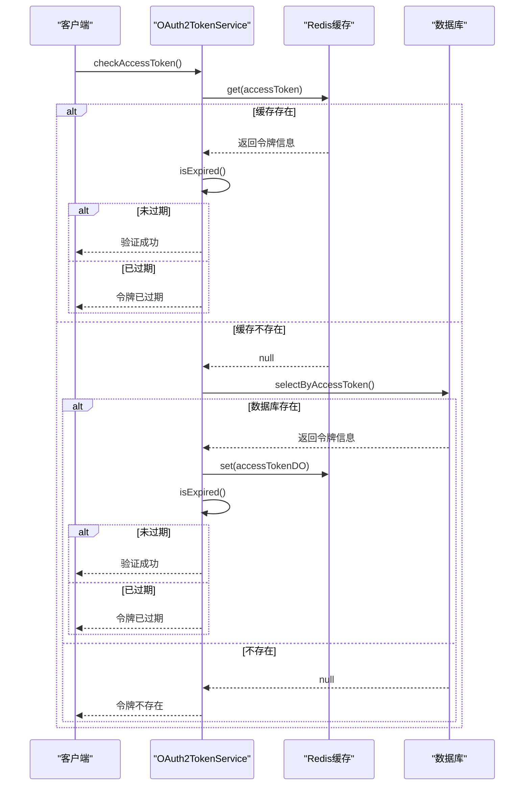

**验证流程来源**
- [OAuth2TokenServiceImpl.java](file://yudao-module-system/yudao-module-system-biz/src/main/java/cn/iocoder/yudao/module/system/service/oauth2/OAuth2TokenServiceImpl.java#L111-L121)

### 令牌撤销机制
撤销操作会同时清理访问令牌和关联的刷新令牌，确保安全性。

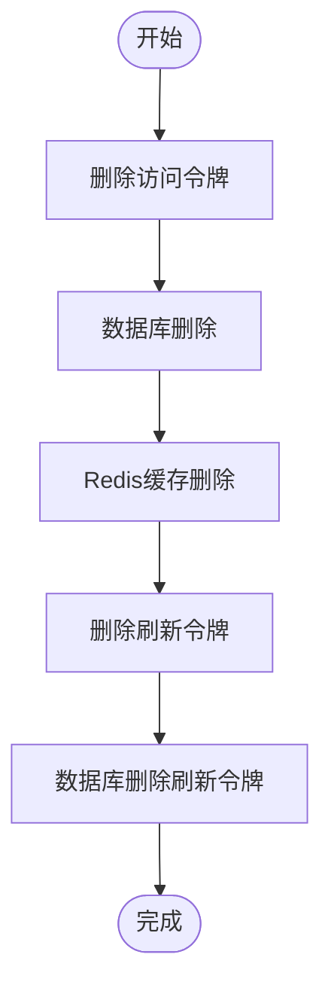

**撤销机制来源**
- [OAuth2TokenServiceImpl.java](file://yudao-module-system/yudao-module-system-biz/src/main/java/cn/iocoder/yudao/module/system/service/oauth2/OAuth2TokenServiceImpl.java#L123-L135)

## Redis分布式管理

### 缓存策略
系统通过 RedisDAO 组件实现对 Redis 的操作封装，采用特定的键值格式存储令牌信息。

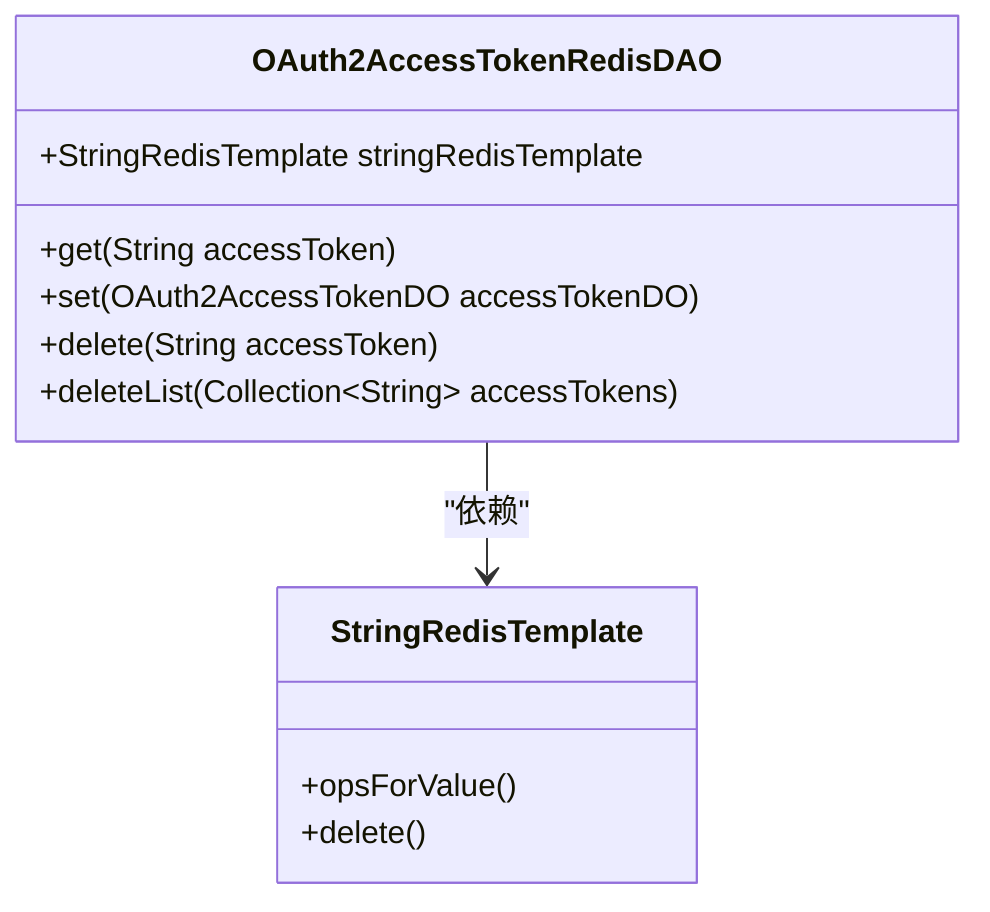

**RedisDAO来源**
- [OAuth2AccessTokenRedisDAO.java](file://yudao-module-system/yudao-module-system-biz/src/main/java/cn/iocoder/yudao/module/system/dal/redis/oauth2/OAuth2AccessTokenRedisDAO.java#L1-L60)

### 键值设计
Redis 键值采用格式化字符串，确保键的唯一性和可读性。

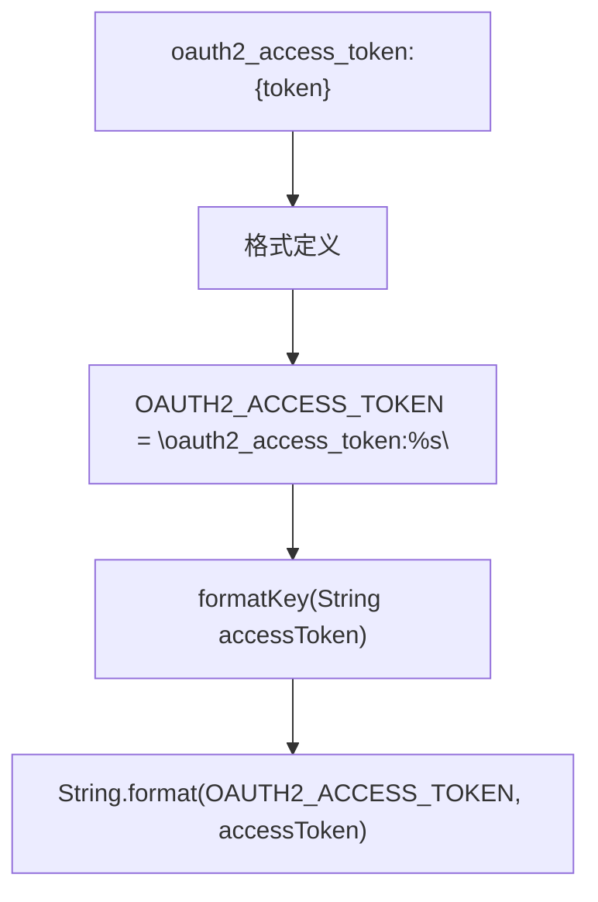

**键值设计来源**
- [RedisKeyConstants.java](file://yudao-module-system/yudao-module-system-biz/src/main/java/cn/iocoder/yudao/module/system/dal/redis/RedisKeyConstants.java#L84)
- [OAuth2AccessTokenRedisDAO.java](file://yudao-module-system/yudao-module-system-biz/src/main/java/cn/iocoder/yudao/module/system/dal/redis/oauth2/OAuth2AccessTokenRedisDAO.java#L30-L32)

## 令牌刷新流程

### 刷新流程
当访问令牌即将过期时，客户端可以使用刷新令牌获取新的访问令牌。

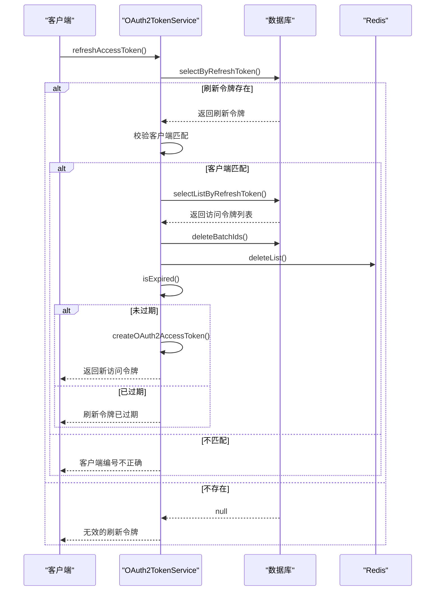

**刷新流程来源**
- [OAuth2TokenServiceImpl.java](file://yudao-module-system/yudao-module-system-biz/src/main/java/cn/iocoder/yudao/module/system/service/oauth2/OAuth2TokenServiceImpl.java#L63-L92)

### 轮换策略
系统在刷新令牌时采用轮换策略，每次刷新都会创建新的访问令牌并删除旧的令牌，提高安全性。

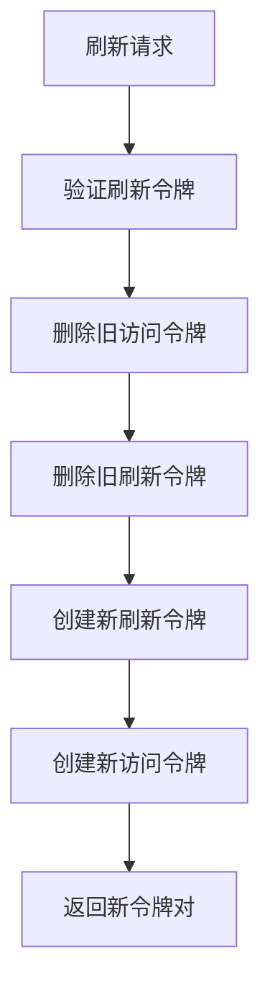

**轮换策略来源**
- [OAuth2TokenServiceImpl.java](file://yudao-module-system/yudao-module-system-biz/src/main/java/cn/iocoder/yudao/module/system/service/oauth2/OAuth2TokenServiceImpl.java#L77-L82)

## JWT用户身份承载

### 信息承载
虽然系统当前使用 UUID 作为令牌标识，但通过 JWT 格式可以承载丰富的用户身份和权限信息。

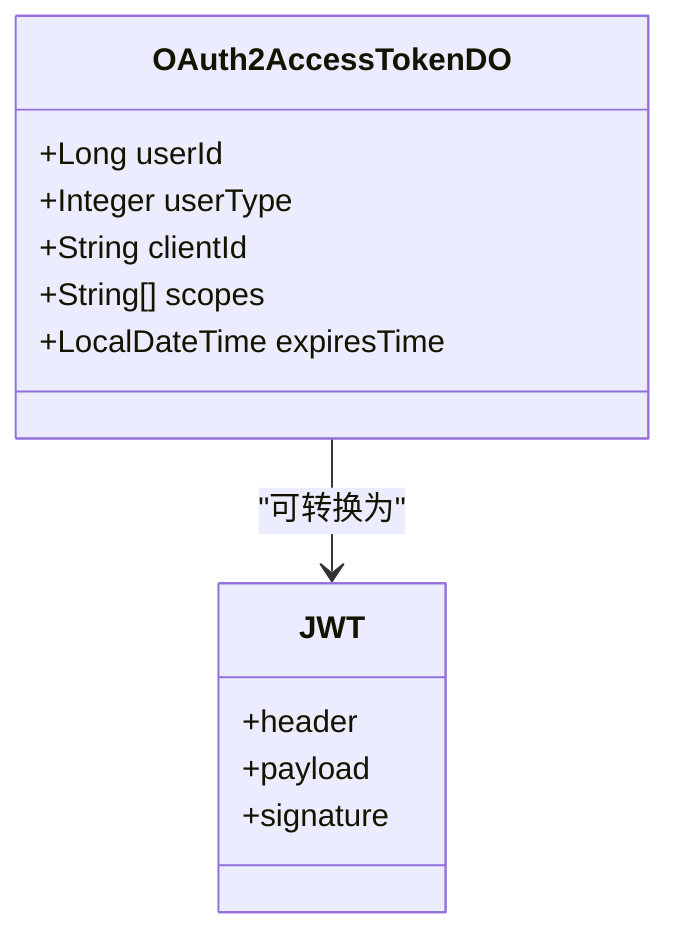

**信息结构来源**
- [OAuth2AccessTokenDO.java](file://yudao-module-system/yudao-module-system-biz/src/main/java/cn/iocoder/yudao/module/system/dal/dataobject/oauth2/OAuth2AccessTokenDO.java#L30-L70)

### 权限管理
通过 scopes 字段实现细粒度的权限控制，支持基于范围的访问控制。

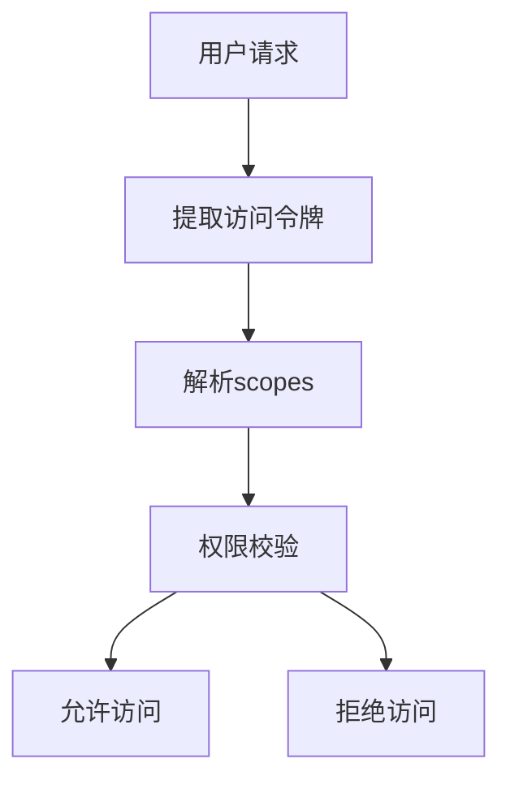

**权限管理来源**
- [OAuth2AccessTokenDO.java](file://yudao-module-system/yudao-module-system-biz/src/main/java/cn/iocoder/yudao/module/system/dal/dataobject/oauth2/OAuth2AccessTokenDO.java#L63-L64)

## 架构流程图

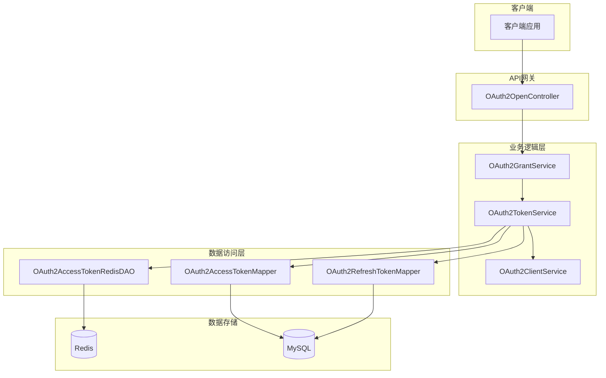

**架构来源**
- [OAuth2OpenController.java](file://yudao-module-system/yudao-module-system-biz/src/main/java/cn/iocoder/yudao/module/system/controller/admin/oauth2/OAuth2OpenController.java#L1-L303)
- [OAuth2TokenServiceImpl.java](file://yudao-module-system/yudao-module-system-biz/src/main/java/cn/iocoder/yudao/module/system/service/oauth2/OAuth2TokenServiceImpl.java#L1-L164)

## 结论
OAuth2TokenService 通过完善的令牌管理机制，为系统提供了安全可靠的认证服务。其核心优势包括：

1. **双重存储策略**：结合 Redis 缓存和 MySQL 持久化，兼顾性能与可靠性
2. **完整的生命周期管理**：覆盖令牌的生成、验证、刷新和撤销全过程
3. **分布式支持**：通过 Redis 实现跨服务的令牌共享和快速失效
4. **安全轮换机制**：刷新时自动清理旧令牌，降低安全风险
5. **灵活的权限控制**：基于 scopes 的细粒度权限管理

该服务的设计充分考虑了性能、安全性和可扩展性，为系统的安全认证提供了坚实的基础。