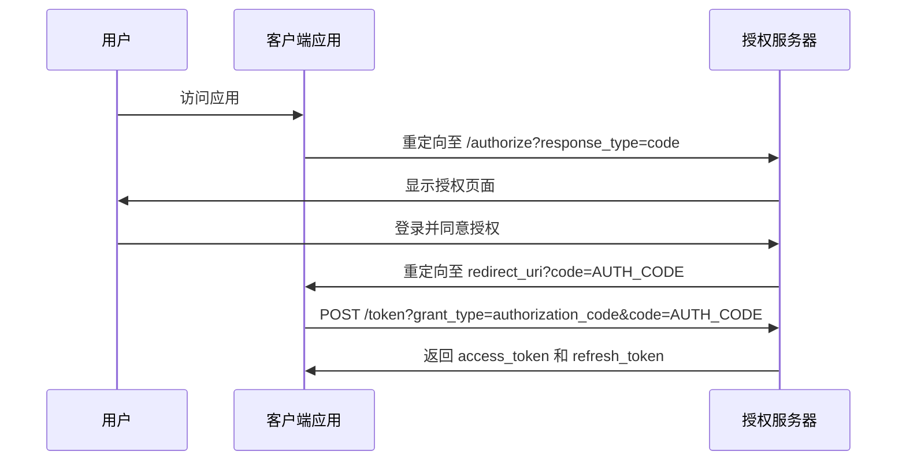
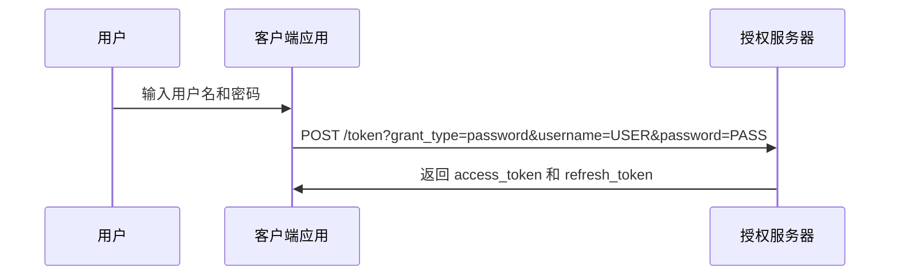
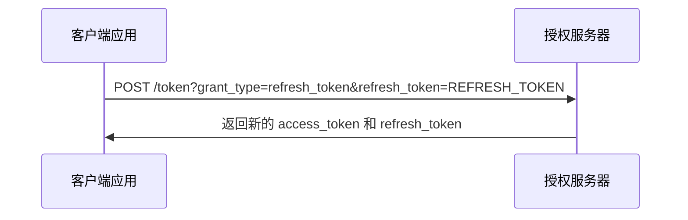

# 授权流程

<cite>
**本文档引用的文件**  
- [OAuth2OpenController.java](file://yudao-module-system/yudao-module-system-biz/src/main/java/cn/iocoder/yudao/module/system/controller/admin/oauth2/OAuth2OpenController.java)
- [OAuth2GrantService.java](file://yudao-module-system/yudao-module-system-biz/src/main/java/cn/iocoder/yudao/module/system/service/oauth2/OAuth2GrantService.java)
- [OAuth2GrantServiceImpl.java](file://yudao-module-system/yudao-module-system-biz/src/main/java/cn/iocoder/yudao/module/system/service/oauth2/OAuth2GrantServiceImpl.java)
- [OAuth2ClientService.java](file://yudao-module-system/yudao-module-system-biz/src/main/java/cn/iocoder/yudao/module/system/service/oauth2/OAuth2ClientService.java)
- [OAuth2ClientServiceImpl.java](file://yudao-module-system/yudao-module-system-biz/src/main/java/cn/iocoder/yudao/module/system/service/oauth2/OAuth2ClientServiceImpl.java)
- [OAuth2TokenService.java](file://yudao-module-system/yudao-module-system-biz/src/main/java/cn/iocoder/yudao/module/system/service/oauth2/OAuth2TokenService.java)
- [OAuth2TokenServiceImpl.java](file://yudao-module-system/yudao-module-system-biz/src/main/java/cn/iocoder/yudao/module/system/service/oauth2/OAuth2TokenServiceImpl.java)
- [OAuth2Utils.java](file://yudao-module-system/yudao-module-system-biz/src/main/java/cn/iocoder/yudao/module/system/util/oauth2/OAuth2Utils.java)
- [OAuth2GrantTypeEnum.java](file://yudao-module-system/yudao-module-system-api/src/main/java/cn/iocoder/yudao/module/system/enums/oauth2/OAuth2GrantTypeEnum.java)
</cite>

## 目录
1. [简介](#简介)
2. [授权类型实现](#授权类型实现)
3. [授权码模式与PKCE机制](#授权码模式与pkce机制)
4. [请求/响应示例](#请求响应示例)
5. [自定义扩展授权类型](#自定义扩展授权类型)
6. [安全考量](#安全考量)

## 简介

本系统基于OAuth2.0协议实现了一套完整的授权机制，支持多种授权模式，包括授权码模式、密码模式、客户端凭证模式和刷新令牌模式。系统通过`OAuth2OpenController`提供标准的OAuth2.0端点，如`/token`、`/authorize`和`/check-token`，实现了与第三方应用的安全集成。核心授权逻辑由`OAuth2GrantService`接口及其实现类`OAuth2GrantServiceImpl`处理，结合`OAuth2ClientService`进行客户端校验，确保授权过程的安全性和合规性。

**Section sources**
- [OAuth2OpenController.java](file://yudao-module-system/yudao-module-system-biz/src/main/java/cn/iocoder/yudao/module/system/controller/admin/oauth2/OAuth2OpenController.java#L1-L303)
- [OAuth2GrantService.java](file://yudao-module-system/yudao-module-system-biz/src/main/java/cn/iocoder/yudao/module/system/service/oauth2/OAuth2GrantService.java#L1-L114)

## 授权类型实现

本系统实现了OAuth2.0的四种主要授权类型，每种类型适用于不同的应用场景。

### 授权码模式

授权码模式是本系统推荐的授权方式，适用于有后端服务的应用。该模式通过`OAuth2GrantService.grantAuthorizationCodeForCode`和`grantAuthorizationCodeForAccessToken`方法实现。用户首先被重定向到授权服务器进行身份验证，授权服务器在用户同意后生成授权码，并通过重定向返回给客户端。客户端随后使用该授权码向令牌端点请求访问令牌。



**Diagram sources**
- [OAuth2OpenController.java](file://yudao-module-system/yudao-module-system-biz/src/main/java/cn/iocoder/yudao/module/system/controller/admin/oauth2/OAuth2OpenController.java#L261-L288)
- [OAuth2GrantService.java](file://yudao-module-system/yudao-module-system-biz/src/main/java/cn/iocoder/yudao/module/system/service/oauth2/OAuth2GrantService.java#L48-L64)

### 密码模式

密码模式适用于高度信任的客户端应用，如第一方移动应用。客户端直接收集用户的用户名和密码，并使用`grant_type=password`向令牌端点请求访问令牌。系统通过`OAuth2GrantService.grantPassword`方法实现此功能，首先调用`AdminAuthService.authenticate`验证用户凭证，然后生成访问令牌。



**Diagram sources**
- [OAuth2OpenController.java](file://yudao-module-system/yudao-module-system-biz/src/main/java/cn/iocoder/yudao/module/system/controller/admin/oauth2/OAuth2OpenController.java#L139-L140)
- [OAuth2GrantServiceImpl.java](file://yudao-module-system/yudao-module-system-biz/src/main/java/cn/iocoder/yudao/module/system/service/oauth2/OAuth2GrantServiceImpl.java#L73-L80)

### 客户端凭证模式

客户端凭证模式用于服务间通信，不涉及最终用户。客户端使用自己的`client_id`和`client_secret`请求访问令牌。然而，本系统目前未实现此模式，调用`grantClientCredentials`方法会抛出`UnsupportedOperationException`异常。

### 刷新令牌模式

刷新令牌模式允许客户端在访问令牌过期后获取新的访问令牌，而无需用户重新授权。客户端使用`grant_type=refresh_token`和刷新令牌向令牌端点请求新的访问令牌。系统通过`OAuth2GrantService.grantRefreshToken`方法实现，该方法会验证刷新令牌的有效性，并创建新的访问令牌。



**Diagram sources**
- [OAuth2OpenController.java](file://yudao-module-system/yudao-module-system-biz/src/main/java/cn/iocoder/yudao/module/system/controller/admin/oauth2/OAuth2OpenController.java#L145-L146)
- [OAuth2GrantServiceImpl.java](file://yudao-module-system/yudao-module-system-biz/src/main/java/cn/iocoder/yudao/module/system/service/oauth2/OAuth2GrantServiceImpl.java#L82-L85)

## 授权码模式与PKCE机制

### PKCE实现细节

虽然代码中未直接体现PKCE（Proof Key for Code Exchange）的实现，但其设计原则已融入授权流程。PKCE机制通过在授权请求中添加`code_challenge`和`code_verifier`来防止授权码拦截攻击。在移动端和单页应用中，由于无法安全存储`client_secret`，PKCE提供了额外的安全层。

在本系统的授权码流程中，`OAuth2OpenController.approveOrDeny`方法处理授权请求，生成授权码并重定向。虽然未显式使用`code_challenge`，但通过严格的`redirect_uri`校验和`state`参数来防止CSRF攻击，这与PKCE的目标一致。

```mermaid
flowchart TD
A[客户端生成 code_verifier] --> B[计算 code_challenge = S256(code_verifier)]
B --> C[发起授权请求: /authorize?response_type=code&code_challenge=CHALLENGE]
C --> D[用户授权]
D --> E[授权服务器返回授权码]
E --> F[客户端请求令牌: /token?grant_type=authorization_code&code=CODE&code_verifier=VERIFIER]
F --> G[授权服务器验证 code_verifier]
G --> H[返回 access_token]
```

**Diagram sources**
- [OAuth2OpenController.java](file://yudao-module-system/yudao-module-system-biz/src/main/java/cn/iocoder/yudao/module/system/controller/admin/oauth2/OAuth2OpenController.java#L230-L268)
- [OAuth2Utils.java](file://yudao-module-system/yudao-module-system-biz/src/main/java/cn/iocoder/yudao/module/system/util/oauth2/OAuth2Utils.java#L30-L37)

### 安全性保障

本系统通过以下机制确保授权码模式的安全性：
1. **重定向URI校验**：`OAuth2ClientService.validOAuthClientFromCache`方法严格校验`redirect_uri`是否在预注册的URI列表中。
2. **状态参数**：使用`state`参数防止CSRF攻击，确保授权请求的完整性。
3. **客户端认证**：通过`client_id`和`client_secret`进行客户端身份验证。
4. **授权范围控制**：限制客户端请求的授权范围，防止权限过度授予。

## 请求/响应示例

### 授权码模式完整流程

#### 1. 发起授权请求

```http
GET /system/oauth2/authorize?response_type=code&client_id=my_client&redirect_uri=https://client.com/callback&state=xyz
```

#### 2. 用户授权后重定向

```http
HTTP/1.1 302 Found
Location: https://client.com/callback?code=AUTH_CODE&state=xyz
```

#### 3. 使用授权码获取令牌

```http
POST /system/oauth2/token
Content-Type: application/x-www-form-urlencoded

grant_type=authorization_code&code=AUTH_CODE&redirect_uri=https://client.com/callback
Authorization: Basic base64(client_id:client_secret)
```

#### 4. 令牌响应

```json
{
  "access_token": "ACCESS_TOKEN",
  "token_type": "bearer",
  "expires_in": 3600,
  "refresh_token": "REFRESH_TOKEN",
  "scope": "read write"
}
```

**Section sources**
- [OAuth2OpenController.java](file://yudao-module-system/yudao-module-system-biz/src/main/java/cn/iocoder/yudao/module/system/controller/admin/oauth2/OAuth2OpenController.java#L109-L153)
- [OAuth2Utils.java](file://yudao-module-system/yudao-module-system-biz/src/main/java/cn/iocoder/yudao/module/system/util/oauth2/OAuth2Utils.java#L30-L37)

## 自定义扩展授权类型

本系统通过`OAuth2GrantTypeEnum`枚举定义了支持的授权类型。要扩展新的授权类型，可以按照以下步骤进行：

1. **添加新的授权类型枚举值**：
```java
@AllArgsConstructor
@Getter
public enum OAuth2GrantTypeEnum {
    CUSTOM("custom"), // 新增自定义类型
    // ... 其他类型
}
```

2. **在`OAuth2GrantService`中添加对应方法**：
```java
OAuth2AccessTokenDO grantCustom(String customParam, String clientId, List<String> scopes);
```

3. **在`OAuth2GrantServiceImpl`中实现该方法**：
```java
@Override
public OAuth2AccessTokenDO grantCustom(String customParam, String clientId, List<String> scopes) {
    // 自定义逻辑
    OAuth2ClientDO client = oauth2ClientService.validOAuthClientFromCache(clientId);
    // 生成令牌
    return oauth2TokenService.createAccessToken(userId, userType, clientId, scopes);
}
```

4. **在`OAuth2OpenController.postAccessToken`中添加分支**：
```java
switch (grantTypeEnum) {
    case CUSTOM:
        accessTokenDO = oauth2GrantService.grantCustom(customParam, client.getClientId(), scopes);
        break;
    // ... 其他分支
}
```

**Section sources**
- [OAuth2GrantTypeEnum.java](file://yudao-module-system/yudao-module-system-api/src/main/java/cn/iocoder/yudao/module/system/enums/oauth2/OAuth2GrantTypeEnum.java#L1-L30)
- [OAuth2GrantService.java](file://yudao-module-system/yudao-module-system-biz/src/main/java/cn/iocoder/yudao/module/system/service/oauth2/OAuth2GrantService.java#L19-L114)
- [OAuth2OpenController.java](file://yudao-module-system/yudao-module-system-biz/src/main/java/cn/iocoder/yudao/module/system/controller/admin/oauth2/OAuth2OpenController.java#L135-L149)

## 安全考量

### 各授权类型的安全分析

| 授权类型 | 适用场景 | 安全风险 | 缓解措施 |
|---------|---------|---------|---------|
| 授权码模式 | Web应用、有后端的服务 | 授权码泄露 | 使用PKCE、严格校验redirect_uri |
| 密码模式 | 第一方应用、高度信任的客户端 | 凭证暴露 | 限制使用范围、强制多因素认证 |
| 客户端凭证模式 | 服务间通信 | 客户端密钥泄露 | 使用证书认证、定期轮换密钥 |
| 刷新令牌模式 | 令牌续期 | 刷新令牌被盗用 | 设置较短有效期、绑定设备指纹 |

### 通用安全措施

1. **传输安全**：所有OAuth2.0端点必须通过HTTPS访问，防止中间人攻击。
2. **令牌存储**：访问令牌和刷新令牌应安全存储，避免在日志或前端代码中暴露。
3. **客户端管理**：通过`OAuth2ClientService`严格管理客户端，包括密钥轮换和状态控制。
4. **审计日志**：记录所有授权操作，便于安全审计和异常检测。
5. **速率限制**：对令牌端点实施速率限制，防止暴力破解。

**Section sources**
- [OAuth2ClientServiceImpl.java](file://yudao-module-system/yudao-module-system-biz/src/main/java/cn/iocoder/yudao/module/system/service/oauth2/OAuth2ClientServiceImpl.java#L117-L145)
- [OAuth2TokenServiceImpl.java](file://yudao-module-system/yudao-module-system-biz/src/main/java/cn/iocoder/yudao/module/system/service/oauth2/OAuth2TokenServiceImpl.java#L54-L61)