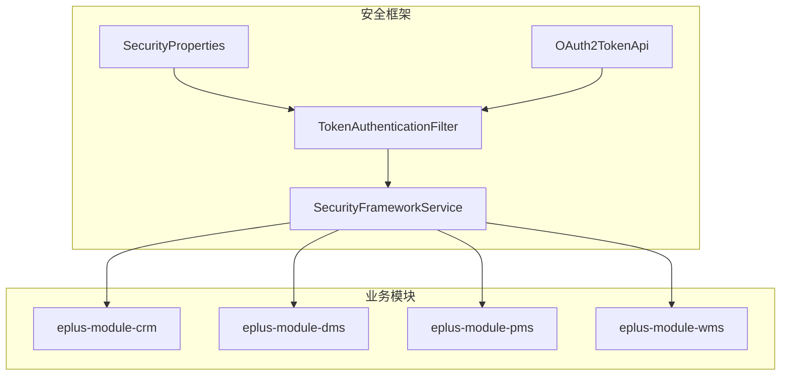
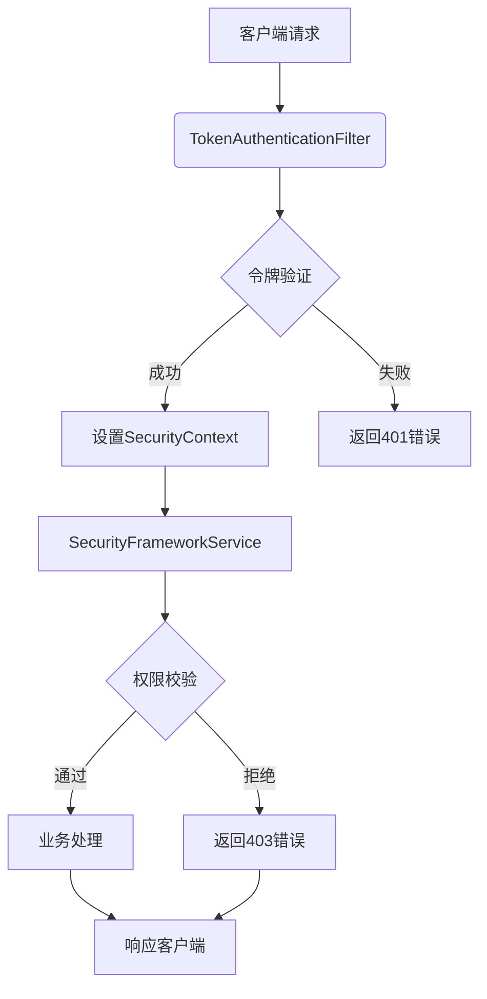
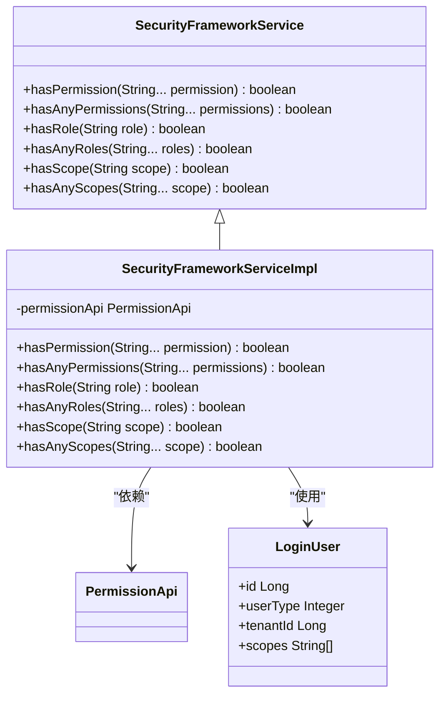
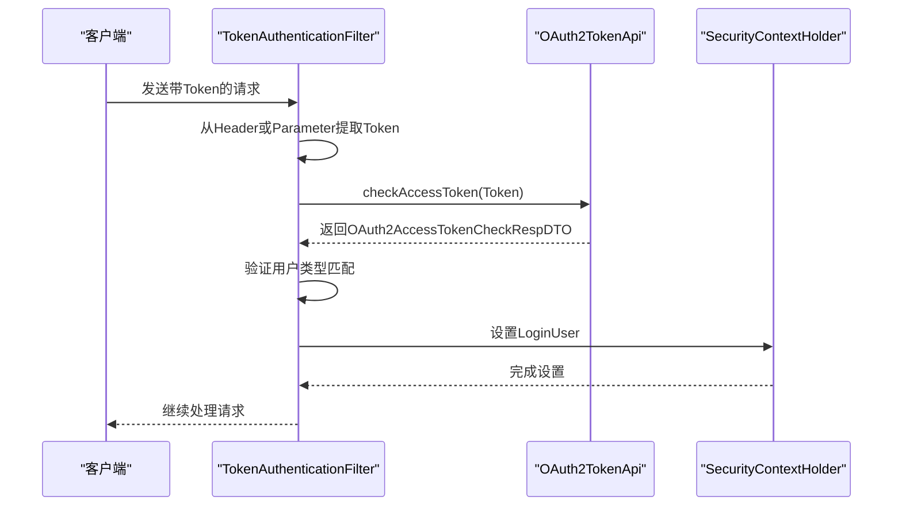
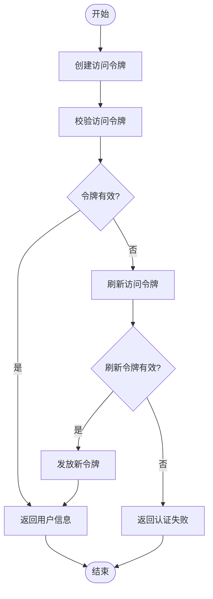
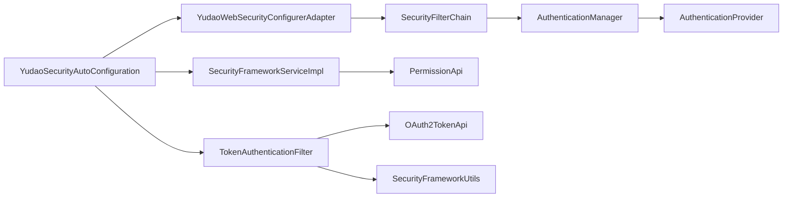

# 认证与授权

<cite>
**本文档引用的文件**  
- [SecurityFrameworkService.java](file://yudao-framework/yudao-spring-boot-starter-security/src/main/java/cn/iocoder/yudao/framework/security/core/service/SecurityFrameworkService.java)
- [SecurityFrameworkServiceImpl.java](file://yudao-framework/yudao-spring-boot-starter-security/src/main/java/cn/iocoder/yudao/framework/security/core/service/SecurityFrameworkServiceImpl.java)
- [YudaoSecurityAutoConfiguration.java](file://yudao-framework/yudao-spring-boot-starter-security/src/main/java/cn/iocoder/yudao/framework/security/config/YudaoSecurityAutoConfiguration.java)
- [YudaoWebSecurityConfigurerAdapter.java](file://yudao-framework/yudao-spring-boot-starter-security/src/main/java/cn/iocoder/yudao/framework/security/config/YudaoWebSecurityConfigurerAdapter.java)
- [TokenAuthenticationFilter.java](file://yudao-framework/yudao-spring-boot-starter-security/src/main/java/cn/iocoder/yudao/framework/security/core/filter/TokenAuthenticationFilter.java)
- [SecurityProperties.java](file://yudao-framework/yudao-spring-boot-starter-security/src/main/java/cn/iocoder/yudao/framework/security/config/SecurityProperties.java)
- [SecurityFrameworkUtils.java](file://yudao-framework/yudao-spring-boot-starter-security/src/main/java/cn/iocoder/yudao/framework/security/core/util/SecurityFrameworkUtils.java)
- [OAuth2TokenApi.java](file://yudao-module-system/yudao-module-system-api/src/main/java/cn/iocoder/yudao/module/system/api/oauth2/OAuth2TokenApi.java)
- [OAuth2AccessTokenCreateReqDTO.java](file://yudao-module-system/yudao-module-system-api/src/main/java/cn/iocoder/yudao/module/system/api/oauth2/dto/OAuth2AccessTokenCreateReqDTO.java)
- [OAuth2AccessTokenRespDTO.java](file://yudao-module-system/yudao-module-system-api/src/main/java/cn/iocoder/yudao/module/system/api/oauth2/dto/OAuth2AccessTokenRespDTO.java)
- [OAuth2AccessTokenCheckRespDTO.java](file://yudao-module-system/yudao-module-system-api/src/main/java/cn/iocoder/yudao/module/system/api/oauth2/dto/OAuth2AccessTokenCheckRespDTO.java)
- [PreAuthenticated.java](file://yudao-framework/yudao-spring-boot-starter-security/src/main/java/cn/iocoder/yudao/framework/security/core/annotations/PreAuthenticated.java)
</cite>

## 目录
1. [简介](#简介)
2. [项目结构](#项目结构)
3. [核心组件](#核心组件)
4. [架构概述](#架构概述)
5. [详细组件分析](#详细组件分析)
6. [依赖分析](#依赖分析)
7. [性能考虑](#性能考虑)
8. [故障排除指南](#故障排除指南)
9. [结论](#结论)
10. [附录](#附录)（如有必要）

## 简介
本文档详细描述了基于Spring Security的认证与授权实现机制。重点涵盖用户登录流程、JWT令牌生成与验证、权限校验逻辑、角色管理机制以及SecurityFrameworkService的核心功能和配置选项。文档还详细说明了OAuth2.0集成的具体实现，包括令牌发放、刷新和撤销流程。同时提供权限注解（@PreAuthorize）的使用示例和最佳实践，包含多租户环境下的安全隔离实现方案，并为开发者提供自定义认证方式的扩展指南。

## 项目结构
本项目采用模块化设计，安全框架主要位于`yudao-framework`模块下的`yudao-spring-boot-starter-security`组件中。该组件提供了完整的认证与授权解决方案，通过Spring Security实现，并与OAuth2.0协议集成。系统架构分为API接口层、业务逻辑层和基础设施层，安全框架作为基础设施服务被各业务模块调用。



**图示来源**
- [SecurityProperties.java](file://yudao-framework/yudao-spring-boot-starter-security/src/main/java/cn/iocoder/yudao/framework/security/config/SecurityProperties.java)
- [SecurityFrameworkService.java](file://yudao-framework/yudao-spring-boot-starter-security/src/main/java/cn/iocoder/yudao/framework/security/core/service/SecurityFrameworkService.java)
- [TokenAuthenticationFilter.java](file://yudao-framework/yudao-spring-boot-starter-security/src/main/java/cn/iocoder/yudao/framework/security/core/filter/TokenAuthenticationFilter.java)
- [OAuth2TokenApi.java](file://yudao-module-system/yudao-module-system-api/src/main/java/cn/iocoder/yudao/module/system/api/oauth2/OAuth2TokenApi.java)

**章节来源**
- [SecurityProperties.java](file://yudao-framework/yudao-spring-boot-starter-security/src/main/java/cn/iocoder/yudao/framework/security/config/SecurityProperties.java)
- [SecurityFrameworkService.java](file://yudao-framework/yudao-spring-boot-starter-security/src/main/java/cn/iocoder/yudao/framework/security/core/service/SecurityFrameworkService.java)

## 核心组件

本文档的核心组件包括SecurityFrameworkService接口及其实现类、TokenAuthenticationFilter过滤器、OAuth2TokenApi接口以及相关的DTO对象。这些组件共同构成了系统的认证与授权体系。SecurityFrameworkService提供了权限校验的核心方法，TokenAuthenticationFilter负责JWT令牌的验证，OAuth2TokenApi处理OAuth2.0协议相关的令牌操作。

**章节来源**
- [SecurityFrameworkService.java](file://yudao-framework/yudao-spring-boot-starter-security/src/main/java/cn/iocoder/yudao/framework/security/core/service/SecurityFrameworkService.java)
- [SecurityFrameworkServiceImpl.java](file://yudao-framework/yudao-spring-boot-starter-security/src/main/java/cn/iocoder/yudao/framework/security/core/service/SecurityFrameworkServiceImpl.java)
- [TokenAuthenticationFilter.java](file://yudao-framework/yudao-spring-boot-starter-security/src/main/java/cn/iocoder/yudao/framework/security/core/filter/TokenAuthenticationFilter.java)
- [OAuth2TokenApi.java](file://yudao-module-system/yudao-module-system-api/src/main/java/cn/iocoder/yudao/module/system/api/oauth2/OAuth2TokenApi.java)

## 架构概述

系统采用基于Spring Security的认证与授权架构，结合OAuth2.0协议实现安全控制。整体架构分为安全配置层、认证过滤层、服务接口层和数据传输层。安全配置层通过YudaoSecurityAutoConfiguration和YudaoWebSecurityConfigurerAdapter进行配置；认证过滤层由TokenAuthenticationFilter实现JWT令牌验证；服务接口层提供SecurityFrameworkService进行权限校验；数据传输层定义了OAuth2.0相关的DTO对象用于跨服务通信。



**图示来源**
- [TokenAuthenticationFilter.java](file://yudao-framework/yudao-spring-boot-starter-security/src/main/java/cn/iocoder/yudao/framework/security/core/filter/TokenAuthenticationFilter.java)
- [SecurityFrameworkService.java](file://yudao-framework/yudao-spring-boot-starter-security/src/main/java/cn/iocoder/yudao/framework/security/core/service/SecurityFrameworkService.java)

## 详细组件分析

### SecurityFrameworkService分析
SecurityFrameworkService是权限校验的核心服务接口，定义了权限、角色和授权范围的校验方法。其实现类SecurityFrameworkServiceImpl通过调用远程PermissionApi进行实际的权限判断，并利用LoginUser对象中的信息进行本地校验。

#### 类图


**图示来源**
- [SecurityFrameworkService.java](file://yudao-framework/yudao-spring-boot-starter-security/src/main/java/cn/iocoder/yudao/framework/security/core/service/SecurityFrameworkService.java)
- [SecurityFrameworkServiceImpl.java](file://yudao-framework/yudao-spring-boot-starter-security/src/main/java/cn/iocoder/yudao/framework/security/core/service/SecurityFrameworkServiceImpl.java)
- [LoginUser.java](file://yudao-framework/yudao-spring-boot-starter-security/src/main/java/cn/iocoder/yudao/framework/security/core/LoginUser.java)

### Token认证流程分析
TokenAuthenticationFilter是整个认证流程的核心过滤器，负责从HTTP请求中提取JWT令牌并进行验证。验证通过后，将用户信息设置到Spring Security上下文中，供后续的权限校验使用。

#### 序列图


**图示来源**
- [TokenAuthenticationFilter.java](file://yudao-framework/yudao-spring-boot-starter-security/src/main/java/cn/iocoder/yudao/framework/security/core/filter/TokenAuthenticationFilter.java)
- [OAuth2TokenApi.java](file://yudao-module-system/yudao-module-system-api/src/main/java/cn/iocoder/yudao/module/system/api/oauth2/OAuth2TokenApi.java)
- [SecurityFrameworkUtils.java](file://yudao-framework/yudao-spring-boot-starter-security/src/main/java/cn/iocoder/yudao/framework/security/core/util/SecurityFrameworkUtils.java)

### OAuth2.0集成分析
OAuth2.0集成通过OAuth2TokenApi接口实现，提供了令牌创建、校验、刷新和撤销等完整功能。系统采用标准的OAuth2.0协议，支持多种授权模式。

#### 流程图


**图示来源**
- [OAuth2TokenApi.java](file://yudao-module-system/yudao-module-system-api/src/main/java/cn/iocoder/yudao/module/system/api/oauth2/OAuth2TokenApi.java)
- [OAuth2AccessTokenCreateReqDTO.java](file://yudao-module-system/yudao-module-system-api/src/main/java/cn/iocoder/yudao/module/system/api/oauth2/dto/OAuth2AccessTokenCreateReqDTO.java)
- [OAuth2AccessTokenRespDTO.java](file://yudao-module-system/yudao-module-system-api/src/main/java/cn/iocoder/yudao/module/system/api/oauth2/dto/OAuth2AccessTokenRespDTO.java)

**章节来源**
- [OAuth2TokenApi.java](file://yudao-module-system/yudao-module-system-api/src/main/java/cn/iocoder/yudao/module/system/api/oauth2/OAuth2TokenApi.java)
- [OAuth2AccessTokenCreateReqDTO.java](file://yudao-module-system/yudao-module-system-api/src/main/java/cn/iocoder/yudao/module/system/api/oauth2/dto/OAuth2AccessTokenCreateReqDTO.java)
- [OAuth2AccessTokenRespDTO.java](file://yudao-module-system/yudao-module-system-api/src/main/java/cn/iocoder/yudao/module/system/api/oauth2/dto/OAuth2AccessTokenRespDTO.java)

## 依赖分析

系统安全框架的依赖关系清晰，各组件职责分明。核心依赖包括Spring Security基础组件、OAuth2.0协议实现、权限校验服务和配置管理。通过合理的依赖注入，确保了组件间的松耦合和高内聚。



**图示来源**
- [YudaoSecurityAutoConfiguration.java](file://yudao-framework/yudao-spring-boot-starter-security/src/main/java/cn/iocoder/yudao/framework/security/config/YudaoSecurityAutoConfiguration.java)
- [YudaoWebSecurityConfigurerAdapter.java](file://yudao-framework/yudao-spring-boot-starter-security/src/main/java/cn/iocoder/yudao/framework/security/config/YudaoWebSecurityConfigurerAdapter.java)
- [TokenAuthenticationFilter.java](file://yudao-framework/yudao-spring-boot-starter-security/src/main/java/cn/iocoder/yudao/framework/security/core/filter/TokenAuthenticationFilter.java)

**章节来源**
- [YudaoSecurityAutoConfiguration.java](file://yudao-framework/yudao-spring-boot-starter-security/src/main/java/cn/iocoder/yudao/framework/security/config/YudaoSecurityAutoConfiguration.java)
- [YudaoWebSecurityConfigurerAdapter.java](file://yudao-framework/yudao-spring-boot-starter-security/src/main/java/cn/iocoder/yudao/framework/security/config/YudaoWebSecurityConfigurerAdapter.java)

## 性能考虑

在性能方面，系统采用了多项优化措施。首先，通过缓存机制减少对数据库的频繁访问；其次，使用轻量级的JWT令牌避免服务器端会话存储；再次，采用异步处理方式提高响应速度；最后，通过合理的索引设计和查询优化确保权限校验的高效性。此外，系统还支持模拟登录功能，方便开发调试，但在生产环境中应关闭此功能以确保安全。

## 故障排除指南

### 常见问题及解决方案
1. **令牌验证失败**：检查令牌是否过期，确认客户端和服务端时间同步，验证用户类型是否匹配。
2. **权限校验不通过**：确认用户是否拥有相应权限，检查角色配置是否正确，验证租户隔离设置。
3. **跨域请求被拒绝**：确保CORS配置正确，检查请求头中是否包含必要的认证信息。
4. **刷新令牌无效**：确认刷新令牌未过期，检查客户端ID是否匹配，验证用户状态是否正常。

**章节来源**
- [TokenAuthenticationFilter.java](file://yudao-framework/yudao-spring-boot-starter-security/src/main/java/cn/iocoder/yudao/framework/security/core/filter/TokenAuthenticationFilter.java)
- [SecurityFrameworkServiceImpl.java](file://yudao-framework/yudao-spring-boot-starter-security/src/main/java/cn/iocoder/yudao/framework/security/core/service/SecurityFrameworkServiceImpl.java)

## 结论

本文档详细阐述了基于Spring Security的认证与授权实现机制。系统通过模块化设计，将安全功能封装为可复用的组件，提高了代码的可维护性和可扩展性。采用OAuth2.0协议实现了标准化的认证流程，结合JWT令牌提供了无状态的会话管理。通过SecurityFrameworkService接口抽象了权限校验逻辑，使得业务代码可以专注于核心功能开发。整体架构设计合理，既保证了系统的安全性，又兼顾了性能和可扩展性。

## 附录

### 配置选项说明
| 配置项 | 描述 | 默认值 |
|-------|------|-------|
| yudao.security.tokenHeader | HTTP请求中令牌的Header名称 | Authorization |
| yudao.security.tokenParameter | HTTP请求中令牌的参数名称 | token |
| yudao.security.mockEnable | 模拟登录功能开关 | false |
| yudao.security.mockSecret | 模拟登录密钥 | test |
| yudao.security.permitAllUrls | 免登录URL列表 | 空列表 |
| yudao.security.passwordEncoderLength | 密码编码器复杂度 | 4 |

### 权限注解使用示例
```java
// 需要登录才能访问
@PreAuthenticated
public void securedMethod() {
    // 业务逻辑
}

// 基于表达式的权限控制
@PreAuthorize("hasPermission('system:user:create')")
public void createUser() {
    // 创建用户逻辑
}

// 多角色访问控制
@PreAuthorize("hasAnyRoles('ADMIN', 'SUPERVISOR')")
public void adminOrSupervisorMethod() {
    // 管理员或主管可访问的方法
}
```

**章节来源**
- [PreAuthenticated.java](file://yudao-framework/yudao-spring-boot-starter-security/src/main/java/cn/iocoder/yudao/framework/security/core/annotations/PreAuthenticated.java)
- [SecurityFrameworkService.java](file://yudao-framework/yudao-spring-boot-starter-security/src/main/java/cn/iocoder/yudao/framework/security/core/service/SecurityFrameworkService.java)