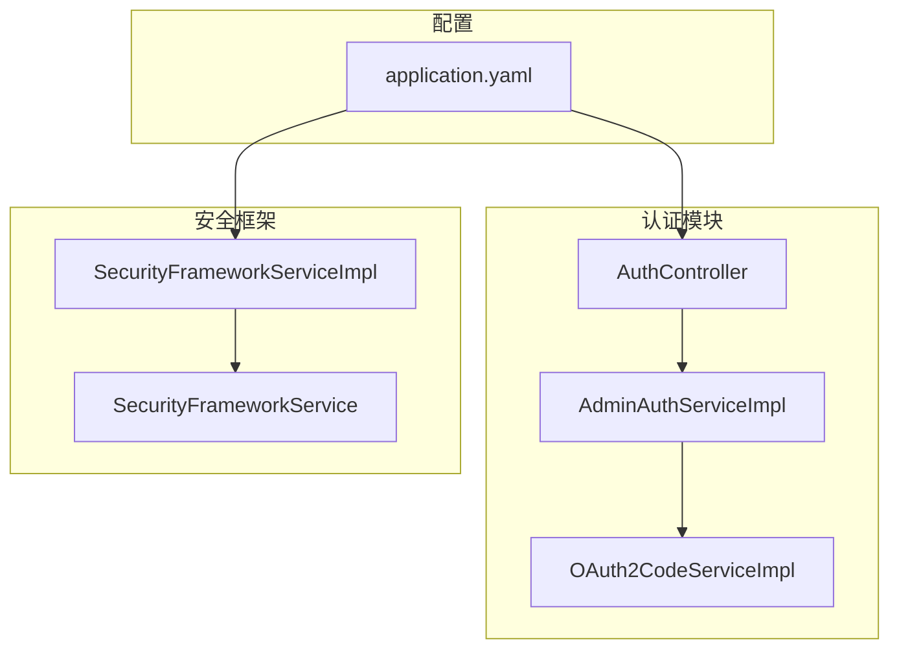
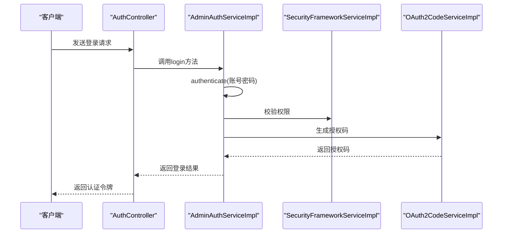
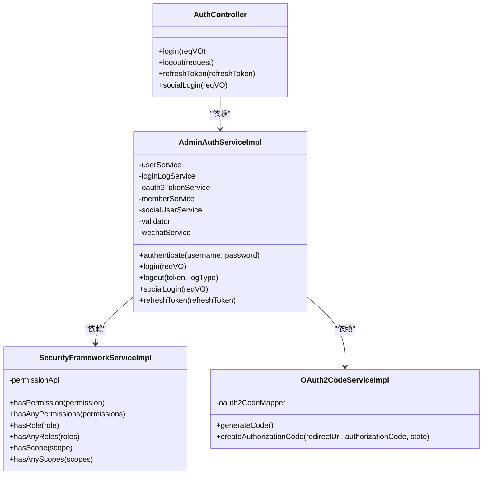
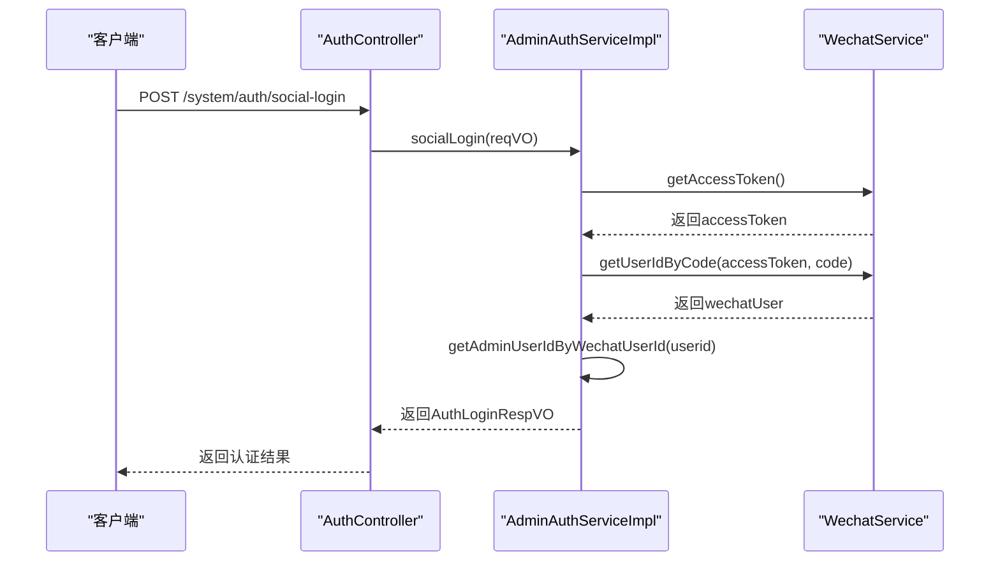
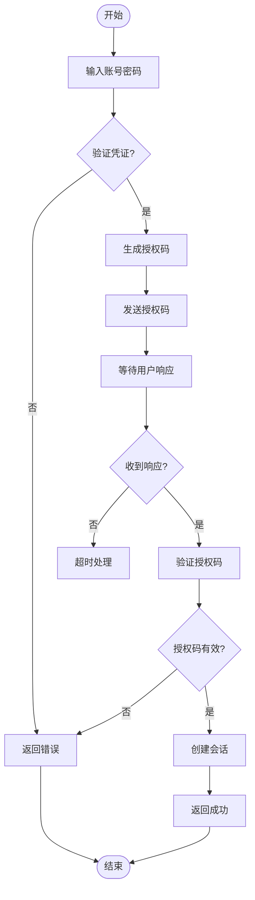
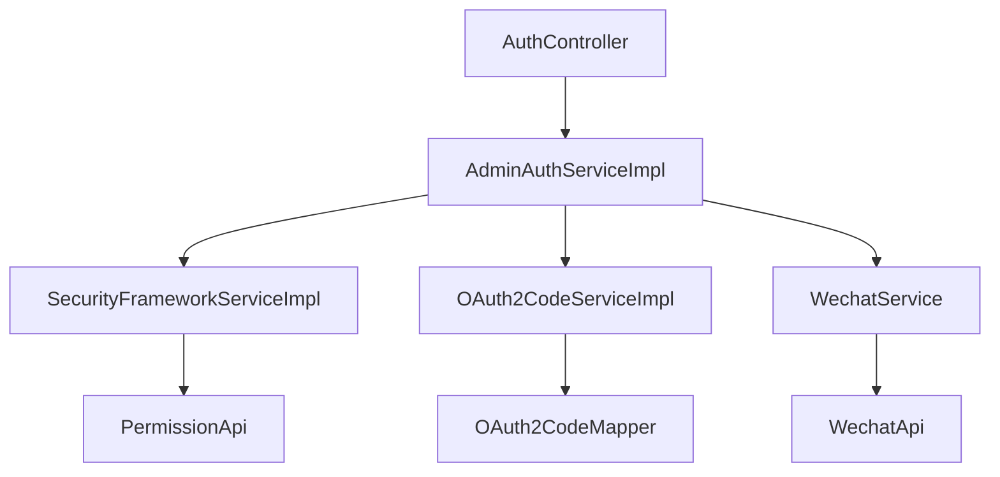

# 多因素认证

<cite>
**本文档引用的文件**   
- [AuthController.java](file://yudao-module-system/yudao-module-system-biz/src/main/java/cn/iocoder/yudao/module/system/controller/admin/auth/AuthController.java)
- [AdminAuthServiceImpl.java](file://yudao-module-system/yudao-module-system-biz/src/main/java/cn/iocoder/yudao/module/system/service/auth/AdminAuthServiceImpl.java)
- [SecurityFrameworkServiceImpl.java](file://yudao-framework/yudao-spring-boot-starter-security/src/main/java/cn/iocoder/yudao/framework/security/core/service/SecurityFrameworkServiceImpl.java)
- [application.yaml](file://yudao-server/src/main/resources/application.yaml)
- [OAuth2CodeServiceImpl.java](file://yudao-module-system/yudao-module-system-biz/src/main/java/cn/iocoder/yudao/module/system/service/oauth2/OAuth2CodeServiceImpl.java)
- [WechatService.java](file://eplus-module-social/src/main/java/com/syj/eplus/module/wechat/service/WechatService.java)
</cite>

## 目录
1. [简介](#简介)
2. [项目结构](#项目结构)
3. [核心组件](#核心组件)
4. [架构概述](#架构概述)
5. [详细组件分析](#详细组件分析)
6. [依赖分析](#依赖分析)
7. [性能考虑](#性能考虑)
8. [故障排除指南](#故障排除指南)
9. [结论](#结论)
10. [附录](#附录)（如有必要）

## 简介
本文档详细描述了项目中实现的多因素认证（MFA）流程。重点阐述了第二因素（如短信验证码、邮箱验证码、TOTP动态口令）的生成、发送、验证和有效期管理机制。文档解释了SecurityFrameworkService如何协调主因素（密码）和第二因素的认证流程，包括状态管理和会话处理。同时提供了多种第二因素实现方式的配置选项和代码示例，并包含安全策略，如验证码的防刷机制、尝试次数限制、过期时间设置。最后，为开发者提供集成自定义第二因素（如生物识别、硬件令牌）的扩展接口和实现指南。

## 项目结构
本项目采用模块化设计，多因素认证功能主要分布在`yudao-module-system`和`yudao-framework`模块中。核心认证逻辑位于`yudao-module-system-biz`模块的`service/auth`包下，而安全框架服务则位于`yudao-framework`模块的`security`包中。配置文件`application.yaml`位于`yudao-server`模块，用于配置验证码相关参数。

**图表来源**
- [AuthController.java](file://yudao-module-system/yudao-module-system-biz/src/main/java/cn/iocoder/yudao/module/system/controller/admin/auth/AuthController.java)
- [AdminAuthServiceImpl.java](file://yudao-module-system/yudao-module-system-biz/src/main/java/cn/iocoder/yudao/module/system/service/auth/AdminAuthServiceImpl.java)
- [OAuth2CodeServiceImpl.java](file://yudao-module-system/yudao-module-system-biz/src/main/java/cn/iocoder/yudao/module/system/service/oauth2/OAuth2CodeServiceImpl.java)
- [SecurityFrameworkService.java](file://yudao-framework/yudao-spring-boot-starter-security/src/main/java/cn/iocoder/yudao/framework/security/core/service/SecurityFrameworkService.java)
- [SecurityFrameworkServiceImpl.java](file://yudao-framework/yudao-spring-boot-starter-security/src/main/java/cn/iocoder/yudao/framework/security/core/service/SecurityFrameworkServiceImpl.java)
- [application.yaml](file://yudao-server/src/main/resources/application.yaml)

**章节来源**
- [AuthController.java](file://yudao-module-system/yudao-module-system-biz/src/main/java/cn/iocoder/yudao/module/system/controller/admin/auth/AuthController.java)
- [AdminAuthServiceImpl.java](file://yudao-module-system/yudao-module-system-biz/src/main/java/cn/iocoder/yudao/module/system/service/auth/AdminAuthServiceImpl.java)
- [SecurityFrameworkServiceImpl.java](file://yudao-framework/yudao-spring-boot-starter-security/src/main/java/cn/iocoder/yudao/framework/security/core/service/SecurityFrameworkServiceImpl.java)
- [application.yaml](file://yudao-server/src/main/resources/application.yaml)

## 核心组件
多因素认证的核心组件包括`AuthController`、`AdminAuthServiceImpl`和`SecurityFrameworkServiceImpl`。`AuthController`负责处理认证请求，`AdminAuthServiceImpl`实现具体的认证逻辑，而`SecurityFrameworkServiceImpl`则提供权限校验服务。

**章节来源**
- [AuthController.java](file://yudao-module-system/yudao-module-system-biz/src/main/java/cn/iocoder/yudao/module/system/controller/admin/auth/AuthController.java)
- [AdminAuthServiceImpl.java](file://yudao-module-system/yudao-module-system-biz/src/main/java/cn/iocoder/yudao/module/system/service/auth/AdminAuthServiceImpl.java)
- [SecurityFrameworkServiceImpl.java](file://yudao-framework/yudao-spring-boot-starter-security/src/main/java/cn/iocoder/yudao/framework/security/core/service/SecurityFrameworkServiceImpl.java)

## 架构概述
系统采用基于OAuth2的认证架构，通过`SecurityFrameworkService`协调主因素和第二因素的认证流程。用户首先通过账号密码进行主因素认证，然后通过第二因素（如微信扫码）完成多因素认证。

**图表来源**
- [AuthController.java](file://yudao-module-system/yudao-module-system-biz/src/main/java/cn/iocoder/yudao/module/system/controller/admin/auth/AuthController.java)
- [AdminAuthServiceImpl.java](file://yudao-module-system/yudao-module-system-biz/src/main/java/cn/iocoder/yudao/module/system/service/auth/AdminAuthServiceImpl.java)
- [SecurityFrameworkServiceImpl.java](file://yudao-framework/yudao-spring-boot-starter-security/src/main/java/cn/iocoder/yudao/framework/security/core/service/SecurityFrameworkServiceImpl.java)
- [OAuth2CodeServiceImpl.java](file://yudao-module-system/yudao-module-system-biz/src/main/java/cn/iocoder/yudao/module/system/service/oauth2/OAuth2CodeServiceImpl.java)

## 详细组件分析
### 认证流程分析
#### 对象导向组件

**图表来源**
- [AuthController.java](file://yudao-module-system/yudao-module-system-biz/src/main/java/cn/iocoder/yudao/module/system/controller/admin/auth/AuthController.java)
- [AdminAuthServiceImpl.java](file://yudao-module-system/yudao-module-system-biz/src/main/java/cn/iocoder/yudao/module/system/service/auth/AdminAuthServiceImpl.java)
- [SecurityFrameworkServiceImpl.java](file://yudao-framework/yudao-spring-boot-starter-security/src/main/java/cn/iocoder/yudao/framework/security/core/service/SecurityFrameworkServiceImpl.java)
- [OAuth2CodeServiceImpl.java](file://yudao-module-system/yudao-module-system-biz/src/main/java/cn/iocoder/yudao/module/system/service/oauth2/OAuth2CodeServiceImpl.java)

#### API/服务组件

**图表来源**
- [AuthController.java](file://yudao-module-system/yudao-module-system-biz/src/main/java/cn/iocoder/yudao/module/system/controller/admin/auth/AuthController.java)
- [AdminAuthServiceImpl.java](file://yudao-module-system/yudao-module-system-biz/src/main/java/cn/iocoder/yudao/module/system/service/auth/AdminAuthServiceImpl.java)
- [WechatService.java](file://eplus-module-social/src/main/java/com/syj/eplus/module/wechat/service/WechatService.java)

**章节来源**
- [AuthController.java](file://yudao-module-system/yudao-module-system-biz/src/main/java/cn/iocoder/yudao/module/system/controller/admin/auth/AuthController.java)
- [AdminAuthServiceImpl.java](file://yudao-module-system/yudao-module-system-biz/src/main/java/cn/iocoder/yudao/module/system/service/auth/AdminAuthServiceImpl.java)
- [WechatService.java](file://eplus-module-social/src/main/java/com/syj/eplus/module/wechat/service/WechatService.java)

### 概念概述
多因素认证通过结合主因素（密码）和第二因素（如微信扫码）来提高系统安全性。用户首先通过账号密码登录，然后通过第二因素完成身份验证。

## 依赖分析
系统依赖于`yudao-framework`提供的安全框架服务，以及`eplus-module-social`提供的微信服务。同时，认证流程依赖于数据库存储用户信息和授权码。

**图表来源**
- [AuthController.java](file://yudao-module-system/yudao-module-system-biz/src/main/java/cn/iocoder/yudao/module/system/controller/admin/auth/AuthController.java)
- [AdminAuthServiceImpl.java](file://yudao-module-system/yudao-module-system-biz/src/main/java/cn/iocoder/yudao/module/system/service/auth/AdminAuthServiceImpl.java)
- [SecurityFrameworkServiceImpl.java](file://yudao-framework/yudao-spring-boot-starter-security/src/main/java/cn/iocoder/yudao/framework/security/core/service/SecurityFrameworkServiceImpl.java)
- [OAuth2CodeServiceImpl.java](file://yudao-module-system/yudao-module-system-biz/src/main/java/cn/iocoder/yudao/module/system/service/oauth2/OAuth2CodeServiceImpl.java)
- [WechatService.java](file://eplus-module-social/src/main/java/com/syj/eplus/module/wechat/service/WechatService.java)

**章节来源**
- [AuthController.java](file://yudao-module-system/yudao-module-system-biz/src/main/java/cn/iocoder/yudao/module/system/controller/admin/auth/AuthController.java)
- [AdminAuthServiceImpl.java](file://yudao-module-system/yudao-module-system-biz/src/main/java/cn/iocoder/yudao/module/system/service/auth/AdminAuthServiceImpl.java)
- [SecurityFrameworkServiceImpl.java](file://yudao-framework/yudao-spring-boot-starter-security/src/main/java/cn/iocoder/yudao/framework/security/core/service/SecurityFrameworkServiceImpl.java)
- [OAuth2CodeServiceImpl.java](file://yudao-module-system/yudao-module-system-biz/src/main/java/cn/iocoder/yudao/module/system/service/oauth2/OAuth2CodeServiceImpl.java)
- [WechatService.java](file://eplus-module-social/src/main/java/com/syj/eplus/module/wechat/service/WechatService.java)

## 性能考虑
系统通过Redis缓存授权码和用户信息，减少数据库查询次数，提高认证效率。同时，配置了验证码的防刷机制和请求频率限制，防止恶意攻击。

## 故障排除指南
### 常见问题
1. **登录失败**：检查账号密码是否正确，用户状态是否启用。
2. **授权码无效**：检查授权码是否过期，通常有效期为5分钟。
3. **微信扫码失败**：检查微信服务是否正常，accessToken是否有效。

**章节来源**
- [AdminAuthServiceImpl.java](file://yudao-module-system/yudao-module-system-biz/src/main/java/cn/iocoder/yudao/module/system/service/auth/AdminAuthServiceImpl.java)
- [WechatService.java](file://eplus-module-social/src/main/java/com/syj/eplus/module/wechat/service/WechatService.java)

## 结论
本文档详细描述了多因素认证系统的实现细节，包括认证流程、核心组件、架构设计和安全策略。通过结合主因素和第二因素，系统提供了更高的安全性。开发者可以根据需要扩展第二因素的实现方式，如集成生物识别或硬件令牌。