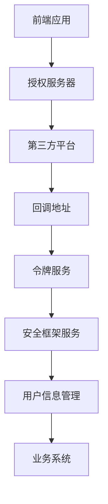
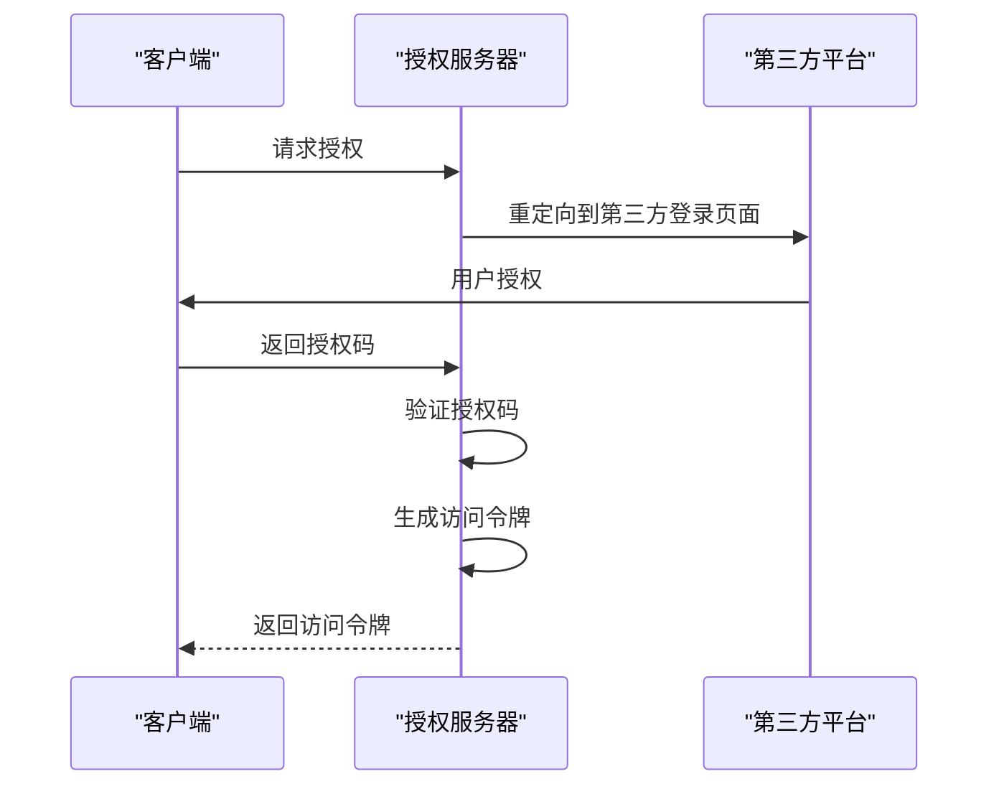
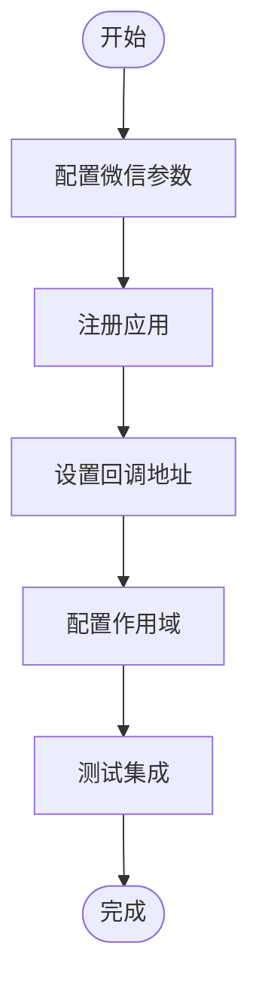
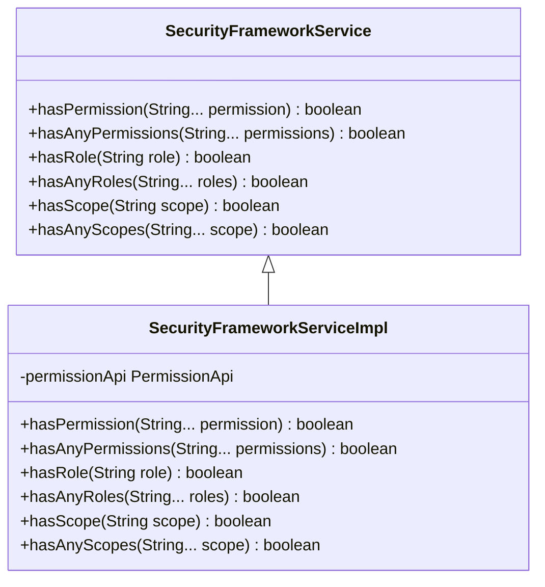
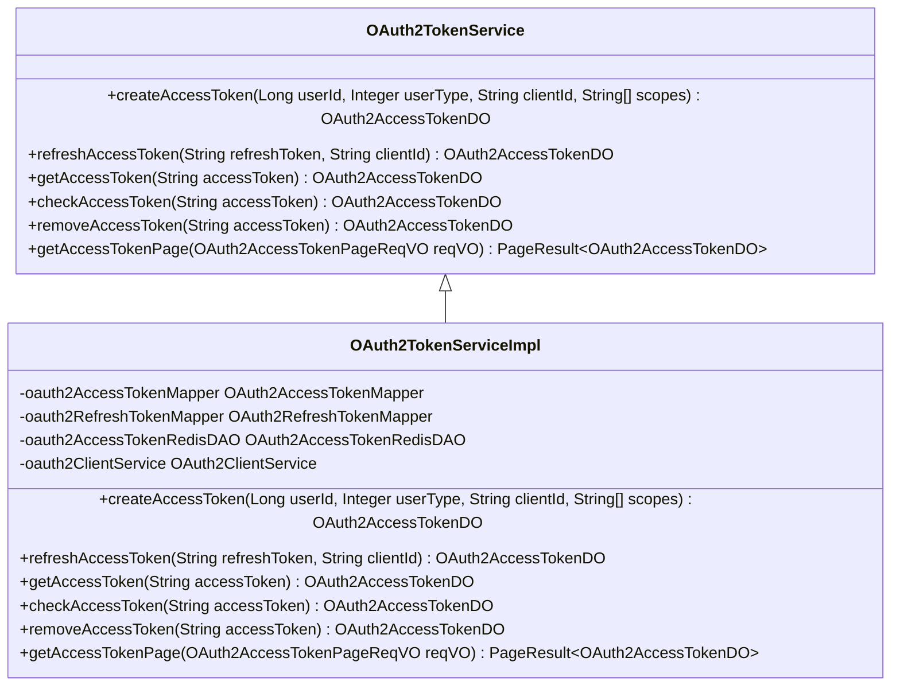
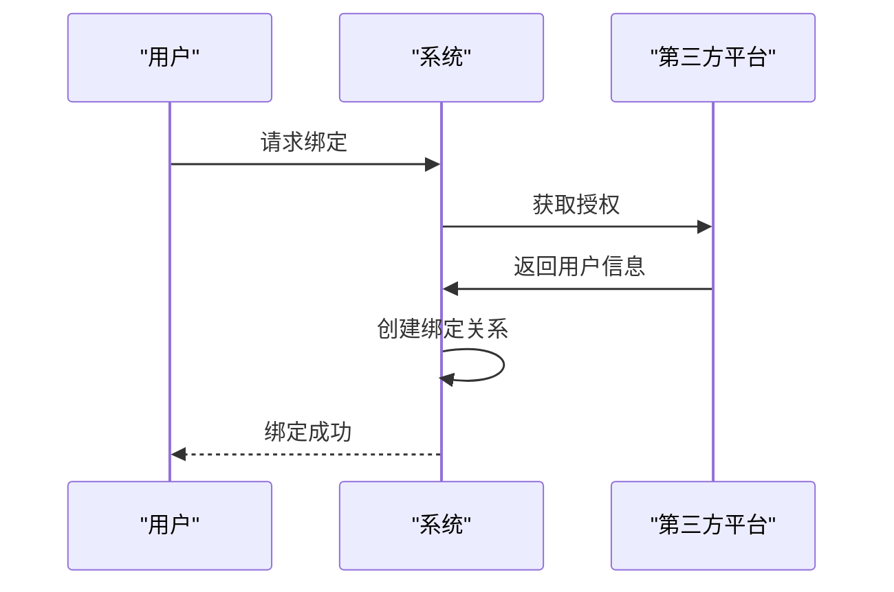

# 第三方登录

<cite>
**本文档引用文件**   
- [OAuth2TokenServiceImpl.java](file://yudao-module-system/yudao-module-system-biz/src/main/java/cn/iocoder/yudao/module/system/service/oauth2/OAuth2TokenServiceImpl.java)
- [SecurityFrameworkServiceImpl.java](file://yudao-framework/yudao-spring-boot-starter-security/src/main/java/cn/iocoder/yudao/framework/security/core/service/SecurityFrameworkServiceImpl.java)
- [SocialClientServiceImpl.java](file://yudao-module-system/yudao-module-system-biz/src/main/java/cn/iocoder/yudao/module/system/service/social/SocialClientServiceImpl.java)
- [SocialUserServiceImpl.java](file://yudao-module-system/yudao-module-system-biz/src/main/java/cn/iocoder/yudao/module/system/service/social/SocialUserServiceImpl.java)
- [WeChatEntity.java](file://eplus-module-social/src/main/java/com/syj/eplus/module/wechat/entity/common/WeChatEntity.java)
- [OAuth2ClientServiceImpl.java](file://yudao-module-system/yudao-module-system-biz/src/main/java/cn/iocoder/yudao/module/system/service/oauth2/OAuth2ClientServiceImpl.java)
- [AuthSocialLoginReqVO.java](file://yudao-module-system/yudao-module-system-biz/src/main/java/cn/iocoder/yudao/module/system/controller/admin/auth/vo/AuthSocialLoginReqVO.java)
</cite>

## 目录
1. [简介](#简介)
2. [第三方登录架构](#第三方登录架构)
3. [核心组件分析](#核心组件分析)
4. [OAuth2.0集成流程](#oauth20集成流程)
5. [主流平台集成](#主流平台集成)
6. [SecurityFrameworkService统一处理](#securityframeworkservice统一处理)
7. [OAuth2TokenService令牌管理](#oauth2tokenservice令牌管理)
8. [配置参数与最佳实践](#配置参数与最佳实践)
9. [业务逻辑处理](#业务逻辑处理)
10. [扩展方法与安全注意事项](#扩展方法与安全注意事项)

## 简介
本文档详细描述了基于OAuth 2.0协议的第三方登录集成方案。系统支持微信、支付宝、Google、GitHub等主流平台的集成，通过统一的安全框架处理不同第三方登录的认证流程，并提供完整的令牌管理机制。文档涵盖了从客户端注册到用户信息获取的完整流程，以及账号绑定/解绑、登录失败处理等业务逻辑。

## 第三方登录架构

**图表来源**
- [OAuth2TokenServiceImpl.java](file://yudao-module-system/yudao-module-system-biz/src/main/java/cn/iocoder/yudao/module/system/service/oauth2/OAuth2TokenServiceImpl.java)
- [SecurityFrameworkServiceImpl.java](file://yudao-framework/yudao-spring-boot-starter-security/src/main/java/cn/iocoder/yudao/framework/security/core/service/SecurityFrameworkServiceImpl.java)

## 核心组件分析

### OAuth2TokenService
该服务负责OAuth2.0令牌的创建、刷新和验证。它实现了访问令牌和刷新令牌的完整生命周期管理，包括令牌的生成、存储、过期处理和删除。

**组件来源**
- [OAuth2TokenServiceImpl.java](file://yudao-module-system/yudao-module-system-biz/src/main/java/cn/iocoder/yudao/module/system/service/oauth2/OAuth2TokenServiceImpl.java)

### SecurityFrameworkService
作为安全框架的核心服务，它统一处理所有第三方登录的认证流程。该服务提供了权限校验、角色检查和作用域验证等功能，确保系统安全。

**组件来源**
- [SecurityFrameworkServiceImpl.java](file://yudao-framework/yudao-spring-boot-starter-security/src/main/java/cn/iocoder/yudao/framework/security/core/service/SecurityFrameworkServiceImpl.java)

### SocialClientService
社交客户端服务负责管理与第三方平台的连接配置，包括客户端ID、密钥、回调地址等信息的存储和验证。

**组件来源**
- [SocialClientServiceImpl.java](file://yudao-module-system/yudao-module-system-biz/src/main/java/cn/iocoder/yudao/module/system/service/social/SocialClientServiceImpl.java)

## OAuth2.0集成流程

**图表来源**
- [OAuth2TokenServiceImpl.java](file://yudao-module-system/yudao-module-system-biz/src/main/java/cn/iocoder/yudao/module/system/service/oauth2/OAuth2TokenServiceImpl.java)
- [SocialClientServiceImpl.java](file://yudao-module-system/yudao-module-system-biz/src/main/java/cn/iocoder/yudao/module/system/service/social/SocialClientServiceImpl.java)

## 主流平台集成

### 微信登录集成
微信登录采用OAuth2.0协议，支持企业微信、微信公众号和微信小程序等多种形式。系统通过WeChatEntity配置类管理微信相关的参数。

**图表来源**
- [WeChatEntity.java](file://eplus-module-social/src/main/java/com/syj/eplus/module/wechat/entity/common/WeChatEntity.java)

### 支付宝登录集成
支付宝登录同样基于OAuth2.0协议，需要在支付宝开放平台注册应用并获取相应的凭证。

### Google登录集成
Google登录使用标准的OAuth2.0流程，支持多种作用域的权限请求。

### GitHub登录集成
GitHub登录提供简洁的API接口，便于快速集成。

## SecurityFrameworkService统一处理

**图表来源**
- [SecurityFrameworkServiceImpl.java](file://yudao-framework/yudao-spring-boot-starter-security/src/main/java/cn/iocoder/yudao/framework/security/core/service/SecurityFrameworkServiceImpl.java)

## OAuth2TokenService令牌管理

**图表来源**
- [OAuth2TokenServiceImpl.java](file://yudao-module-system/yudao-module-system-biz/src/main/java/cn/iocoder/yudao/module/system/service/oauth2/OAuth2TokenServiceImpl.java)

## 配置参数与最佳实践

### 配置参数表
| 参数名称 | 描述 | 示例值 |
|--------|------|-------|
| client_id | 客户端ID | "wwd411c69a39ad2e54" |
| client_secret | 客户端密钥 | "peter" |
| redirect_uri | 回调地址 | "https://example.com/callback" |
| scope | 作用域 | "user_info" |
| state | 状态参数 | "random_string" |

### 最佳实践
1. **回调地址设置**：确保回调地址精确匹配，避免安全漏洞
2. **作用域管理**：按需请求最小权限的作用域
3. **令牌存储**：使用Redis缓存访问令牌，提高性能
4. **安全性**：定期轮换客户端密钥

## 业务逻辑处理

### 用户信息映射
系统将第三方平台返回的用户信息映射到本地用户模型，包括昵称、头像、邮箱等字段。

### 账号绑定/解绑
提供完整的账号绑定和解绑功能，用户可以将多个第三方账号关联到同一个主账号。

**图表来源**
- [SocialUserServiceImpl.java](file://yudao-module-system/yudao-module-system-biz/src/main/java/cn/iocoder/yudao/module/system/service/social/SocialUserServiceImpl.java)

### 登录失败处理
系统提供详细的登录失败原因分析，包括：
- 授权码无效
- 回调地址不匹配
- 作用域超出范围
- 客户端密钥错误

## 扩展方法与安全注意事项

### 扩展新第三方登录提供商
1. 实现SocialTypeEnum枚举
2. 配置客户端信息
3. 实现相应的AuthRequest
4. 测试集成流程

### 安全注意事项
1. **防止CSRF攻击**：使用state参数验证请求来源
2. **令牌保护**：使用HTTPS传输令牌
3. **密钥管理**：定期更新客户端密钥
4. **日志监控**：记录所有认证相关操作

**组件来源**
- [OAuth2ClientServiceImpl.java](file://yudao-module-system/yudao-module-system-biz/src/main/java/cn/iocoder/yudao/module/system/service/oauth2/OAuth2ClientServiceImpl.java)
- [AuthSocialLoginReqVO.java](file://yudao-module-system/yudao-module-system-biz/src/main/java/cn/iocoder/yudao/module/system/controller/admin/auth/vo/AuthSocialLoginReqVO.java)