# 身份认证

<cite>
**本文档引用的文件**   
- [SecurityFrameworkUtils.java](file://yudao-framework/yudao-spring-boot-starter-security/src/main/java/cn/iocoder/yudao/framework/security/core/util/SecurityFrameworkUtils.java)
- [TokenAuthenticationFilter.java](file://yudao-framework/yudao-spring-boot-starter-security/src/main/java/cn/iocoder/yudao/framework/security/core/filter/TokenAuthenticationFilter.java)
- [YudaoWebSecurityConfigurerAdapter.java](file://yudao-framework/yudao-spring-boot-starter-security/src/main/java/cn/iocoder/yudao/framework/security/config/YudaoWebSecurityConfigurerAdapter.java)
- [AdminAuthServiceImpl.java](file://yudao-module-system/yudao-module-system-biz/src/main/java/cn/iocoder/yudao/module/system/service/auth/AdminAuthServiceImpl.java)
- [AuthController.java](file://yudao-module-system/yudao-module-system-biz/src/main/java/cn/iocoder/yudao/module/system/controller/admin/auth/AuthController.java)
- [SecurityProperties.java](file://yudao-framework/yudao-spring-boot-starter-security/src/main/java/cn/iocoder/yudao/framework/security/config/SecurityProperties.java)
- [SecurityFrameworkService.java](file://yudao-framework/yudao-spring-boot-starter-security/src/main/java/cn/iocoder/yudao/framework/security/core/service/SecurityFrameworkService.java)
- [SecurityFrameworkServiceImpl.java](file://yudao-framework/yudao-spring-boot-starter-security/src/main/java/cn/iocoder/yudao/framework/security/core/service/SecurityFrameworkServiceImpl.java)
- [TransmittableThreadLocalSecurityContextHolderStrategy.java](file://yudao-framework/yudao-spring-boot-starter-security/src/main/java/cn/iocoder/yudao/framework/security/core/context/TransmittableThreadLocalSecurityContextHolderStrategy.java)
- [AuthenticationEntryPointImpl.java](file://yudao-framework/yudao-spring-boot-starter-security/src/main/java/cn/iocoder/yudao/framework/security/core/handler/AuthenticationEntryPointImpl.java)
- [AccessDeniedHandlerImpl.java](file://yudao-framework/yudao-spring-boot-starter-security/src/main/java/cn/iocoder/yudao/framework/security/core/handler/AccessDeniedHandlerImpl.java)
- [LoginResultEnum.java](file://yudao-module-system/yudao-module-system-api/src/main/java/cn/iocoder/yudao/module/system/enums/logger/LoginResultEnum.java)
- [AuthLoginRespVO.java](file://yudao-module-system/yudao-module-system-biz/src/main/java/cn/iocoder/yudao/module/system/controller/admin/auth/vo/AuthLoginRespVO.java)
</cite>

## 目录
1. [简介](#简介)
2. [认证架构概述](#认证架构概述)
3. [核心组件分析](#核心组件分析)
4. [用户名密码登录流程](#用户名密码登录流程)
5. [JWT令牌生成与验证](#jwt令牌生成与验证)
6. [会话管理机制](#会话管理机制)
7. [安全上下文实现](#安全上下文实现)
8. [SecurityFrameworkService核心作用](#securityframeworkservice核心作用)
9. [多种认证方式实现](#多种认证方式实现)
10. [安全策略](#安全策略)
11. [扩展机制](#扩展机制)

## 简介
本文档详细描述了基于Spring Security的用户认证机制，重点介绍系统中的身份认证体系。系统采用基于JWT的无状态认证模式，通过OAuth2协议实现令牌管理，支持多种认证方式，包括传统的用户名密码认证、社交登录等。认证体系与权限管理紧密结合，为系统提供安全可靠的身份验证服务。

## 认证架构概述

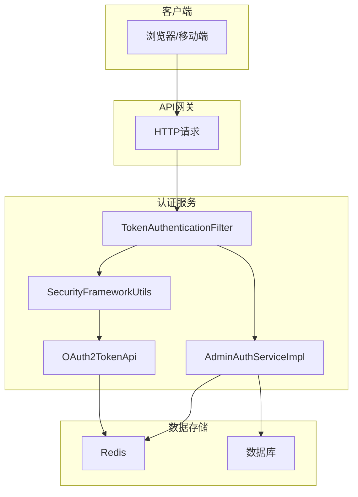

**图示来源**
- [TokenAuthenticationFilter.java](file://yudao-framework/yudao-spring-boot-starter-security/src/main/java/cn/iocoder/yudao/framework/security/core/filter/TokenAuthenticationFilter.java)
- [SecurityFrameworkUtils.java](file://yudao-framework/yudao-spring-boot-starter-security/src/main/java/cn/iocoder/yudao/framework/security/core/util/SecurityFrameworkUtils.java)
- [AdminAuthServiceImpl.java](file://yudao-module-system/yudao-module-system-biz/src/main/java/cn/iocoder/yudao/module/system/service/auth/AdminAuthServiceImpl.java)

## 核心组件分析

### 认证过滤器
系统通过自定义的`TokenAuthenticationFilter`实现JWT令牌的验证。该过滤器在请求处理链中优先执行，负责从请求头或参数中提取JWT令牌，验证其有效性，并将认证信息设置到Spring Security上下文中。

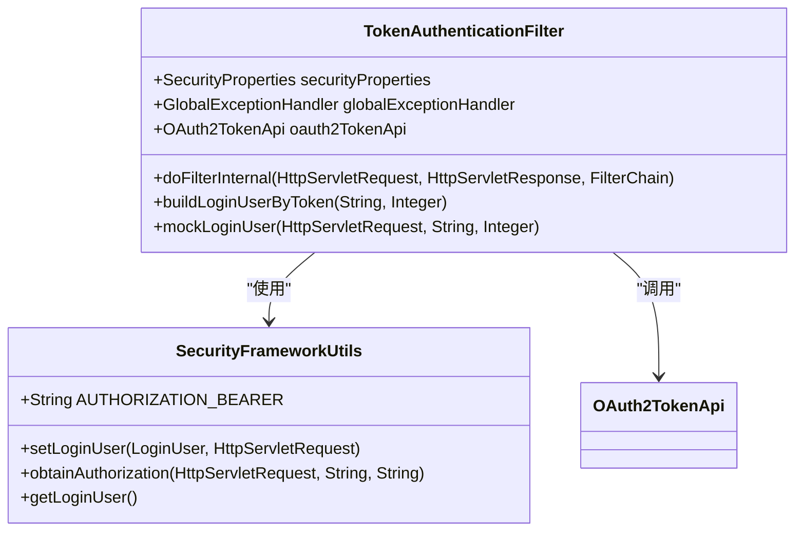

**图示来源**
- [TokenAuthenticationFilter.java](file://yudao-framework/yudao-spring-boot-starter-security/src/main/java/cn/iocoder/yudao/framework/security/core/filter/TokenAuthenticationFilter.java)
- [SecurityFrameworkUtils.java](file://yudao-framework/yudao-spring-boot-starter-security/src/main/java/cn/iocoder/yudao/framework/security/core/util/SecurityFrameworkUtils.java)

### 安全配置
系统通过`YudaoWebSecurityConfigurerAdapter`配置Spring Security的核心行为，包括禁用CSRF保护、采用无状态会话管理策略，以及配置自定义的认证入口点和访问拒绝处理器。

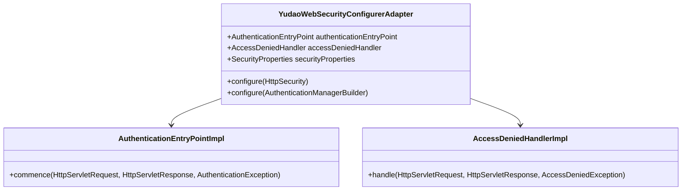

**图示来源**
- [YudaoWebSecurityConfigurerAdapter.java](file://yudao-framework/yudao-spring-boot-starter-security/src/main/java/cn/iocoder/yudao/framework/security/config/YudaoWebSecurityConfigurerAdapter.java)
- [AuthenticationEntryPointImpl.java](file://yudao-framework/yudao-spring-boot-starter-security/src/main/java/cn/iocoder/yudao/framework/security/core/handler/AuthenticationEntryPointImpl.java)
- [AccessDeniedHandlerImpl.java](file://yudao-framework/yudao-spring-boot-starter-security/src/main/java/cn/iocoder/yudao/framework/security/core/handler/AccessDeniedHandlerImpl.java)

## 用户名密码登录流程

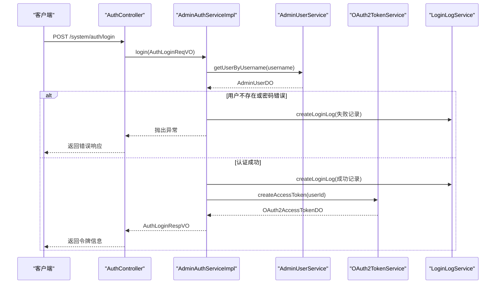

**图示来源**
- [AuthController.java](file://yudao-module-system/yudao-module-system-biz/src/main/java/cn/iocoder/yudao/module/system/controller/admin/auth/AuthController.java)
- [AdminAuthServiceImpl.java](file://yudao-module-system/yudao-module-system-biz/src/main/java/cn/iocoder/yudao/module/system/service/auth/AdminAuthServiceImpl.java)

## JWT令牌生成与验证

### 令牌生成流程
当用户成功登录后，系统会生成JWT令牌并返回给客户端。令牌的生成由`OAuth2TokenService`负责，包含用户ID、用户类型、租户ID和权限范围等信息。

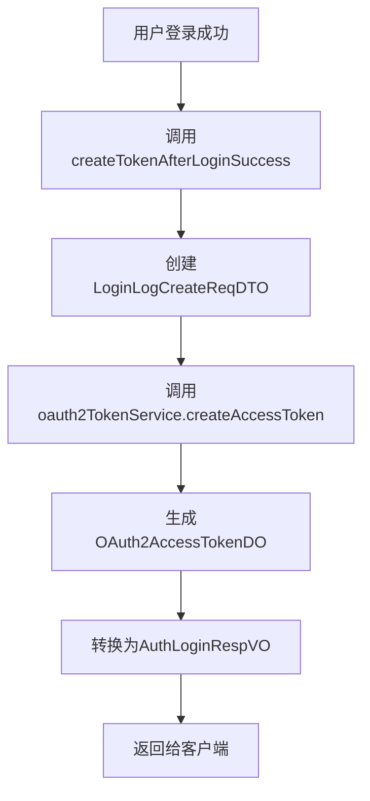

**图示来源**
- [AdminAuthServiceImpl.java](file://yudao-module-system/yudao-module-system-biz/src/main/java/cn/iocoder/yudao/module/system/service/auth/AdminAuthServiceImpl.java)
- [AuthLoginRespVO.java](file://yudao-module-system/yudao-module-system-biz/src/main/java/cn/iocoder/yudao/module/system/controller/admin/auth/vo/AuthLoginRespVO.java)

### 令牌验证流程
每次请求到达服务器时，`TokenAuthenticationFilter`会拦截请求并验证JWT令牌的有效性。验证过程包括检查令牌格式、从OAuth2服务验证令牌有效性，以及比对用户类型。

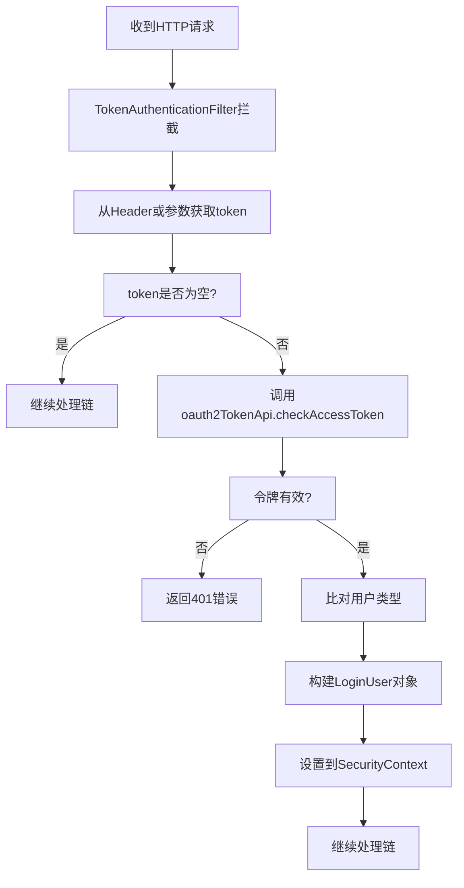

**图示来源**
- [TokenAuthenticationFilter.java](file://yudao-framework/yudao-spring-boot-starter-security/src/main/java/cn/iocoder/yudao/framework/security/core/filter/TokenAuthenticationFilter.java)
- [SecurityFrameworkUtils.java](file://yudao-framework/yudao-spring-boot-starter-security/src/main/java/cn/iocoder/yudao/framework/security/core/util/SecurityFrameworkUtils.java)

## 会话管理机制
系统采用无状态的会话管理机制，不依赖于传统的服务器端会话存储。所有认证信息都包含在JWT令牌中，服务器端通过Redis存储令牌的元数据，实现令牌的吊销和过期管理。

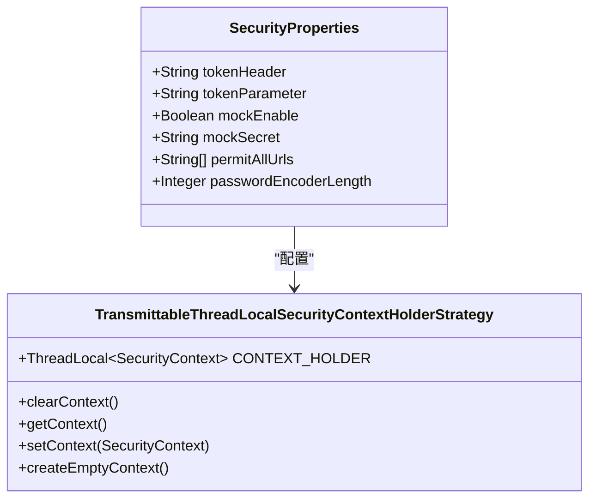

**图示来源**
- [SecurityProperties.java](file://yudao-framework/yudao-spring-boot-starter-security/src/main/java/cn/iocoder/yudao/framework/security/config/SecurityProperties.java)
- [TransmittableThreadLocalSecurityContextHolderStrategy.java](file://yudao-framework/yudao-spring-boot-starter-security/src/main/java/cn/iocoder/yudao/framework/security/core/context/TransmittableThreadLocalSecurityContextHolderStrategy.java)

## 安全上下文实现
系统通过`SecurityFrameworkUtils`工具类管理安全上下文，提供设置和获取当前登录用户的方法。安全上下文使用`TransmittableThreadLocal`实现，确保在异步调用和线程池中也能正确传递认证信息。

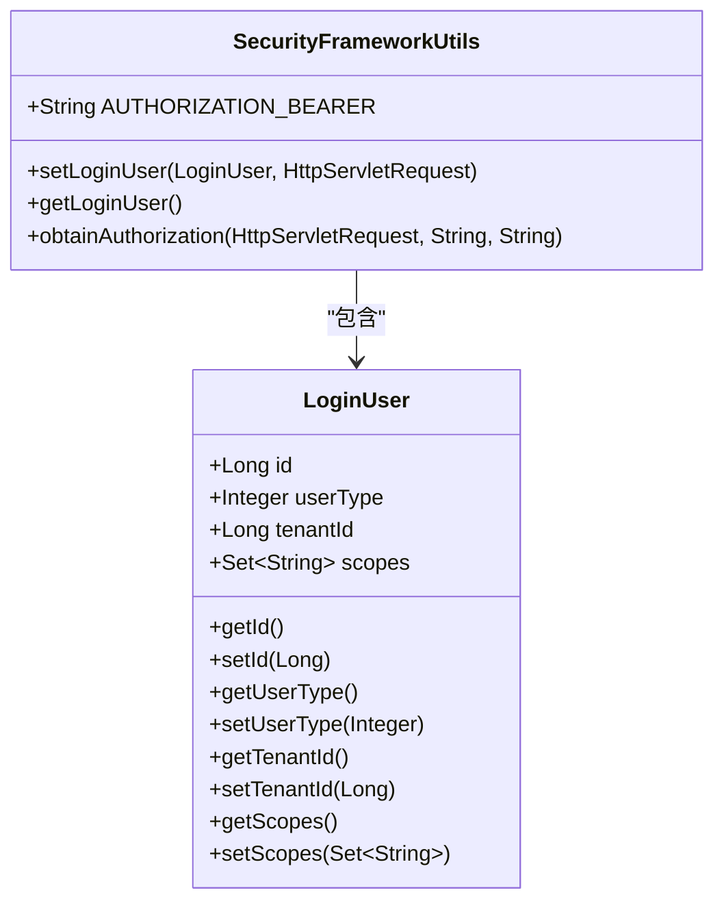

**图示来源**
- [SecurityFrameworkUtils.java](file://yudao-framework/yudao-spring-boot-starter-security/src/main/java/cn/iocoder/yudao/framework/security/core/util/SecurityFrameworkUtils.java)
- [LoginUser.java](file://yudao-framework/yudao-spring-boot-starter-security/src/main/java/cn/iocoder/yudao/framework/security/core/LoginUser.java)

## SecurityFrameworkService核心作用
`SecurityFrameworkService`是系统权限校验的核心接口，提供了一系列方法用于检查用户权限、角色和授权范围。该服务的实现类`SecurityFrameworkServiceImpl`通过远程调用权限API完成实际的权限验证。

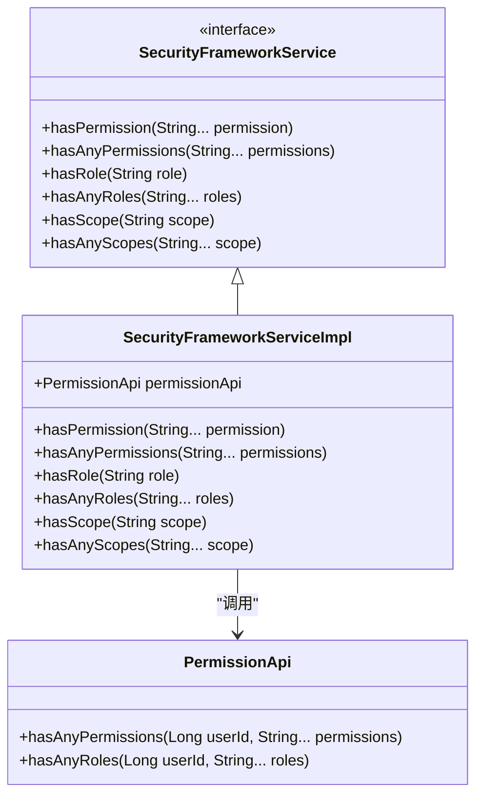

**图示来源**
- [SecurityFrameworkService.java](file://yudao-framework/yudao-spring-boot-starter-security/src/main/java/cn/iocoder/yudao/framework/security/core/service/SecurityFrameworkService.java)
- [SecurityFrameworkServiceImpl.java](file://yudao-framework/yudao-spring-boot-starter-security/src/main/java/cn/iocoder/yudao/framework/security/core/service/SecurityFrameworkServiceImpl.java)

## 多种认证方式实现

### 社交登录流程
系统支持通过第三方平台（如微信）进行社交登录。用户通过授权码获取访问令牌，系统验证令牌后查找对应的内部用户账户，并生成本地认证令牌。

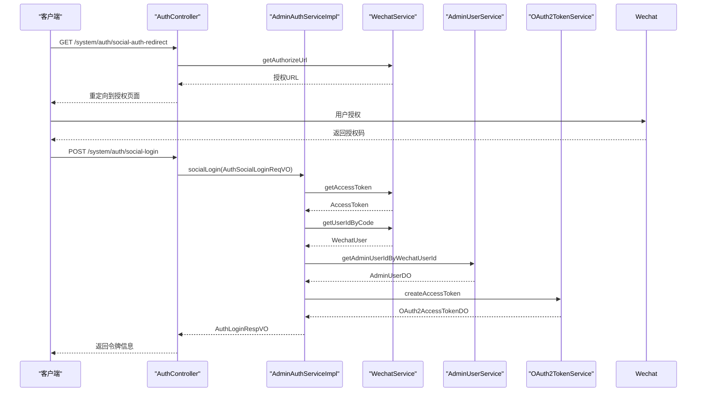

**图示来源**
- [AuthController.java](file://yudao-module-system/yudao-module-system-biz/src/main/java/cn/iocoder/yudao/module/system/controller/admin/auth/AuthController.java)
- [AdminAuthServiceImpl.java](file://yudao-module-system/yudao-module-system-biz/src/main/java/cn/iocoder/yudao/module/system/service/auth/AdminAuthServiceImpl.java)

## 安全策略

### 登录失败处理
系统对登录失败情况进行详细记录，并返回相应的错误码。登录失败可能由多种原因引起，包括账号或密码错误、用户被禁用、验证码错误等。

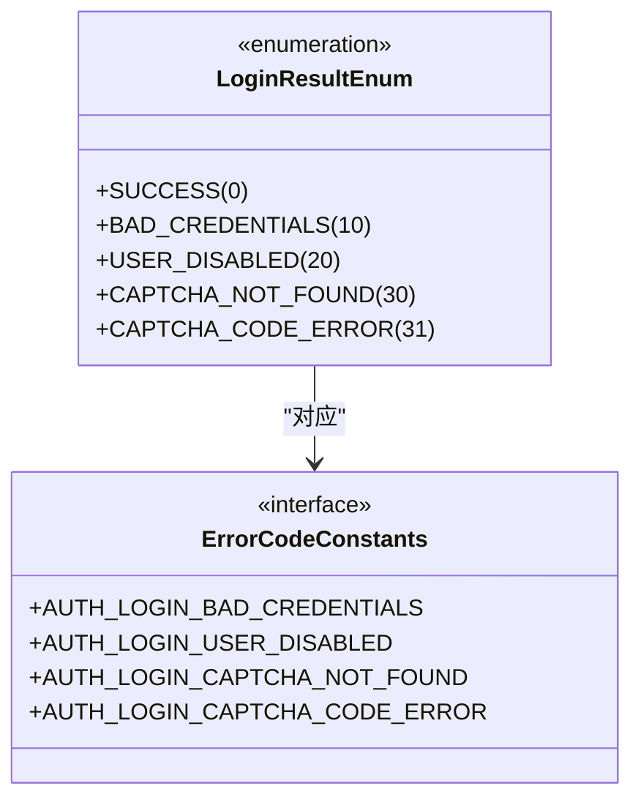

**图示来源**
- [LoginResultEnum.java](file://yudao-module-system/yudao-module-system-api/src/main/java/cn/iocoder/yudao/module/system/enums/logger/LoginResultEnum.java)
- [ErrorCodeConstants.java](file://yudao-module-system/yudao-module-system-api/src/main/java/cn/iocoder/yudao/module/system/enums/ErrorCodeConstants.java)

### 密码加密存储
系统使用BCryptPasswordEncoder对用户密码进行加密存储，确保即使数据库泄露，攻击者也无法轻易获取原始密码。密码加密的强度可以通过配置项进行调整。

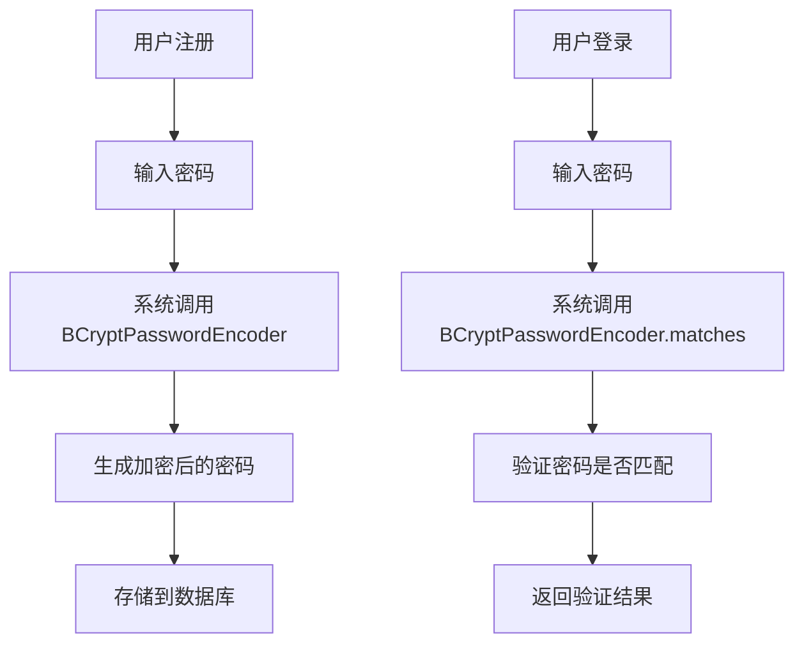

**图示来源**
- [YudaoSecurityAutoConfiguration.java](file://yudao-framework/yudao-spring-boot-starter-security/src/main/java/cn/iocoder/yudao/framework/security/config/YudaoSecurityAutoConfiguration.java)

## 扩展机制

### 自定义认证过滤器
开发者可以通过继承`OncePerRequestFilter`创建自定义的认证过滤器，并将其注册到Spring Security的过滤器链中，以实现特定的认证需求。

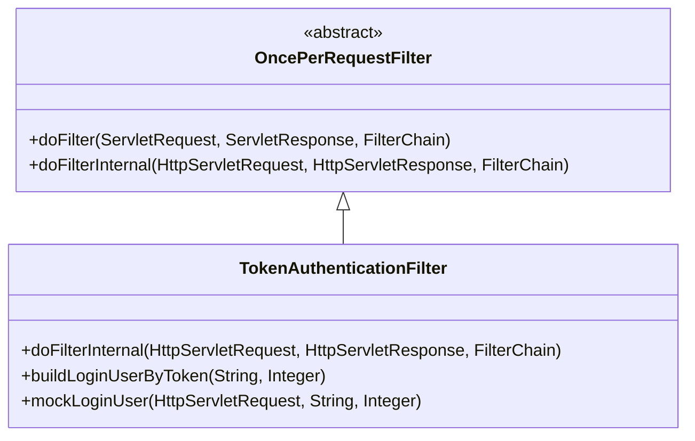

**图示来源**
- [TokenAuthenticationFilter.java](file://yudao-framework/yudao-spring-boot-starter-security/src/main/java/cn/iocoder/yudao/framework/security/core/filter/TokenAuthenticationFilter.java)

### 认证成功/失败处理器
系统提供了自定义认证成功和失败处理器的扩展点，开发者可以实现`AuthenticationSuccessHandler`和`AuthenticationFailureHandler`接口，以定制认证成功或失败后的处理逻辑。

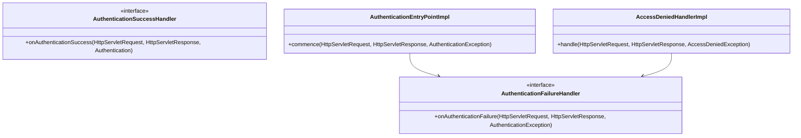

**图示来源**
- [AuthenticationEntryPointImpl.java](file://yudao-framework/yudao-spring-boot-starter-security/src/main/java/cn/iocoder/yudao/framework/security/core/handler/AuthenticationEntryPointImpl.java)
- [AccessDeniedHandlerImpl.java](file://yudao-framework/yudao-spring-boot-starter-security/src/main/java/cn/iocoder/yudao/framework/security/core/handler/AccessDeniedHandlerImpl.java)