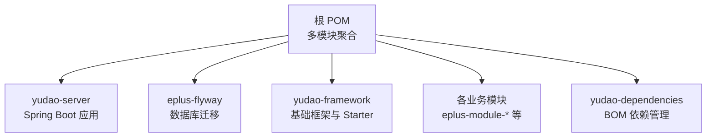
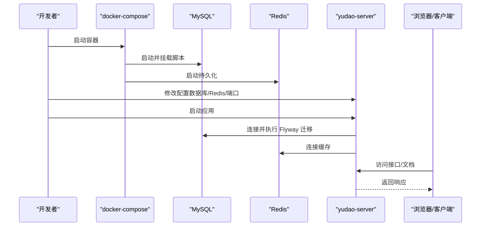
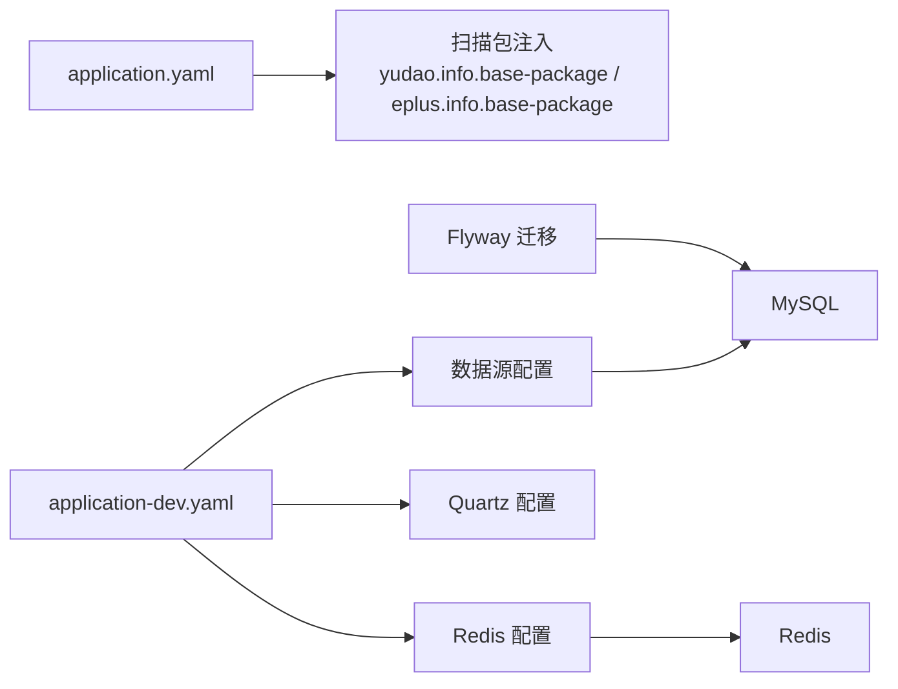

# 快速开始

<cite>
**本文引用的文件**
- [pom.xml](file://pom.xml)
- [README.md](file://README.md)
- [docker-compose.yml](file://docker-compose.yml)
- [yudao-server/src/main/resources/application.yaml](file://yudao-server/src/main/resources/application.yaml)
- [yudao-server/src/main/resources/application-dev.yaml](file://yudao-server/src/main/resources/application-dev.yaml)
- [yudao-server/src/main/java/cn/iocoder/yudao/server/YudaoServerApplication.java](file://yudao-server/src/main/java/cn/iocoder/yudao/server/YudaoServerApplication.java)
- [eplus-flyway/src/main/resources/db/migration/common/V1_0_0_001__框架初始化.sql](file://eplus-flyway/src/main/resources/db/migration/common/V1_0_0_001__框架初始化.sql)
- [eplus-flyway/src/main/resources/db/migration/common/V1_0_0_002__Eplus初始化.sql](file://eplus-flyway/src/main/resources/db/migration/common/V1_0_0_002__Eplus初始化.sql)
- [sql/mysql/ruoyi-vue-pro.sql](file://sql/mysql/ruoyi-vue-pro.sql)
</cite>

## 目录
1. [简介](#简介)
2. [项目结构](#项目结构)
3. [核心组件](#核心组件)
4. [架构总览](#架构总览)
5. [详细组件分析](#详细组件分析)
6. [依赖分析](#依赖分析)
7. [性能考虑](#性能考虑)
8. [故障排查指南](#故障排查指南)
9. [结论](#结论)
10. [附录](#附录)

## 简介
本指南面向首次接触项目的开发者，目标是在最短时间内完成本地环境搭建并成功运行后端服务。你将获得：
- 明确的环境要求（JDK、Maven、MySQL、Redis 等）
- 分步骤的操作流程（克隆、数据库初始化、配置修改、启动与验证）
- 常见问题排查清单（端口冲突、数据库连接失败等）
- 不同操作系统（Windows、macOS、Linux）的注意事项
- 成功运行后的检查点（健康检查端点、登录页面）

## 项目结构
该工程为多模块 Maven 项目，核心模块包括：
- yudao-server：Spring Boot 启动模块
- eplus-flyway：数据库迁移模块（Flyway）
- yudao-framework：基础框架与 Starter
- 各业务模块（如 eplus-module-scm、eplus-module-sms、eplus-module-wms 等）
- yudao-dependencies：统一依赖管理（BOM）

图表来源
- [pom.xml](file://pom.xml#L1-L45)

章节来源
- [pom.xml](file://pom.xml#L1-L45)
- [README.md](file://README.md#L58-L179)

## 核心组件
- 后端技术栈与版本：Spring Boot 2.7.18、Java 17、MySQL 5.7/8.0、Redis 5.0+、MyBatis Plus、Flowable、Quartz、Druid、Lombok、MapStruct 等
- 启动类：YudaoServerApplication，扫描基础包路径由配置注入
- 配置文件：application.yaml（全局）、application-dev.yaml（开发环境）
- 数据库初始化：Flyway 脚本 + SQL 脚本
- 容器编排：docker-compose 提供 MySQL 与 Redis 服务

章节来源
- [README.md](file://README.md#L30-L48)
- [yudao-server/src/main/java/cn/iocoder/yudao/server/YudaoServerApplication.java](file://yudao-server/src/main/java/cn/iocoder/yudao/server/YudaoServerApplication.java#L1-L18)
- [yudao-server/src/main/resources/application.yaml](file://yudao-server/src/main/resources/application.yaml#L1-L30)
- [yudao-server/src/main/resources/application-dev.yaml](file://yudao-server/src/main/resources/application-dev.yaml#L1-L20)

## 架构总览
后端启动流程概览：
- 启动 Redis 与 MySQL（可选使用 docker-compose）
- 初始化数据库（Flyway 迁移 + SQL 脚本）
- 修改配置文件（数据库、Redis、端口等）
- 启动 yudao-server（Maven 或 IDE）
- 访问接口与文档（Swagger/Knife4j）

图表来源
- [docker-compose.yml](file://docker-compose.yml#L1-L41)
- [yudao-server/src/main/resources/application-dev.yaml](file://yudao-server/src/main/resources/application-dev.yaml#L1-L20)
- [yudao-server/src/main/resources/application.yaml](file://yudao-server/src/main/resources/application.yaml#L1-L30)

## 详细组件分析

### 环境要求
- JDK：17+
- Maven：3.6+
- MySQL：5.7+ 或 8.0+
- Redis：5.0+
- Node.js：16+（前端项目，非后端必需）
- Docker：可选（使用 docker-compose 快速拉起 MySQL/Redis）

章节来源
- [README.md](file://README.md#L279-L286)
- [pom.xml](file://pom.xml#L50-L64)

### 分步操作指南

#### 1) 克隆项目
- 使用 Git 克隆仓库到本地，进入项目根目录

章节来源
- [README.md](file://README.md#L289-L295)

#### 2) 准备数据库与缓存（任选其一）
- 方案A：使用 docker-compose 一键启动 MySQL 与 Redis
  - 执行 docker-compose 启动命令，容器将自动初始化数据库与脚本
- 方案B：本地安装 MySQL 与 Redis
  - 启动 MySQL 与 Redis 服务
  - 若使用本地 MySQL，需先创建数据库并导入 SQL 脚本

章节来源
- [docker-compose.yml](file://docker-compose.yml#L1-L41)
- [README.md](file://README.md#L296-L305)

#### 3) 初始化数据库
- 使用 Flyway 迁移（推荐）
  - 在 application.yaml 中启用 Flyway，并指定迁移脚本位置
  - 启动应用后 Flyway 会自动执行脚本
- 或使用 SQL 脚本
  - 参考 ruoyi-vue-pro.sql 等脚本，按顺序执行初始化与业务脚本
  - Flyway 脚本位于 eplus-flyway/src/main/resources/db/migration/common

章节来源
- [yudao-server/src/main/resources/application.yaml](file://yudao-server/src/main/resources/application.yaml#L42-L53)
- [eplus-flyway/src/main/resources/db/migration/common/V1_0_0_001__框架初始化.sql](file://eplus-flyway/src/main/resources/db/migration/common/V1_0_0_001__框架初始化.sql#L1-L30)
- [eplus-flyway/src/main/resources/db/migration/common/V1_0_0_002__Eplus初始化.sql](file://eplus-flyway/src/main/resources/db/migration/common/V1_0_0_002__Eplus初始化.sql#L1-L30)
- [sql/mysql/ruoyi-vue-pro.sql](file://sql/mysql/ruoyi-vue-pro.sql#L1-L40)

#### 4) 修改配置文件
- 修改 yudao-server/src/main/resources/application-dev.yaml
  - 数据源：MySQL 连接 URL、用户名、密码
  - Redis：host、port、database 等
- 如需启用 Druid 监控，可在 application-dev.yaml 中开启相应配置
- 端口：默认 18027，可在 server.port 中调整

章节来源
- [yudao-server/src/main/resources/application-dev.yaml](file://yudao-server/src/main/resources/application-dev.yaml#L1-L20)
- [yudao-server/src/main/resources/application-dev.yaml](file://yudao-server/src/main/resources/application-dev.yaml#L58-L64)
- [yudao-server/src/main/resources/application-dev.yaml](file://yudao-server/src/main/resources/application-dev.yaml#L65-L70)

#### 5) 启动应用
- 方式A：Maven 命令
  - 在根目录执行构建与启动
- 方式B：IDE 启动
  - 找到 YudaoServerApplication 并运行 main 方法

章节来源
- [README.md](file://README.md#L336-L346)
- [yudao-server/src/main/java/cn/iocoder/yudao/server/YudaoServerApplication.java](file://yudao-server/src/main/java/cn/iocoder/yudao/server/YudaoServerApplication.java#L1-L18)

#### 6) 访问应用
- 接口地址：http://localhost:18027
- 接口文档：http://localhost:18027/doc.html
- Druid 监控（如已启用）：http://localhost:18027/druid

章节来源
- [README.md](file://README.md#L348-L353)
- [yudao-server/src/main/resources/application-dev.yaml](file://yudao-server/src/main/resources/application-dev.yaml#L27-L34)

### 不同操作系统注意事项
- Windows
  - 使用 cmd 或 PowerShell 执行 Maven 命令
  - Redis 可直接运行 redis-server.exe
- macOS
  - 使用 Homebrew 安装 Redis：brew install redis
  - 启动 Redis：redis-server
- Linux
  - 使用包管理器安装 Redis：apt/yum install redis
  - 启动 Redis：redis-server

章节来源
- [README.md](file://README.md#L326-L335)

## 依赖分析
- 依赖管理：通过 yudao-dependencies BOM 统一版本
- 启动类扫描包：由 application.yaml 中的 yudao.info.base-package 与 eplus.info.base-package 注入
- 数据源与连接池：Druid 配置在 application-dev.yaml 中
- 缓存：Redis 配置在 application-dev.yaml 中
- 定时任务：Quartz 配置在 application-dev.yaml 中

图表来源
- [yudao-server/src/main/resources/application.yaml](file://yudao-server/src/main/resources/application.yaml#L160-L171)
- [yudao-server/src/main/resources/application-dev.yaml](file://yudao-server/src/main/resources/application-dev.yaml#L58-L70)
- [yudao-server/src/main/resources/application-dev.yaml](file://yudao-server/src/main/resources/application-dev.yaml#L65-L70)

章节来源
- [pom.xml](file://pom.xml#L66-L76)
- [yudao-server/src/main/resources/application.yaml](file://yudao-server/src/main/resources/application.yaml#L160-L171)
- [yudao-server/src/main/resources/application-dev.yaml](file://yudao-server/src/main/resources/application-dev.yaml#L58-L70)

## 性能考虑
- 连接池与慢 SQL：可通过 Druid 配置开启慢 SQL 记录与阈值
- 读写分离：可配置多个数据源（master/slave）
- 缓存策略：合理设置 Redis TTL 与热点数据缓存
- 异步处理：使用 @Async 或消息队列降低同步压力

章节来源
- [README.md](file://README.md#L596-L650)
- [yudao-server/src/main/resources/application-dev.yaml](file://yudao-server/src/main/resources/application-dev.yaml#L25-L57)

## 故障排查指南

### 常见问题与解决方案
- 启动时报错“无法确定嵌入式数据库驱动类”
  - 检查数据库连接配置（URL、用户名、密码），确认 MySQL 已启动
- Redis 连接失败
  - 检查 Redis 是否启动、端口与密码是否正确
- 工作流图显示异常
  - 检查前端静态资源加载（与后端接口无关）
- Flyway 迁移失败
  - 检查版本号是否连续、脚本是否存在语法错误

章节来源
- [README.md](file://README.md#L652-L671)

### 端口冲突
- 修改 application-dev.yaml 中的 server.port
- 确认系统中其他进程未占用端口

章节来源
- [yudao-server/src/main/resources/application-dev.yaml](file://yudao-server/src/main/resources/application-dev.yaml#L1-L3)

### 数据库连接失败
- 确认 MySQL 服务已启动
- 检查 application-dev.yaml 中的数据库 URL、用户名、密码
- 若使用 docker-compose，确认容器已成功启动且端口映射正确

章节来源
- [docker-compose.yml](file://docker-compose.yml#L1-L41)
- [yudao-server/src/main/resources/application-dev.yaml](file://yudao-server/src/main/resources/application-dev.yaml#L58-L64)

## 结论
按照本指南，你可以快速完成本地环境准备与应用启动。建议在开发过程中：
- 使用 docker-compose 快速拉起 MySQL 与 Redis
- 通过 Flyway 管理数据库版本
- 在 application-dev.yaml 中集中管理开发环境配置
- 启动后通过接口文档与健康检查端点验证服务可用性

## 附录

### 验证安装成功的检查点
- 访问接口文档：http://localhost:18027/doc.html
- 登录系统（如需鉴权）并访问后台接口
- 查看 Druid 监控（如已启用）：http://localhost:18027/druid
- 确认 Redis 连接正常（可通过接口或日志）

章节来源
- [README.md](file://README.md#L348-L353)
- [yudao-server/src/main/resources/application-dev.yaml](file://yudao-server/src/main/resources/application-dev.yaml#L27-L34)