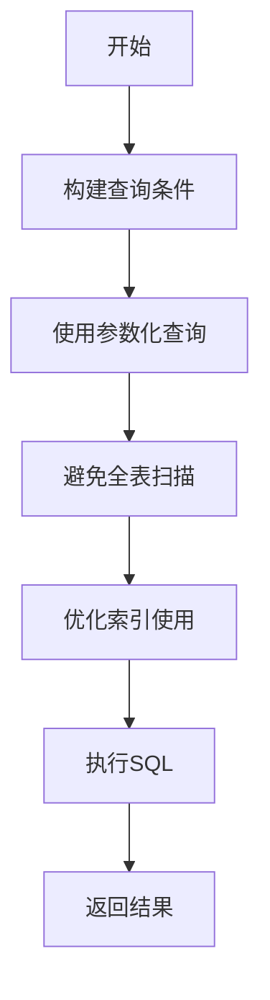
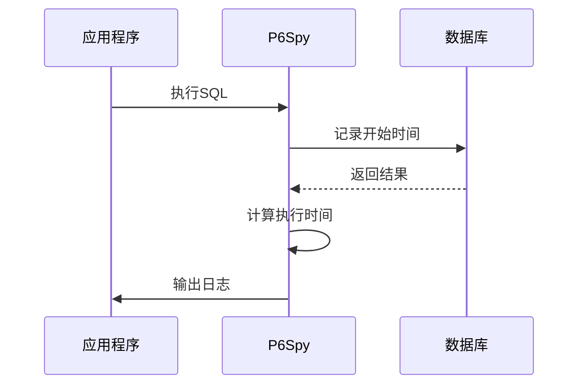
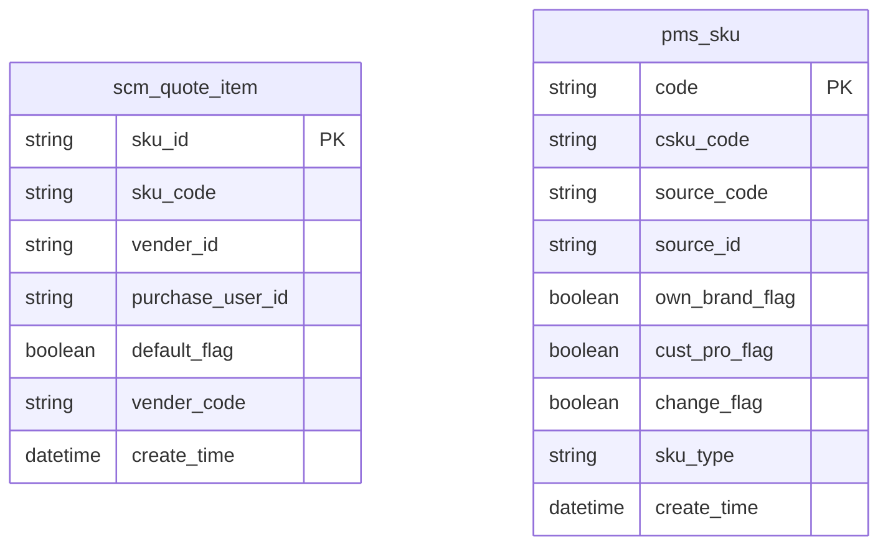
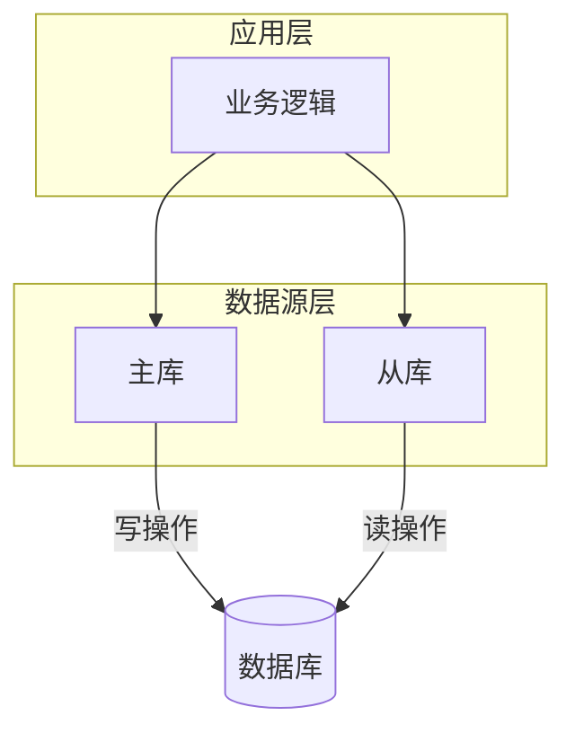

# 数据库优化

<cite>
**本文档引用的文件**   
- [YudaoMybatisAutoConfiguration.java](file://yudao-framework/yudao-spring-boot-starter-mybatis/src/main/java/cn/iocoder/yudao/framework/mybatis/config/YudaoMybatisAutoConfiguration.java)
- [P6SpyLogger.java](file://eplus-framework/eplus-common/src/main/java/com/syj/eplus/framework/common/config/P6SpyLogger.java)
- [application-prod.yaml](file://yudao-server/src/main/resources/application-prod.yaml)
- [YudaoDataSourceAutoConfiguration.java](file://yudao-framework/yudao-spring-boot-starter-mybatis/src/main/java/cn/iocoder/yudao/framework/datasource/config/YudaoDataSourceAutoConfiguration.java)
- [DataSourceConfigServiceImpl.java](file://yudao-module-infra/yudao-module-infra-biz/src/main/java/cn/iocoder/yudao/module/infra/service/db/DataSourceConfigServiceImpl.java)
- [BaseMapperX.java](file://yudao-framework/yudao-spring-boot-starter-mybatis/src/main/java/cn/iocoder/yudao/framework/mybatis/core/mapper/BaseMapperX.java)
- [SaleContractItemMapper.xml](file://eplus-module-sms/eplus-module-sms-biz/src/main/resources/mapper/salecontractitem/SaleContractItemMapper.xml)
- [OrderLinkServiceImpl.java](file://eplus-module-infra/eplus-module-infra-biz/src/main/java/com/syj/eplus/module/infra/service/orderlink/OrderLinkServiceImpl.java)
- [V1_0_0_436__报价表增加索引.sql](file://eplus-flyway/src/main/resources/db/migration/common/V1_0_0_436__报价表增加索引.sql)
- [V1_0_0_437__产品表增加索引.sql](file://eplus-flyway/src/main/resources/db/migration/common/V1_0_0_437__产品表增加索引.sql)
- [OPTIMIZATION_PLAN.md](file://eplus-module-infra/OPTIMIZATION_PLAN.md)
</cite>

## 目录
1. [MyBatis Plus 使用技巧](#mybatis-plus-使用技巧)
2. [SQL 优化方法](#sql-优化方法)
3. [慢查询日志分析与执行计划解读](#慢查询日志分析与执行计划解读)
4. [索引设计原则与复合索引最佳实践](#索引设计原则与复合索引最佳实践)
5. [分库分表策略与读写分离配置](#分库分表策略与读写分离配置)
6. [批量操作优化](#批量操作优化)
7. [连接池配置调优](#连接池配置调优)
8. [事务管理最佳实践](#事务管理最佳实践)
9. [实际案例：SQL 性能提升](#实际案例sql-性能提升)

## MyBatis Plus 使用技巧

在本项目中，MyBatis Plus 被广泛用于简化数据库操作。通过 `YudaoMybatisAutoConfiguration` 配置类，项目启用了 MyBatis Plus 的分页插件和自动填充功能。`BaseMapperX` 接口提供了丰富的扩展方法，如 `insertBatch`、`updateBatch` 和 `delete` 等，极大地简化了批量操作和条件删除的实现。

**Section sources**
- [YudaoMybatisAutoConfiguration.java](file://yudao-framework/yudao-spring-boot-starter-mybatis/src/main/java/cn/iocoder/yudao/framework/mybatis/config/YudaoMybatisAutoConfiguration.java)
- [BaseMapperX.java](file://yudao-framework/yudao-spring-boot-starter-mybatis/src/main/java/cn/iocoder/yudao/framework/mybatis/core/mapper/BaseMapperX.java)

## SQL 优化方法

SQL 优化是提升数据库性能的关键。项目中通过多种方式实现 SQL 优化，包括使用参数化查询防止 SQL 注入、避免 N+1 查询问题以及优化查询条件的使用。例如，在 `OrderLinkServiceImpl` 中，通过批量更新替代逐条更新，显著减少了数据库交互次数。

**Diagram sources**
- [OrderLinkServiceImpl.java](file://eplus-module-infra/eplus-module-infra-biz/src/main/java/com/syj/eplus/module/infra/service/orderlink/OrderLinkServiceImpl.java)

## 慢查询日志分析与执行计划解读

慢查询日志是诊断性能问题的重要工具。项目中通过 P6Spy 监控 SQL 执行，`P6SpyLogger` 类负责格式化日志输出，记录执行时间和 SQL 语句。在 `application-prod.yaml` 中，配置了慢 SQL 阈值为 100 毫秒，超过此阈值的查询将被记录。

**Diagram sources**
- [P6SpyLogger.java](file://eplus-framework/eplus-common/src/main/java/com/syj/eplus/framework/common/config/P6SpyLogger.java)
- [application-prod.yaml](file://yudao-server/src/main/resources/application-prod.yaml)

## 索引设计原则与复合索引最佳实践

索引设计是数据库优化的核心。项目中通过 Flyway 脚本为关键表创建索引，如 `scm_quote_item` 和 `pms_sku` 表。复合索引的设计遵循最左前缀原则，确保查询条件能够有效利用索引。例如，在 `V1_0_0_436__报价表增加索引.sql` 中，为 `sku_id`、`sku_code` 等字段创建了单独索引。

**Diagram sources**
- [V1_0_0_436__报价表增加索引.sql](file://eplus-flyway/src/main/resources/db/migration/common/V1_0_0_436__报价表增加索引.sql)
- [V1_0_0_437__产品表增加索引.sql](file://eplus-flyway/src/main/resources/db/migration/common/V1_0_0_437__产品表增加索引.sql)

## 分库分表策略与读写分离配置

项目采用多数据源配置实现读写分离。`YudaoDataSourceAutoConfiguration` 启用了动态数据源，主库用于写操作，从库用于读操作。`DataSourceConfigServiceImpl` 提供了数据源配置的服务，支持运行时动态切换数据源。

**Diagram sources**
- [YudaoDataSourceAutoConfiguration.java](file://yudao-framework/yudao-spring-boot-starter-mybatis/src/main/java/cn/iocoder/yudao/framework/datasource/config/YudaoDataSourceAutoConfiguration.java)
- [DataSourceConfigServiceImpl.java](file://yudao-module-infra/yudao-module-infra-biz/src/main/java/cn/iocoder/yudao/module/infra/service/db/DataSourceConfigServiceImpl.java)

## 批量操作优化

批量操作优化通过减少数据库交互次数来提升性能。`BaseMapperX` 接口提供了 `insertBatch` 和 `updateBatch` 方法，支持批量插入和更新。在 `OrderLinkServiceImpl` 中，通过 `updateBatch` 方法实现批量状态更新，避免了 N+1 查询问题。

**Section sources**
- [BaseMapperX.java](file://yudao-framework/yudao-spring-boot-starter-mybatis/src/main/java/cn/iocoder/yudao/framework/mybatis/core/mapper/BaseMapperX.java)
- [OrderLinkServiceImpl.java](file://eplus-module-infra/eplus-module-infra-biz/src/main/java/com/syj/eplus/module/infra/service/orderlink/OrderLinkServiceImpl.java)

## 连接池配置调优

连接池配置对数据库性能有重要影响。在 `application-prod.yaml` 中，Druid 连接池的初始连接数为 1，最小空闲连接数为 1，最大活跃连接数为 20。通过合理配置连接池参数，可以有效管理数据库连接，避免连接泄漏和性能瓶颈。

**Section sources**
- [application-prod.yaml](file://yudao-server/src/main/resources/application-prod.yaml)

## 事务管理最佳实践

事务管理确保数据的一致性和完整性。项目中通过 `@Transactional` 注解管理事务，确保在异常情况下能够正确回滚。在 `SnServiceImpl` 中，`getAndIncrementSn` 方法使用事务管理，保证序列号的递增操作是原子的。

**Section sources**
- [SnServiceImpl.java](file://eplus-module-infra/eplus-module-infra-biz/src/main/java/com/syj/eplus/module/infra/service/sn/SnServiceImpl.java)

## 实际案例：SQL 性能提升

在 `OPTIMIZATION_PLAN.md` 文档中，详细记录了多个 SQL 性能优化案例。例如，通过修复缓存键不一致问题，避免了缓存失效和内存泄漏；通过使用批量更新替代逐条更新，显著提升了性能。这些案例展示了如何通过代码优化和配置调整，实现 SQL 性能的显著提升。

**Section sources**
- [OPTIMIZATION_PLAN.md](file://eplus-module-infra/OPTIMIZATION_PLAN.md)