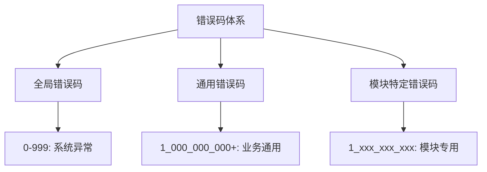
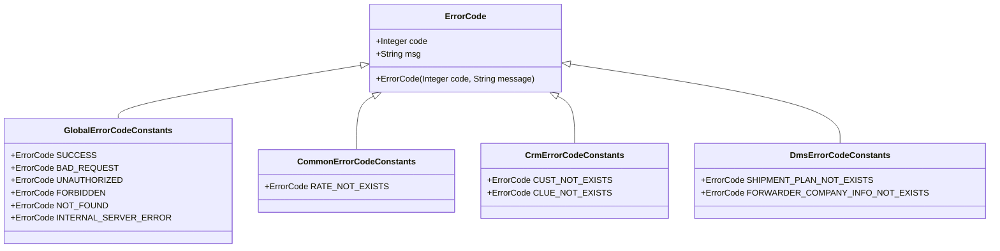
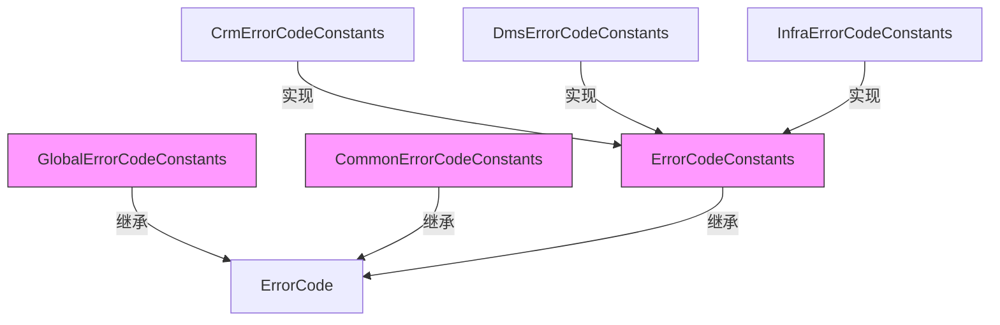
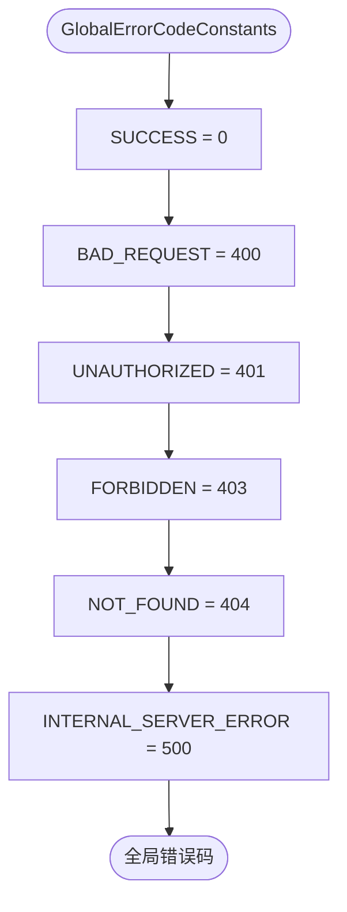
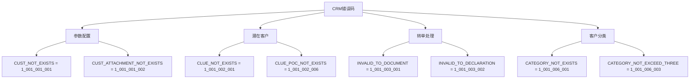
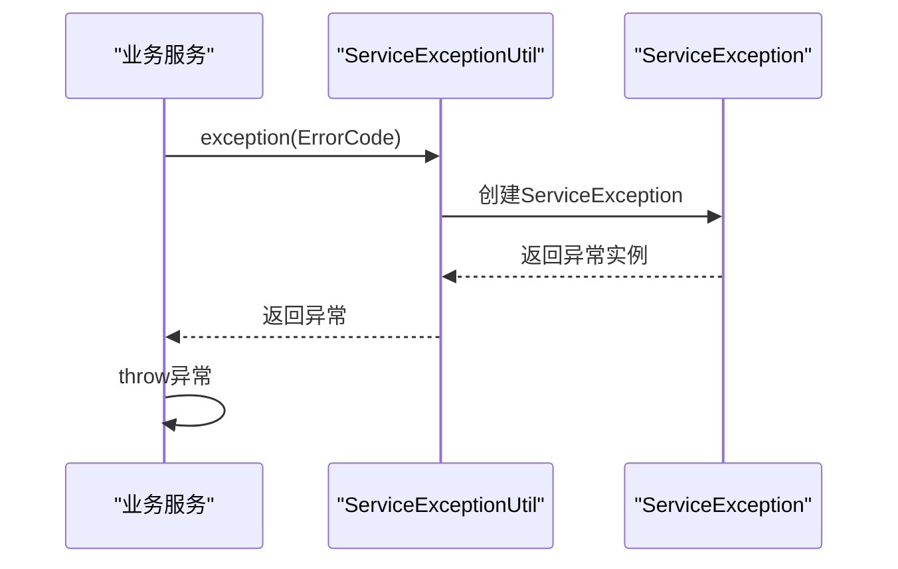
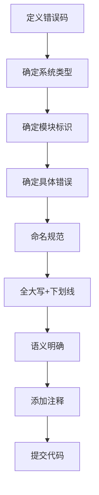
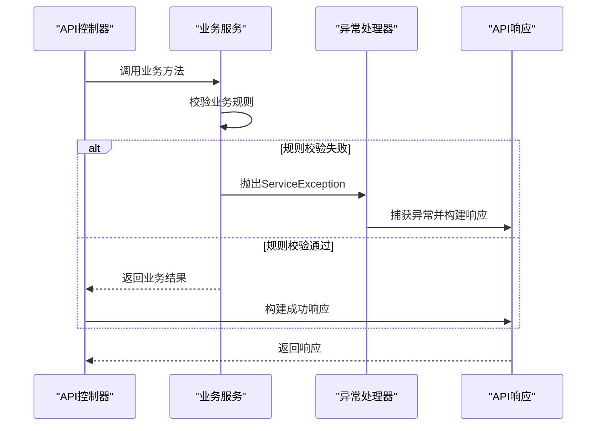

# 错误码命名规范

<cite>
**本文档引用文件**   
- [GlobalErrorCodeConstants.java](file://yudao-framework/yudao-common/src/main/java/cn/iocoder/yudao/framework/common/exception/enums/GlobalErrorCodeConstants.java)
- [ErrorCode.java](file://yudao-framework/yudao-common/src/main/java/cn/iocoder/yudao/framework/common/exception/ErrorCode.java)
- [ServiceErrorCodeRange.java](file://yudao-framework/yudao-common/src/main/java/cn/iocoder/yudao/framework/common/exception/enums/ServiceErrorCodeRange.java)
- [CommonErrorCodeConstants.java](file://eplus-framework/eplus-common/src/main/java/com/syj/eplus/framework/common/enums/CommonErrorCodeConstants.java)
- [ErrorCodeConstants.java](file://eplus-module-crm/eplus-module-crm-api/src/main/java/com/syj/eplus/module/crm/enums/ErrorCodeConstants.java)
- [ErrorCodeConstants.java](file://eplus-module-dms/eplus-module-dms-api/src/main/java/com/syj/eplus/module/dms/enums/ErrorCodeConstants.java)
- [ErrorCodeConstants.java](file://eplus-module-infra/eplus-module-infra-api/src/main/java/com/syj/eplus/module/infra/enums/ErrorCodeConstants.java)
- [ServiceExceptionUtil.java](file://yudao-framework/yudao-common/src/main/java/cn/iocoder/yudao/framework/common/exception/util/ServiceExceptionUtil.java)
</cite>

## 目录
1. [引言](#引言)
2. [错误码分层编码体系](#错误码分层编码体系)
3. [错误码命名规则](#错误码命名规则)
4. [错误码枚举类组织结构](#错误码枚举类组织结构)
5. [错误码使用规范](#错误码使用规范)
6. [最佳实践示例](#最佳实践示例)
7. [结论](#结论)

## 引言

eplus-admin-server项目采用统一的错误码命名规范，旨在为系统提供一致、可读性强且易于维护的错误处理机制。本规范定义了从全局错误码到模块特定错误码的完整体系，通过五位数字编码结构实现错误码的分层管理。系统基于yudao框架的错误码设计模式，结合企业实际业务需求，建立了全局、通用和模块级三层错误码架构，确保错误信息的准确传递和快速定位。

## 错误码分层编码体系

eplus-admin-server的错误码体系采用分层设计，分为三个层级：全局错误码、通用错误码和模块特定错误码。这种分层结构确保了错误码的唯一性和可管理性，同时便于开发人员快速识别错误来源。



**Diagram sources**
- [GlobalErrorCodeConstants.java](file://yudao-framework/yudao-common/src/main/java/cn/iocoder/yudao/framework/common/exception/enums/GlobalErrorCodeConstants.java)
- [ServiceErrorCodeRange.java](file://yudao-framework/yudao-common/src/main/java/cn/iocoder/yudao/framework/common/exception/enums/ServiceErrorCodeRange.java)

**Section sources**
- [GlobalErrorCodeConstants.java](file://yudao-framework/yudao-common/src/main/java/cn/iocoder/yudao/framework/common/exception/enums/GlobalErrorCodeConstants.java)
- [ServiceErrorCodeRange.java](file://yudao-framework/yudao-common/src/main/java/cn/iocoder/yudao/framework/common/exception/enums/ServiceErrorCodeRange.java)

## 错误码命名规则

eplus-admin-server采用五位数字编码结构，实际为10位数字，分为四个部分，每部分具有特定含义。编码格式为：X-XXX-XXX-XXX，其中X代表数字。

### 五位数字编码含义划分

错误码采用10位数字编码，分为四个部分：
- **第一段（1位）**：类型标识，1表示业务级别异常
- **第二段（3位）**：系统类型，如001表示用户系统，020表示CRM系统
- **第三段（3位）**：模块标识，表示系统内的具体功能模块
- **第四段（3位）**：具体错误码，在模块内自增



**Diagram sources**
- [ErrorCode.java](file://yudao-framework/yudao-common/src/main/java/cn/iocoder/yudao/framework/common/exception/ErrorCode.java)
- [GlobalErrorCodeConstants.java](file://yudao-framework/yudao-common/src/main/java/cn/iocoder/yudao/framework/common/exception/enums/GlobalErrorCodeConstants.java)
- [CommonErrorCodeConstants.java](file://eplus-framework/eplus-common/src/main/java/com/syj/eplus/framework/common/enums/CommonErrorCodeConstants.java)
- [ErrorCodeConstants.java](file://eplus-module-crm/eplus-module-crm-api/src/main/java/com/syj/eplus/module/crm/enums/ErrorCodeConstants.java)
- [ErrorCodeConstants.java](file://eplus-module-dms/eplus-module-dms-api/src/main/java/com/syj/eplus/module/dms/enums/ErrorCodeConstants.java)

**Section sources**
- [ErrorCode.java](file://yudao-framework/yudao-common/src/main/java/cn/iocoder/yudao/framework/common/exception/ErrorCode.java)
- [GlobalErrorCodeConstants.java](file://yudao-framework/yudao-common/src/main/java/cn/iocoder/yudao/framework/common/exception/enums/GlobalErrorCodeConstants.java)

### 编码规则示例

根据项目中的实际实现，错误码的编码规则如下：

| 编码段 | 位数 | 含义 | 示例 |
|-------|-----|------|------|
| 类型 | 1位 | 错误类型标识 | 1表示业务异常 |
| 系统类型 | 3位 | 所属系统标识 | 020表示CRM系统 |
| 模块 | 3位 | 系统内模块标识 | 001表示客户管理模块 |
| 具体错误 | 3位 | 具体错误标识 | 001表示客户不存在 |

例如，CRM系统的"客户资料不存在"错误码为`1_020_001_001`，其中：
- 1：业务级别异常
- 020：CRM系统
- 001：客户管理模块
- 001：客户不存在错误

## 错误码枚举类组织结构

eplus-admin-server的错误码枚举类采用接口常量的方式组织，通过继承关系和包结构实现层次化管理。

### 继承关系与组织结构

系统中的错误码主要分为三类：全局错误码、通用错误码和模块特定错误码，它们的组织结构如下：



**Diagram sources**
- [GlobalErrorCodeConstants.java](file://yudao-framework/yudao-common/src/main/java/cn/iocoder/yudao/framework/common/exception/enums/GlobalErrorCodeConstants.java)
- [CommonErrorCodeConstants.java](file://eplus-framework/eplus-common/src/main/java/com/syj/eplus/framework/common/enums/CommonErrorCodeConstants.java)
- [ErrorCodeConstants.java](file://eplus-module-crm/eplus-module-crm-api/src/main/java/com/syj/eplus/module/crm/enums/ErrorCodeConstants.java)

**Section sources**
- [GlobalErrorCodeConstants.java](file://yudao-framework/yudao-common/src/main/java/cn/iocoder/yudao/framework/common/exception/enums/GlobalErrorCodeConstants.java)
- [CommonErrorCodeConstants.java](file://eplus-framework/eplus-common/src/main/java/com/syj/eplus/framework/common/enums/CommonErrorCodeConstants.java)
- [ErrorCodeConstants.java](file://eplus-module-crm/eplus-module-crm-api/src/main/java/com/syj/eplus/module/crm/enums/ErrorCodeConstants.java)

### 核心组件分析

#### GlobalErrorCodeConstants分析

全局错误码常量类定义了系统级的通用错误码，这些错误码适用于所有模块，主要涵盖HTTP状态码对应的错误情况。



**Diagram sources**
- [GlobalErrorCodeConstants.java](file://yudao-framework/yudao-common/src/main/java/cn/iocoder/yudao/framework/common/exception/enums/GlobalErrorCodeConstants.java)

**Section sources**
- [GlobalErrorCodeConstants.java](file://yudao-framework/yudao-common/src/main/java/cn/iocoder/yudao/framework/common/exception/enums/GlobalErrorCodeConstants.java)

#### 模块特定错误码分析

以CRM模块为例，其错误码常量类`ErrorCodeConstants`定义了CRM系统特有的业务错误码，按照功能模块进行分组。



**Diagram sources**
- [ErrorCodeConstants.java](file://eplus-module-crm/eplus-module-crm-api/src/main/java/com/syj/eplus/module/crm/enums/ErrorCodeConstants.java)

**Section sources**
- [ErrorCodeConstants.java](file://eplus-module-crm/eplus-module-crm-api/src/main/java/com/syj/eplus/module/crm/enums/ErrorCodeConstants.java)

## 错误码使用规范

### 定义新错误码

定义新错误码时应遵循以下规范：
1. 确定错误码所属的系统和模块
2. 在对应的`ErrorCodeConstants`接口中添加新的常量
3. 使用下划线分隔的全大写命名方式
4. 为错误信息中的可变参数使用%s占位符

```java
// 示例：在CRM模块中定义新错误码
public interface ErrorCodeConstants {
    // 客户信息变更相关错误码
    ErrorCode CHANGE_NOT_ALLOWED = new ErrorCode(1_001_001_015, "已经有高版本客户信息，无法变更");
    ErrorCode IN_CHANGE_NOT_ALLOWED = new ErrorCode(1_001_001_016, "客户信息正在变更中，无法变更");
}
```

**Section sources**
- [ErrorCodeConstants.java](file://eplus-module-crm/eplus-module-crm-api/src/main/java/com/syj/eplus/module/crm/enums/ErrorCodeConstants.java)

### 在异常中使用错误码

在业务逻辑中抛出异常时，应使用`ServiceExceptionUtil`工具类来创建带有错误码的异常：



**Diagram sources**
- [ServiceExceptionUtil.java](file://yudao-framework/yudao-common/src/main/java/cn/iocoder/yudao/framework/common/exception/util/ServiceExceptionUtil.java)

**Section sources**
- [ServiceExceptionUtil.java](file://yudao-framework/yudao-common/src/main/java/cn/iocoder/yudao/framework/common/exception/util/ServiceExceptionUtil.java)

### 在API响应中返回错误码

API响应中的错误码应遵循统一的响应格式，包含错误码、错误信息和可选的详细信息：

```json
{
  "code": 1001001001,
  "msg": "客户资料不存在",
  "data": null
}
```

当需要传递动态参数时，错误信息中应包含占位符，由系统自动替换：

```java
// 使用参数化错误信息
throw ServiceExceptionUtil.exception(ErrorCodeConstants.CUST_NOT_EXISTS, "客户ID: 12345");
```

## 最佳实践示例

### 错误码定义最佳实践

在定义错误码时，应遵循以下最佳实践：



**Diagram sources**
- [ErrorCodeConstants.java](file://eplus-module-crm/eplus-module-crm-api/src/main/java/com/syj/eplus/module/crm/enums/ErrorCodeConstants.java)

**Section sources**
- [ErrorCodeConstants.java](file://eplus-module-crm/eplus-module-crm-api/src/main/java/com/syj/eplus/module/crm/enums/ErrorCodeConstants.java)

### 实际代码使用示例

以下是错误码在实际代码中的使用示例：



**Diagram sources**
- [ServiceExceptionUtil.java](file://yudao-framework/yudao-common/src/main/java/cn/iocoder/yudao/framework/common/exception/util/ServiceExceptionUtil.java)

**Section sources**
- [ServiceExceptionUtil.java](file://yudao-framework/yudao-common/src/main/java/cn/iocoder/yudao/framework/common/exception/util/ServiceExceptionUtil.java)

## 结论

eplus-admin-server的错误码命名规范通过分层编码体系、清晰的命名规则和统一的组织结构，为系统提供了高效、可维护的错误处理机制。该规范确保了错误码的唯一性、可读性和可扩展性，使开发人员能够快速定位和解决系统问题。通过遵循本规范，团队可以保持代码的一致性，提高系统的稳定性和可维护性。建议所有开发人员在定义和使用错误码时严格遵守本规范，确保系统错误处理的一致性和专业性。