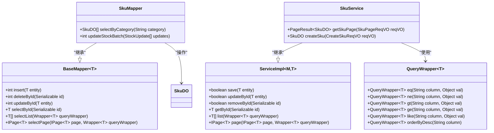

# 技术架构

<cite>
**本文档引用的文件**  
- [pom.xml](file://pom.xml)
- [yudao-dependencies/pom.xml](file://yudao-dependencies/pom.xml)
- [yudao-framework/pom.xml](file://yudao-framework/pom.xml)
- [yudao-server/pom.xml](file://yudao-server/pom.xml)
- [eplus-framework/pom.xml](file://eplus-framework/pom.xml)
- [yudao-spring-boot-starter-web/pom.xml](file://yudao-framework/yudao-spring-boot-starter-web/pom.xml)
- [yudao-spring-boot-starter-security/pom.xml](file://yudao-framework/yudao-spring-boot-starter-security/pom.xml)
- [yudao-spring-boot-starter-mybatis/pom.xml](file://yudao-framework/yudao-spring-boot-starter-mybatis/pom.xml)
- [yudao-spring-boot-starter-data-permission/pom.xml](file://yudao-framework/yudao-spring-boot-starter-data-permission/pom.xml)
- [yudao-framework-business/pom.xml](file://yudao-framework/yudao-framework-business/pom.xml)
- [eplus-module-pms-biz/src/main/java/com/syj/eplus/module/pms/service/package-info.java](file://eplus-module-pms/eplus-module-pms-biz/src/main/java/com/syj/eplus/module/pms/service/package-info.java)
- [eplus-module-pms-biz/src/main/java/com/syj/eplus/module/pms/dal/package-info.java](file://eplus-module-pms/eplus-module-pms-biz/src/main/java/com/syj/eplus/module/pms/dal/package-info.java)
- [eplus-module-pms-api/src/main/java/com/syj/eplus/module/pms/api/package-info.java](file://eplus-module-pms/eplus-module-pms-api/src/main/java/com/syj/eplus/module/pms/api/package-info.java)
- [yudao-module-system-biz/src/main/java/cn/iocoder/yudao/module/system/package-info.java](file://yudao-module-system/yudao-module-system-biz/src/main/java/cn/iocoder/yudao/module/system/package-info.java)
</cite>

## 目录
1. [项目结构](#项目结构)
2. [微服务架构设计](#微服务架构设计)
3. [MVC分层模式实现](#mvc分层模式实现)
4. [模块化架构设计](#模块化架构设计)
5. [Maven BOM依赖管理](#maven-bom依赖管理)
6. [芋道框架基础能力集成](#芋道框架基础能力集成)
7. [MyBatis Plus数据库访问层](#mybatis-plus数据库访问层)
8. [系统部署架构](#系统部署架构)
9. [架构决策权衡](#架构决策权衡)

## 项目结构

eplus-admin-server项目采用多模块Maven架构，通过清晰的模块划分实现功能解耦和职责分离。项目根目录下的pom.xml定义了所有子模块，包括核心框架、业务模块和基础设施组件。

**图示来源**  
- [pom.xml](file://pom.xml#L10-L45)
- [yudao-dependencies/pom.xml](file://yudao-dependencies/pom.xml#L1-L689)

## 微服务架构设计

系统基于Spring Boot构建微服务架构，采用模块化设计模式。每个业务模块（如eplus-module-pms、eplus-module-crm）独立开发、测试和部署，通过API接口进行通信。yudao-server作为主应用容器，通过依赖引入各个业务模块的biz组件，形成完整的后端服务。

架构采用分层设计，从下至上包括：
- 基础设施层：提供数据库、缓存、消息队列等基础服务
- 框架层：提供统一的安全、监控、日志等横切关注点
- 业务逻辑层：实现具体业务功能
- API层：提供RESTful接口供前端调用

**图示来源**  
- [yudao-server/pom.xml](file://yudao-server/pom.xml#L23-L172)
- [pom.xml](file://pom.xml#L10-L45)

## MVC分层模式实现

系统严格遵循MVC（Model-View-Controller）分层模式，但在后端服务中，View层被API响应替代。每个业务模块都实现了清晰的分层结构：

- **Controller层**：处理HTTP请求，进行参数校验和请求转发
- **Service层**：封装业务逻辑，实现核心业务规则
- **DAL层**：数据访问层，负责与数据库交互
- **Model层**：数据模型，包括DO（Data Object）、DTO（Data Transfer Object）等

以eplus-module-pms为例，其分层结构体现在包命名规范中：

**图示来源**  
- [eplus-module-pms-biz/src/main/java/com/syj/eplus/module/pms/service/package-info.java](file://eplus-module-pms/eplus-module-pms-biz/src/main/java/com/syj/eplus/module/pms/service/package-info.java)
- [eplus-module-pms-biz/src/main/java/com/syj/eplus/module/pms/dal/package-info.java](file://eplus-module-pms/eplus-module-pms-biz/src/main/java/com/syj/eplus/module/pms/dal/package-info.java)
- [eplus-module-pms-api/src/main/java/com/syj/eplus/module/pms/api/package-info.java](file://eplus-module-pms/eplus-module-pms-api/src/main/java/com/syj/eplus/module/pms/api/package-info.java)

## 模块化架构设计

系统采用模块化架构设计，将API层与BIZ层分离，实现关注点分离和松耦合。每个业务模块都分为api和biz两个子模块：

- **API模块**：定义接口契约，包含DTO、枚举和API接口定义
- **BIZ模块**：实现业务逻辑，包含Controller、Service、Mapper等实现类

这种设计模式的优势包括：
- **接口稳定性**：API模块作为契约，变更频率低，保证了前后端协作的稳定性
- **实现灵活性**：BIZ模块可以独立重构和优化，不影响接口契约
- **依赖清晰**：BIZ模块依赖API模块，形成清晰的依赖方向
- **可测试性**：业务逻辑与接口解耦，便于单元测试和集成测试

**图示来源**  
- [yudao-server/pom.xml](file://yudao-server/pom.xml#L23-L172)
- [pom.xml](file://pom.xml#L22-L43)

## Maven BOM依赖管理

项目采用Maven BOM（Bill of Materials）机制进行依赖版本管理，确保整个项目依赖的一致性和兼容性。yudao-dependencies模块作为BOM文件，集中管理所有第三方库的版本号。

核心优势包括：
- **版本一致性**：所有模块使用相同的依赖版本，避免版本冲突
- **集中管理**：依赖版本变更只需修改BOM文件，无需逐个修改模块
- **简化配置**：子模块引入依赖时无需指定版本号
- **依赖对齐**：确保Spring Boot及其生态组件的版本兼容性

**图示来源**  
- [yudao-dependencies/pom.xml](file://yudao-dependencies/pom.xml#L17-L76)
- [pom.xml](file://pom.xml#L66-L76)

## 芋道框架基础能力集成

系统集成了"芋道"框架提供的多项基础能力，显著提升了开发效率和系统质量。这些能力通过Spring Boot Starter的形式提供，实现开箱即用。

### 安全能力
集成yudao-spring-boot-starter-security，提供统一的认证授权机制。基于Spring Security实现JWT令牌验证、权限校验和安全过滤。

### 监控能力
集成yudao-spring-boot-starter-monitor，提供链路追踪、性能监控和健康检查。支持SkyWalking集成，实现分布式系统的全链路监控。

### 数据权限
集成yudao-spring-boot-starter-data-permission，实现细粒度的数据权限控制。通过AOP拦截和SQL注入，自动为查询添加数据权限过滤条件。

### 其他基础能力
- **操作日志**：自动记录关键操作日志
- **错误码管理**：统一的错误码体系
- **数据脱敏**：敏感数据自动脱敏
- **IP解析**：客户端IP地理位置解析

**图示来源**  
- [yudao-framework-business/pom.xml](file://yudao-framework/yudao-framework-business/pom.xml#L21-L77)
- [yudao-spring-boot-starter-security/pom.xml](file://yudao-framework/yudao-spring-boot-starter-security/pom.xml#L1-L62)
- [yudao-spring-boot-starter-data-permission/pom.xml](file://yudao-framework/yudao-spring-boot-starter-data-permission/pom.xml#L1-L53)

## MyBatis Plus数据库访问层

系统采用MyBatis Plus作为ORM框架，充分发挥其简化开发、提高效率的优势。通过yudao-spring-boot-starter-mybatis封装，提供统一的数据库访问配置。

### 配置要点
- **通用Mapper**：继承BaseMapper，自动获得CRUD方法
- **分页插件**：集成MyBatis Plus分页插件，简化分页查询
- **自动填充**：实体类字段的创建时间、更新时间自动填充
- **逻辑删除**：支持逻辑删除功能，避免数据物理删除

### 最佳实践
- **Wrapper查询**：使用QueryWrapper、UpdateWrapper构建类型安全的查询条件
- **Service封装**：通过ServiceImpl获得通用业务方法
- **自定义SQL**：复杂查询通过XML或@Select注解实现
- **性能优化**：合理使用缓存、批量操作和连接池配置

**图示来源**  
- [yudao-spring-boot-starter-mybatis/pom.xml](file://yudao-framework/yudao-spring-boot-starter-mybatis/pom.xml#L1-L77)
- [eplus-module-pms-biz/src/main/java/com/syj/eplus/module/pms/dal/package-info.java](file://eplus-module-pms/eplus-module-pms-biz/src/main/java/com/syj/eplus/module/pms/dal/package-info.java)

## 系统部署架构

系统采用现代化的部署架构，支持高可用、可扩展的生产环境部署。架构设计考虑了性能、可靠性和运维便利性。

**图示来源**  
- [yudao-server/pom.xml](file://yudao-server/pom.xml#L174-L196)
- [yudao-spring-boot-starter-redis/pom.xml](file://yudao-framework/yudao-spring-boot-starter-redis/pom.xml)
- [yudao-spring-boot-starter-mybatis/pom.xml](file://yudao-framework/yudao-spring-boot-starter-mybatis/pom.xml)

## 架构决策权衡

在架构设计过程中，团队在性能、可维护性和扩展性之间进行了深入的权衡考量：

### 性能考量
- **缓存策略**：合理使用Redis缓存热点数据，减少数据库压力
- **连接池配置**：优化Druid连接池参数，提高数据库连接效率
- **异步处理**：对非关键路径操作采用异步处理，提高响应速度
- **索引优化**：为常用查询字段建立适当索引，提升查询性能

### 可维护性
- **模块化设计**：清晰的模块划分，降低代码耦合度
- **统一规范**：遵循一致的编码规范和设计模式
- **文档齐全**：完善的API文档和架构说明
- **自动化测试**：覆盖单元测试、集成测试和端到端测试

### 扩展性
- **微服务架构**：模块独立部署，便于水平扩展
- **配置中心**：支持动态配置更新，无需重启服务
- **消息队列**：通过RocketMQ实现服务解耦和流量削峰
- **多数据源**：支持读写分离和多数据库实例

这些架构决策确保了系统在满足当前业务需求的同时，具备良好的演进能力，能够适应未来业务发展的需要。

**图示来源**  
- [yudao-spring-boot-starter-protection/pom.xml](file://yudao-framework/yudao-spring-boot-starter-protection/pom.xml)
- [yudao-spring-boot-starter-mq/pom.xml](file://yudao-framework/yudao-spring-boot-starter-mq/pom.xml)
- [yudao-spring-boot-starter-job/pom.xml](file://yudao-framework/yudao-spring-boot-starter-job/pom.xml)