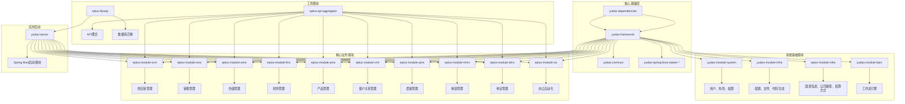
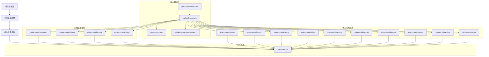
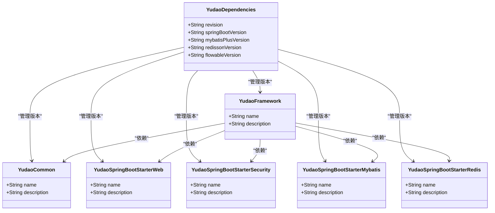
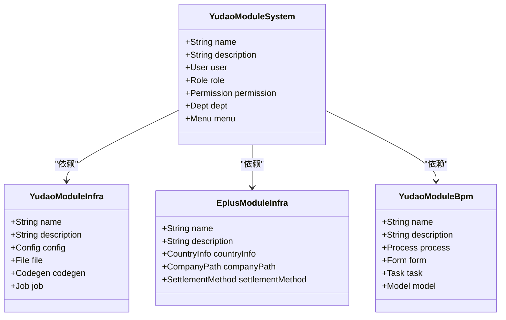
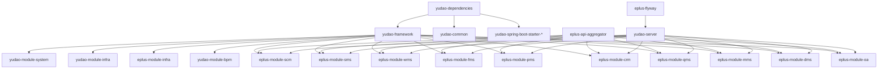

# 整体架构

<cite>
**本文档引用的文件**   
- [pom.xml](file://pom.xml)
- [yudao-dependencies/pom.xml](file://yudao-dependencies/pom.xml)
- [yudao-server/pom.xml](file://yudao-server/pom.xml)
- [yudao-server/src/main/java/cn/iocoder/yudao/server/YudaoServerApplication.java](file://yudao-server/src/main/java/cn/iocoder/yudao/server/YudaoServerApplication.java)
- [yudao-framework/yudao-framework-core/pom.xml](file://yudao-framework/yudao-framework-core/pom.xml)
- [yudao-framework/yudao-framework-business/pom.xml](file://yudao-framework/yudao-framework-business/pom.xml)
- [yudao-framework/yudao-framework-integration/pom.xml](file://yudao-framework/yudao-framework-integration/pom.xml)
- [yudao-framework/yudao-framework-monitor/pom.xml](file://yudao-framework/yudao-framework-monitor/pom.xml)
- [eplus-module-scm/eplus-module-scm-biz/pom.xml](file://eplus-module-scm/eplus-module-scm-biz/pom.xml)
- [yudao-module-system/yudao-module-system-api/pom.xml](file://yudao-module-system/yudao-module-system-api/pom.xml)
- [yudao-module-system/yudao-module-system-biz/pom.xml](file://yudao-module-system/yudao-module-system-biz/pom.xml)
- [README.md](file://README.md)
</cite>

## 目录
1. [简介](#简介)
2. [项目结构](#项目结构)
3. [核心组件](#核心组件)
4. [架构概述](#架构概述)
5. [详细组件分析](#详细组件分析)
6. [依赖分析](#依赖分析)
7. [性能考虑](#性能考虑)
8. [故障排除指南](#故障排除指南)
9. [结论](#结论)

## 简介
eplus-admin-server 是一个基于 Spring Boot 的企业级 ERP 管理系统，涵盖供应链、销售、仓储、财务、CRM 等多个业务领域。该项目基于优秀的开源框架 ruoyi-vue-pro 进行深度定制开发，采用主流技术栈，提供完整的权限管理、工作流审批、数据权限控制等企业级特性。

## 项目结构
eplus-admin-server 采用模块化设计，分为核心基础层、系统基础模块和核心业务模块三层架构体系。项目通过 Maven 进行依赖管理，使用 BOM（Bill of Materials）模式统一管理所有依赖版本。

**图示来源**
- [README.md](file://README.md)

**本节来源**
- [README.md](file://README.md)
- [pom.xml](file://pom.xml)

## 核心组件
eplus-admin-server 的核心组件包括核心基础层、系统基础模块和核心业务模块。核心基础层提供通用的技术支撑，系统基础模块提供通用的业务功能，核心业务模块实现具体的业务逻辑。

**本节来源**
- [README.md](file://README.md)
- [pom.xml](file://pom.xml)

## 架构概述
eplus-admin-server 采用基于 Spring Boot 的微服务架构设计，分为三层架构体系：核心基础层、系统基础模块和核心业务模块。核心基础层提供通用的技术支撑，包括依赖管理、框架集成、监控组件等；系统基础模块提供通用的业务功能，如用户管理、权限控制、工作流引擎等；核心业务模块实现具体的业务逻辑，如供应链管理、销售管理、仓储管理等。

**图示来源**
- [README.md](file://README.md)

**本节来源**
- [README.md](file://README.md)
- [pom.xml](file://pom.xml)

## 详细组件分析
### 核心基础层分析
核心基础层由 yudao-dependencies、yudao-framework、yudao-common 和多个 yudao-spring-boot-starter 组件构成。yudao-dependencies 作为 BOM 文件，统一管理所有依赖版本；yudao-framework 提供框架集成；yudao-common 提供通用工具类；yudao-spring-boot-starter 系列组件提供各种功能的自动配置。

#### 核心基础层组件关系

**图示来源**
- [yudao-dependencies/pom.xml](file://yudao-dependencies/pom.xml)
- [yudao-framework/pom.xml](file://yudao-framework/pom.xml)

**本节来源**
- [yudao-dependencies/pom.xml](file://yudao-dependencies/pom.xml)
- [yudao-framework/pom.xml](file://yudao-framework/pom.xml)

### 系统基础模块分析
系统基础模块包括 yudao-module-system、yudao-module-infra、eplus-module-infra 和 yudao-module-bpm。这些模块提供通用的业务功能，如用户管理、权限控制、工作流引擎等。

#### 系统基础模块组件关系

**图示来源**
- [yudao-module-system/pom.xml](file://yudao-module-system/pom.xml)
- [yudao-module-infra/pom.xml](file://yudao-module-infra/pom.xml)
- [eplus-module-infra/pom.xml](file://eplus-module-infra/pom.xml)
- [yudao-module-bpm/pom.xml](file://yudao-module-bpm/pom.xml)

**本节来源**
- [yudao-module-system/pom.xml](file://yudao-module-system/pom.xml)
- [yudao-module-infra/pom.xml](file://yudao-module-infra/pom.xml)
- [eplus-module-infra/pom.xml](file://eplus-module-infra/pom.xml)
- [yudao-module-bpm/pom.xml](file://yudao-module-bpm/pom.xml)

### 核心业务模块分析
核心业务模块包括 eplus-module-scm、eplus-module-sms、eplus-module-wms、eplus-module-fms、eplus-module-pms、eplus-module-crm、eplus-module-qms、eplus-module-mms、eplus-module-dms 和 eplus-module-oa。这些模块实现具体的业务逻辑。

#### 核心业务模块组件关系

```mermaid
classDiagram
class EplusModuleScm {
+String name
+String description
+PurchaseContract purchaseContract
+Vendor vendor
+PurchasePlan purchasePlan
+PaymentApply paymentApply
+InvoicingNotices invoicingNotices
}
class EplusModuleSms {
+String name
+String description
+SaleContract saleContract
+SaleAuxiliaryAllocation saleAuxiliaryAllocation
+AddSubItem addSubItem
}
class EplusModuleWms {
+String name
+String description
+Stock stock
+StockNotice stockNotice
+Warehouse warehouse
}
class EplusModuleFms {
+String name
+String description
+Payment payment
+Receipt receipt
+CustClaim custClaim
}
class EplusModulePms {
+String name
+String description
+Sku sku
+Category category
+PackageType packageType
}
class EplusModuleCrm {
+String name
+String description
+Customer customer
+Opportunity opportunity
+Service service
}
class EplusModuleQms {
+String name
+String description
+QualityInspection qualityInspection
+InspectionItem inspectionItem
}
class EplusModuleMms {
+String name
+String description
+Manufacture manufacture
+ManufactureSku manufactureSku
+ManufactureSkuItem manufactureSkuItem
}
class EplusModuleDms {
+String name
+String description
+Shipment shipment
+ForwarderFee forwarderFee
}
class EplusModuleOa {
+String name
+String description
+Reimb reimb
+TravelApp travelApp
+LoanApp loanApp
+PaymentApp paymentApp
+Feeshare feeshare
}
EplusModuleScm --> EplusModuleSms : "依赖"
EplusModuleSms --> EplusModuleWms : "依赖"
EplusModuleWms --> EplusModuleFms : "依赖"
EplusModuleFms --> EplusModulePms : "依赖"
EplusModulePms --> EplusModuleCrm : "依赖"
EplusModuleCrm --> EplusModuleQms : "依赖"
EplusModuleQms --> EplusModuleMms : "依赖"
EplusModuleMms --> EplusModuleDms : "依赖"
EplusModuleDms --> EplusModuleOa : "依赖"
```

**图示来源**
- [eplus-module-scm/pom.xml](file://eplus-module-scm/pom.xml)
- [eplus-module-sms/pom.xml](file://eplus-module-sms/pom.xml)
- [eplus-module-wms/pom.xml](file://eplus-module-wms/pom.xml)
- [eplus-module-fms/pom.xml](file://eplus-module-fms/pom.xml)
- [eplus-module-pms/pom.xml](file://eplus-module-pms/pom.xml)
- [eplus-module-crm/pom.xml](file://eplus-module-crm/pom.xml)
- [eplus-module-qms/pom.xml](file://eplus-module-qms/pom.xml)
- [eplus-module-mms/pom.xml](file://eplus-module-mms/pom.xml)
- [eplus-module-dms/pom.xml](file://eplus-module-dms/pom.xml)
- [eplus-module-oa/pom.xml](file://eplus-module-oa/pom.xml)

**本节来源**
- [eplus-module-scm/pom.xml](file://eplus-module-scm/pom.xml)
- [eplus-module-sms/pom.xml](file://eplus-module-sms/pom.xml)
- [eplus-module-wms/pom.xml](file://eplus-module-wms/pom.xml)
- [eplus-module-fms/pom.xml](file://eplus-module-fms/pom.xml)
- [eplus-module-pms/pom.xml](file://eplus-module-pms/pom.xml)
- [eplus-module-crm/pom.xml](file://eplus-module-crm/pom.xml)
- [eplus-module-qms/pom.xml](file://eplus-module-qms/pom.xml)
- [eplus-module-mms/pom.xml](file://eplus-module-mms/pom.xml)
- [eplus-module-dms/pom.xml](file://eplus-module-dms/pom.xml)
- [eplus-module-oa/pom.xml](file://eplus-module-oa/pom.xml)

## 依赖分析
eplus-admin-server 采用 Maven 进行依赖管理，通过 BOM（Bill of Materials）模式统一管理所有依赖版本。项目结构清晰，各模块职责分明，通过 API 层和 BIZ 层分离，便于跨模块调用。

**图示来源**
- [pom.xml](file://pom.xml)
- [yudao-dependencies/pom.xml](file://yudao-dependencies/pom.xml)

**本节来源**
- [pom.xml](file://pom.xml)
- [yudao-dependencies/pom.xml](file://yudao-dependencies/pom.xml)

## 性能考虑
eplus-admin-server 在性能方面做了多项优化，包括数据库连接池优化、Redis 缓存、异步任务处理等。通过 Druid 监控慢 SQL，添加合适的索引，避免 N+1 查询。使用 Redis 缓存热点数据，进行缓存预热，防止缓存穿透和雪崩。通过异步处理发送通知等耗时操作，提高系统响应速度。

**本节来源**
- [README.md](file://README.md)

## 故障排除指南
### 启动问题
- **问题**: 启动时报错 "Cannot determine embedded database driver class"
- **解决方案**: 检查数据库配置是否正确，确保 MySQL 已启动

- **问题**: Redis 连接失败
- **解决方案**: 检查 Redis 是否启动，端口和密码是否正确

- **问题**: 工作流图显示异常
- **解决方案**: 检查前端静态资源是否正确加载

- **问题**: Flyway 迁移失败
- **解决方案**: 检查版本号是否连续，是否有脚本执行错误

**本节来源**
- [README.md](file://README.md)

## 结论
eplus-admin-server 采用基于 Spring Boot 的微服务架构设计，分为核心基础层、系统基础模块和核心业务模块三层架构体系。通过模块化设计，各模块职责分明，便于维护和扩展。项目使用 BOM 模式统一管理依赖版本，确保依赖一致性。通过 API 层和 BIZ 层分离，便于跨模块调用。整体架构设计合理，具有良好的可维护性和扩展性。