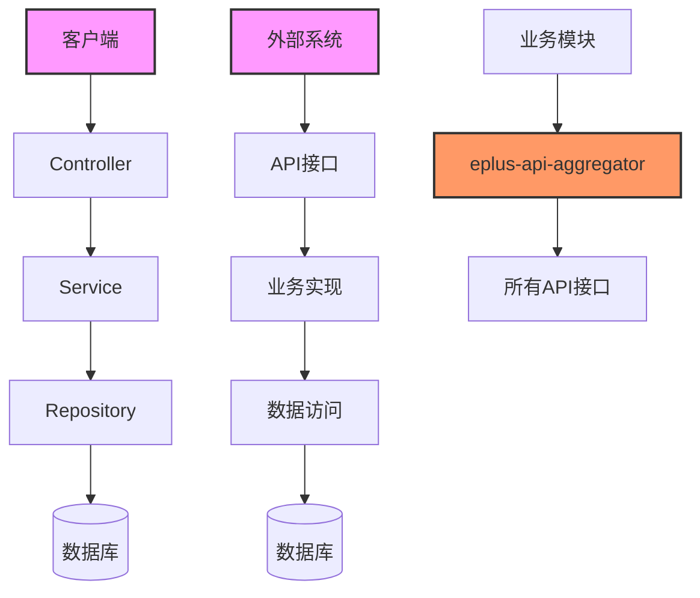
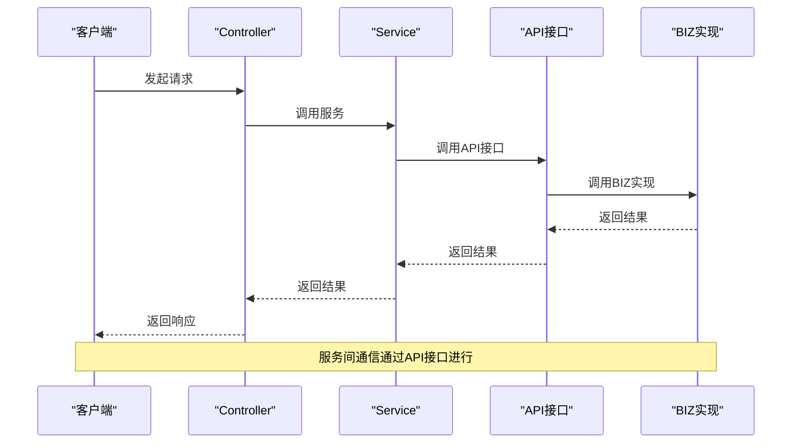

# API聚合模式

<cite>
**本文档引用的文件**
- [eplus-api-aggregator/pom.xml](file://eplus-api-aggregator/pom.xml)
- [README.md](file://README.md)
- [eplus-module-dms-api/src/main/java/com/syj/eplus/module/dms/enums/ErrorCodeConstants.java](file://eplus-module-dms/eplus-module-dms-api/src/main/java/com/syj/eplus/module/dms/enums/ErrorCodeConstants.java)
- [eplus-module-pms-api/src/main/java/com/syj/eplus/module/pms/api/Category/CategoryApi.java](file://eplus-module-pms/eplus-module-pms-api/src/main/java/com/syj/eplus/module/pms/api/Category/CategoryApi.java)
- [eplus-module-sms-api/src/main/java/com/syj/eplus/module/sms/api/SaleContractApi.java](file://eplus-module-sms/eplus-module-sms-api/src/main/java/com/syj/eplus/module/sms/api/SaleContractApi.java)
- [eplus-module-exms-biz/pom.xml](file://eplus-module-exms/eplus-module-exms-biz/pom.xml)
- [eplus-module-pjms-biz/pom.xml](file://eplus-module-pjms/eplus-module-pjms-biz/pom.xml)
</cite>

## 目录
1. [引言](#引言)
2. [项目结构](#项目结构)
3. [核心组件](#核心组件)
4. [架构概述](#架构概述)
5. [详细组件分析](#详细组件分析)
6. [依赖分析](#依赖分析)
7. [性能考虑](#性能考虑)
8. [故障排除指南](#故障排除指南)
9. [结论](#结论)

## 引言
本文档详细阐述了eplus-admin-server项目的API聚合模式，重点分析了API层与BIZ层分离的设计模式。通过这种分层架构，系统实现了模块间的解耦，提高了可维护性和扩展性。文档将深入探讨eplus-api-aggregator模块如何聚合所有业务模块的API接口，简化模块间的依赖关系，并分析API模块中仅包含DTO、VO、接口定义的设计原则。

## 项目结构
eplus-admin-server项目采用模块化设计，每个业务模块都分为API和BIZ两个子模块。API模块包含接口定义、DTO、VO和枚举等，而BIZ模块包含具体的业务实现。这种分离设计使得模块间的依赖更加清晰，降低了耦合度。

```mermaid
graph TB
subgraph "API层"
API_Aggregator[eplus-api-aggregator]
System_API[yudao-module-system-api]
Infra_API[yudao-module-infra-api]
BPM_API[yudao-module-bpm-api]
Eplus_Infra_API[eplus-module-infra-api]
SCM_API[eplus-module-scm-api]
PMS_API[eplus-module-pms-api]
WMS_API[eplus-module-wms-api]
SMS_API[eplus-module-sms-api]
CRM_API[eplus-module-crm-api]
FMS_API[eplus-module-fms-api]
QMS_API[eplus-module-qms-api]
DMS_API[eplus-module-dms-api]
OA_API[eplus-module-oa-api]
HOME_API[eplus-module-home-api]
EMS_API[eplus-module-ems-api]
MMS_API[eplus-module-mms-api]
EXMS_API[eplus-module-exms-api]
PJMS_API[eplus-module-pjms-api]
DTMS_API[eplus-module-dtms-api]
DPMS_API[eplus-module-dpms-api]
REPORT_API[eplus-module-report-api]
end
subgraph "BIZ层"
SCM_BIZ[eplus-module-scm-biz]
PMS_BIZ[eplus-module-pms-biz]
WMS_BIZ[eplus-module-wms-biz]
SMS_BIZ[eplus-module-sms-biz]
CRM_BIZ[eplus-module-crm-biz]
FMS_BIZ[eplus-module-fms-biz]
QMS_BIZ[eplus-module-qms-biz]
DMS_BIZ[eplus-module-dms-biz]
OA_BIZ[eplus-module-oa-biz]
HOME_BIZ[eplus-module-home-biz]
EMS_BIZ[eplus-module-ems-biz]
MMS_BIZ[eplus-module-mms-biz]
EXMS_BIZ[eplus-module-exms-biz]
PJMS_BIZ[eplus-module-pjms-biz]
DTMS_BIZ[eplus-module-dtms-biz]
DPMS_BIZ[eplus-module-dpms-biz]
REPORT_BIZ[eplus-module-report-biz]
end
API_Aggregator --> System_API
API_Aggregator --> Infra_API
API_Aggregator --> BPM_API
API_Aggregator --> Eplus_Infra_API
API_Aggregator --> SCM_API
API_Aggregator --> PMS_API
API_Aggregator --> WMS_API
API_Aggregator --> SMS_API
API_Aggregator --> CRM_API
API_Aggregator --> FMS_API
API_Aggregator --> QMS_API
API_Aggregator --> DMS_API
API_Aggregator --> OA_API
API_Aggregator --> HOME_API
API_Aggregator --> EMS_API
API_Aggregator --> MMS_API
API_Aggregator --> EXMS_API
API_Aggregator --> PJMS_API
API_Aggregator --> DTMS_API
API_Aggregator --> DPMS_API
API_Aggregator --> REPORT_API
SCM_BIZ --> API_Aggregator
PMS_BIZ --> API_Aggregator
WMS_BIZ --> API_Aggregator
SMS_BIZ --> API_Aggregator
CRM_BIZ --> API_Aggregator
FMS_BIZ --> API_Aggregator
QMS_BIZ --> API_Aggregator
DMS_BIZ --> API_Aggregator
OA_BIZ --> API_Aggregator
HOME_BIZ --> API_Aggregator
EMS_BIZ --> API_Aggregator
MMS_BIZ --> API_Aggregator
EXMS_BIZ --> API_Aggregator
PJMS_BIZ --> API_Aggregator
DTMS_BIZ --> API_Aggregator
DPMS_BIZ --> API_Aggregator
REPORT_BIZ --> API_Aggregator
style API_Aggregator fill:#f9f,stroke:#333,stroke-width:2px
style SCM_BIZ fill:#bbf,stroke:#333,stroke-width:2px
style PMS_BIZ fill:#bbf,stroke:#333,stroke-width:2px
style WMS_BIZ fill:#bbf,stroke:#333,stroke-width:2px
style SMS_BIZ fill:#bbf,stroke:#333,stroke-width:2px
style CRM_BIZ fill:#bbf,stroke:#333,stroke-width:2px
style FMS_BIZ fill:#bbf,stroke:#333,stroke-width:2px
style QMS_BIZ fill:#bbf,stroke:#333,stroke-width:2px
style DMS_BIZ fill:#bbf,stroke:#333,stroke-width:2px
style OA_BIZ fill:#bbf,stroke:#333,stroke-width:2px
style HOME_BIZ fill:#bbf,stroke:#333,stroke-width:2px
style EMS_BIZ fill:#bbf,stroke:#333,stroke-width:2px
style MMS_BIZ fill:#bbf,stroke:#333,stroke-width:2px
style EXMS_BIZ fill:#bbf,stroke:#333,stroke-width:2px
style PJMS_BIZ fill:#bbf,stroke:#333,stroke-width:2px
style DTMS_BIZ fill:#bbf,stroke:#333,stroke-width:2px
style DPMS_BIZ fill:#bbf,stroke:#333,stroke-width:2px
style REPORT_BIZ fill:#bbf,stroke:#333,stroke-width:2px
```

**图示来源**
- [eplus-api-aggregator/pom.xml](file://eplus-api-aggregator/pom.xml)
- [README.md](file://README.md)

**本节来源**
- [README.md](file://README.md)

## 核心组件
eplus-admin-server的核心组件包括eplus-api-aggregator模块和各个业务模块的API与BIZ子模块。eplus-api-aggregator模块作为API聚合中心，统一管理所有业务模块的API依赖，简化了模块间的依赖声明。

**本节来源**
- [eplus-api-aggregator/pom.xml](file://eplus-api-aggregator/pom.xml)
- [README.md](file://README.md)

## 架构概述
eplus-admin-server采用分层架构设计，将API层与BIZ层分离。API层包含接口定义、DTO、VO和枚举等，而BIZ层包含具体的业务实现。这种设计模式具有以下优势：

1. **降低耦合度**：API层与BIZ层分离，使得模块间的依赖更加清晰，降低了耦合度。
2. **提高可维护性**：API层的接口定义独立于具体的业务实现，便于维护和升级。
3. **简化依赖管理**：通过eplus-api-aggregator模块，业务模块只需引入一个依赖即可获得所有API，简化了依赖管理。

**图示来源**
- [eplus-api-aggregator/pom.xml](file://eplus-api-aggregator/pom.xml)
- [README.md](file://README.md)

**本节来源**
- [README.md](file://README.md)

## 详细组件分析
### API层与BIZ层分离设计
eplus-admin-server采用API层与BIZ层分离的设计模式，将接口定义与业务实现分离。API层包含接口定义、DTO、VO和枚举等，而BIZ层包含具体的业务实现。这种设计模式使得模块间的依赖更加清晰，降低了耦合度。

#### API模块设计原则
API模块中仅包含DTO、VO、接口定义，不包含任何业务逻辑。这种设计原则确保了API层的纯粹性，便于跨模块调用。

```mermaid
classDiagram
class SaleContractApi {
+getSaleContractById(id)
+getAddSubItemListByContractCodeList(saleContractCodeList)
+batchUpdateAddSubItem(addSubItemDTOList)
+updateShipmentQuantity(shipmentQuantityMap, cancelFlag)
+writeBackContract(writeBackDTOList, rollbackFlag)
+getSmsByCodeList(codeList)
+getUnCompletedSaleContractByCustCode(custCode)
+getUnCompletedSaleContractBySkuCode(skuCode)
+updateConfirmFlag(confirmFlag, id)
+updateCust(custId, custName, custCode)
+getConfirmSourceList(targetCode, effectRangeType)
+updateChangeConfirmFlag(effectRangeType, code)
+generateContract(contractId, planId, planCode, realPurchasePriceMap, itemCodeList)
+syncSaleItemLockInfo(skuLockInfoMap)
+generateSaleContract(contractSaveDTO)
+getHistoryTradeList(code)
+batchUpdateBillStatus(billSimpleDTOList)
+updateSaleItemBillStatus(saleContractId, saleItemUniqueCode, saleItemBillStatus)
+getSaleContractInfo(saleContractId)
+getCompanyPathBySaleContractCodeList(saleContractCodes)
+getSimpleSaleContractData(sourceSaleContractCode, conpanyId)
+getBatchSimpleSaleContractData(contractCodeList, conpanyId, isSale)
+listSaleContractItem(saleContractItemIdList)
+updateItemWithTaxPriceAndManager(withTaxPriceMap, manager)
+calcRealPurchasePrice(saleItems)
+updateRealPurchasePrice(saleItemIds, manager, purchaseUserId)
+getSaleContractInfoByCode(saleContractCode)
+validateCompanyPath(contractCodeList)
+getLinkCodeMap(saleContractCodeList)
+batchUpdateShipmentTotalQuantity(dtoList)
+getItemListByIds(saleIdList)
+updateSaleItemPurchaseFlag(itemIds, purchaseFlag)
+getUnCompletedSaleContractBySaleContractCode(saleContractCode)
+deleteAutoSaleContract(sourceSaleContractCode)
+batchUpdateConvertShipmentFlag(shippingQuantityMap)
+updateShipmentDate(smsContractCodeList, dateTypes)
+getCompanyIdListBySaleContractCodeList(saleContractCodeList)
+setReLockFlag(saleItemIdList, reLockFlag)
+setShipmentQuantity(itemQuantityMap)
+batchUpdateShippedQuantity(shippedQuantityMap)
+batchUpdateTransformShippedQuantity(transformShippedQuantityMap)
+checkCollectionPlan(saleContractCode, isPurchase, needSum)
+getItemListByUniqueCodes(saleUniqueCodeList)
+getItemCodesByIds(itemIds)
+splitSaleContractItem(saleItemQuantity)
+updateShipmentedQuantity(closeReq)
+rollbackSaleContractItemSplitList(splitList)
+genInternalContract(saleItemMap, shipmentPurchaseMap, genContractUniqueCode, simpleShipmentMap)
+getManufactureCompanyIdByItemId(saleContractItemId)
+getShipmentPriceBySaleContractCode(saleContractCodeList)
+rollbackSaleContractItemPurchaseQuantity(purchaseQuantityMap)
+reLockStock(saleContractItemIdList)
+getSaleContractItemById(saleContractItemId)
+deleteSplitSaleItem(saleContractItemIdList)
+rollbackSaleContractItemSourceList(saleContractItemIdList)
+deleteGenContract(genContractUniqueCode)
+getSaleContractItemIdMap(saleContractItemIdList)
+getSaleItemUniqueCodeMap(saleContractItemIdList)
+getSaleContractItemSplitPurchaseMap(saleContractItemIdList)
+getCollectionCalimAmountMap(collectionIdList)
+getUnTransformShipmentedQuantityMap(itemIds)
+rollBackTransformShipmentedQuantityByChange(updateQuantityMap, isAddFlag)
+genInternalContractByOutBill(saleItemMap, genContractUniqueCode)
+getCompanyPathMapBySaleContractCodeList(saleContractCodes)
+batchUpdatePurchaseUser(saleContractCodeSet)
+rewritePurchaseFreeQuantity(freeQUantityMap, isConcel)
+getSalesByContractCodeSet(contractCodeList)
+updateLinkCodeList(linkCodeMap)
+updateShipmentTotalQuantity(shipmentTotalQuantityMap, isDeletedFlag)
+getSaleContractItemAmountMap(saleContractItemIdList)
+getSalePurchaseAndStockQuantityMap(itemIds)
+validateCustExists(custCode)
+getRealPurchasePriceMapByItemIds(itemIds)
+getSaleItemSaleType(itemIds)
}
class SimpleCategoryDTO {
+id : Long
+name : String
+code : String
}
class CategoryApi {
+getListByIdList(list)
}
SaleContractApi <|-- CategoryApi
CategoryApi --> SimpleCategoryDTO
```

**图示来源**
- [eplus-module-sms-api/src/main/java/com/syj/eplus/module/sms/api/SaleContractApi.java](file://eplus-module-sms/eplus-module-sms-api/src/main/java/com/syj/eplus/module/sms/api/SaleContractApi.java)
- [eplus-module-pms-api/src/main/java/com/syj/eplus/module/pms/api/Category/CategoryApi.java](file://eplus-module-pms/eplus-module-pms-api/src/main/java/com/syj/eplus/module/pms/api/Category/CategoryApi.java)
- [eplus-module-pms-api/src/main/java/com/syj/eplus/module/pms/api/Category/dto/SimpleCategoryDTO.java](file://eplus-module-pms/eplus-module-pms-api/src/main/java/com/syj/eplus/module/pms/api/Category/dto/SimpleCategoryDTO.java)

**本节来源**
- [eplus-module-sms-api/src/main/java/com/syj/eplus/module/sms/api/SaleContractApi.java](file://eplus-module-sms/eplus-module-sms-api/src/main/java/com/syj/eplus/module/sms/api/SaleContractApi.java)
- [eplus-module-pms-api/src/main/java/com/syj/eplus/module/pms/api/Category/CategoryApi.java](file://eplus-module-pms/eplus-module-pms-api/src/main/java/com/syj/eplus/module/pms/api/Category/CategoryApi.java)

### eplus-api-aggregator模块分析
eplus-api-aggregator模块作为API聚合中心，统一管理所有业务模块的API依赖。通过引入eplus-api-aggregator模块，业务模块可以简化依赖声明，只需引入一个依赖即可获得所有API。

```mermaid
flowchart TD
A[eplus-api-aggregator] --> B[yudao-module-system-api]
A --> C[yudao-module-infra-api]
A --> D[yudao-module-bpm-api]
A --> E[eplus-module-infra-api]
A --> F[eplus-module-scm-api]
A --> G[eplus-module-pms-api]
A --> H[eplus-module-wms-api]
A --> I[eplus-module-sms-api]
A --> J[eplus-module-crm-api]
A --> K[eplus-module-fms-api]
A --> L[eplus-module-qms-api]
A --> M[eplus-module-dms-api]
A --> N[eplus-module-oa-api]
A --> O[eplus-module-home-api]
A --> P[eplus-module-ems-api]
A --> Q[eplus-module-mms-api]
A --> R[eplus-module-exms-api]
A --> S[eplus-module-pjms-api]
A --> T[eplus-module-dtms-api]
A --> U[eplus-module-dpms-api]
A --> V[eplus-module-report-api]
W[eplus-module-scm-biz] --> A
X[eplus-module-pms-biz] --> A
Y[eplus-module-wms-biz] --> A
Z[eplus-module-sms-biz] --> A
style A fill:#f96,stroke:#333,stroke-width:2px
style W fill:#bbf,stroke:#333,stroke-width:2px
style X fill:#bbf,stroke:#333,stroke-width:2px
style Y fill:#bbf,stroke:#333,stroke-width:2px
style Z fill:#bbf,stroke:#333,stroke-width:2px
```

**图示来源**
- [eplus-api-aggregator/pom.xml](file://eplus-api-aggregator/pom.xml)

**本节来源**
- [eplus-api-aggregator/pom.xml](file://eplus-api-aggregator/pom.xml)

### 接口调用示例
以下是一个服务间通信的实现方式示例：

**图示来源**
- [eplus-module-sms-api/src/main/java/com/syj/eplus/module/sms/api/SaleContractApi.java](file://eplus-module-sms/eplus-module-sms-api/src/main/java/com/syj/eplus/module/sms/api/SaleContractApi.java)
- [eplus-module-sms-biz/src/main/java/com/syj/eplus/module/sms/api/SaleContractApiImpl.java](file://eplus-module-sms/eplus-module-sms-biz/src/main/java/com/syj/eplus/module/sms/api/SaleContractApiImpl.java)

**本节来源**
- [eplus-module-sms-api/src/main/java/com/syj/eplus/module/sms/api/SaleContractApi.java](file://eplus-module-sms/eplus-module-sms-api/src/main/java/com/syj/eplus/module/sms/api/SaleContractApi.java)

## 依赖分析
eplus-admin-server项目通过eplus-api-aggregator模块统一管理所有业务模块的API依赖。业务模块只需引入eplus-api-aggregator模块，即可获得所有API，简化了依赖管理。

**图示来源**
- [eplus-api-aggregator/pom.xml](file://eplus-api-aggregator/pom.xml)
- [eplus-module-exms-biz/pom.xml](file://eplus-module-exms/eplus-module-exms-biz/pom.xml)
- [eplus-module-pjms-biz/pom.xml](file://eplus-module-pjms/eplus-module-pjms-biz/pom.xml)

**本节来源**
- [eplus-api-aggregator/pom.xml](file://eplus-api-aggregator/pom.xml)
- [eplus-module-exms-biz/pom.xml](file://eplus-module-exms/eplus-module-exms-biz/pom.xml)
- [eplus-module-pjms-biz/pom.xml](file://eplus-module-pjms/eplus-module-pjms-biz/pom.xml)

## 性能考虑
在API聚合模式下，由于API层与BIZ层分离，服务间通信需要通过API接口进行。这可能会引入一定的性能开销。为了优化性能，可以采取以下措施：

1. **缓存机制**：对于频繁访问的数据，可以使用缓存机制减少数据库访问。
2. **异步处理**：对于耗时较长的操作，可以采用异步处理方式，提高响应速度。
3. **批量操作**：对于批量数据处理，可以采用批量操作方式，减少网络开销。

## 故障排除指南
在使用API聚合模式时，可能会遇到以下常见问题：

1. **依赖冲突**：由于eplus-api-aggregator模块聚合了所有API依赖，可能会出现版本冲突。解决方法是统一管理依赖版本。
2. **接口不一致**：由于API层与BIZ层分离，可能会出现接口定义与实现不一致的情况。解决方法是加强接口文档管理。
3. **性能问题**：服务间通信可能会引入性能开销。解决方法是优化通信方式，如使用缓存、异步处理等。

**本节来源**
- [eplus-api-aggregator/pom.xml](file://eplus-api-aggregator/pom.xml)
- [README.md](file://README.md)

## 结论
eplus-admin-server项目通过API聚合模式实现了API层与BIZ层的分离，提高了系统的可维护性和扩展性。eplus-api-aggregator模块作为API聚合中心，统一管理所有业务模块的API依赖，简化了依赖管理。通过这种设计模式，系统实现了模块间的解耦，降低了耦合度，为系统的长期发展奠定了坚实的基础。