# 服务间通信机制

<cite>
**本文档引用文件**   
- [eplus-api-aggregator/pom.xml](file://eplus-api-aggregator/pom.xml)
- [eplus-module-scm-biz/pom.xml](file://eplus-module-scm/eplus-module-scm-biz/pom.xml)
- [eplus-module-sms-api/src/main/java/com/syj/eplus/module/sms/api/SaleContractApi.java](file://eplus-module-sms/eplus-module-sms-api/src/main/java/com/syj/eplus/module/sms/api/SaleContractApi.java)
- [eplus-module-scm-biz/src/main/java/com/syj/eplus/module/scm/api/PurchaseContractApiImpl.java](file://eplus-module-scm/eplus-module-scm-biz/src/main/java/com/syj/eplus/module/scm/api/PurchaseContractApiImpl.java)
- [eplus-module-scm-biz/src/main/java/com/syj/eplus/module/scm/service/purchasecontract/PurchaseContractServiceImpl.java](file://eplus-module-scm/eplus-module-scm-biz/src/main/java/com/syj/eplus/module/scm/service/purchasecontract/PurchaseContractServiceImpl.java)
- [eplus-module-crm-biz/src/main/java/com/syj/eplus/module/crm/api/CustApiImpl.java](file://eplus-module-crm/eplus-module-crm-biz/src/main/java/com/syj/eplus/module/crm/api/CustApiImpl.java)
- [README.md](file://README.md)
</cite>

## 目录
1. [引言](#引言)
2. [项目结构](#项目结构)
3. [核心组件](#核心组件)
4. [架构概述](#架构概述)
5. [详细组件分析](#详细组件分析)
6. [依赖分析](#依赖分析)
7. [性能考虑](#性能考虑)
8. [故障排除指南](#故障排除指南)
9. [结论](#结论)

## 引言
本项目采用模块化架构设计，通过清晰的分层和依赖管理实现服务间的高效通信。系统基于Spring Boot框架，利用Maven进行依赖管理，通过API聚合模块简化跨模块调用。各业务模块独立开发，通过定义良好的API接口进行通信，实现了高内聚、低耦合的系统架构。

## 项目结构
项目采用多模块Maven结构，分为核心基础层、系统基础模块、核心业务模块、工具模块和应用启动模块。这种分层架构使得各模块职责清晰，便于维护和扩展。

**图表来源**
- [README.md](file://README.md#L62-L179)

**本节来源**
- [README.md](file://README.md#L62-L179)

## 核心组件
项目的核心组件包括API聚合模块、各业务模块的API和BIZ实现，以及基础框架组件。API聚合模块统一管理所有业务模块的API依赖，简化了业务模块的依赖声明。

**本节来源**
- [eplus-api-aggregator/pom.xml](file://eplus-api-aggregator/pom.xml#L1-L151)
- [eplus-module-scm-biz/pom.xml](file://eplus-module-scm/eplus-module-scm-biz/pom.xml#L1-L74)

## 架构概述
系统采用分层架构，通过API聚合模块实现服务间通信。各业务模块通过依赖API聚合模块，获得所有其他模块的API接口，实现服务调用。

**图表来源**
- [README.md](file://README.md#L183-L257)

**本节来源**
- [README.md](file://README.md#L183-L257)

## 详细组件分析

### API聚合模块分析
API聚合模块是服务间通信的核心，它统一聚合所有业务模块的API，简化了业务模块的依赖管理。

```mermaid
classDiagram
class eplus_api_aggregator {
+pom.xml
}
class eplus_module_scm_api {
+PurchaseContractApi
+PurchasePlanApi
+VenderApi
}
class eplus_module_sms_api {
+SaleContractApi
+AddSubItemApi
+SaleAuxiliaryAllocationApi
}
class eplus_module_wms_api {
+StockApi
+WarehouseApi
+StockNoticeApi
}
class eplus_module_fms_api {
+PaymentApi
+ReceiptApi
+CustClaimApi
}
class eplus_module_pms_api {
+SkuApi
+CategoryApi
+PackageTypeApi
}
class eplus_module_crm_api {
+CustApi
+OpportunityApi
+ServiceApi
}
class eplus_module_qms_api {
+QualityInspectionApi
}
class eplus_module_mms_api {
+ManufactureApi
}
class eplus_module_dms_api {
+ShipmentApi
+ForwarderFeeApi
+ShipmentPlanApi
}
class eplus_module_oa_api {
+PaymentAppApi
+ReimbApi
+TravelAppApi
+LoanAppApi
}
class eplus_module_home_api {
+InvoiceHolderApi
}
class eplus_module_dpms_api {
+ErrorCodeConstants
}
class eplus_module_dtms_api {
+DesignApi
+DesignItemApi
+ErrorCodeConstants
}
class eplus_module_ems_api {
+SendApi
+SendBillApi
+SendProductApi
}
class eplus_module_exms_api {
+ExhibitionApi
}
class eplus_module_pjms_api {
+ProjectApi
}
class eplus_module_report_api {
+ReportApi
}
class eplus_module_social_api {
+WechatApi
}
eplus_api_aggregator --> eplus_module_scm_api : "聚合"
eplus_api_aggregator --> eplus_module_sms_api : "聚合"
eplus_api_aggregator --> eplus_module_wms_api : "聚合"
eplus_api_aggregator --> eplus_module_fms_api : "聚合"
eplus_api_aggregator --> eplus_module_pms_api : "聚合"
eplus_api_aggregator --> eplus_module_crm_api : "聚合"
eplus_api_aggregator --> eplus_module_qms_api : "聚合"
eplus_api_aggregator --> eplus_module_mms_api : "聚合"
eplus_api_aggregator --> eplus_module_dms_api : "聚合"
eplus_api_aggregator --> eplus_module_oa_api : "聚合"
eplus_api_aggregator --> eplus_module_home_api : "聚合"
eplus_api_aggregator --> eplus_module_dpms_api : "聚合"
eplus_api_aggregator --> eplus_module_dtms_api : "聚合"
eplus_api_aggregator --> eplus_module_ems_api : "聚合"
eplus_api_aggregator --> eplus_module_exms_api : "聚合"
eplus_api_aggregator --> eplus_module_pjms_api : "聚合"
eplus_api_aggregator --> eplus_module_report_api : "聚合"
eplus_api_aggregator --> eplus_module_social_api : "聚合"
```

**图表来源**
- [eplus-api-aggregator/pom.xml](file://eplus-api-aggregator/pom.xml#L24-L148)

**本节来源**
- [eplus-api-aggregator/pom.xml](file://eplus-api-aggregator/pom.xml#L1-L151)

### 服务调用实现分析
服务调用通过Spring的依赖注入机制实现，BIZ模块依赖API模块来调用其他服务。

**图表来源**
- [eplus-module-scm-biz/src/main/java/com/syj/eplus/module/scm/service/purchasecontract/PurchaseContractServiceImpl.java](file://eplus-module-scm/eplus-module-scm-biz/src/main/java/com/syj/eplus/module/scm/service/purchasecontract/PurchaseContractServiceImpl.java#L242-L296)
- [eplus-module-sms-api/src/main/java/com/syj/eplus/module/sms/api/SaleContractApi.java](file://eplus-module-sms/eplus-module-sms-api/src/main/java/com/syj/eplus/module/sms/api/SaleContractApi.java#L1-L475)

**本节来源**
- [eplus-module-scm-biz/src/main/java/com/syj/eplus/module/scm/service/purchasecontract/PurchaseContractServiceImpl.java](file://eplus-module-scm/eplus-module-scm-biz/src/main/java/com/syj/eplus/module/scm/service/purchasecontract/PurchaseContractServiceImpl.java#L242-L296)
- [eplus-module-sms-api/src/main/java/com/syj/eplus/module/sms/api/SaleContractApi.java](file://eplus-module-sms/eplus-module-sms-api/src/main/java/com/syj/eplus/module/sms/api/SaleContractApi.java#L1-L475)

### 依赖注入机制分析
基于Spring的依赖注入实现服务引用，通过@Resource注解注入API接口。

**图表来源**
- [eplus-module-scm-biz/src/main/java/com/syj/eplus/module/scm/service/purchasecontract/PurchaseContractServiceImpl.java](file://eplus-module-scm/eplus-module-scm-biz/src/main/java/com/syj/eplus/module/scm/service/purchasecontract/PurchaseContractServiceImpl.java#L242-L296)

**本节来源**
- [eplus-module-scm-biz/src/main/java/com/syj/eplus/module/scm/service/purchasecontract/PurchaseContractServiceImpl.java](file://eplus-module-scm/eplus-module-scm-biz/src/main/java/com/syj/eplus/module/scm/service/purchasecontract/PurchaseContractServiceImpl.java#L242-L296)

## 依赖分析
项目通过Maven的依赖管理机制实现模块间的依赖关系，API聚合模块统一管理所有API依赖。

**图表来源**
- [eplus-api-aggregator/pom.xml](file://eplus-api-aggregator/pom.xml#L24-L148)
- [eplus-module-scm-biz/pom.xml](file://eplus-module-scm/eplus-module-scm-biz/pom.xml#L23-L27)

**本节来源**
- [eplus-api-aggregator/pom.xml](file://eplus-api-aggregator/pom.xml#L1-L151)
- [eplus-module-scm-biz/pom.xml](file://eplus-module-scm/eplus-module-scm-biz/pom.xml#L1-L74)

## 性能考虑
当前架构下的调用性能特征主要体现在本地JVM调用，由于所有服务都在同一个JVM进程中，服务间调用实际上是本地方法调用，性能开销较小。

**本节来源**
- [README.md](file://README.md#L234-L239)

## 故障排除指南
服务间通信的错误处理主要通过异常传播策略实现，当服务调用出现异常时，异常会沿着调用链向上传播。

**本节来源**
- [eplus-module-scm-biz/src/main/java/com/syj/eplus/module/scm/service/purchasecontract/PurchaseContractServiceImpl.java](file://eplus-module-scm/eplus-module-scm-biz/src/main/java/com/syj/eplus/module/scm/service/purchasecontract/PurchaseContractServiceImpl.java#L181-L195)

## 结论
本项目通过API聚合模块实现了高效的服务间通信机制，各业务模块通过依赖API聚合模块来调用其他服务，基于Spring的依赖注入实现服务引用。由于所有服务都在同一个JVM进程中，服务间调用实际上是本地方法调用，具有较高的性能。错误处理通过异常传播策略实现，确保了系统的稳定性和可靠性。