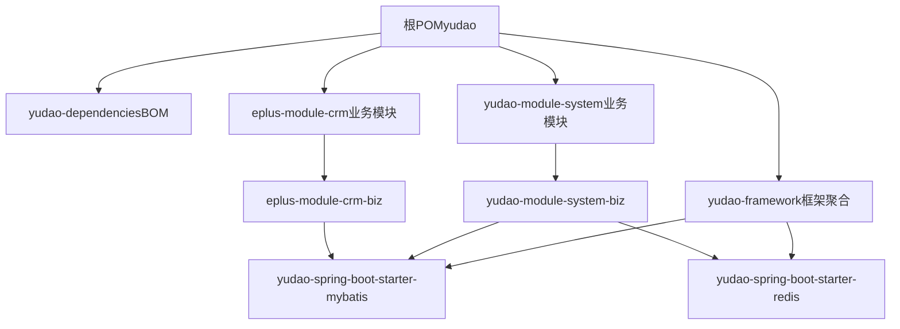
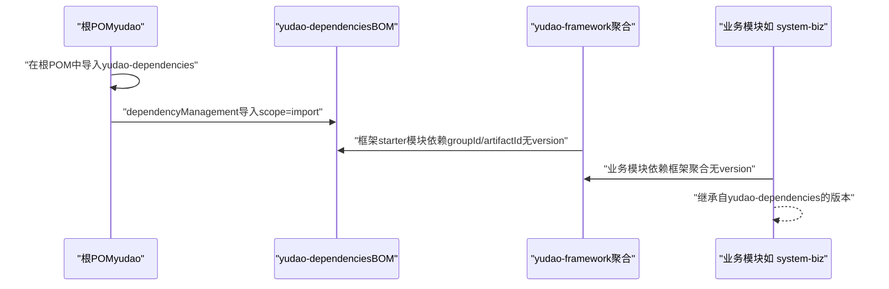
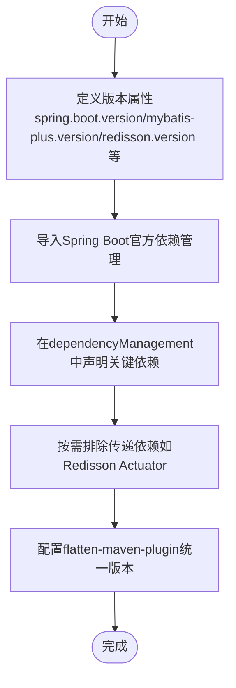
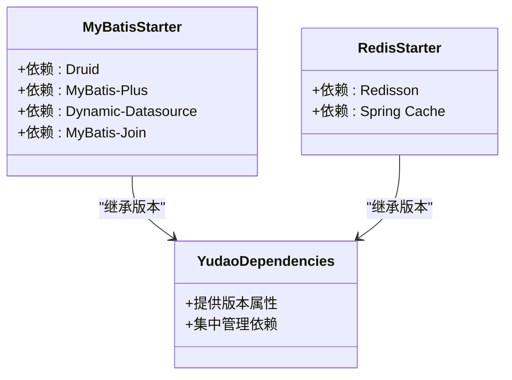
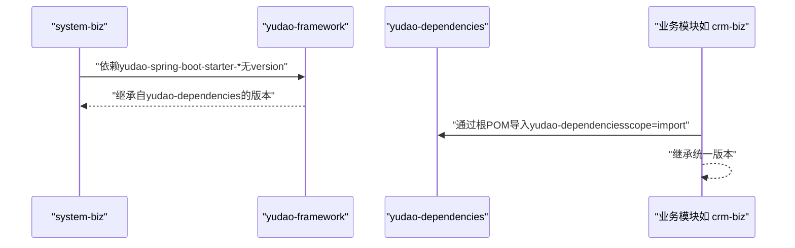
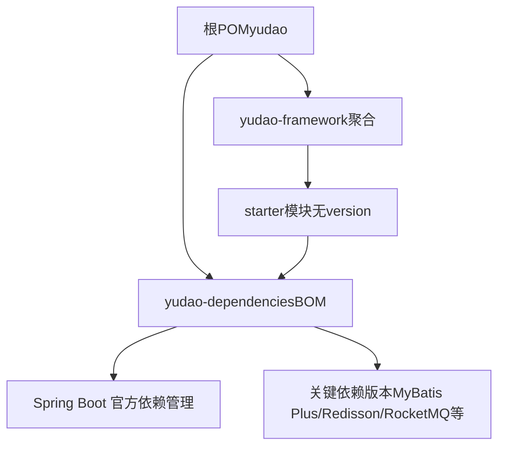

# BOM管理

<cite>
**本文引用的文件**
- [根POM（yudao）](file://pom.xml)
- [yudao-dependencies POM](file://yudao-dependencies/pom.xml)
- [yudao-framework POM](file://yudao-framework/pom.xml)
- [yudao-spring-boot-starter-mybatis POM](file://yudao-framework/yudao-spring-boot-starter-mybatis/pom.xml)
- [yudao-spring-boot-starter-redis POM](file://yudao-framework/yudao-spring-boot-starter-redis/pom.xml)
- [eplus-module-system-biz POM](file://yudao-module-system/yudao-module-system-biz/pom.xml)
- [eplus-module-crm-biz POM](file://eplus-module-crm/eplus-module-crm-biz/pom.xml)
</cite>

## 目录
1. [引言](#引言)
2. [项目结构](#项目结构)
3. [核心组件](#核心组件)
4. [架构总览](#架构总览)
5. [详细组件分析](#详细组件分析)
6. [依赖关系分析](#依赖关系分析)
7. [性能考虑](#性能考虑)
8. [故障排查指南](#故障排查指南)
9. [结论](#结论)
10. [附录](#附录)

## 引言
本文件聚焦于 eplus-admin-server 项目的 BOM（Bill of Materials，即“物料清单”）管理，系统性说明 yudao-dependencies 模块如何作为统一依赖管理 BOM，通过 dependencyManagement 集中定义所有第三方库的版本号，从而在多模块项目中实现版本统一、减少依赖冲突、提升可维护性与一致性。同时，本文将结合 yudao-dependencies 的 POM 结构，展示关键依赖项（如 Spring Boot、MyBatis Plus、Redis 等）的版本声明方式；并说明项目中其他模块如何通过 <dependencyManagement> 引入该 BOM，以及在多模块项目中的最佳实践与优势。

## 项目结构
- 顶层聚合工程采用 Maven 的多模块组织方式，根 POM 中通过 <modules> 声明了 yudao-dependencies、yudao-framework、各业务模块等。
- yudao-dependencies 是一个打包类型为 pom 的模块，专门用于集中管理依赖版本与插件版本，供其他模块通过 dependencyManagement 导入。
- yudao-framework 是框架层聚合模块，内部进一步细分为多个技术组件与业务组件的 starter 模块，这些 starter 模块在各自 POM 中仅声明 groupId/artifactId，版本由 yudao-dependencies 统一提供。
- 业务模块（如 yudao-module-system、eplus-module-crm 等）在各自的 POM 中不直接指定第三方库版本，而是通过导入 yudao-dependencies 或 yudao-framework 的聚合 POM 来继承版本。

图表来源
- [根POM（yudao）](file://pom.xml#L10-L44)
- [yudao-dependencies POM](file://yudao-dependencies/pom.xml#L78-L122)
- [yudao-framework POM](file://yudao-framework/pom.xml#L12-L47)
- [yudao-spring-boot-starter-mybatis POM](file://yudao-framework/yudao-spring-boot-starter-mybatis/pom.xml#L18-L74)
- [yudao-spring-boot-starter-redis POM](file://yudao-framework/yudao-spring-boot-starter-redis/pom.xml#L18-L39)
- [eplus-module-system-biz POM](file://yudao-module-system/yudao-module-system-biz/pom.xml#L20-L108)
- [eplus-module-crm-biz POM](file://eplus-module-crm/eplus-module-crm-biz/pom.xml#L20-L105)

章节来源
- [根POM（yudao）](file://pom.xml#L10-L44)
- [yudao-dependencies POM](file://yudao-dependencies/pom.xml#L78-L122)

## 核心组件
- yudao-dependencies：作为统一依赖管理 BOM，集中声明 Spring Boot、MyBatis Plus、Redis、RocketMQ、SkyWalking、Guava、MapStruct、EasyExcel、Lucene 等关键依赖的版本号，并通过 dependencyManagement 导出给子模块使用。
- yudao-framework：框架层聚合模块，内部包含多个 starter 模块（如 mybatis、redis、security、web、mq、job 等），这些模块在自身 POM 中不显式声明版本，而是由 yudao-dependencies 提供。
- 业务模块：如 yudao-module-system-biz、eplus-module-crm-biz 等，在各自 POM 中通过引入 yudao-dependencies 或 yudao-framework 的聚合 POM，间接继承版本，从而避免重复声明版本号。

章节来源
- [yudao-dependencies POM](file://yudao-dependencies/pom.xml#L16-L76)
- [yudao-dependencies POM](file://yudao-dependencies/pom.xml#L78-L655)
- [yudao-framework POM](file://yudao-framework/pom.xml#L12-L47)

## 架构总览
yudao-dependencies 通过 dependencyManagement 集中管理版本，业务模块通过导入该 BOM 或框架聚合 POM，实现“集中定义、统一继承”的依赖管理模式。下图展示了从根 POM 到 BOM、再到业务模块的依赖继承链路。

图表来源
- [根POM（yudao）](file://pom.xml#L66-L76)
- [yudao-dependencies POM](file://yudao-dependencies/pom.xml#L78-L122)
- [yudao-framework POM](file://yudao-framework/pom.xml#L12-L47)
- [eplus-module-system-biz POM](file://yudao-module-system/yudao-module-system-biz/pom.xml#L20-L108)

## 详细组件分析

### yudao-dependencies：统一依赖管理BOM
- 作用定位：集中管理所有第三方库与插件的版本，确保多模块一致。
- 关键特性：
  - 使用属性统一声明版本号，便于集中升级与维护。
  - 在 dependencyManagement 中导入 Spring Boot 官方依赖管理，保证与 Spring Boot 生态兼容。
  - 对常用组件（MyBatis Plus、Redisson、RocketMQ、SkyWalking、Guava、MapStruct、EasyExcel、Lucene 等）进行版本统一。
  - 提供 flatten-maven-plugin 插件，统一处理 revision 版本展开与清理。

图表来源
- [yudao-dependencies POM](file://yudao-dependencies/pom.xml#L16-L76)
- [yudao-dependencies POM](file://yudao-dependencies/pom.xml#L78-L122)
- [yudao-dependencies POM](file://yudao-dependencies/pom.xml#L221-L289)
- [yudao-dependencies POM](file://yudao-dependencies/pom.xml#L657-L686)

章节来源
- [yudao-dependencies POM](file://yudao-dependencies/pom.xml#L16-L76)
- [yudao-dependencies POM](file://yudao-dependencies/pom.xml#L78-L122)
- [yudao-dependencies POM](file://yudao-dependencies/pom.xml#L221-L289)
- [yudao-dependencies POM](file://yudao-dependencies/pom.xml#L657-L686)

### yudao-framework：框架聚合与starter模块
- 作用定位：将常用的技术组件（Web、Security、MyBatis、Redis、MQ、Job、Monitor 等）封装为 starter 模块，业务模块只需依赖聚合 POM 或具体 starter，无需关心版本。
- 依赖模式：starter 模块在自身 POM 中仅声明 groupId/artifactId，不显式声明 version，version 由 yudao-dependencies 提供。
- 示例：
  - yudao-spring-boot-starter-mybatis：声明 druid、mybatis-plus、dynamic-datasource、mybatis-plus-join 等依赖，但不指定版本。
  - yudao-spring-boot-starter-redis：声明 redisson、spring-boot-starter-cache 等依赖，但不指定版本。

图表来源
- [yudao-spring-boot-starter-mybatis POM](file://yudao-framework/yudao-spring-boot-starter-mybatis/pom.xml#L18-L74)
- [yudao-spring-boot-starter-redis POM](file://yudao-framework/yudao-spring-boot-starter-redis/pom.xml#L18-L39)
- [yudao-dependencies POM](file://yudao-dependencies/pom.xml#L221-L289)

章节来源
- [yudao-framework POM](file://yudao-framework/pom.xml#L12-L47)
- [yudao-spring-boot-starter-mybatis POM](file://yudao-framework/yudao-spring-boot-starter-mybatis/pom.xml#L18-L74)
- [yudao-spring-boot-starter-redis POM](file://yudao-framework/yudao-spring-boot-starter-redis/pom.xml#L18-L39)

### 业务模块：通过聚合POM继承版本
- yudao-module-system-biz：通过依赖 yudao-spring-boot-starter-mybatis、yudao-spring-boot-starter-redis 等框架 starter，间接继承 yudao-dependencies 的版本。
- eplus-module-crm-biz：同样通过框架聚合或直接依赖 yudao-dependencies 提供的版本，避免在模块 POM 中重复声明版本号。

图表来源
- [yudao-module-system-biz POM](file://yudao-module-system/yudao-module-system-biz/pom.xml#L20-L108)
- [eplus-module-crm-biz POM](file://eplus-module-crm/eplus-module-crm-biz/pom.xml#L20-L105)
- [yudao-dependencies POM](file://yudao-dependencies/pom.xml#L78-L122)
- [根POM（yudao）](file://pom.xml#L66-L76)

章节来源
- [yudao-module-system-biz POM](file://yudao-module-system/yudao-module-system-biz/pom.xml#L20-L108)
- [eplus-module-crm-biz POM](file://eplus-module-crm/eplus-module-crm-biz/pom.xml#L20-L105)
- [根POM（yudao）](file://pom.xml#L66-L76)

## 依赖关系分析
- 根 POM 通过 dependencyManagement 导入 yudao-dependencies，使所有子模块共享同一套版本策略。
- yudao-dependencies 内部：
  - 通过属性集中声明版本号；
  - 通过导入 Spring Boot 官方依赖管理，确保与 Spring Boot 生态兼容；
  - 对关键第三方库（MyBatis Plus、Redisson、RocketMQ、SkyWalking、Guava、MapStruct、EasyExcel、Lucene 等）进行版本统一；
  - 提供插件（flatten-maven-plugin）统一处理 revision 展开与清理。
- 业务模块通过依赖 yudao-framework 的聚合 POM 或直接依赖 yudao-dependencies，实现版本继承，避免重复声明版本号，降低依赖冲突风险。

图表来源
- [根POM（yudao）](file://pom.xml#L66-L76)
- [yudao-dependencies POM](file://yudao-dependencies/pom.xml#L16-L76)
- [yudao-dependencies POM](file://yudao-dependencies/pom.xml#L78-L122)
- [yudao-dependencies POM](file://yudao-dependencies/pom.xml#L221-L289)

章节来源
- [根POM（yudao）](file://pom.xml#L66-L76)
- [yudao-dependencies POM](file://yudao-dependencies/pom.xml#L16-L76)
- [yudao-dependencies POM](file://yudao-dependencies/pom.xml#L78-L122)
- [yudao-dependencies POM](file://yudao-dependencies/pom.xml#L221-L289)

## 性能考虑
- 版本统一带来的好处：
  - 减少依赖树中的版本冲突，降低构建失败概率；
  - 便于批量升级关键依赖（如 Spring Boot、MyBatis Plus、Redisson 等），统一升级窗口；
  - 通过集中管理属性与插件，减少重复配置，提高构建效率。
- 依赖排除与精简：
  - 对 Redisson、RocketMQ、SkyWalking 等组件进行必要的传递依赖排除，避免引入不必要的模块，降低运行时体积与启动时间。
- 插件层面：
  - flatten-maven-plugin 用于统一处理 revision 展开与清理，有助于保持 POM 的简洁与一致性。

章节来源
- [yudao-dependencies POM](file://yudao-dependencies/pom.xml#L253-L263)
- [yudao-dependencies POM](file://yudao-dependencies/pom.xml#L285-L289)
- [yudao-dependencies POM](file://yudao-dependencies/pom.xml#L321-L384)
- [yudao-dependencies POM](file://yudao-dependencies/pom.xml#L657-L686)

## 故障排查指南
- 依赖冲突排查：
  - 当出现依赖冲突时，优先检查是否在业务模块中显式声明了版本，导致与 yudao-dependencies 的统一版本不一致。
  - 检查是否存在未通过 BOM 继承的依赖（例如直接在模块 POM 中声明版本），建议统一迁移到通过 yudao-dependencies 或 yudao-framework 聚合 POM 继承。
- 版本不匹配：
  - 若发现某些依赖版本与 Spring Boot 生态不兼容，应确认 yudao-dependencies 是否正确导入 Spring Boot 官方依赖管理，并核对版本属性是否一致。
- 插件执行问题：
  - flatten-maven-plugin 在 clean 阶段执行清理，若出现 POM 展开异常，检查插件配置与执行阶段是否正确。

章节来源
- [根POM（yudao）](file://pom.xml#L66-L76)
- [yudao-dependencies POM](file://yudao-dependencies/pom.xml#L78-L122)
- [yudao-dependencies POM](file://yudao-dependencies/pom.xml#L657-L686)

## 结论
yudao-dependencies 作为统一依赖管理 BOM，在 eplus-admin-server 多模块项目中发挥着关键作用：通过集中定义版本属性与在 dependencyManagement 中声明关键依赖，配合 Spring Boot 官方依赖管理，实现了版本统一与生态兼容；业务模块通过导入该 BOM 或框架聚合 POM，避免了重复声明版本号，显著降低了依赖冲突风险，提升了可维护性与一致性。建议在后续迭代中持续完善版本属性与依赖声明，保持与 Spring Boot 生态同步更新。

## 附录
- 关键依赖项版本声明方式（示例路径）：
  - Spring Boot 官方依赖管理导入：[yudao-dependencies POM](file://yudao-dependencies/pom.xml#L81-L87)
  - MyBatis Plus 版本声明：[yudao-dependencies POM](file://yudao-dependencies/pom.xml#L227-L230)
  - Redisson 版本声明与排除：[yudao-dependencies POM](file://yudao-dependencies/pom.xml#L254-L263)
  - RocketMQ 版本声明：[yudao-dependencies POM](file://yudao-dependencies/pom.xml#L286-L289)
  - SkyWalking 版本声明：[yudao-dependencies POM](file://yudao-dependencies/pom.xml#L329-L342)
  - Guava 版本声明：[yudao-dependencies POM](file://yudao-dependencies/pom.xml#L531-L541)
  - MapStruct 版本声明：[yudao-dependencies POM](file://yudao-dependencies/pom.xml#L465-L479)
  - EasyExcel 版本声明：[yudao-dependencies POM](file://yudao-dependencies/pom.xml#L487-L491)
  - Lucene 版本声明：[yudao-dependencies POM](file://yudao-dependencies/pom.xml#L641-L653)
- 业务模块继承示例（示例路径）：
  - system-biz 依赖 mybatis/redis starter：[yudao-module-system-biz POM](file://yudao-module-system/yudao-module-system-biz/pom.xml#L67-L76)
  - crm-biz 依赖 mybatis/redis starter：[eplus-module-crm-biz POM](file://eplus-module-crm/eplus-module-crm-biz/pom.xml#L71-L75)