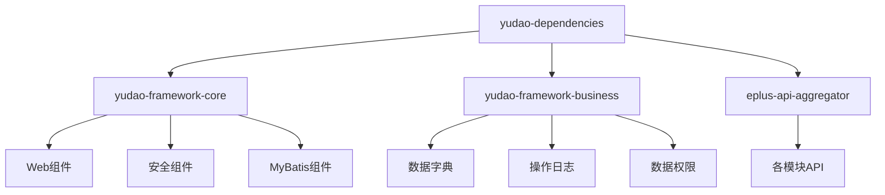
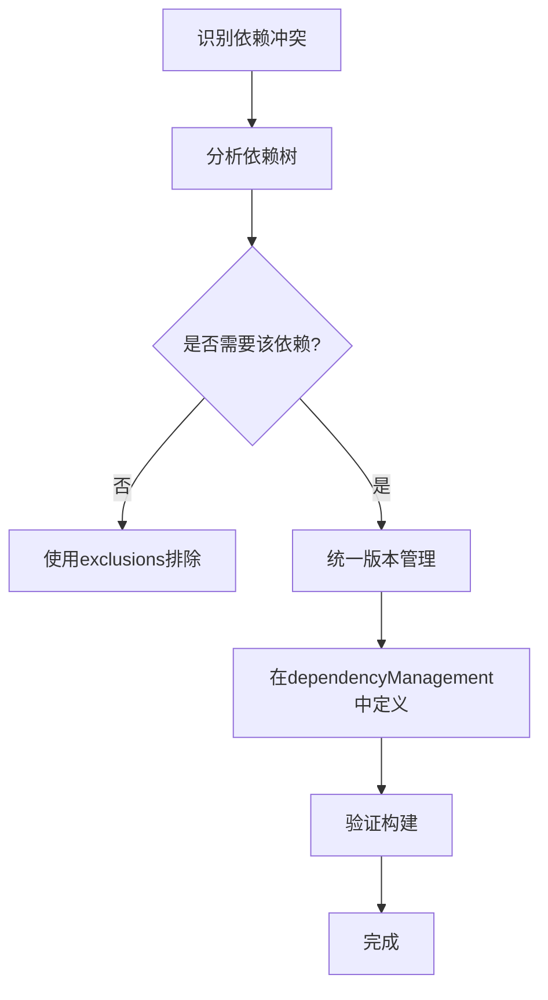
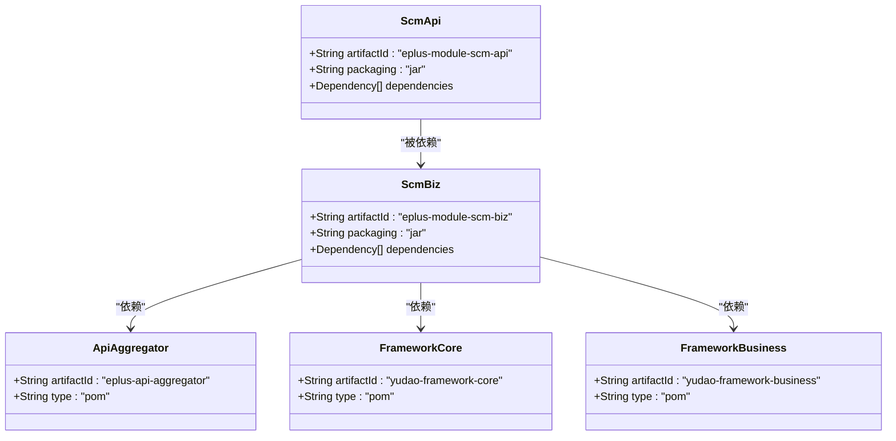

# 依赖冲突解决

<cite>
**本文档引用的文件**  
- [pom.xml](file://pom.xml)
- [eplus-module-scm/pom.xml](file://eplus-module-scm/pom.xml)
- [yudao-dependencies/pom.xml](file://yudao-dependencies/pom.xml)
- [eplus-module-scm/eplus-module-scm-api/pom.xml](file://eplus-module-scm/eplus-module-scm-api/pom.xml)
- [eplus-module-scm/eplus-module-scm-biz/pom.xml](file://eplus-module-scm/eplus-module-scm-biz/pom.xml)
- [yudao-framework/pom.xml](file://yudao-framework/pom.xml)
- [yudao-framework/yudao-framework-core/pom.xml](file://yudao-framework/yudao-framework-core/pom.xml)
- [yudao-framework/yudao-framework-business/pom.xml](file://yudao-framework/yudao-framework-business/pom.xml)
</cite>

## 目录
1. [项目结构与依赖管理](#项目结构与依赖管理)
2. [Maven依赖调解机制](#maven依赖调解机制)
3. [依赖冲突识别与分析](#依赖冲突识别与分析)
4. [依赖冲突解决策略](#依赖冲突解决策略)
5. [eplus-module-scm模块依赖配置示例](#eplus-module-scm模块依赖配置示例)
6. [依赖冲突预防策略](#依赖冲突预防策略)

## 项目结构与依赖管理

eplus-admin-server是一个基于Maven的多模块项目，采用分层架构设计。项目通过`yudao-dependencies`模块集中管理所有依赖版本，确保各模块使用统一的依赖版本。

项目采用聚合模块的方式组织依赖，主要包括：
- **核心框架聚合模块**：`yudao-framework-core`，包含Web、安全、MyBatis等核心功能
- **业务组件聚合模块**：`yudao-framework-business`，包含数据字典、操作日志、数据权限等功能
- **API聚合模块**：`eplus-api-aggregator`，聚合所有业务模块的API接口

这种设计模式有助于减少重复依赖声明，提高依赖管理的一致性。



**图示来源**
- [yudao-dependencies/pom.xml](file://yudao-dependencies/pom.xml)
- [yudao-framework/pom.xml](file://yudao-framework/pom.xml)

**本节来源**
- [pom.xml](file://pom.xml)
- [yudao-dependencies/pom.xml](file://yudao-dependencies/pom.xml)
- [yudao-framework/pom.xml](file://yudao-framework/pom.xml)

## Maven依赖调解机制

Maven在解析依赖时采用"最近定义"原则（nearest definition）进行依赖调解。当同一个依赖的不同版本出现在依赖树的不同层级时，Maven会选择距离项目最近的那个版本。

依赖调解的优先级规则如下：
1. **路径最近优先**：选择依赖树中路径最短的版本
2. **声明顺序优先**：当路径长度相同时，选择pom.xml中先声明的依赖

项目通过`yudao-dependencies`模块的`<dependencyManagement>`部分统一管理所有依赖版本，确保各模块使用一致的版本，从根本上减少依赖冲突的可能性。

```mermaid
graph TD
A[项目] --> B[依赖A v1.0]
A --> C[依赖B]
C --> D[依赖A v2.0]
style B stroke:#0f0,stroke-width:2px
style D stroke:#f00,stroke-width:1px
note right of A: 选择v1.0<br/>路径更短
```

**图示来源**
- [yudao-dependencies/pom.xml](file://yudao-dependencies/pom.xml)

**本节来源**
- [yudao-dependencies/pom.xml](file://yudao-dependencies/pom.xml)

## 依赖冲突识别与分析

在Maven多模块项目中，依赖冲突是常见问题。可以通过以下命令分析依赖树，识别潜在的冲突：

```bash
mvn dependency:tree
```

该命令会输出项目的完整依赖树，显示所有直接和传递性依赖。通过分析依赖树，可以发现同一依赖的不同版本被引入的情况。

在eplus-admin-server项目中，依赖冲突主要来源于：
1. **第三方库版本不一致**：不同模块可能引入同一库的不同版本
2. **传递性依赖冲突**：间接依赖的版本冲突
3. **Spring Boot版本管理**：确保所有Spring Boot相关组件使用兼容版本

项目通过`yudao-dependencies`模块集中管理版本，减少了大部分潜在冲突。例如，在`yudao-dependencies/pom.xml`中，所有Spring Boot组件都使用`${spring.boot.version}`变量统一版本。

**本节来源**
- [yudao-dependencies/pom.xml](file://yudao-dependencies/pom.xml)

## 依赖冲突解决策略

解决Maven依赖冲突的主要策略包括：

### 使用<exclusions>标签排除传递性依赖

当某个依赖引入了不需要的传递性依赖时，可以使用`<exclusions>`标签将其排除：

```xml
<dependency>
    <groupId>org.example</groupId>
    <artifactId>example-library</artifactId>
    <version>1.0.0</version>
    <exclusions>
        <exclusion>
            <groupId>org.unwanted</groupId>
            <artifactId>unwanted-library</artifactId>
        </exclusion>
    </exclusions>
</dependency>
```

在eplus-admin-server项目中，`yudao-dependencies/pom.xml`文件多处使用了`<exclusions>`标签，例如排除fastjson依赖以避免安全漏洞：

```xml
<dependency>
    <groupId>cn.smallbun.screw</groupId>
    <artifactId>screw-core</artifactId>
    <exclusions>
        <exclusion>
            <groupId>com.alibaba</groupId>
            <artifactId>fastjson</artifactId>
        </exclusion>
    </exclusions>
</dependency>
```

### 版本锁定

通过`<dependencyManagement>`部分锁定依赖版本，确保所有模块使用统一版本。

### 依赖调解

利用Maven的依赖调解机制，通过调整依赖声明顺序或层级来解决冲突。



**图示来源**
- [yudao-dependencies/pom.xml](file://yudao-dependencies/pom.xml)

**本节来源**
- [yudao-dependencies/pom.xml](file://yudao-dependencies/pom.xml)

## eplus-module-scm模块依赖配置示例

`eplus-module-scm`模块是供应链管理模块，其依赖配置体现了项目标准的依赖管理实践。

### 模块结构

该模块包含两个子模块：
- `eplus-module-scm-api`：API接口定义
- `eplus-module-scm-biz`：业务实现

### API模块依赖配置

`eplus-module-scm-api/pom.xml`主要依赖核心公共组件：

```xml
<dependencies>
    <dependency>
        <groupId>cn.iocoder.boot</groupId>
        <artifactId>yudao-common</artifactId>
    </dependency>
    <dependency>
        <groupId>cn.iocoder.boot</groupId>
        <artifactId>eplus-common</artifactId>
    </dependency>
    <dependency>
        <groupId>cn.iocoder.boot</groupId>
        <artifactId>yudao-spring-boot-starter-operatelog</artifactId>
    </dependency>
    <dependency>
        <groupId>cn.iocoder.boot</groupId>
        <artifactId>yudao-spring-boot-starter-web</artifactId>
    </dependency>
</dependencies>
```

### 业务模块依赖配置

`eplus-module-scm-biz/pom.xml`通过聚合模块引入依赖，减少重复声明：

```xml
<dependencies>
    <!-- API聚合模块 -->
    <dependency>
        <groupId>cn.iocoder.boot</groupId>
        <artifactId>eplus-api-aggregator</artifactId>
    </dependency>
    
    <!-- 核心框架聚合模块 -->
    <dependency>
        <groupId>cn.iocoder.boot</groupId>
        <artifactId>yudao-framework-core</artifactId>
    </dependency>
    
    <!-- 业务组件聚合模块 -->
    <dependency>
        <groupId>cn.iocoder.boot</groupId>
        <artifactId>yudao-framework-business</artifactId>
    </dependency>
</dependencies>
```

这种配置方式确保了依赖的一致性，同时简化了pom.xml文件。



**图示来源**
- [eplus-module-scm/eplus-module-scm-api/pom.xml](file://eplus-module-scm/eplus-module-scm-api/pom.xml)
- [eplus-module-scm/eplus-module-scm-biz/pom.xml](file://eplus-module-scm/eplus-module-scm-biz/pom.xml)

**本节来源**
- [eplus-module-scm/pom.xml](file://eplus-module-scm/pom.xml)
- [eplus-module-scm/eplus-module-scm-api/pom.xml](file://eplus-module-scm/eplus-module-scm-api/pom.xml)
- [eplus-module-scm/eplus-module-scm-biz/pom.xml](file://eplus-module-scm/eplus-module-scm-biz/pom.xml)

## 依赖冲突预防策略

为预防和减少依赖冲突，eplus-admin-server项目采用了以下策略：

### 统一依赖管理

通过`yudao-dependencies`模块集中管理所有依赖版本，确保一致性。

### 分层依赖架构

采用聚合模块模式，将相关依赖分组管理：
- `yudao-framework-core`：核心框架组件
- `yudao-framework-business`：业务组件
- `eplus-api-aggregator`：API接口聚合

### 依赖版本锁定

在`yudao-dependencies/pom.xml`中使用属性定义版本号，便于统一更新：

```xml
<properties>
    <spring.boot.version>2.7.18</spring.boot.version>
    <lombok.version>1.18.30</lombok.version>
    <mapstruct.version>1.5.5.Final</mapstruct.version>
</properties>
```

### 定期依赖审查

定期运行`mvn dependency:analyze`命令检查未使用的依赖和声明但未使用的依赖。

### 第三方库管理

对第三方库进行严格管理，避免引入不必要的传递性依赖，必要时使用`<exclusions>`标签排除。

这些策略共同作用，有效减少了项目中的依赖冲突，提高了构建的稳定性和可维护性。

**本节来源**
- [yudao-dependencies/pom.xml](file://yudao-dependencies/pom.xml)
- [pom.xml](file://pom.xml)