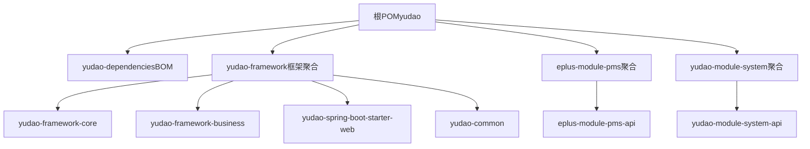
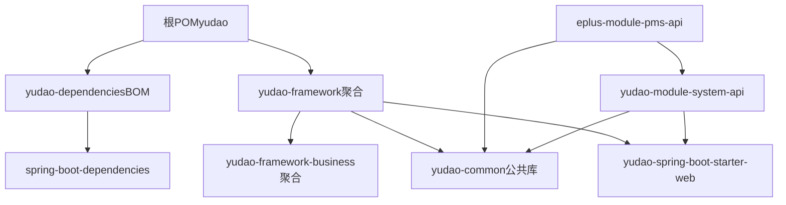
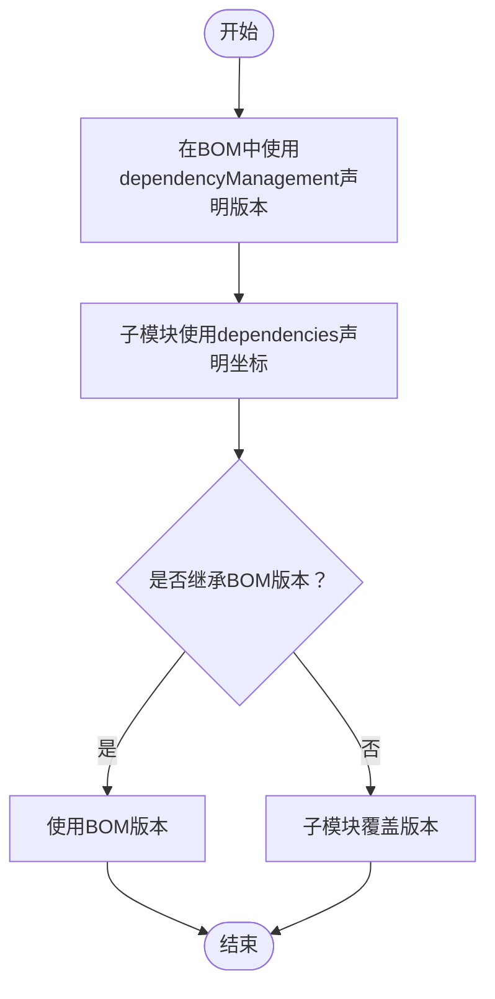
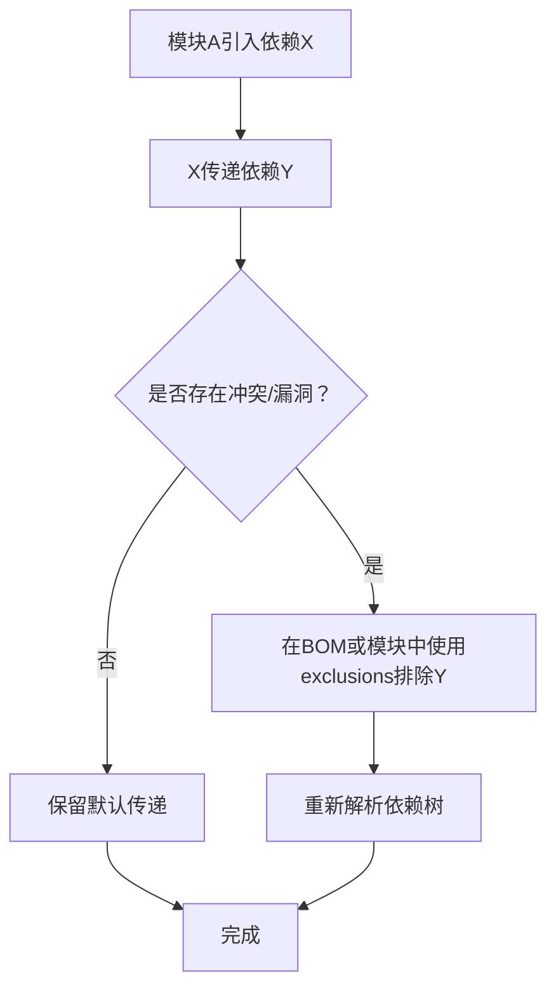

# 依赖管理机制

<cite>
**本文引用的文件**
- [根POM（yudao）](file://pom.xml)
- [yudao-dependencies（BOM）](file://yudao-dependencies/pom.xml)
- [yudao-framework（框架聚合）](file://yudao-framework/pom.xml)
- [yudao-framework-business（业务组件聚合）](file://yudao-framework/yudao-framework-business/pom.xml)
- [yudao-common（公共基础库）](file://yudao-framework/yudao-common/pom.xml)
- [yudao-spring-boot-starter-web（Web启动器）](file://yudao-framework/yudao-spring-boot-starter-web/pom.xml)
- [eplus-module-pms（产品模块聚合）](file://eplus-module-pms/pom.xml)
- [eplus-module-pms-api（产品模块API）](file://eplus-module-pms/eplus-module-pms-api/pom.xml)
- [yudao-module-system（系统模块聚合）](file://yudao-module-system/pom.xml)
- [yudao-module-system-api（系统模块API）](file://yudao-module-system/yudao-module-system-api/pom.xml)
</cite>

## 目录
1. [引言](#引言)
2. [项目结构](#项目结构)
3. [核心组件](#核心组件)
4. [架构总览](#架构总览)
5. [详细组件分析](#详细组件分析)
6. [依赖关系分析](#依赖关系分析)
7. [性能与可维护性考量](#性能与可维护性考量)
8. [故障排查指南](#故障排查指南)
9. [结论](#结论)

## 引言
本文件聚焦于eplus-admin-server的依赖管理机制，系统性阐述如何通过yudao-dependencies作为BOM（Bill of Materials）统一管理所有模块的版本依赖，避免版本冲突；解释dependencyManagement与dependencies的区别及其在项目中的应用；说明各业务模块如何继承基础框架层的依赖配置，并通过properties定义统一的版本号；最后给出实际的pom.xml配置示例路径，展示核心依赖的声明方式，并说明依赖传递性的工作原理及如何通过exclusions解决依赖冲突。

## 项目结构
该项目采用Maven多模块结构，顶层父POM负责统一版本与插件管理，yudao-dependencies作为BOM集中管理第三方依赖版本，yudao-framework提供框架层组件聚合，业务模块按领域拆分并通过聚合模块进一步细分API与Biz层。

图表来源
- [根POM（yudao）](file://pom.xml#L1-L171)
- [yudao-dependencies（BOM）](file://yudao-dependencies/pom.xml#L1-L689)
- [yudao-framework（框架聚合）](file://yudao-framework/pom.xml#L1-L63)
- [yudao-framework-business（业务组件聚合）](file://yudao-framework/yudao-framework-business/pom.xml#L1-L80)
- [yudao-spring-boot-starter-web（Web启动器）](file://yudao-framework/yudao-spring-boot-starter-web/pom.xml#L1-L67)
- [yudao-common（公共基础库）](file://yudao-framework/yudao-common/pom.xml#L1-L145)
- [eplus-module-pms（产品模块聚合）](file://eplus-module-pms/pom.xml#L1-L25)
- [eplus-module-pms-api（产品模块API）](file://eplus-module-pms/eplus-module-pms-api/pom.xml#L1-L31)
- [yudao-module-system（系统模块聚合）](file://yudao-module-system/pom.xml#L1-L25)
- [yudao-module-system-api（系统模块API）](file://yudao-module-system/yudao-module-system-api/pom.xml#L1-L43)

章节来源
- [根POM（yudao）](file://pom.xml#L1-L171)
- [yudao-dependencies（BOM）](file://yudao-dependencies/pom.xml#L1-L689)
- [yudao-framework（框架聚合）](file://yudao-framework/pom.xml#L1-L63)

## 核心组件
- 根POM（yudao）
  - 通过dependencyManagement导入yudao-dependencies，形成全局版本控制入口。
  - 统一Java版本、编译插件、Surefire插件、flatten插件等。
  - 提供仓库镜像加速下载。
- yudao-dependencies（BOM）
  - 在properties中集中定义各依赖版本号，如Spring Boot、MyBatis Plus、Redisson、RocketMQ、SkyWalking、Guava、MapStruct、Lombok等。
  - 在dependencyManagement中统一引入spring-boot-dependencies与各类starter，形成“版本仲裁”。
  - 通过exclusions解决潜在冲突（如Spring Boot Starter Test对ASM、Mockito的排除，Redisson对Actuator的排除等）。
- yudao-framework（框架聚合）
  - 聚合框架层组件，包含core、integration、business、monitor四类模块，以及若干starter与公共库。
- yudao-framework-business（业务组件聚合）
  - 聚合业务组件：数据字典、操作日志、数据权限、IP解析、错误码、短信、脱敏、工作流等。
- yudao-common（公共基础库）
  - 提供基础POJO、枚举、工具类、校验、日志、序列化、常用第三方库等，被多个模块复用。
- yudao-spring-boot-starter-web（Web启动器）
  - 基于Spring MVC与Knife4j/SpringDoc集成，提供全局异常处理、API文档、XSS防护等能力。
- 业务模块（以PMS与System为例）
  - 通过聚合模块拆分为API与Biz层，API模块仅暴露接口，Biz模块实现业务逻辑。
  - API模块依赖yudao-common与跨模块API，Biz模块依赖具体业务组件与持久层。

章节来源
- [根POM（yudao）](file://pom.xml#L1-L171)
- [yudao-dependencies（BOM）](file://yudao-dependencies/pom.xml#L1-L689)
- [yudao-framework（框架聚合）](file://yudao-framework/pom.xml#L1-L63)
- [yudao-framework-business（业务组件聚合）](file://yudao-framework/yudao-framework-business/pom.xml#L1-L80)
- [yudao-common（公共基础库）](file://yudao-framework/yudao-common/pom.xml#L1-L145)
- [yudao-spring-boot-starter-web（Web启动器）](file://yudao-framework/yudao-spring-boot-starter-web/pom.xml#L1-L67)
- [eplus-module-pms（产品模块聚合）](file://eplus-module-pms/pom.xml#L1-L25)
- [eplus-module-pms-api（产品模块API）](file://eplus-module-pms/eplus-module-pms-api/pom.xml#L1-L31)
- [yudao-module-system（系统模块聚合）](file://yudao-module-system/pom.xml#L1-L25)
- [yudao-module-system-api（系统模块API）](file://yudao-module-system/yudao-module-system-api/pom.xml#L1-L43)

## 架构总览
下图展示了依赖管理的层次关系与传递路径，强调BOM集中版本控制与模块间依赖继承关系。

图表来源
- [根POM（yudao）](file://pom.xml#L1-L171)
- [yudao-dependencies（BOM）](file://yudao-dependencies/pom.xml#L1-L689)
- [yudao-framework（框架聚合）](file://yudao-framework/pom.xml#L1-L63)
- [yudao-framework-business（业务组件聚合）](file://yudao-framework/yudao-framework-business/pom.xml#L1-L80)
- [yudao-common（公共基础库）](file://yudao-framework/yudao-common/pom.xml#L1-L145)
- [yudao-spring-boot-starter-web（Web启动器）](file://yudao-framework/yudao-spring-boot-starter-web/pom.xml#L1-L67)
- [eplus-module-pms-api（产品模块API）](file://eplus-module-pms/eplus-module-pms-api/pom.xml#L1-L31)
- [yudao-module-system-api（系统模块API）](file://yudao-module-system/yudao-module-system-api/pom.xml#L1-L43)

## 详细组件分析

### yudao-dependencies（BOM）深度解析
- 版本集中管理
  - 在properties中统一定义各依赖版本号，确保全工程一致性。
  - 在dependencyManagement中引入spring-boot-dependencies，形成Spring生态版本仲裁。
- 依赖声明策略
  - 对于Spring Boot官方Starter，直接引用spring-boot-dependencies，避免手动指定版本。
  - 对于社区或自研组件（如yudao-*），通过BOM统一版本，业务模块只需声明坐标即可继承版本。
- 冲突解决
  - 使用exclusions排除不兼容或有漏洞的传递依赖，如Spring Boot Starter Test对ASM、Mockito的排除；Redisson对Actuator的排除；screw-core对Fastjson与Freemarker的排除等。
- 插件与构建
  - 通过flatten-maven-plugin统一revision解析，保证POM文件中版本解析为确定值。

章节来源
- [yudao-dependencies（BOM）](file://yudao-dependencies/pom.xml#L1-L689)

### yudao-framework-business（业务组件聚合）与yudao-common
- yudao-framework-business
  - 聚合业务组件，每个组件以yudao-spring-boot-starter-前缀命名，便于按需引入。
  - 通过BOM统一版本，业务模块仅需依赖组件坐标，无需关心版本细节。
- yudao-common
  - 提供基础工具、校验、序列化、日志、常用第三方库等，被API与Biz模块广泛复用。
  - 通过provided作用域减少对下游模块的侵入，仅在工具类场景使用。

章节来源
- [yudao-framework-business（业务组件聚合）](file://yudao-framework/yudao-framework-business/pom.xml#L1-L80)
- [yudao-common（公共基础库）](file://yudao-framework/yudao-common/pom.xml#L1-L145)

### yudao-spring-boot-starter-web（Web启动器）
- 依赖构成
  - 依赖yudao-common与Spring Web生态，集成Knife4j与SpringDoc，提供OpenAPI文档能力。
  - 可选依赖spring-security-core，用于全局异常处理等场景。
  - 依赖yudao-module-infra-api用于操作日志记录。
  - XSS防护依赖jsoup。
- 作用
  - 为业务模块提供统一的Web接入层，屏蔽底层差异，降低重复配置成本。

章节来源
- [yudao-spring-boot-starter-web（Web启动器）](file://yudao-framework/yudao-spring-boot-starter-web/pom.xml#L1-L67)

### 业务模块（PMS与System）的依赖继承
- eplus-module-pms
  - 作为聚合模块，内部包含eplus-module-pms-api与eplus-module-pms-biz。
  - API模块依赖yudao-common与跨模块API（如eplus-module-scm-api），Biz模块依赖具体业务组件与持久层。
- yudao-module-system
  - 聚合yudao-module-system-api与yudao-module-system-biz。
  - API模块依赖yudao-common、eplus-common与yudao-spring-boot-starter-web，确保统一的Web接入与校验能力。

章节来源
- [eplus-module-pms（产品模块聚合）](file://eplus-module-pms/pom.xml#L1-L25)
- [eplus-module-pms-api（产品模块API）](file://eplus-module-pms/eplus-module-pms-api/pom.xml#L1-L31)
- [yudao-module-system（系统模块聚合）](file://yudao-module-system/pom.xml#L1-L25)
- [yudao-module-system-api（系统模块API）](file://yudao-module-system/yudao-module-system-api/pom.xml#L1-L43)

## 依赖关系分析

### dependencyManagement vs dependencies 的区别与应用
- dependencyManagement
  - 仅声明依赖而不引入，相当于“版本仲裁”。子模块声明依赖时自动继承版本，避免版本漂移。
  - 在yudao-dependencies中广泛使用，集中管理第三方依赖版本。
- dependencies
  - 直接引入依赖，子模块继承父POM的dependencyManagement版本，但也可覆盖。
  - 在yudao-common、yudao-spring-boot-starter-web等模块中使用，明确声明实际需要的依赖。

图表来源
- [yudao-dependencies（BOM）](file://yudao-dependencies/pom.xml#L1-L689)
- [yudao-common（公共基础库）](file://yudao-framework/yudao-common/pom.xml#L1-L145)
- [yudao-spring-boot-starter-web（Web启动器）](file://yudao-framework/yudao-spring-boot-starter-web/pom.xml#L1-L67)

章节来源
- [yudao-dependencies（BOM）](file://yudao-dependencies/pom.xml#L1-L689)
- [yudao-common（公共基础库）](file://yudao-framework/yudao-common/pom.xml#L1-L145)
- [yudao-spring-boot-starter-web（Web启动器）](file://yudao-framework/yudao-spring-boot-starter-web/pom.xml#L1-L67)

### 依赖传递性与exclusions的应用
- 传递性
  - 子模块通过dependencies引入yudao-common，间接获得其依赖链（如Jackson、Guava、Lombok、MapStruct等）。
  - yudao-spring-boot-starter-web引入Spring Web与文档组件，API模块间接获得Web能力。
- 冲突解决
  - 当传递依赖存在冲突或漏洞时，使用exclusions排除特定传递依赖。
  - 示例：Spring Boot Starter Test排除ASM与Mockito；Redisson排除Actuator；screw-core排除Fastjson与Freemarker。

图表来源
- [yudao-dependencies（BOM）](file://yudao-dependencies/pom.xml#L1-L689)
- [yudao-common（公共基础库）](file://yudao-framework/yudao-common/pom.xml#L1-L145)
- [yudao-spring-boot-starter-web（Web启动器）](file://yudao-framework/yudao-spring-boot-starter-web/pom.xml#L1-L67)

章节来源
- [yudao-dependencies（BOM）](file://yudao-dependencies/pom.xml#L1-L689)
- [yudao-common（公共基础库）](file://yudao-framework/yudao-common/pom.xml#L1-L145)
- [yudao-spring-boot-starter-web（Web启动器）](file://yudao-framework/yudao-spring-boot-starter-web/pom.xml#L1-L67)

## 性能与可维护性考量
- 版本集中管理
  - 通过BOM集中管理版本，减少重复配置与版本漂移风险，提升可维护性。
- 传递依赖优化
  - 使用exclusions剔除不必要的传递依赖，缩小最终产物体积，降低安全风险。
- 构建稳定性
  - flatten-maven-plugin统一revision解析，避免CI环境版本不一致导致的构建失败。
- 插件统一
  - 在根POM中统一插件版本与配置，确保各模块构建行为一致。

章节来源
- [根POM（yudao）](file://pom.xml#L1-L171)
- [yudao-dependencies（BOM）](file://yudao-dependencies/pom.xml#L1-L689)

## 故障排查指南
- 版本冲突
  - 现象：构建时报错提示依赖冲突或重复类加载。
  - 排查：使用exclusions排除冲突传递依赖；确认BOM中是否已统一版本。
- 依赖未生效
  - 现象：子模块未获得预期依赖。
  - 排查：确认子模块是否使用dependencies声明依赖；确认父POM是否正确引入yudao-dependencies。
- 文档与Web能力缺失
  - 现象：API文档不可用或Web接入异常。
  - 排查：确认yudao-spring-boot-starter-web是否被API模块依赖；确认Knife4j/SpringDoc依赖是否在BOM中。
- 构建失败（CI）
  - 现象：本地正常，CI失败。
  - 排查：检查flatten-maven-plugin是否正确执行；确认仓库镜像可用。

章节来源
- [yudao-dependencies（BOM）](file://yudao-dependencies/pom.xml#L1-L689)
- [yudao-spring-boot-starter-web（Web启动器）](file://yudao-framework/yudao-spring-boot-starter-web/pom.xml#L1-L67)
- [yudao-module-system-api（系统模块API）](file://yudao-module-system/yudao-module-system-api/pom.xml#L1-L43)

## 结论
通过yudao-dependencies作为BOM集中管理版本，结合dependencyManagement与dependencies的合理分工，eplus-admin-server实现了统一、稳定、可维护的依赖管理体系。业务模块通过聚合模块与框架组件实现高内聚低耦合，exclusions有效解决了依赖冲突与漏洞问题。建议在新增依赖时优先在BOM中统一版本，并通过exclusions最小化传递依赖，确保构建稳定性与安全性。