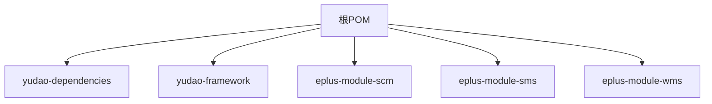
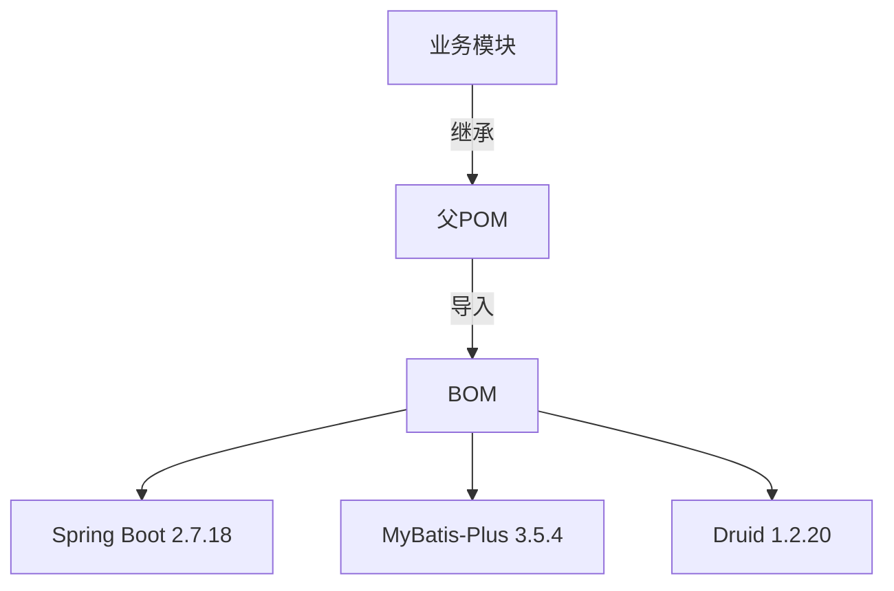

# 依赖继承机制

<cite>
**本文档引用的文件**  
- [pom.xml](file://pom.xml)
- [yudao-dependencies/pom.xml](file://yudao-dependencies/pom.xml)
- [eplus-module-scm/pom.xml](file://eplus-module-scm/pom.xml)
- [eplus-module-sms/pom.xml](file://eplus-module-sms/pom.xml)
- [eplus-module-wms/pom.xml](file://eplus-module-wms/pom.xml)
- [eplus-module-scm/eplus-module-scm-api/pom.xml](file://eplus-module-scm/eplus-module-scm-api/pom.xml)
- [eplus-module-scm/eplus-module-scm-biz/pom.xml](file://eplus-module-scm/eplus-module-scm-biz/pom.xml)
- [eplus-module-sms/eplus-module-sms-api/pom.xml](file://eplus-module-sms/eplus-module-sms-api/pom.xml)
- [eplus-module-sms/eplus-module-sms-biz/pom.xml](file://eplus-module-sms/eplus-module-sms-biz/pom.xml)
- [eplus-module-wms/eplus-module-wms-api/pom.xml](file://eplus-module-wms/eplus-module-wms-api/pom.xml)
- [yudao-framework/pom.xml](file://yudao-framework/pom.xml)
- [yudao-framework/yudao-framework-business/pom.xml](file://yudao-framework/yudao-framework-business/pom.xml)
- [eplus-framework/pom.xml](file://eplus-framework/pom.xml)
- [eplus-framework/eplus-common/pom.xml](file://eplus-framework/eplus-common/pom.xml)
- [eplus-module-crm/eplus-module-crm-api/pom.xml](file://eplus-module-crm/eplus-module-crm-api/pom.xml)
- [eplus-module-crm/eplus-module-crm-biz/pom.xml](file://eplus-module-crm/eplus-module-crm-biz/pom.xml)
</cite>

## 目录
1. [项目结构概述](#项目结构概述)
2. [父POM配置分析](#父pom配置分析)
3. [BOM依赖管理机制](#bom依赖管理机制)
4. [业务模块继承实现](#业务模块继承实现)
5. [dependencyManagement与dependencies区别](#dependencymanagement与dependencies区别)
6. [版本变量引用机制](#版本变量引用机制)
7. [模块依赖关系图](#模块依赖关系图)

## 项目结构概述

eplus-admin-server项目采用多模块Maven架构，通过父子POM继承机制实现统一的构建配置管理。项目根目录下的pom.xml作为父POM，定义了全局的依赖管理和插件配置。各业务模块（如SCM、SMS、WMS）通过继承父POM获得统一的构建环境。

项目主要包含以下模块类型：
- **核心框架模块**：位于yudao-framework目录下，提供基础技术组件
- **业务功能模块**：以eplus-module-前缀命名，如eplus-module-scm（供应链管理）、eplus-module-sms（销售管理）等
- **依赖管理模块**：yudao-dependencies，作为BOM（Bill of Materials）控制所有依赖版本

**Section sources**
- [pom.xml](file://pom.xml#L1-L171)
- [yudao-framework/pom.xml](file://yudao-framework/pom.xml#L1-L63)

## 父POM配置分析

根目录下的pom.xml文件作为项目的父POM，承担着全局配置管理的职责。其核心配置包括：

1. **模块定义**：通过`<modules>`标签声明了所有子模块，包括yudao-dependencies、yudao-framework、各业务模块等
2. **属性配置**：在`<properties>`中定义了Java版本、Maven插件版本等全局属性
3. **依赖管理**：通过`<dependencyManagement>`引入yudao-dependencies BOM，实现依赖版本的集中管理
4. **插件管理**：在`<pluginManagement>`中配置了编译器、测试插件等，确保构建过程的一致性

父POM的关键特性是其`<packaging>`类型为pom，表明它本身不产生构件，仅作为配置继承的基点。所有业务模块通过`<parent>`标签继承此POM，获得统一的构建配置。



**Diagram sources**
- [pom.xml](file://pom.xml#L1-L171)

**Section sources**
- [pom.xml](file://pom.xml#L1-L171)

## BOM依赖管理机制

yudao-dependencies模块作为项目的BOM（Bill of Materials），通过`<dependencyManagement>`实现了依赖版本的集中控制。这种机制的核心优势在于：

1. **版本统一**：所有依赖的版本号在BOM中定义，子模块无需重复指定版本
2. **依赖仲裁**：当多个模块引入同一依赖的不同版本时，BOM确保使用统一版本
3. **简化配置**：子模块只需声明依赖的groupId和artifactId，无需指定version

BOM通过`<scope>import</scope>`方式被父POM引入，这种特殊的scope类型使得BOM中的所有依赖管理配置被"导入"到当前POM中。例如，在yudao-dependencies/pom.xml中定义了Spring Boot的版本：

```xml
<properties>
    <spring.boot.version>2.7.18</spring.boot.version>
</properties>

<dependencyManagement>
    <dependencies>
        <dependency>
            <groupId>org.springframework.boot</groupId>
            <artifactId>spring-boot-dependencies</artifactId>
            <version>${spring.boot.version}</version>
            <type>pom</type>
            <scope>import</scope>
        </dependency>
    </dependencies>
</dependencyManagement>
```

这样，任何继承该POM的模块在引入Spring Boot相关依赖时，都无需指定版本号。



**Diagram sources**
- [yudao-dependencies/pom.xml](file://yudao-dependencies/pom.xml#L1-L689)

**Section sources**
- [yudao-dependencies/pom.xml](file://yudao-dependencies/pom.xml#L1-L689)

## 业务模块继承实现

各业务模块通过标准的Maven继承机制获得父POM的配置。以eplus-module-scm为例，其pom.xml配置如下：

```xml
<parent>
    <groupId>cn.iocoder.boot</groupId>
    <artifactId>yudao</artifactId>
    <version>${revision}</version>
</parent>
```

这种继承关系使得子模块自动获得：
- 父POM中定义的所有属性值
- 通过BOM管理的所有依赖版本
- 插件管理配置
- 构建配置

对于具体的API和Biz模块，如eplus-module-scm-api，它们进一步继承自模块级的pom.xml，形成多层继承结构。这种分层继承设计既保证了全局一致性，又允许模块级别的特殊配置。

在eplus-module-scm-biz中，可以看到模块如何利用BOM中的依赖：

```xml
<dependencies>
    <dependency>
        <groupId>cn.iocoder.boot</groupId>
        <artifactId>eplus-api-aggregator</artifactId>
        <version>${revision}</version>
        <type>pom</type>
    </dependency>
    <dependency>
        <groupId>cn.iocoder.boot</groupId>
        <artifactId>yudao-framework-core</artifactId>
        <version>${revision}</version>
        <type>pom</type>
    </dependency>
</dependencies>
```

尽管这里显示了version，但由于这些依赖已在BOM中管理，实际版本由BOM控制。

```mermaid
classDiagram
class ParentPOM {
+groupId : cn.iocoder.boot
+artifactId : yudao
+version : ${revision}
+packaging : pom
}
class BusinessModule {
+artifactId : eplus-module-scm
+packaging : pom
}
class APIModule {
+artifactId : eplus-module-scm-api
+packaging : jar
}
class BizModule {
+artifactId : eplus-module-scm-biz
+packaging : jar
}
ParentPOM <|-- BusinessModule : 继承
BusinessModule <|-- APIModule : 继承
BusinessModule <|-- BizModule : 继承
```

**Diagram sources**
- [eplus-module-scm/pom.xml](file://eplus-module-scm/pom.xml#L1-L26)
- [eplus-module-scm/eplus-module-scm-api/pom.xml](file://eplus-module-scm/eplus-module-scm-api/pom.xml#L1-L50)
- [eplus-module-scm/eplus-module-scm-biz/pom.xml](file://eplus-module-scm/eplus-module-scm-biz/pom.xml#L1-L74)

**Section sources**
- [eplus-module-scm/pom.xml](file://eplus-module-scm/pom.xml#L1-L26)
- [eplus-module-scm/eplus-module-scm-api/pom.xml](file://eplus-module-scm/eplus-module-scm-api/pom.xml#L1-L50)
- [eplus-module-scm/eplus-module-scm-biz/pom.xml](file://eplus-module-scm/eplus-module-scm-biz/pom.xml#L1-L74)

## dependencyManagement与dependencies区别

在Maven依赖管理中，`<dependencyManagement>`和`<dependencies>`有本质区别：

### dependencyManagement
- **作用范围**：仅声明依赖的版本和配置，不实际引入依赖
- **继承特性**：子模块继承时，可选择性地使用这些配置
- **版本控制**：集中管理依赖版本，避免版本冲突
- **典型应用**：BOM文件、父POM

### dependencies
- **作用范围**：实际引入依赖到项目中
- **继承特性**：子模块会自动继承这些依赖
- **版本来源**：优先使用dependencyManagement中定义的版本，若无则使用dependencies中指定的版本
- **典型应用**：具体模块的依赖声明

在本项目中，yudao-dependencies使用`<dependencyManagement>`定义所有依赖的版本，而具体的业务模块在`<dependencies>`中声明实际需要的依赖。例如：

```xml
<!-- yudao-dependencies中的dependencyManagement -->
<dependencyManagement>
    <dependencies>
        <dependency>
            <groupId>org.springframework.boot</groupId>
            <artifactId>spring-boot-starter-web</artifactId>
            <version>2.7.18</version>
        </dependency>
    </dependencies>
</dependencyManagement>

<!-- 业务模块中的dependencies -->
<dependencies>
    <dependency>
        <groupId>org.springframework.boot</groupId>
        <artifactId>spring-boot-starter-web</artifactId>
        <!-- 无需指定版本，由BOM控制 -->
    </dependency>
</dependencies>
```

这种分离设计实现了"声明与实现"的解耦，既保证了版本统一，又提供了灵活的依赖选择机制。

**Section sources**
- [yudao-dependencies/pom.xml](file://yudao-dependencies/pom.xml#L78-L655)
- [eplus-module-scm/eplus-module-scm-biz/pom.xml](file://eplus-module-scm/eplus-module-scm-biz/pom.xml#L20-L71)

## 版本变量引用机制

项目通过Maven属性（Properties）实现了版本变量的统一管理。在父POM的`<properties>`标签中定义了所有版本相关的变量：

```xml
<properties>
    <revision>1.0.0</revision>
    <java.version>17</java.version>
    <spring.boot.version>2.7.18</spring.boot.version>
    <lombok.version>1.18.30</lombok.version>
    <mapstruct.version>1.5.5.Final</mapstruct.version>
    <maven-surefire-plugin.version>3.0.0-M5</maven-surefire-plugin.version>
    <maven-compiler-plugin.version>3.13.0</maven-compiler-plugin.version>
    <flatten-maven-plugin.version>1.5.0</flatten-maven-plugin.version>
</properties>
```

这些属性在项目中通过`${property.name}`语法引用：

1. **版本号引用**：`${spring.boot.version}`、`${lombok.version}`
2. **插件版本引用**：`${maven-compiler-plugin.version}`
3. **项目版本引用**：`${revision}`

这种机制的优势包括：
- **集中管理**：所有版本号在一处定义，便于维护
- **一致性保证**：避免同一依赖在不同地方使用不同版本
- **升级便捷**：只需修改属性值即可批量更新版本
- **环境适配**：可通过外部配置覆盖属性值

特别地，`${revision}`属性用于项目自身的版本管理，配合flatten-maven-plugin实现版本号的统一和简化。

**Section sources**
- [pom.xml](file://pom.xml#L50-L64)
- [yudao-dependencies/pom.xml](file://yudao-dependencies/pom.xml#L16-L76)

## 模块依赖关系图

```mermaid
graph TD
subgraph "根POM"
Root[pom.xml]
end
subgraph "BOM"
BOM[yudao-dependencies/pom.xml]
end
subgraph "框架模块"
Framework[yudao-framework]
Core[yudao-framework-core]
Business[yudao-framework-business]
end
subgraph "业务模块"
SCM[eplus-module-scm]
SMS[eplus-module-sms]
WMS[eplus-module-wms]
CRM[eplus-module-crm]
end
subgraph "模块层级"
SCMAPI[eplus-module-scm-api]
SCMBiz[eplus-module-scm-biz]
SMSAPI[eplus-module-sms-api]
SMSBiz[eplus-module-sms-biz]
WMSAPI[eplus-module-wms-api]
WMSBiz[eplus-module-wms-biz]
CRMAPI[eplus-module-crm-api]
CRMBiz[eplus-module-crm-biz]
end
Root --> |继承| SCM
Root --> |继承| SMS
Root --> |继承| WMS
Root --> |继承| CRM
Root --> |导入| BOM
BOM --> |管理| Framework
Framework --> Core
Framework --> Business
SCM --> SCMAPI
SCM --> SCMBiz
SMS --> SMSAPI
SMS --> SMSBiz
WMS --> WMSAPI
WMS --> WMSBiz
CRM --> CRMAPI
CRM --> CRMBiz
SCMBiz --> |使用| Core
SCMBiz --> |使用| Business
SMSBiz --> |使用| Core
SMSBiz --> |使用| Business
WMSBiz --> |使用| Core
WMSBiz --> |使用| Business
CRMBiz --> |使用| Core
CRMBiz --> |使用| Business
```

**Diagram sources**
- [pom.xml](file://pom.xml#L1-L171)
- [yudao-dependencies/pom.xml](file://yudao-dependencies/pom.xml#L1-L689)
- [yudao-framework/pom.xml](file://yudao-framework/pom.xml#L1-L63)
- [eplus-module-scm/pom.xml](file://eplus-module-scm/pom.xml#L1-L26)
- [eplus-module-sms/pom.xml](file://eplus-module-sms/pom.xml#L1-L26)
- [eplus-module-wms/pom.xml](file://eplus-module-wms/pom.xml#L1-L28)
- [eplus-module-crm/eplus-module-crm-api/pom.xml](file://eplus-module-crm/eplus-module-crm-api/pom.xml#L1-L33)
- [eplus-module-crm/eplus-module-crm-biz/pom.xml](file://eplus-module-crm/eplus-module-crm-biz/pom.xml#L1-L108)