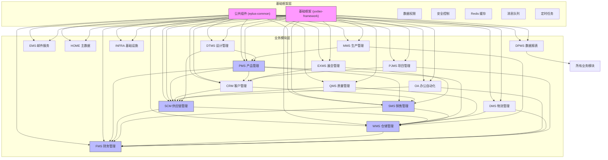

# 模块交互关系

<cite>
**本文档引用的文件**  
- [pom.xml](file://pom.xml)
- [eplus-framework/pom.xml](file://eplus-framework/pom.xml)
- [eplus-framework/eplus-common/pom.xml](file://eplus-framework/eplus-common/pom.xml)
- [yudao-framework/pom.xml](file://yudao-framework/pom.xml)
- [eplus-module-scm/eplus-module-scm-biz/pom.xml](file://eplus-module-scm/eplus-module-scm-biz/pom.xml)
- [eplus-module-sms/eplus-module-sms-biz/pom.xml](file://eplus-module-sms/eplus-module-sms-biz/pom.xml)
- [eplus-module-wms/eplus-module-wms-biz/pom.xml](file://eplus-module-wms/eplus-module-wms-biz/pom.xml)
- [eplus-module-fms/eplus-module-fms-biz/pom.xml](file://eplus-module-fms/eplus-module-fms-biz/pom.xml)
- [eplus-module-pms/eplus-module-pms-biz/pom.xml](file://eplus-module-pms/eplus-module-pms-biz/pom.xml)
- [eplus-module-crm/eplus-module-crm-biz/pom.xml](file://eplus-module-crm/eplus-module-crm-biz/pom.xml)
- [eplus-module-oa/eplus-module-oa-biz/pom.xml](file://eplus-module-oa/eplus-module-oa-biz/pom.xml)
- [eplus-module-dms/eplus-module-dms-biz/pom.xml](file://eplus-module-dms/eplus-module-dms-biz/pom.xml)
- [eplus-module-dtms/eplus-module-dtms-biz/pom.xml](file://eplus-module-dtms/eplus-module-dtms-biz/pom.xml)
- [eplus-module-ems/eplus-module-ems-biz/pom.xml](file://eplus-module-ems/eplus-module-ems-biz/pom.xml)
- [eplus-module-exms/eplus-module-exms-biz/pom.xml](file://eplus-module-exms/eplus-module-exms-biz/pom.xml)
- [eplus-module-qms/eplus-module-qms-biz/pom.xml](file://eplus-module-qms/eplus-module-qms-biz/pom.xml)
- [eplus-module-pjms/eplus-module-pjms-biz/pom.xml](file://eplus-module-pjms/eplus-module-pjms-biz/pom.xml)
- [eplus-module-home/eplus-module-home-biz/pom.xml](file://eplus-module-home/eplus-module-home-biz/pom.xml)
- [eplus-module-dpms/eplus-module-dpms-biz/pom.xml](file://eplus-module-dpms/eplus-module-dpms-biz/pom.xml)
- [eplus-module-infra/eplus-module-infra-biz/pom.xml](file://eplus-module-infra/eplus-module-infra-biz/pom.xml)
- [eplus-module-mms/eplus-module-mms-biz/pom.xml](file://eplus-module-mms/eplus-module-mms-biz/pom.xml)
</cite>

## 目录
1. [项目结构](#项目结构)
2. [核心模块依赖分析](#核心模块依赖分析)
3. [模块交互关系图](#模块交互关系图)
4. [基础框架层功能支持](#基础框架层功能支持)
5. [跨模块调用机制](#跨模块调用机制)
6. [通信安全与性能优化](#通信安全与性能优化)

## 项目结构

根据项目根目录的 `pom.xml` 文件，eplus-admin-server 采用多模块 Maven 架构，包含多个业务模块和基础框架模块。项目主要分为以下几个部分：

- **基础框架模块**：`yudao-framework`、`eplus-framework` 提供通用技术组件和业务支持
- **业务模块**：`eplus-module-*` 系列，包括 SCM（供应链管理）、SMS（销售管理）、WMS（仓储管理）、FMS（财务管理）、PMS（产品管理）等
- **基础设施模块**：`eplus-flyway` 用于数据库迁移，`eplus-api-aggregator` 聚合 API 接口
- **主服务模块**：`yudao-server` 作为启动入口

各业务模块遵循典型的分层架构，包含 `-api` 和 `-biz` 两个子模块，分别定义接口和实现业务逻辑。

**模块来源**
- [pom.xml](file://pom.xml#L10-L44)

## 核心模块依赖分析

通过对各业务模块的 `pom.xml` 文件分析，可以确定模块间的依赖关系。所有业务模块均依赖于基础框架层提供的公共组件。

### SCM 模块依赖
SCM 模块（供应链管理）作为核心业务模块之一，主要负责采购合同、供应商管理等功能。其 `pom.xml` 显示依赖于 `eplus-common` 和 `yudao-framework-business`，但未直接依赖其他业务模块，符合接口隔离原则。

### SMS 模块依赖
SMS 模块（销售管理）依赖于 `eplus-common` 和基础框架，通过 API 与其他模块交互。其业务实现位于 `eplus-module-sms-biz` 模块中。

### WMS 模块依赖
WMS 模块（仓储管理）包含库存、入库通知、仓库管理等功能，依赖基础框架组件，通过标准接口与其他模块通信。

### FMS 模块依赖
FMS 模块（财务管理）处理付款、收款、客户索赔等财务操作，其依赖关系显示与基础框架紧密集成。

### PMS 模块依赖
PMS 模块（产品管理）负责商品、分类、包装类型等产品信息管理，是其他业务模块的基础数据提供者。

**模块来源**
- [eplus-module-scm/eplus-module-scm-biz/pom.xml](file://eplus-module-scm/eplus-module-scm-biz/pom.xml)
- [eplus-module-sms/eplus-module-sms-biz/pom.xml](file://eplus-module-sms/eplus-module-sms-biz/pom.xml)
- [eplus-module-wms/eplus-module-wms-biz/pom.xml](file://eplus-module-wms/eplus-module-wms-biz/pom.xml)
- [eplus-module-fms/eplus-module-fms-biz/pom.xml](file://eplus-module-fms/eplus-module-fms-biz/pom.xml)
- [eplus-module-pms/eplus-module-pms-biz/pom.xml](file://eplus-module-pms/eplus-module-pms-biz/pom.xml)

## 模块交互关系图

**图示来源**
- [pom.xml](file://pom.xml)
- [eplus-framework/pom.xml](file://eplus-framework/pom.xml)
- [yudao-framework/pom.xml](file://yudao-framework/pom.xml)

## 基础框架层功能支持

基础框架层由 `yudao-framework` 和 `eplus-framework` 组成，为所有业务模块提供统一的公共支持功能。

### 技术组件支持
`yudao-framework` 提供了完整的 Spring Boot 技术栈封装，包括：
- **Web 支持**：`yudao-spring-boot-starter-web` 提供 MVC 配置
- **数据访问**：`yudao-spring-boot-starter-mybatis` 封装 MyBatis 配置
- **缓存管理**：`yudao-spring-boot-starter-redis` 集成 Redis
- **安全控制**：`yudao-spring-boot-starter-security` 实现认证授权
- **消息队列**：`yudao-spring-boot-starter-mq` 支持异步通信
- **定时任务**：`yudao-spring-boot-starter-job` 管理调度任务
- **数据权限**：`yudao-spring-boot-starter-data-permission` 实现细粒度权限控制
- **操作日志**：`yudao-spring-boot-starter-operatelog` 记录操作审计

### 业务组件支持
`eplus-framework` 在基础技术组件之上，提供了企业级业务支持：
- **公共 POJO**：定义统一的数据传输对象
- **枚举管理**：标准化系统枚举类型
- **工具类库**：提供通用的业务工具方法
- **IP 服务**：集成 IP 地址解析功能
- **Lucene 搜索**：支持全文检索能力

所有业务模块通过依赖 `eplus-common` 和 `yudao-framework-business` 获得这些公共支持，确保系统的一致性和可维护性。

**模块来源**
- [yudao-framework/pom.xml](file://yudao-framework/pom.xml#L12-L47)
- [eplus-framework/eplus-common/pom.xml](file://eplus-framework/eplus-common/pom.xml)

## 跨模块调用机制

系统采用清晰的跨模块调用机制，区分本地调用和远程调用，确保模块间的松耦合。

### 本地调用
本地调用通过 API 接口实现，遵循以下原则：
1. **接口隔离**：每个业务模块提供 `-api` 模块定义接口
2. **依赖倒置**：调用方依赖接口而非具体实现
3. **编译时检查**：通过 Maven 依赖确保接口可用性

例如，SCM 模块需要获取产品信息时，会依赖 PMS 模块的 API 接口，而不是直接访问其数据库。

### 远程调用
对于需要跨服务调用的场景，系统采用消息队列机制：
- **异步通信**：通过 `yudao-spring-boot-starter-mq` 实现模块间异步消息传递
- **事件驱动**：关键业务操作发布事件，其他模块订阅处理
- **最终一致性**：保证分布式环境下的数据一致性

### 调用规范
系统存在明确的调用规范：
- **禁止直接依赖**：`biz` 模块不应直接依赖其他 `biz` 模块的实现
- **API 优先**：必须通过定义良好的 API 接口进行交互
- **聚合层协调**：复杂跨模块操作通过 `eplus-api-aggregator` 协调

**模块来源**
- [eplus-module-crm/eplus-module-crm-biz/pom.xml](file://eplus-module-crm/eplus-module-crm-biz/pom.xml#L61-L69)
- [yudao-framework/pom.xml](file://yudao-framework/pom.xml)
- [eplus-framework/eplus-common/pom.xml](file://eplus-framework/eplus-common/pom.xml)

## 通信安全与性能优化

系统在模块间通信方面实施了全面的安全和性能优化策略。

### 安全考虑
1. **认证授权**：通过 Spring Security 实现统一的身份认证和权限控制
2. **数据脱敏**：使用 `yudao-spring-boot-starter-desensitize` 对敏感信息进行脱敏处理
3. **操作审计**：`yudao-spring-boot-starter-operatelog` 记录所有关键操作日志
4. **输入验证**：Spring Validation 确保接口输入的合法性
5. **防重放攻击**：通过时间戳和签名机制防止请求重放

### 性能优化
1. **缓存策略**：Redis 缓存热点数据，减少数据库访问
2. **异步处理**：耗时操作通过消息队列异步执行
3. **线程池管理**：`eplus-spring-boot-starter-thread-pool` 提供可配置的线程池
4. **数据库优化**：MyBatis 插件支持慢查询监控和 SQL 优化
5. **批量处理**：支持批量接口减少网络开销
6. **连接池**：数据库连接池提高资源利用率

### 监控与诊断
系统集成全面的监控能力：
- **链路追踪**：支持分布式调用链追踪
- **性能监控**：实时监控接口响应时间和系统负载
- **错误码管理**：统一的错误码体系便于问题定位
- **日志聚合**：集中式日志管理便于故障排查

这些策略确保了模块间通信的安全性、可靠性和高性能。

**模块来源**
- [yudao-framework/pom.xml](file://yudao-framework/pom.xml)
- [eplus-framework/eplus-common/pom.xml](file://eplus-framework/eplus-common/pom.xml)
- [yudao-framework/yudao-spring-boot-starter-security/pom.xml](file://yudao-framework/yudao-spring-boot-starter-security/pom.xml)
- [yudao-framework/yudao-spring-boot-starter-redis/pom.xml](file://yudao-framework/yudao-spring-boot-starter-redis/pom.xml)
- [yudao-framework/yudao-spring-boot-starter-mq/pom.xml](file://yudao-framework/yudao-spring-boot-starter-mq/pom.xml)
- [yudao-framework/eplus-spring-boot-starter-thread-pool/pom.xml](file://yudao-framework/eplus-spring-boot-starter-thread-pool/pom.xml)