# 模块依赖关系

<cite>
**本文档引用的文件**   
- [pom.xml](file://pom.xml)
- [yudao-dependencies/pom.xml](file://yudao-dependencies/pom.xml)
- [eplus-api-aggregator/pom.xml](file://eplus-api-aggregator/pom.xml)
- [eplus-module-scm/pom.xml](file://eplus-module-scm/pom.xml)
- [eplus-module-sms/pom.xml](file://eplus-module-sms/pom.xml)
- [eplus-module-wms/pom.xml](file://eplus-module-wms/pom.xml)
- [eplus-module-scm/eplus-module-scm-api/pom.xml](file://eplus-module-scm/eplus-module-scm-api/pom.xml)
- [eplus-module-scm/eplus-module-scm-biz/pom.xml](file://eplus-module-scm/eplus-module-scm-biz/pom.xml)
- [eplus-module-sms/eplus-module-sms-api/pom.xml](file://eplus-module-sms/eplus-module-sms-api/pom.xml)
- [eplus-module-sms/eplus-module-sms-biz/pom.xml](file://eplus-module-sms/eplus-module-sms-biz/pom.xml)
- [eplus-module-wms/eplus-module-wms-api/pom.xml](file://eplus-module-wms/eplus-module-wms-api/pom.xml)
- [yudao-framework/pom.xml](file://yudao-framework/pom.xml)
- [yudao-framework/yudao-framework-core/pom.xml](file://yudao-framework/yudao-framework-core/pom.xml)
- [yudao-framework/yudao-framework-business/pom.xml](file://yudao-framework/yudao-framework-business/pom.xml)
- [yudao-framework/yudao-common/pom.xml](file://yudao-framework/yudao-common/pom.xml)
- [yudao-server/pom.xml](file://yudao-server/pom.xml)
</cite>

## 目录
1. [项目结构概述](#项目结构概述)
2. [BOM依赖管理机制](#bom依赖管理机制)
3. [API与BIZ层分离设计](#api与biz层分离设计)
4. [API聚合模块](#api聚合模块)
5. [业务模块依赖关系](#业务模块依赖关系)
6. [框架层依赖关系](#框架层依赖关系)
7. [模块依赖关系图](#模块依赖关系图)
8. [依赖冲突解决策略](#依赖冲突解决策略)
9. [版本升级最佳实践](#版本升级最佳实践)

## 项目结构概述

eplus-admin-server项目采用Maven多模块架构，主要包含以下类型的模块：

- **核心框架模块**：位于`yudao-framework`目录下，提供基础技术组件
- **业务功能模块**：以`eplus-module-`为前缀，如`eplus-module-scm`（供应链管理）、`eplus-module-sms`（销售管理）、`eplus-module-wms`（仓储管理）等
- **API聚合模块**：`eplus-api-aggregator`，统一管理所有API依赖
- **BOM管理模块**：`yudao-dependencies`，作为Bill of Materials统一管理版本
- **主应用模块**：`yudao-server`，集成所有业务模块的启动入口

每个业务模块采用API与BIZ分离的设计模式，分为`-api`和`-biz`两个子模块。

**模块来源**
- [pom.xml](file://pom.xml#L10-L44)

## BOM依赖管理机制

`yudao-dependencies`模块作为项目的BOM（Bill of Materials），通过`dependencyManagement`机制统一管理所有模块的版本依赖。

在根`pom.xml`文件中，通过`<dependencyManagement>`引入`yudao-dependencies`：

```xml
<dependencyManagement>
    <dependencies>
        <dependency>
            <groupId>cn.iocoder.boot</groupId>
            <artifactId>yudao-dependencies</artifactId>
            <version>${revision}</version>
            <type>pom</type>
            <scope>import</scope>
        </dependency>
    </dependencies>
</dependencyManagement>
```

这种设计模式的优势包括：

1. **版本统一管理**：所有模块使用相同的依赖版本，避免版本冲突
2. **简化依赖声明**：子模块无需指定版本号，由BOM统一管理
3. **提高维护性**：版本升级只需修改BOM文件
4. **确保一致性**：所有模块使用兼容的依赖版本

BOM模块中定义了各类依赖的版本号，包括Spring Boot、MyBatis Plus、Redisson等核心框架，以及工具类库如Hutool、Lombok、MapStruct等。

**模块来源**
- [pom.xml](file://pom.xml#L66-L76)
- [yudao-dependencies/pom.xml](file://yudao-dependencies/pom.xml#L78-L655)

## API与BIZ层分离设计

项目采用清晰的API与BIZ层分离设计模式，每个业务模块都分为两个子模块：

- **`-api`模块**：定义接口、DTO、枚举等契约内容，供其他模块调用
- **`-biz`模块**：实现业务逻辑，依赖`-api`模块和其他服务

以`eplus-module-scm`（供应链管理）为例：

```xml
<!-- eplus-module-scm/pom.xml -->
<modules>
    <module>eplus-module-scm-api</module>
    <module>eplus-module-scm-biz</module>
</modules>
```

### API模块特点

`-api`模块主要包含：
- 服务接口定义
- 数据传输对象（DTO）
- 枚举类型
- 错误码常量

其依赖关系简单，主要依赖基础框架：

```xml
<!-- eplus-module-scm-api/pom.xml -->
<dependencies>
    <dependency>
        <groupId>cn.iocoder.boot</groupId>
        <artifactId>yudao-common</artifactId>
    </dependency>
    <dependency>
        <groupId>cn.iocoder.boot</groupId>
        <artifactId>eplus-common</artifactId>
        <version>${revision}</version>
    </dependency>
    <dependency>
        <groupId>cn.iocoder.boot</groupId>
        <artifactId>yudao-spring-boot-starter-web</artifactId>
    </dependency>
</dependencies>
```

### BIZ模块特点

`-biz`模块实现具体的业务逻辑，依赖关系更为复杂：

```xml
<!-- eplus-module-scm-biz/pom.xml -->
<dependencies>
    <!-- API聚合模块 -->
    <dependency>
        <groupId>cn.iocoder.boot</groupId>
        <artifactId>eplus-api-aggregator</artifactId>
        <version>${revision}</version>
        <type>pom</type>
    </dependency>
    
    <!-- 框架聚合模块 -->
    <dependency>
        <groupId>cn.iocoder.boot</groupId>
        <artifactId>yudao-framework-core</artifactId>
        <version>${revision}</version>
        <type>pom</type>
    </dependency>
    
    <!-- 业务组件聚合模块 -->
    <dependency>
        <groupId>cn.iocoder.boot</groupId>
        <artifactId>yudao-framework-business</artifactId>
        <version>${revision}</version>
        <type>pom</type>
    </dependency>
</dependencies>
```

这种分离设计的优势：
1. **解耦**：API层与实现层分离，降低模块间耦合度
2. **复用**：API模块可被多个消费者复用
3. **并行开发**：前后端可基于API契约并行开发
4. **测试友好**：便于进行单元测试和集成测试

**模块来源**
- [eplus-module-scm/pom.xml](file://eplus-module-scm/pom.xml#L21-L24)
- [eplus-module-scm/eplus-module-scm-api/pom.xml](file://eplus-module-scm/eplus-module-scm-api/pom.xml)
- [eplus-module-scm/eplus-module-scm-biz/pom.xml](file://eplus-module-scm/eplus-module-scm-biz/pom.xml)

## API聚合模块

`eplus-api-aggregator`模块作为API聚合模块，其主要作用是统一管理所有业务模块的API依赖，简化模块间的依赖关系。

该模块的`pom.xml`文件中声明了所有业务模块的API依赖：

```xml
<!-- eplus-api-aggregator/pom.xml -->
<dependencies>
    <!-- 系统核心模块 API -->
    <dependency>
        <groupId>cn.iocoder.boot</groupId>
        <artifactId>yudao-module-system-api</artifactId>
        <version>${revision}</version>
    </dependency>
    
    <!-- Eplus 扩展模块 API -->
    <dependency>
        <groupId>cn.iocoder.boot</groupId>
        <artifactId>eplus-module-infra-api</artifactId>
        <version>${revision}</version>
    </dependency>
    
    <!-- 业务模块 API - 供应链管理 -->
    <dependency>
        <groupId>cn.iocoder.boot</groupId>
        <artifactId>eplus-module-scm-api</artifactId>
        <version>${revision}</version>
    </dependency>
    
    <!-- 其他业务模块 API... -->
</dependencies>
```

### 设计优势

1. **简化依赖声明**：业务模块只需依赖`eplus-api-aggregator`即可获得所有API，无需逐个声明
2. **统一版本管理**：所有API依赖的版本由聚合模块统一管理
3. **降低维护成本**：新增业务模块时，只需在聚合模块中添加依赖
4. **避免循环依赖**：通过聚合模块间接引用，减少直接依赖导致的循环引用风险

在`eplus-module-scm-biz`模块中，通过依赖`eplus-api-aggregator`获得所有API：

```xml
<dependency>
    <groupId>cn.iocoder.boot</groupId>
    <artifactId>eplus-api-aggregator</artifactId>
    <version>${revision}</version>
    <type>pom</type>
</dependency>
```

这种设计模式特别适用于大型多模块项目，有效管理复杂的模块间依赖关系。

**模块来源**
- [eplus-api-aggregator/pom.xml](file://eplus-api-aggregator/pom.xml)
- [eplus-module-scm/eplus-module-scm-biz/pom.xml](file://eplus-module-scm/eplus-module-scm-biz/pom.xml#L23-L27)

## 业务模块依赖关系

各业务模块（SCM、SMS、WMS等）与基础框架层存在清晰的依赖关系，遵循分层架构原则。

### 供应链管理模块 (SCM)

`eplus-module-scm`模块主要管理供应链相关功能，其依赖关系如下：

- **API层**：`eplus-module-scm-api`
  - 依赖基础框架组件（yudao-common、eplus-common）
  - 依赖Web支持组件
  - 依赖其他相关API模块（如eplus-module-sms-api）

- **BIZ层**：`eplus-module-scm-biz`
  - 依赖`eplus-api-aggregator`获取所有API
  - 依赖`yudao-framework-core`获取核心框架功能
  - 依赖`yudao-framework-business`获取业务组件功能
  - 依赖第三方库（如poi-tl用于文档处理）

### 销售管理模块 (SMS)

`eplus-module-sms`模块的依赖结构与SCM模块类似，体现了设计的一致性：

```xml
<!-- eplus-module-sms-biz/pom.xml -->
<dependencies>
    <!-- API聚合模块 -->
    <dependency>
        <groupId>cn.iocoder.boot</groupId>
        <artifactId>eplus-api-aggregator</artifactId>
        <version>${revision}</version>
        <type>pom</type>
    </dependency>
    
    <!-- 核心框架 -->
    <dependency>
        <groupId>cn.iocoder.boot</groupId>
        <artifactId>yudao-framework-core</artifactId>
        <version>${revision}</version>
        <type>pom</type>
    </dependency>
    
    <!-- 业务组件 -->
    <dependency>
        <groupId>cn.iocoder.boot</groupId>
        <artifactId>yudao-framework-business</artifactId>
        <version>${revision}</version>
        <type>pom</type>
    </dependency>
</dependencies>
```

### 仓储管理模块 (WMS)

`eplus-module-wms`模块同样遵循相同的依赖模式，确保架构的一致性。

所有业务模块的共同特点：
1. **依赖聚合**：通过`eplus-api-aggregator`获取API依赖
2. **框架依赖**：依赖`yudao-framework-*`聚合模块获取框架功能
3. **基础依赖**：依赖`yudao-common`等基础组件
4. **测试依赖**：依赖`yudao-spring-boot-starter-test`进行单元测试

**模块来源**
- [eplus-module-scm/pom.xml](file://eplus-module-scm/pom.xml)
- [eplus-module-sms/pom.xml](file://eplus-module-sms/pom.xml)
- [eplus-module-wms/pom.xml](file://eplus-module-wms/pom.xml)
- [eplus-module-scm/eplus-module-scm-biz/pom.xml](file://eplus-module-scm/eplus-module-scm-biz/pom.xml)
- [eplus-module-sms/eplus-module-sms-biz/pom.xml](file://eplus-module-sms/eplus-module-sms-biz/pom.xml)

## 框架层依赖关系

基础框架层由`yudao-framework`模块及其子模块组成，提供项目所需的核心技术能力。

### 框架聚合模块

`yudao-framework`作为框架层的根模块，聚合了多个功能模块：

```xml
<!-- yudao-framework/pom.xml -->
<modules>
    <!-- 框架分层聚合模块 -->
    <module>yudao-framework-core</module>
    <module>yudao-framework-integration</module>
    <module>yudao-framework-business</module>
    <module>yudao-framework-monitor</module>
    
    <!-- 基础模块 -->
    <module>yudao-common</module>
    <module>yudao-spring-boot-starter-web</module>
    <module>yudao-spring-boot-starter-security</module>
    <!-- 其他starter模块... -->
</modules>
```

### 核心框架聚合 (yudao-framework-core)

`yudao-framework-core`聚合了最核心的框架组件：

```xml
<!-- yudao-framework-core/pom.xml -->
<dependencies>
    <!-- 通用工具 -->
    <dependency>
        <groupId>cn.iocoder.boot</groupId>
        <artifactId>yudao-common</artifactId>
        <version>${revision}</version>
    </dependency>
    
    <!-- Web 框架 -->
    <dependency>
        <groupId>cn.iocoder.boot</groupId>
        <artifactId>yudao-spring-boot-starter-web</artifactId>
        <version>${revision}</version>
    </dependency>
    
    <!-- 安全框架 -->
    <dependency>
        <groupId>cn.iocoder.boot</groupId>
        <artifactId>yudao-spring-boot-starter-security</artifactId>
        <version>${revision}</version>
    </dependency>
    
    <!-- 数据库 MyBatis -->
    <dependency>
        <groupId>cn.iocoder.boot</groupId>
        <artifactId>yudao-spring-boot-starter-mybatis</artifactId>
        <version>${revision}</version>
    </dependency>
</dependencies>
```

### 业务组件聚合 (yudao-framework-business)

`yudao-framework-business`聚合了与业务相关的通用组件：

```xml
<!-- yudao-framework-business/pom.xml -->
<dependencies>
    <!-- 数据字典 -->
    <dependency>
        <groupId>cn.iocoder.boot</groupId>
        <artifactId>yudao-spring-boot-starter-dict</artifactId>
        <version>${revision}</version>
    </dependency>
    
    <!-- 操作日志 -->
    <dependency>
        <groupId>cn.iocoder.boot</groupId>
        <artifactId>yudao-spring-boot-starter-operatelog</artifactId>
        <version>${revision}</version>
    </dependency>
    
    <!-- 数据权限 -->
    <dependency>
        <groupId>cn.iocoder.boot</groupId>
        <artifactId>yudao-spring-boot-starter-data-permission</artifactId>
        <version>${revision}</version>
    </dependency>
    
    <!-- 错误码 -->
    <dependency>
        <groupId>cn.iocoder.boot</groupId>
        <artifactId>yudao-spring-boot-starter-error-code</artifactId>
        <version>${revision}</version>
    </dependency>
</dependencies>
```

### 基础公共模块 (yudao-common)

`yudao-common`模块定义了项目的基础POJO类、枚举、工具类等：

```xml
<!-- yudao-common/pom.xml -->
<dependencies>
    <!-- Spring 核心 -->
    <dependency>
        <groupId>org.springframework</groupId>
        <artifactId>spring-core</artifactId>
        <scope>provided</scope>
    </dependency>
    
    <!-- 工具类 -->
    <dependency>
        <groupId>cn.hutool</groupId>
        <artifactId>hutool-all</artifactId>
    </dependency>
    
    <!-- Lombok -->
    <dependency>
        <groupId>org.projectlombok</groupId>
        <artifactId>lombok</artifactId>
    </dependency>
    
    <!-- MapStruct -->
    <dependency>
        <groupId>org.mapstruct</groupId>
        <artifactId>mapstruct</artifactId>
    </dependency>
</dependencies>
```

这种分层设计使得框架功能清晰分离，便于维护和扩展。

**模块来源**
- [yudao-framework/pom.xml](file://yudao-framework/pom.xml)
- [yudao-framework/yudao-framework-core/pom.xml](file://yudao-framework/yudao-framework-core/pom.xml)
- [yudao-framework/yudao-framework-business/pom.xml](file://yudao-framework/yudao-framework-business/pom.xml)
- [yudao-framework/yudao-common/pom.xml](file://yudao-framework/yudao-common/pom.xml)

## 模块依赖关系图

```mermaid
graph TD
subgraph "BOM管理"
BOM[yudao-dependencies<br>BOM模块]
end
subgraph "API聚合"
API[eplus-api-aggregator<br>API聚合模块]
end
subgraph "框架层"
FC[yudao-framework-core<br>核心框架聚合]
FB[yudao-framework-business<br>业务组件聚合]
Common[yudao-common<br>基础公共模块]
end
subgraph "业务模块"
SCM[eplus-module-scm<br>供应链管理]
SMS[eplus-module-sms<br>销售管理]
WMS[eplus-module-wms<br>仓储管理]
CRM[eplus-module-crm<br>客户管理]
FMS[eplus-module-fms<br>财务管理]
QMS[eplus-module-qms<br>质量管理]
end
subgraph "API子模块"
SCM_API[eplus-module-scm-api<br>SCM API]
SMS_API[eplus-module-sms-api<br>SMS API]
WMS_API[eplus-module-wms-api<br>WMS API]
CRM_API[eplus-module-crm-api<br>CRM API]
FMS_API[eplus-module-fms-api<br>FMS API]
QMS_API[eplus-module-qms-api<br>QMS API]
end
subgraph "BIZ子模块"
SCM_BIZ[eplus-module-scm-biz<br>SCM BIZ]
SMS_BIZ[eplus-module-sms-biz<br>SMS BIZ]
WMS_BIZ[eplus-module-wms-biz<br>WMS BIZ]
CRM_BIZ[eplus-module-crm-biz<br>CRM BIZ]
FMS_BIZ[eplus-module-fms-biz<br>FMS BIZ]
QMS_BIZ[eplus-module-qms-biz<br>QMS BIZ]
end
subgraph "主应用"
Server[yudao-server<br>主应用]
end
BOM --> |版本管理| FC
BOM --> |版本管理| FB
BOM --> |版本管理| Common
BOM --> |版本管理| API
API --> SCM_API
API --> SMS_API
API --> WMS_API
API --> CRM_API
API --> FMS_API
API --> QMS_API
FC --> SCM_BIZ
FC --> SMS_BIZ
FC --> WMS_BIZ
FC --> CRM_BIZ
FC --> FMS_BIZ
FC --> QMS_BIZ
FB --> SCM_BIZ
FB --> SMS_BIZ
FB --> WMS_BIZ
FB --> CRM_BIZ
FB --> FMS_BIZ
FB --> QMS_BIZ
Common --> SCM_API
Common --> SMS_API
Common --> WMS_API
Common --> CRM_API
Common --> FMS_API
Common --> QMS_API
SCM --> SCM_API
SCM --> SCM_BIZ
SMS --> SMS_API
SMS --> SMS_BIZ
WMS --> WMS_API
WMS --> WMS_BIZ
CRM --> CRM_API
CRM --> CRM_BIZ
FMS --> FMS_API
FMS --> FMS_BIZ
QMS --> QMS_API
QMS --> QMS_BIZ
SCM_BIZ --> |依赖| API
SMS_BIZ --> |依赖| API
WMS_BIZ --> |依赖| API
CRM_BIZ --> |依赖| API
FMS_BIZ --> |依赖| API
QMS_BIZ --> |依赖| API
Server --> SCM_BIZ
Server --> SMS_BIZ
Server --> WMS_BIZ
Server --> CRM_BIZ
Server --> FMS_BIZ
Server --> QMS_BIZ
style BOM fill:#f9f,stroke:#333
style API fill:#bbf,stroke:#333
style FC fill:#f96,stroke:#333
style FB fill:#f96,stroke:#333
style Common fill:#f96,stroke:#333
style SCM fill:#9f9,stroke:#333
style SMS fill:#9f9,stroke:#333
style WMS fill:#9f9,stroke:#333
style CRM fill:#9f9,stroke:#333
style FMS fill:#9f9,stroke:#333
style QMS fill:#9f9,stroke:#333
style Server fill:#ff9,stroke:#333
```



**图表来源**
- [pom.xml](file://pom.xml)
- [yudao-dependencies/pom.xml](file://yudao-dependencies/pom.xml)
- [eplus-api-aggregator/pom.xml](file://eplus-api-aggregator/pom.xml)
- [yudao-framework/pom.xml](file://yudao-framework/pom.xml)
- [eplus-module-scm/pom.xml](file://eplus-module-scm/pom.xml)
- [eplus-module-sms/pom.xml](file://eplus-module-sms/pom.xml)
- [eplus-module-wms/pom.xml](file://eplus-module-wms/pom.xml)

## 依赖冲突解决策略

在Maven多模块项目中，依赖冲突是常见问题。本项目通过以下策略有效解决依赖冲突：

### 1. BOM统一管理

通过`yudao-dependencies` BOM模块统一管理所有依赖版本，从根本上避免版本冲突：

```xml
<dependencyManagement>
    <dependencies>
        <dependency>
            <groupId>cn.iocoder.boot</groupId>
            <artifactId>yudao-dependencies</artifactId>
            <version>${revision}</version>
            <type>pom</type>
            <scope>import</scope>
        </dependency>
    </dependencies>
</dependencyManagement>
```

### 2. 依赖调解原则

遵循Maven的依赖调解原则：
- **路径最近优先**：选择依赖树中路径最短的版本
- **声明优先**：当路径相同时，选择pom.xml中先声明的版本

### 3. 显式排除传递依赖

对于可能引起冲突的传递依赖，使用`<exclusions>`显式排除：

```xml
<dependency>
    <groupId>org.redisson</groupId>
    <artifactId>redisson-spring-boot-starter</artifactId>
    <version>${redisson.version}</version>
    <exclusions>
        <exclusion>
            <groupId>org.springframework.boot</groupId>
            <artifactId>spring-boot-starter-actuator</artifactId>
        </exclusion>
    </exclusions>
</dependency>
```

### 4. 聚合模块设计

通过`eplus-api-aggregator`和`yudao-framework-*`聚合模块，减少直接依赖，降低冲突概率。

### 5. 版本锁定

在BOM中锁定关键依赖的版本，确保一致性：

```xml
<!-- yudao-dependencies/pom.xml -->
<properties>
    <spring.boot.version>2.7.18</spring.boot.version>
    <mybatis-plus.version>3.5.4</mybatis-plus.version>
    <redisson.version>3.18.0</redisson.version>
    <lombok.version>1.18.30</lombok.version>
</properties>
```

### 6. 依赖分析工具

使用Maven依赖分析工具定期检查依赖树：
- `mvn dependency:tree`：查看完整的依赖树
- `mvn dependency:analyze`：分析未使用的依赖
- `mvn dependency:conflict-resolution`：查看冲突解决情况

这些策略共同作用，确保项目依赖的稳定性和一致性。

**模块来源**
- [yudao-dependencies/pom.xml](file://yudao-dependencies/pom.xml)
- [pom.xml](file://pom.xml#L66-L76)

## 版本升级最佳实践

在Maven多模块项目中进行版本升级需要遵循一定的最佳实践，确保升级过程平稳可靠。

### 1. 统一版本管理

使用`${revision}`属性统一管理版本号，便于批量升级：

```xml
<properties>
    <revision>1.0.0</revision>
</properties>
```

### 2. BOM驱动升级

优先在`yudao-dependencies` BOM模块中升级依赖版本，然后同步到其他模块：

```xml
<!-- 升级前 -->
<spring.boot.version>2.7.17</spring.boot.version>

<!-- 升级后 -->
<spring.boot.version>2.7.18</spring.boot.version>
```

### 3. 渐进式升级

遵循渐进式升级策略：
1. 先升级非关键依赖
2. 测试通过后升级核心框架
3. 最后升级Spring Boot等基础平台

### 4. 兼容性检查

升级前进行充分的兼容性检查：
- 查看依赖的变更日志（Changelog）
- 检查是否存在破坏性变更（Breaking Changes）
- 验证API兼容性

### 5. 自动化测试

确保有足够的自动化测试覆盖，升级后立即运行：
- 单元测试
- 集成测试
- 端到端测试

### 6. 依赖锁定

对于生产环境，考虑使用依赖锁定文件（如`dependency-lock.json`）固定依赖版本。

### 7. 文档更新

及时更新相关文档：
- 更新README中的版本信息
- 记录升级步骤和注意事项
- 更新依赖清单

### 8. 回滚计划

制定回滚计划，准备快速回退到稳定版本。

### 9. 团队沟通

升级前与团队充分沟通，确保所有成员了解变更内容。

### 10. 监控观察

升级后加强监控，观察系统运行状况，及时发现潜在问题。

通过遵循这些最佳实践，可以安全、高效地管理项目依赖的版本升级。

**模块来源**
- [pom.xml](file://pom.xml#L51)
- [yudao-dependencies/pom.xml](file://yudao-dependencies/pom.xml#L17)