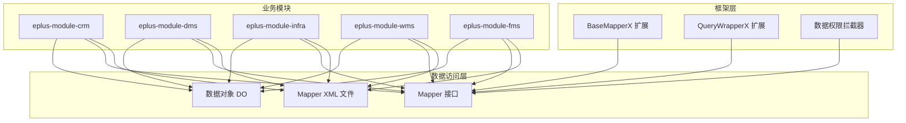
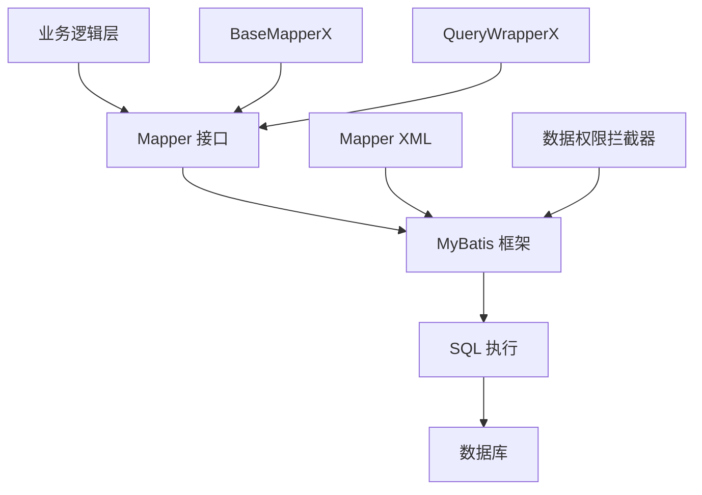
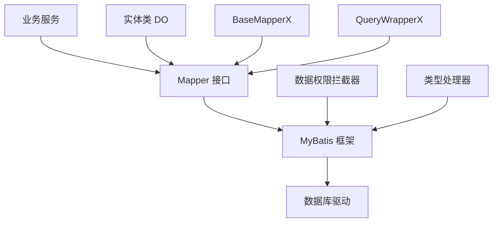

# ORM最佳实践

<cite>
**本文档引用文件**  
- [SnMapper.xml](file://eplus-module-infra/eplus-module-infra-biz/src/main/resources/mapper/sn/SnMapper.xml)
- [SnMapper.java](file://eplus-module-infra/eplus-module-infra-biz/src/main/java/com/syj/eplus/module/infra/dal/mysql/sn/SnMapper.java)
- [SnDO.java](file://eplus-module-infra/eplus-module-infra-biz/src/main/java/com/syj/eplus/module/infra/dal/dataobject/sn/SnDO.java)
- [CustMapper.xml](file://eplus-module-crm/eplus-module-crm-biz/src/main/resources/mapper/CustMapper.xml)
- [ShipmentItemMapper.xml](file://eplus-module-dms/eplus-module-dms-biz/src/main/resources/mapper/ShipmentItemMapper.xml)
- [BaseMapperX.java](file://yudao-framework/yudao-spring-boot-starter-mybatis/src/main/java/cn/iocoder/yudao/framework/mybatis/core/mapper/BaseMapperX.java)
- [QueryWrapperX.java](file://yudao-framework/yudao-spring-boot-starter-mybatis/src/main/java/cn/iocoder/yudao/framework/mybatis/core/query/QueryWrapperX.java)
- [LambdaQueryWrapperX.java](file://yudao-framework/yudao-spring-boot-starter-mybatis/src/main/java/cn/iocoder/yudao/framework/mybatis/core/query/LambdaQueryWrapperX.java)
- [DataPermissionDatabaseInterceptor.java](file://yudao-framework/yudao-spring-boot-starter-data-permission/src/main/java/cn/iocoder/yudao/framework/datapermission/core/db/DataPermissionDatabaseInterceptor.java)
- [PurchaseContractItemConvert.java](file://eplus-module-scm/eplus-module-scm-biz/src/main/java/com/syj/eplus/module/scm/convert/PurchaseContractItemConvert.java)
- [OrderLinkServiceImpl.java](file://eplus-module-infra/eplus-module-infra-biz/src/main/java/com/syj/eplus/module/infra/service/orderlink/OrderLinkServiceImpl.java)
- [ItemBaseMapperUtil.java](file://yudao-framework/yudao-spring-boot-starter-mybatis/src/main/java/cn/iocoder/yudao/framework/mybatis/core/mapper/ItemBaseMapperUtil.java)
</cite>

## 目录
1. [引言](#引言)
2. [项目结构](#项目结构)
3. [核心组件](#核心组件)
4. [架构概述](#架构概述)
5. [详细组件分析](#详细组件分析)
6. [依赖分析](#依赖分析)
7. [性能考虑](#性能考虑)
8. [故障排除指南](#故障排除指南)
9. [结论](#结论)

## 引言

本文档旨在为开发者提供MyBatis ORM框架的使用最佳实践，指导如何高效、安全地进行数据库操作。文档详细说明了Mapper XML文件的编写规范，包括SQL语句结构、参数绑定和结果映射。同时介绍了动态SQL的使用场景和注意事项，解释了实体类（DO）与数据传输对象（DTO）的转换模式，并提供了防止SQL注入和N+1查询问题的解决方案。文档还包含性能敏感操作的指导，如批量插入更新、分页查询优化，并结合实际代码示例展示最佳实践。

## 项目结构

项目采用模块化设计，每个业务模块都有独立的API和业务实现模块。ORM相关代码主要分布在各个模块的`dal`（Data Access Layer）包中，包括数据对象（DO）、Mapper接口和XML映射文件。项目使用MyBatis作为ORM框架，并通过自定义扩展增强了其功能。



**图源**  
- [SnDO.java](file://eplus-module-infra/eplus-module-infra-biz/src/main/java/com/syj/eplus/module/infra/dal/dataobject/sn/SnDO.java)
- [SnMapper.java](file://eplus-module-infra/eplus-module-infra-biz/src/main/java/com/syj/eplus/module/infra/dal/mysql/sn/SnMapper.java)
- [SnMapper.xml](file://eplus-module-infra/eplus-module-infra-biz/src/main/resources/mapper/sn/SnMapper.xml)
- [BaseMapperX.java](file://yudao-framework/yudao-spring-boot-starter-mybatis/src/main/java/cn/iocoder/yudao/framework/mybatis/core/mapper/BaseMapperX.java)

**本节来源**  
- [项目结构](file://project_structure)

## 核心组件

系统的核心ORM组件包括：
- **BaseMapperX**: MyBatis Plus BaseMapper的扩展，提供了丰富的CRUD操作方法
- **QueryWrapperX**: 查询条件构造器的扩展，支持条件值存在时才添加条件
- **DataPermissionDatabaseInterceptor**: 数据权限拦截器，自动为SQL添加数据权限过滤条件
- **实体类（DO）**: 使用Lombok注解简化代码，通过MyBatis Plus注解映射数据库表
- **结果映射**: 在Mapper XML中定义复杂的结果映射关系

这些组件共同构成了高效、安全的数据库访问基础。

**本节来源**  
- [BaseMapperX.java](file://yudao-framework/yudao-spring-boot-starter-mybatis/src/main/java/cn/iocoder/yudao/framework/mybatis/core/mapper/BaseMapperX.java)
- [QueryWrapperX.java](file://yudao-framework/yudao-spring-boot-starter-mybatis/src/main/java/cn/iocoder/yudao/framework/mybatis/core/query/QueryWrapperX.java)
- [DataPermissionDatabaseInterceptor.java](file://yudao-framework/yudao-spring-boot-starter-data-permission/src/main/java/cn/iocoder/yudao/framework/datapermission/core/db/DataPermissionDatabaseInterceptor.java)
- [SnDO.java](file://eplus-module-infra/eplus-module-infra-biz/src/main/java/com/syj/eplus/module/infra/dal/dataobject/sn/SnDO.java)

## 架构概述

系统采用分层架构，ORM层位于业务逻辑层和数据库之间，负责数据的持久化操作。MyBatis作为ORM框架，通过Mapper接口和XML映射文件实现Java对象与数据库记录的映射。系统对MyBatis进行了扩展，提供了更便捷的API和额外的功能。



**图源**  
- [BaseMapperX.java](file://yudao-framework/yudao-spring-boot-starter-mybatis/src/main/java/cn/iocoder/yudao/framework/mybatis/core/mapper/BaseMapperX.java)
- [QueryWrapperX.java](file://yudao-framework/yudao-spring-boot-starter-mybatis/src/main/java/cn/iocoder/yudao/framework/mybatis/core/query/QueryWrapperX.java)
- [DataPermissionDatabaseInterceptor.java](file://yudao-framework/yudao-spring-boot-starter-data-permission/src/main/java/cn/iocoder/yudao/framework/datapermission/core/db/DataPermissionDatabaseInterceptor.java)

## 详细组件分析

### Mapper XML编写规范

Mapper XML文件是MyBatis中定义SQL语句的重要组成部分。根据项目规范，应尽可能使用Mapper接口进行CRUD操作，只有在无法满足需求的场景下（如多表关联查询）才使用XML编写SQL。

```xml
<?xml version="1.0" encoding="UTF-8"?>
<!DOCTYPE mapper PUBLIC "-//mybatis.org//DTD Mapper 3.0//EN" "http://mybatis.org/dtd/mybatis-3-mapper.dtd">
<mapper namespace="com.syj.eplus.module.crm.dal.mysql.cust.CustMapper">
    <!--
        一般情况下，尽可能使用 Mapper 进行 CRUD 增删改查即可。
        无法满足的场景，例如说多表关联查询，才使用 XML 编写 SQL。
        代码生成器暂时只生成 Mapper XML 文件本身，更多推荐 MybatisX 快速开发插件来生成查询。
        文档可见：https://www.iocoder.cn/MyBatis/x-plugins/
     -->
</mapper>
```

**结果映射规范**：
- 使用`resultMap`定义结果映射关系
- 支持继承`resultMap`以减少重复定义
- 可以使用`typeHandler`处理复杂类型的映射

```xml
<resultMap id="BaseResultMap" type="com.syj.eplus.module.crm.api.cust.dto.SimpleCustRespDTO">
    <result column="id" jdbcType="BIGINT" property="id"/>
    <result column="code" jdbcType="VARCHAR" property="name"/>
    <result column="createTime" jdbcType="TIMESTAMP" property="createTime"/>
</resultMap>
<resultMap id="ResultMapWithJson" type="com.syj.eplus.module.crm.api.cust.dto.SimpleCustRespDTO"
           extends="BaseResultMap">
    <result column="customerTypes" property="customerTypes" javaType="java.util.List"
            typeHandler="com.syj.eplus.framework.common.config.handler.LongListTypeHandler"/>
</resultMap>
```

**本节来源**  
- [CustMapper.xml](file://eplus-module-crm/eplus-module-crm-biz/src/main/resources/mapper/CustMapper.xml)
- [ShipmentItemMapper.xml](file://eplus-module-dms/eplus-module-dms-biz/src/main/resources/mapper/ShipmentItemMapper.xml)

### 动态SQL使用

项目中动态SQL的使用遵循最佳实践，通过条件判断来构建灵活的查询语句。MyBatis提供了多种动态SQL标签，如`if`、`choose`、`when`、`otherwise`、`trim`、`where`、`set`、`foreach`等。

**注意事项**：
- 避免在动态SQL中拼接字符串，以防止SQL注入
- 使用`parameterType`明确指定参数类型
- 合理使用`where`标签，避免多余的AND或OR
- 使用`foreach`标签处理集合参数时，注意`collection`属性的正确设置

### 实体类与DTO转换

实体类（DO）与数据传输对象（DTO）的转换通过MapStruct实现，这是一种编译时代码生成的映射框架，性能优于反射-based的映射工具。

```java
@Mapper
public interface PurchaseContractItemConvert {
    PurchaseContractItemConvert INSTANCE = Mappers.getMapper(PurchaseContractItemConvert.class);

    @Mapping(target = "effectRangeList",ignore = true)
    PurchaseContractItemRespVO convert(PurchaseContractItemDO purchaseContractItemDO);

    default List<PurchaseContractItemAndContractInfoRespVO> convert2(
            Map<Long, PurchaseContractDO> purchaseContractDOMap, 
            List<PurchaseContractItemDO> itemDoList) {
        return CollectionUtils.convertList(itemDoList, itemDo -> {
            PurchaseContractItemRespVO resp = convert(itemDo);
            PurchaseContractItemAndContractInfoRespVO respVO = BeanUtils.toBean(resp, PurchaseContractItemAndContractInfoRespVO.class);
            // 填充关联数据
            if (Objects.isNull(itemDo.getPurchaseContractId()) || CollUtil.isEmpty(purchaseContractDOMap)) {
                return respVO;
            }
            PurchaseContractDO purchaseContractDO = purchaseContractDOMap.get(itemDo.getPurchaseContractId());
            if (Objects.isNull(purchaseContractDO)) {
                return respVO;
            }
            respVO.setCode(purchaseContractDO.getCode());
            // ... 其他字段填充
            return respVO;
        });
    }
}
```

**本节来源**  
- [PurchaseContractItemConvert.java](file://eplus-module-scm/eplus-module-scm-biz/src/main/java/com/syj/eplus/module/scm/convert/PurchaseContractItemConvert.java)

### SQL注入防护

系统通过多种机制防止SQL注入攻击：
1. **参数化查询**：MyBatis默认使用预编译语句，参数通过`?`占位符传递，从根本上防止SQL注入
2. **数据权限拦截器**：自动为查询添加数据权限过滤条件，避免手动拼接SQL
3. **输入验证**：在业务层对用户输入进行严格验证

```java
// 使用QueryWrapperX的安全查询方法
queryWrapperX.eqIfPresent("fileName", value);
queryWrapperX.likeIfPresent("fileName", (String) value);
queryWrapperX.inIfPresent("fileName", value);
```

**本节来源**  
- [QueryWrapperX.java](file://yudao-framework/yudao-spring-boot-starter-mybatis/src/main/java/cn/iocoder/yudao/framework/mybatis/core/query/QueryWrapperX.java)
- [FilterUtil.java](file://yudao-framework/yudao-spring-boot-starter-mybatis/src/main/java/cn/iocoder/yudao/framework/mybatis/core/util/FilterUtil.java)

### N+1查询问题解决方案

N+1查询问题是ORM框架常见的性能问题。本系统通过以下方式解决：
1. **关联查询**：使用MyBatis Plus Join扩展进行多表关联查询
2. **批量查询**：将多个单条查询合并为批量查询
3. **缓存**：合理使用缓存减少数据库访问

```java
// 批量更新替代N次单条更新
@Override
public void batchUpdateOrderLinkStatus(List<OrderLinkDTO> orderLinkDTOList, Integer status) {
    if (CollUtil.isEmpty(orderLinkDTOList)) {
        return;
    }
    // 收集所有需要更新的记录ID
    List<Long> ids = orderLinkDTOList.stream()
            .map(OrderLinkDTO::getId)
            .filter(Objects::nonNull)
            .collect(Collectors.toList());

    if (CollUtil.isNotEmpty(ids)) {
        // 使用IN条件批量更新
        orderLinkMapper.update(
                new OrderLink().setStatus(status),
                new LambdaQueryWrapperX<OrderLink>().in(OrderLink::getId, ids)
        );
    }
}
```

**本节来源**  
- [OrderLinkServiceImpl.java](file://eplus-module-infra/eplus-module-infra-biz/src/main/java/com/syj/eplus/module/infra/service/orderlink/OrderLinkServiceImpl.java)

### 性能敏感操作指导

#### 批量操作

对于大量数据的插入、更新操作，应使用批量处理方法以提高性能。

```java
// 批量插入
default Boolean insertBatch(Collection<T> entities, int size) {
    return Db.saveBatch(entities, size);
}

// 批量更新
default Boolean updateBatch(Collection<T> entities, int size) {
    return Db.updateBatchById(entities, size);
}

// 批量删除
default boolean deleteBatchIds(@Param("coll") Collection<? extends Serializable> idList) {
    return delete(new LambdaQueryWrapper<T>().in(getIdColumn(), idList));
}
```

#### 分页查询优化

分页查询应避免使用`OFFSET`，特别是在大数据量情况下。可以考虑使用游标分页或基于索引的分页。

```java
// 使用PageParam进行分页查询
default PageResult<T> selectPage(PageParam pageParam, @Param("ew") Wrapper<T> queryWrapper) {
    // 特殊：不分页，直接查询全部
    if (PageParam.PAGE_SIZE_NONE.equals(pageParam.getPageSize())) {
        List<T> list = selectList(queryWrapper);
        return new PageResult<>(list, (long) list.size());
    }
    
    // MyBatis Plus 查询
    IPage<T> mpPage = MyBatisUtils.buildPage(pageParam);
    selectPage(mpPage, queryWrapper);
    // 转换返回
    return new PageResult<>(mpPage.getRecords(), mpPage.getTotal());
}
```

**本节来源**  
- [BaseMapperX.java](file://yudao-framework/yudao-spring-boot-starter-mybatis/src/main/java/cn/iocoder/yudao/framework/mybatis/core/mapper/BaseMapperX.java)
- [MyBatisUtils.java](file://yudao-framework/yudao-spring-boot-starter-mybatis/src/main/java/cn/iocoder/yudao/framework/mybatis/core/util/MyBatisUtils.java)

### 子项批量处理工具

系统提供了通用的子项批量处理工具类，用于处理一对多关系中的子项增删改操作。

```java
public class ItemBaseMapperUtil {
    /**
     * 处理子项增删改
     *
     * @param itemList        子项列表
     * @param itemBaseMapperX BaseMapper类
     */
    public static <T extends ChangeExInterface> void dealItemList(
            Collection<T> itemList, BaseMapperX<T> itemBaseMapperX) {
        List<T> insertList;
        List<T> updateList;
        List<Long> deleteList;
        if (CollUtil.isEmpty(itemList)) {
            return;
        }
        // 新增项
        insertList = itemList.stream()
                .filter(s -> ChangeTypeEnum.ADDED.getType().equals(s.getChangeFlag()))
                .toList();
        // 修改项
        updateList = itemList.stream()
                .filter(s -> ChangeTypeEnum.UPDATE.getType().equals(s.getChangeFlag()))
                .toList();
        // 删除项
        deleteList = itemList.stream()
                .filter(s -> ChangeTypeEnum.DELETED.getType().equals(s.getChangeFlag()))
                .map(T::getId)
                .toList();
        
        if (CollUtil.isNotEmpty(insertList)) {
            itemBaseMapperX.insertBatch(insertList);
        }
        if (CollUtil.isNotEmpty(updateList)) {
            itemBaseMapperX.updateBatch(updateList);
        }
        if (CollUtil.isNotEmpty(deleteList)) {
            itemBaseMapperX.deleteBatchIds(deleteList);
        }
    }
}
```

**本节来源**  
- [ItemBaseMapperUtil.java](file://yudao-framework/yudao-spring-boot-starter-mybatis/src/main/java/cn/iocoder/yudao/framework/mybatis/core/mapper/ItemBaseMapperUtil.java)

## 依赖分析

系统ORM组件的依赖关系清晰，各层职责分明。Mapper接口依赖于MyBatis框架和自定义扩展，实体类通过注解与数据库表映射，业务服务层通过依赖注入使用Mapper接口。



**图源**  
- [SnMapper.java](file://eplus-module-infra/eplus-module-infra-biz/src/main/java/com/syj/eplus/module/infra/dal/mysql/sn/SnMapper.java)
- [BaseMapperX.java](file://yudao-framework/yudao-spring-boot-starter-mybatis/src/main/java/cn/iocoder/yudao/framework/mybatis/core/mapper/BaseMapperX.java)
- [DataPermissionDatabaseInterceptor.java](file://yudao-framework/yudao-spring-boot-starter-data-permission/src/main/java/cn/iocoder/yudao/framework/datapermission/core/db/DataPermissionDatabaseInterceptor.java)

**本节来源**  
- [项目依赖关系](file://project_dependencies)

## 性能考虑

在使用MyBatis进行数据库操作时，需要考虑以下性能因素：
- **批量操作**：对于大量数据的插入、更新、删除操作，应使用批量处理方法
- **分页查询**：避免使用OFFSET分页，考虑使用游标分页或基于索引的分页
- **关联查询**：合理使用关联查询，避免N+1查询问题
- **缓存**：合理使用一级缓存和二级缓存，减少数据库访问
- **索引**：确保查询条件中的字段有适当的索引
- **连接池**：配置合适的数据库连接池参数

## 故障排除指南

### 常见问题及解决方案

1. **SQL语法错误**
   - 检查XML文件中的SQL语句是否正确
   - 确认参数名称与Java对象属性名称匹配
   - 使用日志查看实际执行的SQL语句

2. **结果映射错误**
   - 检查`resultMap`定义是否正确
   - 确认数据库字段名与Java属性名的映射关系
   - 检查`typeHandler`是否正确配置

3. **性能问题**
   - 检查是否存在N+1查询问题
   - 确认是否使用了适当的索引
   - 分析慢查询日志

4. **事务问题**
   - 确认`@Transactional`注解是否正确使用
   - 检查异常是否被正确处理
   - 确认事务传播行为是否符合预期

**本节来源**  
- [日志记录](file://logging_configuration)
- [性能监控](file://performance_monitoring)

## 结论

本文档详细介绍了MyBatis ORM框架在项目中的最佳实践，涵盖了Mapper XML编写规范、动态SQL使用、实体类与DTO转换、SQL注入防护、N+1查询问题解决方案以及性能敏感操作的指导。通过遵循这些最佳实践，开发者可以更高效、安全地进行数据库操作，提高代码质量和系统性能。

关键要点包括：
- 优先使用Mapper接口进行CRUD操作，仅在必要时使用XML编写SQL
- 使用QueryWrapperX等扩展工具简化查询条件构建
- 通过MapStruct实现实体类与DTO的高效转换
- 采用多种机制防止SQL注入攻击
- 解决N+1查询问题，优化批量操作和分页查询性能
- 使用通用工具类简化子项批量处理

遵循这些最佳实践将有助于构建高效、安全、可维护的数据库访问层。