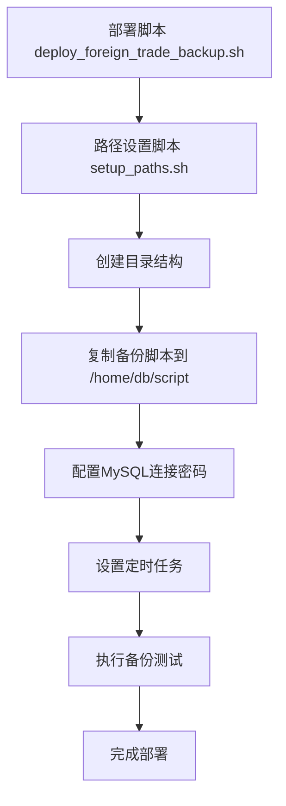
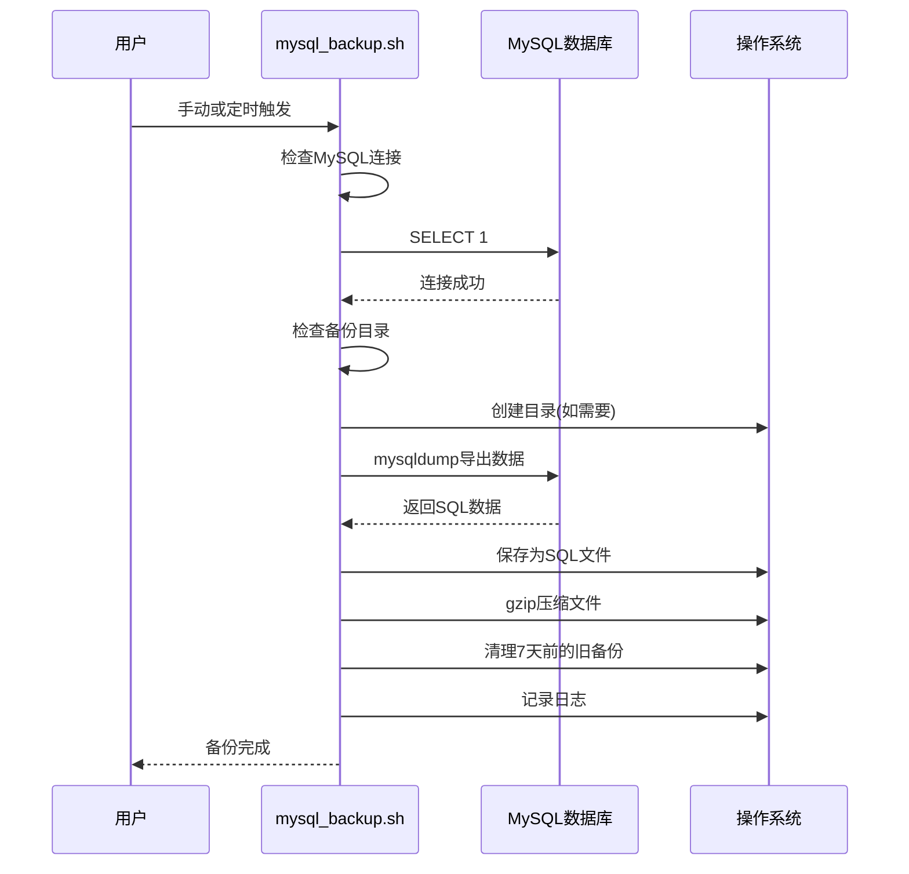
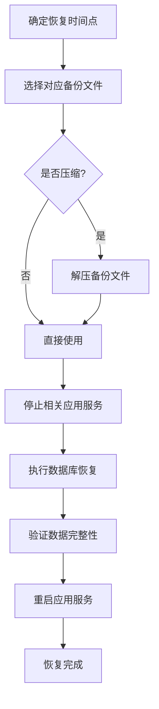

# 备份与恢复

<cite>
**本文档引用的文件**   
- [mysql_backup.sh](file://mysql_backup_system/mysql_backup.sh)
- [README.md](file://mysql_backup_system/README.md)
- [deploy_foreign_trade_backup.sh](file://mysql_backup_system/deploy_foreign_trade_backup.sh)
- [setup_paths.sh](file://mysql_backup_system/setup_paths.sh)
- [V1_0_0_001__框架初始化.sql](file://eplus-flyway/src/main/resources/db/migration/common/V1_0_0_001__框架初始化.sql)
- [V1_0_0_002__Eplus初始化.sql](file://eplus-flyway/src/main/resources/db/migration/common/V1_0_0_002__Eplus初始化.sql)
- [application-unit-test.yaml](file://eplus-framework/eplus-common/src/test/resources/application-unit-test.yaml)
</cite>

## 目录
1. [数据保护策略概述](#数据保护策略概述)
2. [自动化备份脚本分析](#自动化备份脚本分析)
3. [备份策略与配置](#备份策略与配置)
4. [备份文件管理](#备份文件管理)
5. [灾难恢复流程](#灾难恢复流程)
6. [备份验证与演练](#备份验证与演练)
7. [数据归档与敏感数据处理](#数据归档与敏感数据处理)
8. [系统架构与依赖](#系统架构与依赖)

## 数据保护策略概述

本系统采用基于MySQL的全量备份策略，确保`foreign_trade`数据库的数据安全。备份系统设计遵循业务连续性和合规性要求，通过自动化脚本实现每日定时备份，保留7天历史数据。系统采用密码认证方式连接MySQL 8.0数据库，备份文件存储在`/home/db/data`目录下，并通过日志文件`/var/log/mysql_backup.log`记录备份过程。备份策略覆盖数据库结构、完整数据内容、存储过程、函数、触发器、事件和视图定义，确保数据完整性。

**Section sources**
- [README.md](file://mysql_backup_system/README.md#L3-L16)

## 自动化备份脚本分析

自动化备份系统由多个核心脚本组成，包括`mysql_backup.sh`（核心备份脚本）、`deploy_foreign_trade_backup.sh`（快速部署脚本）和`setup_paths.sh`（路径设置脚本）。这些脚本协同工作，实现了备份系统的自动化部署和执行。



**Diagram sources **
- [deploy_foreign_trade_backup.sh](file://mysql_backup_system/deploy_foreign_trade_backup.sh)
- [setup_paths.sh](file://mysql_backup_system/setup_paths.sh)

### 核心备份脚本工作原理

`mysql_backup.sh`脚本是备份系统的核心，其工作流程包括：检查MySQL连接、验证备份目录、执行数据库备份、压缩备份文件和清理过期备份。脚本使用`mysqldump`工具进行备份，采用`--single-transaction`选项确保数据一致性，同时备份数据库结构和数据。



**Diagram sources **
- [mysql_backup.sh](file://mysql_backup_system/mysql_backup.sh)

**Section sources**
- [mysql_backup.sh](file://mysql_backup_system/mysql_backup.sh)
- [README.md](file://mysql_backup_system/README.md#L19-L24)

## 备份策略与配置

系统采用全量备份策略，不实施增量备份。每日凌晨2点执行一次全量备份，保留最近7天的备份文件。备份配置参数在`mysql_backup.sh`脚本中定义，包括数据库连接信息、备份目录、保留天数等。

### 备份配置参数

| 配置项 | 值 | 说明 |
|--------|----|------|
| 备份数据库 | foreign_trade | 指定备份的数据库名称 |
| 备份频率 | 每天凌晨2点 | 通过cron定时任务执行 |
| 保留时间 | 7天 | 自动清理超过7天的备份文件 |
| 备份目录 | /home/db/data | 备份文件存储位置 |
| 日志文件 | /var/log/mysql_backup.log | 备份过程日志 |
| MySQL主机 | localhost | 数据库服务器地址 |
| MySQL端口 | 3306 | 数据库服务端口 |
| MySQL用户 | root | 数据库连接用户 |

**Section sources**
- [mysql_backup.sh](file://mysql_backup_system/mysql_backup.sh#L270-L282)
- [README.md](file://mysql_backup_system/README.md#L9-L16)

## 备份文件管理

备份文件采用特定的命名规则，便于识别和管理。系统自动创建和维护备份文件，同时提供手动管理命令。

### 备份文件命名规则

备份文件遵循以下命名格式：
```
foreign_trade_YYYYMMDD_HHMMSS.sql.gz
```
例如：`foreign_trade_20240101_020000.sql.gz`

其中：
- `foreign_trade`：数据库名称
- `YYYYMMDD`：备份日期（年月日）
- `HHMMSS`：备份时间（时分秒）
- `.sql.gz`：文件扩展名，表示经过gzip压缩的SQL文件

### 备份文件管理命令

```bash
# 查看备份目录大小
du -sh /home/db/data/

# 查看备份文件数量
ls -1 /home/db/data/*.sql* | wc -l

# 查看最大的备份文件
ls -lh /home/db/data/*.sql* | sort -k5 -hr | head -3

# 查看备份目录使用情况
df -h /home/db/data/
```

**Section sources**
- [README.md](file://mysql_backup_system/README.md#L143-L158)
- [README.md](file://mysql_backup_system/README.md#L129-L139)

## 灾难恢复流程

灾难恢复流程包括从备份中恢复整个数据库或特定表的操作步骤。恢复过程需要先解压备份文件，然后使用mysql命令导入数据。

### 恢复整个数据库

```bash
# 解压备份文件
gunzip foreign_trade_20240101_020000.sql.gz

# 恢复数据库
mysql -u root -p foreign_trade < foreign_trade_20240101_020000.sql
```

### 恢复特定表

```bash
# 从备份文件中提取特定表
sed -n '/^-- Table structure for table `表名`/,/^-- Table structure for table/p' foreign_trade_20240101_020000.sql > table_backup.sql

# 恢复特定表
mysql -u root -p foreign_trade < table_backup.sql
```

### 恢复流程图



**Diagram sources **
- [README.md](file://mysql_backup_system/README.md#L160-L179)

**Section sources**
- [README.md](file://mysql_backup_system/README.md#L159-L179)

## 备份验证与演练

为确保备份数据的可靠性和可恢复性，系统需要定期进行备份验证和恢复演练。这包括检查备份文件完整性、测试恢复流程和监控备份执行情况。

### 备份验证机制

```bash
# 查看成功备份记录
grep "SUCCESS" /var/log/mysql_backup.log | tail -10

# 查看备份执行时间
grep "备份完成" /var/log/mysql_backup.log | tail -5

# 查看错误信息
grep "ERROR" /var/log/mysql_backup.log | tail -10

# 手动执行备份测试
sudo /home/db/script/mysql_backup.sh
```

### 定期演练计划

1. **每月演练**：每月执行一次完整的恢复演练，验证备份文件的可恢复性。
2. **季度审查**：每季度审查备份策略和配置，确保符合业务需求。
3. **年度审计**：每年进行一次全面的数据保护审计，包括备份完整性、恢复时间和安全合规性。

**Section sources**
- [README.md](file://mysql_backup_system/README.md#L183-L214)

## 数据归档与敏感数据处理

虽然当前备份系统未明确实现数据归档策略，但基于数据库结构分析，系统包含客户信息、银行账户等敏感数据，需要特别关注数据安全。

### 敏感数据处理规范

根据数据库结构分析，系统包含以下敏感数据表：
- `crm_cust`：客户资料表，包含客户联系信息、银行账户等
- `crm_cust_bankaccount`：客户银行账户信息表
- `system_users`：用户信息表，包含用户账号、密码、银行信息等

### 数据安全建议

1. **密码安全**：定期更换MySQL密码，避免使用弱密码。
2. **文件权限**：确保备份文件权限合理，限制非授权访问。
3. **异地备份**：考虑将备份文件同步到其他服务器或云存储，提高容灾能力。
4. **加密存储**：对包含敏感数据的备份文件进行加密存储。
5. **访问控制**：严格控制备份系统的访问权限，仅授权必要人员操作。

**Section sources**
- [V1_0_0_001__框架初始化.sql](file://eplus-flyway/src/main/resources/db/migration/common/V1_0_0_001__框架初始化.sql)
- [V1_0_0_002__Eplus初始化.sql](file://eplus-flyway/src/main/resources/db/migration/common/V1_0_0_002__Eplus初始化.sql)
- [application-unit-test.yaml](file://eplus-framework/eplus-common/src/test/resources/application-unit-test.yaml)

## 系统架构与依赖

备份系统依赖于MySQL数据库服务和Linux操作系统环境。系统架构简单，主要由备份脚本、定时任务和日志系统组成。

```mermaid
graph LR
A[MySQL数据库] --> B[mysql_backup.sh]
C[Cron定时任务] --> B
B --> D[/home/db/data/]
B --> E[/var/log/mysql_backup.log]
F[部署脚本] --> B
F --> G[setup_paths.sh]
```

**Diagram sources **
- [mysql_backup.sh](file://mysql_backup_system/mysql_backup.sh)
- [deploy_foreign_trade_backup.sh](file://mysql_backup_system/deploy_foreign_trade_backup.sh)
- [setup_paths.sh](file://mysql_backup_system/setup_paths.sh)

**Section sources**
- [mysql_backup.sh](file://mysql_backup_system/mysql_backup.sh)
- [deploy_foreign_trade_backup.sh](file://mysql_backup_system/deploy_foreign_trade_backup.sh)
- [setup_paths.sh](file://mysql_backup_system/setup_paths.sh)