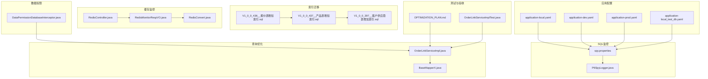
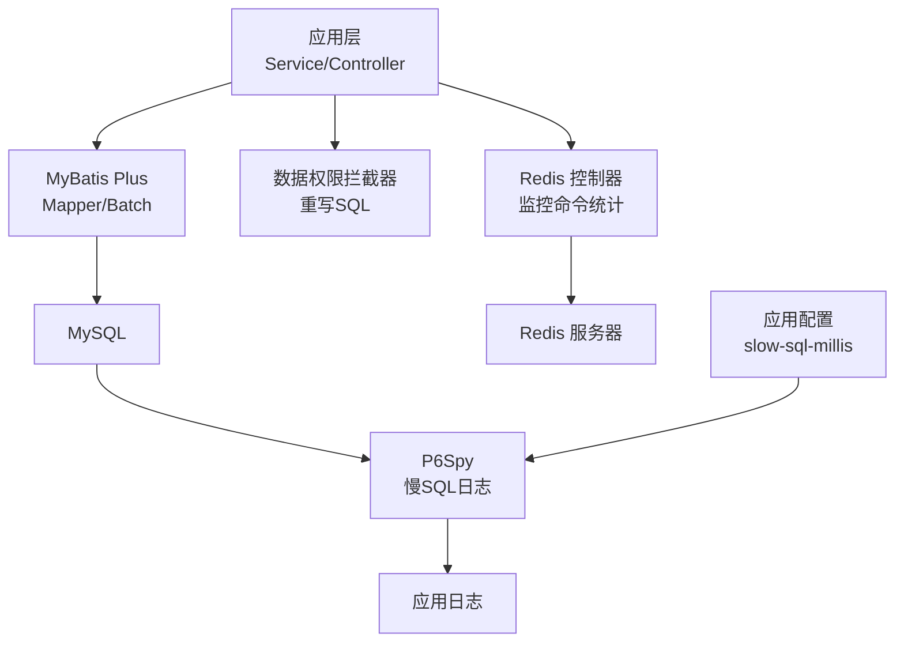
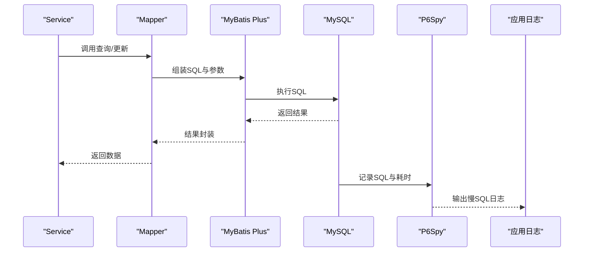
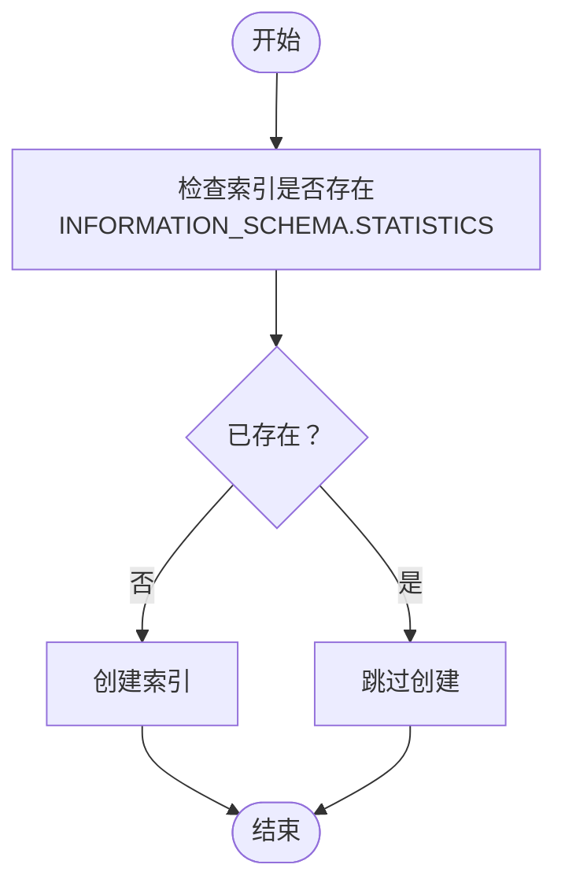
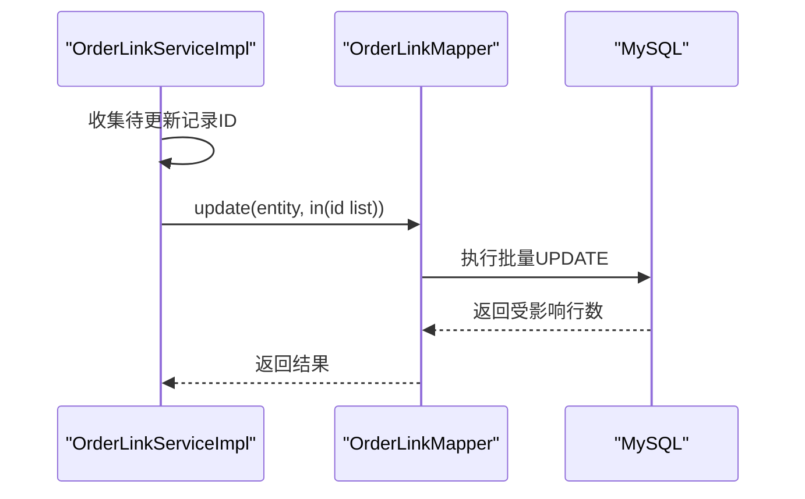
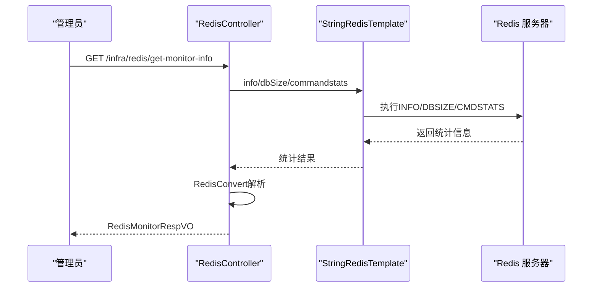
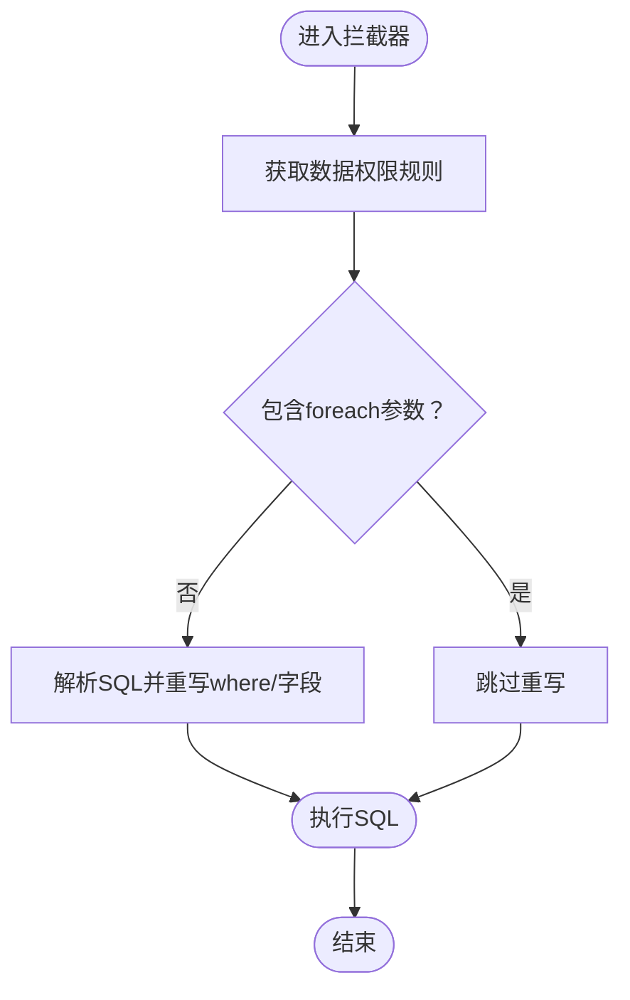
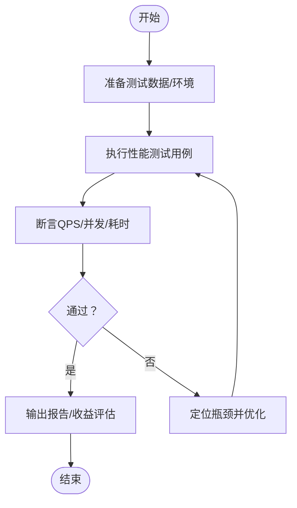
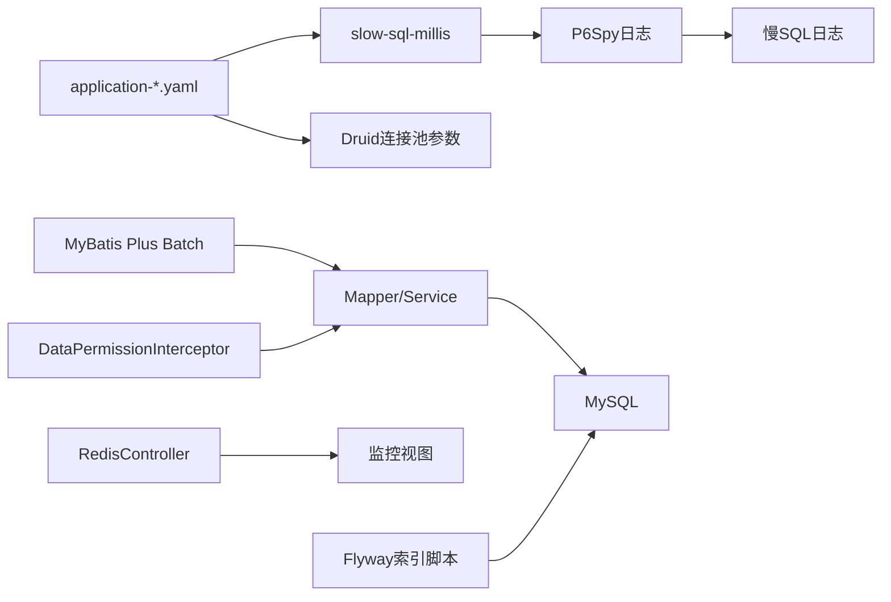

# 性能优化

<cite>
**本文引用的文件**
- [OPTIMIZATION_PLAN.md](file://eplus-module-infra/OPTIMIZATION_PLAN.md)
- [P6SpyLogger.java](file://eplus-framework/eplus-common/src/main/java/com/syj/eplus/framework/common/config/P6SpyLogger.java)
- [spy.properties](file://eplus-framework/eplus-common/src/main/resources/spy.properties)
- [application-local.yaml](file://yudao-server/src/main/resources/application-local.yaml)
- [application-dev.yaml](file://yudao-server/src/main/resources/application-dev.yaml)
- [application-prod.yaml](file://yudao-server/src/main/resources/application-prod.yaml)
- [application-local_test_db.yaml](file://yudao-server/src/main/resources/application-local_test_db.yaml)
- [V1_0_0_436__报价表增加索引.sql](file://eplus-flyway/src/main/resources/db/migration/common/V1_0_0_436__报价表增加索引.sql)
- [V1_0_0_437__产品表增加索引.sql](file://eplus-flyway/src/main/resources/db/migration/common/V1_0_0_437__产品表增加索引.sql)
- [V1_0_0_397__客户供应商表增加索引.sql](file://eplus-flyway/src/main/resources/db/migration/common/V1_0_0_397__客户供应商表增加索引.sql)
- [OrderLinkServiceImpl.java](file://eplus-module-infra/eplus-module-infra-biz/src/main/java/com/syj/eplus/module/infra/service/orderlink/OrderLinkServiceImpl.java)
- [SnServiceImpl.java](file://eplus-module-infra/eplus-module-infra-biz/src/main/java/com/syj/eplus/module/infra/service/sn/SnServiceImpl.java)
- [CodeGeneratorApiImpl.java](file://eplus-module-infra/eplus-module-infra-biz/src/main/java/com/syj/eplus/module/infra/api/code/CodeGeneratorApiImpl.java)
- [RedisController.java](file://yudao-module-infra/yudao-module-infra-biz/src/main/java/cn/iocoder/yudao/module/infra/controller/admin/redis/RedisController.java)
- [RedisMonitorRespVO.java](file://yudao-module-infra/yudao-module-infra-biz/src/main/java/cn/iocoder/yudao/module/infra/controller/admin/redis/vo/RedisMonitorRespVO.java)
- [RedisConvert.java](file://yudao-module-infra/yudao-module-infra-biz/src/main/java/cn/iocoder/yudao/module/infra/convert/redis/RedisConvert.java)
- [BaseMapperX.java](file://yudao-framework/yudao-spring-boot-starter-mybatis/src/main/java/cn/iocoder/yudao/framework/mybatis/core/mapper/BaseMapperX.java)
- [DataPermissionDatabaseInterceptor.java](file://yudao-framework/yudao-spring-boot-starter-data-permission/src/main/java/cn/iocoder/yudao/framework/datapermission/core/db/DataPermissionDatabaseInterceptor.java)
- [OrderLinkServiceImplTest.java](file://eplus-module-infra/eplus-module-infra-biz/src/test/java/com/syj/eplus/module/infra/service/orderlink/OrderLinkServiceImplTest.java)
</cite>

## 目录
1. [简介](#简介)
2. [项目结构](#项目结构)
3. [核心组件](#核心组件)
4. [架构总览](#架构总览)
5. [详细组件分析](#详细组件分析)
6. [依赖分析](#依赖分析)
7. [性能考量](#性能考量)
8. [故障排查指南](#故障排查指南)
9. [结论](#结论)
10. [附录](#附录)

## 简介
本文件面向数据库性能优化，系统梳理索引设计原则、慢查询识别与优化、查询优化技巧、性能监控指标、基准测试方法与容量规划建议。结合仓库中现有的数据库连接池配置、SQL监控、索引迁移脚本、批量更新与缓存监控等实践，帮助DBA与开发者共同维护数据库的高性能运行。

## 项目结构
围绕数据库性能优化的关键文件分布如下：
- SQL监控与慢查询阈值：application-*.yaml、spy.properties、P6SpyLogger.java
- 索引设计与迁移：Flyway索引脚本
- 查询与批量优化：MyBatis Plus批量接口、OrderLinkServiceImpl批量更新
- 缓存监控与命中率：RedisController、RedisMonitorRespVO、RedisConvert
- 数据权限与SQL重写：DataPermissionDatabaseInterceptor
- 基准测试与性能验收：OPTIMIZATION_PLAN.md、OrderLinkServiceImplTest

图表来源
- [application-local.yaml](file://yudao-server/src/main/resources/application-local.yaml#L38-L70)
- [application-dev.yaml](file://yudao-server/src/main/resources/application-dev.yaml#L38-L70)
- [application-prod.yaml](file://yudao-server/src/main/resources/application-prod.yaml#L38-L63)
- [application-local_test_db.yaml](file://yudao-server/src/main/resources/application-local_test_db.yaml#L38-L70)
- [spy.properties](file://eplus-framework/eplus-common/src/main/resources/spy.properties#L1-L21)
- [P6SpyLogger.java](file://eplus-framework/eplus-common/src/main/java/com/syj/eplus/framework/common/config/P6SpyLogger.java#L1-L40)
- [V1_0_0_436__报价表增加索引.sql](file://eplus-flyway/src/main/resources/db/migration/common/V1_0_0_436__报价表增加索引.sql#L1-L78)
- [V1_0_0_437__产品表增加索引.sql](file://eplus-flyway/src/main/resources/db/migration/common/V1_0_0_437__产品表增加索引.sql#L1-L78)
- [V1_0_0_397__客户供应商表增加索引.sql](file://eplus-flyway/src/main/resources/db/migration/common/V1_0_0_397__客户供应商表增加索引.sql#L1-L17)
- [BaseMapperX.java](file://yudao-framework/yudao-spring-boot-starter-mybatis/src/main/java/cn/iocoder/yudao/framework/mybatis/core/mapper/BaseMapperX.java#L137-L175)
- [OrderLinkServiceImpl.java](file://eplus-module-infra/eplus-module-infra-biz/src/main/java/com/syj/eplus/module/infra/service/orderlink/OrderLinkServiceImpl.java#L56-L75)
- [RedisController.java](file://yudao-module-infra/yudao-module-infra-biz/src/main/java/cn/iocoder/yudao/module/infra/controller/admin/redis/RedisController.java#L1-L43)
- [RedisMonitorRespVO.java](file://yudao-module-infra/yudao-module-infra-biz/src/main/java/cn/iocoder/yudao/module/infra/controller/admin/redis/vo/RedisMonitorRespVO.java#L1-L43)
- [RedisConvert.java](file://yudao-module-infra/yudao-module-infra-biz/src/main/java/cn/iocoder/yudao/module/infra/convert/redis/RedisConvert.java#L1-L29)
- [DataPermissionDatabaseInterceptor.java](file://yudao-framework/yudao-spring-boot-starter-data-permission/src/main/java/cn/iocoder/yudao/framework/datapermission/core/db/DataPermissionDatabaseInterceptor.java#L1-L741)
- [OPTIMIZATION_PLAN.md](file://eplus-module-infra/OPTIMIZATION_PLAN.md#L422-L843)
- [OrderLinkServiceImplTest.java](file://eplus-module-infra/eplus-module-infra-biz/src/test/java/com/syj/eplus/module/infra/service/orderlink/OrderLinkServiceImplTest.java#L143-L153)

章节来源
- [application-local.yaml](file://yudao-server/src/main/resources/application-local.yaml#L38-L70)
- [spy.properties](file://eplus-framework/eplus-common/src/main/resources/spy.properties#L1-L21)
- [P6SpyLogger.java](file://eplus-framework/eplus-common/src/main/java/com/syj/eplus/framework/common/config/P6SpyLogger.java#L1-L40)
- [V1_0_0_436__报价表增加索引.sql](file://eplus-flyway/src/main/resources/db/migration/common/V1_0_0_436__报价表增加索引.sql#L1-L78)
- [BaseMapperX.java](file://yudao-framework/yudao-spring-boot-starter-mybatis/src/main/java/cn/iocoder/yudao/framework/mybatis/core/mapper/BaseMapperX.java#L137-L175)
- [OrderLinkServiceImpl.java](file://eplus-module-infra/eplus-module-infra-biz/src/main/java/com/syj/eplus/module/infra/service/orderlink/OrderLinkServiceImpl.java#L56-L75)
- [RedisController.java](file://yudao-module-infra/yudao-module-infra-biz/src/main/java/cn/iocoder/yudao/module/infra/controller/admin/redis/RedisController.java#L1-L43)
- [DataPermissionDatabaseInterceptor.java](file://yudao-framework/yudao-spring-boot-starter-data-permission/src/main/java/cn/iocoder/yudao/framework/datapermission/core/db/DataPermissionDatabaseInterceptor.java#L1-L741)
- [OPTIMIZATION_PLAN.md](file://eplus-module-infra/OPTIMIZATION_PLAN.md#L422-L843)
- [OrderLinkServiceImplTest.java](file://eplus-module-infra/eplus-module-infra-biz/src/test/java/com/syj/eplus/module/infra/service/orderlink/OrderLinkServiceImplTest.java#L143-L153)

## 核心组件
- SQL监控与慢查询阈值：通过spy.properties与P6SpyLogger配置慢SQL阈值与日志输出，结合application-*.yaml中的slow-sql-millis设置，形成“阈值+日志”的双保障。
- 索引迁移与设计：Flyway脚本集中创建索引，避免重复劳动，同时通过INFORMATION_SCHEMA检查避免重复创建。
- 查询与批量优化：MyBatis Plus提供insertBatch/updateBatch等批量接口；OrderLinkServiceImpl采用批量更新替代N+1。
- 缓存监控：RedisController聚合info/dbSize/commandstats，RedisConvert解析命令统计，形成可视化监控。
- 数据权限与SQL重写：DataPermissionDatabaseInterceptor在执行前解析并重写SQL，确保权限条件与业务查询共存。
- 基准测试与验收：OPTIMIZATION_PLAN.md给出QPS与并发目标，OrderLinkServiceImplTest对查询耗时进行断言。

章节来源
- [spy.properties](file://eplus-framework/eplus-common/src/main/resources/spy.properties#L1-L21)
- [P6SpyLogger.java](file://eplus-framework/eplus-common/src/main/java/com/syj/eplus/framework/common/config/P6SpyLogger.java#L1-L40)
- [application-local.yaml](file://yudao-server/src/main/resources/application-local.yaml#L38-L70)
- [application-dev.yaml](file://yudao-server/src/main/resources/application-dev.yaml#L38-L70)
- [application-prod.yaml](file://yudao-server/src/main/resources/application-prod.yaml#L38-L63)
- [application-local_test_db.yaml](file://yudao-server/src/main/resources/application-local_test_db.yaml#L38-L70)
- [V1_0_0_436__报价表增加索引.sql](file://eplus-flyway/src/main/resources/db/migration/common/V1_0_0_436__报价表增加索引.sql#L1-L78)
- [V1_0_0_437__产品表增加索引.sql](file://eplus-flyway/src/main/resources/db/migration/common/V1_0_0_437__产品表增加索引.sql#L1-L78)
- [BaseMapperX.java](file://yudao-framework/yudao-spring-boot-starter-mybatis/src/main/java/cn/iocoder/yudao/framework/mybatis/core/mapper/BaseMapperX.java#L137-L175)
- [OrderLinkServiceImpl.java](file://eplus-module-infra/eplus-module-infra-biz/src/main/java/com/syj/eplus/module/infra/service/orderlink/OrderLinkServiceImpl.java#L56-L75)
- [RedisController.java](file://yudao-module-infra/yudao-module-infra-biz/src/main/java/cn/iocoder/yudao/module/infra/controller/admin/redis/RedisController.java#L1-L43)
- [RedisMonitorRespVO.java](file://yudao-module-infra/yudao-module-infra-biz/src/main/java/cn/iocoder/yudao/module/infra/controller/admin/redis/vo/RedisMonitorRespVO.java#L1-L43)
- [RedisConvert.java](file://yudao-module-infra/yudao-module-infra-biz/src/main/java/cn/iocoder/yudao/module/infra/convert/redis/RedisConvert.java#L1-L29)
- [DataPermissionDatabaseInterceptor.java](file://yudao-framework/yudao-spring-boot-starter-data-permission/src/main/java/cn/iocoder/yudao/framework/datapermission/core/db/DataPermissionDatabaseInterceptor.java#L1-L741)
- [OPTIMIZATION_PLAN.md](file://eplus-module-infra/OPTIMIZATION_PLAN.md#L422-L843)
- [OrderLinkServiceImplTest.java](file://eplus-module-infra/eplus-module-infra-biz/src/test/java/com/syj/eplus/module/infra/service/orderlink/OrderLinkServiceImplTest.java#L143-L153)

## 架构总览
数据库性能优化涉及“配置—监控—索引—查询—缓存—测试”闭环。

图表来源
- [DataPermissionDatabaseInterceptor.java](file://yudao-framework/yudao-spring-boot-starter-data-permission/src/main/java/cn/iocoder/yudao/framework/datapermission/core/db/DataPermissionDatabaseInterceptor.java#L1-L741)
- [BaseMapperX.java](file://yudao-framework/yudao-spring-boot-starter-mybatis/src/main/java/cn/iocoder/yudao/framework/mybatis/core/mapper/BaseMapperX.java#L137-L175)
- [RedisController.java](file://yudao-module-infra/yudao-module-infra-biz/src/main/java/cn/iocoder/yudao/module/infra/controller/admin/redis/RedisController.java#L1-L43)
- [spy.properties](file://eplus-framework/eplus-common/src/main/resources/spy.properties#L1-L21)
- [P6SpyLogger.java](file://eplus-framework/eplus-common/src/main/java/com/syj/eplus/framework/common/config/P6SpyLogger.java#L1-L40)
- [application-local.yaml](file://yudao-server/src/main/resources/application-local.yaml#L38-L70)

## 详细组件分析

### 组件A：SQL监控与慢查询阈值
- 配置要点
  - spy.properties启用P6Spy并自定义日志格式，设置慢SQL阈值与输出策略。
  - application-*.yaml中slow-sql-millis控制慢查询阈值，dev/prod/local分别用于不同环境。
- 实践价值
  - 通过阈值+日志双通道，快速定位慢查询，结合日志中的执行时间字段进行分析。
  - P6SpyLogger对定时任务相关SQL进行过滤，避免噪音干扰。

图表来源
- [spy.properties](file://eplus-framework/eplus-common/src/main/resources/spy.properties#L1-L21)
- [P6SpyLogger.java](file://eplus-framework/eplus-common/src/main/java/com/syj/eplus/framework/common/config/P6SpyLogger.java#L1-L40)
- [application-local.yaml](file://yudao-server/src/main/resources/application-local.yaml#L38-L70)
- [application-dev.yaml](file://yudao-server/src/main/resources/application-dev.yaml#L38-L70)
- [application-prod.yaml](file://yudao-server/src/main/resources/application-prod.yaml#L38-L63)
- [application-local_test_db.yaml](file://yudao-server/src/main/resources/application-local_test_db.yaml#L38-L70)

章节来源
- [spy.properties](file://eplus-framework/eplus-common/src/main/resources/spy.properties#L1-L21)
- [P6SpyLogger.java](file://eplus-framework/eplus-common/src/main/java/com/syj/eplus/framework/common/config/P6SpyLogger.java#L1-L40)
- [application-local.yaml](file://yudao-server/src/main/resources/application-local.yaml#L38-L70)
- [application-dev.yaml](file://yudao-server/src/main/resources/application-dev.yaml#L38-L70)
- [application-prod.yaml](file://yudao-server/src/main/resources/application-prod.yaml#L38-L63)
- [application-local_test_db.yaml](file://yudao-server/src/main/resources/application-local_test_db.yaml#L38-L70)

### 组件B：索引设计与迁移
- 设计原则
  - 为高频查询字段建立单列索引；对等值/范围组合查询建立复合索引。
  - 避免过度索引：索引越多，写入成本越高，需权衡读写比例。
  - 使用INFORMATION_SCHEMA检查索引是否存在，避免重复创建。
- 实践案例
  - 报价表scm_quote_item按sku_id、sku_code、vender_id等字段创建索引。
  - 产品表pms_sku按code、csku_code、source_code等字段创建索引。
  - 客户供应商表scm_quote_item删除旧索引并重建新索引，确保覆盖查询热点。

图表来源
- [V1_0_0_436__报价表增加索引.sql](file://eplus-flyway/src/main/resources/db/migration/common/V1_0_0_436__报价表增加索引.sql#L1-L78)
- [V1_0_0_437__产品表增加索引.sql](file://eplus-flyway/src/main/resources/db/migration/common/V1_0_0_437__产品表增加索引.sql#L1-L78)
- [V1_0_0_397__客户供应商表增加索引.sql](file://eplus-flyway/src/main/resources/db/migration/common/V1_0_0_397__客户供应商表增加索引.sql#L1-L17)

章节来源
- [V1_0_0_436__报价表增加索引.sql](file://eplus-flyway/src/main/resources/db/migration/common/V1_0_0_436__报价表增加索引.sql#L1-L78)
- [V1_0_0_437__产品表增加索引.sql](file://eplus-flyway/src/main/resources/db/migration/common/V1_0_0_437__产品表增加索引.sql#L1-L78)
- [V1_0_0_397__客户供应商表增加索引.sql](file://eplus-flyway/src/main/resources/db/migration/common/V1_0_0_397__客户供应商表增加索引.sql#L1-L17)

### 组件C：查询优化与批量更新
- 避免N+1更新：使用批量更新替代循环逐条更新。
- 批量接口：BaseMapperX提供insertBatch/updateBatch等批量能力，减少网络往返与事务开销。
- 业务实践：OrderLinkServiceImpl将多条记录ID收集后一次性更新，显著降低数据库压力。

图表来源
- [OrderLinkServiceImpl.java](file://eplus-module-infra/eplus-module-infra-biz/src/main/java/com/syj/eplus/module/infra/service/orderlink/OrderLinkServiceImpl.java#L56-L75)
- [BaseMapperX.java](file://yudao-framework/yudao-spring-boot-starter-mybatis/src/main/java/cn/iocoder/yudao/framework/mybatis/core/mapper/BaseMapperX.java#L137-L175)

章节来源
- [OrderLinkServiceImpl.java](file://eplus-module-infra/eplus-module-infra-biz/src/main/java/com/syj/eplus/module/infra/service/orderlink/OrderLinkServiceImpl.java#L56-L75)
- [BaseMapperX.java](file://yudao-framework/yudao-spring-boot-starter-mybatis/src/main/java/cn/iocoder/yudao/framework/mybatis/core/mapper/BaseMapperX.java#L137-L175)

### 组件D：缓存监控与命中率
- RedisController聚合info、dbSize与commandstats，RedisConvert解析命令统计，形成可视化监控视图。
- 目标：通过监控命令调用频次与CPU消耗，评估缓存命中率与热点命令，指导容量与优化。

图表来源
- [RedisController.java](file://yudao-module-infra/yudao-module-infra-biz/src/main/java/cn/iocoder/yudao/module/infra/controller/admin/redis/RedisController.java#L1-L43)
- [RedisMonitorRespVO.java](file://yudao-module-infra/yudao-module-infra-biz/src/main/java/cn/iocoder/yudao/module/infra/controller/admin/redis/vo/RedisMonitorRespVO.java#L1-L43)
- [RedisConvert.java](file://yudao-module-infra/yudao-module-infra-biz/src/main/java/cn/iocoder/yudao/module/infra/convert/redis/RedisConvert.java#L1-L29)

章节来源
- [RedisController.java](file://yudao-module-infra/yudao-module-infra-biz/src/main/java/cn/iocoder/yudao/module/infra/controller/admin/redis/RedisController.java#L1-L43)
- [RedisMonitorRespVO.java](file://yudao-module-infra/yudao-module-infra-biz/src/main/java/cn/iocoder/yudao/module/infra/controller/admin/redis/vo/RedisMonitorRespVO.java#L1-L43)
- [RedisConvert.java](file://yudao-module-infra/yudao-module-infra-biz/src/main/java/cn/iocoder/yudao/module/infra/convert/redis/RedisConvert.java#L1-L29)

### 组件E：数据权限与SQL重写
- DataPermissionDatabaseInterceptor在执行前解析SQL，根据规则重写where条件，确保权限约束与业务查询共存。
- 关键点：对包含foreach参数的SQL跳过重写，兼容批量场景；对UPDATE/DELETE进行条件追加；对SELECT进行字段权限过滤与子查询处理。

图表来源
- [DataPermissionDatabaseInterceptor.java](file://yudao-framework/yudao-spring-boot-starter-data-permission/src/main/java/cn/iocoder/yudao/framework/datapermission/core/db/DataPermissionDatabaseInterceptor.java#L1-L741)

章节来源
- [DataPermissionDatabaseInterceptor.java](file://yudao-framework/yudao-spring-boot-starter-data-permission/src/main/java/cn/iocoder/yudao/framework/datapermission/core/db/DataPermissionDatabaseInterceptor.java#L1-L741)

### 组件F：基准测试与性能验收
- OPTIMIZATION_PLAN.md设定序列号生成QPS目标与并发测试要求，并给出性能测试示例。
- OrderLinkServiceImplTest对查询耗时进行断言，确保查询在阈值内完成，避免全表扫描。

图表来源
- [OPTIMIZATION_PLAN.md](file://eplus-module-infra/OPTIMIZATION_PLAN.md#L422-L843)
- [OrderLinkServiceImplTest.java](file://eplus-module-infra/eplus-module-infra-biz/src/test/java/com/syj/eplus/module/infra/service/orderlink/OrderLinkServiceImplTest.java#L143-L153)

章节来源
- [OPTIMIZATION_PLAN.md](file://eplus-module-infra/OPTIMIZATION_PLAN.md#L422-L843)
- [OrderLinkServiceImplTest.java](file://eplus-module-infra/eplus-module-infra-biz/src/test/java/com/syj/eplus/module/infra/service/orderlink/OrderLinkServiceImplTest.java#L143-L153)

## 依赖分析
- 组件耦合
  - SQL监控依赖spy.properties与P6SpyLogger，受application-*.yaml中的slow-sql-millis影响。
  - 查询优化依赖MyBatis Plus批量接口与业务层批量更新策略。
  - 缓存监控依赖RedisController与RedisConvert。
  - 数据权限拦截器贯穿MyBatis执行链路，影响SQL重写与执行计划。
- 外部依赖
  - MySQL连接池配置由application-*.yaml提供，Druid参数影响连接获取与空闲检测。
  - Flyway索引脚本作为数据库演进的一部分，确保索引一致性。

图表来源
- [application-local.yaml](file://yudao-server/src/main/resources/application-local.yaml#L38-L70)
- [application-dev.yaml](file://yudao-server/src/main/resources/application-dev.yaml#L38-L70)
- [application-prod.yaml](file://yudao-server/src/main/resources/application-prod.yaml#L38-L63)
- [spy.properties](file://eplus-framework/eplus-common/src/main/resources/spy.properties#L1-L21)
- [P6SpyLogger.java](file://eplus-framework/eplus-common/src/main/java/com/syj/eplus/framework/common/config/P6SpyLogger.java#L1-L40)
- [BaseMapperX.java](file://yudao-framework/yudao-spring-boot-starter-mybatis/src/main/java/cn/iocoder/yudao/framework/mybatis/core/mapper/BaseMapperX.java#L137-L175)
- [RedisController.java](file://yudao-module-infra/yudao-module-infra-biz/src/main/java/cn/iocoder/yudao/module/infra/controller/admin/redis/RedisController.java#L1-L43)
- [DataPermissionDatabaseInterceptor.java](file://yudao-framework/yudao-spring-boot-starter-data-permission/src/main/java/cn/iocoder/yudao/framework/datapermission/core/db/DataPermissionDatabaseInterceptor.java#L1-L741)
- [V1_0_0_436__报价表增加索引.sql](file://eplus-flyway/src/main/resources/db/migration/common/V1_0_0_436__报价表增加索引.sql#L1-L78)

章节来源
- [application-local.yaml](file://yudao-server/src/main/resources/application-local.yaml#L38-L70)
- [application-dev.yaml](file://yudao-server/src/main/resources/application-dev.yaml#L38-L70)
- [application-prod.yaml](file://yudao-server/src/main/resources/application-prod.yaml#L38-L63)
- [spy.properties](file://eplus-framework/eplus-common/src/main/resources/spy.properties#L1-L21)
- [P6SpyLogger.java](file://eplus-framework/eplus-common/src/main/java/com/syj/eplus/framework/common/config/P6SpyLogger.java#L1-L40)
- [BaseMapperX.java](file://yudao-framework/yudao-spring-boot-starter-mybatis/src/main/java/cn/iocoder/yudao/framework/mybatis/core/mapper/BaseMapperX.java#L137-L175)
- [RedisController.java](file://yudao-module-infra/yudao-module-infra-biz/src/main/java/cn/iocoder/yudao/module/infra/controller/admin/redis/RedisController.java#L1-L43)
- [DataPermissionDatabaseInterceptor.java](file://yudao-framework/yudao-spring-boot-starter-data-permission/src/main/java/cn/iocoder/yudao/framework/datapermission/core/db/DataPermissionDatabaseInterceptor.java#L1-L741)
- [V1_0_0_436__报价表增加索引.sql](file://eplus-flyway/src/main/resources/db/migration/common/V1_0_0_436__报价表增加索引.sql#L1-L78)

## 性能考量
- 索引设计
  - 优先为高频过滤字段建立单列索引；对等值/范围组合建立复合索引，遵循最左前缀原则。
  - 使用INFORMATION_SCHEMA检查索引是否存在，避免重复创建。
- 查询优化
  - 避免SELECT *，仅选择必要字段；合理使用JOIN与子查询，必要时将子查询改写为JOIN。
  - 使用批量接口与批量更新，减少N+1问题。
- 缓存策略
  - 通过RedisController监控命令统计，评估缓存命中率与热点命令，指导缓存键设计与过期策略。
- 监控与阈值
  - 结合spy.properties与application-*.yaml中的slow-sql-millis，形成慢SQL识别与告警。
- 数据权限
  - 数据权限拦截器在执行前重写SQL，确保权限条件与业务查询共存，避免遗漏导致的全表扫描。

[本节为通用指导，不直接分析具体文件]

## 故障排查指南
- 全表扫描
  - 现象：查询耗时异常升高。
  - 排查：确认WHERE条件是否被正确传递至Mapper；检查是否遗漏了查询条件。
  - 参考：OrderLinkServiceImplTest对查询耗时的断言，以及OPTIMIZATION_PLAN.md中的修复方案。
- N+1更新
  - 现象：大批量更新导致数据库压力增大。
  - 排查：确认是否使用了循环逐条更新；改为批量更新。
  - 参考：OrderLinkServiceImpl的批量更新实现。
- 缓存键不一致
  - 现象：缓存命中率低或对象重复创建。
  - 排查：确保get与put使用相同key；使用computeIfAbsent保证原子性。
  - 参考：OPTIMIZATION_PLAN.md中对缓存键问题的修复方案。
- SQL注入风险
  - 现象：动态拼接SQL存在注入风险。
  - 排查：使用参数化查询或XML配置，避免字符串拼接。
  - 参考：OPTIMIZATION_PLAN.md中对SQL注入的修复方案与示例。

章节来源
- [OrderLinkServiceImplTest.java](file://eplus-module-infra/eplus-module-infra-biz/src/test/java/com/syj/eplus/module/infra/service/orderlink/OrderLinkServiceImplTest.java#L143-L153)
- [OrderLinkServiceImpl.java](file://eplus-module-infra/eplus-module-infra-biz/src/main/java/com/syj/eplus/module/infra/service/orderlink/OrderLinkServiceImpl.java#L56-L75)
- [OPTIMIZATION_PLAN.md](file://eplus-module-infra/OPTIMIZATION_PLAN.md#L422-L843)

## 结论
通过“配置—监控—索引—查询—缓存—测试”的闭环实践，可在本项目中系统性地提升数据库性能。建议持续：
- 以Flyway脚本固化索引演进，定期评估热点字段与访问模式。
- 以慢SQL日志与阈值为抓手，持续识别与优化慢查询。
- 以批量接口与批量更新替代N+1，降低数据库压力。
- 以缓存监控为抓手，持续优化缓存命中率与键设计。
- 以基准测试与验收标准为抓手，确保性能目标达成。

[本节为总结性内容，不直接分析具体文件]

## 附录
- 性能监控指标建议
  - 慢SQL数量与占比、P95/P99查询耗时、连接池活跃/空闲连接数、缓存命中率、热点命令调用次数与CPU消耗。
- 基准测试方法
  - 使用测试用例模拟高并发场景，统计QPS、响应时间与错误率；对比优化前后指标变化。
- 容量规划建议
  - 基于慢SQL日志与连接池参数，评估峰值QPS与连接数；结合缓存命中率与热点命令，评估Redis容量与过期策略。

[本节为通用指导，不直接分析具体文件]