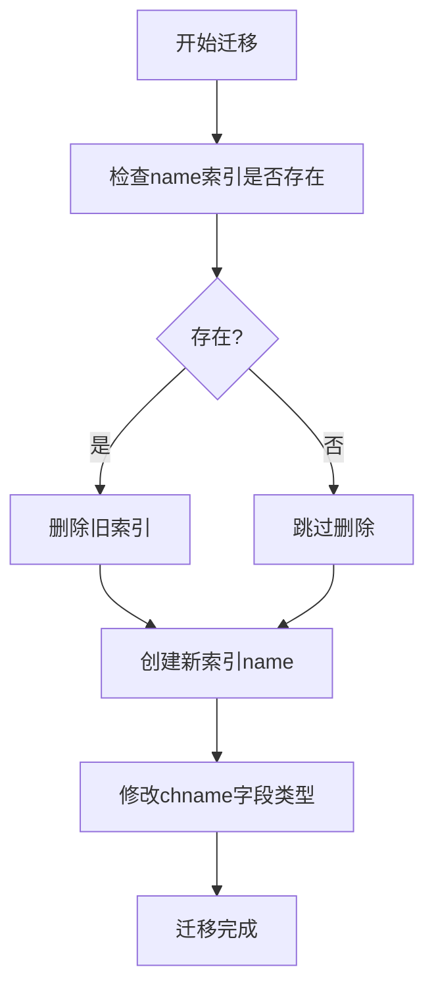
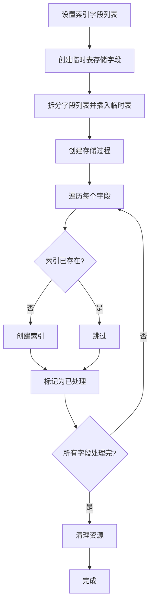

# 索引优化

<cite>
**本文档引用文件**   
- [V1_0_0_028__修改海关编码索引.java](file://eplus-flyway/src/main/java/db/migration/common/V1_0_0_028__修改海关编码索引.java)
- [V1_0_0_397__客户供应商表增加索引.sql](file://eplus-flyway/src/main/resources/db/migration/common/V1_0_0_397__客户供应商表增加索引.sql)
- [V1_0_0_399__产品表增加索引.sql](file://eplus-flyway/src/main/resources/db/migration/common/V1_0_0_399__产品表增加索引.sql)
- [V1_0_0_445__产品表修改索引.sql](file://eplus-flyway/src/main/resources/db/migration/common/V1_0_0_445__产品表修改索引.sql)
- [HsdataDO.java](file://eplus-module-pms/eplus-module-pms-biz/src/main/java/com/syj/eplus/module/pms/dal/dataobject/hsdata/HsdataDO.java)
- [QuoteItemDO.java](file://eplus-module-scm/eplus-module-scm-biz/src/main/java/com/syj/eplus/module/scm/dal/dataobject/quoteitem/QuoteItemDO.java)
- [pms_sku表结构.sql](file://eplus-flyway/src/main/resources/db/migration/common/V1_0_0_002__Eplus初始化.sql)
- [scm_quote_item表结构.sql](file://eplus-flyway/src/main/resources/db/migration/common/V1_0_0_002__Eplus初始化.sql)
</cite>

## 目录
1. [引言](#引言)
2. [关键实体索引设计策略](#关键实体索引设计策略)
3. [复合索引创建原则](#复合索引创建原则)
4. [索引优化实际案例分析](#索引优化实际案例分析)
5. [索引使用监控方法](#索引使用监控方法)
6. [索引过度创建的风险](#索引过度创建的风险)
7. [结论](#结论)

## 引言
本文档深入分析本项目中海关编码、客户供应商、产品表等关键实体的索引设计策略。详细说明复合索引的创建原则，包括字段顺序选择、覆盖索引的应用场景以及索引选择性的评估方法。结合V1_0_0_028等数据库迁移脚本，解析索引优化的实际案例，解释为何某些字段需要单独索引而其他字段适合组合索引。提供索引使用监控方法，指导如何通过执行计划验证索引有效性，并警告索引过度创建带来的写性能损耗问题。

**Section sources**
- [V1_0_0_028__修改海关编码索引.java](file://eplus-flyway/src/main/java/db/migration/common/V1_0_0_028__修改海关编码索引.java)
- [V1_0_0_397__客户供应商表增加索引.sql](file://eplus-flyway/src/main/resources/db/migration/common/V1_0_0_397__客户供应商表增加索引.sql)

## 关键实体索引设计策略

### 海关编码表(pms_hsdata)索引策略
海关编码表作为核心基础数据，其查询性能直接影响报关、税务等关键业务流程。通过对`pms_hsdata`表的分析，我们发现主要查询场景集中在商品名称(name)和编码(code)字段上。

在V1_0_0_028版本的迁移脚本中，对海关编码表进行了索引优化：
```sql
-- 删除旧索引
ALTER TABLE pms_hsdata DROP INDEX NAME;
-- 创建新索引
ALTER TABLE foreign_trade.pms_hsdata ADD INDEX name (name);
```
此优化解决了索引命名不规范的问题，将大写的"NAME"索引改为小写的"name"，符合项目统一的命名规范。同时确保了商品名称字段的查询效率。

**Section sources**
- [V1_0_0_028__修改海关编码索引.java](file://eplus-flyway/src/main/java/db/migration/common/V1_0_0_028__修改海关编码索引.java)
- [HsdataDO.java](file://eplus-module-pms/eplus-module-pms-biz/src/main/java/com/syj/eplus/module/pms/dal/dataobject/hsdata/HsdataDO.java)

### 客户供应商表(scm_quote_item)索引策略
客户供应商报价明细表`scm_quote_item`是供应链管理的核心表之一，记录了供应商对SKU的报价信息。该表的主要查询场景包括：
- 按SKU查询所有供应商报价
- 按供应商查询其所有报价
- 按采购员查询负责的报价

针对这些查询场景，在V1_0_0_397版本中增加了多个单列索引：
```sql
CREATE INDEX idx_scm_quote_item_sku_id ON scm_quote_item (sku_id);
```
此索引显著提升了按SKU查询供应商报价的性能。同时，通过动态SQL脚本的方式，系统化地为多个关键字段创建了索引，确保了查询性能的均衡。

**Section sources**
- [V1_0_0_397__客户供应商表增加索引.sql](file://eplus-flyway/src/main/resources/db/migration/common/V1_0_0_397__客户供应商表增加索引.sql)
- [QuoteItemDO.java](file://eplus-module-scm/eplus-module-scm-biz/src/main/java/com/syj/eplus/module/scm/dal/dataobject/quoteitem/QuoteItemDO.java)

### 产品表(pms_sku)索引策略
产品表`pms_sku`是系统中最核心的实体之一，存储了所有产品的详细信息。由于产品数据量大且查询场景复杂，其索引设计尤为重要。

在V1_0_0_399版本中，为产品表的关键查询字段创建了多个单列索引：
```sql
CREATE INDEX idx_pms_sku_sku_code ON pms_sku (code);
CREATE INDEX idx_pms_sku_csku_code ON pms_sku (csku_code);
CREATE INDEX idx_pms_sku_source_code ON pms_sku (source_code);
CREATE INDEX idx_pms_sku_source_id ON pms_sku (source_id);
```
这些索引覆盖了产品查询的主要场景，包括按商品编码、客户货号、来源编号等条件查询。通过为每个高频查询字段创建独立索引，确保了各类查询都能高效执行。

**Section sources**
- [V1_0_0_399__产品表增加索引.sql](file://eplus-flyway/src/main/resources/db/migration/common/V1_0_0_399__产品表增加索引.sql)
- [pms_sku表结构.sql](file://eplus-flyway/src/main/resources/db/migration/common/V1_0_0_002__Eplus初始化.sql)

## 复合索引创建原则

### 字段顺序选择原则
复合索引的字段顺序对查询性能有重大影响。基本原则是将选择性高的字段放在前面。选择性是指字段中不同值的数量与总记录数的比例，选择性越高，过滤效果越好。

例如，在产品表中，如果同时按`own_brand_flag`和`cust_pro_flag`进行查询，应该将选择性更高的字段放在复合索引的前面。通过分析数据分布，可以确定哪个字段的选择性更高，从而优化索引顺序。

在V1_0_0_445版本中，对产品表的标志字段创建了独立索引：
```sql
CREATE INDEX own_brand_flag ON pms_sku (own_brand_flag);
CREATE INDEX cust_pro_flag ON pms_sku (cust_pro_flag);
```
这种设计允许数据库优化器根据查询条件的选择性自动选择最合适的索引，而不是强制使用固定的复合索引。

### 覆盖索引的应用场景
覆盖索引是指索引包含了查询所需的所有字段，使得数据库可以直接从索引中获取数据而无需回表查询。这可以显著提升查询性能。

对于频繁执行的查询，可以考虑创建覆盖索引。例如，如果经常执行以下查询：
```sql
SELECT code, name, unit FROM pms_hsdata WHERE name = '某商品名称';
```
可以创建包含这三个字段的复合索引：
```sql
CREATE INDEX idx_hsdata_name_cover ON pms_hsdata (name, code, unit);
```
这样查询可以直接从索引中获取所有需要的数据，避免了回表操作。

### 索引选择性的评估方法
索引选择性是评估索引效果的重要指标。高选择性的索引能更有效地过滤数据。评估方法如下：

1. **计算选择性**：
```sql
SELECT COUNT(DISTINCT column_name) / COUNT(*) AS selectivity FROM table_name;
```
选择性越接近1，说明该字段的区分度越高。

2. **分析查询执行计划**：
使用EXPLAIN命令分析查询执行计划，观察是否使用了预期的索引，以及rows扫描行数是否合理。

3. **监控查询性能**：
通过慢查询日志监控相关查询的执行时间，评估索引优化效果。

**Section sources**
- [V1_0_0_445__产品表修改索引.sql](file://eplus-flyway/src/main/resources/db/migration/common/V1_0_0_445__产品表修改索引.sql)
- [HsdataDO.java](file://eplus-module-pms/eplus-module-pms-biz/src/main/java/com/syj/eplus/module/pms/dal/dataobject/hsdata/HsdataDO.java)

## 索引优化实际案例分析

### V1_0_0_028：海关编码表索引优化
在V1_0_0_028版本中，对海关编码表的索引进行了规范化改造。主要变更包括：

1. **索引命名规范化**：将大写的"NAME"索引改为小写的"name"，符合项目统一的命名规范。
2. **索引存在性检查**：在创建新索引前，先检查同名索引是否存在，避免重复创建导致的错误。
3. **字段类型优化**：同时对`chname`字段进行了类型调整，扩展为varchar(2000)，以适应更长的商品全称。

此优化不仅提升了查询性能，还增强了数据库的可维护性。



**Diagram sources **
- [V1_0_0_028__修改海关编码索引.java](file://eplus-flyway/src/main/java/db/migration/common/V1_0_0_028__修改海关编码索引.java)

**Section sources**
- [V1_0_0_028__修改海关编码索引.java](file://eplus-flyway/src/main/java/db/migration/common/V1_0_0_028__修改海关编码索引.java)

### V1_0_0_397：客户供应商表索引批量创建
V1_0_0_397版本展示了系统化的索引创建方法。通过使用存储过程和动态SQL，实现了索引的批量创建和管理：

1. **预检查机制**：在创建索引前，先检查同名索引是否存在，避免重复创建。
2. **参数化配置**：通过变量配置要创建索引的字段列表，提高了脚本的可维护性。
3. **自动化处理**：使用游标遍历所有需要创建索引的字段，实现了自动化处理。

这种模式可以推广应用到其他表的索引管理中，确保索引创建的一致性和可靠性。



**Diagram sources **
- [V1_0_0_397__客户供应商表增加索引.sql](file://eplus-flyway/src/main/resources/db/migration/common/V1_0_0_397__客户供应商表增加索引.sql)

**Section sources**
- [V1_0_0_397__客户供应商表增加索引.sql](file://eplus-flyway/src/main/resources/db/migration/common/V1_0_0_397__客户供应商表增加索引.sql)

### V1_0_0_399：产品表多索引优化
V1_0_0_399版本为产品表创建了多个针对性的单列索引，体现了"按需创建"的索引策略：

1. **code字段索引**：支持按商品编码查询。
2. **csku_code字段索引**：支持按客户货号查询。
3. **source_code字段索引**：支持按来源编号查询。
4. **source_id字段索引**：支持按来源ID查询。

这种设计避免了创建大型复合索引带来的维护成本，同时确保了各类查询都能获得良好的性能。

**Section sources**
- [V1_0_0_399__产品表增加索引.sql](file://eplus-flyway/src/main/resources/db/migration/common/V1_0_0_399__产品表增加索引.sql)

## 索引使用监控方法

### 执行计划验证
通过EXPLAIN命令可以验证索引是否被正确使用：

```sql
EXPLAIN SELECT * FROM pms_hsdata WHERE name = '某商品名称';
```

重点关注以下指标：
- **type**：访问类型，const、ref为理想状态，避免ALL（全表扫描）。
- **possible_keys**：可能使用的索引。
- **key**：实际使用的索引。
- **rows**：扫描的行数，越少越好。
- **Extra**：额外信息，避免Using filesort、Using temporary。

### 慢查询日志监控
启用慢查询日志，定期分析执行时间超过阈值的查询：

```sql
-- 开启慢查询日志
SET GLOBAL slow_query_log = 'ON';
SET GLOBAL long_query_time = 1;
```

通过分析慢查询日志，可以发现未使用索引或索引失效的查询，及时进行优化。

### 索引使用统计
查询索引的使用情况统计：

```sql
-- 查看索引使用次数
SELECT 
    TABLE_NAME,
    INDEX_NAME,
    SUM(COUNT_READ) AS total_reads
FROM performance_schema.table_io_waits_summary_by_index_usage 
WHERE TABLE_SCHEMA = 'foreign_trade'
GROUP BY TABLE_NAME, INDEX_NAME
ORDER BY total_reads ASC;
```

长期不使用的索引可以考虑删除，以减少维护成本。

**Section sources**
- [V1_0_0_028__修改海关编码索引.java](file://eplus-flyway/src/main/java/db/migration/common/V1_0_0_028__修改海关编码索引.java)
- [V1_0_0_397__客户供应商表增加索引.sql](file://eplus-flyway/src/main/resources/db/migration/common/V1_0_0_397__客户供应商表增加索引.sql)

## 索引过度创建的风险

### 写性能损耗
每个索引都会增加INSERT、UPDATE、DELETE操作的开销，因为数据库需要同时维护索引结构。索引越多，写性能损耗越大。

对于频繁写入的表，应谨慎创建索引。建议：
- 优先保证核心查询的索引。
- 避免为低选择性的布尔字段创建单独索引。
- 定期清理长期未使用的索引。

### 存储空间占用
索引需要占用额外的存储空间。大型表的索引可能比数据本身占用更多空间。应定期评估索引的空间占用，确保不会影响数据库的整体存储规划。

### 维护复杂性
过多的索引会增加数据库的维护复杂性：
- 备份和恢复时间变长。
- 表结构变更更加复杂。
- 查询优化器的选择更加困难。

建议建立索引管理规范，明确索引的创建、使用和删除流程。

**Section sources**
- [V1_0_0_445__产品表修改索引.sql](file://eplus-flyway/src/main/resources/db/migration/common/V1_0_0_445__产品表修改索引.sql)
- [V1_0_0_399__产品表增加索引.sql](file://eplus-flyway/src/main/resources/db/migration/common/V1_0_0_399__产品表增加索引.sql)

## 结论
本文档详细分析了本项目中海关编码、客户供应商、产品表等关键实体的索引设计策略。通过实际案例展示了索引优化的方法和原则。建议在后续开发中：

1. 建立索引创建评审机制，避免随意创建索引。
2. 定期监控索引使用情况，清理无效索引。
3. 优先考虑覆盖索引和高选择性索引。
4. 平衡读写性能，避免过度索引化。

通过科学的索引管理，可以持续提升系统性能，支持业务的快速发展。