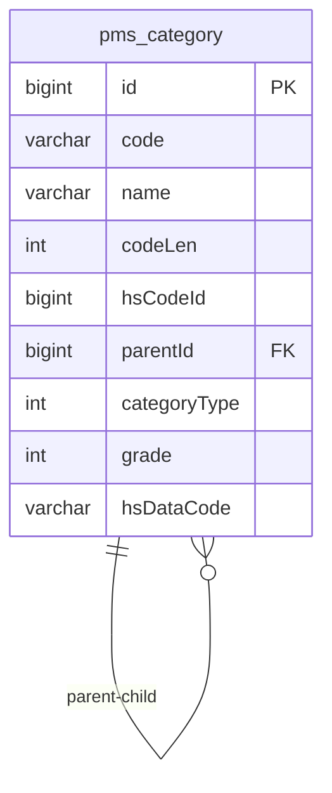
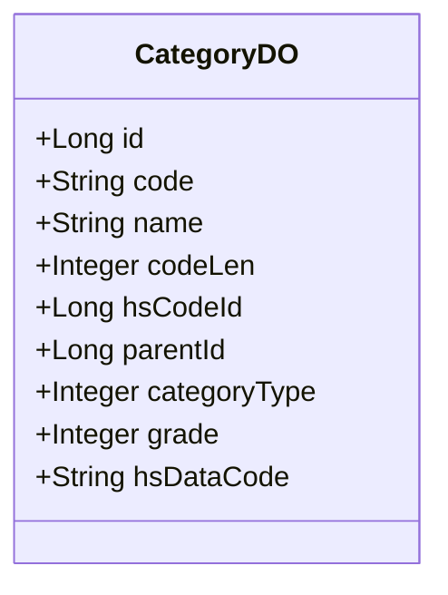
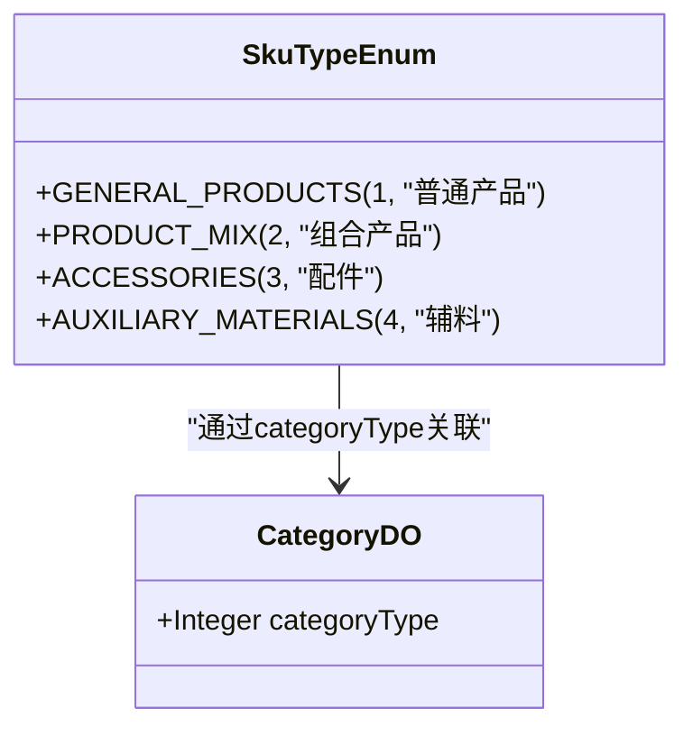
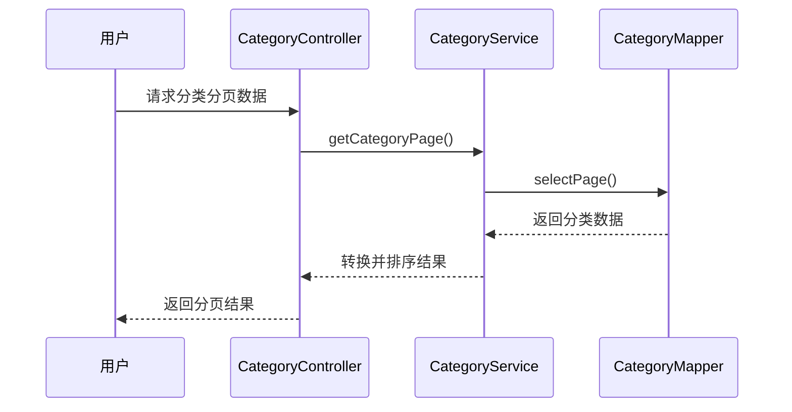
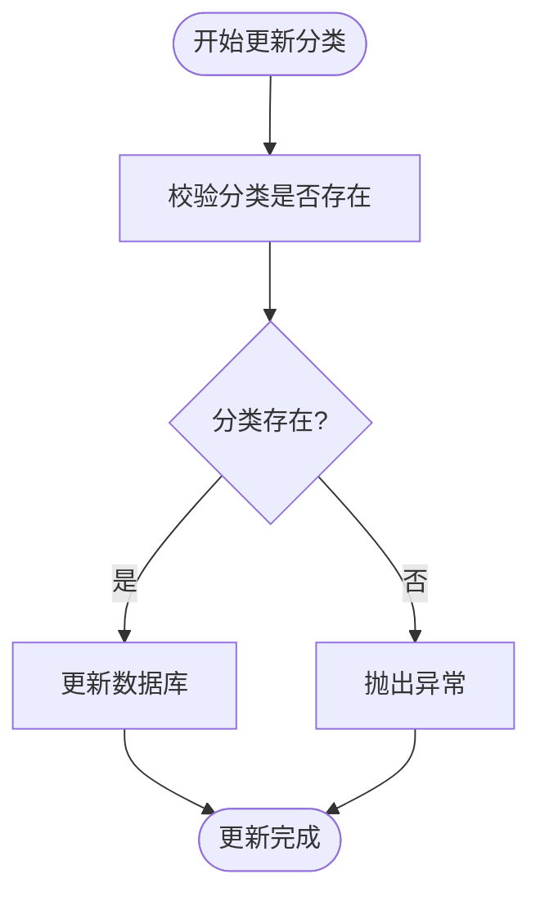
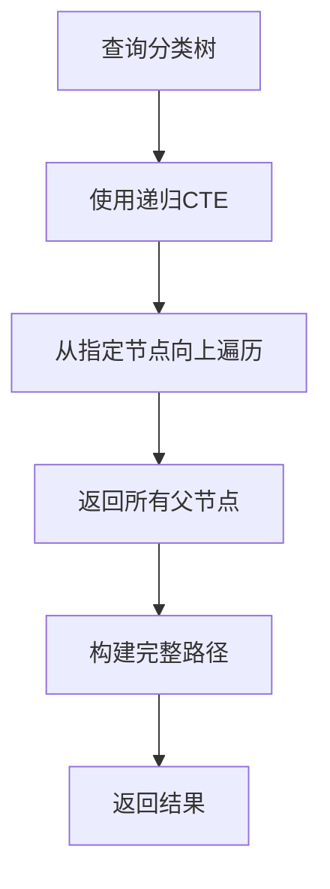
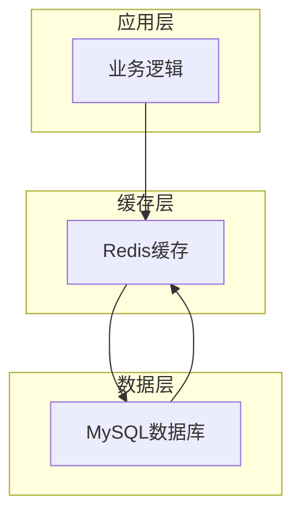

# 产品分类

<cite>
**本文档引用的文件**   
- [CategoryDO.java](file://eplus-module-pms/eplus-module-pms-biz/src/main/java/com/syj/eplus/module/pms/dal/dataobject/category/CategoryDO.java)
- [CategoryMapper.java](file://eplus-module-pms/eplus-module-pms-biz/src/main/java/com/syj/eplus/module/pms/dal/mysql/category/CategoryMapper.java)
- [CategoryService.java](file://eplus-module-pms/eplus-module-pms-biz/src/main/java/com/syj/eplus/module/pms/service/category/CategoryService.java)
- [CategoryServiceImpl.java](file://eplus-module-pms/eplus-module-pms-biz/src/main/java/com/syj/eplus/module/pms/service/category/CategoryServiceImpl.java)
- [CategoryController.java](file://eplus-module-pms/eplus-module-pms-biz/src/main/java/com/syj/eplus/module/pms/controller/admin/category/CategoryController.java)
- [CategoryConvent.java](file://eplus-module-pms/eplus-module-pms-biz/src/main/java/com/syj/eplus/module/pms/service/convent/CategoryConvent.java)
- [V1_0_0_002__Eplus初始化.sql](file://eplus-flyway/src/main/resources/db/migration/common/V1_0_0_002__Eplus初始化.sql)
- [SkuTypeEnum.java](file://eplus-framework/eplus-common/src/main/java/com/syj/eplus/framework/common/enums/SkuTypeEnum.java)
</cite>

## 目录
1. [引言](#引言)
2. [分类层级结构](#分类层级结构)
3. [分类属性模板](#分类属性模板)
4. [分类与SKU的关联机制](#分类与SKU的关联机制)
5. [产品属性标准化管理](#产品属性标准化管理)
6. [分类变更对现有产品的影响](#分类变更对现有产品的影响)
7. [分类树形结构查询优化](#分类树形结构查询优化)
8. [缓存策略](#缓存策略)
9. [结论](#结论)

## 引言

产品分类体系是企业管理系统中的核心组成部分，它为产品管理提供了结构化的组织方式。本文档深入介绍产品分类体系的设计，包括分类层级结构、分类属性模板、分类与SKU的关联机制。同时，文档将解释如何通过分类实现产品属性的标准化管理，以及分类变更对现有产品的影响。最后，文档将提供分类树形结构的查询优化方案和缓存策略，确保大规模分类数据的高效访问。

**Section sources**
- [CategoryDO.java](file://eplus-module-pms/eplus-module-pms-biz/src/main/java/com/syj/eplus/module/pms/dal/dataobject/category/CategoryDO.java)
- [CategoryMapper.java](file://eplus-module-pms/eplus-module-pms-biz/src/main/java/com/syj/eplus/module/pms/dal/mysql/category/CategoryMapper.java)

## 分类层级结构

产品分类体系采用树形层级结构设计，支持多级分类管理。系统通过`pms_category`表存储分类信息，其中`id`字段作为主键，`parent_id`字段指向父节点，形成父子关系。`grade`字段表示分类级别，系统限制最大等级数为3级，确保分类结构的合理性和可管理性。



**Diagram sources**
- [V1_0_0_002__Eplus初始化.sql](file://eplus-flyway/src/main/resources/db/migration/common/V1_0_0_002__Eplus初始化.sql)
- [CategoryDO.java](file://eplus-module-pms/eplus-module-pms-biz/src/main/java/com/syj/eplus/module/pms/dal/dataobject/category/CategoryDO.java)

**Section sources**
- [CategoryDO.java](file://eplus-module-pms/eplus-module-pms-biz/src/main/java/com/syj/eplus/module/pms/dal/dataobject/category/CategoryDO.java)
- [V1_0_0_002__Eplus初始化.sql](file://eplus-flyway/src/main/resources/db/migration/common/V1_0_0_002__Eplus初始化.sql)

## 分类属性模板

产品分类的属性模板定义了分类的核心信息结构。每个分类包含以下关键属性：

- **code**: 商品分类编号，用于唯一标识分类
- **name**: 分类名称，描述分类的业务含义
- **codeLen**: 流水号长度，控制分类下产品的编号长度
- **hsCodeId**: 海关编码，关联海关数据
- **parentId**: 父节点编号，建立层级关系
- **categoryType**: 种类，区分不同类型的分类
- **grade**: 级别，表示分类在层级中的深度
- **hsDataCode**: 海关编码编号，存储海关编码的具体值

这些属性通过`CategoryDO`类进行封装，为分类管理提供了完整的数据模型。



**Diagram sources**
- [CategoryDO.java](file://eplus-module-pms/eplus-module-pms-biz/src/main/java/com/syj/eplus/module/pms/dal/dataobject/category/CategoryDO.java)

**Section sources**
- [CategoryDO.java](file://eplus-module-pms/eplus-module-pms-biz/src/main/java/com/syj/eplus/module/pms/dal/dataobject/category/CategoryDO.java)

## 分类与SKU的关联机制

产品分类与SKU（库存单位）之间存在紧密的关联关系。虽然在提供的代码中没有直接显示SKU与分类的关联字段，但通过系统设计可以推断出这种关联。分类为SKU提供了属性模板和管理框架，确保同一分类下的SKU具有统一的属性结构。

分类通过`categoryType`字段与SKU类型关联，系统中定义了多种SKU类型，包括普通产品、组合产品、配件和辅料。这种设计使得不同类型的SKU可以继承相应分类的属性特征，实现产品管理的灵活性和一致性。



**Diagram sources**
- [SkuTypeEnum.java](file://eplus-framework/eplus-common/src/main/java/com/syj/eplus/framework/common/enums/SkuTypeEnum.java)
- [CategoryDO.java](file://eplus-module-pms/eplus-module-pms-biz/src/main/java/com/syj/eplus/module/pms/dal/dataobject/category/CategoryDO.java)

**Section sources**
- [SkuTypeEnum.java](file://eplus-framework/eplus-common/src/main/java/com/syj/eplus/framework/common/enums/SkuTypeEnum.java)
- [CategoryDO.java](file://eplus-module-pms/eplus-module-pms-biz/src/main/java/com/syj/eplus/module/pms/dal/dataobject/category/CategoryDO.java)

## 产品属性标准化管理

通过产品分类体系，系统实现了产品属性的标准化管理。分类作为属性模板，为下属SKU定义了统一的属性结构。当创建新的SKU时，系统会根据其所属分类自动继承相应的属性配置，确保产品数据的一致性和规范性。

分类服务提供了`getCategoryPage`方法，支持分页查询分类信息，并对结果按分类编号进行排序。这种设计不仅便于用户浏览和管理分类，还为产品属性的标准化管理提供了技术支持。



**Diagram sources**
- [CategoryController.java](file://eplus-module-pms/eplus-module-pms-biz/src/main/java/com/syj/eplus/module/pms/controller/admin/category/CategoryController.java)
- [CategoryService.java](file://eplus-module-pms/eplus-module-pms-biz/src/main/java/com/syj/eplus/module/pms/service/category/CategoryService.java)
- [CategoryMapper.java](file://eplus-module-pms/eplus-module-pms-biz/src/main/java/com/syj/eplus/module/pms/dal/mysql/category/CategoryMapper.java)

**Section sources**
- [CategoryService.java](file://eplus-module-pms/eplus-module-pms-biz/src/main/java/com/syj/eplus/module/pms/service/category/CategoryService.java)
- [CategoryServiceImpl.java](file://eplus-module-pms/eplus-module-pms-biz/src/main/java/com/syj/eplus/module/pms/service/category/CategoryServiceImpl.java)

## 分类变更对现有产品的影响

分类变更会对现有产品产生重要影响。当分类信息发生变更时，系统需要确保关联的SKU能够正确反映新的分类属性。虽然在提供的代码中没有直接显示变更影响的处理逻辑，但通过系统设计可以推断出相关的处理机制。

分类服务提供了`updateCategory`方法，用于更新分类信息。在更新分类时，系统会校验分类是否存在，并更新相应的数据库记录。这种设计确保了分类变更的完整性和一致性，为现有产品的属性更新提供了基础支持。



**Diagram sources**
- [CategoryServiceImpl.java](file://eplus-module-pms/eplus-module-pms-biz/src/main/java/com/syj/eplus/module/pms/service/category/CategoryServiceImpl.java)

**Section sources**
- [CategoryServiceImpl.java](file://eplus-module-pms/eplus-module-pms-biz/src/main/java/com/syj/eplus/module/pms/service/category/CategoryServiceImpl.java)

## 分类树形结构查询优化

为了高效查询分类树形结构，系统采用了递归查询优化策略。`CategoryMapper`接口中定义了`getParentCateGoryById`方法，使用MySQL的递归CTE（Common Table Expression）语法查询指定分类的所有父节点。

```sql
WITH RECURSIVE recursion AS (
  SELECT t1.id,t1.parent_id,t1.code,t1.grade
  FROM pms_category t1
  WHERE t1.id= #{id}
  UNION ALL
  SELECT t2.id,t2.parent_id,t2.code,t2.grade
  FROM pms_category t2, recursion t3
  WHERE t2.id=t3.parent_id
)
SELECT * FROM recursion t;
```

此外，系统还提供了`getPathCateName`方法，使用递归查询获取分类的完整路径名称。这些优化措施显著提高了树形结构查询的性能，特别是在处理大规模分类数据时。



**Diagram sources**
- [CategoryMapper.java](file://eplus-module-pms/eplus-module-pms-biz/src/main/java/com/syj/eplus/module/pms/dal/mysql/category/CategoryMapper.java)

**Section sources**
- [CategoryMapper.java](file://eplus-module-pms/eplus-module-pms-biz/src/main/java/com/syj/eplus/module/pms/dal/mysql/category/CategoryMapper.java)

## 缓存策略

系统采用了多层次的缓存策略来提高分类数据的访问效率。虽然在提供的代码中没有直接显示缓存实现，但通过框架分析可以推断出系统的缓存机制。

系统可能使用Redis作为分布式缓存，存储常用的分类数据。`CacheUtils`工具类提供了构建异步重加载缓存的方法，支持设置缓存的刷新策略。这种设计确保了缓存数据的及时性和一致性，同时减少了数据库的访问压力。



**Diagram sources**
- [CacheUtils.java](file://yudao-framework/yudao-common/src/main/java/cn/iocoder/yudao/framework/common/util/cache/CacheUtils.java)

**Section sources**
- [CacheUtils.java](file://yudao-framework/yudao-common/src/main/java/cn/iocoder/yudao/framework/common/util/cache/CacheUtils.java)

## 结论

产品分类体系是企业管理系统中的关键组成部分，它通过树形层级结构、属性模板和与SKU的关联机制，实现了产品属性的标准化管理。系统通过递归查询优化和缓存策略，确保了大规模分类数据的高效访问。分类变更机制保证了现有产品数据的一致性和完整性。整体设计体现了良好的可扩展性和维护性，为企业的产品管理提供了坚实的基础。