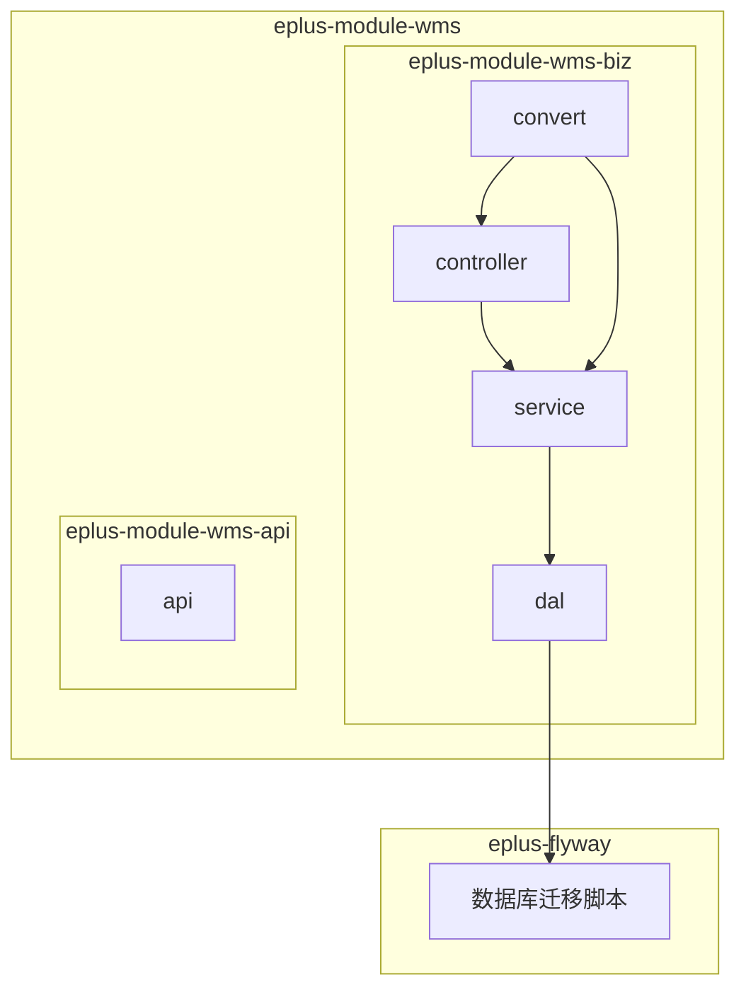
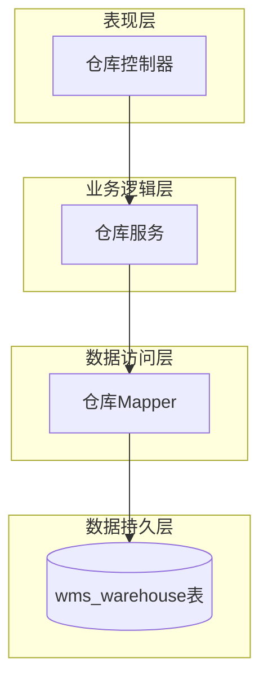
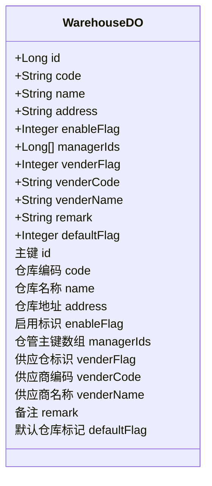
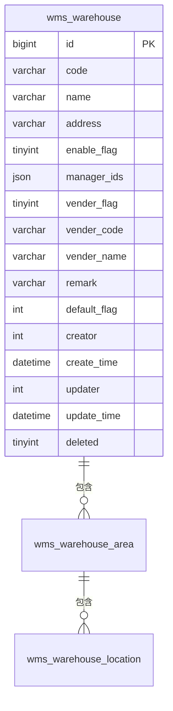
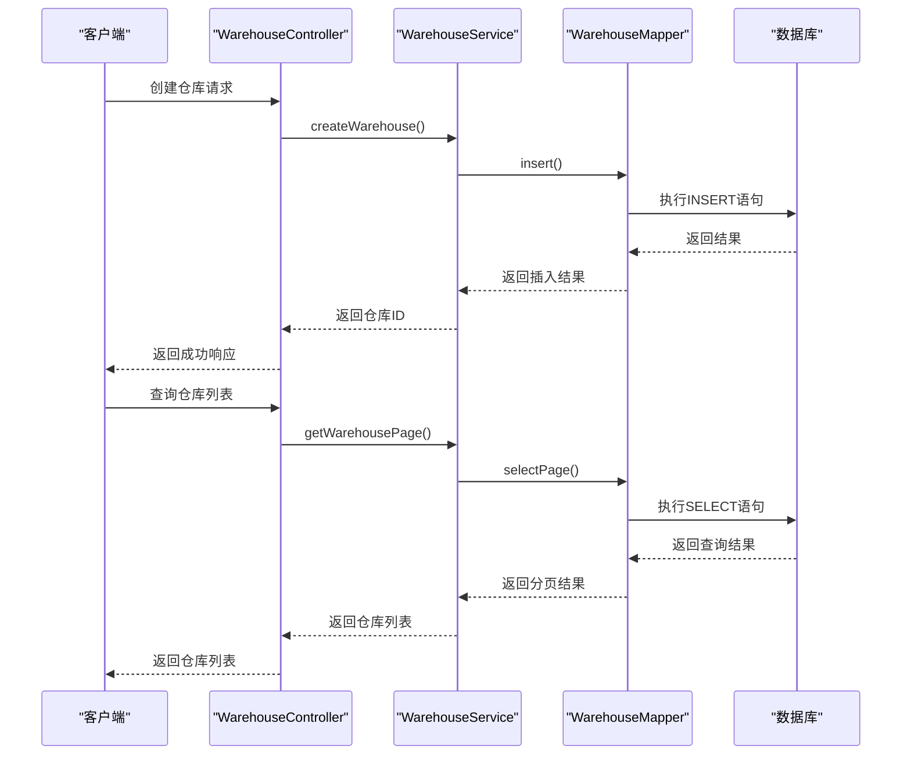
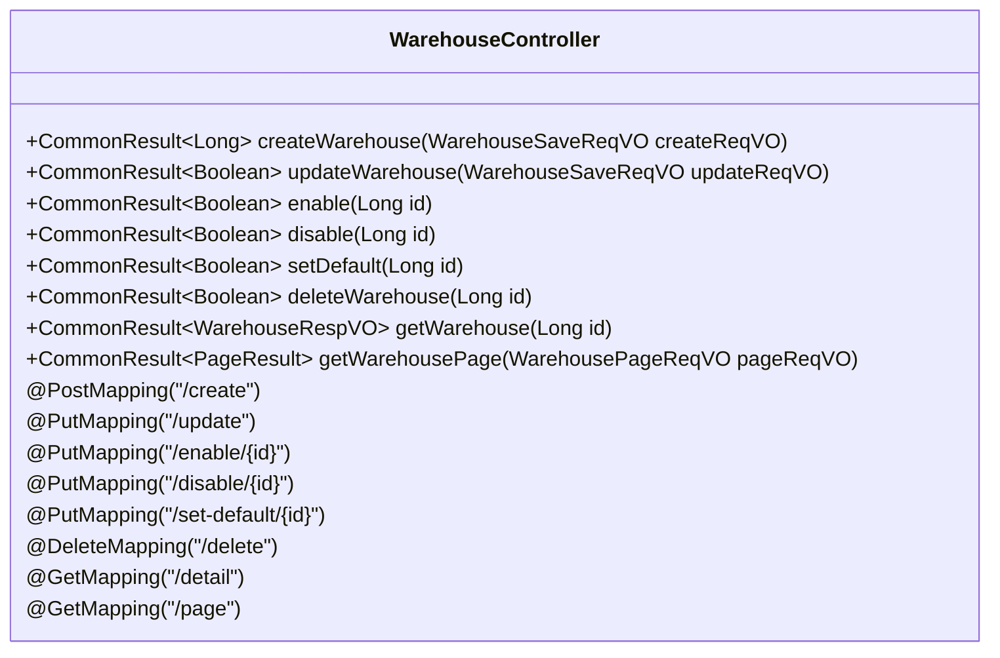
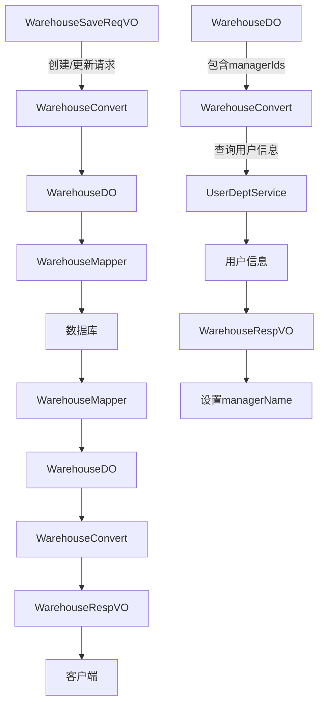
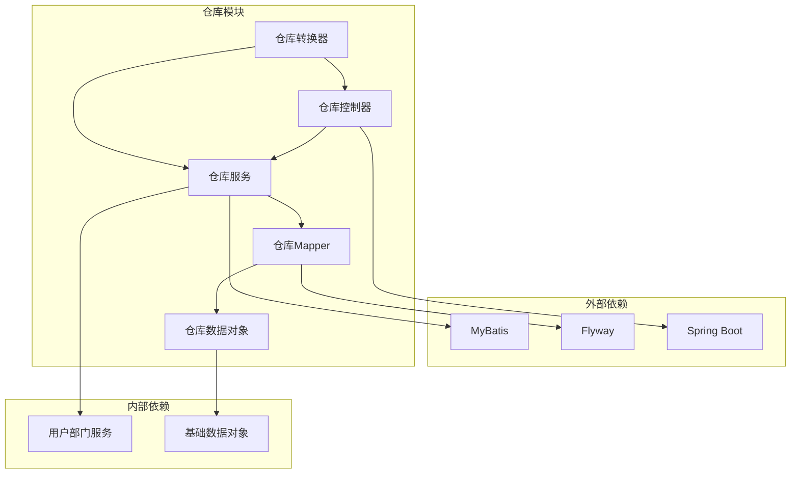

# 仓库信息管理

<cite>
**本文档引用的文件**  
- [WarehouseDO.java](file://eplus-module-wms/eplus-module-wms-biz/src/main/java/com/syj/eplus/module/wms/dal/dataobject/warehouse/WarehouseDO.java)
- [V1_0_0_002__Eplus初始化.sql](file://eplus-flyway/src/main/resources/db/migration/common/V1_0_0_002__Eplus初始化.sql)
- [WarehouseMapper.xml](file://eplus-module-wms/eplus-module-wms-biz/src/main/resources/mapper/warehouse/WarehouseMapper.xml)
- [WarehouseService.java](file://eplus-module-wms/eplus-module-wms-biz/src/main/java/com/syj/eplus/module/wms/service/warehouse/WarehouseService.java)
- [WarehouseController.java](file://eplus-module-wms/eplus-module-wms-biz/src/main/java/com/syj/eplus/module/wms/controller/admin/warehouse/WarehouseController.java)
- [WarehouseConvert.java](file://eplus-module-wms/eplus-module-wms-biz/src/main/java/com/syj/eplus/module/wms/convert/warehouse/WarehouseConvert.java)
- [WarehouseRespVO.java](file://eplus-module-wms/eplus-module-wms-biz/src/main/java/com/syj/eplus/module/wms/controller/admin/warehouse/vo/WarehouseRespVO.java)
- [WarehouseSaveReqVO.java](file://eplus-module-wms/eplus-module-wms-biz/src/main/java/com/syj/eplus/module/wms/controller/admin/warehouse/vo/WarehouseSaveReqVO.java)
- [V1_0_0_557__仓库联系人改为多选.java](file://eplus-flyway/src/main/java/db/migration/common/V1_0_0_557__仓库联系人改为多选.java)
- [V1_0_0_416__仓库增加默认标记.java](file://eplus-flyway/src/main/java/db/migration/common/V1_0_0_416__仓库增加默认标记.java)
</cite>

## 目录
1. [引言](#引言)
2. [项目结构](#项目结构)
3. [核心组件](#核心组件)
4. [架构概述](#架构概述)
5. [详细组件分析](#详细组件分析)
6. [依赖分析](#依赖分析)
7. [性能考虑](#性能考虑)
8. [故障排除指南](#故障排除指南)
9. [结论](#结论)

## 引言
本文档详细描述了仓库信息管理系统的数据模型设计，重点介绍仓库、库区、库位等核心实体的设计。文档解释了仓库层级结构的数据表示方法，包括仓库与库区、库区与库位之间的关系。同时，详细说明了仓库属性管理、仓库状态管理、仓库联系人管理等关键功能的数据设计。通过ER图展示仓库主表、库区表、库位表之间的关系，并提供实际的SQL建表语句和MyBatis Mapper配置示例，为开发者提供仓库信息数据建模的最佳实践。

## 项目结构
仓库信息管理功能主要位于`eplus-module-wms`模块中，该模块负责仓储管理系统的实现。核心数据模型和业务逻辑分布在`eplus-module-wms-biz`和`eplus-module-wms-api`两个子模块中。数据访问层位于`dal`包下，控制器位于`controller`包下，服务层位于`service`包下，数据转换层位于`convert`包下。



**图示来源**
- [WarehouseController.java](file://eplus-module-wms/eplus-module-wms-biz/src/main/java/com/syj/eplus/module/wms/controller/admin/warehouse/WarehouseController.java)
- [WarehouseService.java](file://eplus-module-wms/eplus-module-wms-biz/src/main/java/com/syj/eplus/module/wms/service/warehouse/WarehouseService.java)
- [WarehouseConvert.java](file://eplus-module-wms/eplus-module-wms-biz/src/main/java/com/syj/eplus/module/wms/convert/warehouse/WarehouseConvert.java)
- [WarehouseDO.java](file://eplus-module-wms/eplus-module-wms-biz/src/main/java/com/syj/eplus/module/wms/dal/dataobject/warehouse/WarehouseDO.java)

**章节来源**
- [eplus-module-wms](file://eplus-module-wms)
- [eplus-flyway](file://eplus-flyway)

## 核心组件
仓库信息管理的核心组件包括仓库主表（wms_warehouse）、仓库数据对象（WarehouseDO）、仓库服务（WarehouseService）、仓库控制器（WarehouseController）以及相关的数据转换器（WarehouseConvert）。这些组件共同实现了仓库的增删改查、状态管理、联系人管理等核心功能。

**章节来源**
- [WarehouseDO.java](file://eplus-module-wms/eplus-module-wms-biz/src/main/java/com/syj/eplus/module/wms/dal/dataobject/warehouse/WarehouseDO.java)
- [WarehouseService.java](file://eplus-module-wms/eplus-module-wms-biz/src/main/java/com/syj/eplus/module/wms/service/warehouse/WarehouseService.java)
- [WarehouseController.java](file://eplus-module-wms/eplus-module-wms-biz/src/main/java/com/syj/eplus/module/wms/controller/admin/warehouse/WarehouseController.java)

## 架构概述
仓库信息管理系统的架构采用典型的分层设计模式，包括表现层（Controller）、业务逻辑层（Service）、数据访问层（DAL）和数据持久层（数据库）。系统通过RESTful API提供服务，使用MyBatis作为ORM框架，Flyway作为数据库迁移工具。



**图示来源**
- [WarehouseController.java](file://eplus-module-wms/eplus-module-wms-biz/src/main/java/com/syj/eplus/module/wms/controller/admin/warehouse/WarehouseController.java)
- [WarehouseService.java](file://eplus-module-wms/eplus-module-wms-biz/src/main/java/com/syj/eplus/module/wms/service/warehouse/WarehouseService.java)
- [WarehouseMapper.xml](file://eplus-module-wms/eplus-module-wms-biz/src/main/resources/mapper/warehouse/WarehouseMapper.xml)
- [V1_0_0_002__Eplus初始化.sql](file://eplus-flyway/src/main/resources/db/migration/common/V1_0_0_002__Eplus初始化.sql)

## 详细组件分析

### 仓库数据模型分析
仓库数据模型是仓库信息管理系统的核心，它定义了仓库的基本属性、状态和联系人信息。通过分析`WarehouseDO`类和对应的数据库表结构，我们可以深入了解仓库实体的设计。

#### 仓库数据对象（DO）分析


**图示来源**
- [WarehouseDO.java](file://eplus-module-wms/eplus-module-wms-biz/src/main/java/com/syj/eplus/module/wms/dal/dataobject/warehouse/WarehouseDO.java)

**章节来源**
- [WarehouseDO.java](file://eplus-module-wms/eplus-module-wms-biz/src/main/java/com/syj/eplus/module/wms/dal/dataobject/warehouse/WarehouseDO.java)

#### 仓库数据库表结构
```sql
CREATE TABLE IF NOT EXISTS `wms_warehouse` (
    `id` bigint unsigned NOT NULL AUTO_INCREMENT COMMENT '主键',
    `code` varchar(20) CHARACTER SET utf8mb4 COLLATE utf8mb4_general_ci NOT NULL DEFAULT '' COMMENT '仓库编码',
    `name` varchar(100) CHARACTER SET utf8mb4 COLLATE utf8mb4_general_ci DEFAULT NULL COMMENT '仓库名称',
    `address` varchar(200) CHARACTER SET utf8mb4 COLLATE utf8mb4_general_ci DEFAULT NULL COMMENT '仓库地址',
    `enable_flag` tinyint DEFAULT NULL COMMENT '启用标识  0-否 1-是',
    `manager_ids` json NOT NULL DEFAULT (JSON_ARRAY()) COMMENT '仓管主键数组',
    `vender_flag` tinyint DEFAULT NULL COMMENT '供应仓标识0-否 1-是',
    `vender_code` varchar(20) COLLATE utf8mb4_general_ci DEFAULT NULL COMMENT '供应商编码',
    `vender_name` varchar(100) CHARACTER SET utf8mb4 COLLATE utf8mb4_general_ci DEFAULT NULL COMMENT '供应商名称',
    `remark` varchar(500) CHARACTER SET utf8mb4 COLLATE utf8mb4_general_ci DEFAULT NULL COMMENT '备注',
    `default_flag` int NOT NULL DEFAULT 0 COMMENT '默认仓库标记',
    `creator` int unsigned DEFAULT NULL COMMENT '创建人',
    `create_time` datetime DEFAULT CURRENT_TIMESTAMP COMMENT '创建时间',
    `updater` int unsigned DEFAULT NULL COMMENT '修改人',
    `update_time` datetime DEFAULT NULL ON UPDATE CURRENT_TIMESTAMP COMMENT '修改时间',
    `deleted` tinyint NOT NULL DEFAULT '0' COMMENT '删除  0-有效 1-删除',
    PRIMARY KEY (`id`)
) ENGINE=InnoDB AUTO_INCREMENT=1 DEFAULT CHARSET=utf8mb4 COLLATE=utf8mb4_general_ci COMMENT='仓库管理-仓库表';
```

**章节来源**
- [V1_0_0_002__Eplus初始化.sql](file://eplus-flyway/src/main/resources/db/migration/common/V1_0_0_002__Eplus初始化.sql)

#### 仓库实体关系图（ER图）


**图示来源**
- [V1_0_0_002__Eplus初始化.sql](file://eplus-flyway/src/main/resources/db/migration/common/V1_0_0_002__Eplus初始化.sql)

**章节来源**
- [V1_0_0_002__Eplus初始化.sql](file://eplus-flyway/src/main/resources/db/migration/common/V1_0_0_002__Eplus初始化.sql)

### 仓库服务层分析
仓库服务层实现了仓库管理的核心业务逻辑，包括仓库的创建、更新、启用、停用、设置默认仓库等功能。

#### 仓库服务接口
```mermaid
classDiagram
interface WarehouseService {
+Long createWarehouse(WarehouseSaveReqVO createReqVO)
+Integer updateWarehouse(WarehouseSaveReqVO updateReqVO)
+void enable(Long id)
+void disable(Long id)
+void setDefault(Long id)
+PageResult~WarehouseDO~ getWarehousePage(WarehousePageReqVO pageReqVO)
+WarehouseDO getWarehouse(Long id)
+WarehouseDO[] getWarehouseList()
}
class WarehouseServiceImpl {
-WarehouseMapper warehouseMapper
-UserDeptService userDeptService
}
WarehouseService <|-- WarehouseServiceImpl
```

**图示来源**
- [WarehouseService.java](file://eplus-module-wms/eplus-module-wms-biz/src/main/java/com/syj/eplus/module/wms/service/warehouse/WarehouseService.java)

**章节来源**
- [WarehouseService.java](file://eplus-module-wms/eplus-module-wms-biz/src/main/java/com/syj/eplus/module/wms/service/warehouse/WarehouseService.java)

#### 仓库服务调用流程


**图示来源**
- [WarehouseController.java](file://eplus-module-wms/eplus-module-wms-biz/src/main/java/com/syj/eplus/module/wms/controller/admin/warehouse/WarehouseController.java)
- [WarehouseService.java](file://eplus-module-wms/eplus-module-wms-biz/src/main/java/com/syj/eplus/module/wms/service/warehouse/WarehouseService.java)
- [WarehouseMapper.xml](file://eplus-module-wms/eplus-module-wms-biz/src/main/resources/mapper/warehouse/WarehouseMapper.xml)

**章节来源**
- [WarehouseController.java](file://eplus-module-wms/eplus-module-wms-biz/src/main/java/com/syj/eplus/module/wms/controller/admin/warehouse/WarehouseController.java)
- [WarehouseService.java](file://eplus-module-wms/eplus-module-wms-biz/src/main/java/com/syj/eplus/module/wms/service/warehouse/WarehouseService.java)

### 仓库控制层分析
仓库控制层负责处理HTTP请求，验证输入参数，并调用服务层执行业务逻辑。

#### 仓库控制器API


**图示来源**
- [WarehouseController.java](file://eplus-module-wms/eplus-module-wms-biz/src/main/java/com/syj/eplus/module/wms/controller/admin/warehouse/WarehouseController.java)

**章节来源**
- [WarehouseController.java](file://eplus-module-wms/eplus-module-wms-biz/src/main/java/com/syj/eplus/module/wms/controller/admin/warehouse/WarehouseController.java)

### 仓库数据转换分析
仓库数据转换层负责在不同数据格式之间进行转换，包括DO（Data Object）、VO（View Object）和DTO（Data Transfer Object）之间的转换。

#### 仓库数据转换流程


**图示来源**
- [WarehouseConvert.java](file://eplus-module-wms/eplus-module-wms-biz/src/main/java/com/syj/eplus/module/wms/convert/warehouse/WarehouseConvert.java)
- [WarehouseRespVO.java](file://eplus-module-wms/eplus-module-wms-biz/src/main/java/com/syj/eplus/module/wms/controller/admin/warehouse/vo/WarehouseRespVO.java)
- [WarehouseSaveReqVO.java](file://eplus-module-wms/eplus-module-wms-biz/src/main/java/com/syj/eplus/module/wms/controller/admin/warehouse/vo/WarehouseSaveReqVO.java)

**章节来源**
- [WarehouseConvert.java](file://eplus-module-wms/eplus-module-wms-biz/src/main/java/com/syj/eplus/module/wms/convert/warehouse/WarehouseConvert.java)

## 依赖分析
仓库信息管理系统依赖于多个外部组件和内部模块，这些依赖关系确保了系统的完整性和功能性。



**图示来源**
- [WarehouseDO.java](file://eplus-module-wms/eplus-module-wms-biz/src/main/java/com/syj/eplus/module/wms/dal/dataobject/warehouse/WarehouseDO.java)
- [WarehouseService.java](file://eplus-module-wms/eplus-module-wms-biz/src/main/java/com/syj/eplus/module/wms/service/warehouse/WarehouseService.java)
- [WarehouseController.java](file://eplus-module-wms/eplus-module-wms-biz/src/main/java/com/syj/eplus/module/wms/controller/admin/warehouse/WarehouseController.java)

**章节来源**
- [WarehouseDO.java](file://eplus-module-wms/eplus-module-wms-biz/src/main/java/com/syj/eplus/module/wms/dal/dataobject/warehouse/WarehouseDO.java)
- [WarehouseService.java](file://eplus-module-wms/eplus-module-wms-biz/src/main/java/com/syj/eplus/module/wms/service/warehouse/WarehouseService.java)

## 性能考虑
在设计和实现仓库信息管理系统时，需要考虑以下几个性能方面的因素：

1. **数据库索引优化**：在`wms_warehouse`表的`code`、`name`、`enable_flag`等常用查询字段上创建适当的索引，以提高查询性能。
2. **JSON字段查询**：`manager_ids`字段使用JSON类型存储多个仓管ID，需要考虑JSON字段的查询性能，避免在JSON字段上进行复杂的查询操作。
3. **分页查询**：对于仓库列表查询，使用分页机制避免一次性加载大量数据，减少内存消耗和网络传输开销。
4. **缓存机制**：对于频繁访问但不经常变化的仓库信息，可以考虑使用缓存机制（如Redis）来减少数据库查询次数。
5. **批量操作**：在需要处理大量仓库数据时，使用批量插入、更新操作而不是逐条操作，以提高数据处理效率。

**章节来源**
- [WarehouseDO.java](file://eplus-module-wms/eplus-module-wms-biz/src/main/java/com/syj/eplus/module/wms/dal/dataobject/warehouse/WarehouseDO.java)
- [WarehouseService.java](file://eplus-module-wms/eplus-module-wms-biz/src/main/java/com/syj/eplus/module/wms/service/warehouse/WarehouseService.java)

## 故障排除指南
在使用仓库信息管理系统时，可能会遇到以下常见问题及解决方案：

1. **无法创建仓库**：检查请求参数是否符合验证规则，特别是`code`和`name`字段是否为空或超出长度限制。
2. **仓库状态无法更新**：确认当前用户是否有相应的权限（如`wms:warehouse:update`），并检查仓库是否已被删除。
3. **查询结果为空**：检查查询条件是否正确，特别是分页参数和过滤条件。
4. **JSON字段解析错误**：确保`manager_ids`字段的JSON格式正确，避免出现语法错误。
5. **数据库迁移失败**：检查Flyway迁移脚本的执行顺序和依赖关系，确保数据库结构的一致性。

**章节来源**
- [WarehouseController.java](file://eplus-module-wms/eplus-module-wms-biz/src/main/java/com/syj/eplus/module/wms/controller/admin/warehouse/WarehouseController.java)
- [WarehouseService.java](file://eplus-module-wms/eplus-module-wms-biz/src/main/java/com/syj/eplus/module/wms/service/warehouse/WarehouseService.java)

## 结论
本文档详细介绍了仓库信息管理系统的数据模型设计和实现。通过分析`WarehouseDO`数据对象、数据库表结构、服务层、控制层和数据转换层，我们深入了解了仓库实体的设计和实现。系统采用分层架构，使用MyBatis作为ORM框架，Flyway作为数据库迁移工具，实现了仓库的增删改查、状态管理、联系人管理等核心功能。在设计上，系统考虑了多仓管支持、默认仓库标记等业务需求，并通过JSON字段灵活存储复杂数据。未来可以进一步优化查询性能，增加缓存机制，提高系统的响应速度和可扩展性。