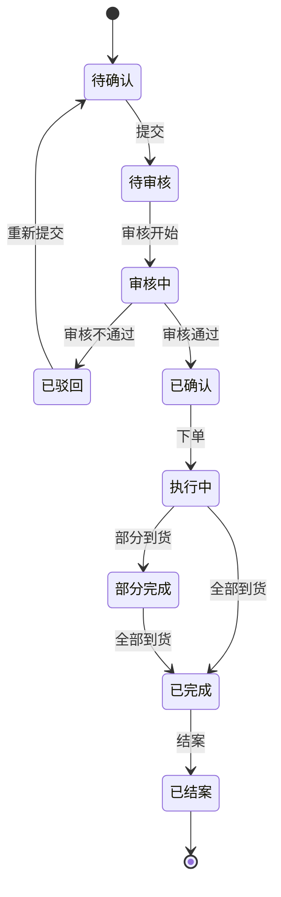
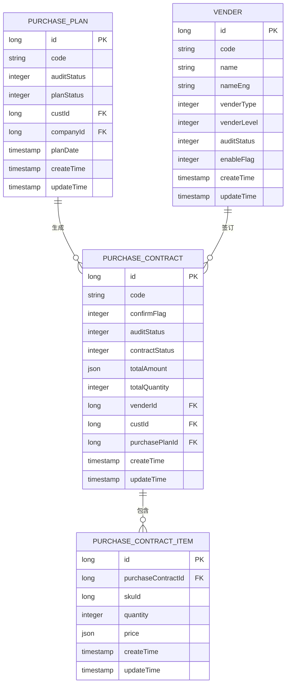

# 供应链数据模型

<cite>
**本文档引用的文件**  
- [PurchaseContractDO.java](file://eplus-module-scm/eplus-module-scm-biz/src/main/java/com/syj/eplus/module/scm/dal/dataobject/purchasecontract/PurchaseContractDO.java)
- [PurchasePlanDO.java](file://eplus-module-scm/eplus-module-scm-biz/src/main/java/com/syj/eplus/module/scm/dal/dataobject/purchaseplan/PurchasePlanDO.java)
- [VenderDO.java](file://eplus-module-scm/eplus-module-scm-biz/src/main/java/com/syj/eplus/module/scm/dal/dataobject/vender/VenderDO.java)
- [PurchaseContractMapper.xml](file://eplus-module-scm/eplus-module-scm-biz/src/main/resources/mapper/purchasecontract/PurchaseContractMapper.xml)
- [PurchasePlanMapper.xml](file://eplus-module-scm/eplus-module-scm-biz/src/main/resources/mapper/purchaseplan/PurchasePlanMapper.xml)
- [VenderMapper.xml](file://eplus-module-scm/eplus-module-scm-biz/src/main/resources/mapper/vender/VenderMapper.xml)
</cite>

## 目录
1. [引言](#引言)
2. [核心实体设计](#核心实体设计)
3. [采购业务流程数据流转](#采购业务流程数据流转)
4. [采购合同状态机设计](#采购合同状态机设计)
5. [关键业务字段说明](#关键业务字段说明)
6. [数据库建模与ER图](#数据库建模与er图)
7. [SQL建表语句示例](#sql建表语句示例)
8. [MyBatis Mapper配置](#mybatis-mapper配置)
9. [最佳实践与设计模式](#最佳实践与设计模式)
10. [结论](#结论)

## 引言
本文档旨在详细描述供应链管理系统中的核心数据模型，重点聚焦于采购计划、采购合同和供应商管理三大核心实体的设计与实现。通过分析采购业务流程的数据流转机制，包括采购需求生成、合同签订、订单执行等环节的数据结构，为开发者提供供应链数据建模的指导和最佳实践。文档将展示实体关系图（ER图），详细说明采购合同的状态机设计、价格条款、付款条件等关键字段的业务含义，并提供实际的SQL建表语句和MyBatis Mapper配置示例。

## 核心实体设计

供应链数据模型的核心围绕采购计划、采购合同和供应商三大实体展开。这些实体通过清晰的关联关系构成了采购业务的数据基础。

### 采购合同实体（PurchaseContractDO）
采购合同实体是采购业务的核心，记录了与供应商签订的正式采购协议的所有信息。该实体继承自`BaseDO`，包含了创建时间、更新时间、创建者、更新者和删除标记等基础审计字段。

**主要字段包括：**
- **合同基本信息**：合同编号（code）、版本（ver）、确认状态（confirmFlag）、审核状态（auditStatus）、合同状态（contractStatus）
- **金额与数量**：采购总金额（totalAmount）、采购总数量（totalQuantity）、预付款金额（prepayAmount）、已付款金额（payedAmount）
- **参与方信息**：供应商主键（venderId）、供应商编码（venderCode）、供应商名称（venderName）、客户主键（custId）、采购员编码（purchaseUserId）、采购员部门编码（purchaseUserDeptId）
- **时间信息**：采购时间（purchaseTime）、交货日期（deliveryDate）、下单时间（orderTime）、结案时间（finishTime）
- **业务配置**：付款方式（paymentName）、运费（freight）、其他费用（otherCost）、发票类型（taxType）、分摊方式（equallyType）
- **扩展信息**：备注（remark）、附件（annex）、链路编号（linkCodeList）

**Section sources**
- [PurchaseContractDO.java](file://eplus-module-scm/eplus-module-scm-biz/src/main/java/com/syj/eplus/module/scm/dal/dataobject/purchasecontract/PurchaseContractDO.java#L38-L467)

### 采购计划实体（PurchasePlanDO）
采购计划实体是采购流程的起点，用于规划和管理未来的采购需求。它通常由销售合同或其他业务需求触发生成。

**主要字段包括：**
- **计划基本信息**：计划编号（code）、版本（ver）、审核状态（auditStatus）、计划状态（planStatus）
- **客户与来源**：客户ID（custId）、客户编号（custCode）、来源单类型（sourceType），用于区分是手工创建还是由外销合同生成
- **时间与状态**：预计交期（planDate）、结案时间（finishTime）、完成时间（doneTime）
- **业务配置**：采购主体（companyId）、是否辅料采购（auxiliaryFlag）、销售合同主键（saleContractId）
- **组织信息**：采购员列表（purchaseUserList）、销售员（sales）、创建人部门id（creatorDeptId）

**Section sources**
- [PurchasePlanDO.java](file://eplus-module-scm/eplus-module-scm-biz/src/main/java/com/syj/eplus/module/scm/dal/dataobject/purchaseplan/PurchasePlanDO.java#L33-L184)

### 供应商实体（VenderDO）
供应商实体用于管理所有供应商的详细信息，是采购业务中不可或缺的参与方。

**主要字段包括：**
- **基本信息**：供应商编码（code）、供应商名称（name）、英文名称（nameEng）、简称（nameShort）
- **公司信息**：注册资本（registeredCapital）、法定代表人（legalPerson）、主营业务（businessScope）
- **地址与联系**：公司地址（companyAddress）、工厂地址（factoryAddress）、企业电话（phone）、传真（fax）
- **分类与状态**：供应商类型（venderType）、供应商级别（venderLevel）、审核状态（auditStatus）、是否启用（enableFlag）
- **业务配置**：采购员列表（buyerList）、应付供应商（venderLinkCode）、国家编号（countryId）
- **扩展信息**：附件（annex）、资质id（qualificationIds）、税务信息（taxMsg）

**Section sources**
- [VenderDO.java](file://eplus-module-scm/eplus-module-scm-biz/src/main/java/com/syj/eplus/module/scm/dal/dataobject/vender/VenderDO.java#L37-L235)

## 采购业务流程数据流转

采购业务流程从需求生成到订单执行，涉及多个实体之间的数据流转和状态变更。

### 采购需求生成
采购需求通常来源于销售合同。当销售合同确认后，系统会根据合同中的产品需求生成相应的采购计划（PurchasePlanDO）。采购计划会继承销售合同的客户信息、产品明细和预计交期等关键数据。

### 采购合同签订
采购计划审批通过后，可以转为采购合同。此过程通过`PurchasePlanToContractReqVO`请求对象触发，将一个或多个采购计划明细项（planItemIdList）转换为正式的采购合同。在转换过程中，采购合同会继承采购计划中的供应商、产品、数量、价格等信息，并生成新的合同编号和版本。

### 订单执行
采购合同签订后，进入执行阶段。系统会根据合同的交货日期和数量，生成入库通知单（StockNotice）和验货单（CheckList）。合同的执行状态会通过`totalReceivedCount`（总到货数量）、`totalCheckedCount`（总验收数量）等字段进行跟踪。当所有产品完成入库和验收后，合同状态将更新为完成。

**Section sources**
- [PurchasePlanToContractReqVO.java](file://eplus-module-scm/eplus-module-scm-biz/src/main/java/com/syj/eplus/module/scm/controller/admin/purchaseplan/vo/PurchasePlanToContractReqVO.java#L10-L14)
- [PurchaseContractInfoRespVO.java](file://eplus-module-scm/eplus-module-scm-biz/src/main/java/com/syj/eplus/module/scm/controller/admin/purchasecontract/vo/PurchaseContractInfoRespVO.java#L35-L36)

## 采购合同状态机设计

采购合同的状态机设计是确保采购流程规范化的关键。合同状态（contractStatus）字段通过不同的整数值表示合同所处的生命周期阶段。



**Diagram sources**
- [PurchaseContractDO.java](file://eplus-module-scm/eplus-module-scm-biz/src/main/java/com/syj/eplus/module/scm/dal/dataobject/purchasecontract/PurchaseContractDO.java#L64)

## 关键业务字段说明

### 价格与金额字段
- **totalAmount (采购总金额)**: 使用`JsonAmountTypeHandler`处理，支持多币种金额存储，包含金额值和币种信息。
- **prepayAmount (预付款金额)**: 合同签订时需要支付的预付款，同样使用`JsonAmountTypeHandler`。
- **payedAmount (已付款金额)**: 累计已支付给供应商的金额。
- **freight (运费)** 和 **otherCost (其他费用)**: 与采购相关的附加费用。

### 付款与发票字段
- **payStatus (付款状态)**: 表示合同的付款进度，如未付款、部分付款、已付清。
- **invoiceStatus (开票状态)**: 跟踪供应商开票情况，如未开票、部分开票、已开票。
- **taxType (发票类型)**: 定义发票的税务类型，影响后续的财务处理。
- **paymentName (付款方式)**: 描述付款的具体方式，如电汇、信用证等。

### 业务标识字段
- **auxiliaryFlag (是否辅料采购)**: 区分是主料采购还是辅料采购，影响后续的审批流程和库存管理。
- **confirmFlag (确认状态)**: 供应商对合同的确认状态，是合同生效的关键标志。
- **autoFlag (自动生成标识)**: 标记合同是否由系统自动生成，用于区分手动创建和系统生成的合同。

**Section sources**
- [PurchaseContractDO.java](file://eplus-module-scm/eplus-module-scm-biz/src/main/java/com/syj/eplus/module/scm/dal/dataobject/purchasecontract/PurchaseContractDO.java#L68-L326)

## 数据库建模与ER图

以下ER图展示了采购相关核心表之间的关系。



**Diagram sources**
- [PurchaseContractDO.java](file://eplus-module-scm/eplus-module-scm-biz/src/main/java/com/syj/eplus/module/scm/dal/dataobject/purchasecontract/PurchaseContractDO.java)
- [PurchasePlanDO.java](file://eplus-module-scm/eplus-module-scm-biz/src/main/java/com/syj/eplus/module/scm/dal/dataobject/purchaseplan/PurchasePlanDO.java)
- [VenderDO.java](file://eplus-module-scm/eplus-module-scm-biz/src/main/java/com/syj/eplus/module/scm/dal/dataobject/vender/VenderDO.java)

## SQL建表语句示例

以下是采购合同表的SQL建表示例：

```sql
CREATE TABLE scm_purchase_contract (
    id BIGINT NOT NULL COMMENT '主键',
    ver INT COMMENT '版本',
    code VARCHAR(64) COMMENT '采购合同编号',
    confirm_flag INT COMMENT '确认状态',
    audit_status INT COMMENT '审核状态',
    contract_status INT COMMENT '采购合同状态',
    total_amount JSON COMMENT '采购总金额',
    total_quantity INT COMMENT '采购总数量',
    print_flag INT COMMENT '打印状态',
    print_times INT COMMENT '打印次数',
    prepay_status INT COMMENT '预付款状态',
    prepay_amount JSON COMMENT '预付款金额',
    pay_status INT COMMENT '付款状态',
    payed_amount JSON COMMENT '已付款金额',
    invoice_status INT COMMENT '开票状态',
    convert_notice_flag INT COMMENT '转入库通知单标识',
    invoiced_amount DECIMAL(19,2) COMMENT '已开票金额',
    manager JSON COMMENT '跟单员',
    purchase_user_id BIGINT COMMENT '采购员编码',
    purchase_user_name VARCHAR(64) COMMENT '采购员名称',
    purchase_user_dept_id BIGINT COMMENT '采购员部门编码',
    purchase_user_dept_name VARCHAR(64) COMMENT '采购员部门名称',
    cust_id BIGINT COMMENT '客户主键',
    vender_id BIGINT COMMENT '供应商主键',
    stock_id BIGINT COMMENT '仓库主键',
    stock_code VARCHAR(64) COMMENT '仓库编码',
    vender_code VARCHAR(64) COMMENT '供应商编码',
    vender_name VARCHAR(64) COMMENT '供应商名称',
    cust_code VARCHAR(64) COMMENT '客户编码',
    stock_name VARCHAR(64) COMMENT '仓库名称',
    purchase_plan_id BIGINT COMMENT '采购计划id',
    purchase_plan_code VARCHAR(64) COMMENT '采购计划编号',
    sale_contract_id BIGINT COMMENT '销售合同id',
    sale_contract_code VARCHAR(64) COMMENT '销售合同编号',
    remark TEXT COMMENT '备注',
    annex JSON COMMENT '附件',
    company_id BIGINT COMMENT '采购主体',
    purchase_time DATETIME COMMENT '采购时间',
    payment_id BIGINT COMMENT '付款方式id',
    payment_name VARCHAR(64) COMMENT '付款方式名称',
    port_id BIGINT COMMENT '目的口岸',
    freight JSON COMMENT '运费',
    other_cost JSON COMMENT '其他费用',
    delivery_date DATETIME COMMENT '交货日期',
    init_delivery_date DATETIME COMMENT '初始交货日期',
    deal_time DATETIME COMMENT '处理时间',
    finish_time DATETIME COMMENT '结案时间',
    done_time DATETIME COMMENT '完成时间',
    sign_back_time DATETIME COMMENT '回签时间',
    order_time DATETIME COMMENT '下单时间',
    sign_back_flag INT COMMENT '回签',
    tax_type INT COMMENT '发票类型',
    equally_type INT COMMENT '分摊方式',
    auxiliary_flag INT COMMENT '是否辅料采购',
    re_purchase_flag INT COMMENT '重构标记',
    re_purchase_desc VARCHAR(255) COMMENT '重构原因',
    re_purchase_time TIME COMMENT '重构时间',
    re_purchase_old_flag INT COMMENT '重构旧版本标记',
    produce_completed INT COMMENT '生产完成标识',
    payment_vender_id BIGINT COMMENT '应付供应商主键',
    payment_vender_code VARCHAR(64) COMMENT '应付供应商编号',
    payment_vender_name VARCHAR(64) COMMENT '应付供应商名称',
    invoiced_quantity DECIMAL(19,2) COMMENT '已开票数量',
    currency VARCHAR(10) COMMENT '币种',
    invoiced_currency VARCHAR(10) COMMENT '登票币种',
    sign_back_desc TEXT COMMENT '回签描述',
    change_status INT COMMENT '变更状态',
    auto_flag INT COMMENT '自动生成标识',
    link_code_list JSON COMMENT '链路编号',
    design_draft_list JSON COMMENT '出片文件',
    sign_back_annex_list JSON COMMENT '回签附件',
    place_order_flag INT COMMENT '下单标记',
    place_order_time DATETIME COMMENT '下单时间',
    plan_source_type INT COMMENT '采购计划来源方式',
    check_status INT COMMENT '验货状态',
    repeat_flag INT COMMENT '翻单标记',
    vender_poc JSON COMMENT '供应商联系人',
    sales JSON COMMENT '销售',
    effect_range_list JSON COMMENT '生效范围',
    box_with_color INT COMMENT '箱带颜色',
    sample_count INT COMMENT '样品套数',
    gen_contract_unique_code VARCHAR(64) COMMENT '内部生成编号',
    delivery_address VARCHAR(255) COMMENT '送货地址',
    auxiliary_payment_flag INT COMMENT '包材转对公标记',
    minimum_base_quantity DECIMAL(19,2) COMMENT '最低备品比例',
    restocking_deadline INT COMMENT '乙方补货时限',
    auxiliary_purchase_user JSON COMMENT '辅料属于的采购员',
    auxiliary_sales JSON COMMENT '辅料属于的销售员',
    auxiliary_manager JSON COMMENT '辅料属于的跟单员',
    process_instance_id VARCHAR(64) COMMENT '流程实例id',
    sync_code BIGINT COMMENT '同步标记',
    total_amount_rmb JSON COMMENT '采购总额人民币',
    tax_rate DECIMAL(10,2) COMMENT '税率',
    create_time DATETIME COMMENT '创建时间',
    update_time DATETIME COMMENT '最后更新时间',
    creator VARCHAR(64) COMMENT '创建者',
    updater VARCHAR(64) COMMENT '更新者',
    deleted BIT COMMENT '是否删除',
    PRIMARY KEY (id)
) COMMENT='采购合同表';
```

**Section sources**
- [PurchaseContractDO.java](file://eplus-module-scm/eplus-module-scm-biz/src/main/java/com/syj/eplus/module/scm/dal/dataobject/purchasecontract/PurchaseContractDO.java)

## MyBatis Mapper配置

MyBatis Mapper配置通过XML文件定义复杂的SQL查询。对于采购合同模块，Mapper XML文件主要包含分页查询、条件筛选等操作。

```xml
<?xml version="1.0" encoding="UTF-8"?>
<!DOCTYPE mapper PUBLIC "-//mybatis.org//DTD Mapper 3.0//EN" "http://mybatis.org/dtd/mybatis-3-mapper.dtd">
<mapper namespace="com.syj.eplus.module.scm.dal.mysql.purchasecontract.PurchaseContractMapper">

    <!--
        一般情况下，尽可能使用 Mapper 进行 CRUD 增删改查即可。
        无法满足的场景，例如说多表关联查询，才使用 XML 编写 SQL。
        代码生成器暂时只生成 Mapper XML 文件本身，更多推荐 MybatisX 快速开发插件来生成查询。
        文档可见：https://www.iocoder.cn/MyBatis/x-plugins/
     -->

</mapper>
```

**Section sources**
- [PurchaseContractMapper.xml](file://eplus-module-scm/eplus-module-scm-biz/src/main/resources/mapper/purchasecontract/PurchaseContractMapper.xml)

## 最佳实践与设计模式

### 基础实体继承
所有数据实体都继承自`BaseDO`，该基类提供了统一的审计字段（createTime, updateTime, creator, updater, deleted），确保了数据的一致性和可追溯性。

### 类型处理器（TypeHandler）
系统大量使用自定义的TypeHandler来处理复杂数据类型：
- `JsonAmountTypeHandler`: 将JSON格式的金额对象映射到Java的`JsonAmount`实体。
- `JsonFileListTypeHandler`: 处理附件列表，将JSON数组与`List<SimpleFile>`相互转换。
- `StringListTypeHandler`: 处理字符串列表，如链路编号（linkCodeList）。

### 注解驱动开发
使用`@TableName`、`@TableId`、`@TableField`等MyBatis Plus注解，实现实体与数据库表的自动映射，减少配置工作量。

### 业务标识分离
通过`auxiliaryFlag`、`sourceType`等字段，清晰地区分不同业务场景（如主料/辅料采购、手工创建/系统生成），便于后续的业务逻辑处理和报表统计。

**Section sources**
- [BaseDO.java](file://yudao-framework/yudao-spring-boot-starter-mybatis/src/main/java/cn/iocoder/yudao/framework/mybatis/core/dataobject/BaseDO.java)
- [PurchaseContractDO.java](file://eplus-module-scm/eplus-module-scm-biz/src/main/java/com/syj/eplus/module/scm/dal/dataobject/purchasecontract/PurchaseContractDO.java)

## 结论
本文档详细阐述了供应链管理系统中采购相关的核心数据模型。通过分析采购计划、采购合同和供应商三大实体的设计，以及它们在采购业务流程中的数据流转，为开发者提供了清晰的数据建模指导。文档展示了关键的ER图、SQL建表语句和MyBatis配置，强调了使用基础实体继承、类型处理器和注解驱动等最佳实践。这些设计确保了系统的可维护性、扩展性和数据一致性，为构建高效、可靠的供应链管理系统奠定了坚实的基础。