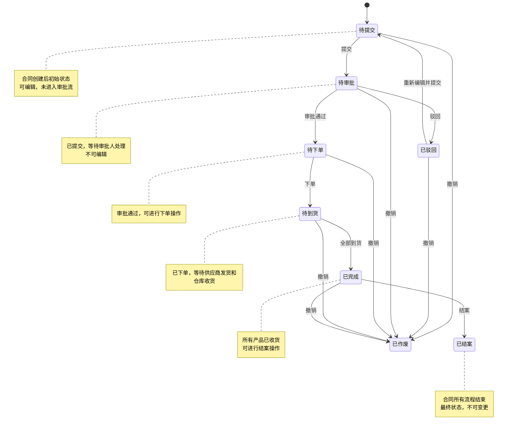
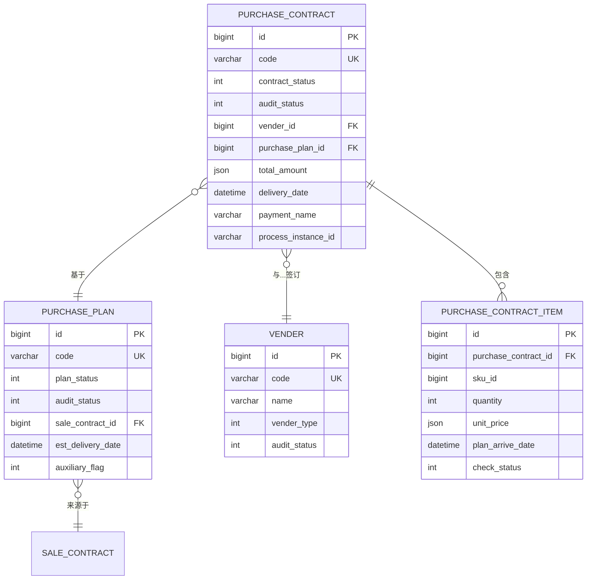

# 采购数据模型

<cite>
**本文档引用的文件**   
- [PurchaseContractDO.java](file://eplus-module-scm/eplus-module-scm-biz/src/main/java/com/syj/eplus/module/scm/dal/dataobject/purchasecontract/PurchaseContractDO.java)
- [PurchasePlanDO.java](file://eplus-module-scm/eplus-module-scm-biz/src/main/java/com/syj/eplus/module/scm/dal/dataobject/purchaseplan/PurchasePlanDO.java)
- [VenderDO.java](file://eplus-module-scm/eplus-module-scm-biz/src/main/java/com/syj/eplus/module/scm/dal/dataobject/vender/VenderDO.java)
- [PurchaseContractItemDO.java](file://eplus-module-scm/eplus-module-scm-biz/src/main/java/com/syj/eplus/module/scm/dal/dataobject/purchasecontractitem/PurchaseContractItemDO.java)
- [PurchaseContractMapper.xml](file://eplus-module-scm/eplus-module-scm-biz/src/main/resources/mapper/purchasecontract/PurchaseContractMapper.xml)
- [PurchaseContractStatusEnum.java](file://eplus-framework/eplus-common/src/main/java/com/syj/eplus/framework/common/enums/PurchaseContractStatusEnum.java)
- [PurchasePlanStatusEnum.java](file://eplus-framework/eplus-common/src/main/java/com/syj/eplus/framework/common/enums/PurchasePlanStatusEnum.java)
- [FreightEnum.java](file://eplus-module-scm/eplus-module-scm-api/src/main/java/com/syj/eplus/module/scm/enums/FreightEnum.java)
- [PurchaseCheckStatusEmums.java](file://eplus-module-scm/eplus-module-scm-api/src/main/java/com/syj/eplus/module/scm/enums/PurchaseCheckStatusEmums.java)
</cite>

## 目录
1. [引言](#引言)
2. [核心实体设计](#核心实体设计)
3. [采购业务流程与数据流转](#采购业务流程与数据流转)
4. [采购合同状态机设计](#采购合同状态机设计)
5. [关键业务字段说明](#关键业务字段说明)
6. [数据库表结构与ER图](#数据库表结构与er图)
7. [MyBatis Mapper配置示例](#mybatis-mapper配置示例)
8. [开发指导与最佳实践](#开发指导与最佳实践)
9. [结论](#结论)

## 引言

本文档旨在为开发者提供一个关于采购数据模型的全面、详细的指导。文档重点阐述了采购计划、采购合同和供应商管理等核心实体的设计理念与实现细节。通过分析采购业务流程中的数据流转机制，包括采购需求生成、合同签订和订单执行等关键环节，本文档将揭示系统内部的数据结构与交互逻辑。此外，文档还提供了实体关系图（ER图）来直观展示采购相关表之间的关联，并深入解析了采购合同的状态机、价格条款和付款条件等核心业务字段的含义。最后，文档包含实际的SQL建表语句和MyBatis Mapper配置示例，为开发者进行采购数据建模提供直接的参考和最佳实践建议。

## 核心实体设计

采购数据模型的核心围绕三个主要实体构建：采购计划（Purchase Plan）、采购合同（Purchase Contract）和供应商（Vender）。这些实体通过清晰的关联关系，共同支撑起整个采购业务流程。

### 采购计划 (PurchasePlanDO)

采购计划是采购流程的起点，代表了基于销售合同或手工创建的采购需求。`PurchasePlanDO` 实体是其在数据层的实现。

**核心属性**:
- `id` (Long): 主键，唯一标识一个采购计划。
- `code` (String): 采购计划编号，用于业务识别。
- `auditStatus` (Integer): 审核状态，表示计划当前所处的审批流程阶段。
- `planStatus` (Integer): 计划状态，表示计划的生命周期阶段（如待采购、已完成）。
- `custId`, `custCode`, `custName` (Long, String, String): 关联的客户信息。
- `saleContractId`, `saleContractCode` (Long, String): 指向生成此计划的销售合同，是采购需求的来源。
- `estDeliveryDate` (LocalDateTime): 预计交货日期，是计划的关键时间点。
- `auxiliaryFlag` (Integer): 标识此计划是否为辅料采购。
- `purchaseUserList` (List<UserDept>): 采购员列表，支持多人协作。

该实体通过 `saleContractId` 与销售合同建立关联，并通过 `purchaseContractId`（在采购计划明细中）与后续的采购合同建立联系，形成了从销售到采购的需求传递链。

### 采购合同 (PurchaseContractDO)

采购合同是采购流程的核心执行文件，代表了与供应商达成的正式采购协议。`PurchaseContractDO` 实体是其在数据层的实现。

**核心属性**:
- `id` (Long): 主键，唯一标识一个采购合同。
- `code` (String): 采购合同编号，用于业务识别。
- `contractStatus` (Integer): 合同状态，是其生命周期的核心指标。
- `auditStatus` (Integer): 审核状态，反映合同在审批流程中的位置。
- `venderId`, `venderCode`, `venderName` (Long, String, String): 关联的供应商信息。
- `purchasePlanId`, `purchasePlanCode` (Long, String): 指向生成此合同的采购计划，建立了合同与需求的直接关联。
- `totalAmount` (JsonAmount): 采购总金额，使用 `JsonAmountTypeHandler` 处理币种和金额。
- `deliveryDate` (LocalDateTime): 交货日期，是合同执行的关键时间点。
- `paymentName` (String): 付款方式名称，描述了付款条件。
- `processInstanceId` (String): 流程实例ID，与BPM系统集成，用于跟踪审批流程。

采购合同实体是采购计划的下游产物，它继承了计划的关键信息（如供应商、产品、数量），并在此基础上增加了价格、付款、交货等执行细节。

### 供应商 (VenderDO)

供应商是采购业务的交易对象。`VenderDO` 实体是其在数据层的实现。

**核心属性**:
- `id` (Long): 主键，唯一标识一个供应商。
- `code` (String): 供应商编码，用于业务识别。
- `name`, `nameEng`, `nameShort` (String): 供应商的中文名、英文名和简称。
- `venderType`, `venderLevel` (Integer): 供应商类型和级别，用于分类管理。
- `auditStatus` (Integer): 供应商的审核状态。
- `buyerIds` (List<Long>): 采购员ID列表，标识负责该供应商的采购人员。
- `countryId` (Long): 国家编号，用于区分境内和境外供应商。
- `abroadFlag` (Integer): 是否为境外供应商的标识。

供应商实体为采购合同和采购计划提供了基础的交易对象信息，确保了采购业务的合规性和可追溯性。

**本节来源**
- [PurchasePlanDO.java](file://eplus-module-scm/eplus-module-scm-biz/src/main/java/com/syj/eplus/module/scm/dal/dataobject/purchaseplan/PurchasePlanDO.java)
- [PurchaseContractDO.java](file://eplus-module-scm/eplus-module-scm-biz/src/main/java/com/syj/eplus/module/scm/dal/dataobject/purchasecontract/PurchaseContractDO.java)
- [VenderDO.java](file://eplus-module-scm/eplus-module-scm-biz/src/main/java/com/syj/eplus/module/scm/dal/dataobject/vender/VenderDO.java)

## 采购业务流程与数据流转

采购业务流程是一个从需求生成到订单执行的闭环过程，其数据流转清晰地体现在核心实体的创建和关联上。

### 数据流转机制

1.  **采购需求生成 (采购计划创建)**:
    *   **触发**: 业务流程始于销售合同的确认或手工创建采购需求。
    *   **数据流转**: 系统根据销售合同中的产品信息，自动生成一个或多个采购计划 (`PurchasePlanDO`)。此时，`PurchasePlanDO` 的 `sourceType` 字段被设置为“外销合同生成”，`saleContractId` 字段被填充，从而建立了与销售合同的强关联。计划中包含了产品SKU、数量、预计交期等核心需求数据。

2.  **合同签订 (采购合同创建)**:
    *   **触发**: 采购计划审核通过后，采购员基于一个或多个采购计划明细项，与供应商协商价格和条款，创建采购合同。
    *   **数据流转**: 在创建 `PurchaseContractDO` 时，系统会将选定的采购计划明细项 (`PurchasePlanItemDO`) 的信息（如产品、数量）复制到采购合同明细 (`PurchaseContractItemDO`) 中。同时，`PurchaseContractDO` 的 `purchasePlanId` 和 `purchasePlanCode` 字段被设置，建立了与上游采购计划的关联。此时，合同的 `contractStatus` 初始化为“待提交”。

3.  **订单执行 (合同执行与状态更新)**:
    *   **触发**: 采购合同签订并生效后，进入执行阶段。
    *   **数据流转**: 随着合同的执行，相关状态字段会持续更新：
        *   **交货**: `deliveryDate` 到期，仓库开始收货，`PurchaseContractItemDO` 中的 `receivedQuantity` 增加。
        *   **验货**: 质检部门进行验货，`PurchaseContractItemDO` 中的 `checkStatus` 和 `checkedQuantity` 被更新。
        *   **付款**: 财务部门根据付款计划进行付款，`PurchaseContractDO` 中的 `payStatus` 和 `payedAmount` 被更新。
        *   **开票**: 供应商开具发票，`PurchaseContractDO` 中的 `invoiceStatus` 和 `invoicedAmount` 被更新。
    *   这些状态的更新驱动着 `PurchaseContractDO` 的 `contractStatus` 从“待下单”逐步流转至“待到货”、“已完成”等状态。

整个流程的数据流转形成了一个清晰的链条：**销售合同 → 采购计划 → 采购合同 → 入库单/付款单/发票**。每个环节的数据都源自上一个环节，并为下一个环节提供输入，确保了业务数据的一致性和可追溯性。

**本节来源**
- [PurchasePlanDO.java](file://eplus-module-scm/eplus-module-scm-biz/src/main/java/com/syj/eplus/module/scm/dal/dataobject/purchaseplan/PurchasePlanDO.java)
- [PurchaseContractDO.java](file://eplus-module-scm/eplus-module-scm-biz/src/main/java/com/syj/eplus/module/scm/dal/dataobject/purchasecontract/PurchaseContractDO.java)
- [PurchaseContractItemDO.java](file://eplus-module-scm/eplus-module-scm-biz/src/main/java/com/syj/eplus/module/scm/dal/dataobject/purchasecontractitem/PurchaseContractItemDO.java)

## 采购合同状态机设计

采购合同的状态机是其生命周期管理的核心，通过 `contractStatus` 字段来表示。该状态机与审批流程 (`auditStatus`) 紧密耦合，共同驱动合同的演进。



**状态说明**:
- **待提交 (READY_TO_SUBMIT)**: 合同创建后的初始状态，此时合同内容可被编辑，但尚未提交审批。
- **待审批 (AWAITING_APPROVAL)**: 合同被提交后进入此状态，等待审批流程的处理。在此状态下，合同通常被锁定，不可编辑。
- **已驳回 (REJECTED)**: 审批流程中被驳回。合同返回给创建人，可以修改后重新提交。
- **待下单 (AWAITING_ORDER)**: 审批通过后进入此状态，表示合同已生效，采购员可以执行下单操作。
- **待到货 (EXPECTING_DELIVERY)**: 下单后进入此状态，等待供应商发货和仓库收货。
- **已完成 (FINISHED)**: 所有采购的产品均已收货，合同的主要执行部分完成。
- **已结案 (CASE_SETTLED)**: 合同所有流程（包括付款、开票等）均已结束，进入最终归档状态。
- **已作废 (CANCELLED)**: 合同在任何阶段被主动撤销，表示该合同作废。

**状态流转逻辑**:
状态的变更主要由业务操作和审批结果驱动。例如，当审批流程返回“通过”结果时，`PurchaseContractServiceImpl` 会将 `contractStatus` 更新为 `AWAITING_ORDER`；当返回“驳回”结果时，则更新为 `REJECTED`。这种设计确保了状态机的严谨性和可审计性。

**本节来源**
- [PurchaseContractStatusEnum.java](file://eplus-framework/eplus-common/src/main/java/com/syj/eplus/framework/common/enums/PurchaseContractStatusEnum.java)
- [PurchaseContractDO.java](file://eplus-module-scm/eplus-module-scm-biz/src/main/java/com/syj/eplus/module/scm/dal/dataobject/purchasecontract/PurchaseContractDO.java)
- [PurchaseContractServiceImpl.java](file://eplus-module-scm/eplus-module-scm-biz/src/main/java/com/syj/eplus/module/scm/service/purchasecontract/PurchaseContractServiceImpl.java#L1547-L1564)

## 关键业务字段说明

采购数据模型中包含许多关键业务字段，它们承载着重要的业务规则和含义。

### 价格与金额字段

系统使用 `JsonAmount` 类型和 `JsonAmountTypeHandler` 处理器来统一管理涉及金额和币种的字段，确保数据的完整性和一致性。

- **`unitPrice` (采购单价)**: 存储在 `PurchaseContractItemDO` 中，表示单个产品的采购价格，包含币种信息。
- **`totalAmount` (采购总金额)**: 存储在 `PurchaseContractDO` 中，表示整个合同的采购总金额，是所有明细项金额的汇总。
- **`freight` (运费)**: 存储在 `PurchaseContractDO` 中，表示该合同的总运费。
- **`otherCost` (其他费用)**: 存储在 `PurchaseContractDO` 中，表示除产品价格和运费外的其他费用。
- **`taxRate` (税率)**: 存储在 `PurchaseContractItemDO` 中，表示该明细项的税率，用于计算含税价格。

### 付款条件字段

- **`paymentName`**: 存储在 `PurchaseContractDO` 中，以文本形式描述付款方式，如“30%定金，70%见提单副本付款”。该字段的值来源于一个预定义的付款方式字典。
- **`equallyType` (分摊方式)**: 存储在 `PurchaseContractDO` 中，使用 `FreightEnum` 枚举，定义了运费的分摊规则：
    - `ALLOT_BY_NONE` (0): 不分配
    - `ALLOT_BY_NUMBER` (1): 按数量分配
    - `ALLOT_BY_AMOUNT` (2): 按金额分配

### 验货状态字段

- **`checkStatus`**: 存储在 `PurchaseContractItemDO` 中，表示该明细项的验货状态。其值由 `PurchaseCheckStatusEmums` 枚举定义：
    - `NOT_CHECK` (1): 未验货
    - `PART_CHECK` (2): 部分通过
    - `ALL_PASS` (3): 全部通过

### 其他重要字段

- **`confirmFlag`**: 存储在 `PurchaseContractDO` 中，表示合同是否已被供应商确认。
- **`printFlag` 和 `printTimes`**: 分别表示合同的打印状态和打印次数，用于控制合同的正式性和防伪。
- **`auxiliaryFlag`**: 通用标识，用于区分主料采购和辅料采购，在 `PurchasePlanDO` 和 `PurchaseContractDO` 中均有使用。
- **`processInstanceId`**: 存储在 `PurchaseContractDO` 中，是与BPM（业务流程管理）系统集成的关键字段，用于关联合同的审批流程实例。

**本节来源**
- [PurchaseContractDO.java](file://eplus-module-scm/eplus-module-scm-biz/src/main/java/com/syj/eplus/module/scm/dal/dataobject/purchasecontract/PurchaseContractDO.java)
- [PurchaseContractItemDO.java](file://eplus-module-scm/eplus-module-scm-biz/src/main/java/com/syj/eplus/module/scm/dal/dataobject/purchasecontractitem/PurchaseContractItemDO.java)
- [FreightEnum.java](file://eplus-module-scm/eplus-module-scm-api/src/main/java/com/syj/eplus/module/scm/enums/FreightEnum.java)
- [PurchaseCheckStatusEmums.java](file://eplus-module-scm/eplus-module-scm-api/src/main/java/com/syj/eplus/module/scm/enums/PurchaseCheckStatusEmums.java)

## 数据库表结构与ER图

### 核心表结构

以下是采购模块核心数据表的简化结构。

**采购合同表 (scm_purchase_contract)**
| 字段名 | 类型 | 说明 |
| :--- | :--- | :--- |
| id | BIGINT | 主键 |
| code | VARCHAR(64) | 合同编号 |
| contract_status | INT | 合同状态 |
| audit_status | INT | 审核状态 |
| vender_id | BIGINT | 供应商ID |
| vender_code | VARCHAR(64) | 供应商编码 |
| purchase_plan_id | BIGINT | 采购计划ID |
| total_amount | JSON | 采购总金额 (含币种) |
| delivery_date | DATETIME | 交货日期 |
| payment_name | VARCHAR(255) | 付款方式 |

**采购计划表 (scm_purchase_plan)**
| 字段名 | 类型 | 说明 |
| :--- | :--- | :--- |
| id | BIGINT | 主键 |
| code | VARCHAR(64) | 计划编号 |
| plan_status | INT | 计划状态 |
| audit_status | INT | 审核状态 |
| sale_contract_id | BIGINT | 销售合同ID |
| est_delivery_date | DATETIME | 预计交货日期 |
| auxiliary_flag | INT | 是否为辅料采购 |

**供应商表 (scm_vender)**
| 字段名 | 类型 | 说明 |
| :--- | :--- | :--- |
| id | BIGINT | 主键 |
| code | VARCHAR(64) | 供应商编码 |
| name | VARCHAR(255) | 供应商名称 |
| vender_type | INT | 供应商类型 |
| audit_status | INT | 审核状态 |

**采购合同明细表 (scm_purchase_contract_item)**
| 字段名 | 类型 | 说明 |
| :--- | :--- | :--- |
| id | BIGINT | 主键 |
| purchase_contract_id | BIGINT | 所属合同ID |
| sku_id | BIGINT | 产品SKU ID |
| quantity | INT | 采购数量 |
| unit_price | JSON | 采购单价 (含币种) |
| plan_arrive_date | DATETIME | 计划到货日期 |
| check_status | INT | 验货状态 |

### 实体关系图 (ER Diagram)



**本节来源**
- [PurchaseContractDO.java](file://eplus-module-scm/eplus-module-scm-biz/src/main/java/com/syj/eplus/module/scm/dal/dataobject/purchasecontract/PurchaseContractDO.java)
- [PurchasePlanDO.java](file://eplus-module-scm/eplus-module-scm-biz/src/main/java/com/syj/eplus/module/scm/dal/dataobject/purchaseplan/PurchasePlanDO.java)
- [VenderDO.java](file://eplus-module-scm/eplus-module-scm-biz/src/main/java/com/syj/eplus/module/scm/dal/dataobject/vender/VenderDO.java)
- [PurchaseContractItemDO.java](file://eplus-module-scm/eplus-module-scm-biz/src/main/java/com/syj/eplus/module/scm/dal/dataobject/purchasecontractitem/PurchaseContractItemDO.java)

## MyBatis Mapper配置示例

MyBatis Mapper 配置文件定义了Java对象与数据库表之间的映射关系和SQL查询。

### Mapper接口定义

`PurchaseContractMapper` 接口继承自框架的 `BaseMapperX<PurchaseContractDO>`，这提供了基础的CRUD操作。对于复杂的查询，可以在XML中定义。

```java
@Mapper
public interface PurchaseContractMapper extends BaseMapperX<PurchaseContractDO> {
    // 框架已提供 selectById, insert, updateById 等方法
    // 复杂查询可在此定义方法，然后在XML中实现
    PageResult<PurchaseContractDO> selectPage(PurchaseContractPageReqVO reqVO);
}
```

### Mapper XML配置

虽然大部分CRUD操作由通用Mapper处理，但XML文件可用于编写复杂的关联查询。

```xml
<?xml version="1.0" encoding="UTF-8"?>
<!DOCTYPE mapper PUBLIC "-//mybatis.org//DTD Mapper 3.0//EN" "http://mybatis.org/dtd/mybatis-3-mapper.dtd">
<mapper namespace="com.syj.eplus.module.scm.dal.mysql.purchasecontract.PurchaseContractMapper">

    <!--
        推荐：对于多表关联查询，使用 MybatisX 插件在Mapper接口中生成注解式SQL。
        例如，一个关联查询供应商名称的示例（实际项目中可能使用注解）：
    -->
    <!--
    <select id="selectContractWithVender" resultType="Map">
        SELECT pc.*, v.name as vender_name
        FROM scm_purchase_contract pc
        LEFT JOIN scm_vender v ON pc.vender_id = v.id
        WHERE pc.id = #{contractId}
    </select>
    -->

</mapper>
```

**最佳实践**:
1.  **优先使用通用Mapper**: 对于简单的增删改查，直接使用 `BaseMapperX` 提供的方法，减少XML编写。
2.  **复杂查询使用注解**: 对于关联查询，推荐使用MyBatis的 `@Select`、`@Results` 等注解直接在Mapper接口中定义，提高代码的可读性和维护性。
3.  **XML用于复杂动态SQL**: 当SQL非常复杂，包含大量动态条件时，使用XML配置文件会更清晰。

**本节来源**
- [PurchaseContractMapper.java](file://eplus-module-scm/eplus-module-scm-biz/src/main/java/com/syj/eplus/module/scm/dal/mysql/purchasecontract/PurchaseContractMapper.java)
- [PurchaseContractMapper.xml](file://eplus-module-scm/eplus-module-scm-biz/src/main/resources/mapper/purchasecontract/PurchaseContractMapper.xml)

## 开发指导与最佳实践

在进行采购数据建模和开发时，应遵循以下指导原则和最佳实践：

1.  **遵循实体关联规则**: 在创建采购合同 (`PurchaseContractDO`) 时，必须正确设置 `purchasePlanId` 字段，以确保与上游采购计划的关联。避免创建“孤儿”合同。
2.  **状态机驱动开发**: 业务逻辑的编写应围绕状态机展开。例如，只有当 `contractStatus` 为“待下单”时，才允许执行下单操作。状态的变更应通过专门的服务方法（如 `updateStatus`）进行，以确保业务规则的集中校验。
3.  **使用枚举处理状态和类型**: 对于 `contractStatus`、`auditStatus`、`venderType` 等字段，应使用Java枚举（如 `PurchaseContractStatusEnum`）进行定义和操作，避免使用硬编码的数字，提高代码的可读性和安全性。
4.  **金额与币种处理**: 所有涉及金额的字段都应使用 `JsonAmount` 类型，并通过 `JsonAmountTypeHandler` 进行序列化和反序列化，确保币种信息不丢失。
5.  **利用MyBatis TypeHandler**: 对于复杂类型（如 `List<String>`、`UserDept`），应使用自定义的 `TypeHandler`（如 `StringListTypeHandler`、`JsonUserDeptTypeHandler`）来简化数据库存储和Java对象之间的转换。
6.  **数据权限控制**: 利用 `@DataPermission` 注解和 `purchaseContractDataPermissionRuleCustomizer` 等配置，实现基于部门、角色的数据权限控制，确保用户只能访问其权限范围内的采购合同数据。
7.  **流程集成**: 采购合同的 `processInstanceId` 字段是与BPM系统集成的桥梁。在合同状态变更时，需要同步更新审批流程的状态，反之亦然。

## 结论

本文档详细阐述了采购数据模型的设计与实现。通过分析采购计划、采购合同和供应商三大核心实体，我们构建了一个结构清晰、关系明确的数据模型。文档深入解析了从业务需求生成到订单执行的完整数据流转机制，并通过状态机图和ER图直观地展示了关键的业务逻辑和数据关系。对价格、付款、验货等核心字段的说明，以及提供的SQL和MyBatis配置示例，为开发者提供了实用的建模指导和最佳实践。遵循本文档的原则进行开发，将有助于构建一个健壮、可维护且符合业务需求的采购管理系统。