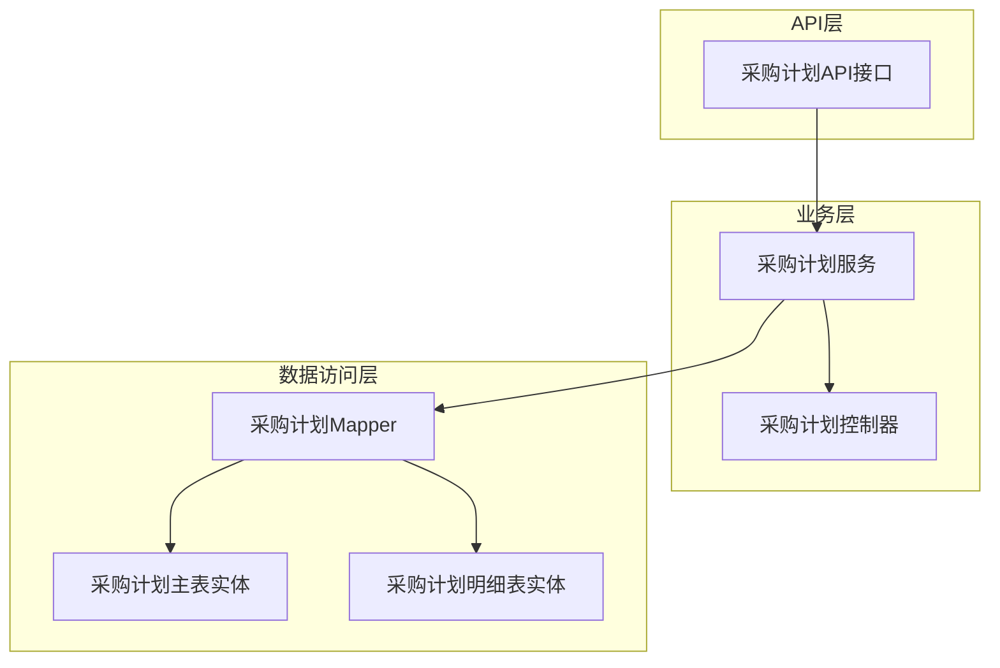
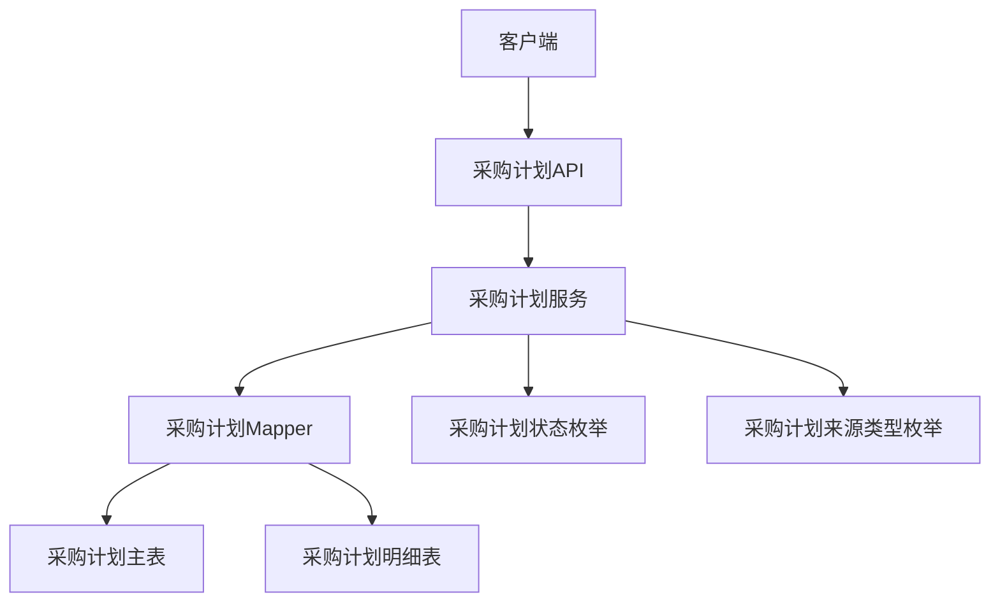
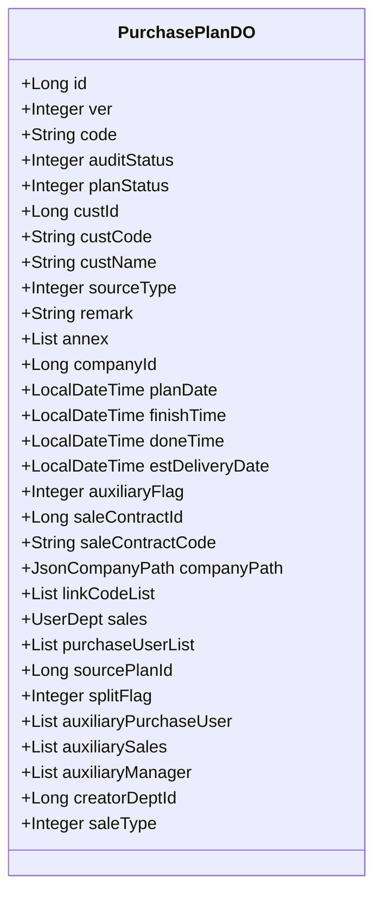
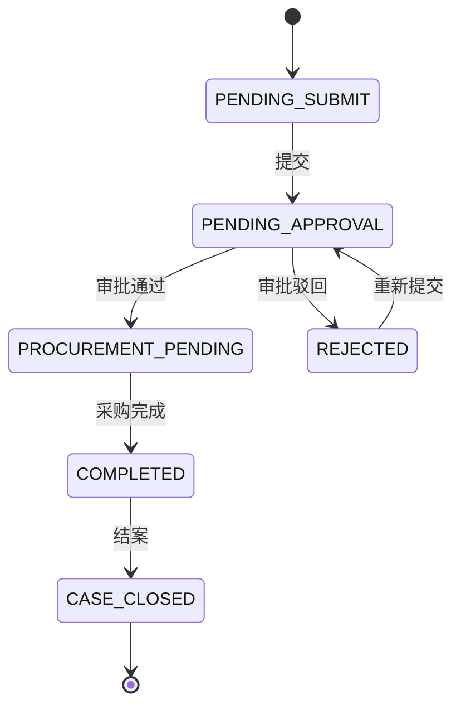
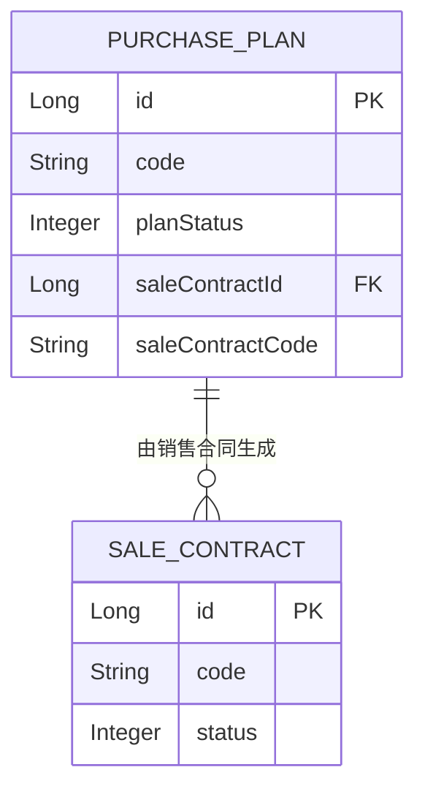
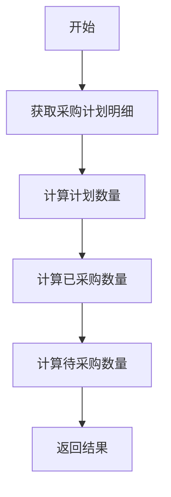
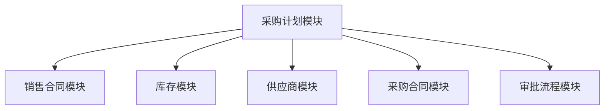

# 采购计划模型

<cite>
**本文档引用的文件**
- [PurchasePlanDO.java](file://eplus-module-scm/eplus-module-scm-biz/src/main/java/com/syj/eplus/module/scm/dal/dataobject/purchaseplan/PurchasePlanDO.java)
- [PurchasePlanItemDO.java](file://eplus-module-scm/eplus-module-scm-biz/src/main/java/com/syj/eplus/module/scm/dal/dataobject/purchaseplanitem/PurchasePlanItemDO.java)
- [PurchasePlanStatusEnum.java](file://eplus-framework/eplus-common/src/main/java/com/syj/eplus/framework/common/enums/PurchasePlanStatusEnum.java)
- [PurchasePlanSourceTypeEnum.java](file://eplus-framework/eplus-common/src/main/java/com/syj/eplus/framework/common/enums/PurchasePlanSourceTypeEnum.java)
- [PurchasePlanApi.java](file://eplus-module-scm/eplus-module-scm-api/src/main/java/com/syj/eplus/module/scm/api/purchaseplan/PurchasePlanApi.java)
- [PurchasePlanService.java](file://eplus-module-scm/eplus-module-scm-biz/src/main/java/com/syj/eplus/module/scm/service/purchaseplan/PurchasePlanService.java)
- [PurchasePlanMapper.xml](file://eplus-module-scm/eplus-module-scm-biz/src/main/resources/mapper/purchaseplan/PurchasePlanMapper.xml)
- [PurchasePlanItemMapper.xml](file://eplus-module-scm/eplus-module-scm-biz/src/main/resources/mapper/purchaseplanitem/PurchasePlanItemMapper.xml)
</cite>

## 目录
1. [简介](#简介)
2. [项目结构](#项目结构)
3. [核心组件](#核心组件)
4. [架构概述](#架构概述)
5. [详细组件分析](#详细组件分析)
6. [依赖分析](#依赖分析)
7. [性能考虑](#性能考虑)
8. [故障排除指南](#故障排除指南)
9. [结论](#结论)
10. [附录](#附录)（如有必要）

## 简介
本文档详细描述了采购计划模块的数据模型设计，包括采购计划主表和明细表的结构设计。文档解释了采购计划的生命周期状态流转，包括编制、审批、执行、关闭等状态。同时，详细说明了采购计划与销售合同、库存需求的关联关系，以及计划数量、已采购数量、待采购数量等关键字段的计算逻辑。文档还提供了采购计划相关的SQL建表语句和MyBatis Mapper配置示例，包括分页查询、状态过滤等常用查询模式，为开发者提供采购计划模块的开发指导。

## 项目结构
采购计划模块主要位于`eplus-module-scm`模块中，分为API层和业务层。API层定义了采购计划相关的接口，业务层实现了具体的业务逻辑。数据访问层使用MyBatis进行数据库操作，实体类位于`dal/dataobject`包中。



**图示来源**
- [PurchasePlanApi.java](file://eplus-module-scm/eplus-module-scm-api/src/main/java/com/syj/eplus/module/scm/api/purchaseplan/PurchasePlanApi.java)
- [PurchasePlanService.java](file://eplus-module-scm/eplus-module-scm-biz/src/main/java/com/syj/eplus/module/scm/service/purchaseplan/PurchasePlanService.java)
- [PurchasePlanController.java](file://eplus-module-scm/eplus-module-scm-biz/src/main/java/com/syj/eplus/module/scm/controller/admin/purchaseplan/PurchasePlanController.java)
- [PurchasePlanMapper.xml](file://eplus-module-scm/eplus-module-scm-biz/src/main/resources/mapper/purchaseplan/PurchasePlanMapper.xml)
- [PurchasePlanDO.java](file://eplus-module-scm/eplus-module-scm-biz/src/main/java/com/syj/eplus/module/scm/dal/dataobject/purchaseplan/PurchasePlanDO.java)
- [PurchasePlanItemDO.java](file://eplus-module-scm/eplus-module-scm-biz/src/main/java/com/syj/eplus/module/scm/dal/dataobject/purchaseplanitem/PurchasePlanItemDO.java)

**章节来源**
- [eplus-module-scm](file://eplus-module-scm)

## 核心组件
采购计划模块的核心组件包括采购计划主表(PurchasePlanDO)、采购计划明细表(PurchasePlanItemDO)、采购计划状态枚举(PurchasePlanStatusEnum)、采购计划来源类型枚举(PurchasePlanSourceTypeEnum)、采购计划API接口(PurchasePlanApi)、采购计划服务(PurchasePlanService)和采购计划Mapper(PurchasePlanMapper)。

**章节来源**
- [PurchasePlanDO.java](file://eplus-module-scm/eplus-module-scm-biz/src/main/java/com/syj/eplus/module/scm/dal/dataobject/purchaseplan/PurchasePlanDO.java)
- [PurchasePlanItemDO.java](file://eplus-module-scm/eplus-module-scm-biz/src/main/java/com/syj/eplus/module/scm/dal/dataobject/purchaseplanitem/PurchasePlanItemDO.java)
- [PurchasePlanStatusEnum.java](file://eplus-framework/eplus-common/src/main/java/com/syj/eplus/framework/common/enums/PurchasePlanStatusEnum.java)
- [PurchasePlanSourceTypeEnum.java](file://eplus-framework/eplus-common/src/main/java/com/syj/eplus/framework/common/enums/PurchasePlanSourceTypeEnum.java)
- [PurchasePlanApi.java](file://eplus-module-scm/eplus-module-scm-api/src/main/java/com/syj/eplus/module/scm/api/purchaseplan/PurchasePlanApi.java)
- [PurchasePlanService.java](file://eplus-module-scm/eplus-module-scm-biz/src/main/java/com/syj/eplus/module/scm/service/purchaseplan/PurchasePlanService.java)
- [PurchasePlanMapper.xml](file://eplus-module-scm/eplus-module-scm-biz/src/main/resources/mapper/purchaseplan/PurchasePlanMapper.xml)

## 架构概述
采购计划模块采用典型的分层架构，包括API层、服务层、数据访问层和实体层。API层定义了采购计划相关的接口，服务层实现了具体的业务逻辑，数据访问层使用MyBatis进行数据库操作，实体层定义了采购计划主表和明细表的结构。



**图示来源**
- [PurchasePlanApi.java](file://eplus-module-scm/eplus-module-scm-api/src/main/java/com/syj/eplus/module/scm/api/purchaseplan/PurchasePlanApi.java)
- [PurchasePlanService.java](file://eplus-module-scm/eplus-module-scm-biz/src/main/java/com/syj/eplus/module/scm/service/purchaseplan/PurchasePlanService.java)
- [PurchasePlanMapper.xml](file://eplus-module-scm/eplus-module-scm-biz/src/main/resources/mapper/purchaseplan/PurchasePlanMapper.xml)
- [PurchasePlanDO.java](file://eplus-module-scm/eplus-module-scm-biz/src/main/java/com/syj/eplus/module/scm/dal/dataobject/purchaseplan/PurchasePlanDO.java)
- [PurchasePlanItemDO.java](file://eplus-module-scm/eplus-module-scm-biz/src/main/java/com/syj/eplus/module/scm/dal/dataobject/purchaseplanitem/PurchasePlanItemDO.java)
- [PurchasePlanStatusEnum.java](file://eplus-framework/eplus-common/src/main/java/com/syj/eplus/framework/common/enums/PurchasePlanStatusEnum.java)
- [PurchasePlanSourceTypeEnum.java](file://eplus-framework/eplus-common/src/main/java/com/syj/eplus/framework/common/enums/PurchasePlanSourceTypeEnum.java)

## 详细组件分析
### 采购计划主表分析
采购计划主表(PurchasePlanDO)定义了采购计划的基本信息，包括采购计划编号、客户信息、采购主体、预计交期、结案时间、完成时间等。采购计划主表还包含了采购计划的状态信息，如审核状态(auditStatus)和计划状态(planStatus)。



**图示来源**
- [PurchasePlanDO.java](file://eplus-module-scm/eplus-module-scm-biz/src/main/java/com/syj/eplus/module/scm/dal/dataobject/purchaseplan/PurchasePlanDO.java)

**章节来源**
- [PurchasePlanDO.java](file://eplus-module-scm/eplus-module-scm-biz/src/main/java/com/syj/eplus/module/scm/dal/dataobject/purchaseplan/PurchasePlanDO.java)

### 采购计划明细表分析
采购计划明细表(PurchasePlanItemDO)定义了采购计划的详细信息，包括产品信息、供应商信息、仓库信息、采购数量、采购单价、总价、含税总价、税率、采购类型、包装规格、包装价、运费等。采购计划明细表还包含了采购计划明细的状态信息，如转合同状态(convertedFlag)和作废标识(cancelFlag)。

```mermaid
classDiagram
class PurchasePlanItemDO {
+Long id
+Integer ver
+Integer sortNum
+Integer oneSplitNum
+Integer twoSplitNum
+Integer threeSplitNum
+Integer sourceId
+Integer levels
+Long skuId
+String skuCode
+String skuName
+SimpleFile mainPicture
+Long custId
+String custCode
+String cskuCode
+String basicSkuCode
+Integer saleQuantity
+Integer currentLockQuantity
+Integer needPurQuantity
+Long purchaseCompanyId
+String purchaseCompanyName
+Long venderId
+String venderCode
+String venderName
+Long stockId
+String stockCode
+Long purchasePlanId
+String purchasePlanCode
+JsonAmount packagingPrice
+JsonAmount shippingPrice
+JsonAmount unitPrice
+JsonAmount totalPrice
+JsonAmount withTaxPrice
+BigDecimal taxRate
+Integer purchaseType
+Integer qtyPerInnerbox
+Integer qtyPerOuterbox
+BigDecimal packageLength
+BigDecimal packageWidth
+BigDecimal packageHeight
+Integer packageUnit
+JsonWeight singleGrossweight
+Integer convertedFlag
+String remark
+Long purchaseUserId
+String purchaseUserName
+Long purchaseUserDeptId
+String purchaseUserDeptName
+String venderProdCode
+LocalDateTime quoteDate
+Integer freightFlag
+Integer packageFlag
+List<Long> packageType
+String currency
+Integer faxFlag
+Integer moq
+Integer freeFlag
+Integer boxCount
+Integer purchaseModel
+Integer skuType
+String purchaseUrl
+Long saleContractId
+String saleContractCode
+Integer auxiliarySkuFlag
+Integer auxiliarySkuType
+String specRemark
+List<SimpleFile> annex
+String auxiliarySaleContractCode
+String auxiliaryPurchaseContractCode
+Long auxiliarySkuId
+String auxiliarySkuCode
+String auxiliaryCskuCode
+LocalDateTime convertTime
+String skuUnit
+Integer ownBrandFlag
+Integer custProFlag
+Long saleContractItemId
+List<StockLockSaveReqVO> stockLockSaveReqVOList
+List<String> linkCodeList
+String uniqueCode
+String sourceUniqueCode
+String saleItemUniqueCode
+Long splitCompanyId
+String splitCompanyName
+Integer saleLockQuantity
+Integer lockQuantity
+Integer cancelFlag
+String purchaseContractCode
+String parentSkuName
+String parentSkuCode
+Integer purchaseQuantity
+Integer convertedQuantity
+Long sourcePlanItemId
+List<JsonSpecificationEntity> specificationList
+Integer splitBoxFlag
+Integer totalQuantity
+String custPo
+String thumbnail
+String oskuCode
+LocalDateTime venderDeliveryDate
+String barcode
}
```



**图示来源**
- [PurchasePlanItemDO.java](file://eplus-module-scm/eplus-module-scm-biz/src/main/java/com/syj/eplus/module/scm/dal/dataobject/purchaseplanitem/PurchasePlanItemDO.java)

**章节来源**
- [PurchasePlanItemDO.java](file://eplus-module-scm/eplus-module-scm-biz/src/main/java/com/syj/eplus/module/scm/dal/dataobject/purchaseplanitem/PurchasePlanItemDO.java)

### 采购计划状态流转分析
采购计划的状态流转包括编制、审批、执行、关闭等状态。采购计划的状态由planStatus字段表示，其值由PurchasePlanStatusEnum枚举定义。



**图示来源**
- [PurchasePlanStatusEnum.java](file://eplus-framework/eplus-common/src/main/java/com/syj/eplus/framework/common/enums/PurchasePlanStatusEnum.java)

**章节来源**
- [PurchasePlanStatusEnum.java](file://eplus-framework/eplus-common/src/main/java/com/syj/eplus/framework/common/enums/PurchasePlanStatusEnum.java)

### 采购计划与销售合同关联分析
采购计划与销售合同的关联关系通过saleContractId和saleContractCode字段建立。采购计划可以由销售合同下推生成，也可以手工创建。



**图示来源**
- [PurchasePlanDO.java](file://eplus-module-scm/eplus-module-scm-biz/src/main/java/com/syj/eplus/module/scm/dal/dataobject/purchaseplan/PurchasePlanDO.java)
- [PurchasePlanSourceTypeEnum.java](file://eplus-framework/eplus-common/src/main/java/com/syj/eplus/framework/common/enums/PurchasePlanSourceTypeEnum.java)

**章节来源**
- [PurchasePlanDO.java](file://eplus-module-scm/eplus-module-scm-biz/src/main/java/com/syj/eplus/module/scm/dal/dataobject/purchaseplan/PurchasePlanDO.java)
- [PurchasePlanSourceTypeEnum.java](file://eplus-framework/eplus-common/src/main/java/com/syj/eplus/framework/common/enums/PurchasePlanSourceTypeEnum.java)

### 采购计划关键字段计算逻辑
采购计划的关键字段包括计划数量、已采购数量、待采购数量等。这些字段的计算逻辑在PurchasePlanService中实现。



**图示来源**
- [PurchasePlanService.java](file://eplus-module-scm/eplus-module-scm-biz/src/main/java/com/syj/eplus/module/scm/service/purchaseplan/PurchasePlanService.java)

**章节来源**
- [PurchasePlanService.java](file://eplus-module-scm/eplus-module-scm-biz/src/main/java/com/syj/eplus/module/scm/service/purchaseplan/PurchasePlanService.java)

## 依赖分析
采购计划模块依赖于销售合同模块、库存模块、供应商模块等。采购计划模块通过API接口与这些模块进行交互。



**图示来源**
- [PurchasePlanApi.java](file://eplus-module-scm/eplus-module-scm-api/src/main/java/com/syj/eplus/module/scm/api/purchaseplan/PurchasePlanApi.java)
- [PurchasePlanService.java](file://eplus-module-scm/eplus-module-scm-biz/src/main/java/com/syj/eplus/module/scm/service/purchaseplan/PurchasePlanService.java)

**章节来源**
- [PurchasePlanApi.java](file://eplus-module-scm/eplus-module-scm-api/src/main/java/com/syj/eplus/module/scm/api/purchaseplan/PurchasePlanApi.java)
- [PurchasePlanService.java](file://eplus-module-scm/eplus-module-scm-biz/src/main/java/com/syj/eplus/module/scm/service/purchaseplan/PurchasePlanService.java)

## 性能考虑
采购计划模块在设计时考虑了性能优化，包括使用MyBatis的缓存机制、合理的数据库索引设计、分页查询等。

## 故障排除指南
在使用采购计划模块时，可能会遇到一些常见问题，如采购计划状态流转异常、采购计划与销售合同关联失败等。这些问题通常可以通过检查相关字段的值、查看日志信息等方式进行排查。

**章节来源**
- [PurchasePlanService.java](file://eplus-module-scm/eplus-module-scm-biz/src/main/java/com/syj/eplus/module/scm/service/purchaseplan/PurchasePlanService.java)
- [PurchasePlanMapper.xml](file://eplus-module-scm/eplus-module-scm-biz/src/main/resources/mapper/purchaseplan/PurchasePlanMapper.xml)

## 结论
本文档详细描述了采购计划模块的数据模型设计、状态流转、与销售合同的关联关系以及关键字段的计算逻辑。通过本文档，开发者可以更好地理解和使用采购计划模块，为系统的开发和维护提供指导。

## 附录
### SQL建表语句示例
```sql
CREATE TABLE scm_purchase_plan (
    id BIGINT PRIMARY KEY,
    ver INTEGER,
    code VARCHAR(64),
    auditStatus INTEGER,
    planStatus INTEGER,
    custId BIGINT,
    custCode VARCHAR(64),
    custName VARCHAR(64),
    sourceType INTEGER,
    remark VARCHAR(255),
    annex JSON,
    companyId BIGINT,
    planDate TIMESTAMP,
    finishTime TIMESTAMP,
    doneTime TIMESTAMP,
    estDeliveryDate TIMESTAMP,
    auxiliaryFlag INTEGER,
    saleContractId BIGINT,
    saleContractCode VARCHAR(64),
    companyPath JSON,
    linkCodeList JSON,
    sales JSON,
    purchaseUserList JSON,
    sourcePlanId BIGINT,
    splitFlag INTEGER,
    auxiliaryPurchaseUser JSON,
    auxiliarySales JSON,
    auxiliaryManager JSON,
    creatorDeptId BIGINT,
    saleType INTEGER
);
```

### MyBatis Mapper配置示例
```xml
<select id="getPurchasePlanPage" resultType="PurchasePlanInfoRespVO">
    SELECT * FROM scm_purchase_plan
    WHERE planStatus = #{planStatus}
    ORDER BY id
    LIMIT #{offset}, #{limit}
</select>
```

**章节来源**
- [PurchasePlanMapper.xml](file://eplus-module-scm/eplus-module-scm-biz/src/main/resources/mapper/purchaseplan/PurchasePlanMapper.xml)
- [PurchasePlanItemMapper.xml](file://eplus-module-scm/eplus-module-scm-biz/src/main/resources/mapper/purchaseplanitem/PurchasePlanItemMapper.xml)