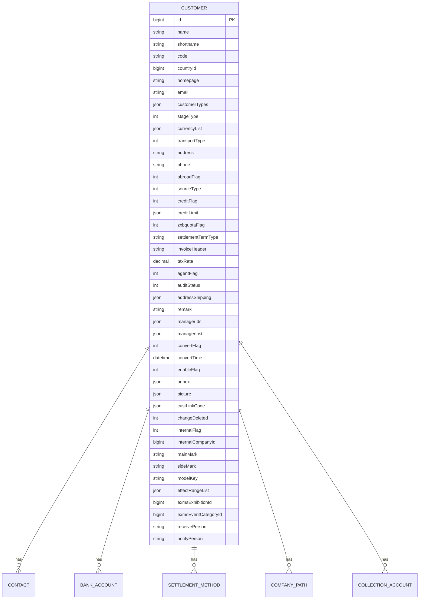
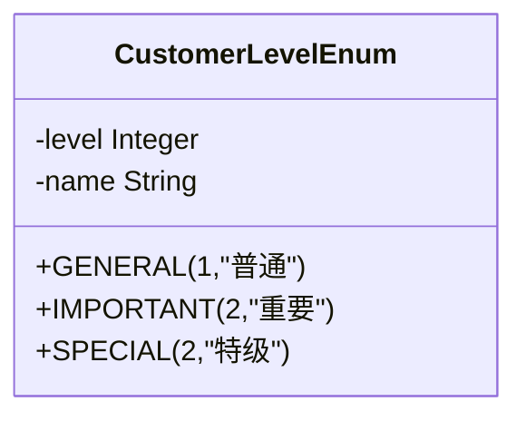
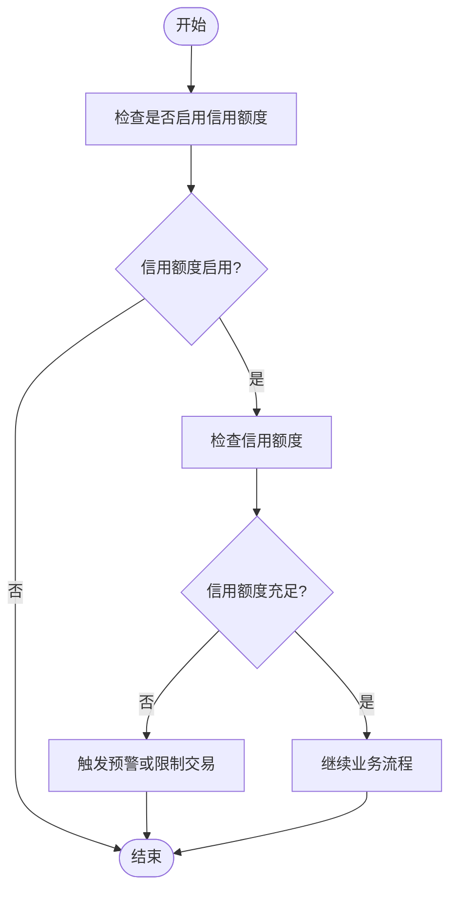
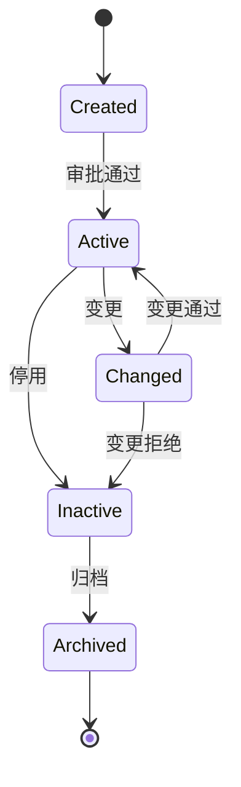
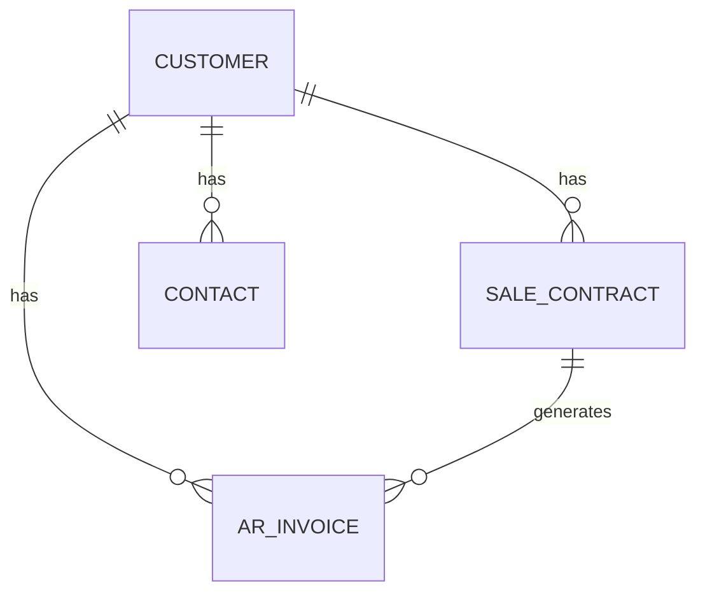
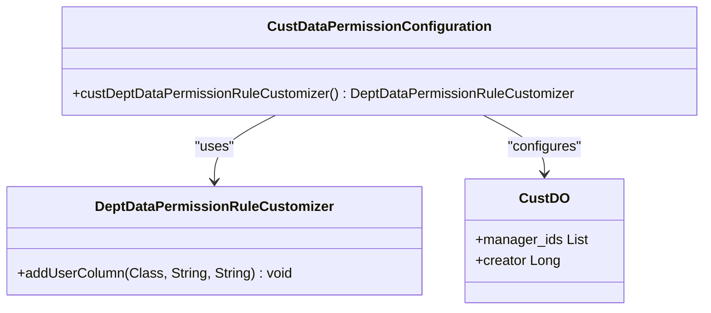

# 客户管理模型

<cite>
**本文档引用的文件**   
- [CustomerLevelEnum.java](file://eplus-framework/eplus-common/src/main/java/com/syj/eplus/framework/common/enums/CustomerLevelEnum.java)
- [CustDO.java](file://eplus-module-crm/eplus-module-crm-biz/src/main/java/com/syj/eplus/module/crm/dal/dataobject/cust/CustDO.java)
- [CustServiceImpl.java](file://eplus-module-crm/eplus-module-crm-biz/src/main/java/com/syj/eplus/module/crm/service/cust/CustServiceImpl.java)
- [CustController.java](file://eplus-module-crm/eplus-module-crm-biz/src/main/java/com/syj/eplus/module/crm/controller/admin/cust/CustController.java)
- [CustDataPermissionConfiguration.java](file://eplus-module-crm/eplus-module-crm-biz/src/main/java/com/syj/eplus/module/crm/framework/config/CustDataPermissionConfiguration.java)
- [V1_0_0_002__Eplus初始化.sql](file://eplus-flyway/src/main/resources/db/migration/common/V1_0_0_002__Eplus初始化.sql)
</cite>

## 目录
1. [引言](#引言)
2. [客户主数据设计](#客户主数据设计)
3. [客户分类与等级](#客户分类与等级)
4. [信用额度管理](#信用额度管理)
5. [客户生命周期管理](#客户生命周期管理)
6. [客户关系模型](#客户关系模型)
7. [数据权限控制](#数据权限控制)
8. [结论](#结论)

## 引言
客户管理模型是企业管理系统的核心组成部分，负责维护客户主数据的完整性、一致性和安全性。本文档详细描述了客户管理模型的设计，包括客户主数据的结构、客户分类与等级、信用额度管理、客户生命周期管理、客户与其他业务实体的关系以及数据权限控制机制。

**客户管理模型**的设计旨在支持企业的客户关系管理、销售合同管理、应收帐款管理等业务流程，确保客户数据的准确性和及时性，同时满足数据安全和合规性要求。

## 客户主数据设计

客户主数据是客户管理模型的核心，包含了客户的基本信息、联系信息、财务信息等。客户主数据的设计遵循了数据完整性、一致性和安全性的原则。



**图源**
- [CustDO.java](file://eplus-module-crm/eplus-module-crm-biz/src/main/java/com/syj/eplus/module/crm/dal/dataobject/cust/CustDO.java#L38-L260)
- [V1_0_0_002__Eplus初始化.sql](file://eplus-flyway/src/main/resources/db/migration/common/V1_0_0_002__Eplus初始化.sql#L1037-L1050)

**客户主数据字段说明**

| 字段名 | 类型 | 说明 |
| --- | --- | --- |
| `id` | bigint | 主键，唯一标识客户 |
| `name` | string | 企业名称 |
| `shortname` | string | 简称 |
| `code` | string | 客户编号 |
| `countryId` | bigint | 国家编码 |
| `homepage` | string | 官网 |
| `email` | string | 电子邮件 |
| `customerTypes` | json | 客户类型（电商,进口商,零售商,贸易商,批发商,售后公司,邮购商） |
| `stageType` | int | 客户阶段（潜在客户，正式客户，退休客户） |
| `currencyList` | json | 币种 |
| `transportType` | int | 运输方式(海运、陆运、空运、供应商送货) |
| `address` | string | 营业地址 |
| `phone` | string | 联系电话 |
| `abroadFlag` | int | 国外客户标志 |
| `sourceType` | int | 客户来源 |
| `creditFlag` | int | 启用信用额度：0：不启用，1：启用 |
| `creditLimit` | json | 信用额度 |
| `zxbquotaFlag` | int | 是否是中信保：0：否，1：是 |
| `settlementTermType` | string | 价格条款 CIF,FOB,CIP,DDP,DAP,DAT,CFR |
| `invoiceHeader` | string | 开票抬头 |
| `taxRate` | decimal | 税率 |
| `agentFlag` | int | 是否代理 0:否， 1：是 |
| `auditStatus` | int | 处理状态 |
| `addressShipping` | json | 寄件地址 |
| `remark` | string | 备用信息 |
| `managerIds` | json | 业务员 |
| `managerList` | json | 业务员 |
| `convertFlag` | int | 转正标识 |
| `convertTime` | datetime | 转正时间 |
| `enableFlag` | int | 是否启用 |
| `annex` | json | 附件 |
| `picture` | json | 图片 |
| `custLinkCode` | json | 关联客户 |
| `changeDeleted` | int | 变更是否删除 |
| `internalFlag` | int | 内部企业标识 0-否 1-是 |
| `internalCompanyId` | bigint | 内部企业主键 |
| `mainMark` | string | 正面唛头 |
| `sideMark` | string | 侧面唛头 |
| `modelKey` | string | 模型键 |
| `effectRangeList` | json | 影响范围列表 |
| `exmsExhibitionId` | bigint | 展会id |
| `exmsEventCategoryId` | bigint | 展会系列 |
| `receivePerson` | string | 收货人 |
| `notifyPerson` | string | 通知人 |

**客户主数据设计说明**

客户主数据设计采用了JSON类型字段来存储复杂的数据结构，如`customerTypes`、`currencyList`、`addressShipping`等。这种设计提高了数据的灵活性和可扩展性，同时减少了数据库表的数量和复杂性。

客户主数据还包含了多个状态字段，如`auditStatus`、`changeFlag`、`enableFlag`等，用于跟踪客户的状态变化。这些状态字段在客户生命周期管理中起着关键作用。

## 客户分类与等级

客户分类与等级是客户管理模型的重要组成部分，用于对客户进行分组和评级，以便进行差异化的管理和营销。

### 客户分类

客户分类是根据客户的行业、规模、地理位置等因素对客户进行分组。客户分类有助于企业更好地理解客户的需求和行为，制定针对性的营销策略。

客户分类信息存储在`crm_category`表中，主要字段包括：

- `id`: 主键
- `code`: 分类编号
- `name`: 名称
- `codeLen`: 流水号长度
- `parentId`: 父节点编号
- `categoryType`: 种类
- `grade`: 级别

客户分类支持多级分类，通过`parentId`字段实现父子关系。`categoryType`字段用于区分不同类型的分类，如行业分类、地区分类等。`grade`字段表示分类的级别，用于控制分类的深度。

### 客户等级

客户等级是根据客户的交易额、信用状况、合作时间等因素对客户进行评级。客户等级有助于企业识别高价值客户，提供优先服务和支持。

客户等级通过`CustomerLevelEnum`枚举类定义，包括以下等级：

- `GENERAL`: 普通
- `IMPORTANT`: 重要
- `SPECIAL`: 特级

客户等级信息存储在`crm_cust`表的`customerTypes`字段中，该字段是一个JSON数组，可以存储多个客户类型。通过客户等级，企业可以对不同等级的客户采取不同的信用政策、价格策略和服务标准。



**图源**
- [CustomerLevelEnum.java](file://eplus-framework/eplus-common/src/main/java/com/syj/eplus/framework/common/enums/CustomerLevelEnum.java#L1-L23)

## 信用额度管理

信用额度管理是客户管理模型的关键功能，用于控制客户的信用风险，确保企业的资金安全。

### 信用额度字段

信用额度信息存储在`crm_cust`表的`creditLimit`字段中，该字段是一个JSON对象，包含以下属性：

- `amount`: 信用额度金额
- `currency`: 币种

`creditFlag`字段用于控制是否启用信用额度，0表示不启用，1表示启用。

### 信用额度管理流程

信用额度管理流程包括信用额度的设置、调整和监控。

1. **信用额度设置**：在创建客户时，可以根据客户的信用状况设置初始信用额度。信用额度可以是固定金额，也可以是基于交易额的百分比。

2. **信用额度调整**：随着客户交易额的增加或信用状况的变化，可以调整客户的信用额度。信用额度调整需要经过审批流程，确保风险可控。

3. **信用额度监控**：系统会实时监控客户的信用额度使用情况，当客户接近或超过信用额度时，会触发预警或限制交易。



**图源**
- [CustDO.java](file://eplus-module-crm/eplus-module-crm-biz/src/main/java/com/syj/eplus/module/crm/dal/dataobject/cust/CustDO.java#L130-L135)

## 客户生命周期管理

客户生命周期管理是客户管理模型的核心功能，涵盖了客户从创建到归档的整个生命周期。

### 客户创建

客户创建是客户生命周期的起点。客户创建流程包括以下步骤：

1. **信息收集**：收集客户的基本信息、联系信息、财务信息等。
2. **信息验证**：验证客户信息的完整性和准确性。
3. **审批流程**：提交客户信息进行审批，审批通过后客户正式生效。

客户创建通过`CustServiceImpl.createCust`方法实现，该方法会校验客户名称是否存在，并生成客户编号。

### 客户变更

客户变更是客户生命周期中的重要环节，用于更新客户信息。客户变更流程包括以下步骤：

1. **变更申请**：提交客户变更申请，包括变更前后的信息对比。
2. **影响范围分析**：分析客户变更对相关业务的影响，如销售合同、应收帐款等。
3. **审批流程**：提交变更申请进行审批，审批通过后变更生效。

客户变更通过`CustServiceImpl.changeCust`方法实现，该方法会检查是否存在高版本客户信息，并更新客户状态为“变更中”。

### 客户归档

客户归档是客户生命周期的终点。当客户不再合作或信息过期时，可以将客户归档。客户归档后，客户信息仍然保留，但不再参与业务流程。

客户归档通过`CustServiceImpl.deleteCust`方法实现，该方法会检查客户是否在审核中，如果不在审核中，则删除客户信息。



**图源**
- [CustServiceImpl.java](file://eplus-module-crm/eplus-module-crm-biz/src/main/java/com/syj/eplus/module/crm/service/cust/CustServiceImpl.java#L286-L348)
- [CustController.java](file://eplus-module-crm/eplus-module-crm-biz/src/main/java/com/syj/eplus/module/crm/controller/admin/cust/CustController.java#L241-L267)

## 客户关系模型

客户关系模型描述了客户与其他业务实体的关系，如销售合同、应收帐款、联系人等。

### 客户与销售合同

客户与销售合同是一对多的关系。一个客户可以有多个销售合同，每个销售合同都关联一个客户。

销售合同信息存储在`sale_contract`表中，通过`cust_id`字段关联客户。销售合同的创建、变更和归档都会影响客户的状态。

### 客户与应收帐款

客户与应收帐款是一对多的关系。一个客户可以有多个应收帐款，每个应收帐款都关联一个客户。

应收帐款信息存储在`ar_invoice`表中，通过`cust_id`字段关联客户。应收帐款的收款情况会影响客户的信用额度使用情况。

### 客户与联系人

客户与联系人是一对多的关系。一个客户可以有多个联系人，每个联系人都是客户的一部分。

联系人信息存储在`crm_cust_poc`表中，通过`cust_id`字段关联客户。联系人信息包括姓名、职位、电话、邮箱等。



**图源**
- [CustDO.java](file://eplus-module-crm/eplus-module-crm-biz/src/main/java/com/syj/eplus/module/crm/dal/dataobject/cust/CustDO.java#L38-L260)
- [SaleContractApi.java](file://eplus-module-sms/eplus-module-sms-biz/src/main/java/com/syj/eplus/module/sms/api/SaleContractApi.java)
- [CollectionAccountDTO.java](file://eplus-module-crm/eplus-module-crm-api/src/main/java/com/syj/eplus/module/crm/api/cust/dto/CollectionAccountDTO.java)

## 数据权限控制

数据权限控制是客户管理模型的重要组成部分，用于确保客户数据的安全性和合规性。

### 数据权限配置

数据权限控制通过`CustDataPermissionConfiguration`类实现。该类配置了客户数据的权限规则，确保用户只能访问自己负责的客户数据。

```java
@Configuration(proxyBeanMethods = false)
public class CustDataPermissionConfiguration {

    @Bean
    public DeptDataPermissionRuleCustomizer custDeptDataPermissionRuleCustomizer() {
        return rule -> {
            // user
            rule.addUserColumn(CustDO.class, "manager_ids", PermissionTypeEnum.FIND_IN_SET.getType());
            rule.addUserColumn(CustDO.class, "creator", PermissionTypeEnum.FIND_IN_SET.getType());
        };
    }
}
```

该配置定义了两个权限规则：

1. `manager_ids`: 用户只能访问自己作为业务员的客户。
2. `creator`: 用户只能访问自己创建的客户。

### 数据权限实现

数据权限控制通过`@DataPermission`注解实现。该注解可以声明在类或方法上，标识使用的数据权限规则。

```java
@RestController
@RequestMapping("/crm/cust")
@Validated
public class CustController {

    @GetMapping("/page")
    @Operation(summary = "获得客户资料分页")
    @PreAuthorize("@ss.hasPermission('crm:cust:query')")
    public CommonResult<PageResult<CustRespVO>> getCustPage(@Valid CustPageReqVO pageReqVO) {
        PageResult<CustRespVO> pageResult = custService.getCustPage(pageReqVO);
        List<CustRespVO> custList = pageResult.getList();
        if (CollUtil.isEmpty(custList)) {
            return success(PageResult.empty(pageResult.getTotal()));
        }
        return success(pageResult);
    }
}
```

在`getCustPage`方法上，`@PreAuthorize`注解确保只有具有`crm:cust:query`权限的用户才能访问该方法。`@DataPermission`注解（默认启用）确保用户只能看到自己有权限的客户数据。



**图源**
- [CustDataPermissionConfiguration.java](file://eplus-module-crm/eplus-module-crm-biz/src/main/java/com/syj/eplus/module/crm/framework/config/CustDataPermissionConfiguration.java#L1-L26)
- [CustDO.java](file://eplus-module-crm/eplus-module-crm-biz/src/main/java/com/syj/eplus/module/crm/dal/dataobject/cust/CustDO.java#L38-L260)

## 结论

客户管理模型是企业管理系统的核心，通过精心设计的客户主数据、客户分类与等级、信用额度管理、客户生命周期管理、客户关系模型和数据权限控制，实现了客户数据的高效管理和安全控制。

该模型不仅满足了企业的业务需求，还确保了数据的安全性和合规性。通过持续优化和改进，客户管理模型将为企业的发展提供强有力的支持。