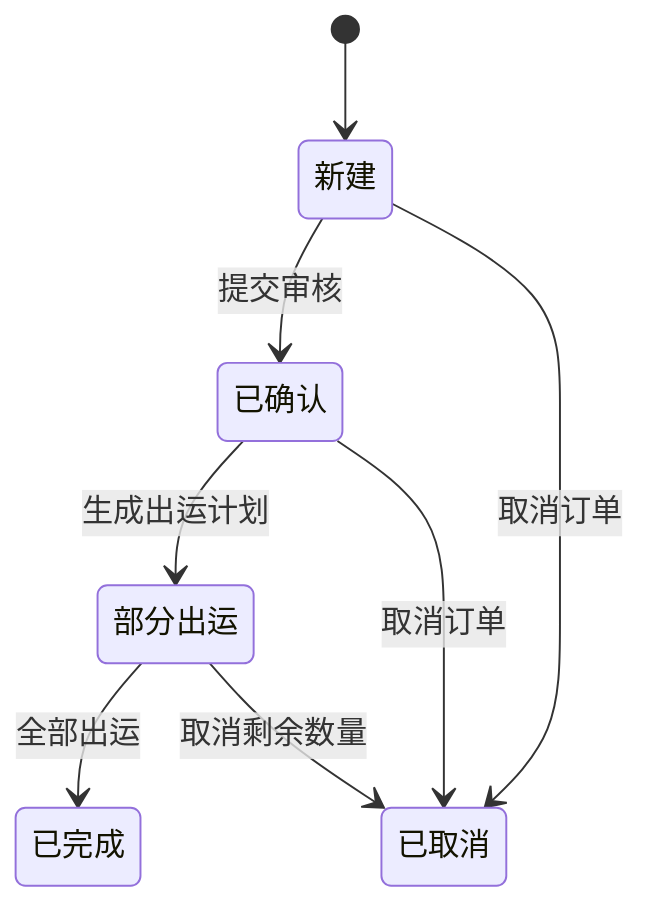
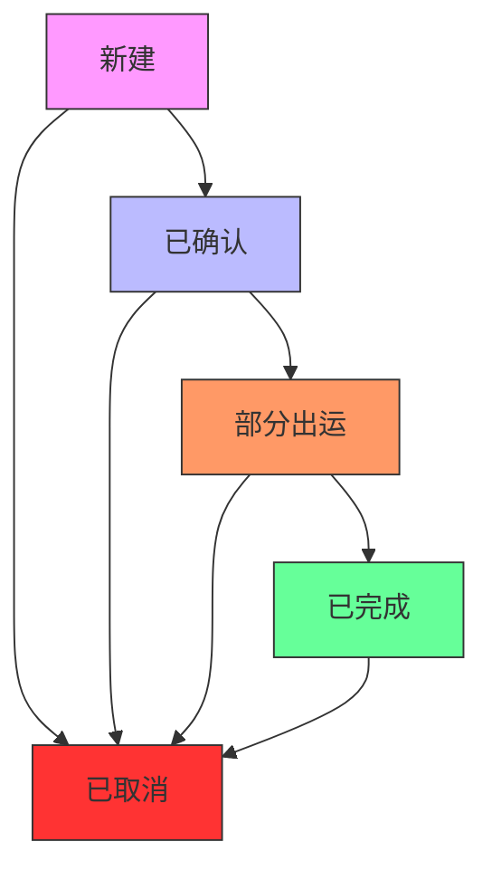
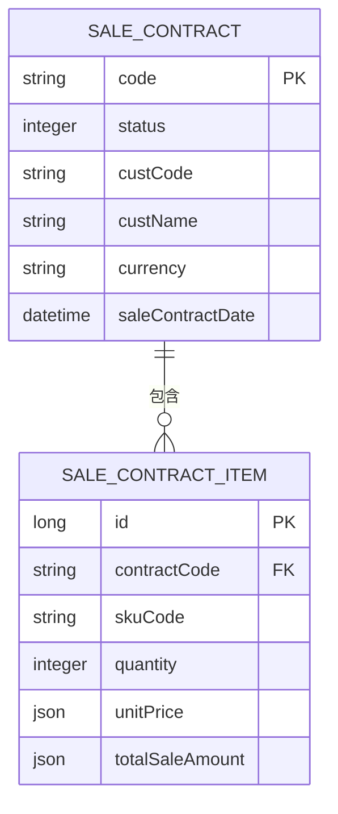
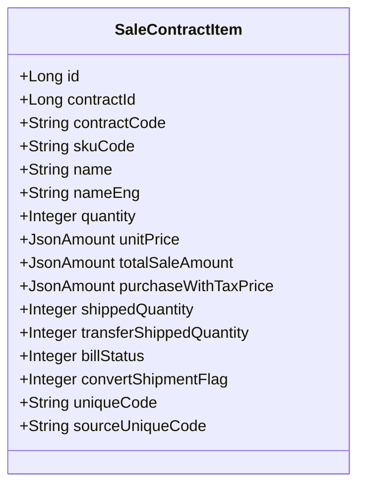
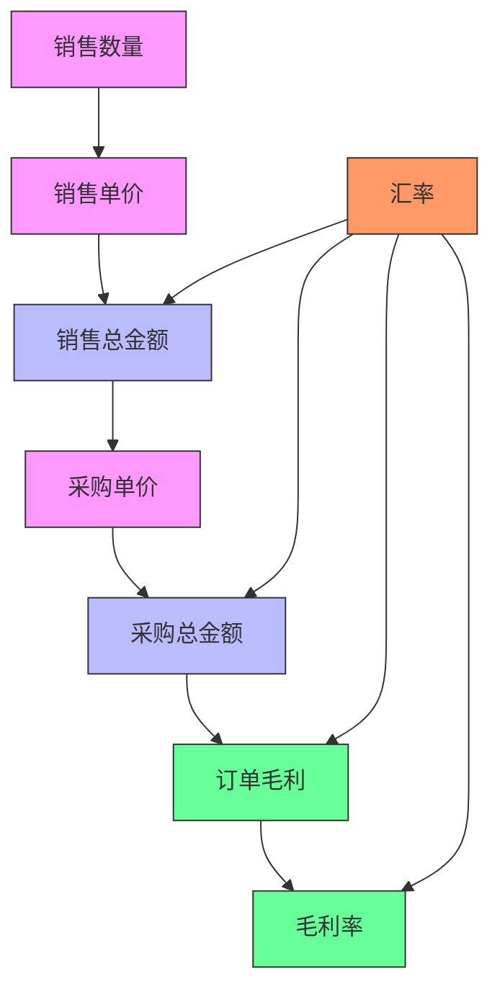
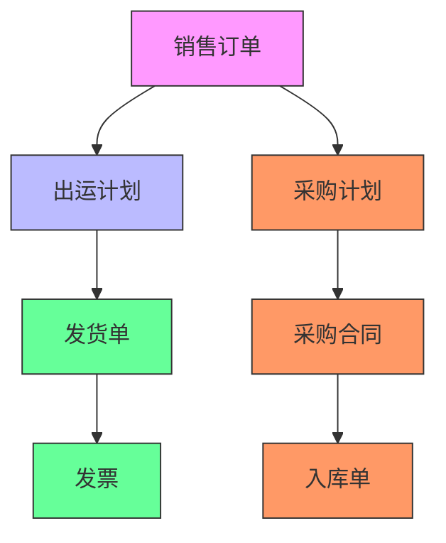
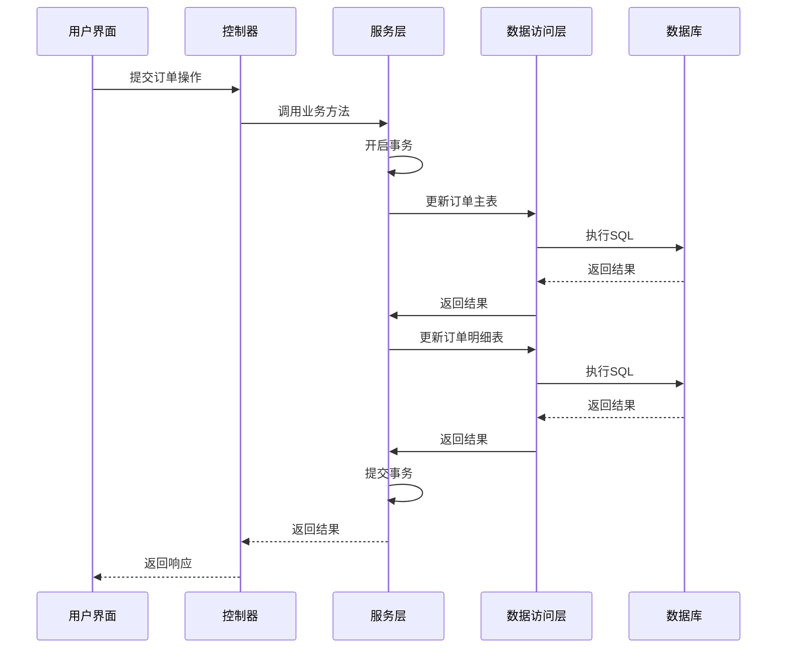

# 销售订单模型

<cite>
**本文档引用文件**   
- [SaleContractApi.java](file://eplus-module-sms/eplus-module-sms-api/src/main/java/com/syj/eplus/module/sms/api/SaleContractApi.java)
- [SaleContractApiImpl.java](file://eplus-module-sms/eplus-module-sms-biz/src/main/java/com/syj/eplus/module/sms/api/SaleContractApiImpl.java)
- [SaleContractDO.java](file://eplus-module-sms/eplus-module-sms-biz/src/main/java/com/syj/eplus/module/sms/dal/dataobject/salecontract/SaleContractDO.java)
- [SaleContractItem.java](file://eplus-module-sms/eplus-module-sms-biz/src/main/java/com/syj/eplus/module/sms/dal/dataobject/salecontractitem/SaleContractItem.java)
- [SaleContractService.java](file://eplus-module-sms/eplus-module-sms-biz/src/main/java/com/syj/eplus/module/sms/service/salecontract/SaleContractService.java)
- [SaleContractServiceImpl.java](file://eplus-module-sms/eplus-module-sms-biz/src/main/java/com/syj/eplus/module/sms/service/salecontract/SaleContractServiceImpl.java)
- [SaleContractStatusEnum.java](file://eplus-framework/eplus-common/src/main/java/com/syj/eplus/framework/common/enums/SaleContractStatusEnum.java)
- [SaleContractBillSimpleDTO.java](file://eplus-module-sms/eplus-module-sms-api/src/main/java/com/syj/eplus/module/sms/api/dto/SaleContractBillSimpleDTO.java)
</cite>

## 目录
1. [引言](#引言)
2. [销售订单生命周期管理](#销售订单生命周期管理)
3. [订单状态转换规则](#订单状态转换规则)
4. [订单与销售合同关联关系](#订单与销售合同关联关系)
5. [订单行项目结构](#订单行项目结构)
6. [数量与金额计算逻辑](#数量与金额计算逻辑)
7. [下游单据数据关联图](#下游单据数据关联图)
8. [数据库事务处理说明](#数据库事务处理说明)
9. [结论](#结论)

## 引言
销售订单模型是企业销售业务的核心组成部分，负责管理从订单创建到完成的整个生命周期。本模型通过与销售合同、出运计划、发货单、发票等下游单据的紧密集成，实现了销售业务的全流程管理。系统采用状态机模式管理订单状态转换，确保业务流程的规范性和数据一致性。

**Section sources**
- [SaleContractDO.java](file://eplus-module-sms/eplus-module-sms-biz/src/main/java/com/syj/eplus/module/sms/dal/dataobject/salecontract/SaleContractDO.java#L33-L666)
- [SaleContractStatusEnum.java](file://eplus-framework/eplus-common/src/main/java/com/syj/eplus/framework/common/enums/SaleContractStatusEnum.java#L13-L28)

## 销售订单生命周期管理
销售订单的生命周期从创建开始，经过确认、采购、出运等阶段，最终达到完成或取消状态。系统通过状态字段（status）跟踪订单的当前阶段，并通过业务方法控制状态转换。订单创建时处于"新建"状态，经过审核流程后进入"已确认"状态，随后根据业务进展更新为"部分出运"、"已完成"或"已取消"状态。

**Diagram sources **
- [SaleContractStatusEnum.java](file://eplus-framework/eplus-common/src/main/java/com/syj/eplus/framework/common/enums/SaleContractStatusEnum.java#L13-L28)
- [SaleContractDO.java](file://eplus-module-sms/eplus-module-sms-biz/src/main/java/com/syj/eplus/module/sms/dal/dataobject/salecontract/SaleContractDO.java#L431)

## 订单状态转换规则
订单状态转换遵循严格的业务规则，确保数据一致性和流程合规性。状态转换通过服务层方法实现，每个转换操作都包含相应的业务逻辑验证和数据更新。系统定义了五种主要状态：新建、已确认、部分出运、已完成、已取消，每种状态都有明确的进入和退出条件。

**Diagram sources **
- [SaleContractStatusEnum.java](file://eplus-framework/eplus-common/src/main/java/com/syj/eplus/framework/common/enums/SaleContractStatusEnum.java#L13-L28)
- [SaleContractService.java](file://eplus-module-sms/eplus-module-sms-biz/src/main/java/com/syj/eplus/module/sms/service/salecontract/SaleContractService.java#L159-L160)

## 订单与销售合同关联关系
销售订单与销售合同通过合同编号（code）和主键（id）建立关联关系。每个销售订单对应一个销售合同，合同信息包含客户、产品、价格、交期等关键业务数据。系统通过外键约束确保数据完整性，订单行项目与合同明细保持同步更新。

**Diagram sources **
- [SaleContractDO.java](file://eplus-module-sms/eplus-module-sms-biz/src/main/java/com/syj/eplus/module/sms/dal/dataobject/salecontract/SaleContractDO.java#L43-L44)
- [SaleContractItem.java](file://eplus-module-sms/eplus-module-sms-biz/src/main/java/com/syj/eplus/module/sms/dal/dataobject/salecontractitem/SaleContractItem.java#L62-L63)

## 订单行项目结构
订单行项目包含产品信息、数量、价格、状态等关键数据。每个行项目通过合同ID与主订单关联，支持多级包装、分箱管理、赠品处理等复杂业务场景。系统采用JSON字段存储复杂数据结构，如含税价格、重量、体积等，确保数据的灵活性和扩展性。

**Diagram sources **
- [SaleContractItem.java](file://eplus-module-sms/eplus-module-sms-biz/src/main/java/com/syj/eplus/module/sms/dal/dataobject/salecontractitem/SaleContractItem.java#L44-L795)

## 数量与金额计算逻辑
系统采用精确的计算逻辑处理订单数量和金额，确保财务数据的准确性。数量计算包括销售数量、已出运数量、待出运数量等，金额计算涵盖销售金额、采购金额、毛利、毛利率等关键指标。所有金额字段使用JSON格式存储，支持多币种和汇率转换。

**Diagram sources **
- [SaleContractItem.java](file://eplus-module-sms/eplus-module-sms-biz/src/main/java/com/syj/eplus/module/sms/dal/dataobject/salecontractitem/SaleContractItem.java#L111-L124)
- [SaleContractDO.java](file://eplus-module-sms/eplus-module-sms-biz/src/main/java/com/syj/eplus/module/sms/dal/dataobject/salecontract/SaleContractDO.java#L375-L382)

## 下游单据数据关联图
销售订单与出运计划、发货单、发票等下游单据通过唯一标识建立数据关联。系统采用链式结构管理订单流，确保业务数据的可追溯性。每个下游单据都记录来源订单信息，支持反向查询和数据同步。

**Diagram sources **
- [SaleContractApi.java](file://eplus-module-sms/eplus-module-sms-api/src/main/java/com/syj/eplus/module/sms/api/SaleContractApi.java#L44-L45)
- [SaleContractApiImpl.java](file://eplus-module-sms/eplus-module-sms-biz/src/main/java/com/syj/eplus/module/sms/api/SaleContractApiImpl.java#L139-L140)

## 数据库事务处理说明
销售订单的关键操作采用数据库事务管理，确保数据一致性和完整性。创建、修改、取消等操作在事务上下文中执行，包含多个数据表的更新。系统使用Spring事务管理器，通过@Transaction注解控制事务边界，支持回滚机制处理异常情况。

**Diagram sources **
- [SaleContractServiceImpl.java](file://eplus-module-sms/eplus-module-sms-biz/src/main/java/com/syj/eplus/module/sms/service/salecontract/SaleContractServiceImpl.java#L184)
- [SaleContractService.java](file://eplus-module-sms/eplus-module-sms-biz/src/main/java/com/syj/eplus/module/sms/service/salecontract/SaleContractService.java#L40-L47)

## 结论
销售订单模型通过完善的状态管理、精确的计算逻辑和严格的事务控制，实现了销售业务的全流程数字化管理。系统设计考虑了业务扩展性和数据一致性，为企业的销售运营提供了可靠的技术支持。通过与上下游系统的紧密集成，形成了完整的业务闭环，提升了整体运营效率。