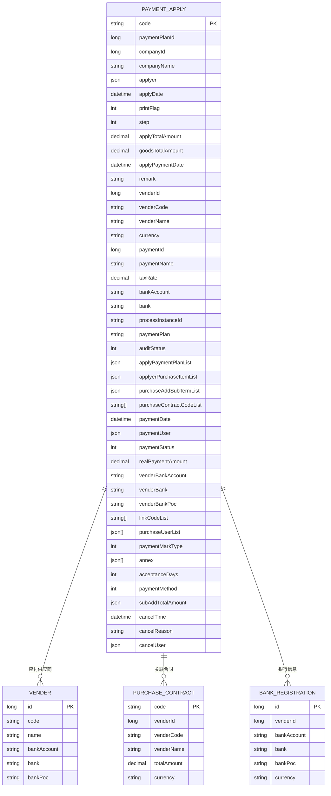
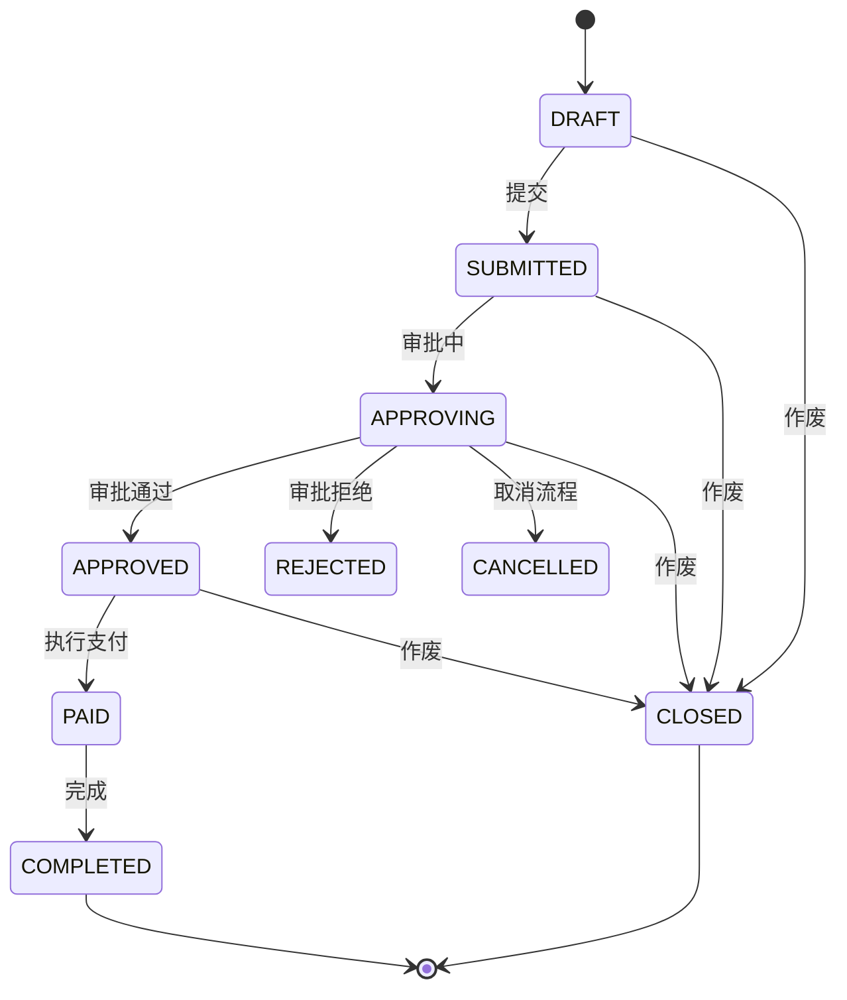
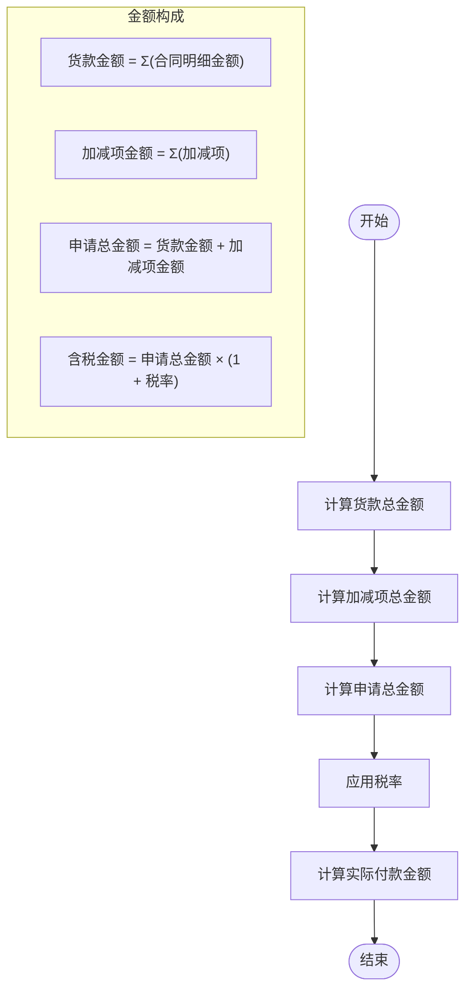
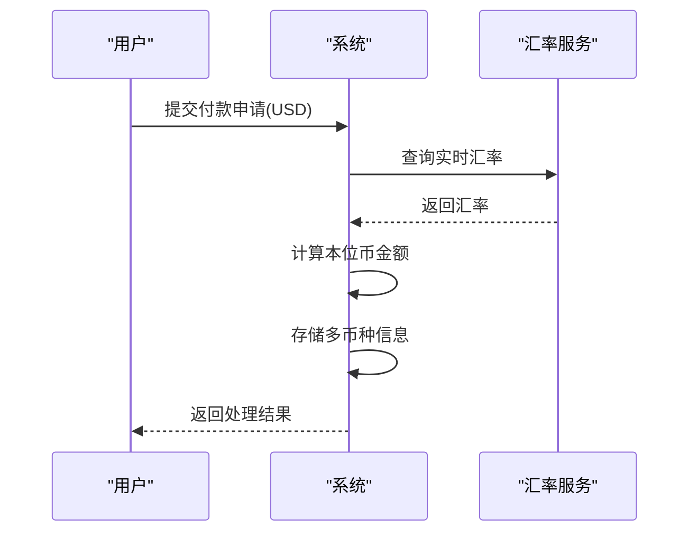
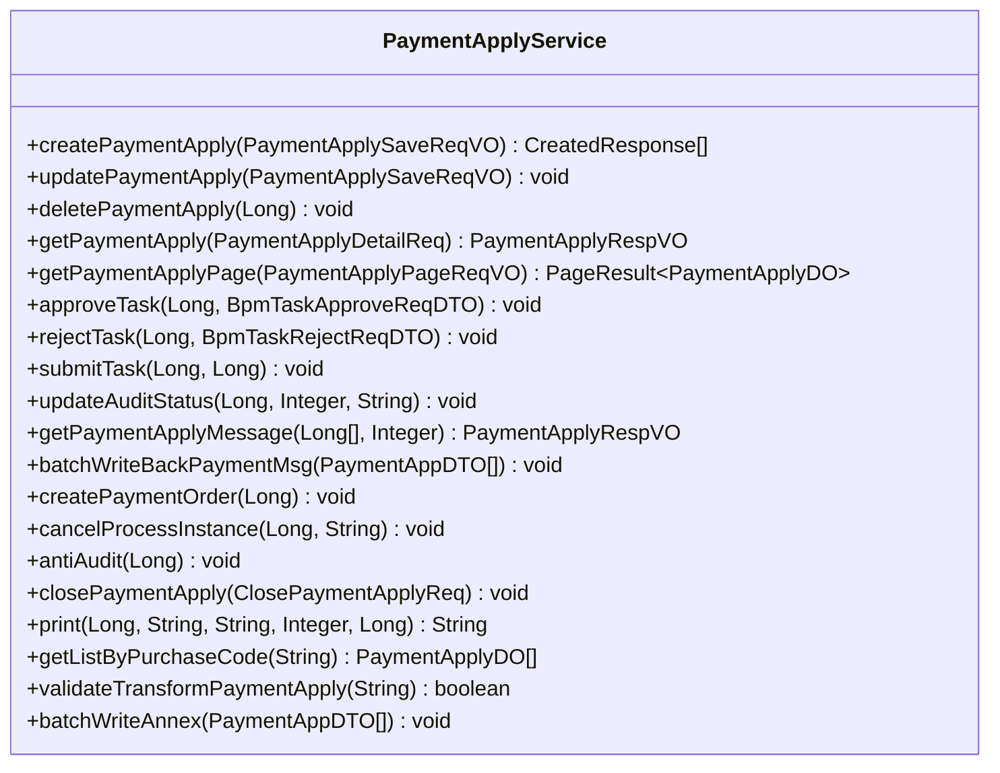
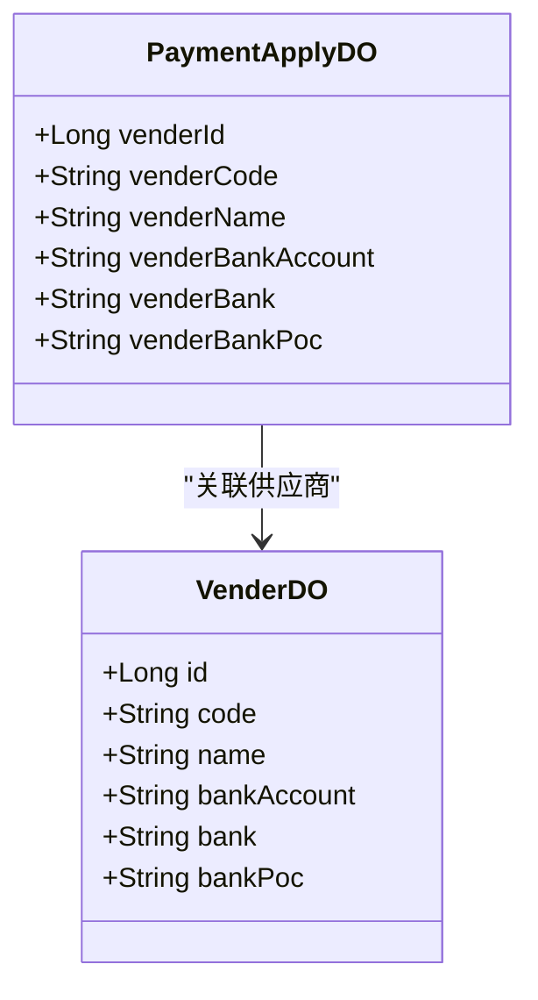

# 付款申请

<cite>
**本文档引用的文件**  
- [PaymentApplyController.java](file://eplus-module-scm/eplus-module-scm-biz/src/main/java/com/syj/eplus/module/scm/controller/admin/paymentapply/PaymentApplyController.java)
- [PaymentApplyService.java](file://eplus-module-scm/eplus-module-scm-biz/src/main/java/com/syj/eplus/module/scm/service/paymentapply/PaymentApplyService.java)
- [PaymentApplyDO.java](file://eplus-module-scm/eplus-module-scm-biz/src/main/java/com/syj/eplus/module/scm/dal/dataobject/paymentapply/PaymentApplyDO.java)
- [PaymentApplyApi.java](file://eplus-module-scm/eplus-module-scm-api/src/main/java/com/syj/eplus/module/scm/api/paymentapply/PaymentApplyApi.java)
- [PaymentApplyDTO.java](file://eplus-module-scm/eplus-module-scm-api/src/main/java/com/syj/eplus/module/scm/api/paymentapply/dto/PaymentApplyDTO.java)
- [PaymentApplyMapper.xml](file://eplus-module-scm/eplus-module-scm-biz/src/main/resources/mapper/paymentapply/PaymentApplyMapper.xml)
</cite>

## 目录
1. [简介](#简介)
2. [业务流程](#业务流程)
3. [数据模型](#数据模型)
4. [核心实现逻辑](#核心实现逻辑)
5. [状态流转](#状态流转)
6. [金额计算与付款计划](#金额计算与付款计划)
7. [多币种处理](#多币种处理)
8. [MyBatis Mapper 配置](#mybatis-mapper-配置)
9. [核心 Service 方法](#核心-service-方法)
10. [与供应商的关联关系](#与供应商的关联关系)

## 简介
付款申请功能是供应链管理系统中的核心财务模块，用于管理采购过程中的付款流程。该功能支持从创建付款申请、审批流程、支付执行到作废处理的完整生命周期管理。系统通过与供应商、合同、银行信息等模块的集成，实现了付款流程的自动化和规范化。

## 业务流程
付款申请的业务流程主要包括以下几个环节：
1. **创建申请**：用户根据采购合同和付款计划创建付款申请，填写付款金额、币种、付款方式等信息。
2. **提交审批**：申请人提交付款申请，启动审批流程。
3. **审批处理**：审批人根据权限对付款申请进行审核，支持通过、拒绝、反审核等操作。
4. **支付执行**：审批通过后，财务人员执行支付操作，记录实际付款信息。
5. **作废处理**：在特定条件下，可对未完成的付款申请进行作废处理。

该流程通过与BPM（业务流程管理）系统集成，实现了灵活的审批流配置和管理。

**Section sources**
- [PaymentApplyController.java](file://eplus-module-scm/eplus-module-scm-biz/src/main/java/com/syj/eplus/module/scm/controller/admin/paymentapply/PaymentApplyController.java#L45-L189)
- [PaymentApplyService.java](file://eplus-module-scm/eplus-module-scm-biz/src/main/java/com/syj/eplus/module/scm/service/paymentapply/PaymentApplyService.java#L28-L168)

## 数据模型
付款申请的数据模型主要包括付款申请主表、供应商表、合同表和银行信息表等核心实体。



**Diagram sources**
- [PaymentApplyDO.java](file://eplus-module-scm/eplus-module-scm-biz/src/main/java/com/syj/eplus/module/scm/dal/dataobject/paymentapply/PaymentApplyDO.java#L35-L254)
- [PaymentApplyDTO.java](file://eplus-module-scm/eplus-module-scm-api/src/main/java/com/syj/eplus/module/scm/api/paymentapply/dto/PaymentApplyDTO.java#L21-L147)

## 核心实现逻辑
付款申请的核心实现逻辑主要由Controller、Service和DAO三层架构组成，遵循MVC设计模式。

### 控制器层
`PaymentApplyController`负责处理HTTP请求，提供RESTful API接口，包括创建、更新、删除、查询付款申请等操作。控制器通过权限注解`@PreAuthorize`实现细粒度的权限控制。

### 服务层
`PaymentApplyService`接口定义了付款申请的核心业务逻辑，包括：
- 创建和更新付款申请
- 审批流程处理
- 支付执行
- 作废处理
- 打印功能

### 数据访问层
数据访问通过MyBatis实现，`PaymentApplyDO`实体类映射数据库表`scm_payment_apply`，使用Lombok注解简化代码。

**Section sources**
- [PaymentApplyController.java](file://eplus-module-scm/eplus-module-scm-biz/src/main/java/com/syj/eplus/module/scm/controller/admin/paymentapply/PaymentApplyController.java#L36-L189)
- [PaymentApplyService.java](file://eplus-module-scm/eplus-module-scm-biz/src/main/java/com/syj/eplus/module/scm/service/paymentapply/PaymentApplyService.java#L20-L168)
- [PaymentApplyDO.java](file://eplus-module-scm/eplus-module-scm-biz/src/main/java/com/syj/eplus/module/scm/dal/dataobject/paymentapply/PaymentApplyDO.java#L35-L254)

## 状态流转
付款申请的状态流转是其生命周期管理的核心，主要包括以下状态：



状态流转通过`auditStatus`字段管理，具体值包括：
- 0: 草稿
- 1: 审批中
- 2: 审批通过
- 3: 审批拒绝
- 4: 已作废

**Diagram sources**
- [PaymentApplyDO.java](file://eplus-module-scm/eplus-module-scm-biz/src/main/java/com/syj/eplus/module/scm/dal/dataobject/paymentapply/PaymentApplyDO.java#L138)
- [PaymentApplyService.java](file://eplus-module-scm/eplus-module-scm-biz/src/main/java/com/syj/eplus/module/scm/service/paymentapply/PaymentApplyService.java#L97)

## 金额计算与付款计划
付款申请的金额计算逻辑涉及多个维度的金额汇总：



付款计划配置支持：
- 分期付款
- 按比例付款
- 按里程碑付款
- 自定义付款计划

**Section sources**
- [PaymentApplyDO.java](file://eplus-module-scm/eplus-module-scm-biz/src/main/java/com/syj/eplus/module/scm/dal/dataobject/paymentapply/PaymentApplyDO.java#L78-L82)
- [PaymentApplyDO.java](file://eplus-module-scm/eplus-module-scm-biz/src/main/java/com/syj/eplus/module/scm/dal/dataobject/paymentapply/PaymentApplyDO.java#L236-L238)

## 多币种处理
系统支持多币种处理，主要通过以下机制实现：

1. **币种字段**：`currency`字段存储交易币种，如CNY、USD、EUR等。
2. **汇率管理**：系统集成汇率服务，支持实时汇率转换。
3. **金额存储**：使用`JsonAmount`类型存储金额，包含金额值和币种信息。
4. **结算处理**：支持不同币种的结算和对账。

多币种处理流程：


**Section sources**
- [PaymentApplyDO.java](file://eplus-module-scm/eplus-module-scm-biz/src/main/java/com/syj/eplus/module/scm/dal/dataobject/paymentapply/PaymentApplyDO.java#L106)
- [PaymentApplyDO.java](file://eplus-module-scm/eplus-module-scm-biz/src/main/java/com/syj/eplus/module/scm/dal/dataobject/paymentapply/PaymentApplyDO.java#L236-L238)

## MyBatis Mapper 配置
MyBatis Mapper配置采用注解和XML结合的方式，主要配置如下：

```xml
<?xml version="1.0" encoding="UTF-8"?>
<!DOCTYPE mapper PUBLIC "-//mybatis.org//DTD Mapper 3.0//EN" "http://mybatis.org/dtd/mybatis-3-mapper.dtd">
<mapper namespace="com.syj.eplus.module.scm.dal.mysql.paymentapply.PaymentApplyMapper">
    <!--
        一般情况下，尽可能使用 Mapper 进行 CRUD 增删改查即可。
        无法满足的场景，例如说多表关联查询，才使用 XML 编写 SQL。
        代码生成器暂时只生成 Mapper XML 文件本身，更多推荐 MybatisX 快速开发插件来生成查询。
        文档可见：https://www.iocoder.cn/MyBatis/x-plugins/
     -->
</mapper>
```

特殊字段处理通过自定义TypeHandler实现：
- `JsonApplyPaymentPlanHandler`：处理付款计划JSON数据
- `JsonApplyerPurchaseContractItemListHandler`：处理采购明细JSON数据
- `JsonPurchaseSubAddTermHandler`：处理加减项JSON数据
- `JsonUserDeptTypeHandler`：处理用户部门JSON数据
- `StringListTypeHandler`：处理字符串列表

**Diagram sources**
- [PaymentApplyMapper.xml](file://eplus-module-scm/eplus-module-scm-biz/src/main/resources/mapper/paymentapply/PaymentApplyMapper.xml#L1-L12)
- [PaymentApplyDO.java](file://eplus-module-scm/eplus-module-scm-biz/src/main/java/com/syj/eplus/module/scm/dal/dataobject/paymentapply/PaymentApplyDO.java#L61-L62)

## 核心 Service 方法
核心Service方法实现了付款申请的主要业务逻辑：



关键方法说明：
- `createPaymentApply`：创建付款申请，返回创建结果
- `approveTask`：审批通过，更新审批状态
- `rejectTask`：审批拒绝，退回申请
- `submitTask`：提交审批流程
- `closePaymentApply`：作废付款申请

**Diagram sources**
- [PaymentApplyService.java](file://eplus-module-scm/eplus-module-scm-biz/src/main/java/com/syj/eplus/module/scm/service/paymentapply/PaymentApplyService.java#L20-L168)

## 与供应商的关联关系
付款申请与供应商的关联关系通过以下字段实现：



关联关系特点：
1. **直接关联**：通过`venderId`直接关联供应商主数据
2. **信息冗余**：在付款申请中冗余存储供应商关键信息，保证数据一致性
3. **银行信息**：支持从供应商银行注册信息中自动获取银行账号和开户行
4. **变更处理**：供应商信息变更时，已创建的付款申请保持原有信息不变

**Section sources**
- [PaymentApplyDO.java](file://eplus-module-scm/eplus-module-scm-biz/src/main/java/com/syj/eplus/module/scm/dal/dataobject/paymentapply/PaymentApplyDO.java#L94-L103)
- [PaymentApplyDO.java](file://eplus-module-scm/eplus-module-scm-biz/src/main/java/com/syj/eplus/module/scm/dal/dataobject/paymentapply/PaymentApplyDO.java#L188-L198)