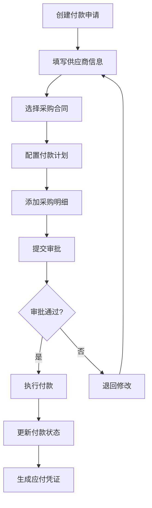

# 应付管理

<cite>
**本文档引用文件**  
- [V1_0_0_046__新增供应商付款方式表.sql](file://eplus-flyway/src/main/resources/db/migration/common/V1_0_0_046__新增供应商付款方式表.sql)
- [V1_0_0_073__付款相关表.sql](file://eplus-flyway/src/main/resources/db/migration/common/V1_0_0_073__付款相关表.sql)
- [PaymentApplyDO.java](file://eplus-module-scm/eplus-module-scm-biz/src/main/java/com/syj/eplus/module/scm/dal/dataobject/paymentapply/PaymentApplyDO.java)
- [ApplyPaymentPlan.java](file://eplus-module-scm/eplus-module-scm-biz/src/main/java/com/syj/eplus/module/scm/entity/ApplyPaymentPlan.java)
- [ApplyerPurchaseContractItem.java](file://eplus-module-scm/eplus-module-scm-biz/src/main/java/com/syj/eplus/module/scm/entity/ApplyerPurchaseContractItem.java)
- [VenderPaymentDTO.java](file://eplus-module-scm/eplus-module-scm-api/src/main/java/com/syj/eplus/module/scm/api/vender/dto/VenderPaymentDTO.java)
- [scm_vender_bankaccount.sql](file://eplus-flyway/src/main/resources/db/migration/common/V1_0_0_002__Eplus初始化.sql)
- [PaymentApplyServiceImpl.java](file://eplus-module-scm/eplus-module-scm-biz/src/main/java/com/syj/eplus/module/scm/service/paymentapply/PaymentApplyServiceImpl.java)
- [PaymentApplyMapper.java](file://eplus-module-scm/eplus-module-scm-biz/src/main/java/com/syj/eplus/module/scm/dal/mysql/paymentapply/PaymentApplyMapper.java)
</cite>

## 目录
1. [引言](#引言)
2. [核心数据模型设计](#核心数据模型设计)
3. [付款申请流程数据结构](#付款申请流程数据结构)
4. [应付核销与对账机制](#应付核销与对账机制)
5. [付款计划与预付款管理](#付款计划与预付款管理)
6. [ER图：应付管理数据关系](#er图应付管理数据关系)
7. [SQL建表语句示例](#sql建表语句示例)
8. [MyBatis Mapper配置示例](#mybatis-mapper配置示例)
9. [最佳实践与设计建议](#最佳实践与设计建议)

## 引言

应付管理是企业财务管理中的核心模块，负责处理与供应商之间的付款事务。本系统通过结构化的数据模型实现了从付款申请、供应商付款处理到应付核销的完整业务流程。系统以采购合同为基础，结合付款计划、加减项和采购明细，构建了灵活且可追溯的应付管理体系。通过流程引擎驱动审核流程，确保每一笔付款都经过严格的审批控制。同时，系统支持多币种、多税率和多种付款方式，满足复杂国际贸易场景下的财务管理需求。

## 核心数据模型设计

应付管理模块的核心实体包括付款申请、供应商付款信息、应付单据和银行账户信息。这些实体通过主外键关系和JSON字段实现灵活的数据结构设计。

### 付款申请主表 (scm_payment_apply)

该表存储付款申请的核心信息，是应付管理的中心实体。

**关键字段说明：**
- `id`: 主键，自增标识
- `code`: 付款申请编号，唯一标识
- `vender_id`, `vender_code`, `vender_name`: 应付供应商信息
- `currency`: 应付币种，支持多币种处理
- `apply_total_amount`: 申请总金额
- `goods_total_amount`: 货款总金额
- `payment_plan`: JSON字段存储流程实例状态
- `apply_payment_plan_list`: JSON字段存储付款计划信息
- `applyer_purchase_item_list`: JSON字段存储采购明细
- `add_sub_term_list`: JSON字段存储加减项
- `audit_status`: 审核状态，控制流程进度

### 供应商付款方式表 (scm_vender_payment)

该表存储供应商的付款方式配置。

**关键字段说明：**
- `id`: 主键
- `payment_id`: 付款方式编号
- `vender_id`: 供应商ID
- `default_flag`: 是否为默认付款方式

### 付款申请子表 (scm_payment_apply_item)

该表存储付款申请的明细信息。

**关键字段说明：**
- `purchase_contract_item_id`: 关联采购合同明细
- `paid_amount`: 已付金额
- `applied_amount`: 已申请金额
- `apply_amount`: 本次请款金额
- `invoice_status`: 开票状态
- `step`: 付款步骤

**Section sources**
- [V1_0_0_046__新增供应商付款方式表.sql](file://eplus-flyway/src/main/resources/db/migration/common/V1_0_0_046__新增供应商付款方式表.sql#L18-L80)
- [V1_0_0_073__付款相关表.sql](file://eplus-flyway/src/main/resources/db/migration/common/V1_0_0_073__付款相关表.sql#L39-L139)

## 付款申请流程数据结构

付款申请流程涉及多个数据实体的协同工作，从申请创建到最终付款完成，数据在各个系统组件间流转。

### 申请创建阶段

当用户创建付款申请时，系统收集以下信息：
1. 基础信息：申请日期、申请类型、备注
2. 供应商信息：供应商ID、编码、名称
3. 财务信息：币种、付款方式、税率
4. 银行信息：银行账号、开户行
5. 业务关联：采购合同、采购明细
6. 付款计划：分阶段付款安排

这些信息被组织成结构化数据，其中采购明细、付款计划和加减项使用JSON格式存储，提供了极大的灵活性。

### 流程审批阶段

付款申请提交后，进入审批流程：
1. 系统生成流程实例，记录在`process_instance_id`字段
2. 审核状态在`audit_status`字段中更新
3. 审批过程中可修改付款计划和金额
4. 所有变更记录在JSON字段中，保持数据完整性

### 付款执行阶段

审批通过后，进入付款执行：
1. 系统根据供应商信息获取银行账户
2. 生成付款指令，包含金额、币种、付款方式
3. 更新付款状态和实际付款金额
4. 记录付款日期和付款人信息



**Diagram sources**
- [PaymentApplyDO.java](file://eplus-module-scm/eplus-module-scm-biz/src/main/java/com/syj/eplus/module/scm/dal/dataobject/paymentapply/PaymentApplyDO.java#L35-L254)
- [PaymentApplyServiceImpl.java](file://eplus-module-scm/eplus-module-scm-biz/src/main/java/com/syj/eplus/module/scm/service/paymentapply/PaymentApplyServiceImpl.java#L99-L155)

## 应付核销与对账机制

系统的应付核销机制确保了财务数据的准确性和一致性。

### 核销数据结构

核销过程涉及以下关键字段：
- `applied_amount`: 已申请金额，记录在付款计划中
- `paid_amount`: 已付金额，记录在付款申请子表
- `received_amount`: 实付金额，记录在付款计划中
- `invoice_status`: 开票状态，控制付款进度

### 对账流程

系统通过以下方式实现自动对账：
1. 每日定时任务扫描所有未完成核销的付款申请
2. 比对申请金额、实际付款金额和发票金额
3. 生成对账差异报告
4. 标记异常交易供人工核查

对账机制还支持多维度查询，包括按供应商、按时间段、按币种等，便于财务人员进行账务核对。

**Section sources**
- [V1_0_0_073__付款相关表.sql](file://eplus-flyway/src/main/resources/db/migration/common/V1_0_0_073__付款相关表.sql#L114-L139)
- [ApplyPaymentPlan.java](file://eplus-module-scm/eplus-module-scm-biz/src/main/java/com/syj/eplus/module/scm/entity/ApplyPaymentPlan.java#L1-L88)

## 付款计划与预付款管理

### 付款计划设计

付款计划是应付管理的核心功能，支持分阶段付款。

**付款计划字段：**
- `step`: 付款步骤，标识第几期付款
- `payment_ratio`: 付款比例，支持按比例付款
- `expected_receipt_date`: 预计付款日
- `control_purchase_flag`: 是否控制采购，防止超额付款
- `exe_status`: 执行状态，跟踪计划执行情况

系统支持两种付款计划模式：
1. **固定计划**：基于合同约定的固定付款时间表
2. **动态计划**：根据实际业务情况调整的付款安排

### 预付款管理

预付款管理通过特殊标记实现：
- 在付款计划中设置`step=0`标识预付款
- 预付款比例单独配置，通常为合同总额的一定比例
- 预付款状态独立跟踪，确保后续付款时扣除已付预付款

预付款还支持部分退款功能，当合同变更时可按比例退还预付款。

```mermaid
classDiagram
class ApplyPaymentPlan {
+Long id
+String contractCode
+Integer step
+Integer paymentMethod
+Integer dateType
+LocalDateTime startDate
+Integer days
+LocalDateTime expectedReceiptDate
+BigDecimal paymentRatio
+JsonAmount receivableAmount
+JsonAmount receivedAmount
+JsonAmount appliedAmount
+Integer controlPurchaseFlag
+Integer exeStatus
}
class PaymentApplyDO {
+Long id
+String code
+Long paymentPlanId
+Long companyId
+String companyName
+UserDept applyer
+LocalDateTime applyDate
+Integer printFlag
+Integer step
+BigDecimal applyTotalAmount
+BigDecimal goodsTotalAmount
+LocalDateTime applyPaymentDate
+String remark
+Long venderId
+String venderCode
+String venderName
+String currency
+Long paymentId
+String paymentName
+BigDecimal taxRate
+String bankAccount
+String bank
+String processInstanceId
+String paymentPlan
+Integer auditStatus
+ApplyPaymentPlan[] applyPaymentPlanList
+ApplyerPurchaseContractItem[] applyerPurchaseItemList
+PurchaseAddSubTerm[] purchaseAddSubTermList
}
class ApplyerPurchaseContractItem {
+Long id
+Integer ver
+Integer sortNum
+Long skuId
+String skuCode
+Long custId
+String custCode
+String cskuCode
+Integer quantity
+Long venderId
+String venderCode
+LocalDateTime planArriveDate
+Integer checkStatus
+Integer checkedQuantity
+Integer receiveStatus
+Integer receivedQuantity
+Integer exchangeQuantity
+Integer returnQuantity
+Long purchaseContractId
+String purchaseContractCode
+Integer qtyPerInnerbox
+Integer qtyPerOuterbox
+BigDecimal packageLength
+Integer syncQuoteFlag
+BigDecimal packageWidth
+BigDecimal packageHeight
+Integer packageUnit
+JsonWeight singleGrossweight
+JsonAmount packagingPrice
+JsonAmount shippingPrice
+JsonAmount unitPrice
+JsonAmount totalPrice
+JsonAmount withTaxPrice
+BigDecimal taxRate
+Integer purchaseType
+Long purchaseUserId
+String purchaseUserName
+Long purchaseUserDeptId
+String purchaseUserDeptName
+String venderProdCode
+LocalDateTime quoteDate
+Integer freightFlag
+Integer packageFlag
+Long[] packageType
+String currency
+Integer faxFlag
+Integer moq
+Integer boxCount
+Integer warehousingType
+String wmsIds
+String wmsNames
+Integer freeFlag
+Integer delivery
+String purchaseUrl
+String remark
+Integer auxiliarySkuFlag
+Integer auxiliarySkuType
+String specRemark
+SimpleFile[] annex
+String auxiliarySaleContractCode
+String auxiliaryPurchaseContractCode
+Long auxiliarySkuId
+String auxiliarySkuCode
+String auxiliaryCskuCode
+JsonAmount checkCost
+String skuUnit
+Integer ownBrandFlag
+Integer custProFlag
+JsonAmount packageCost
+Long saleContractItemId
+Integer invoiceStatus
+Integer invoicedQuantity
+String invoicedCurrency
+BigDecimal invoicedAmount
+BigDecimal paymentAmount
+Integer changeFlag
+BigDecimal appliedAmount
+BigDecimal applyAmount
+BigDecimal realApplyAmount
+String saleContractCode
+String skuName
+Integer handleFlag
+LocalDateTime inspectionTime
+JsonSpecificationEntity[] specificationList
+Integer splitBoxFlag
+LocalDateTime estDepartureTime
+Integer billStatus
}
PaymentApplyDO --> ApplyPaymentPlan : "包含"
PaymentApplyDO --> ApplyerPurchaseContractItem : "包含"
```



**Diagram sources**
- [ApplyPaymentPlan.java](file://eplus-module-scm/eplus-module-scm-biz/src/main/java/com/syj/eplus/module/scm/entity/ApplyPaymentPlan.java#L1-L88)
- [ApplyerPurchaseContractItem.java](file://eplus-module-scm/eplus-module-scm-biz/src/main/java/com/syj/eplus/module/scm/entity/ApplyerPurchaseContractItem.java#L1-L315)
- [PaymentApplyDO.java](file://eplus-module-scm/eplus-module-scm-biz/src/main/java/com/syj/eplus/module/scm/dal/dataobject/paymentapply/PaymentApplyDO.java#L35-L254)

## ER图：应付管理数据关系

```mermaid
erDiagram
scm_payment_apply ||--o{ scm_payment_apply_item : "1:N"
scm_payment_apply ||--|| scm_vender_bankaccount : "关联"
scm_payment_apply ||--|| scm_vender_payment : "使用"
scm_payment_apply }|--|| scm_payment_plan : "对应"
scm_payment_apply_item }|--|| purchase_contract_item : "关联"
scm_payment_apply {
bigint id PK
varchar(20) code UK
bigint payment_plan_id FK
bigint company_id
varchar(100) company_name
json applyer
datetime apply_date
tinyint print_flag
tinyint step
decimal(19,6) apply_total_amount
decimal(19,6) goods_total_amount
datetime apply_payment_date
varchar(500) remark
bigint vender_id FK
varchar(20) vender_code
varchar(100) vender_name
varchar(10) currency
bigint payment_id FK
varchar(100) payment_name
decimal(19,6) tax_rate
varchar(100) bank_account
varchar(100) bank
varchar(64) process_instance_id
json payment_plan
json apply_payment_plan_list
json applyer_purchase_item_list
json add_sub_term_list
int creator
datetime create_time
int updater
datetime update_time
tinyint deleted
tinyint audit_status
}
scm_payment_apply_item {
bigint id PK
bigint purchase_contract_item_id FK
decimal(19,6) paid_amount
decimal(19,6) applied_amount
bigint apply_amount
tinyint invoice_status
tinyint step
int creator
datetime create_time
int updater
datetime update_time
tinyint deleted
}
scm_vender_payment {
bigint id PK
bigint payment_id
bigint vender_id FK
bigint default_flag
int creator
datetime create_time
int updater
datetime update_time
tinyint deleted
}
scm_payment_plan {
bigint id PK
varchar(20) contract_code
tinyint step
tinyint payment_method
tinyint date_type
datetime start_date
int days
datetime expected_receipt_date
decimal(19,6) payment_ratio
json receivable_amount
json received_amount
json applied_amount
tinyint control_purchase_flag
tinyint exe_status
int creator
datetime create_time
int updater
datetime update_time
tinyint deleted
}
scm_vender_bankaccount {
bigint id PK
int ver
bigint vender_id FK
int vender_ver
varchar(100) bank
varchar(100) bank_account
varchar(200) bank_address
varchar(100) bank_poc
varchar(100) bank_code
tinyint default_flag
int creator
datetime create_time
int updater
datetime update_time
tinyint deleted
}
```

**Diagram sources**
- [V1_0_0_046__新增供应商付款方式表.sql](file://eplus-flyway/src/main/resources/db/migration/common/V1_0_0_046__新增供应商付款方式表.sql#L18-L80)
- [V1_0_0_073__付款相关表.sql](file://eplus-flyway/src/main/resources/db/migration/common/V1_0_0_073__付款相关表.sql#L39-L139)
- [V1_0_0_002__Eplus初始化.sql](file://eplus-flyway/src/main/resources/db/migration/common/V1_0_0_002__Eplus初始化.sql#L944-L958)

## SQL建表语句示例

### 付款申请主表

```sql
CREATE TABLE `scm_payment_apply` (
    `id` bigint UNSIGNED NOT NULL AUTO_INCREMENT COMMENT '主键',
    `code` varchar(20) NOT NULL DEFAULT '' COMMENT '编号',
    `payment_plan_id` bigint NULL DEFAULT NULL COMMENT '付款计划id',
    `company_id` bigint NULL DEFAULT NULL COMMENT '下单主体主键',
    `company_name` varchar(100) NOT NULL DEFAULT '' COMMENT '下单主体',
    `applyer` json NOT NULL COMMENT '申请人id',
    `apply_date` datetime NULL DEFAULT NULL COMMENT '申请日期',
    `print_flag` tinyint UNSIGNED NOT NULL DEFAULT 0 COMMENT '打印状态',
    `step` tinyint NULL DEFAULT NULL COMMENT '申请类型',
    `apply_total_amount` decimal(19, 6) NOT NULL DEFAULT 0.000000 COMMENT '申请总金额',
    `goods_total_amount` decimal(19, 6) NOT NULL DEFAULT 0.000000 COMMENT '货款总金额',
    `apply_payment_date` datetime NULL DEFAULT NULL COMMENT '申请付款日',
    `remark` varchar(500) NOT NULL DEFAULT '' COMMENT '申请备注',
    `vender_id` bigint NULL DEFAULT NULL COMMENT '应付供应商主键',
    `vender_code` varchar(20) NOT NULL DEFAULT '' COMMENT '应付供应商编码',
    `vender_name` varchar(100) NOT NULL DEFAULT '' COMMENT '应付供应商名称',
    `currency` varchar(10) NOT NULL DEFAULT '' COMMENT '应付币种',
    `payment_id` bigint NULL DEFAULT NULL COMMENT '付款方式id',
    `payment_name` varchar(100) NULL DEFAULT NULL COMMENT '付款方式名称',
    `tax_rate` decimal(19, 6) NULL DEFAULT 0.000000 COMMENT '税率',
    `bank_account` varchar(100) NOT NULL DEFAULT '' COMMENT '银行账号',
    `bank` varchar(100) NOT NULL DEFAULT '' COMMENT '开户行',
    `process_instance_id` varchar(64) NOT NULL DEFAULT '' COMMENT '流程实例的编号',
    `payment_plan` json NULL COMMENT '流程实例状态',
    `apply_payment_plan_list` json NULL COMMENT '付款计划信息',
    `applyer_purchase_item_list` json NULL COMMENT '采购明细',
    `add_sub_term_list` json NULL COMMENT '加减项',
    `creator` int UNSIGNED NULL DEFAULT NULL COMMENT '创建人',
    `create_time` datetime NULL DEFAULT CURRENT_TIMESTAMP COMMENT '创建时间',
    `updater` int UNSIGNED NULL DEFAULT NULL COMMENT '修改人',
    `update_time` datetime NULL DEFAULT NULL ON UPDATE CURRENT_TIMESTAMP COMMENT '修改时间',
    `deleted` tinyint(1) NOT NULL DEFAULT 0 COMMENT '删除  0：有效 1：删除',
    `audit_status` tinyint NOT NULL COMMENT '审核状态',
    PRIMARY KEY (`id`) USING BTREE
) ENGINE = InnoDB
  AUTO_INCREMENT = 2
  CHARACTER SET = utf8mb4
  COLLATE = utf8mb4_general_ci COMMENT = '付款申请主表'
  ROW_FORMAT = DYNAMIC;
```

### 供应商银行账户表

```sql
CREATE TABLE IF NOT EXISTS `scm_vender_bankaccount` (
    `id` bigint UNSIGNED NOT NULL AUTO_INCREMENT COMMENT '主键',
    `ver` int UNSIGNED NOT NULL DEFAULT 0 COMMENT '版本',
    `vender_id` bigint UNSIGNED NOT NULL DEFAULT 0 COMMENT '供应商id',
    `vender_ver` int UNSIGNED NOT NULL DEFAULT 0 COMMENT '供应商版本',
    `bank` varchar(100) CHARACTER SET utf8mb4 COLLATE utf8mb4_general_ci NOT NULL DEFAULT '' COMMENT '银行',
    `bank_account` varchar(100) CHARACTER SET utf8mb4 COLLATE utf8mb4_general_ci NOT NULL DEFAULT '' COMMENT '银行账号',
    `bank_address` varchar(200) CHARACTER SET utf8mb4 COLLATE utf8mb4_general_ci NOT NULL DEFAULT '' COMMENT '开户行地址',
    `bank_poc` varchar(100) CHARACTER SET utf8mb4 COLLATE utf8mb4_general_ci NOT NULL DEFAULT '' COMMENT '开户行联系人',
    `bank_code` varchar(100) CHARACTER SET utf8mb4 COLLATE utf8mb4_general_ci NOT NULL DEFAULT '' COMMENT '银行行号',
    `default_flag` tinyint(1) NOT NULL DEFAULT 0 COMMENT '是否默认账号',
    `creator` int UNSIGNED NULL DEFAULT NULL COMMENT '创建人',
    `create_time` datetime NULL DEFAULT CURRENT_TIMESTAMP COMMENT '创建时间',
    `updater` int UNSIGNED NULL DEFAULT NULL COMMENT '修改人',
    `update_time` datetime NULL DEFAULT NULL ON UPDATE CURRENT_TIMESTAMP COMMENT '修改时间',
    `deleted` tinyint(1) NOT NULL DEFAULT 0 COMMENT '删除',
    PRIMARY KEY (`id`) USING BTREE
) ENGINE = InnoDB
  AUTO_INCREMENT = 1
  CHARACTER SET = utf8mb4
  COLLATE = utf8mb4_general_ci COMMENT = '供应商银行账户'
  ROW_FORMAT = DYNAMIC;
```

**Section sources**
- [V1_0_0_046__新增供应商付款方式表.sql](file://eplus-flyway/src/main/resources/db/migration/common/V1_0_0_046__新增供应商付款方式表.sql#L18-L80)
- [V1_0_0_002__Eplus初始化.sql](file://eplus-flyway/src/main/resources/db/migration/common/V1_0_0_002__Eplus初始化.sql#L944-L958)

## MyBatis Mapper配置示例

### 付款申请Mapper接口

```java
@Mapper
public interface PaymentApplyMapper extends BaseMapperX<PaymentApplyDO> {
    
    /**
     * 分页查询付款申请
     */
    PageResult<PaymentApplyDO> selectPage(PageParam<PaymentApplyPageReqVO> pageReqVO);
    
    /**
     * 根据流程实例ID查询付款申请
     */
    PaymentApplyDO selectByProcessInstanceId(String processInstanceId);
    
    /**
     * 更新付款状态
     */
    int updatePaymentStatus(@Param("id") Long id, 
                           @Param("paymentStatus") Integer paymentStatus, 
                           @Param("paymentDate") LocalDateTime paymentDate);
    
    /**
     * 批量更新已申请金额
     */
    int batchUpdateAppliedAmount(@Param("itemList") List<PaymentApplyItemDO> itemList);
}
```

### 实体类与JSON处理器

```java
@TableName(value = "scm_payment_apply", autoResultMap = true)
@Data
@EqualsAndHashCode(callSuper = true)
public class PaymentApplyDO extends BaseDO {

    /**
     * 付款计划信息
     */
    @TableField(typeHandler = JsonApplyPaymentPlanHandler.class)
    private List<ApplyPaymentPlan> applyPaymentPlanList;

    /**
     * 采购明细
     */
    @TableField(typeHandler = JsonApplyerPurchaseContractItemListHandler.class)
    private List<ApplyerPurchaseContractItem> applyerPurchaseItemList;

    /**
     * 加减项
     */
    @TableField(value = "add_sub_term_list", typeHandler = JsonPurchaseSubAddTermHandler.class)
    private List<PurchaseAddSubTerm> purchaseAddSubTermList;
}
```

上述配置展示了如何使用MyBatis的`typeHandler`处理JSON字段，将数据库中的JSON数据自动映射到Java对象列表。

**Section sources**
- [PaymentApplyMapper.java](file://eplus-module-scm/eplus-module-scm-biz/src/main/java/com/syj/eplus/module/scm/dal/mysql/paymentapply/PaymentApplyMapper.java#L1-L21)
- [PaymentApplyDO.java](file://eplus-module-scm/eplus-module-scm-biz/src/main/java/com/syj/eplus/module/scm/dal/dataobject/paymentapply/PaymentApplyDO.java#L27-L35)

## 最佳实践与设计建议

### 数据建模最佳实践

1. **JSON字段的合理使用**：对于变动频繁或结构复杂的业务数据（如付款计划、采购明细），使用JSON字段存储，避免频繁的表结构变更。

2. **状态字段设计**：采用枚举值而非字符串存储状态，提高查询效率和数据一致性。

3. **软删除机制**：使用`deleted`字段实现软删除，保留历史数据供审计和查询。

4. **版本控制**：在关键业务表中添加`ver`字段，支持数据版本管理，防止并发修改冲突。

### 性能优化建议

1. **索引策略**：为常用查询条件（如`vender_id`、`process_instance_id`、`audit_status`）创建索引，提高查询性能。

2. **分页查询**：对于大数据量的查询，使用分页机制，避免一次性加载过多数据。

3. **缓存设计**：对不经常变更的基础数据（如供应商信息、付款方式）使用Redis缓存，减少数据库访问。

### 扩展性考虑

1. **多币种支持**：系统设计时充分考虑多币种场景，所有金额字段都关联币种信息。

2. **流程可配置**：付款审批流程通过流程引擎实现，支持灵活配置，适应不同业务场景。

3. **接口开放**：提供标准化API接口，便于与其他系统（如ERP、财务系统）集成。

4. **审计追踪**：记录关键操作的创建人、修改人和时间戳，满足财务审计要求。